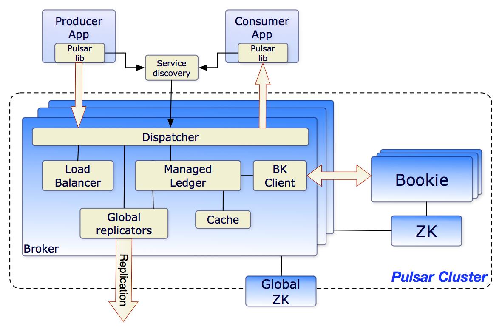

## Introduction

[Pulsar](https://pulsar.apache.org) is a distributed pub-sub messaging platform with a very flexible messaging model and an intuitive client API.

## Architecture

At the highest level, a Pulsar instance is composed of one or more Pulsar clusters.
Clusters within an instance can replicate data amongst themselves.

In a Pulsar cluster:

- One or more brokers handles and load balances incoming messages from producers, dispatches messages to consumers, communicates with the Pulsar configuration store to handle various coordination tasks,
  stores messages in BookKeeper instances (aka bookies), relies on a cluster-specific ZooKeeper cluster for certain tasks, and more.
- [BookKeeper](/docs/CS/BooKeeper/BooKeeper.md) cluster consisting of one or more bookies handles persistent storage of messages.
- [ZooKeeper](/docs/CS/Java/ZooKeeper/ZooKeeper.md) cluster specific to that cluster handles coordination tasks between Pulsar clusters.

The diagram below illustrates a Pulsar cluster:



At the broader instance level, an instance-wide ZooKeeper cluster called the configuration store handles coordination tasks involving multiple clusters, for example, [geo-replication](https://pulsar.apache.org/docs/next/concepts-replication).

## Model

### Topic

PartitionedTopic

- NonPartitionedTopic -- only one partition

Persistent

```java
public class LookupProxyHandler {
    public void handleLookup(CommandLookupTopic lookup) {
        if (log.isDebugEnabled()) {
            log.debug("Received Lookup from {}", clientAddress);
        }
        long clientRequestId = lookup.getRequestId();
        if (lookupRequestSemaphore.tryAcquire()) {
            try {
                lookupRequests.inc();
                String serviceUrl = getBrokerServiceUrl(clientRequestId);
                if (serviceUrl != null) {
                    performLookup(clientRequestId, lookup.getTopic(), serviceUrl, false, 10);
                }
            } finally {
                lookupRequestSemaphore.release();
            }
        } else {
            rejectedLookupRequests.inc();
            if (log.isDebugEnabled()) {
                log.debug("Lookup Request ID {} from {} rejected - {}.", clientRequestId, clientAddress,
                        throttlingErrorMessage);
            }
            proxyConnection.ctx().writeAndFlush(Commands.newLookupErrorResponse(ServerError.ServiceNotReady,
                    throttlingErrorMessage, clientRequestId));
        }

    }

    private void performLookup(long clientRequestId, String topic, String brokerServiceUrl, boolean authoritative,
                               int numberOfRetries) {
        if (numberOfRetries == 0) {
            proxyConnection.ctx().writeAndFlush(Commands.newLookupErrorResponse(ServerError.ServiceNotReady,
                    "Reached max number of redirections", clientRequestId));
            return;
        }

        URI brokerURI;
        try {
            brokerURI = new URI(brokerServiceUrl);
        } catch (URISyntaxException e) {
            proxyConnection.ctx().writeAndFlush(
                    Commands.newLookupErrorResponse(ServerError.MetadataError, e.getMessage(), clientRequestId));
            return;
        }

        InetSocketAddress addr = InetSocketAddress.createUnresolved(brokerURI.getHost(), brokerURI.getPort());
        if (log.isDebugEnabled()) {
            log.debug("Getting connections to '{}' for Looking up topic '{}' with clientReq Id '{}'", addr, topic,
                    clientRequestId);
        }
        proxyConnection.getConnectionPool().getConnection(addr).thenAccept(clientCnx -> {
            // Connected to backend broker
            long requestId = proxyConnection.newRequestId();
            ByteBuf command;
            command = Commands.newLookup(topic, authoritative, requestId);

            clientCnx.newLookup(command, requestId).whenComplete((r, t) -> {
                if (t != null) {
                    log.warn("[{}] Failed to lookup topic {}: {}", clientAddress, topic, t.getMessage());
                    proxyConnection.ctx().writeAndFlush(
                            Commands.newLookupErrorResponse(getServerError(t), t.getMessage(), clientRequestId));
                } else {
                    String brokerUrl = connectWithTLS ? r.brokerUrlTls : r.brokerUrl;
                    if (r.redirect) {
                        // Need to try the lookup again on a different broker
                        performLookup(clientRequestId, topic, brokerUrl, r.authoritative, numberOfRetries - 1);
                    } else {
                        // Reply the same address for both TLS non-TLS. The reason
                        // is that whether we use TLS
                        // and broker is independent of whether the client itself
                        // uses TLS, but we need to force the
                        // client
                        // to use the appropriate target broker (and port) when it
                        // will connect back.
                        if (log.isDebugEnabled()) {
                            log.debug(
                                    "Successfully perform lookup '{}' for topic '{}' with clientReq Id '{}' and lookup-broker {}",
                                    addr, topic, clientRequestId, brokerUrl);
                        }
                        proxyConnection.ctx().writeAndFlush(Commands.newLookupResponse(brokerUrl, brokerUrl, true,
                                LookupType.Connect, clientRequestId, true /* this is coming from proxy */));
                    }
                }
                proxyConnection.getConnectionPool().releaseConnection(clientCnx);
            });
        }).exceptionally(ex -> {
            // Failed to connect to backend broker
            proxyConnection.ctx().writeAndFlush(
                    Commands.newLookupErrorResponse(getServerError(ex), ex.getMessage(), clientRequestId));
            return null;
        });
    }
}
```

Ledger Fragment

Bundle -> multi-topics

```java
public class BundleData {
  // Short term data for this bundle. The time frame of this data is
  // determined by the number of short term samples
  // and the bundle update period.
  private TimeAverageMessageData shortTermData;

  // Long term data for this bundle. The time frame of this data is determined
  // by the number of long term samples
  // and the bundle update period.
  private TimeAverageMessageData longTermData;

  // number of topics present under this bundle
  private int topics;
}
```

#### CompactedTopic

view to latest messages of topic keys.
though append null like delete

## Brokers

The Pulsar message broker is a stateless component that's primarily responsible for running two other components:

* An HTTP server that exposes a REST API for both administrative tasks and [topic lookup](https://pulsar.apache.org/docs/next/concepts-clients#client-setup-phase) for producers and consumers.
* The producers connect to the brokers to publish messages and the consumers connect to the brokers to consume the messages.
* A dispatcher, which is an asynchronous TCP server over a custom binary protocol used for all data transfers

Messages are typically dispatched out of a [managed ledger](https://pulsar.apache.org/docs/next/concepts-architecture-overview#managed-ledgers) cache for the sake of performance, *unless* the backlog exceeds the cache size.
If the backlog grows too large for the cache, the broker will start reading entries from BookKeeper.

Finally, to support geo-replication on global topics, the broker manages replicators that tail the entries published in the local region and republish them to the remote region using the Pulsar Java client library.

## Clusters

A Pulsar instance consists of one or more Pulsar  *clusters* . Clusters, in turn, consist of:

* One or more Pulsar [brokers](https://pulsar.apache.org/docs/next/concepts-architecture-overview#brokers)
* A ZooKeeper quorum used for cluster-level configuration and coordination
* An ensemble of bookies used for [persistent storage](https://pulsar.apache.org/docs/next/concepts-architecture-overview#persistent-storage) of messages

Clusters can replicate among themselves using [geo-replication](https://pulsar.apache.org/docs/next/concepts-replication).XCon

> For a guide to managing Pulsar clusters, see the [clusters](https://pulsar.apache.org/docs/next/admin-api-clusters) guide.

## Metadata store

The Pulsar metadata store maintains all the metadata of a Pulsar cluster, such as topic metadata, schema, broker load data, and so on.
Pulsar uses [Apache ZooKeeper](https://zookeeper.apache.org/) for metadata storage, cluster configuration, and coordination.
The Pulsar metadata store can be deployed on a separate ZooKeeper cluster or deployed on an existing ZooKeeper cluster.
You can use one ZooKeeper cluster for both Pulsar metadata store and BookKeeper metadata store.
If you want to deploy Pulsar brokers connected to an existing BookKeeper cluster, you need to deploy separate ZooKeeper clusters for Pulsar metadata store and BookKeeper metadata store respectively.

> Pulsar also supports more metadata backend services, including [etcd](/docs/CS/Distributed/etcd.md) and [RocksDB](/docs/CS/DB/RocksDB/RocksDB.md) (for standalone Pulsar only).

In a Pulsar instance:

* A configuration store quorum stores configuration for tenants, namespaces, and other entities that need to be globally consistent.
* Each cluster has its own local ZooKeeper ensemble that stores cluster-specific configuration and coordination such as which brokers are responsible for which topics as well as ownership metadata, broker load reports, BookKeeper ledger metadata, and more.

## Configuration store

The configuration store maintains all the configurations of a Pulsar instance, such as clusters, tenants, namespaces, partitioned topic-related configurations, and so on.
A Pulsar instance can have a single local cluster, multiple local clusters, or multiple cross-region clusters. Consequently, the configuration store can share the configurations across multiple clusters under a Pulsar instance.
The configuration store can be deployed on a separate ZooKeeper cluster or deployed on an existing ZooKeeper cluster.

## Persistent storage

Pulsar provides guaranteed message delivery for applications. If a message successfully reaches a Pulsar broker, it will be delivered to its intended target.

This guarantee requires that non-acknowledged messages are stored durably until they can be delivered to and acknowledged by consumers. This mode of messaging is commonly called  *persistent messaging* .
In Pulsar, N copies of all messages are stored and synced on disk, for example, 4 copies across two servers with mirrored [RAID](https://en.wikipedia.org/wiki/RAID) volumes on each server.

### Apache BookKeeper

Pulsar uses a system called [Apache BookKeeper](http://bookkeeper.apache.org/) for persistent message storage.
BookKeeper is a distributed [write-ahead log](https://en.wikipedia.org/wiki/Write-ahead_logging) (WAL) system that provides several crucial advantages for Pulsar:

* It enables Pulsar to utilize many independent logs, called [ledgers](https://pulsar.apache.org/docs/next/concepts-architecture-overview#ledgers). Multiple ledgers can be created for topics over time.
* It offers very efficient storage for sequential data that handles entry replication.
* It guarantees read consistency of ledgers in the presence of various system failures.
* It offers even distribution of I/O across bookies.
* It's horizontally scalable in both capacity and throughput. Capacity can be immediately increased by adding more bookies to a cluster.
* Bookies are designed to handle thousands of ledgers with concurrent reads and writes.
* By using multiple disk devices---one for journal and another for general storage--bookies can isolate the effects of reading operations from the latency of ongoing write operations.

In addition to message data, *cursors* are also persistently stored in BookKeeper.
Cursors are [subscription](https://pulsar.apache.org/docs/next/reference-terminology#subscription) positions for [consumers](https://pulsar.apache.org/docs/next/reference-terminology#consumer).
BookKeeper enables Pulsar to store consumer position in a scalable fashion.

At the moment, Pulsar supports persistent message storage. This accounts for the `persistent` in all topic names. Here's an example:

```http
persistent://my-tenant/my-namespace/my-topic
```

> Pulsar also supports ephemeral ([non-persistent](https://pulsar.apache.org/docs/next/concepts-messaging.md#non-persistent-topics.md)) message storage.

You can see an illustration of how brokers and bookies interact in the diagram below:

### Ledgers

A ledger is an append-only data structure with a single writer that is assigned to multiple BookKeeper storage nodes, or bookies. Ledger entries are replicated to multiple bookies.
Ledgers themselves have very simple semantics:

* A Pulsar broker can create a ledger, append entries to the ledger, and close the ledger.
* After the ledger has been closed---either explicitly or because the writer process crashed---it can then be opened only in read-only mode.
* Finally, when entries in the ledger are no longer needed, the whole ledger can be deleted from the system (across all bookies).

#### Ledger read consistency

The main strength of Bookkeeper is that it guarantees read consistency in ledgers in the presence of failures.
Since the ledger can only be written to by a single process, that process is free to append entries very efficiently, without need to obtain consensus.
After a failure, the ledger will go through a recovery process that will finalize the state of the ledger and establish which entry was last committed to the log.
After that point, all readers of the ledger are guaranteed to see the exact same content.

#### Managed ledgers

Given that Bookkeeper ledgers provide a single log abstraction, a library was developed on top of the ledger called the *managed ledger* that represents the storage layer for a single topic.
A managed ledger represents the abstraction of a stream of messages with a single writer that keeps appending at the end of the stream and multiple cursors that are consuming the stream, each with its own associated position.

Internally, a single managed ledger uses multiple BookKeeper ledgers to store the data. There are two reasons to have multiple ledgers:

1. After a failure, a ledger is no longer writable and a new one needs to be created.
2. A ledger can be deleted when all cursors have consumed the messages it contains. This allows for periodic rollover of ledgers.

### Journal storage

In BookKeeper, *journal* files contain BookKeeper transaction logs.
Before making an update to a [ledger](https://pulsar.apache.org/docs/next/concepts-architecture-overview#ledgers), a bookie needs to ensure that a transaction describing the update is written to persistent (non-volatile) storage.
A new journal file is created once the bookie starts or the older journal file reaches the journal file size threshold (configured using the [`journalMaxSizeMB`](https://pulsar.apache.org/docs/next/reference-configuration.md#bookkeeper) parameter).

## Pulsar proxy

One way for Pulsar clients to interact with a Pulsar cluster is by connecting to Pulsar message brokers directly.
In some cases, however, this kind of direct connection is either infeasible or undesirable because the client doesn't have direct access to broker addresses.
If you're running Pulsar in a cloud environment or on [Kubernetes](https://kubernetes.io/) or an analogous platform, for example, then direct client connections to brokers are likely not possible.

The **Pulsar proxy** provides a solution to this problem by acting as a single gateway for all of the brokers in a cluster.
If you run the Pulsar proxy (which, again, is optional), all client connections with the Pulsar cluster will flow through the proxy rather than communicating with brokers.

> For the sake of performance and fault tolerance, you can run as many instances of the Pulsar proxy as you'd like.

Architecturally, the Pulsar proxy gets all the information it requires from ZooKeeper.
When starting the proxy on a machine, you only need to provide metadata store connection strings for the cluster-specific and instance-wide configuration store clusters.
Here's an example:

```bash
cd /path/to/pulsar/directory
bin/pulsar proxy \
--metadata-store zk:my-zk-1:2181,my-zk-2:2181,my-zk-3:2181 \
--configuration-metadata-store zk:my-zk-1:2181,my-zk-2:2181,my-zk-3:2181
```

> #### Pulsar proxy docs[](https://pulsar.apache.org/docs/next/concepts-architecture-overview#pulsar-proxy-docs "Direct link to heading")
>
> For documentation on using the Pulsar proxy, see the [Pulsar proxy admin documentation](https://pulsar.apache.org/docs/next/administration-proxy).

Some important things to know about the Pulsar proxy:

* Connecting clients don't need to provide *any* specific configuration to use the Pulsar proxy.
* You won't need to update the client configuration for existing applications beyond updating the IP used for the service URL (for example if you're running a load balancer over the Pulsar proxy).
* [TLS encryption](https://pulsar.apache.org/docs/next/security-tls-transport) and [authentication](https://pulsar.apache.org/docs/next/security-tls-authentication) is supported by the Pulsar proxy

## Client

Client instances are thread-safe and can be reused for managing multiple Producer, Consumer and Reader instances.

```java
PulsarClient client = PulsarClient.builder()                             
                            .serviceUrl("pulsar://broker:6650")                             
                            .build();

```

```java

public class PulsarClientImpl implements PulsarClient {

    protected final ClientConfigurationData conf;
    private LookupService lookup;
    private final ConnectionPool cnxPool;
    @Getter
    private final Timer timer;
    private boolean needStopTimer;
    private final ExecutorProvider externalExecutorProvider;
    private final ExecutorProvider internalExecutorService;
    private final boolean createdEventLoopGroup;
    private final boolean createdCnxPool;

    private final AtomicReference<State> state = new AtomicReference<>();
    // These sets are updated from multiple threads, so they require a threadsafe data structure
    private final Set<ProducerBase<?>> producers = Collections.newSetFromMap(new ConcurrentHashMap<>());
    private final Set<ConsumerBase<?>> consumers = Collections.newSetFromMap(new ConcurrentHashMap<>());

    private final AtomicLong producerIdGenerator = new AtomicLong();
    private final AtomicLong consumerIdGenerator = new AtomicLong();
    private final AtomicLong requestIdGenerator
            = new AtomicLong(ThreadLocalRandom.current().nextLong(0, Long.MAX_VALUE/2));

    protected final EventLoopGroup eventLoopGroup;
    private final MemoryLimitController memoryLimitController;
}
```

## Transaction

## Links

- [MQ](/docs/CS/MQ/MQ.md)

## References
