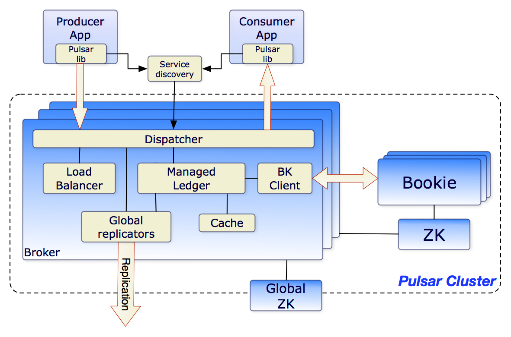

## Introduction

[Pulsar](https://pulsar.apache.org) 是一个分布式 pub-sub 消息平台，具有非常灵活的消息模型和直观的客户端 API。

## Architecture

在最高层面上，一个 Pulsar 实例由一个或多个 Pulsar 集群组成。
实例内的集群可以相互复制数据。

在一个 Pulsar 集群中：

- 一个或多个 broker 处理并负载均衡来自生产者的传入消息，将消息分发给消费者，与 Pulsar 配置存储通信以处理各种协调任务，
  在 BookKeeper 实例（又称 bookies）中存储消息，依赖特定集群的 ZooKeeper 集群处理某些任务等。
- [BookKeeper](/docs/CS/Framework/BooKeeper/BooKeeper.md) 集群由多个 bookie 组成，处理消息的持久化存储。
- 特定集群的 [ZooKeeper](/docs/CS/Framework/ZooKeeper/ZooKeeper.md) 集群处理 Pulsar 集群之间的协调任务。

下图展示了一个 Pulsar 集群：



在更广泛的实例级别，一个实例范围的 ZooKeeper 集群称为配置存储，处理涉及多个集群的协调任务，例如 [geo-replication](https://pulsar.apache.org/docs/next/concepts-replication)。

## Model

### Topic

PartitionedTopic

- NonPartitionedTopic -- 只有一个分区

Persistent

```java
package org.apache.pulsar.broker.service;

public class ServerCnx extends PulsarHandler implements TransportCnx {
  @Override
  protected void handleLookup(CommandLookupTopic lookup) {
    final long requestId = lookup.getRequestId();
    // ...剩下代码保持不变
  }
}
```

```java
public class LookupProxyHandler {
    public void handleLookup(CommandLookupTopic lookup) {
        long clientRequestId = lookup.getRequestId();
        // ...剩下代码保持不变
    }
}
```

Ledger Fragment

Bundle -> 多个 topics

```java
public class BundleData {
  private TimeAverageMessageData shortTermData;
  private TimeAverageMessageData longTermData;
  private int topics;
}
```

#### CompactedTopic

topic 键的最新消息视图。
追加 null 类似删除。

## Brokers

Pulsar 消息 broker 是一个无状态组件，主要负责运行另外两个组件：

* 一个 HTTP 服务器，暴露 REST API 用于管理任务以及生产者和消费者的 [topic lookup](https://pulsar.apache.org/docs/next/concepts-clients#client-setup-phase)。
* 生产者连接到 brokers 以发布消息，消费者连接到 brokers 以消费消息。
* 一个 dispatcher，是基于自定义二进制协议的异步 TCP 服务器，用于所有数据传输。

消息通常从 [managed ledger](https://pulsar.apache.org/docs/next/concepts-architecture-overview#managed-ledgers) 缓存中分发以提高性能，*除非*积压超过缓存大小。
如果积压增长太大，broker 将开始从 BookKeeper 读取条目。

最后，为了支持全局 topic 的 geo-replication，broker 管理 replicators，这些 replicators 跟踪本地区域中发布的条目，并使用 Pulsar Java 客户端库将它们重新发布到远程区域。

## Clusters

一个 Pulsar 实例由一个或多个 Pulsar  **clusters** 组成。Clusters 依次由以下组成：

* 一个或多个 Pulsar [brokers](https://pulsar.apache.org/docs/next/concepts-architecture-overview#brokers)
* 一个 ZooKeeper quorum，用于集群级别的配置和协调
* 一组 bookies，用于消息的 [持久存储](https://pulsar.apache.org/docs/next/concepts-architecture-overview#persistent-storage)

集群之间可以使用 [geo-replication](https://pulsar.apache.org/docs/next/concepts-replication) 进行复制。

> 有关管理 Pulsar 集群的指南，请参阅 [clusters](https://pulsar.apache.org/docs/next/admin-api-clusters) 指南。

## Metadata store

Pulsar 元数据存储维护 Pulsar 集群的所有元数据，例如 topic 元数据、schema、broker 负载数据等。
Pulsar 使用 [Apache ZooKeeper](https://zookeeper.apache.org/) 进行元数据存储、集群配置和协调。
Pulsar 元数据存储可以部署在单独的 ZooKeeper 集群上，也可以部署在现有的 ZooKeeper 集群上。
你可以使用一个 ZooKeeper 集群同时用于 Pulsar 元数据存储和 BookKeeper 元数据存储。
如果你希望将 Pulsar brokers 连接到现有的 BookKeeper 集群，你需要分别为 Pulsar 元数据存储和 BookKeeper 元数据存储部署单独的 ZooKeeper 集群。

> Pulsar 还支持更多的元数据后端服务，包括 [etcd](/docs/CS/Framework/etcd/etcd.md) 和 [RocksDB](/docs/CS/DB/RocksDB/RocksDB.md)（仅用于 standalone Pulsar）。

在一个 Pulsar 实例中：

* 配置存储 quorum 存储租户、命名空间和其他需要全局一致的配置。
* 每个集群拥有自己的本地 ZooKeeper 集合，存储特定于集群的配置和协调信息，例如哪些 broker 负责哪些 topic，以及所有权元数据、broker 负载报告、BookKeeper ledger 元数据等。

## Configuration store

配置存储维护 Pulsar 实例的所有配置，例如集群、租户、命名空间、分区 topic 相关配置等。
一个 Pulsar 实例可以有一个本地集群、多个本地集群或多个跨区域集群。因此，配置存储可以在 Pulsar 实例下的多个集群之间共享配置。
配置存储可以部署在单独的 ZooKeeper 集群上，也可以部署在现有的 ZooKeeper 集群上。

## Persistent storage

Pulsar 为应用程序提供有保证的消息投递。如果消息成功到达 Pulsar broker，它将被投递到预期目标。

这个保证要求未确认的消息被持久化存储，直到它们可以被投递给消费者并被确认。这种消息模式通常称为 **persistent messaging**。
在 Pulsar 中，所有消息的 N 个副本都存储在磁盘上并同步，例如，两台服务器上各有 4 个副本，每台服务器都有镜像 [RAID](https://en.wikipedia.org/wiki/RAID) 卷。

### Apache BookKeeper

Pulsar 使用称为 [Apache BookKeeper](http://bookkeeper.apache.org/) 的系统进行持久消息存储。
BookKeeper 是一个分布式 [write-ahead log](https://en.wikipedia.org/wiki/Write-ahead_logging) (WAL) 系统，为 Pulsar 提供了几个关键优势：

* 它使 Pulsar 能够利用许多独立的日志，称为 [ledgers](https://pulsar.apache.org/docs/next/concepts-architecture-overview#ledgers)。随着时间推移，可以为 topics 创建多个 ledgers。
* 它为处理条目复制的顺序数据提供了非常高效的存储。
* 它保证在各种系统故障情况下 ledgers 的读取一致性。
* 它在 bookies 之间提供 I/O 的均匀分布。
* 它在容量和吞吐量方面都是水平可扩展的。通过向集群添加更多 bookie，可以立即增加容量。
* Bookies 设计用于处理数千个具有并发读写的 ledgers。
* 通过使用多个磁盘设备——一个用于 journal，另一个用于通用存储——bookies 可以将读取操作的影响与正在进行的写入操作的延迟隔离开来。

除了消息数据，*cursors* 也持久存储在 BookKeeper 中。
Cursors 是 [consumers](https://pulsar.apache.org/docs/next/reference-terminology#consumer) 的 [subscription](https://pulsar.apache.org/docs/next/reference-terminology#subscription) 位置。
BookKeeper 使 Pulsar 能够以可扩展的方式存储消费者位置。

目前，Pulsar 支持持久消息存储。这体现在所有 topic 名称中的 `persistent`。例如：

```http
persistent://my-tenant/my-namespace/my-topic
```

> Pulsar 也支持临时（[non-persistent](https://pulsar.apache.org/docs/next/concepts-messaging.md#non-persistent-topics.md)）消息存储。

下面展示了 broker 和 bookie 如何交互：

### Ledgers

Ledger 是一个仅追加的数据结构，具有单一的写入者，分配给多个 BookKeeper 存储节点（bookies）。Ledger 条目被复制到多个 bookies。
Ledgers 本身具有非常简单的语义：

* Pulsar broker 可以创建 ledger、向 ledger 追加条目以及关闭 ledger。
* Ledger 关闭后——无论是显式关闭还是因为写入进程崩溃——它只能以只读模式打开。
* 最后，当 ledger 中的条目不再需要时，可以从系统中删除整个 ledger（跨所有 bookies）。

#### Ledger read consistency

Bookkeeper 的主要优势在于它保证在故障情况下的 ledger 读取一致性。
由于 ledger 只能由单个进程写入，该进程可以非常高效地追加条目，而无需获得共识。
在故障后，ledger 将经历恢复过程，该过程将最终确定 ledger 的状态并确定哪个条目是最后提交到日志的。
此后，ledger 的所有读者都保证看到完全相同的内容。

#### Managed ledgers

鉴于 Bookkeeper ledgers 提供了单一的日志抽象，在 ledger 之上开发了一个库，称为 *managed ledger*，它代表了单个 topic 的存储层。
Managed ledger 表示消息流的抽象，具有一个单一的写入者在流末尾持续追加，以及多个消费该流的 cursors，每个 cursor 都有自己的关联位置。

在内部，单个 managed ledger 使用多个 BookKeeper ledgers 来存储数据。使用多个 ledgers 有两个原因：

1. 故障后，ledger 不再可写，需要创建新的 ledger。
2. 当所有 cursors 都消费完 ledger 中包含的消息时，可以删除该 ledger。这允许定期轮换 ledgers。

### Journal storage

在 BookKeeper 中，*journal* 文件包含 BookKeeper 事务日志。
在对 [ledger](https://pulsar.apache.org/docs/next/concepts-architecture-overview#ledgers) 进行更新之前，bookie 需要确保描述更新的事务已写入持久（非易失性）存储。
当 bookie 启动或旧的 journal 文件达到 journal 文件大小阈值时，会创建新的 journal 文件（使用 [`journalMaxSizeMB`](https://pulsar.apache.org/docs/next/reference-configuration.md#bookkeeper) 参数配置）。

## Pulsar proxy

Pulsar 客户端与 Pulsar 集群交互的一种方式是直接连接到 Pulsar 消息 brokers。
然而，在某些情况下，这种直接连接可能不可行或不理想，因为客户端无法直接访问 broker 地址。
如果你在云环境或 [Kubernetes](https://kubernetes.io/) 或类似平台上运行 Pulsar，那么客户端与 broker 的直接连接可能不可行。

**Pulsar proxy** 通过充当集群中所有 broker 的单一网关来提供解决方案。
如果你运行 Pulsar proxy（同样，这是可选的），所有与 Pulsar 集群的客户端连接都将通过 proxy，而不是直接与 broker 通信。

> 为了性能和容错，你可以运行任意数量的 Pulsar proxy 实例。

在架构上，Pulsar proxy 从 ZooKeeper 获取所有所需信息。
在机器上启动 proxy 时，只需提供集群特定和实例范围的配置存储集群的元数据存储连接字符串。
示例如下：

```bash
cd /path/to/pulsar/directory
bin/pulsar proxy \
--metadata-store zk:my-zk-1:2181,my-zk-2:2181,my-zk-3:2181 \
--configuration-metadata-store zk:my-zk-1:2181,my-zk-2:2181,my-zk-3:2181
```

> #### Pulsar proxy docs
>
> 有关使用 Pulsar proxy 的文档，请参阅 [Pulsar proxy admin documentation](https://pulsar.apache.org/docs/next/administration-proxy)。

关于 Pulsar proxy 的一些重要事项：

* 连接客户端不需要提供*任何*特定配置来使用 Pulsar proxy。
* 除了更新用于服务 URL 的 IP 地址（例如，如果在 Pulsar proxy 上运行负载均衡器），你无需更新现有应用程序的客户端配置。
* Pulsar proxy 支持 [TLS encryption](https://pulsar.apache.org/docs/next/security-tls-transport) 和 [authentication](https://pulsar.apache.org/docs/next/security-tls-authentication)。

## Client

客户端实例是线程安全的，可以重用于管理多个 Producer、Consumer 和 Reader 实例。

```java
PulsarClient client = PulsarClient.builder()
                            .serviceUrl("pulsar://broker:6650")
                            .build();
```

```java
public class PulsarClientImpl implements PulsarClient {
    protected final ClientConfigurationData conf;
    private LookupService lookup;
    private final ConnectionPool cnxPool;
    @Getter
    private final Timer timer;
    private boolean needStopTimer;
    private final ExecutorProvider externalExecutorProvider;
    private final ExecutorProvider internalExecutorService;
    private final boolean createdEventLoopGroup;
    private final boolean createdCnxPool;
    private final AtomicReference<State> state = new AtomicReference<>();
    private final Set<ProducerBase<?>> producers = Collections.newSetFromMap(new ConcurrentHashMap<>());
    private final Set<ConsumerBase<?>> consumers = Collections.newSetFromMap(new ConcurrentHashMap<>());
    private final AtomicLong producerIdGenerator = new AtomicLong();
    private final AtomicLong consumerIdGenerator = new AtomicLong();
    private final AtomicLong requestIdGenerator
            = new AtomicLong(ThreadLocalRandom.current().nextLong(0, Long.MAX_VALUE/2));
    protected final EventLoopGroup eventLoopGroup;
    private final MemoryLimitController memoryLimitController;
}
```

## Transaction

## Links

- [MQ](/docs/CS/MQ/MQ.md)

## References
