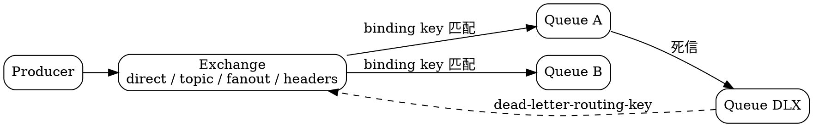

## Introduction

RabbitMQ 是用 Erlang/OTP 编写的一个开源消息代理（broker），以**队列模型**为中心：消息先进交换机（exchange），由交换机路由到一个或多个队列，消费者从队列取走。它不以吞吐量为首要目标，而是靠 **AMQP 协议的表达能力 + 灵活路由** 在金融、订单这类需要复杂路由规则的场景里占有一席之地。

> [!NOTE]
> **版本基线：4.3.6**（2026-09-14 发布），社区支持至 2026-11-30。本文所有默认值与行为均以 `rabbitmq-server` 源码常量（`deps/rabbit/src/`）为准核实，不是从博客或记忆推的。
>
> **4.3 是一次大版本**：4.3.0（2026-04-23）把元数据存储从 Mnesia 换成 **Khepri**（Raft），移除 CQv1 存储引擎与全部网络分区处理策略，最低要求 **Erlang/OTP 27.0**。4.2 与 4.1 的社区支持均已终止。

四条最容易记错的主线，先摆在这里，后面每一条都会展开：

1. **RabbitMQ 的 exchange 不止四种** —— 4.3 有 4 个 core 类型 + 2 个 core 内的 `x-*` 类型 + 至少 5 个插件类型。
2. **`consumer_timeout` 从 4.3 起只对 quorum queue 生效** —— classic 与 stream 永不评估它。默认值仍是 1800000 ms。
3. **过期消息只在到达队首时才被丢弃** —— 堆积在未过期消息后面的过期消息**继续占内存/磁盘并计入队列统计**。
4. **磁盘告警没有四档 watermark** —— 4.3 只有 `disk_free_limit`（默认 50 MB）单阈值，另加内存的 `vm_memory_high_watermark`。

```shell
# 单节点最小可跑
docker run -d -p 5672:5672 -p 15672:15672 \
  -e RABBITMQ_DEFAULT_VHOST=/my_vhost \
  -e RABBITMQ_DEFAULT_USER=admin -e RABBITMQ_DEFAULT_PASS=admin123456 \
  --name rabbitmq rabbitmq:4.3.6-management
```

### Positioning and Trade-offs

| | RabbitMQ 4.3 | Kafka 4.3 | RocketMQ 5.5 |
| --- | --- | --- | --- |
| 模型 | **队列**（消费即出队） | 分区日志（按offset 读） | 队列 / 分区日志 |
| 路由能力 | **最强**（exchange + binding + header 匹配） | 几乎无（只有分区选择） | Tag / SQL92 |
| 吞吐 | 低（单条消息优化，不支持批量） | **极高**（批量 + 顺序写） | 高 |
| 存储 | 内存优先，空间不足才落盘 | 磁盘顺序写 | mmap commitlog |
| 消费位点 | **无**（投递即移除，不能重放） | 有offset | 有位点 |
| 扩展方式 | 纵向（换更强硬件） | 加 partition | 加 broker，topic 多也不掉性能 |

**选择 RabbitMQ 的判据**：业务需要按内容路由（同一 topic 下不同下游只收自己关心的消息）、需要 header 过滤、需要低延迟的短平快任务分发、队列数量可控。**不该选它的判据**：需要高吞吐、需要重放历史、需要海量 topic。

> [!TIP]
> 它的路由能力有代价：每条消息都要过 exchange 路由 + binding 匹配，而 Kafka/RocketMQ 走的是分区直连。这也是它吞吐上不去的根本原因，而非单纯的实现效率问题。

## Exchange and Routing

核心心智一句话：**生产者从不直接把消息发到队列**，甚至往往不知道消息最终会不会被投递出去。交换机决定把消息推到哪里去。



### Type List: More Than Four

core 内置4 种（全部在 `rabbit_exchange_type_*.erl` 中注册）：

| 类型 | 路由方式 |
| --- | --- |
| `direct` | routing key **完全相等** |
| `topic` | routing key 按 `.` 分段，**通配符**匹配 |
| `fanout` | 忽略 routing key，广播到所有绑定队列 |
| `headers` | 按消息 **header** 匹配，不看routing key |

4.3 另有两个 **`x-*` 类型在 core 内**（不是插件）：

- `x-modulus-hash` —— 4.3 从 `rabbitmq_sharding` 插件**移入 core** 并重写
- `x-local-random` —— 本节点内随机投递

插件提供的类型（至少 5 个）：`x-consistent-hash`、`x-jms-topic`、`x-random`、`x-recent-history`、`x-federation-upstream`。

> [!WARNING]
> 「RabbitMQ 有四种 exchange 类型」是过时认知。但 `headers` **仍在**，且每个 vhost 会预声明两个实例 `amq.match` 与 `amq.headers` —— 源码注释刻意区分了它们分别来自 AMQP 0-9-1 的 PDF 与 XML 规范。

### Special Semantics of default exchange

每个 vhost 预声明 7 个 exchange，其中最特殊的是**空字符串名**的default exchange（`rabbit_vhost.erl:265-273`）：

- 类型是 `direct`，因此 routing key 必须**等于队列名**
- **禁止绑定到它**（会得到 `access_refused "operation not permitted on the default exchange"`）
- `amq.` 前缀的实体**禁止删除**；但在创建时被拒绝（passive 或已存在时豁免）

### Boundaries of topic Wildcards

`*` 匹配**恰好一个** segment，`#` 匹配**零个或多个**：

| binding key | `regions.na.cities.toronto` | `regions.na.cities` | `audit.events.users.signup` |
| --- | --- | --- | --- |
| `regions.na.cities.*` | ✅ | ❌ | ❌ |
| `audit.events.#` | ❌ | ❌ | ✅ |
| `#` | ✅ | ✅ | ✅ |

注意 `audit.events.#` **能匹配 `audit.events`**（零个 segment），而 `*` 不能匹配空。这意味着 `#` 单独使用等价于 fanout。

```erlang
%% 4.3 新增硬限制：单个 binding key 最多 2 个 '#'
-define(MAX_HASH_WILDCARDS, 2).
```

超出即得到 `binding_invalid`。源码注释说明了动机：MQTTv5 的 topic filter 最多一个 `#`，每多一个都成倍放大匹配开销（`rabbit_exchange_type_topic.erl:28-30, 52-61`）。

### x-match of headers Has Four Values

| `x-match` | 语义 |
| --- | --- |
| `all` | 所有**非 `x-` 前缀** header 都匹配（**未指定时的默认值**） |
| `any` | 任一匹配 |
| `all-with-x` | 所有 header 匹配，**包括** `x-` 前缀 |
| `any-with-x` | 任一匹配，包括 `x-` 前缀 |

> [!TIP]
> `all-with-x` / `any-with-x` **在官方 exchanges 文档页查不到**，只出现在源码的校验错误信息里。默认的 `all`/`any` 会对 `x-` 前缀 header 直接 `skip`（`rabbit_exchange_type_headers.erl:54-66`）——想匹配 RabbitMQ 自己的内部 header，必须显式用 `-with-x` 变体。

### Two Easily Overlooked Capabilities

**Alternate Exchange（AE）**：**仅在无任何匹配 binding 时**才生效（`rabbit_exchange.erl:432-440` 的空结果分支）。它是唯一在 declare 时做参数等价性检查的 x-arg，且可以做成 policy 动态调整。典型用法是兜底：没被业务队列消费掉的消息进 AE，避免静默丢失。

**Exchange-to-Exchange binding**：允许把 exchange 直接绑到另一个 exchange。它**不是重新发布**，而是路由扩展，因此遵守源与目标两个 exchange 的类型——**目标 exchange 的 ingress 指标不会更新**（文档明确）。

## Queue Types

4.3 只注册了三种队列类型（`rabbit_queue_type.erl:864-868` 从registry 读取）：

| 类型 | 定位 | 复制 | 典型用途 |
| --- | --- | --- | --- |
| `classic` | **默认**，单副本 | 无（4.0 已移除经典镜像队列） | 一般业务队列 |
| `quorum` | **Raft 复制**，推荐 | 是 | 需要可靠复制的业务消息 |
| `stream` | 大吞吐追加写 | 是（本身就是 quorum 系统） | 日志/埋点、大流量管道 |

> [!IMPORTANT]
> `x-queue-version` **只接受 2** —— CQv1 存储引擎已在 4.3 彻底移除，源码树里连v1 文件都没有了。声明 v1 会得到 `unsupported queue version`。而 `x-queue-type: classic` 显式声明**仍然合法**。

### Queue Type Selection

- **默认选 quorum**：复制、内存开销可控、4.3 新增延迟重试。代价是 inherently 更高的延迟与更重的磁盘 I/O。
- **classic 的唯一实质优势**：支持 `x-max-priority`（上限 **255**）与 `auto-delete`。**默认消息优先级是 0**。
- **stream 只在纯追加场景选**：它**不支持** 非持久化、独占、TTL、队列长度限制（改用 retention）、消息优先级、DLX、队列过期（`x-expires`）。

> [!WARNING]
> **不要相信任何"quorum 比 classic 快 N 倍"的说法** —— 4.3 官方文档**没有给出任何量化数字**，只有定性表述，且其对比对象是 4.0 已移除的 classic mirrored queues，不是普通 classic queue。

### Raft Semantics of Quorum Queue

- 成员数默认 **3**（`quorum_cluster_size`），容忍 1 节点故障
- **性能在成员数 > 5 时明显下降**，官方**不建议超过 7 个节点**
- 投递给消费者的消息**始终走 leader**，leader 切换期间消费者收不到新消息
- 消息元数据**≥ 32 bytes/条**；设 TTL 时每条额外 +16 bytes
- WAL 默认最大 **512 MiB**，建议节点内存 ≥ 3× 有效 WAL 大小（高吞吐 4×）

4.3 新增的 quorum 能力：

| 能力 | 配置键 |
| --- | --- |
| **严格优先级**（固定 0–31） | 无需配置，`priority` 属性直接生效 |
| **延迟重试 + backoff** | `x-delayed-retry-type` / `-min` / `-max`（或 policy 同名键），type 取 `disabled`/`all`/`failed`/`returned` |
| **consumer timeout** | `x-consumer-timeout` 或 policy `consumer-timeout` |
| 连接断开超时 | `consumer_disconnected_timeout`（默认 **60 000 ms**） |

延迟重试的backoff 公式是 `delay = min(min_delay * delivery_count, max_delay)`。

> [!WARNING]
> **quorum 会静默忽略 `x-max-priority`** —— 从 classic 迁移时若保留该参数，不报错也不生效。另外 `max-priority` 对 quorum 是 **unsupported policy**（用 policy 设置会报错，用 x-arg 设置只是静默忽略）。未设 `priority` 的消息在 quorum 视为 **4**、在 classic 视为 **0**，迁移会让优先级分布发生变化。

### Poison Message and delivery-limit

`delivery-limit` 默认 **20**（源码常量 `DEFAULT_DELIVERY_LIMIT`），`-1` 可禁用；policy 与 x-arg 同时为正时取 **min**。

达到上限后的行为：**有 DLX 则死信，无 DLX 则直接丢弃**（`rabbit_fifo.erl:4171-4174`）。

> [!WARNING]
> 4.3 起判定基准从 `acquired-count` 改为 **`delivery-count`**。后果是 `basic.nack` 与 `modified(delivery-failed=false)` **不消耗** delivery-limit —— 可以无限返回。只有 `reject`、`modified(delivery-failed=true)`、连接/channel 崩溃才计入。照3.x/4.0 的 acquired-count 心智模型算出的重投次数在 4.3 是错的。

### Streams Queue

- **不需要 AMQP 1.0 客户端** —— 可以用 AMQP 0-9-1 客户端当普通队列用（只需用 consumer ack），也能绑定到任意 exchange
- 但官方**强烈推荐 stream protocol**（`rabbitmq_stream` 插件），因为只有它能拿到全部 stream 特性与最佳吞吐
- streams **内部以 AMQP 1.0 编码存储**，所以 AMQP 0-9-1 消息中 header 里的数组/表等复合值**不会被转换**（header 存为 application properties，只支持简单类型）
- 消费**必须设 QoS prefetch**，ack 机制推进 offset
- 默认 `x-stream-max-segment-size-bytes = 500000000`（500 MB），`x-stream-filter-size-bytes = 16`（16–255）
- ⚠️ 这两个参数**即使 policy 变更也不会应用到已存在的 stream**，只在**声明时**有 policy 才生效 → **只用 queue argument 配置**
- stream 是 quorum 系统，官方建议集群**各节点数一致**

## Consumption and Flow Control

### prefetch

AMQP 规范层默认 **0 = 无限**（不限流）。这是**服务端**配置键 `default_consumer_prefetch` 的默认值，源码是 `{false, 0}`。

- **`prefetch_size != 0` 不支持**，直接报错
- `global_qos` 已 deprecated，4.3 起 `denied_by_default`

> [!TIP]
> prefetch 是 RabbitMQ 最有效的背压手段。配合 `x-single-active-consumer`（classic 与 quorum 均支持，默认 false）可以实现「一份顺序消费 + 多份并发处理」的组合。

### consumer_timeout

默认 `1800000` ms（30 分钟），**单位是毫秒**，schema 只校验正整数不校验下限。每1 分钟周期性检查一次，**低于 1 分钟不支持、低于 5 分钟不推荐**。

超时后的行为按协议分叉：

| 协议 | 超时后 |
| --- | --- |
| AMQP 0-9-1（支持 `consumer_cancel_notify`） | 取消该 consumer，消息回队 |
| AMQP 0-9-1（不支持） | **channel 以 `PRECONDITION_FAILED` 关闭**，该 channel 上**所有 consumer 的所有未确认消息全部回队** |
| AMQP 1.0 | `DISPOSITION(state=released)`，不 detach link |
| MQTT | 结束该订阅 |

超时**只增加 `acquired-count`，不消耗 `delivery-limit`**。

> [!WARNING]
> **classic queue 与 stream 从 4.3 起永不评估 consumer timeout** —— 给它们配了不会生效，监控不到任何超时。这不是客户端 bug，是配置无效。
>
> 另外在 `advanced.config` 里把它设成 `undefined` 等于禁用，官方**不推荐**。

### multiple Parameter Pitfall of nack/ack

这是最容易造成生产事故的一个细节。源码 `collect_acks`（`rabbit_channel.erl:2002-2022`）遍历的是**channel 级** `unacked_message_q`，**不是某个 consumer 的队列**：

- `multiple=true` + tag=N → 确认该 **channel** 上所有 tag ≤ N 的消息，**跨 consumer、跨 queue**
- `multiple=true` + tag=0 → 确认该 channel 上**一切**（源码注释显式标注这是 AMQP 0-9-1 规范特例）

```erlang
%% The special case for 0 comes from the AMQP 0-9-1 spec: if the multiple field
%% is set to 1 (true), and the delivery tag is 0, this indicates
%% acknowledgement of all outstanding messages (by a client).
collect_acks(UAMQ, 0, true) ->
    {lists:reverse(?QUEUE:to_list(UAMQ)), ?QUEUE:new()};
```

> [!WARNING]
> 同一 channel 上开多个 consumer 时，误用 `multiple` 会**连带确认其他 consumer 的消息**。settle 顺序是 oldest-first（tag 升序）。

## Message Lifetime and Dead-letter

### Two Types of TTL Approaches

| 方式 | 配置 | 说明 |
| --- | --- | --- |
| 按队列 | policy `message-ttl` / x-arg `x-message-ttl` | 非负整数，**毫秒** |
| 按消息 | AMQP 属性 `expiration` | 字符串形式的数字；两者同时存在取**较小值** |

`x-message-ttl = 0` → 消息到达队列即过期（除非能立即投递给 consumer），**不产生 `basic.return`**；若配了 DLX 则会死信。

> [!WARNING]
> **过期消息只在到达队首时才被丢弃**。这意味着：
> - 过期消息会**堆积在未过期消息后面**，占用的内存/磁盘**不释放**
> - 它们**照常计入队列统计**
> - 存在天然竞态：消息可能在写入 socket 后、到达 consumer 前才过期
>
> 所以「队列深度持续增长但 TTL 已过」是**正常行为，不是泄漏**。想让资源立即释放要么 purge，要么改用队列级 TTL。

### DLX and Dead-letter Header

- DLX **就是普通 exchange**，按普通方式声明
- **x-arg 优先于 policy**
- 未设 `dead-letter-routing-key` → 使用消息原始的**全部** routing keys（含 CC，不含 BCC）
- 设了 → 改写为该 key，且 **`CC` header 被移除**
- **DLX 不存在 → 消息静默丢弃**（quorum 侧只打 WARN）
- 死信时TTL 被移除，防止在后续队列再次过期
- requeue 会**保留原始过期时间**
- reason 四值：`rejected`、`expired`、`maxlen`、`delivery_limit`

声明队列时需要同时具备：队列的 configure + 队列的 read + DLX 的 **write** 权限。

**quorum 的 at-least-once 死信**：

| 配置 | 默认 | 说明 |
| --- | --- | --- |
| `dead-letter-strategy` | `at-most-once` | 4.3 新增 at-least-once，保留消息直到目标确认 |
| `overflow` | `drop-head` | quorum **不支持** `reject-publish-dlx` |
| `max-length` / `max-length-bytes` | **无默认**（不设即不限） | `reject-publish` 也非严格上限，至少可能超出 1 条 |

> [!WARNING]
> **只配 `dead-letter-strategy: at-least-once` 而忘了改 `overflow=reject-publish`，会打 WARN 并静默回退为 at-most-once** —— 配置「看起来生效了」，实际保证等级低一档。从 at-least-once 切回 at-most-once 会**删除所有未被目标确认的死信**。

### Dead-letter Loop Detection

有cycle 检测，但**只在「全自动循环」时丢弃消息**：循环路径上任何一次死信原因是 `rejected`（即客户端显式reject 过）就不丢，把打破循环的责任交给应用（`mc.erl:493-507`）。

### Difference Between x-expires and auto-delete

| 维度 | `x-expires` | `auto-delete` |
| --- | --- | --- |
| 触发条件 | 队列**未被使用**达指定时长 | 队列**曾有消费者、且最后一个消费者断开** |
| 粒度 | 毫秒，**必须正整数，不能为 0** | 即时 |
| 重新 declare | **续租** | 不适用 |
| `basic.get` | 会刷新 lease | 不适用 |
| 默认 | **无默认** | false |

**队列 TTL 只对 transient（非 durable）classic queue 有意义**，streams **不支持过期**。且队列整体到期时，里面的消息**不会死信**。

## Cluster and Metadata

### Khepri: Architectural Change in 4.3

4.3 起**Khepri 成为唯一的元数据存储**，彻底替代 Mnesia（自动迁移，一次性操作）。它的 Raft 语义决定了集群行为：

- **需要多数节点在线**才能接受写/删/成员变更 —— 不只是网络分区，多数节点停机也一样
- **脑裂时少数派侧操作直接超时**，没有 pause/autoheal 可选
- 该策略**不可配置**，是 Raft 算法本身的设计

> [!WARNING]
> **一致性有真实差异**：Khepri 在**多数节点**提交即返回，Mnesia 是全部节点。所以拓扑变更后立刻从另一节点发布，消息**不保证被路由**。官方给的缓解手段是启动时声明拓扑后注入 1–2 秒暂停、用静态拓扑、或单连接。
>
> 读取按组件分两类：多数读走本地 cache（最终一致）；**线性一致读走 leader**，新 leader 选出前会暂停。

### Relationship with vhost

| 组件 | 说明 |
| --- | --- |
| **元数据（Khepri）** | vhost/队列/exchange/binding/权限/策略 —— Raft 复制，**多数派才能写** |
| **quorum queue** | 队列消息 —— 独立 Raft 组，始终经 leader |
| **stream** | 队列消息 —— 独立 Raft 组，consumer **可从任意 replica 读**，不受 leader 切换影响 |
| **经典镜像队列** | 4.0 已移除 |

### Node Join and Removal

- **加入**：peer discovery 自动，或 `cluster_formation.peer_discovery_backend` 配置；空白节点「加入第一个可达 peer 的集群」
- **移除**：在**仍存在的成员**上执行 `rabbitmqctl forget_cluster_node`
- **重置过的节点必须先从集群移除**，否则会成为幽灵成员
- 未知节点清理默认**仅告警**（`only_log_warning = true`）；改成 `false` 会强制清理，但**清理后无法再 rejoined**
- 4.3 的 `forget_cluster_node` 行为变更：先移除 quorum/stream 成员，再离开元数据集群

### Disk and Memory Thresholds

> [!IMPORTANT]
> **4.3 没有四档 watermark**，只有两个单阈值：

| 配置 | 默认 | 说明 |
| --- | --- | --- |
| `disk_free_limit` | **50 000 000 字节（50 MB）** | 支持绝对值与相对 RAM（`{mem_relative, 2.0}`），同设则 absolute 优先 |
| `vm_memory_high_watermark` | 示例 0.6 | 相对值 |

已失效的配置：`vm_memory_high_watermark_paging_ratio` 与 `memory_monitor_interval` 都标注 **DEPRECATED，4.0 起不再使用**；`vm_memory_low_watermark` 在 4.3 **根本不存在**。

**文件描述符**：官方不给固定推荐值，规则是**连接数 × 1.5**（如支撑 10 万连接则设15 万）。提高 OS 上限时**必须同步提高 `ERL_MAX_PORTS`**，检查用 `rabbitmqctl eval 'erlang:system_info(port_limit).'`。

### Monitoring

- **Prometheus 默认端口 15692**（专用 TCP 端口）
- `prometheus.return_per_object_metrics` 默认 **false**（设 true 可能产生极大响应）
- `/metrics/per-object` 始终返回 per-object，不受上述配置影响
- `/metrics/detailed` **默认不返回任何指标**，需显式传 `family`/`vhost`/`queue`；`queue` 参数**最多一个**，值为正则。相比 per-object 最高可提升约 60 倍效率
- `vhost_status`、`exchange_names`、`exchange_bindings` 是 cluster-wide，**不得跨节点聚合**
- 4.3 管理 UI 新增 **Linter**（评估配置、提示反模式）

### Federation and Shovel

两者都用于跨集群搬消息，但语义不同：

| 特性 | Shovel | Queue Federation |
| --- | --- | --- |
| 移动条件 | **无条件移动** | **仅当上游无本地consumer 时** |
| 方向 | 始终单向 | 可双向或多向（N 个集群） |
| 定义方式 | dynamic（runtime parameter，推荐）或 static（`advanced.config`） | upstream + policy |
| 变更生效 | dynamic 随时增删，无需重启 | policy 动态 |

选型判据：**要「消费者在哪边消息就在哪边」用 federation；无条件搬运、跨协议、跨产品用 shovel**。

> [!WARNING]
> **static shovel 与 dynamic shovel 的默认ack-mode 不同**，这是最隐蔽的一个坑：
> - **dynamic**（runtime parameter，推荐）默认 **`on-confirm`** → at-least-once
> - **static**（`advanced.config`）默认 **`no_ack`** → **at-most-once，可能丢消息**，且无任何告警
>
> 三个合法值：`on-confirm`（等publisher confirm）/ `on-publish`（重发即ack）/ `no-ack`（收到即ack）。
>
> 另一个坑：被目标端 reject 的消息，AMQP 0-9-1 与 local shovel 会**重新入队**，但 **AMQP 1.0 shovel 直接丢弃**。

**Federation 的已知局限**：一个集群同时只能应用一条 policy，N 条同优先级 policy 中**随机选一条** —— 启用 federation 的 policy **不保证是生效的那条**。缓解办法是显式区分优先级、避免 `--apply-to all`、用 dedicated policy。

**4.2 新增 `local` shovel**：不用任何协议，直接用内部 API 在本集群内消费/发布，只能用于声明它的那个集群。

## Protocol

| 协议 | 状态 | 关键说明 |
| --- | --- | --- |
| **AMQP 0-9-1** | 核心协议 | 被 RabbitMQ 多处扩展 |
| **AMQP 1.0** | 4.0 起成为 core protocol | 与 0-9-1 **线级完全不共享** |
| **MQTT** | 插件 | 原生支持 3.1 / 3.1.1 / 5.0 |
| **STOMP** | 插件 | 内部代理到 AMQP 0-9-1 |
| **Streams protocol** | 插件 | 官方强烈推荐 |
| **WebSocket** | AMQP 1.0 / MQTT / STOMP over WebSocket | 4.3 加了 Origin 校验 |
| **HTTP** | management 插件 | 仅诊断/低量消息，**无可靠投递** |

> [!TIP]
> STOMP 在 4.3 改用 **exclusive queue** —— 因为 transient non-exclusive 队列被默认禁用了。

4.3 的 AMQP 1.0 变更：Rejected outcome 含队列名与拒绝原因（`queue: <name>` / `reason: maxlen | unavailable`）、Single Active Consumer 状态变化用 flow frame 通知、重复 link handle 返回 `handle-in-use`。

## 4.3 Removal List

照旧资料写的最大风险在这里：

| 项 | 状态 |
| --- | --- |
| Mnesia 元数据存储 | **4.3 完全移除** |
| 网络分区处理策略（`pause_minority`/`autoheal` 等） | 4.3 移除，**且配置键在schema 中已完全不存在** |
| Classic Queue v1（`x-queue-version=1`） | 4.3 移除 |
| 经典镜像队列 | 4.0 移除 |
| `ram_node_type` | 4.3 移除 |
| `GET /api/auth` | 4.3 移除 |
| `rabbit_fifo_index` | 4.3 主状态机不再使用 |
| `global_qos` / `queue_master_locator` | 4.3 起 `denied_by_default` |
| `amqp_address_v1` / `amqp_filter_set_bug` | 4.3 起 `denied_by_default` |
| transient non-exclusive 队列 | 4.3 默认禁用 |
| Direct Reply-to 伪队列的 binding | 4.3 起被拒（此前静默接受） |
| 5 个 deprecated feature flag | 4.3 统一转为 `denied_by_default` |

> [!WARNING]
> **release notes 与源码不一致**：官方 4.3.0 release notes 说分区处理配置键「will be accepted by 4.3.0 nodes but won't have any effect」，但**源码实测已彻底移除** —— `rabbit.schema` 中无任何 `cluster_partition_handling` 映射，全树 grep 0 命中。写在 `rabbitmq.conf` 里不只是「无效」，可能导致配置校验失败。运维手册里「4.3 里保留这些键以备回退」的建议是错的。

**仍存在但已非元数据存储**：`rabbit_mnesia.erl` 源码文件还在（172 行），但它只提供 `is_virgin_node/0`、`dir/0` 等**迁移辅助函数**，另有 9 个 `*_m2k_converter.erl` 专用于 Mnesia → Khepri 数据迁移。

## Common Pitfalls List

1. **`max_ack_rtt` 不存在** —— 网上流传的「quorum queue 有 `max_ack_rtt` 默认 30s」在4.3.6 全树 grep **0 命中**，它不是合法 schema 键。真实机制是 `consumer_timeout`（30 min）+ `consumer_disconnected_timeout`（60 s）。
2. **`consumer_disconnected_timeout` 的 schema 注释是过时的** —— `rabbit.schema:1573` 的示例注释写 `10000`，**源码两处默认都是 `60_000`**。照注释改成 10000 是把60s 调小 6 倍，会导致分区恢复时消息被过快重投。
3. **`consumer_timeout` 单位是毫秒** —— 写成 `consumer_timeout = 30` 会得到 30 毫秒，且 schema 不校验下限，队列几乎必然持续超时。
4. **过期消息不释放资源** —— 见上文 E 节，队列深度增长是正常行为。
5. **`multiple=true` 跨 consumer 生效** —— 见上文 D 节，同 channel 多 consumer 时是事故源。
6. **at-least-once 死信静默回退** —— 忘了配 `overflow=reject-publish` 就退回at-most-once。
7. **static shovel 默认可能丢消息** —— `advanced.config` 里不写 `ack-mode` 就是 `no_ack`。
8. **`x-max-priority` 在 quorum 上静默失效** —— 且未设 priority 的消息默认值不同（quorum 4 / classic 0）。
9. **delivery-limit 计数基准 4.3 变了** —— nack 不再消耗它。
10. **stream 不需要 AMQP 1.0 客户端** —— 但 AMQP 0-9-1 的复合header 不会被转换。
11. **topic 超过 2 个 `#` 声明失败** —— 4.3 新增硬限制。
12. **`x-match` 有 `all-with-x` / `any-with-x` 两个文档未提的取值** —— 不指定时等价 `all`。
13. **磁盘告警没有四档 watermark** —— 只有 `disk_free_limit` 单阈值；`vm_memory_low_watermark` 不存在。
14. **`4.3.6` 起 shovel/federation 的 direct 连接也受 `channel_max_per_node` 限制** —— 之前认为该限制只作用于网络连接已过时。

## Links

- [消息系统（发布/订阅与消息代理）](/docs/CS/MQ/MQ.md?id=message-system)
- [消息代理与数据库的对比](/docs/CS/MQ/MQ.md?id=message-brokers)
- [消息投递语义（at-most-once / at-least-once / exactly-once）](/docs/CS/MQ/MQ.md?id=message-delivery-semantics)
- [死信队列与消息积压](/docs/CS/MQ/MQ.md?id=dead-letter-queues)
- [AMQP 0-9-1 协议结构与工作流（Spring AMQP 侧）](/docs/CS/Framework/Spring/AMQP.md)
- [Scheduled Task](/docs/CS/SE/Scheduled_Task.md)

## References

- https://www.rabbitmq.com/release-information
- https://www.rabbitmq.com/docs/quorum-queues
- https://www.rabbitmq.com/docs/consumers
- https://www.rabbitmq.com/docs/streams
- https://www.rabbitmq.com/docs/metadata-store/everyday-operations
- https://www.rabbitmq.com/docs/partitions