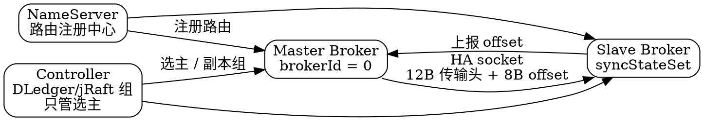

## Introduction

RocketMQ 的高可用复制经历了三代演进：**传统主从（socket 转发CommitLog）→ DLedger（Raft 接管 CommitLog）→ Controller（Raft 只管选主）**。5.x 的推荐路径是 Controller，而 DLedger 虽未删除但**已在源码中标记废弃**。

> [!NOTE]
> **版本基线：RocketMQ 5.5.1**（2026-08-20 发布）。本文所有类名、行号与默认值均以 `rocketmq-all-5.5.1` 源码核实。



> [!IMPORTANT]
> **最容易记错的一点：Controller 自身默认用的就是 DLedger 做 Raft，不是 jRaft。** 源码常量 `ControllerConfig.java:31` 是 `controllerType = DLEDGER_CONTROLLER`，jRaft 需要显式配置并额外提供 `jRaftInitConf` 与 `jRaftServerId`（`ControllerManager.java:104-107`）。

## 三代架构的开关与默认值

| 开关 | 默认值 | 位置 |
| --- | --- | --- |
| `enableControllerMode` | **`false`** | `BrokerConfig.java:366` |
| `enableDLegerCommitLog` | **`false`** | `MessageStoreConfig.java:290` |
| `brokerRole` | `ASYNC_MASTER` | `MessageStoreConfig.java:254` |

> [!WARNING]
> **5.x 默认既不开 Controller 也不开 DLedger**，HA 能力必须显式开启。
>
> 更反直觉的一点：**DLedger 模式与 Controller 模式是互斥的**，同时为 true 直接 `System.exit(-4)`（`BrokerStartup.java:216-218`）。

### DLedger 已废弃（源码知道，官方文档不知道）

```java
static final String DLEDGER_COMMIT_LOG_DEPRECATION_WARNING =
    "Broker DLedger mode is deprecated and may be removed in a future release. " +
        "Use Controller mode for new deployments.";
```

`BrokerStartup.java:47-49`，启动时由 `warnIfDLedgerCommitLogEnabled` 输出（同文件 `:258`）。

> [!WARNING]
> **官方 5.0 文档页（`/docs/bestPractice/02dledger`）完全没写 deprecation**，措辞仍是「部署指南」。**只有源码知道这件事** —— 写方案时不要基于该文档页做新决策。
>
> 另外常见的包路径错误：不存在 `org.apache.rocketmq.dledger` 这个包。真实位置是 `store/src/main/java/org/apache/rocketmq/store/dledger/` 与 `broker/.../broker/dledger/`，顶层模块列表中**没有** dledger 模块，它是外部依赖 `io.openmessaging.storage:dledger`。

### 启用 DLedger 的副作用

- **强制 `brokerId = -1`**：`if (messageStoreConfig.isEnableDLegerCommitLog()) { brokerConfig.setBrokerId(-1); }`（`BrokerStartup.java:211-213`）
- **不向 NameServer 注册**（`BrokerController.java:1976` 的条件含 `!isEnableDLegerCommitLog()`），路由改由 DLedger 组内自维护 —— **升级时极易踩的坑**
- 日志目录拼接 selfId：`brokerName + "_" + dLegerSelfId`

### Controller 模式

Controller 把 Raft 放在存储**之外**，只做选主与副本元数据管理。Broker 侧 HA 实现被替换为 `AutoSwitchHAService`（`DefaultMessageStore.java:1976-1988`）。

| 配置 | 默认值 | 说明 |
| --- | --- | --- |
| `controllerType` | `"DLedger"` | 可选 `jRaft` |
| `controllerDLegerPeers` | **无默认，必填** | 否则启动抛 `IllegalArgumentException`（`ControllerManager.java:117`） |
| `controllerDLegerSelfId` | **无默认，必填** | 同上（`:120`） |
| `controllerStorePath` | `""` | **有状态组件，日志目录不可随意删除** |
| `enableControllerInNamesrv` | `false` | 内嵌 NameServer（`NamesrvConfig.java:79`）或独立部署 `bin/mqcontroller` |
| `enableElectUncleanMaster` | `false` | 不会从 SyncStateSet 外选主，避免丢消息 —— 但落后副本也不会被提拔 |
| `electMasterMaxRetryCount` | `3` | |

**需要几个 Controller**：单副本也能完成选主，但切换能力本身无容错。要容错需**3 副本及以上**（Raft 多数派）。

> [!TIP]
> 官方给出的理由只有一句 "Use Controller mode for new deployments"，**没有成文的理由清单**。可观察到的结构性差异是：DLedger 把 Raft 塞进存储层（`DLedgerCommitLog` 接管 CommitLog，代价是 brokerId 被强制置 -1），Controller 则把 Raft 放在存储之外。这个差异应标注为推断，不要写成官方结论。

## 复制链路（5.5.1 源码级）

**关键事实：5.5.1 的 HA 复制通道完全没用 Netty**，仍是 store 模块里的裸 `java.nio`（`SocketChannel` + `Selector`）。Netty 4.1.130.Final 只用于 broker↔client 的 remoting 通道。

### 传输协议：12 字节头 + 8 字节裸 offset

```java
/**
 * physicOffset (8bytes) | bodySize (4bytes)
 */
public static final int TRANSFER_HEADER_SIZE = 8 + 4;
```

`DefaultHAConnection.java:35-48`。**5.5.1 的 HA 协议没有任何请求/响应命令类型** —— 网上（含 4.x 时代资料）常见的 `HACommand`、`GET_HISTORY_DATA`、`PUT_HISTORY_DATA` 全部**不存在**。

### 端到端流程

| 步骤 | 主体 | 位置 |
| --- | --- | --- |
| master 监听 `haListenPort` 接受 slave 连接 | `DefaultHAService.AcceptSocketService` | `DefaultHAService.java:289`（抽象内部类），子类 `:266` |
| master 读取 slave 上报的 8 字节 offset | `DefaultHAConnection.ReadSocketService` | `DefaultHAConnection.java:137` |
| master 转发 CommitLog 物理字节 | `WriteSocketService` | `DefaultHAConnection.java:334` |
| slave 收数据并落盘 | `DefaultHAClient.processReadEvent` → `dispatchReadRequest` | `DefaultHAClient.java:153`、`:184` |
| slave 上报 offset | `DefaultHAClient.reportSlaveMaxOffset` | `DefaultHAClient.java:110` |

> [!IMPORTANT]
> **`processReadEvent` 有两处**，很多人只找到一处：
> - `DefaultHAClient.java:153` —— **slave 侧**，读到 master 推来的 CommitLog 数据
> - `DefaultHAConnection.java:211` —— **master 侧**，读到 slave 上报的 8 字节 offset
>
> 而 `dispatchReadRequest` **只在 slave 侧存在**（master 侧没有此方法）。

### slave 首次连接的 offset 对齐（易错）

slave 首次上报 offset 为 0 时，master **不会从 0 开始发**，而是对齐到当前映射文件边界：

```java
if (0 == DefaultHAConnection.this.slaveRequestOffset) {
    long masterOffset = ...getCommitLog().getMaxOffset();
    masterOffset = masterOffset - (masterOffset % ...getMappedFileSizeCommitLog());
    if (masterOffset < 0) masterOffset = 0;
    this.nextTransferFromWhere = masterOffset;
```

`DefaultHAConnection.java:288-299`。这个对齐逻辑若理解错，会误判「复制丢数据」。

### 两个 master 地址，别搞混

`DefaultHAClient` 持有**两个** master 地址：

| 字段 | 语义 |
| --- | --- |
| `masterAddress` | master 的 **broker RPC 地址**（对端 `listenPort`） |
| `masterHaAddress` | master 的 **HA 复制地址**（对端 `haListenPort`） |

`DefaultHAClient.java:91`/`:101` 与 `:84`/`:97`。`DefaultHAService` 侧同样成对（`:79`、`:86`）。

## 类名纠错表

现存于其他笔记或网上的 4.x 时代说法，在 5.5.1 里的实际情况：

| 流传说法 | 5.5.1 实际情况 |
| --- | --- |
| `GroupSocketService` | **不存在** → `GroupTransferService`（`store/ha/GroupTransferService.java:38`） |
| `HousekeepingService` | **不存在** → 内联在 `DefaultHAConnection.ReadSocketService.run()`（`:165-169`）；相近职责类是 `HAConnectionStateNotificationService` |
| `reportSlaveMaxOffsetPlus` | **不存在** → `reportSlaveMaxOffset(long)`，无 `Plus` 后缀（`DefaultHAClient.java:110`） |
| `AcceptSocketService` / `ReadSocketService` 是独立类 | 都是**内部类**（`DefaultHAService.java:289`、`DefaultHAConnection.java:137`），4.x 曾扁平化 |
| `HACommand` / `GET_HISTORY_DATA` / `PUT_HISTORY_DATA` | 全部不存在 |
| `HAKernel` | 不存在 |
| `SlaveFallBehindMuch` | 不存在 → 是三套阈值机制（见下表） |
| `brokerClusterRole` | **不存在**，全树 grep 0 命中 |
| `Role` 枚举含 `ASYNC_SLAVE` | 枚举名是 `BrokerRole`，值只有 `ASYNC_MASTER` / `SYNC_MASTER` / `SLAVE` |
| `HAClient` 是复制主类 | 名字对，但它是**接口**（104 行），实现是 `DefaultHAClient`（411 行）；Controller 模式另有 `AutoSwitchHAClient` |

> [!TIP]
> `AcceptSocketService`/`ReadSocketService` 从 `ha/haservice/` 子包扁平化进内部类这一步发生在 4.x→5.x。若知识库中其他笔记引用了 `ha.haservice.AcceptSocketService` 这类全限定名，需一并订正。

## 三套落后阈值机制

`SlaveFallBehindMuch` 不存在，真实的是三套独立阈值：

| 机制 | 配置键 | 默认值 | 行为 |
| --- | --- | --- | --- |
| 偏移差 in-sync 判定 | `haMaxGapNotInSync` | `1024*1024*256`（256 MB） | `masterPutWhere - slaveAckOffset >= 阈值` 则该 slave 不计入 `inSyncReplicas`，可能使 `isSlaveOK` 返回 false |
| **时间落后踢出**（仅 Controller 模式） | `haMaxTimeSlaveNotCatchup` | `1000*15`（15 s） | 源码注释：超过则从 SyncStateSet 移除 |
| 连接心跳过期断开 | `haHousekeepingInterval` | `1000*20`（20 s） | master 侧 `ReadSocketService` 读超时即 `break` |

另有 `FlowMonitor` 流控（`haTransferBatchSize = 32768`，即 32 KB）与 `slaveTimeout = 3000` ms。

### 同步双写（SYNC_MASTER）

```java
private CompletableFuture<PutMessageStatus> handleHA(AppendMessageResult result,
        PutMessageResult putMessageResult, int needAckNums) {
    if (needAckNums >= 0 && needAckNums <= 1) {
        return CompletableFuture.completedFuture(PutMessageStatus.PUT_OK);
    }
    HAService haService = this.defaultMessageStore.getHaService();
    GroupCommitRequest request = new GroupCommitRequest(nextOffset,
            this.defaultMessageStore.getMessageStoreConfig().getSlaveTimeout(), needAckNums);
    haService.putRequest(request);
    haService.getWaitNotifyObject().wakeupAll();
    return request.future();
}
```

`CommitLog.java:1385-1400`。`GroupTransferService` 凑齐 `ackNums` 个副本确认后完成对应 future；Controller 模式额外用 `syncStateSet` 判定（`:97-111`）。

> [!WARNING]
> **`waitStoreMsgOK` 与同步双写不是一个开关**。它是 `Message` 的**消息属性**（`Message.java:43`/`:179`，常量 `MessageConst.PROPERTY_WAIT_STORE_MSG_OK`），不是 broker 配置键。同步双写由 `brokerRole=SYNC_MASTER` 触发（`DefaultMessageStore.java:2192-2193`），超时上限 `slaveTimeout=3000` ms。

## 三个易混概念

**`brokerClusterRole` 与 `brokerRole` 并存**这个前提在 5.5.1 中**不成立** —— `brokerClusterRole` 全树 grep 0 命中。正确的三个维度是：

| 概念 | 载体 | 含义 | 常见误配 |
| --- | --- | --- | --- |
| 集群角色 | **`brokerId`**（int） | `0` = master，非 0 = slave，判定用常量 `MixAll.MASTER_ID`（`BrokerController.java:1977`） | 手工改 `brokerId` 与既有数据目录不一致 |
| 复制角色 | **`brokerRole`**（枚举） | `ASYNC_MASTER` / `SYNC_MASTER` / `SLAVE` | **在 slave 上误配 `ASYNC_MASTER`** → `DefaultHAService.java:72-74` 的 `if (brokerRole == SLAVE)` 不成立，`haClient` 为 null，节点既不连 master 也不收复制 |
| 副本集合 | **`syncStateSet`**（Controller 模式运行时） | 计入同步确认的 slave 集合 | 落后超 `haMaxTimeSlaveNotCatchup`(15s) 被静默移出 |

第四个相关开关：`enableSlaveActingMaster` 默认 `false`，与 `brokerRole=SLAVE` 组合时才生效。

## DLedger 迁移到 Controller 的坑

1. **数据面不通用** —— DLedger 的 CommitLog 由 Raft 写，Controller 走 `AutoSwitchHAService` 的普通 socket复制，混用会读到不一致的 CommitLog
2. **路由来源变化** —— DLedger 下broker 不注册 NameServer，Controller 下会正常注册
3. **brokerId 语义变化** —— DLedger 强制 -1，Controller 下由副本组决定
4. **Controller 是有状态组件** —— 重启/崩溃靠 `controllerStorePath` 恢复
5. **选主约束** —— `enableElectUncleanMaster=false` 意味着落后副本不会被提拔
6. 官方 DLedger 页建议升级前用 `md5sum` 校验最近 2 个 CommitLog 文件是否一致

> [!IMPORTANT]
> **反向发现**：「`storePathRootDir` 遗留文件导致启动失败」这个常见说法在 5.5.1 **找不到硬失败路径**。epoch 文件损坏时 `EpochFileCache.initCacheFromFile()`只 `log.error` 并返回 false（`autoswitch/EpochFileCache.java:56-68`），而调用方 `AutoSwitchHAService.java:84` **忽略了该boolean 返回值**。
>
> 所以真实后果是 **epoch 缓存为空，表现为复制/追数据行为异常的静默故障，而非启动崩溃** —— 这比崩溃更难查。

## 集群路由

**Broker 向全部 NameServer 注册**：实现内部取 `getAvailableNameSrvList()`，对每个 namesrv 起一个任务，用 `CountDownLatch(size)` 等全部完成（`BrokerOuterAPI.java:508`起）。

注册请求头里**地址是两个独立字段**：`setBrokerAddr`（客户端读写）与 `setHaServerAddr`（复制）。

| 配置 | 默认值 | 说明 |
| --- | --- | --- |
| `pollNameServerInterval`（客户端） | **30 000 ms** | 定时任务初始延迟仅 10 ms（`ClientConfig.java:58`、`MQClientInstance.java:400-406`） |
| `registerNameServerPeriod` | 30 000 | **实际被夹到 [10 s, 60 s]**，配 5 分钟也只按 60 s 走（`BrokerController.java:1998`） |
| `autoCreateTopicEnable` | **`true`** | `BrokerConfig.java:52` |
| `brokerIP1` / `brokerIP2` | **都是** `NetworkUtil.getLocalAddress()` | 默认值完全相同，生产应都显式配置 |
| `DEFAULT_BROKER_CHANNEL_EXPIRED_TIME` | 120 000（2 min） | NameServer 侧清理 |

> [!WARNING]
> 路由拉取间隔是 **30 秒**，不是流传的 20 秒。
>
> 另外 `detectTimeOut` **不是 broker 配置** —— `BrokerConfig` 里没有这个键；`detectTimeout = 200` 只存在于客户端（`ClientConfig.java:82`，配套 `LatencyFaultTolerance`）与 Proxy。复制通道真正的超时语义由 `haHousekeepingInterval`(20 s) 承担。`waitTimeMillisInSendQueue` 在 5.5.1 **已完全不存在**。

**5.5.1 不存在的能力**（写方案时不要引用）：`enableAutoLeaderBalance`、`enableSkipIfNotRead`、共享存储/无主复制（leaderless）—— 全树 0 命中。5.x 真正的复制增量是 Controller 带来的自动主从切换 + `syncStateSet`/`confirmOffset`，**不是替换掉 master-slave 模型**。

## Links

- [RocketMQ](/docs/CS/MQ/RocketMQ/RocketMQ.md)
- [Dledger（已废弃，但需了解其 CommitLog 接管设计）](/docs/CS/MQ/RocketMQ/Dledger.md)
- [Broker（BrokerController 与启动参数校验）](/docs/CS/MQ/RocketMQ/Broker.md)
- [Namesrv（路由注册与扫描）](/docs/CS/MQ/RocketMQ/Namesrv.md)
- [Store（CommitLog 与 HA 的交汇点）](/docs/CS/MQ/RocketMQ/Store.md)

## References

- https://rocketmq.apache.org/release_notes/
- https://rocketmq.apache.org/docs/deploymentOperations/03autofailover