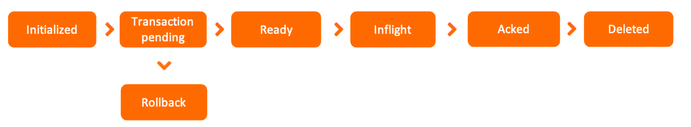

## Introduction

Apache RocketMQ is a distributed middleware service that adopts an asynchronous communication model and a publish/subscribe message transmission model.
The asynchronous communication model of Apache RocketMQ features simple system topology and weak upstream-downstream coupling.
Apache RocketMQ is used in asynchronous decoupling and load shifting scenarios.

> RocketMQ 的前身是alibaba 内部的 [notify](/docs/CS/MQ/RocketMQ/Notify.md) 和 metaQ


### Domain Model

<div style="text-align: center;">


</div>

<p style="text-align: center;">
Fig.1. Domain model of Apache RocketMQ.
</p>

As shown in the preceding figure, the lifecycle of a Apache RocketMQ message consists of three stages: production, storage, and consumption.
A producer generates a message and sends it to a Apache RocketMQ [broker](/docs/CS/MQ/RocketMQ/Broker.md). The message is stored in a topic on the broker.
A consumer subscribes to the topic to consume the message.

Message production

[Producer](/docs/CS/MQ/RocketMQ/Producer.md)：
The running entity that is used to generate messages in Apache RocketMQ. Producers are the upstream parts of business call links. Producers are lightweight, anonymous, and do not have identities.

Message storage

- Topic：
  The grouping container that is used for message transmission and storage in Apache RocketMQ. A topic consists of multiple message queues, which are used to store messages and scale out the topic.
- MessageQueue：
  The unit container that is used for message transmission and storage in Apache RocketMQ. Message queues are similar to partitions in Kafka. Apache RocketMQ stores messages in a streaming manner based on an infinite queue structure. Messages are stored in order in a queue.
- Message：
  The minimum unit of data transmission in Apache RocketMQ. Messages are immutable after they are initialized and stored.

Message consumption

- ConsumerGroup：
  An independent group of consumption identities defined in the publish/subscribe model of Apache RocketMQ. A consumer group is used to centrally manage consumers that run at the bottom layer.
- Consumers in the same group must maintain the same consumption logic and configurations with each other, and consume the messages subscribed by the group together to scale out the consumption capacity of the group.
- [Consumer](/docs/CS/MQ/RocketMQ/Consumer.md)：
  The running entity that is used to consume messages in Apache RocketMQ. Consumers are the downstream parts of business call links, A consumer must belong to a specific consumer group.
- Subscription：
  The collection of configurations in the publish/subscribe model of Apache RocketMQ. The configurations include message filtering, retry, and consumer progress Subscriptions are managed at the consumer group level. You use consumer groups to specify subscriptions to manage how consumers in the group filter messages, retry consumption, and restore a consumer offset.
  The configurations in a Apache RocketMQ subscription are all persistent, except for filter expressions. Subscriptions are unchanged regardless of whether the broker restarts or the connection is closed.

Topic -> multi message queue(like partition)

[Name server](/docs/CS/MQ/RocketMQ/Namesrv.md)

### Features

Message Type

- Normal Message
- Delay Message
- Ordered Message
- Transaction Message

Sending Retry and Throttling Policy

Message Filtering

Consumer Load Balancing

Consumption Retry

Message Storage and Cleanup

#### transaction message

Apache RocketMQ transactional messages can be used to ensure consistency of upstream and downstream data.
Transactional messages are an advanced message type provided by Apache RocketMQ to ensure the ultimate consistency between message production and local transaction.

事务消息发送分为两个阶段。第一阶段会发送一个半事务消息，半事务消息是指暂不能投递的消息，生产者已经成功地将消息发送到了 Broker，但是Broker 未收到生产者对该消息的二次确认，此时该消息被标记成“暂不能投递”状态，如果发送成功则执行本地事务，并根据本地事务执行成功与否，向 Broker 半事务消息状态（commit或者rollback），半事务消息只有 commit 状态才会真正向下游投递。如果由于网络闪断、生产者应用重启等原因，导致某条事务消息的二次确认丢失，Broker 端会通过扫描发现某条消息长期处于“半事务消息”时，需要主动向消息生产者询问该消息的最终状态（Commit或是Rollback）。
这样最终保证了本地事务执行成功，下游就能收到消息，本地事务执行失败，下游就收不到消息。总而保证了上下游数据的一致性。

整个事务消息的详细交互流程如下图所示：

<div style="text-align: center;">


</div>

<p style="text-align: center;">
Fig.1. 事务消息处理流程
</p>

1. 生产者将消息发送至Apache RocketMQ服务端。
2. Apache RocketMQ服务端将消息持久化成功之后，向生产者返回Ack确认消息已经发送成功，此时消息被标记为"暂不能投递"，这种状态下的消息即为半事务消息。
3. 生产者开始执行本地事务逻辑。
4. 生产者根据本地事务执行结果向服务端提交二次确认结果（Commit或是Rollback），服务端收到确认结果后处理逻辑如下：
   * 二次确认结果为Commit：服务端将半事务消息标记为可投递，并投递给消费者。
   * 二次确认结果为Rollback：服务端将回滚事务，不会将半事务消息投递给消费者。
5. 在断网或者是生产者应用重启的特殊情况下，若服务端未收到发送者提交的二次确认结果，或服务端收到的二次确认结果为Unknown未知状态，经过固定时间后，服务端将对消息生产者即生产者集群中任一生产者实例发起消息回查。** ****说明** 服务端回查的间隔时间和最大回查次数，请参见[参数限制](https://rocketmq.apache.org/zh/docs/introduction/03limits)。
6. 生产者收到消息回查后，需要检查对应消息的本地事务执行的最终结果。
7. 生产者根据检查到的本地事务的最终状态再次提交二次确认，服务端仍按照步骤4对半事务消息进行处理。


<div style="text-align: center;">



</div>

<p style="text-align: center;">
Fig.1. 事务消息生命周期
</p>


* 初始化：半事务消息被生产者构建并完成初始化，待发送到服务端的状态。
* 事务待提交：半事务消息被发送到服务端，和普通消息不同，并不会直接被服务端持久化，而是会被单独存储到事务存储系统中，等待第二阶段本地事务返回执行结果后再提交。此时消息对下游消费者不可见。
* 消息回滚：第二阶段如果事务执行结果明确为回滚，服务端会将半事务消息回滚，该事务消息流程终止。
* 提交待消费：第二阶段如果事务执行结果明确为提交，服务端会将半事务消息重新存储到普通存储系统中，此时消息对下游消费者可见，等待被消费者获取并消费。
* 消费中：消息被消费者获取，并按照消费者本地的业务逻辑进行处理的过程。 此时服务端会等待消费者完成消费并提交消费结果，如果一定时间后没有收到消费者的响应，Apache RocketMQ会对消息进行重试处理。具体信息，请参见[消费重试](https://rocketmq.apache.org/zh/docs/featureBehavior/10consumerretrypolicy)。
* 消费提交：消费者完成消费处理，并向服务端提交消费结果，服务端标记当前消息已经被处理（包括消费成功和失败）。 Apache RocketMQ默认支持保留所有消息，此时消息数据并不会立即被删除，只是逻辑标记已消费。消息在保存时间到期或存储空间不足被删除前，消费者仍然可以回溯消息重新消费。
* 消息删除：Apache RocketMQ按照消息保存机制滚动清理最早的消息数据，将消息从物理文件中删除。更多信息，请参见[消息存储和清理机制](https://rocketmq.apache.org/zh/docs/featureBehavior/11messagestorepolicy)


| 参数                     | 建议范围                                                   | 说明                                                                                                                                                                                                  |
| ------------------------ | ---------------------------------------------------------- | ----------------------------------------------------------------------------------------------------------------------------------------------------------------------------------------------------- |
| 事务异常检查间隔         | 默认值：60秒。                                             | 事务异常检查间隔指的是，半事务消息因系统重启或异常情况导致没有提交，生产者客户端会按照该间隔时间进行事务状态回查。<br />间隔时长不建议设置过短，否则频繁的回查调用会影响系统性能。                    |
| 半事务消息第一次回查时间 | 默认值：取值等于[事务异常检查间隔] 最大限制：不超过1小时。 | 无。                                                                                                                                                                                                  |
| 半事务消息最大超时时长   | 默认值：4小时。 取值范围：不支持自定义修改。               | 半事务消息因系统重启或异常情况导致没有提交，生产者客户端会按照事务异常检查间隔时间进行回查，<br />若超过半事务消息超时时长后没有返回结果，半事务消息将会被强制回滚。 您可以通过监控该指标避免异常事务 |


## Architecture


RocketMQ架构上主要分为四部分，如上图所示：

* Producer：消息发布的角色，支持分布式集群方式部署。Producer通过MQ的负载均衡模块选择相应的Broker集群队列进行消息投递，投递的过程支持快速失败并且低延迟。
* Consumer：消息消费的角色，支持分布式集群方式部署。支持以push推，pull拉两种模式对消息进行消费。同时也支持集群方式和广播方式的消费，它提供实时消息订阅机制，可以满足大多数用户的需求。
* NameServer：NameServer是一个非常简单的Topic路由注册中心，其角色类似Dubbo中的zookeeper，支持Broker的动态注册与发现。主要包括两个功能：Broker管理，NameServer接受Broker集群的注册信息并且保存下来作为路由信息的基本数据。然后提供心跳检测机制，检查Broker是否还存活；路由信息管理，每个NameServer将保存关于Broker集群的整个路由信息和用于客户端查询的队列信息。然后Producer和Consumer通过NameServer就可以知道整个Broker集群的路由信息，从而进行消息的投递和消费。NameServer通常也是集群的方式部署，各实例间相互不进行信息通讯。Broker是向每一台NameServer注册自己的路由信息，所以每一个NameServer实例上面都保存一份完整的路由信息。当某个NameServer因某种原因下线了，Broker仍然可以向其它NameServer同步其路由信息，Producer和Consumer仍然可以动态感知Broker的路由的信息。
* BrokerServer：Broker主要负责消息的存储、投递和查询以及服务高可用保证，为了实现这些功能，Broker包含了以下几个重要子模块。
  1. Remoting Module：整个Broker的实体，负责处理来自Client端的请求。
  2. Client Manager：负责管理客户端(Producer/Consumer)和维护Consumer的Topic订阅信息。
  3. Store Service：提供方便简单的API接口处理消息存储到物理硬盘和查询功能。
  4. HA Service：高可用服务，提供Master Broker 和 Slave Broker之间的数据同步功能。
  5. Index Service：根据特定的Message key对投递到Broker的消息进行索引服务，以提供消息的快速查询。


在RocketMQ4.5之前，它使用主从架构，每一个Master Broker都有一个自己的Slave Broker

Broker启动的时候，会启动一个定时任务，定期的从Master Broker同步全量的数据。


## Trace


AsyncTraceDispatcher


sendMessageBefore

```java
public class SendMessageTraceHookImpl implements SendMessageHook {

    private TraceDispatcher localDispatcher;

    public SendMessageTraceHookImpl(TraceDispatcher localDispatcher) {
        this.localDispatcher = localDispatcher;
    }

    @Override
    public String hookName() {
        return "SendMessageTraceHook";
    }

    @Override
    public void sendMessageBefore(SendMessageContext context) {
        //if it is message trace data,then it doesn't recorded
        if (context == null || context.getMessage().getTopic().startsWith(((AsyncTraceDispatcher) localDispatcher).getTraceTopicName())) {
            return;
        }
        //build the context content of TraceContext
        TraceContext traceContext = new TraceContext();
        traceContext.setTraceBeans(new ArrayList<>(1));
        context.setMqTraceContext(traceContext);
        traceContext.setTraceType(TraceType.Pub);
        traceContext.setGroupName(NamespaceUtil.withoutNamespace(context.getProducerGroup()));
        //build the data bean object of message trace
        TraceBean traceBean = new TraceBean();
        traceBean.setTopic(NamespaceUtil.withoutNamespace(context.getMessage().getTopic()));
        traceBean.setTags(context.getMessage().getTags());
        traceBean.setKeys(context.getMessage().getKeys());
        traceBean.setStoreHost(context.getBrokerAddr());
        traceBean.setBodyLength(context.getMessage().getBody().length);
        traceBean.setMsgType(context.getMsgType());
        traceContext.getTraceBeans().add(traceBean);
    }
}
```


sendMessageAfter

```java
    
public class SendMessageTraceHookImpl implements SendMessageHook {

    private TraceDispatcher localDispatcher;
  
  	@Override
    public void sendMessageAfter(SendMessageContext context) {
        //if it is message trace data,then it doesn't recorded
        if (context == null || context.getMessage().getTopic().startsWith(((AsyncTraceDispatcher) localDispatcher).getTraceTopicName())
            || context.getMqTraceContext() == null) {
            return;
        }
        if (context.getSendResult() == null) {
            return;
        }

        if (context.getSendResult().getRegionId() == null
            || !context.getSendResult().isTraceOn()) {
            // if switch is false,skip it
            return;
        }

        TraceContext traceContext = (TraceContext) context.getMqTraceContext();
        TraceBean traceBean = traceContext.getTraceBeans().get(0);
        int costTime = (int) ((System.currentTimeMillis() - traceContext.getTimeStamp()) / traceContext.getTraceBeans().size());
        traceContext.setCostTime(costTime);
        if (context.getSendResult().getSendStatus().equals(SendStatus.SEND_OK)) {
            traceContext.setSuccess(true);
        } else {
            traceContext.setSuccess(false);
        }
        traceContext.setRegionId(context.getSendResult().getRegionId());
        traceBean.setMsgId(context.getSendResult().getMsgId());
        traceBean.setOffsetMsgId(context.getSendResult().getOffsetMsgId());
        traceBean.setStoreTime(traceContext.getTimeStamp() + costTime / 2);
        localDispatcher.append(traceContext);
    }
}
```

## Features

### 消息过滤

tag

### 事务消息


### 延时消息

延时队列


### 死信队列


### Message Tracing


```java
public enum TraceType {
    Pub,
    SubBefore,
    SubAfter,
    EndTransaction,
}
```


客户端中统一使用TraceBean装载消息轨迹数据

```java
public class TraceBean {
    private static final String LOCAL_ADDRESS = UtilAll.ipToIPv4Str(UtilAll.getIP());
    private String topic = "";
    private String msgId = "";
    private String offsetMsgId = "";
    private String tags = "";
    private String keys = "";
    private String storeHost = LOCAL_ADDRESS;
    private String clientHost = LOCAL_ADDRESS;
    private long storeTime;
    private int retryTimes;
    private int bodyLength;
    private MessageType msgType;
    private LocalTransactionState transactionState;
    private String transactionId;
    private boolean fromTransactionCheck;
}
```

轨迹上下文

- TraceContext
- ConsumeMessageContext
- SendMessageContext
- FilterMessageContext
- EndTransactionContext
- CheckForbiddenContext


使用TraceContext组合不同上下文对象


## Tuning


### Issues


#### 消息积压

在 RocketMQ 中每一客户端会单独创建一个线程 PullMessageService 会循环从 Broker 拉取一批消息，然后提交到消费端的线程池中进行消费，线程池中的线程消费完一条消息后会上服务端上报当前消费端的消费进度，而且在提交消费进度时是提交当前处理队列中消息消费偏移量最小的消息作为消费组的进度，即如果消息偏移量为 100 的消息，如果由于某种原因迟迟没有消费成功，那该消费组的进度则无法向前推进，久而久之，Broker 端的消息偏移量就会远远大于消费组当前消费的进度，从而造成消息积压现象

这种情况，通常应该去查看消费端线程池中线程的状态 通过 `jps -m` 或者 `ps -ef | grep java` 命令获取当前正在运行的 Java 程序，通过启动主类即可获得应用的进程 id，然后可以通过 `jstack pid > j.log` 命令获取线程的堆栈 连续运行 5 次该命令，分别获取 5 个线程堆栈文件，主要用于对比线程的状态是否在向前推进

通过 jstack 获取堆栈信息后，可以重点搜索 ConsumeMessageThread_ 开头的线程状态 状态为 RUNABLE 的消费端线程正在等待网络读取 即线程一直“阻塞”在网络读取上，一旦阻塞，那该线程正在处理的消息就一直处于消费中，消息消费进度就会卡在这里，不会继续向前推进，久而久之，就会出现消息积压情况

RocketMQ 消息消费端会从 3 个维度进行限流：

1. 消息消费端队列中积压的消息超过 1000 条
2. 消息处理队列中尽管积压没有超过 1000 条，但最大偏移量与最小偏移量的差值超过 2000
3. 消息处理队列中积压的消息总大小超过 100M


## Links

- [MQ](/docs/CS/MQ/MQ.md?id=RocketMQ)

## References

1. [RocketMQ技术内幕](https://book.douban.com/subject/35626441/)
