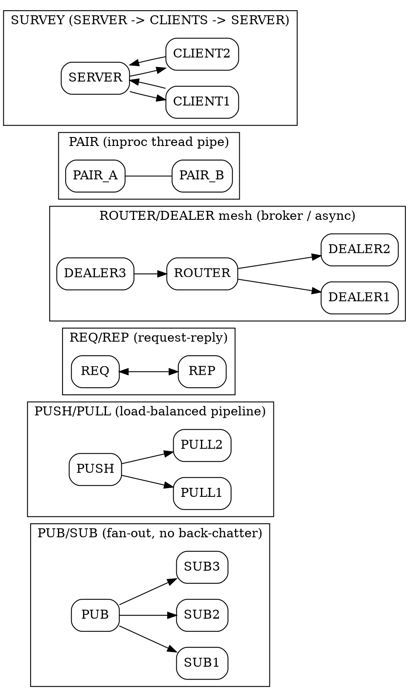

## Introduction

ZeroMQ（又称 ØMQ、0MQ、zmq）本质上是一个**可嵌入的异步消息传递库**，而不是一个独立运行的"消息队列服务器"。它扩展了标准 socket 接口，提供异步消息队列抽象、多种消息模式、订阅过滤以及对多传输协议的透明访问。官方定义："The 0MQ lightweight messaging kernel is a library which extends the standard socket interfaces with features traditionally provided by specialised messaging middleware products."

**范式转变：brokerless，"smart endpoints, dumb pipes"。** 与 Kafka / RabbitMQ 这类"broker-based（中心化中转）"系统不同，ZeroMQ 没有常驻的中间代理进程。你不会去 `connect` 一个 broker，而是在**应用代码里自己用 socket 把拓扑拼出来**（PUB 绑、SUB 连；ROUTER/DEALER 之间互相连）。这正是 "smart endpoints, dumb pipes" 的思想——智能在对端，管道（传输层）保持简单。因此 ZeroMQ 常被拿来和 Kafka/RabbitMQ 比较，但它根本不是 queue server：它不具备持久化、不具备内置路由/分发中心、也不保证投递——这些逻辑都要由你亲手实现。它更像"并发框架 + 网络库"，适合把消息能力直接编进进程内部。

## Brokerless Architecture

ZeroMQ 没有 broker 进程：没有专门的服务来暂存、路由或重放消息。所有队列都位于**各个 socket 内部的内存缓冲区**（发送缓冲 / 接收缓冲）。拓扑（谁连谁、如何分组）完全由应用程序在代码中声明，常借助 `zmq_proxy()` 这类"device"把两个 socket 桥接起来充当轻量中转。

- **无中心化**：进程崩溃或网络分区时，不存在一个能补发消息的 broker；消息要么在对端内存里，要么已丢失。
- **你写路由逻辑**：ROUTER 多路复用时，需要你在消息帧里携带"对端身份"并自己维护映射；没有现成的 topic-exchange / consumer-group 概念。
- **许可证**：libzmq 4.3.5 起从 LGPL-3.0+ 重新授权为 MPL-2.0（Mozilla Public License 2.0），更利于商用。

## Socket Patterns

- **REQ / REP**：经典请求-应答。REQ 发完必须 `recv` 才能再发，REP 同理；基础形态很脆弱（任一方崩溃即死锁），生产环境需升级为 DEALER/ROUTER 或引入超时。
- **PUB / SUB**：发布-订阅，一对多广播。SUB 通过 `ZMQ_SUBSCRIBE` 订阅前缀过滤；订阅关系匿名、低频回传，无背压反馈。"radio broadcast" 模型——加入前的内容全部错过。
- **PUSH / PULL**：流水线 / 任务分发。每条消息只发给"某一个" PULL（轮转负载均衡），与 PUB 的"发给所有"有本质区别，二者不可互换。
- **ROUTER / DEALER**：异步、可充当 broker 的核心。ROUTER 为每个对端维护身份标识（identity frame），便于你实现自定义路由与应答寻址；DEALER 是其对等/客户端侧，可公平轮转。
- **PAIR**：仅用于 `inproc` 的两个线程间一对一管道，独占连接，不路由。
- **SURVEY（SERVER / CLIENT）**：服务端向所有已连客户端广播"问卷"并收集应答的模式（属于 DRAFT socket 类型，ZMQ_SERVER / ZMQ_CLIENT），适合集群状态探测。
- 其他 DRAFT 类型：XPUB/XSUB（可感知订阅事件，用于转发代理）、STREAM（原始 TCP 网关）、RADIO/DISH、SCATTER/GATHER、CHANNEL 等——其中部分标记为 DRAFT，API 可能变动，未查到全部稳定化确认。

## Transports

ZeroMQ 通过同一套 socket API 屏蔽传输差异：

- **inproc://**：进程内线程间，零拷贝、最快，但要求两端在同一 `zmq_ctx`。
- **ipc://**：同一主机进程间，基于文件系统路径的本地 socket。
- **tcp://**：跨网络标准 TCP，带 OS 级缓冲与拥塞控制，是最常用的跨机传输。
- **pgm:// / epgm://**：基于 OpenPGM 的可靠多播（PGM），用于在交换机层做组播，适合高吞吐一对多分发（需编译时启用 PGM）。
- 其他：UDP、TIPC、WebSocket、VMCI（部分平台/版本支持，未全部逐一核实）。

## Multipart / Framed Messages

ZeroMQ 的"消息"是原子的（不可截断投递），且支持**多帧（multipart）消息**：用 `zmq_send(..., ZMQ_SNDMORE)` 标记"还有后续帧"，最后无该标志的一帧结束消息。多帧机制用于在一条消息里分离"信封 / 路由帧"与"负载"（例如 ROUTER 的 identity frame + 业务帧）。帧是长度前缀分帧的，因此消息天然无粘包问题。

## Delivery Semantics

投递语义**因模式而异**，且默认**没有任何持久化保证**：

- **PUB/SUB**：尽力而为（best-effort），不保证送达。慢订阅者会在 PUB 端针对该连接的 `ZMQ_SNDHWM` 队列满后**直接丢弃**发给它的消息；订阅者晚加入则错过历史。
- **PUSH/PULL、REQ/REP**：达到 HWM 时 `send` **阻塞**而非丢弃，提供自然反压，防止任务/请求丢失（前提是消费者最终能跟上）。
- **ROUTER**：达到某对端 HWM 时**丢弃**发往该对端的消息，避免单个坏节点阻塞路由器。
- **整体**：无持久化 = 进程/网络故障即丢；无事务、无去重、无顺序全局保证（同连接内 FIFO，跨连接不保证）。

## Comparison to Brokers

| 维度 | ZeroMQ | Kafka / RabbitMQ |
|---|---|---|
| 形态 | 链接进进程的库 | 独立 broker 服务进程 |
| 持久化 | 无（纯内存） | 有（磁盘日志 / 队列） |
| 路由中心 | 应用自己写 | broker 内建 |
| 投递保证 | 取决于模式，默认不保证 | broker 提供 ACK / 副本 / 重试 |
| 运维 | 无独立组件 | 需部署、监控集群 |

ZeroMQ 把"消息能力"下沉到应用，换来极低延迟与极致灵活性；代价是可靠性、可观测性、运维便利都要自己补。

## Key Use Cases

- **低延迟 IPC / 进程内并发**：inproc + PAIR/DEALER 构建 actor / 流水线式多核应用。
- **分布式 mesh**：ROUTER/DEALER 自组网状拓扑，无中心瓶颈，适合集群内节点互联。
- **自建 broker / device**：用 `zmq_proxy()` 或 ROUTER/DEALER 拼出你自己的"消息中间件"，只保留需要的特性，避免通用 broker 的复杂度与开销。
- **高性能数据分发**：PUB/SUB over PGM 做大规模扇出（如行情、遥测）。

## Pitfalls

- **无持久化**：任何一端宕机，内存中的消息即丢失；不能当"数据库前的缓冲层"指望它兜底。
- **默认不保证投递**：尤其 PUB/SUB 是明确的不保证模型；需要可靠性得自己加确认、重传、序列号。
- **Slow Joiner（慢加入者）**：SUB 调用 `connect()` 到订阅真正生效之间存在窗口，期间 PUB 发出的消息被直接丢弃，常见于启动丢前几条。
- **Slow Subscriber（慢订阅者）**：PUB 侧针对该连接的队列填满 `SNDHWM` 后会丢消息；需要额外同步通道（如 XPUB + REQ 握手）缓解。
- **HWM 水位**：v3.x 起默认有 HWM 上限以防内存暴涨；设成无限会重新带来 OOM 风险，需按吞吐/延迟仔细调参。
- **不是 broker 的替代品**：不要指望直接把 Kafka 架构里的 broker 换成 ZeroMQ 就完事——消费组、分区、副本、重放全部缺失，需要自行实现。
- **REQ/REP 死锁**：基础 REQ/REP 任一方崩或消息丢失会导致对端永久阻塞，生产必加超时/升级协议。

## Links

- [MQ 总纲](/docs/CS/MQ/MQ.md)
- [消息代理与数据库的对比（ZeroMQ 无 broker 的含义）](/docs/CS/MQ/MQ.md?id=message-brokers)
- [RabbitMQ（broker 路线的对照）](/docs/CS/MQ/RabbitMQ.md)
- [Kafka（吞吐路线的对照）](/docs/CS/MQ/Kafka/Kafka.md)
- [CS 主题总纲](/docs/CS/CS.md)

## References
1. ZeroMQ 官网：https://zeromq.org/
2. libzmq GitHub Releases（4.3.5, 2023-10-09）：https://github.com/zeromq/libzmq/releases
3. libzmq README（架构、平台、许可）：https://github.com/zeromq/libzmq/blob/master/README.md
4. ZeroMQ Guide 第5章 高级 Pub-Sub（慢订阅者/可靠性）：https://zguide.zeromq.org/docs/chapter5/
5. ZeroMQ HWM 背压机制：https://adhdecode.com/articles/zeromq/zeromq-high-water-mark-backpressure
6. C4 贡献协议：https://rfc.zeromq.org/spec:42/C4/
