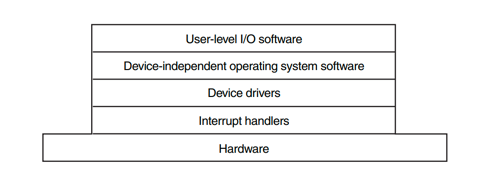

## 简介

操作系统在计算机 I/O 中的角色是管理和控制 I/O 操作及 I/O 设备。

设备驱动程序向 I/O 子系统提供统一的设备访问接口，
就像系统调用在应用程序和操作系统之间提供标准接口一样。

## I/O 硬件原理

### I/O 设备

I/O 设备大致可分为两类：*块设备*和*字符设备*。

> [!TIP]
>
> Interrupts not always better than PIO
>
> Although interrupts allow for overlap of computation and I/O, they only really make sense for slow devices.
> Otherwise, the cost of interrupt handling and context switching may outweigh the benefits interrupts provide.
> There are also cases where a flood of interrupts may overload a system and lead it to livelock; in such cases, polling provides more control to the OS in its scheduling and thus is again useful.

请注意，使用中断并不总是最佳解决方案。

例如，假设一个设备非常快速地执行任务：第一次轮询通常发现设备已完成任务。
在这种情况下使用中断实际上会降低系统速度：切换到另一个进程、处理中断、再切换回发起进程的开销很大。
因此，如果设备很快，最好使用轮询；如果设备很慢，则使用中断（允许重叠）最好。
如果设备速度未知，或者有时快有时慢，最好使用混合方法：先轮询一小段时间，如果设备尚未完成，再使用中断。
这种两阶段方法可能两全其美。

不使用中断的另一个原因出现在网络中。
当大量传入数据包各自产生一个中断时，操作系统可能发生活锁，即发现自己只处理中断，从不允许用户级进程运行并实际处理请求。例如，想象一个 Web 服务器因为成为黑客新闻头条而经历负载激增。
在这种情况下，最好偶尔使用轮询来更好地控制系统中的情况，并允许 Web 服务器在处理一些请求之后，再返回设备检查更多数据包的到达。

另一种基于中断的优化是合并。在这种设置中，需要引发中断的设备在将中断传递给 CPU 之前会先等待片刻。
在等待期间，其他请求可能很快完成，因此多个中断可以合并为一次中断传递，从而降低中断处理的开销。
当然，等待太久会增加请求的延迟，这是系统中常见的权衡。

如何与设备通信？

随着时间的推移，开发了两种主要的设备通信方法。

- 第一种也是最古老的方法（IBM 大型机使用多年）是使用显式的 I/O 指令。
- 第二种与设备交互的方法称为内存映射 I/O。

### 设备控制器

### 内存映射 I/O

### DMA

DMA 引擎本质上是系统中的一个非常特定的设备，可以在不需要太多 CPU 干预的情况下协调设备和主内存之间的传输。

## I/O 软件原理

### I/O 软件的目标

I/O 软件设计中的一个关键概念称为*设备独立性*。

与设备独立性密切相关的是统一命名的目标。

I/O 软件的另一个重要问题是错误处理。

另一个重要问题是同步（阻塞）与异步（中断驱动）传输。

I/O 软件的另一个问题是缓冲。来自设备的数据通常不能直接存储到最终目的地。
例如，当数据包从网络到达时，操作系统在将其存储到某处并检查之前，不知道将其放在哪里。
此外，某些设备有严格的实时约束（例如数字音频设备），因此数据必须提前放入输出缓冲区，以解耦缓冲区填充速率和清空速率，从而避免缓冲区欠载。
缓冲涉及大量的复制操作，并且通常对 I/O 性能有重大影响。

有三种根本不同的 I/O 执行方式。

#### 程序控制 I/O

最简单的 I/O 形式是让 CPU 完成所有工作。
这种方法称为*程序控制 I/O*。

程序控制 I/O 的本质是，在输出一个字符后，CPU 持续轮询设备以检查其是否准备好接收下一个字符。
这种行为通常称为*轮询*或*忙等待*。

#### 中断驱动 I/O

如果 I/O 未完成，中断处理程序会采取某些操作解除用户的阻塞。
否则，确认中断，并返回到中断前正在运行的进程，该进程从其停止处继续执行。

#### 使用 DMA 的 I/O

中断驱动 I/O 的一个明显缺点是中断需要时间，因此这种方案会浪费一定量的 CPU 时间。
解决方案是使用 DMA。
本质上，DMA 是程序控制 I/O，只是由 DMA 控制器而非主 CPU 完成所有工作。
这种策略需要特殊硬件（DMA 控制器），但在 I/O 期间释放了 CPU 以执行其他工作。

如果 DMA 控制器无法全速驱动设备，或者 CPU 在等待 DMA 中断期间通常无事可做，那么中断驱动 I/O 甚至程序控制 I/O 可能更好。
不过，在大多数情况下，DMA 是值得的。

## I/O 软件

I/O 软件通常组织为四个层次。
每一层都有明确的功能定义和与相邻层之间定义良好的接口。

## 链接

- [操作系统](/docs/CS/OS/OS.md)
