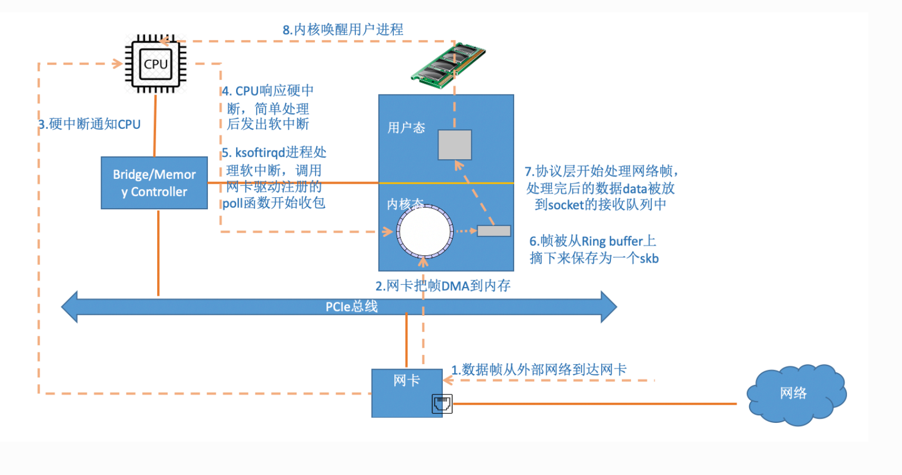

# Network

Linux provide driver and protocol for 链路层和transport
driver：driver/net/ethernet
protocol: kernel & net


内核和⽹络设备驱动是通过中断的⽅式来处理的。当设备上有数据到达的时候，会给 CPU 的相关引脚
上触发⼀个电压变化，以通知 CPU 来处理数据。对于⽹络模块来说，由于处理过程⽐较复杂和耗时，
如果在中断函数中完成所有的处理，将会导致中断处理函数（优先级过⾼）将过度占据 CPU ，将导致
CPU ⽆法响应其它设备，例如⿏标和键盘的消息。因此Linux中断处理函数是分上半部和下半部的。上
半部是只进⾏最简单的⼯作，快速处理然后释放 CPU ，接着 CPU 就可以允许其它中断进来。剩下将绝
⼤部分的⼯作都放到下半部中，可以慢慢从容处理。 2.4 以后的内核版本采⽤的下半部实现⽅式是软中
断，由 ksoftirqd 内核线程全权处理。和硬中断不同的是，硬中断是通过给 CPU 物理引脚施加电压变
化，⽽软中断是通过给内存中的⼀个变量的⼆进制值以通知软中断处理程序



当⽹卡上收到数据以后， Linux 中第⼀个⼯作的模块是⽹络驱动。 ⽹络驱动会以 DMA 的⽅式把⽹卡上
收到的帧写到内存⾥。再向 CPU 发起⼀个中断，以通知 CPU 有数据到达。第⼆，当 CPU 收到中断请
求后，会去调⽤⽹络驱动注册的中断处理函数。 ⽹卡的中断处理函数并不做过多⼯作，发出软中断请
求，然后尽快释放 CPU。 ksoftirqd 检测到有软中断请求到达，调⽤ poll 开始轮询收包，收到后交由各
级协议栈处理。对于 udp 包来说，会被放到⽤户 socket 的接收队列中


## TCP

Client建立连接限制 ip_local_port_range
```shell
# cat /proc/sys/net/ipv4/ip_local_port_range
32768	60999

```

//修改整个系统能打开的⽂件描述符为20W
echo 200000 > /proc/sys/fs/file-max
//修改所有⽤户每个进程可打开⽂件描述符为20W
#vi /etc/sysctl.conf
fs.nr_open=210000
#sysctl -p
#vi /etc/security/limits.conf
* soft nofile 200000
* hard nofile 200000

limits中的hard limit不能超过nr_open, 所以要先改nr_open。⽽且最好是在sysctl.conf中
改。避免重启的时候 hard limit⽣效了， nr_open不⽣效导致启动问题