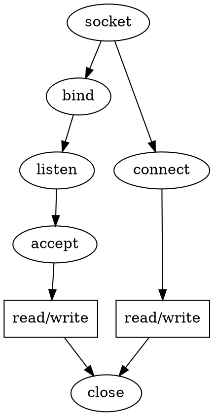

## Introduction


TCP connection involves a client and server side setup for the two ends to communicate.

- The client has to make two systemcalls, socket() and connect(), to connect to the server. 
- The server has to make arrangements to create a listening socket so that the client can generate request to connect to this socket. 
  To make such an arrangement, the server has to make four systemcalls: socket(), bind(), listen(), and accept().

We will study the implementation of each systemcall in the kernel.

We saw what happens when we make a socket systemcall. 
We pass protocol family and type to socket(), and this does all the initial setup that involves initializing BSD and protocol socket operations. This involves initializing socket and sock structures. 

Now we need to do the rest of the work on the socket, which is already initialized by a call to socket() for client and server in different ways.

Now we will study the details of the kernel data structures associated with TCP connection setup on both client and server side.

The details of port allocation by the server when we call bind(). 
This also details how the conflicts are resolved when the server generates a request for specific port allocation. 
We will study the SYN queue design where the open connection request for the listening socket fi rst sits until the connection is completely established (three-way handshake is over). 

We will also see how the open connection request is moved from the SYN queue to the accept queue when the TCP connection is established.

Finally, we will see how the established connections are taken off the accept queue by making accept() call. 
Similarly, we will see how the client generates a connection request to the server (sends SYN segment to the listening server). 

We will not cover the IP and link layer details but will surely cover everything that is associated with the client – server connection setup in the kernel.




see system calls:
1. [socket](/docs/CS/OS/Linux/socket.md?id=create)
2. [bind](/docs/CS/OS/Linux/Calls.md?id=bind)
3. [listen](/docs/CS/OS/Linux/Calls.md?id=listen)
5. [connect](/docs/CS/OS/Linux/Calls.md?id=connect)
6. [send](/docs/CS/OS/Linux/TCP.md?id=send)
7. [recv](/docs/CS/OS/Linux/TCP.md?id=recv)

<!-- tabs:start -->
#### **Server**
```c
socket(...,SOCK_STREAM,0);
bind(...,&server_address, ...);
listen(...);
accept(..., &client_address, ...);
recv(..., &clientaddr, ...);
close(...);
```

#### **Client**

```c
socket(...,SOCK_STREAM,0);
connect();
send(...,&server_address,...);
```
<!-- tabs:end -->

## Server Side Setup

- socket() systemcall only creates space for the socket in the kernel
- [bind()](/docs/CS/OS/Linux/Calls.md?id=bind) systemcall creates an identity for the socket and is the next step to create the server application
- Listen
- Accept


## send SYN

### connect

```
SYSCALL_DEFINE3(connect, int, fd, struct sockaddr __user *, uservaddr, int, addrlen)
{
	return __sys_connect(fd, uservaddr, addrlen);
}

int __sys_connect(int fd, struct sockaddr __user *uservaddr, int addrlen)
{
    __sys_connect_file(f.file, &address, addrlen, 0);

}   

int __sys_connect_file(struct file *file, struct sockaddr_storage *address,
		       int addrlen, int file_flags)
{
	err = sock->ops->connect(sock, (struct sockaddr *)address, addrlen, sock->file->f_flags | file_flags);
}     
```
### tcp_v4_connect

1. set state = TCP_SYN_SENT
2. inet_hash_connect
2. Build a SYN and send it off


```c
          
struct proto tcp_prot = {
	.name			= "TCP",
	.owner			= THIS_MODULE,
	.close			= tcp_close,
	.pre_connect		= tcp_v4_pre_connect,
	.connect		= tcp_v4_connect,
}


int tcp_v4_connect(struct sock *sk, struct sockaddr *uaddr, int addr_len)
{
	tcp_set_state(sk, TCP_SYN_SENT);
	err = inet_hash_connect(tcp_death_row, sk);
    ...
	err = tcp_connect(sk);

}
```

#### inet_hash_connect
Bind a port for a connect operation and hash it.

```c
int inet_hash_connect(struct inet_timewait_death_row *death_row,
		      struct sock *sk)
{
	u64 port_offset = 0;

	if (!inet_sk(sk)->inet_num)
		port_offset = inet_sk_port_offset(sk);
	return __inet_hash_connect(death_row, sk, port_offset,
				   __inet_check_established);
}
```


```c
#define	EADDRNOTAVAIL	99	/* Cannot assign requested address */


static int __inet_check_established(struct inet_timewait_death_row *death_row,
				    struct sock *sk, __u16 lport,
				    struct inet_timewait_sock **twp)
{
	struct inet_hashinfo *hinfo = death_row->hashinfo;
	struct inet_sock *inet = inet_sk(sk);
	__be32 daddr = inet->inet_rcv_saddr;
	__be32 saddr = inet->inet_daddr;
	int dif = sk->sk_bound_dev_if;
	struct net *net = sock_net(sk);
	int sdif = l3mdev_master_ifindex_by_index(net, dif);
	INET_ADDR_COOKIE(acookie, saddr, daddr);
	const __portpair ports = INET_COMBINED_PORTS(inet->inet_dport, lport);
	unsigned int hash = inet_ehashfn(net, daddr, lport,
					 saddr, inet->inet_dport);
	struct inet_ehash_bucket *head = inet_ehash_bucket(hinfo, hash);
	spinlock_t *lock = inet_ehash_lockp(hinfo, hash);
	struct sock *sk2;
	const struct hlist_nulls_node *node;
	struct inet_timewait_sock *tw = NULL;

	spin_lock(lock);

	sk_nulls_for_each(sk2, node, &head->chain) {
		if (sk2->sk_hash != hash)
			continue;

		if (likely(inet_match(net, sk2, acookie, ports, dif, sdif))) {
			if (sk2->sk_state == TCP_TIME_WAIT) {
				tw = inet_twsk(sk2);
				if (twsk_unique(sk, sk2, twp))
					break;
			}
			goto not_unique;
		}
	}

	/* Must record num and sport now. Otherwise we will see
	 * in hash table socket with a funny identity.
	 */
	inet->inet_num = lport;
	inet->inet_sport = htons(lport);
	sk->sk_hash = hash;
	WARN_ON(!sk_unhashed(sk));
	__sk_nulls_add_node_rcu(sk, &head->chain);
	if (tw) {
		sk_nulls_del_node_init_rcu((struct sock *)tw);
		__NET_INC_STATS(net, LINUX_MIB_TIMEWAITRECYCLED);
	}
	spin_unlock(lock);
	sock_prot_inuse_add(sock_net(sk), sk->sk_prot, 1);

	if (twp) {
		*twp = tw;
	} else if (tw) {
		/* Silly. Should hash-dance instead... */
		inet_twsk_deschedule_put(tw);
	}
	return 0;

not_unique:
	spin_unlock(lock);
	return -EADDRNOTAVAIL;
}
```


#### tcp_connect

```c
int tcp_connect(struct sock *sk)
{
	tcp_connect_init(sk);
    ...
	tcp_connect_queue_skb(sk, buff);

	/* Send off SYN; include data in Fast Open. */
	err = tp->fastopen_req ? tcp_send_syn_data(sk, buff) :
	      tcp_transmit_skb(sk, buff, 1, sk->sk_allocation);
    
    ...
	/* Timer for repeating the SYN until an answer. */
	inet_csk_reset_xmit_timer(sk, ICSK_TIME_RETRANS,
				  inet_csk(sk)->icsk_rto, TCP_RTO_MAX);
}
```


## rcv SYN

tcp_v4_rcv -> tcp_v4_do_rcv -> tcp_rcv_state_process

```c
int tcp_rcv_state_process(struct sock *sk, struct sk_buff *skb)
{
	case TCP_LISTEN:
		if (th->syn) {
			acceptable = icsk->icsk_af_ops->conn_request(sk, skb) >= 0;
		}
}		

const struct inet_connection_sock_af_ops ipv4_specific = {
	.conn_request	   = tcp_v4_conn_request,
	...
};

int tcp_v4_conn_request(struct sock *sk, struct sk_buff *skb)
{
	return tcp_conn_request(&tcp_request_sock_ops,
				&tcp_request_sock_ipv4_ops, sk, skb);
}
```

### tcp_conn_request


```c
int tcp_conn_request(struct request_sock_ops *rsk_ops,
		     const struct tcp_request_sock_ops *af_ops,
		     struct sock *sk, struct sk_buff *skb)
{
	syncookies = READ_ONCE(net->ipv4.sysctl_tcp_syncookies);

	/* TW buckets are converted to open requests without
	 * limitations, they conserve resources and peer is
	 * evidently real one.
	 */
	if ((syncookies == 2 || inet_csk_reqsk_queue_is_full(sk)) && !isn) {
		want_cookie = tcp_syn_flood_action(sk, rsk_ops->slab_name);
		if (!want_cookie)
			goto drop;
	}

	if (sk_acceptq_is_full(sk)) {
		NET_INC_STATS(sock_net(sk), LINUX_MIB_LISTENOVERFLOWS);
		goto drop;
	}

	req = inet_reqsk_alloc(rsk_ops, sk, !want_cookie);

	if (!want_cookie && !isn) {
		int max_syn_backlog = READ_ONCE(net->ipv4.sysctl_max_syn_backlog);

		/* Kill the following clause, if you dislike this way. */
		if (!syncookies &&
		    (max_syn_backlog - inet_csk_reqsk_queue_len(sk) <
		     (max_syn_backlog >> 2)) &&
		    !tcp_peer_is_proven(req, dst)) {
			/* Without syncookies last quarter of
			 * backlog is filled with destinations,
			 * proven to be alive.
			 * It means that we continue to communicate
			 * to destinations, already remembered
			 * to the moment of synflood.
			 */
			pr_drop_req(req, ntohs(tcp_hdr(skb)->source),
				    rsk_ops->family);
			goto drop_and_release;
		}

		isn = af_ops->init_seq(skb);
	}

	tcp_ecn_create_request(req, skb, sk, dst);

	if (want_cookie) {
		isn = cookie_init_sequence(af_ops, sk, skb, &req->mss);
		if (!tmp_opt.tstamp_ok)
			inet_rsk(req)->ecn_ok = 0;
	}

	tcp_rsk(req)->snt_isn = isn;
	tcp_rsk(req)->txhash = net_tx_rndhash();
	tcp_rsk(req)->syn_tos = TCP_SKB_CB(skb)->ip_dsfield;
	tcp_openreq_init_rwin(req, sk, dst);
	sk_rx_queue_set(req_to_sk(req), skb);
	if (!want_cookie) {
		tcp_reqsk_record_syn(sk, req, skb);
		fastopen_sk = tcp_try_fastopen(sk, skb, req, &foc, dst);
	}
	if (fastopen_sk) {
		af_ops->send_synack(fastopen_sk, dst, &fl, req,
				    &foc, TCP_SYNACK_FASTOPEN, skb);
		/* Add the child socket directly into the accept queue */
		if (!inet_csk_reqsk_queue_add(sk, req, fastopen_sk)) {
			reqsk_fastopen_remove(fastopen_sk, req, false);
			bh_unlock_sock(fastopen_sk);
			sock_put(fastopen_sk);
			goto drop_and_free;
		}
		sk->sk_data_ready(sk);
		bh_unlock_sock(fastopen_sk);
		sock_put(fastopen_sk);
	} else {
		tcp_rsk(req)->tfo_listener = false;
		if (!want_cookie) {
			req->timeout = tcp_timeout_init((struct sock *)req);
			inet_csk_reqsk_queue_hash_add(sk, req, req->timeout); /** add timer, incr qlen and young **/
		}
		af_ops->send_synack(sk, dst, &fl, req, &foc,
				    !want_cookie ? TCP_SYNACK_NORMAL :
						   TCP_SYNACK_COOKIE,
				    skb);
		if (want_cookie) {
			reqsk_free(req);
			return 0;
		}
	}

}
```


SYN queue full
```c
// qlen >= sk_max_ack_backlog
static inline int inet_csk_reqsk_queue_is_full(const struct sock *sk)
{
	return inet_csk_reqsk_queue_len(sk) >= sk->sk_max_ack_backlog;
}
```


### tcp_v4_send_synack


Send a SYN-ACK after having received a SYN.

This still operates on a request_sock only, not on a big socket.

1. make synack
2. dd an ip header to a skbuff and send it out.(invoke [ip_local_out](/docs/CS/OS/Linux/network.md?id=ip_local_out))

```c
const struct tcp_request_sock_ops tcp_request_sock_ipv4_ops = {
    ...
	.send_synack	=	tcp_v4_send_synack,
};

static int tcp_v4_send_synack(const struct sock *sk, struct dst_entry *dst, ...)
{
	skb = tcp_make_synack(sk, dst, req, foc, synack_type, syn_skb);
    err = ip_build_and_send_pkt(skb, sk, ireq->ir_loc_addr, ...);
}
```

#### tcp_make_synack

Allocate one skb and build a SYNACK packet.

```c
struct sk_buff *tcp_make_synack(const struct sock *sk, struct dst_entry *dst,
				struct request_sock *req,
				struct tcp_fastopen_cookie *foc,
				enum tcp_synack_type synack_type,
				struct sk_buff *syn_skb)
{
	struct inet_request_sock *ireq = inet_rsk(req);
	const struct tcp_sock *tp = tcp_sk(sk);
	struct tcp_md5sig_key *md5 = NULL;
	struct tcp_out_options opts;
	struct sk_buff *skb;
	int tcp_header_size;
	struct tcphdr *th;
	int mss;
	u64 now;

	skb = alloc_skb(MAX_TCP_HEADER, GFP_ATOMIC);
	if (unlikely(!skb)) {
		dst_release(dst);
		return NULL;
	}
	/* Reserve space for headers. */
	skb_reserve(skb, MAX_TCP_HEADER);

	switch (synack_type) {
	case TCP_SYNACK_NORMAL:
		skb_set_owner_w(skb, req_to_sk(req));
		break;
	case TCP_SYNACK_COOKIE:
		/* Under synflood, we do not attach skb to a socket,
		 * to avoid false sharing.
		 */
		break;
	case TCP_SYNACK_FASTOPEN:
		/* sk is a const pointer, because we want to express multiple
		 * cpu might call us concurrently.
		 * sk->sk_wmem_alloc in an atomic, we can promote to rw.
		 */
		skb_set_owner_w(skb, (struct sock *)sk);
		break;
	}
	skb_dst_set(skb, dst);

	mss = tcp_mss_clamp(tp, dst_metric_advmss(dst));

	memset(&opts, 0, sizeof(opts));
	now = tcp_clock_ns();

	{
		skb->skb_mstamp_ns = now;
		if (!tcp_rsk(req)->snt_synack) /* Timestamp first SYNACK */
			tcp_rsk(req)->snt_synack = tcp_skb_timestamp_us(skb);
	}


	skb_set_hash(skb, tcp_rsk(req)->txhash, PKT_HASH_TYPE_L4);
	/* bpf program will be interested in the tcp_flags */
	TCP_SKB_CB(skb)->tcp_flags = TCPHDR_SYN | TCPHDR_ACK;
	tcp_header_size = tcp_synack_options(sk, req, mss, skb, &opts, md5,
					     foc, synack_type,
					     syn_skb) + sizeof(*th);

	skb_push(skb, tcp_header_size);
	skb_reset_transport_header(skb);

	th = (struct tcphdr *)skb->data;
	memset(th, 0, sizeof(struct tcphdr));
	th->syn = 1;
	th->ack = 1;
	tcp_ecn_make_synack(req, th);
	th->source = htons(ireq->ir_num);
	th->dest = ireq->ir_rmt_port;
	skb->mark = ireq->ir_mark;
	skb->ip_summed = CHECKSUM_PARTIAL;
	th->seq = htonl(tcp_rsk(req)->snt_isn);
	/* XXX data is queued and acked as is. No buffer/window check */
	th->ack_seq = htonl(tcp_rsk(req)->rcv_nxt);

	/* RFC1323: The window in SYN & SYN/ACK segments is never scaled. */
	th->window = htons(min(req->rsk_rcv_wnd, 65535U));
	tcp_options_write((__be32 *)(th + 1), NULL, &opts);
	th->doff = (tcp_header_size >> 2);
	__TCP_INC_STATS(sock_net(sk), TCP_MIB_OUTSEGS);


	bpf_skops_write_hdr_opt((struct sock *)sk, skb, req, syn_skb,
				synack_type, &opts);

	skb->skb_mstamp_ns = now;
	tcp_add_tx_delay(skb, tp);

	return skb;
}
```


## Rcv SYNACK

## Rcv ACK


## Links

- [docs/CS/OS/Linux/TCP](/docs/CS/OS/Linux/TCP.md)