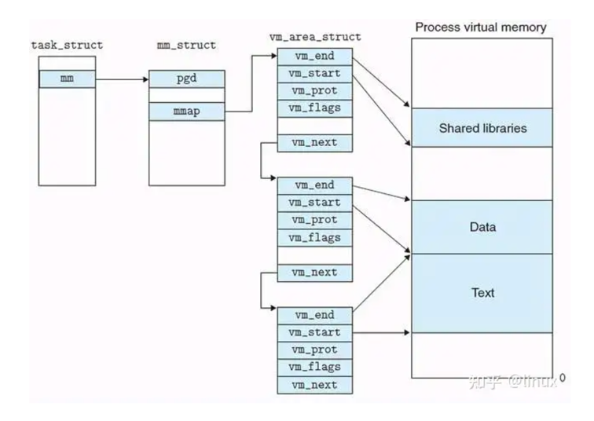

## Introduction

Linux memory management subsystem is responsible, as the name implies, for managing the memory in the system. 
This includes implementation of virtual memory and demand paging, memory allocation both for kernel internal structures and user space programs, 
mapping of files into processes address space and many other cool things.

Linux memory management is a complex system with many configurable settings. 
Most of these settings are available via /proc filesystem and can be queried and adjusted using sysctl. 
These APIs are described in Documentation for /proc/sys/vm/ and in man 5 proc.

Linux 内核使用页式内存管理，应用程序给出的内存地址是虚拟地址，它需要经过若干级页表一级一级的变换，才变成真正的物理地址。
当访问一个由虚拟地址表示的内存空间时，需要先经过若干次的内存访问，得到每一级页表中用于转换的页表项（页表是存放在内存里面的），才能完成映射。
也就是说，要实现一次内存访问，实际上内存被访问了 N+1 次（N=页表级数），并且还需要做 N 次加法运算
地址映射必须要有硬件支持，mmu（内存管理单元）就是这个硬件。并且需要有 cache 来保存页表，这个 cache 就是 TLB（Translation look-aside buffer）

地址映射还是有着不小的开销。 一些嵌入式硬件上可能会放弃使用 mmu，这样的硬件能够运行 VxWorks（一个很高效的嵌入式实时操作系统）、linux（linux 也有禁用 mmu 的编译选项）等系统
使用 mmu 的优势也是很大的，最主要的是出于安全性考虑。各个进程都是相互独立的虚拟地址空间，互不干扰。而放弃地址映射之后，所有程序将运行在同一个地址空间。
于是，在没有 mmu 的机器上，一个进程越界访存，可能引起其他进程莫名其妙的错误，甚至导致内核崩溃

在地址映射这个问题上，内核只提供页表，实际的转换是由硬件去完成的。那么内核如何生成这些页表呢？这就有两方面的内容：虚拟地址空间的管理和物理内存的管理。
（实际上只有用户态的地址映射才需要管理，内核态的地址映射是写死的


## boot


内核的正式入口是 start_kernel, 前面的讨论基本都发生在 start_kernel 之后，但实际上在它之 前我们就需要访问内存了， 那么首先要做的就是识别系统中的内存， 由 detect_memo-1 y实现。
根据硬件和BIOS的配置，detect_memo1-y依次调用detect_memory_e820、 cletect_memo1-y_e801 和 cletect_memm-y_88, 最终哪一个函数起作用取决于硬件和 BIOS 的配置
后二者作为兼容老机器 存在， 此处主要以现代计算机中的 cletect_memor y_e820 为主进行分析
三者都是通过与 BIOS 通信实现的， 给 BIOS 发送 OxlS 中断， 根据 BIOS 反馈的信息提取内存信息。
以detect_memory_e820为例，每一条有效的信息都被存储在boot_params.e820_table数组中
(类型为boot_e820_entr y)。
boot_e820_entl-y有3 个字段， addr和size字段分别表示一段内存的起始地址和大小，type字段表示这段内存的用途。


```c
// arch/x86/boot/main.c
void main(void)
{
	/* Detect memory layout */
	detect_memory();
}
```

### detect_memory

探测内存布局

```c
// arch/x86/boot/memory.c
void detect_memory(void)
{
    detect_memory_e820();

    detect_memory_e801();

    detect_memory_88();
}
```

可以清晰的看到上面分别调用了三个函数detect_memory_e820()、detect_memory_e801()和detect_memory_88()
较新的电脑调用detect_memory_e820()足矣探测内存布局，detect_memory_e801()和detect_memory_88()则是针对较老的电脑进行兼容而保留的

#### detect_memory_e820

```c
static void detect_memory_e820(void)
{
    int count = 0;
    struct biosregs ireg, oreg;
    struct boot_e820_entry *desc = boot_params.e820_table;
    static struct boot_e820_entry buf; /* static so it is zeroed */

    initregs(&ireg);
    ireg.ax  = 0xe820;
    ireg.cx  = sizeof(buf);
    ireg.edx = SMAP;
    ireg.di  = (size_t)&buf;

    /*
     * Note: at least one BIOS is known which assumes that the
     * buffer pointed to by one e820 call is the same one as
     * the previous call, and only changes modified fields.  Therefore,
     * we use a temporary buffer and copy the results entry by entry.
     *
     * This routine deliberately does not try to account for
     * ACPI 3+ extended attributes.  This is because there are
     * BIOSes in the field which report zero for the valid bit for
     * all ranges, and we don't currently make any use of the
     * other attribute bits.  Revisit this if we see the extended
     * attribute bits deployed in a meaningful way in the future.
     */

    do {
        intcall(0x15, &ireg, &oreg);
        ireg.ebx = oreg.ebx; /* for next iteration... */

        /* BIOSes which terminate the chain with CF = 1 as opposed
           to %ebx = 0 don't always report the SMAP signature on
           the final, failing, probe. */
        if (oreg.eflags & X86_EFLAGS_CF)
            break;

        /* Some BIOSes stop returning SMAP in the middle of
           the search loop.  We don't know exactly how the BIOS
           screwed up the map at that point, we might have a
           partial map, the full map, or complete garbage, so
           just return failure. */
        if (oreg.eax != SMAP) {
            count = 0;
            break;
        }

        *desc++ = buf;
        count++;
    } while (ireg.ebx && count < ARRAY_SIZE(boot_params.e820_table));

    boot_params.e820_entries = count;
}
```


对于x86-64架构或MIPS架构，除硬件外设访问的物理区间上的内存域为ZONE_DMA除外，其余都为ZONE_NORMAL类型，每个内存域内部则记录了所覆盖的页帧情况并用buddy system 来管理本内存域内部的空闲页帧，可以通过cat /proc/zoneinfo 命令查看系统的zone相关信息

```c
struct zone {
    /* Read-mostly fields */

    /* zone watermarks, access with *_wmark_pages(zone) macros */
    unsigned long _watermark[NR_WMARK];
    unsigned long watermark_boost;

    unsigned long nr_reserved_highatomic;

    /*
     * We don't know if the memory that we're going to allocate will be
     * freeable or/and it will be released eventually, so to avoid totally
     * wasting several GB of ram we must reserve some of the lower zone
     * memory (otherwise we risk to run OOM on the lower zones despite
     * there being tons of freeable ram on the higher zones).  This array is
     * recalculated at runtime if the sysctl_lowmem_reserve_ratio sysctl
     * changes.
     */
    long lowmem_reserve[MAX_NR_ZONES];

#ifdef CONFIG_NUMA
    int node;
#endif
    struct pglist_data  *zone_pgdat;
    struct per_cpu_pageset __percpu *pageset;
    /*
     * the high and batch values are copied to individual pagesets for
     * faster access
     */
    int pageset_high;
    int pageset_batch;

#ifndef CONFIG_SPARSEMEM
    /*
     * Flags for a pageblock_nr_pages block. See pageblock-flags.h.
     * In SPARSEMEM, this map is stored in struct mem_section
     */
    unsigned long       *pageblock_flags;
#endif /* CONFIG_SPARSEMEM */

    /* zone_start_pfn == zone_start_paddr >> PAGE_SHIFT */
    unsigned long       zone_start_pfn;

    atomic_long_t       managed_pages;
    unsigned long       spanned_pages;
    unsigned long       present_pages;
#ifdef CONFIG_CMA
    unsigned long       cma_pages;
#endif

    const char      *name;

#ifdef CONFIG_MEMORY_ISOLATION
    /*
     * Number of isolated pageblock. It is used to solve incorrect
     * freepage counting problem due to racy retrieving migratetype
     * of pageblock. Protected by zone->lock.
     */
    unsigned long       nr_isolate_pageblock;
#endif
 
#ifdef CONFIG_MEMORY_HOTPLUG
    /* see spanned/present_pages for more description */
    seqlock_t       span_seqlock;
#endif

    int initialized;

    /* Write-intensive fields used from the page allocator */
    ZONE_PADDING(_pad1_)

    /* free areas of different sizes */
    struct free_area    free_area[MAX_ORDER];

    /* zone flags, see below */
    unsigned long       flags;

    /* Primarily protects free_area */
    spinlock_t      lock;

    /* Write-intensive fields used by compaction and vmstats. */
    ZONE_PADDING(_pad2_)

    /*
     * When free pages are below this point, additional steps are taken
     * when reading the number of free pages to avoid per-cpu counter
     * drift allowing watermarks to be breached
     */
    unsigned long percpu_drift_mark;

#if defined CONFIG_COMPACTION || defined CONFIG_CMA
    /* pfn where compaction free scanner should start */
    unsigned long       compact_cached_free_pfn;
    /* pfn where compaction migration scanner should start */
    unsigned long       compact_cached_migrate_pfn[ASYNC_AND_SYNC];
    unsigned long       compact_init_migrate_pfn;
    unsigned long       compact_init_free_pfn;
#endif

#ifdef CONFIG_COMPACTION
    /*
     * On compaction failure, 1<<compact_defer_shift compactions
     * are skipped before trying again. The number attempted since
     * last failure is tracked with compact_considered.
     * compact_order_failed is the minimum compaction failed order.
     */
    unsigned int        compact_considered;
    unsigned int        compact_defer_shift;
    int         compact_order_failed;
#endif

#if defined CONFIG_COMPACTION || defined CONFIG_CMA
    /* Set to true when the PG_migrate_skip bits should be cleared */
    bool            compact_blockskip_flush;
#endif

    bool            contiguous;

    ZONE_PADDING(_pad3_)
    /* Zone statistics */
    atomic_long_t       vm_stat[NR_VM_ZONE_STAT_ITEMS];
    atomic_long_t       vm_numa_stat[NR_VM_NUMA_STAT_ITEMS];
} ____cacheline_internodealigned_in_smp;
```


由于多cpu多核的发展，当多个cpu需对一个zone操作时，容易造成条件竞争，频繁加解锁操作又过于消耗时间，故引入了per_cpu_pages结构，为每个cpu都准备一个单独的页面仓库


```c
struct per_cpu_pageset {
	struct per_cpu_pages pcp;
#ifdef CONFIG_NUMA
	s8 expire;
	u16 vm_numa_stat_diff[NR_VM_NUMA_STAT_ITEMS];
#endif
#ifdef CONFIG_SMP
	s8 stat_threshold;
	s8 vm_stat_diff[NR_VM_ZONE_STAT_ITEMS];
#endif
};

struct per_cpu_pages {
    int count;      /* number of pages in the list */
    int high;       /* high watermark, emptying needed */
    int batch;      /* chunk size for buddy add/remove */

    /* Lists of pages, one per migrate type stored on the pcp-lists */
    struct list_head lists[MIGRATE_PCPTYPES];
};
```


zone_type

```c
enum zone_type {
#ifdef CONFIG_ZONE_DMA
    ZONE_DMA,
#endif
#ifdef CONFIG_ZONE_DMA32
    ZONE_DMA32,
#endif
    ZONE_NORMAL,
#ifdef CONFIG_HIGHMEM
    ZONE_HIGHMEM,
#endif
    ZONE_MOVABLE,
#ifdef CONFIG_ZONE_DEVICE
    ZONE_DEVICE,
#endif
    __MAX_NR_ZONES

};
```

页是OS管理物理内存的基本单元，每个物理内存页被称为一个页帧（Page Frame），每个页帧都会有一个编号，被称为PFN(Page Frame Number). 对于每个物理页帧，内核都会创建一个叫 page 的数据结构来追踪该页的各种信息与状态， page 是内存管理的核心

page 与物理页帧是一一对应关系，OS在初始化时会根据物理内存创建出所有的 page 实例，因此我们必须要控制该结构体的大小，以避免过多的消耗内存。但一个内存页可能被用于各种目的， page 中就需要封装各种状态信息，因此内核工程师们精心设计了该数据结构，可以看到很多属性之间都是 union 关系，可以理解为虽然系统在方方面面都需要使用内存，但一个物理内存页一次只能用于一种目的，用于不同目的的字段之间可以是“或”的关系，这样就显著地降低了整个数据结构的大小。
我们在这里先不关心每个字段的意义，后续章节讲到具体的应用场合时会针对性地做详细介绍，不过我们可以先看一下比较重要的字段：
- flags 该字段是一个无符号长整型，用来存放各种类型的页标记，内核有个专门的文件来定义各种标记位，叫着 include/linux/page-flags.h, 例如标记 PG_locked 表示当前页被加锁了。
  flags字段是一个寸土寸金的地方，只有最重要的标记才有资格在该字段中占有一席之地。
- _refcount 引用计数，如果是 -1 的话说明没有该页没有被使用，可以重新分配给需要的进程

理想情况下，内存中的所有页面从功能上讲都是等价的，都可以用于任何目的，但现实却并非如此，例如一些DMA处理器只能访问固定范围内的地址空间（见这里）。因此内核将整个内存地址空间划分成了不同的区，每个区叫着一个 Zone, 每个 Zone 都有自己的用途


进程的虚拟内存空间在内核中是用 struct mm_struct 结构来描述的，每个进程都有自己独立的虚拟内存空间，而进程的虚拟内存到物理内存的映射也是独立的，为了保证每个进程里内存映射的独立进行，所以每个进程都会有独立的页表，而页表的起始地址就存放在 struct mm_struct 结构中的 pgd 属性中

内核会在 mm_init 函数中调用 mm_alloc_pgd，并在 mm_alloc_pgd 函数中通过调用 pgd_alloc 为子进程分配其独立的顶级页表起始地址，赋值给子进程 struct mm_struct 结构中的 pgd 属性

```c

```c
struct mm_struct {
	// ...
	pgd_t * pgd;
}
```


调用 load_new_mm_cr3 函数将进程顶级页表起始地址 mm_struct-> pgd 中的虚拟内存地址通过 `__sme_pa 宏` 转换为物理内存地址，并将 pgd 的物理内存地址加载到 cr3 寄存器中

进程的上下文在内核中完成切换之后，现在 cr3 寄存器中保存的就是当前进程顶级页表的起始物理内存地址了，当 CPU 通过虚拟内存地址访问进程的虚拟内存时，CPU 首先会从 cr3 寄存器中获取到当前进程的顶级页表起始地址，然后从虚拟内存地址中提取出虚拟内存页对应 PTE 在页表内的偏移，通过 `页表起始地址 + 页表内偏移 * sizeof(PTE)` 这个公式定位到虚拟内存页在页表中所对应的 PTE

```c
// arch/x86/mm/tlb.c
void switch_mm_irqs_off(struct mm_struct *unused, struct mm_struct *next,
			struct task_struct *tsk)
{
	struct mm_struct *prev = this_cpu_read(cpu_tlbstate.loaded_mm);
	u16 prev_asid = this_cpu_read(cpu_tlbstate.loaded_mm_asid);
	bool was_lazy = this_cpu_read(cpu_tlbstate_shared.is_lazy);
	unsigned cpu = smp_processor_id();
	unsigned long new_lam;
	u64 next_tlb_gen;
	bool need_flush;
	u16 new_asid;

	/* We don't want flush_tlb_func() to run concurrently with us. */
	if (IS_ENABLED(CONFIG_PROVE_LOCKING))
		WARN_ON_ONCE(!irqs_disabled());

	/*
	 * Verify that CR3 is what we think it is.  This will catch
	 * hypothetical buggy code that directly switches to swapper_pg_dir
	 * without going through leave_mm() / switch_mm_irqs_off() or that
	 * does something like write_cr3(read_cr3_pa()).
	 *
	 * Only do this check if CONFIG_DEBUG_VM=y because __read_cr3()
	 * isn't free.
	 */
#ifdef CONFIG_DEBUG_VM
	if (WARN_ON_ONCE(__read_cr3() != build_cr3(prev->pgd, prev_asid,
						   tlbstate_lam_cr3_mask()))) {
		/*
		 * If we were to BUG here, we'd be very likely to kill
		 * the system so hard that we don't see the call trace.
		 * Try to recover instead by ignoring the error and doing
		 * a global flush to minimize the chance of corruption.
		 *
		 * (This is far from being a fully correct recovery.
		 *  Architecturally, the CPU could prefetch something
		 *  back into an incorrect ASID slot and leave it there
		 *  to cause trouble down the road.  It's better than
		 *  nothing, though.)
		 */
		__flush_tlb_all();
	}
#endif
	if (was_lazy)
		this_cpu_write(cpu_tlbstate_shared.is_lazy, false);

	/*
	 * The membarrier system call requires a full memory barrier and
	 * core serialization before returning to user-space, after
	 * storing to rq->curr, when changing mm.  This is because
	 * membarrier() sends IPIs to all CPUs that are in the target mm
	 * to make them issue memory barriers.  However, if another CPU
	 * switches to/from the target mm concurrently with
	 * membarrier(), it can cause that CPU not to receive an IPI
	 * when it really should issue a memory barrier.  Writing to CR3
	 * provides that full memory barrier and core serializing
	 * instruction.
	 */
	if (prev == next) {
		/* Not actually switching mm's */
		VM_WARN_ON(this_cpu_read(cpu_tlbstate.ctxs[prev_asid].ctx_id) !=
			   next->context.ctx_id);

		/*
		 * If this races with another thread that enables lam, 'new_lam'
		 * might not match tlbstate_lam_cr3_mask().
		 */

		/*
		 * Even in lazy TLB mode, the CPU should stay set in the
		 * mm_cpumask. The TLB shootdown code can figure out from
		 * cpu_tlbstate_shared.is_lazy whether or not to send an IPI.
		 */
		if (IS_ENABLED(CONFIG_DEBUG_VM) && WARN_ON_ONCE(prev != &init_mm &&
				 !cpumask_test_cpu(cpu, mm_cpumask(next))))
			cpumask_set_cpu(cpu, mm_cpumask(next));

		/*
		 * If the CPU is not in lazy TLB mode, we are just switching
		 * from one thread in a process to another thread in the same
		 * process. No TLB flush required.
		 */
		if (!was_lazy)
			return;

		/*
		 * Read the tlb_gen to check whether a flush is needed.
		 * If the TLB is up to date, just use it.
		 * The barrier synchronizes with the tlb_gen increment in
		 * the TLB shootdown code.
		 */
		smp_mb();
		next_tlb_gen = atomic64_read(&next->context.tlb_gen);
		if (this_cpu_read(cpu_tlbstate.ctxs[prev_asid].tlb_gen) ==
				next_tlb_gen)
			return;

		/*
		 * TLB contents went out of date while we were in lazy
		 * mode. Fall through to the TLB switching code below.
		 */
		new_asid = prev_asid;
		need_flush = true;
	} else {
		/*
		 * Apply process to process speculation vulnerability
		 * mitigations if applicable.
		 */
		cond_mitigation(tsk);

		/*
		 * Stop remote flushes for the previous mm.
		 * Skip kernel threads; we never send init_mm TLB flushing IPIs,
		 * but the bitmap manipulation can cause cache line contention.
		 */
		if (prev != &init_mm) {
			VM_WARN_ON_ONCE(!cpumask_test_cpu(cpu,
						mm_cpumask(prev)));
			cpumask_clear_cpu(cpu, mm_cpumask(prev));
		}

		/* Start receiving IPIs and then read tlb_gen (and LAM below) */
		if (next != &init_mm)
			cpumask_set_cpu(cpu, mm_cpumask(next));
		next_tlb_gen = atomic64_read(&next->context.tlb_gen);

		choose_new_asid(next, next_tlb_gen, &new_asid, &need_flush);

		/* Let nmi_uaccess_okay() know that we're changing CR3. */
		this_cpu_write(cpu_tlbstate.loaded_mm, LOADED_MM_SWITCHING);
		barrier();
	}

	new_lam = mm_lam_cr3_mask(next);
	if (need_flush) {
		this_cpu_write(cpu_tlbstate.ctxs[new_asid].ctx_id, next->context.ctx_id);
		this_cpu_write(cpu_tlbstate.ctxs[new_asid].tlb_gen, next_tlb_gen);
		load_new_mm_cr3(next->pgd, new_asid, new_lam, true);

		trace_tlb_flush(TLB_FLUSH_ON_TASK_SWITCH, TLB_FLUSH_ALL);
	} else {
		/* The new ASID is already up to date. */
		load_new_mm_cr3(next->pgd, new_asid, new_lam, false);

		trace_tlb_flush(TLB_FLUSH_ON_TASK_SWITCH, 0);
	}

	/* Make sure we write CR3 before loaded_mm. */
	barrier();

	this_cpu_write(cpu_tlbstate.loaded_mm, next);
	this_cpu_write(cpu_tlbstate.loaded_mm_asid, new_asid);
	cpu_tlbstate_update_lam(new_lam, mm_untag_mask(next));

	if (next != prev) {
		cr4_update_pce_mm(next);
		switch_ldt(prev, next);
	}
}
```


## init


[init](/docs/CS/OS/Linux/init.md) 


- 调用e820__memory_setup 将检测结果保存到 e820-table 全局数据结构中
- e820__memoryblock_setup 函数创建 memblock 内存分配器
- x86_init.paging.pagetable_init 分页机制初始化

```c
// arch/x86/kernel/setup.c
void __init setup_arch(char **cmdline_p)
{
#ifdef CONFIG_X86_32
	memcpy(&boot_cpu_data, &new_cpu_data, sizeof(new_cpu_data));

	/*
	 * copy kernel address range established so far and switch
	 * to the proper swapper page table
	 */
	clone_pgd_range(swapper_pg_dir     + KERNEL_PGD_BOUNDARY,
			initial_page_table + KERNEL_PGD_BOUNDARY,
			KERNEL_PGD_PTRS);

	load_cr3(swapper_pg_dir);

	__flush_tlb_all();
#else
	printk(KERN_INFO "Command line: %s\n", boot_command_line);
	boot_cpu_data.x86_phys_bits = MAX_PHYSMEM_BITS;
#endif

#ifdef CONFIG_CMDLINE_BOOL
#ifdef CONFIG_CMDLINE_OVERRIDE
	strscpy(boot_command_line, builtin_cmdline, COMMAND_LINE_SIZE);
#else
	if (builtin_cmdline[0]) {
		/* append boot loader cmdline to builtin */
		strlcat(builtin_cmdline, " ", COMMAND_LINE_SIZE);
		strlcat(builtin_cmdline, boot_command_line, COMMAND_LINE_SIZE);
		strscpy(boot_command_line, builtin_cmdline, COMMAND_LINE_SIZE);
	}
#endif
	builtin_cmdline_added = true;
#endif

	strscpy(command_line, boot_command_line, COMMAND_LINE_SIZE);
	*cmdline_p = command_line;

	/*
	 * If we have OLPC OFW, we might end up relocating the fixmap due to
	 * reserve_top(), so do this before touching the ioremap area.
	 */
	olpc_ofw_detect();

	idt_setup_early_traps();
	early_cpu_init();
	jump_label_init();
	static_call_init();
	early_ioremap_init();

	setup_olpc_ofw_pgd();

	ROOT_DEV = old_decode_dev(boot_params.hdr.root_dev);
	screen_info = boot_params.screen_info;
	edid_info = boot_params.edid_info;
#ifdef CONFIG_X86_32
	apm_info.bios = boot_params.apm_bios_info;
	ist_info = boot_params.ist_info;
#endif
	saved_video_mode = boot_params.hdr.vid_mode;
	bootloader_type = boot_params.hdr.type_of_loader;
	if ((bootloader_type >> 4) == 0xe) {
		bootloader_type &= 0xf;
		bootloader_type |= (boot_params.hdr.ext_loader_type+0x10) << 4;
	}
	bootloader_version  = bootloader_type & 0xf;
	bootloader_version |= boot_params.hdr.ext_loader_ver << 4;

#ifdef CONFIG_BLK_DEV_RAM
	rd_image_start = boot_params.hdr.ram_size & RAMDISK_IMAGE_START_MASK;
#endif
#ifdef CONFIG_EFI
	if (!strncmp((char *)&boot_params.efi_info.efi_loader_signature,
		     EFI32_LOADER_SIGNATURE, 4)) {
		set_bit(EFI_BOOT, &efi.flags);
	} else if (!strncmp((char *)&boot_params.efi_info.efi_loader_signature,
		     EFI64_LOADER_SIGNATURE, 4)) {
		set_bit(EFI_BOOT, &efi.flags);
		set_bit(EFI_64BIT, &efi.flags);
	}
#endif

	x86_init.oem.arch_setup();

	early_reserve_memory();

	iomem_resource.end = (1ULL << boot_cpu_data.x86_phys_bits) - 1;
	e820__memory_setup();
	parse_setup_data();

	copy_edd();

	if (!boot_params.hdr.root_flags)
		root_mountflags &= ~MS_RDONLY;
	setup_initial_init_mm(_text, _etext, _edata, (void *)_brk_end);

	code_resource.start = __pa_symbol(_text);
	code_resource.end = __pa_symbol(_etext)-1;
	rodata_resource.start = __pa_symbol(__start_rodata);
	rodata_resource.end = __pa_symbol(__end_rodata)-1;
	data_resource.start = __pa_symbol(_sdata);
	data_resource.end = __pa_symbol(_edata)-1;
	bss_resource.start = __pa_symbol(__bss_start);
	bss_resource.end = __pa_symbol(__bss_stop)-1;

	x86_configure_nx();

	parse_early_param();

	if (efi_enabled(EFI_BOOT))
		efi_memblock_x86_reserve_range();

	x86_report_nx();

	apic_setup_apic_calls();

	if (acpi_mps_check()) {
#ifdef CONFIG_X86_LOCAL_APIC
		apic_is_disabled = true;
#endif
		setup_clear_cpu_cap(X86_FEATURE_APIC);
	}

	e820__reserve_setup_data();
	e820__finish_early_params();

	if (efi_enabled(EFI_BOOT))
		efi_init();

	reserve_ibft_region();
	x86_init.resources.dmi_setup();

	init_hypervisor_platform();

	tsc_early_init();
	x86_init.resources.probe_roms();

	/* after parse_early_param, so could debug it */
	insert_resource(&iomem_resource, &code_resource);
	insert_resource(&iomem_resource, &rodata_resource);
	insert_resource(&iomem_resource, &data_resource);
	insert_resource(&iomem_resource, &bss_resource);

	e820_add_kernel_range();
	trim_bios_range();
#ifdef CONFIG_X86_32
	if (ppro_with_ram_bug()) {
		e820__range_update(0x70000000ULL, 0x40000ULL, E820_TYPE_RAM,
				  E820_TYPE_RESERVED);
		e820__update_table(e820_table);
		printk(KERN_INFO "fixed physical RAM map:\n");
		e820__print_table("bad_ppro");
	}
#else
	early_gart_iommu_check();
#endif

	/*
	 * partially used pages are not usable - thus
	 * we are rounding upwards:
	 */
	max_pfn = e820__end_of_ram_pfn();

	/* update e820 for memory not covered by WB MTRRs */
	cache_bp_init();
	if (mtrr_trim_uncached_memory(max_pfn))
		max_pfn = e820__end_of_ram_pfn();

	max_possible_pfn = max_pfn;

	/*
	 * Define random base addresses for memory sections after max_pfn is
	 * defined and before each memory section base is used.
	 */
	kernel_randomize_memory();

#ifdef CONFIG_X86_32
	/* max_low_pfn get updated here */
	find_low_pfn_range();
#else
	check_x2apic();

	/* How many end-of-memory variables you have, grandma! */
	/* need this before calling reserve_initrd */
	if (max_pfn > (1UL<<(32 - PAGE_SHIFT)))
		max_low_pfn = e820__end_of_low_ram_pfn();
	else
		max_low_pfn = max_pfn;

	high_memory = (void *)__va(max_pfn * PAGE_SIZE - 1) + 1;
#endif

	/* Find and reserve MPTABLE area */
	x86_init.mpparse.find_mptable();

	early_alloc_pgt_buf();

	reserve_brk();

	cleanup_highmap();

	memblock_set_current_limit(ISA_END_ADDRESS);
	e820__memblock_setup();

	/*
	 * Needs to run after memblock setup because it needs the physical
	 * memory size.
	 */
	mem_encrypt_setup_arch();
	cc_random_init();

	efi_find_mirror();
	efi_esrt_init();
	efi_mokvar_table_init();

	/*
	 * The EFI specification says that boot service code won't be
	 * called after ExitBootServices(). This is, in fact, a lie.
	 */
	efi_reserve_boot_services();

	/* preallocate 4k for mptable mpc */
	e820__memblock_alloc_reserved_mpc_new();

	x86_platform.realmode_reserve();

	init_mem_mapping();

	cpu_init_replace_early_idt();

	mmu_cr4_features = __read_cr4() & ~X86_CR4_PCIDE;

	memblock_set_current_limit(get_max_mapped());

	/* Allocate bigger log buffer */
	setup_log_buf(1);

	reserve_initrd();

	acpi_table_upgrade();
	/* Look for ACPI tables and reserve memory occupied by them. */
	acpi_boot_table_init();

	vsmp_init();

	io_delay_init();

	early_platform_quirks();

	/* Some platforms need the APIC registered for NUMA configuration */
	early_acpi_boot_init();
	x86_init.mpparse.early_parse_smp_cfg();

	x86_flattree_get_config();

	initmem_init();
	dma_contiguous_reserve(max_pfn_mapped << PAGE_SHIFT);

	if (boot_cpu_has(X86_FEATURE_GBPAGES))
		hugetlb_cma_reserve(PUD_SHIFT - PAGE_SHIFT);

	/*
	 * Reserve memory for crash kernel after SRAT is parsed so that it
	 * won't consume hotpluggable memory.
	 */
	arch_reserve_crashkernel();

	if (!early_xdbc_setup_hardware())
		early_xdbc_register_console();

    // 开启分页
	x86_init.paging.pagetable_init();

	kasan_init();

	sync_initial_page_table();

	tboot_probe();

	map_vsyscall();

	x86_32_probe_apic();

	early_quirks();

	topology_apply_cmdline_limits_early();

	/*
	 * Parse SMP configuration. Try ACPI first and then the platform
	 * specific parser.
	 */
	acpi_boot_init();
	x86_init.mpparse.parse_smp_cfg();

	/* Last opportunity to detect and map the local APIC */
	init_apic_mappings();

	topology_init_possible_cpus();

	init_cpu_to_node();
	init_gi_nodes();

	io_apic_init_mappings();

	x86_init.hyper.guest_late_init();

	e820__reserve_resources();
	e820__register_nosave_regions(max_pfn);

	x86_init.resources.reserve_resources();

	e820__setup_pci_gap();

	x86_init.oem.banner();

	x86_init.timers.wallclock_init();

	therm_lvt_init();

	mcheck_init();

	register_refined_jiffies(CLOCK_TICK_RATE);

	unwind_init();
}
```


Set up kernel memory allocators
called by [start_kernel](/docs/CS/OS/Linux/init.md?id=start_kernel)
```c
// init/main.c
static void __init mm_init(void)
{
	/*
	 * page_ext requires contiguous pages,
	 * bigger than MAX_ORDER unless SPARSEMEM.
	 */
	page_ext_init_flatmem();
	init_mem_debugging_and_hardening();
	kfence_alloc_pool();
	report_meminit();
	stack_depot_init();
```
mem init
```
	mem_init();
	mem_init_print_info();
	/* page_owner must be initialized after buddy is ready */
	page_ext_init_flatmem_late();
	kmem_cache_init();
	kmemleak_init();
	pgtable_init();
	debug_objects_mem_init();
	vmalloc_init();
	/* Should be run before the first non-init thread is created */
	init_espfix_bsp();
	/* Should be run after espfix64 is set up. */
	pti_init();
}
```


### mem_init


#### 

```c
struct x86_init_ops x86_init __initdata = {
	.paging = {
		.pagetable_init		= native_pagetable_init,
	}
};
```
setup_arch -> paging_init

```c
// arch/x86/mm/init_64.c
void __init paging_init(void)
{
	sparse_init();

	/*
	 * clear the default setting with node 0
	 * note: don't use nodes_clear here, that is really clearing when
	 *	 numa support is not compiled in, and later node_set_state
	 *	 will not set it back.
	 */
	node_clear_state(0, N_MEMORY);
	node_clear_state(0, N_NORMAL_MEMORY);

	zone_sizes_init();
}
```


On NUMA machines, each NUMA node would have a pg_data_t to describe it's memory layout. On UMA machines there is a single pglist_data which describes the whole memory.

Memory statistics and page replacement data structures are maintained on a per-zone basis.

```c
typedef struct pglist_data {
	/*
	 * node_zones contains just the zones for THIS node. Not all of the
	 * zones may be populated, but it is the full list. It is referenced by
	 * this node's node_zonelists as well as other node's node_zonelists.
	 */
	struct zone node_zones[MAX_NR_ZONES];

	/*
	 * node_zonelists contains references to all zones in all nodes.
	 * Generally the first zones will be references to this node's
	 * node_zones.
	 */
	struct zonelist node_zonelists[MAX_ZONELISTS];

    int nr_zones; /* number of populated zones in this node */
    
    unsigned long node_start_pfn;
	unsigned long node_present_pages; /* total number of physical pages */
	unsigned long node_spanned_pages; /* total size of physical page
					     range, including holes */
	int node_id;
	wait_queue_head_t kswapd_wait;
	wait_queue_head_t pfmemalloc_wait;
	struct task_struct *kswapd;	/* Protected by
					   mem_hotplug_begin/end() */
	int kswapd_order;
	enum zone_type kswapd_highest_zoneidx;

	int kswapd_failures;		/* Number of 'reclaimed == 0' runs */
	
	/* Fields commonly accessed by the page reclaim scanner */

	/*
	 * NOTE: THIS IS UNUSED IF MEMCG IS ENABLED.
	 *
	 * Use mem_cgroup_lruvec() to look up lruvecs.
	 */
	struct lruvec		__lruvec;

	unsigned long		flags;

	ZONE_PADDING(_pad2_)

	/* Per-node vmstats */
	struct per_cpu_nodestat __percpu *per_cpu_nodestats;
	atomic_long_t		vm_stat[NR_VM_NODE_STAT_ITEMS];
} pg_data_t;
```


#### alloc_pages

```c
static inline struct page *alloc_pages(gfp_t gfp_mask, unsigned int order)
{
	return alloc_pages_node(numa_node_id(), gfp_mask, order);
}
```
This is the 'heart' of the zoned buddy allocator.

```c
struct page *__alloc_pages(gfp_t gfp, unsigned int order, int preferred_nid,
							nodemask_t *nodemask)
{
	struct page *page;
	unsigned int alloc_flags = ALLOC_WMARK_LOW;
	gfp_t alloc_gfp; /* The gfp_t that was actually used for allocation */
	struct alloc_context ac = { };

	/*
	 * There are several places where we assume that the order value is sane
	 * so bail out early if the request is out of bound.
	 */
	if (unlikely(order >= MAX_ORDER)) {
		WARN_ON_ONCE(!(gfp & __GFP_NOWARN));
		return NULL;
	}

	gfp &= gfp_allowed_mask;
	/*
	 * Apply scoped allocation constraints. This is mainly about GFP_NOFS
	 * resp. GFP_NOIO which has to be inherited for all allocation requests
	 * from a particular context which has been marked by
	 * memalloc_no{fs,io}_{save,restore}. And PF_MEMALLOC_PIN which ensures
	 * movable zones are not used during allocation.
	 */
	gfp = current_gfp_context(gfp);
	alloc_gfp = gfp;
	if (!prepare_alloc_pages(gfp, order, preferred_nid, nodemask, &ac,
			&alloc_gfp, &alloc_flags))
		return NULL;

	/*
	 * Forbid the first pass from falling back to types that fragment
	 * memory until all local zones are considered.
	 */
	alloc_flags |= alloc_flags_nofragment(ac.preferred_zoneref->zone, gfp);

	/* First allocation attempt */
	page = get_page_from_freelist(alloc_gfp, order, alloc_flags, &ac);
	if (likely(page))
		goto out;

	alloc_gfp = gfp;
	ac.spread_dirty_pages = false;

	/*
	 * Restore the original nodemask if it was potentially replaced with
	 * &cpuset_current_mems_allowed to optimize the fast-path attempt.
	 */
	ac.nodemask = nodemask;

	page = __alloc_pages_slowpath(alloc_gfp, order, &ac);

out:
	if (memcg_kmem_enabled() && (gfp & __GFP_ACCOUNT) && page &&
	    unlikely(__memcg_kmem_charge_page(page, gfp, order) != 0)) {
		__free_pages(page, order);
		page = NULL;
	}

	trace_mm_page_alloc(page, order, alloc_gfp, ac.migratetype);

	return page;
}
```

#### free_pages

Free pages allocated with alloc_pages().

- page: The page pointer returned from alloc_pages().
- order: The order of the allocation.

This function can free multi-page allocations that are not compound
pages.  It does not check that the @order passed in matches that of
the allocation, so it is easy to leak memory.  Freeing more memory
than was allocated will probably emit a warning.

If the last reference to this page is speculative, it will be released
by put_page() which only frees the first page of a non-compound
allocation.  

To prevent the remaining pages from being leaked, we free
the subsequent pages here.  If you want to use the page's reference
count to decide when to free the allocation, you should allocate a
compound page, and use put_page() instead of __free_pages().

Context: May be called in interrupt context or while holding a normal
spinlock, but not in NMI context or while holding a raw spinlock.
```c

void __free_pages(struct page *page, unsigned int order)
{
	if (put_page_testzero(page))
		free_the_page(page, order);
	else if (!PageHead(page))
		while (order-- > 0)
			free_the_page(page + (1 << order), order);
}
```


Check memory

```shell
cat /proc/meminfo 

slabtop
```


### page

The kernel treats physical pages as the basic unit of memory management.

Each physical page in the system has a struct page associated with it to keep track of whatever it is we are using the page for at the moment. 
Note that we have no way to track which tasks are using a page, though if it is a pagecache page, rmap structures can tell us who is mapping it.

If you allocate the page using alloc_pages(), you can use some of the space in struct page for your own purposes.  The five words in the main union are available, except for bit 0 of the first word which must be kept clear.  
Many users use this word to store a pointer to an object which is guaranteed to be aligned.  If you use the same storage as page->mapping, you must restore it to NULL before freeing the page.

If your page will not be mapped to userspace, you can also use the four bytes in the mapcount union, but you must call page_mapcount_reset() before freeing it.

If you want to use the refcount field, it must be used in such a way that other CPUs temporarily incrementing and then decrementing the refcount does not cause problems.  
On receiving the page from alloc_pages(), the refcount will be positive.

If you allocate pages of order > 0, you can use some of the fields in each subpage, but you may need to restore some of their values afterwards.

SLUB uses cmpxchg_double() to atomically update its freelist and counters.  That requires that freelist & counters be adjacent and double-word aligned.
We align all struct pages to double-word boundaries, and ensure that 'freelist' is aligned within the struct.


```c

// linux/mm_types.h
#ifdef CONFIG_HAVE_ALIGNED_STRUCT_PAGE
#define _struct_page_alignment	__aligned(2 * sizeof(unsigned long))
#else
#define _struct_page_alignment
#endif


struct page {
	unsigned long flags;		/* Atomic flags, some possibly
					 * updated asynchronously */
	/*
	 * Five words (20/40 bytes) are available in this union.
	 * WARNING: bit 0 of the first word is used for PageTail(). That
	 * means the other users of this union MUST NOT use the bit to
	 * avoid collision and false-positive PageTail().
	 */
	union {
		struct {	/* Page cache and anonymous pages */
			/**
			 * @lru: Pageout list, eg. active_list protected by
			 * lruvec->lru_lock.  Sometimes used as a generic list
			 * by the page owner.
			 */
			struct list_head lru;
			/* See page-flags.h for PAGE_MAPPING_FLAGS */
			struct address_space *mapping;
			pgoff_t index;		/* Our offset within mapping. */
			/**
			 * @private: Mapping-private opaque data.
			 * Usually used for buffer_heads if PagePrivate.
			 * Used for swp_entry_t if PageSwapCache.
			 * Indicates order in the buddy system if PageBuddy.
			 */
			unsigned long private;
		};
		struct {	/* page_pool used by netstack */
			/**
			 * @dma_addr: might require a 64-bit value on
			 * 32-bit architectures.
			 */
			unsigned long dma_addr[2];
		};
		struct {	/* slab, slob and slub */
			union {
				struct list_head slab_list;
				struct {	/* Partial pages */
					struct page *next;
#ifdef CONFIG_64BIT
					int pages;	/* Nr of pages left */
					int pobjects;	/* Approximate count */
#else
					short int pages;
					short int pobjects;
#endif
				};
			};
			struct kmem_cache *slab_cache; /* not slob */
			/* Double-word boundary */
			void *freelist;		/* first free object */
			union {
				void *s_mem;	/* slab: first object */
				unsigned long counters;		/* SLUB */
				struct {			/* SLUB */
					unsigned inuse:16;
					unsigned objects:15;
					unsigned frozen:1;
				};
			};
		};
		struct {	/* Tail pages of compound page */
			unsigned long compound_head;	/* Bit zero is set */

			/* First tail page only */
			unsigned char compound_dtor;
			unsigned char compound_order;
			atomic_t compound_mapcount;
			unsigned int compound_nr; /* 1 << compound_order */
		};
		struct {	/* Second tail page of compound page */
			unsigned long _compound_pad_1;	/* compound_head */
			atomic_t hpage_pinned_refcount;
			/* For both global and memcg */
			struct list_head deferred_list;
		};
		struct {	/* Page table pages */
			unsigned long _pt_pad_1;	/* compound_head */
			pgtable_t pmd_huge_pte; /* protected by page->ptl */
			unsigned long _pt_pad_2;	/* mapping */
			union {
				struct mm_struct *pt_mm; /* x86 pgds only */
				atomic_t pt_frag_refcount; /* powerpc */
			};
#if ALLOC_SPLIT_PTLOCKS
			spinlock_t *ptl;
#else
			spinlock_t ptl;
#endif
		};
		struct {	/* ZONE_DEVICE pages */
			/** @pgmap: Points to the hosting device page map. */
			struct dev_pagemap *pgmap;
			void *zone_device_data;
			/*
			 * ZONE_DEVICE private pages are counted as being
			 * mapped so the next 3 words hold the mapping, index,
			 * and private fields from the source anonymous or
			 * page cache page while the page is migrated to device
			 * private memory.
			 * ZONE_DEVICE MEMORY_DEVICE_FS_DAX pages also
			 * use the mapping, index, and private fields when
			 * pmem backed DAX files are mapped.
			 */
		};

		/** @rcu_head: You can use this to free a page by RCU. */
		struct rcu_head rcu_head;
	};

	union {		/* This union is 4 bytes in size. */
		/*
		 * If the page can be mapped to userspace, encodes the number
		 * of times this page is referenced by a page table.
		 */
		atomic_t _mapcount;

		/*
		 * If the page is neither PageSlab nor mappable to userspace,
		 * the value stored here may help determine what this page
		 * is used for.  See page-flags.h for a list of page types
		 * which are currently stored here.
		 */
		unsigned int page_type;

		unsigned int active;		/* SLAB */
		int units;			/* SLOB */
	};

	/* Usage count. *DO NOT USE DIRECTLY*. See page_ref.h */
	atomic_t _refcount;

#ifdef CONFIG_MEMCG
	unsigned long memcg_data;
#endif

	/*
	 * On machines where all RAM is mapped into kernel address space,
	 * we can simply calculate the virtual address. On machines with
	 * highmem some memory is mapped into kernel virtual memory
	 * dynamically, so we need a place to store that address.
	 * Note that this field could be 16 bits on x86 ... ;)
	 *
	 * Architectures with slow multiplication can define
	 * WANT_PAGE_VIRTUAL in asm/page.h
	 */
#if defined(WANT_PAGE_VIRTUAL)
	void *virtual;			/* Kernel virtual address (NULL if
					   not kmapped, ie. highmem) */
#endif /* WANT_PAGE_VIRTUAL */

#ifdef LAST_CPUPID_NOT_IN_PAGE_FLAGS
	int _last_cpupid;
#endif
} _struct_page_alignment;

```

### zone

Because of hardware limitations, the kernel cannot treat all pages as identical. Some pages, because of their physical address in memory, cannot be used for certain tasks. 
Because of this limitation, the kernel divides pages into different *zones*.

```c
// linux/mmzone.h

#define ASYNC_AND_SYNC 2

struct zone {
	/* Read-mostly fields */

	/* zone watermarks, access with *_wmark_pages(zone) macros */
	unsigned long _watermark[NR_WMARK];
	unsigned long watermark_boost;

	unsigned long nr_reserved_highatomic;

	/*
	 * We don't know if the memory that we're going to allocate will be
	 * freeable or/and it will be released eventually, so to avoid totally
	 * wasting several GB of ram we must reserve some of the lower zone
	 * memory (otherwise we risk to run OOM on the lower zones despite
	 * there being tons of freeable ram on the higher zones).  This array is
	 * recalculated at runtime if the sysctl_lowmem_reserve_ratio sysctl
	 * changes.
	 */
	long lowmem_reserve[MAX_NR_ZONES];

#ifdef CONFIG_NUMA
	int node;
#endif
	struct pglist_data	*zone_pgdat;
	struct per_cpu_pageset __percpu *pageset;
	/*
	 * the high and batch values are copied to individual pagesets for
	 * faster access
	 */
	int pageset_high;
	int pageset_batch;

#ifndef CONFIG_SPARSEMEM
	/*
	 * Flags for a pageblock_nr_pages block. See pageblock-flags.h.
	 * In SPARSEMEM, this map is stored in struct mem_section
	 */
	unsigned long		*pageblock_flags;
#endif /* CONFIG_SPARSEMEM */

	/* zone_start_pfn == zone_start_paddr >> PAGE_SHIFT */
	unsigned long		zone_start_pfn;

	/*
	 * spanned_pages is the total pages spanned by the zone, including
	 * holes, which is calculated as:
	 * 	spanned_pages = zone_end_pfn - zone_start_pfn;
	 *
	 * present_pages is physical pages existing within the zone, which
	 * is calculated as:
	 *	present_pages = spanned_pages - absent_pages(pages in holes);
	 *
	 * managed_pages is present pages managed by the buddy system, which
	 * is calculated as (reserved_pages includes pages allocated by the
	 * bootmem allocator):
	 *	managed_pages = present_pages - reserved_pages;
	 *
	 * cma pages is present pages that are assigned for CMA use
	 * (MIGRATE_CMA).
	 *
	 * So present_pages may be used by memory hotplug or memory power
	 * management logic to figure out unmanaged pages by checking
	 * (present_pages - managed_pages). And managed_pages should be used
	 * by page allocator and vm scanner to calculate all kinds of watermarks
	 * and thresholds.
	 *
	 * Locking rules:
	 *
	 * zone_start_pfn and spanned_pages are protected by span_seqlock.
	 * It is a seqlock because it has to be read outside of zone->lock,
	 * and it is done in the main allocator path.  But, it is written
	 * quite infrequently.
	 *
	 * The span_seq lock is declared along with zone->lock because it is
	 * frequently read in proximity to zone->lock.  It's good to
	 * give them a chance of being in the same cacheline.
	 *
	 * Write access to present_pages at runtime should be protected by
	 * mem_hotplug_begin/end(). Any reader who can't tolerant drift of
	 * present_pages should get_online_mems() to get a stable value.
	 */
	atomic_long_t		managed_pages;
	unsigned long		spanned_pages;
	unsigned long		present_pages;
#ifdef CONFIG_CMA
	unsigned long		cma_pages;
#endif

	const char		*name;

#ifdef CONFIG_MEMORY_ISOLATION
	/*
	 * Number of isolated pageblock. It is used to solve incorrect
	 * freepage counting problem due to racy retrieving migratetype
	 * of pageblock. Protected by zone->lock.
	 */
	unsigned long		nr_isolate_pageblock;
#endif

#ifdef CONFIG_MEMORY_HOTPLUG
	/* see spanned/present_pages for more description */
	seqlock_t		span_seqlock;
#endif

	int initialized;

	/* Write-intensive fields used from the page allocator */
	ZONE_PADDING(_pad1_)

	/* free areas of different sizes */
	struct free_area	free_area[MAX_ORDER];

	/* zone flags, see below */
	unsigned long		flags;

	/* Primarily protects free_area */
	spinlock_t		lock;

	/* Write-intensive fields used by compaction and vmstats. */
	ZONE_PADDING(_pad2_)

	/*
	 * When free pages are below this point, additional steps are taken
	 * when reading the number of free pages to avoid per-cpu counter
	 * drift allowing watermarks to be breached
	 */
	unsigned long percpu_drift_mark;

#if defined CONFIG_COMPACTION || defined CONFIG_CMA
	/* pfn where compaction free scanner should start */
	unsigned long		compact_cached_free_pfn;
	/* pfn where compaction migration scanner should start */
	unsigned long		compact_cached_migrate_pfn[ASYNC_AND_SYNC];
	unsigned long		compact_init_migrate_pfn;
	unsigned long		compact_init_free_pfn;
#endif

#ifdef CONFIG_COMPACTION
	/*
	 * On compaction failure, 1<<compact_defer_shift compactions
	 * are skipped before trying again. The number attempted since
	 * last failure is tracked with compact_considered.
	 * compact_order_failed is the minimum compaction failed order.
	 */
	unsigned int		compact_considered;
	unsigned int		compact_defer_shift;
	int			compact_order_failed;
#endif

#if defined CONFIG_COMPACTION || defined CONFIG_CMA
	/* Set to true when the PG_migrate_skip bits should be cleared */
	bool			compact_blockskip_flush;
#endif

	bool			contiguous;

	ZONE_PADDING(_pad3_)
	/* Zone statistics */
	atomic_long_t		vm_stat[NR_VM_ZONE_STAT_ITEMS];
	atomic_long_t		vm_numa_stat[NR_VM_NUMA_STAT_ITEMS];
} ____cacheline_internodealigned_in_smp;
```

### kmalloc

```c
// linux/slab.h
/**
 * kmalloc - allocate memory
 * @size: how many bytes of memory are required.
 * @flags: the type of memory to allocate.
 *
 * kmalloc is the normal method of allocating memory
 * for objects smaller than page size in the kernel.
 *
 * The allocated object address is aligned to at least ARCH_KMALLOC_MINALIGN
 * bytes. For @size of power of two bytes, the alignment is also guaranteed
 * to be at least to the size.
 *
 * The @flags argument may be one of the GFP flags defined at
 * include/linux/gfp.h and described at
 * :ref:`Documentation/core-api/mm-api.rst <mm-api-gfp-flags>`
 *
 * The recommended usage of the @flags is described at
 * :ref:`Documentation/core-api/memory-allocation.rst <memory_allocation>`
 *
 * Below is a brief outline of the most useful GFP flags
 *
 * %GFP_KERNEL
 *	Allocate normal kernel ram. May sleep.
 *
 * %GFP_NOWAIT
 *	Allocation will not sleep.
 *
 * %GFP_ATOMIC
 *	Allocation will not sleep.  May use emergency pools.
 *
 * %GFP_HIGHUSER
 *	Allocate memory from high memory on behalf of user.
 *
 * Also it is possible to set different flags by OR'ing
 * in one or more of the following additional @flags:
 *
 * %__GFP_HIGH
 *	This allocation has high priority and may use emergency pools.
 *
 * %__GFP_NOFAIL
 *	Indicate that this allocation is in no way allowed to fail
 *	(think twice before using).
 *
 * %__GFP_NORETRY
 *	If memory is not immediately available,
 *	then give up at once.
 *
 * %__GFP_NOWARN
 *	If allocation fails, don't issue any warnings.
 *
 * %__GFP_RETRY_MAYFAIL
 *	Try really hard to succeed the allocation but fail
 *	eventually.
 */
static __always_inline void *kmalloc(size_t size, gfp_t flags)
{
	if (__builtin_constant_p(size)) {
#ifndef CONFIG_SLOB
		unsigned int index;
#endif
		if (size > KMALLOC_MAX_CACHE_SIZE)
			return kmalloc_large(size, flags);
#ifndef CONFIG_SLOB
		index = kmalloc_index(size);

		if (!index)
			return ZERO_SIZE_PTR;

		return kmem_cache_alloc_trace(
				kmalloc_caches[kmalloc_type(flags)][index],
				flags, size);
#endif
	}
	return __kmalloc(size, flags);
}
```

End of slob allocator proper. Begin kmem_cache_alloc and kmalloc frontend.
```c

void *__kmalloc(size_t size, gfp_t gfp)
{
	return __do_kmalloc_node(size, gfp, NUMA_NO_NODE, _RET_IP_);
}

static __always_inline void *
__do_kmalloc_node(size_t size, gfp_t gfp, int node, unsigned long caller)
{
	unsigned int *m;
	int minalign = max_t(size_t, ARCH_KMALLOC_MINALIGN, ARCH_SLAB_MINALIGN);
	void *ret;

	gfp &= gfp_allowed_mask;

	might_alloc(gfp);

	if (size < PAGE_SIZE - minalign) {
		int align = minalign;

		/*
		 * For power of two sizes, guarantee natural alignment for
		 * kmalloc()'d objects.
		 */
		if (is_power_of_2(size))
			align = max(minalign, (int) size);

		if (!size)
			return ZERO_SIZE_PTR;

		m = slob_alloc(size + minalign, gfp, align, node, minalign);

		if (!m)
			return NULL;
		*m = size;
		ret = (void *)m + minalign;

		trace_kmalloc_node(caller, ret,
				   size, size + minalign, gfp, node);
	} else {
		unsigned int order = get_order(size);

		if (likely(order))
			gfp |= __GFP_COMP;
		ret = slob_new_pages(gfp, order, node);

		trace_kmalloc_node(caller, ret,
				   size, PAGE_SIZE << order, gfp, node);
	}

	kmemleak_alloc(ret, size, 1, gfp);
	return ret;
}
```
## VM

 

每个进程都由 task_struct 结构进行管理，task_struct 结构中的 mm 成员指向了每个进程的内存管理结构 mm_struct，而 mm_struct 结构的 mmap 成员记录了进程虚拟内存空间各个内存区的 vm_area_struct 结构链表

<div style="text-align: center;">



</div>

<p style="text-align: center;">Fig.1. vm_area_struct</p>

当调用 mmap() 时，内核会创建一个 vm_area_struct 结构，并且把 vm_start 和 vm_end 指向虚拟内存空间的某个内存区，并且把 vm_file 字段指向映射的文件对象。然后调用文件对象的 mmap 接口来对 vm_area_struct 结构的 vm_ops 成员进行初始化，如 ext2 文件系统的文件对象会调用 generic_file_mmap() 函数进行初始化


vm_operations_struct 结构的 nopage 接口会在访问内存发生异常时被调用，上面指向的是 filemap_nopage() 函数，filemap_nopage() 函数的主要工作是：

- 把映射到虚拟内存区的文件内容读入到物理内存页中。
- 对访问发生异常的虚拟内存地址与物理内存地址进行映射


虚拟内存页m 映射到 物理内存页x，并且把映射的文件的内容读入到物理内存中，这样就把内存与文件的映射关系建立起来，对映射的内存区进行读写操作实际上就是对文件的读写操作。
一般来说，对映射的内存空间进行读写并不会实时写入到文件中，所以要对内存与文件进行同步时需要调用 msync() 函数来实现


> 像 read()/write() 这些系统调用，首先需要进行内核空间，然后把文件内容读入到缓存中，然后再对缓存进行读写操作，最后由内核定时同步到文件中

而调用 mmap() 系统调用对文件进行映射后，用户对映射后的内存进行读写实际上是对文件缓存的读写，所以减少了一次系统调用，从而加速了对文件读写的效率


## allocator

Linux系统的内存管理是一个很复杂的“工程”，它不仅仅是物理内存管理，同时包括虚拟内存管理、内存交换和回收等，还有管理中的各式各样的算法

The kernel offers two mechanisms for allocating memory, both of which are built on top of the kernel's page allocator (zoned buddy allocator):
- page allocator (zoned buddy allocator): – [slab allocator](/docs/CS/OS/Linux/mm/slab.md) obtains physically contiguous memory in the kernel's own address space; this allocator is typically accessed via kmalloc(),
- vmalloc() returns memory in a separate address space; that memory will be virtually contiguous but may be physically scattered.


### slab


tcp 内存使用slab分配

dmidecode 查看CPU 内存信息
每个CPU和它直接相连的内存条组成Node

numactl --hardware
查看Node情况
Node划分为Zone

```shell
cat /proc/zoneinfo #查看zone信息
```

Zone包含Page 一般为4KB


```shell
cat /proc/slabinfo
slabtop
```

slab_def.h

mm/slab.h


### malloc


sys_brk() for the most part doesn't need the global kernel lock, except when an application is doing something nasty like trying to un-brk an area that has already been mapped to a regular file.  in this case, the unmapping will need to invoke file system routines that need the global lock.


```c
SYSCALL_DEFINE1(brk, unsigned long, brk)
{
    struct mm_struct *mm = current->mm;

    if (brk < mm->start_brk || brk > mm->context.end_brk)
        return mm->brk;

    if (mm->brk == brk)
        return mm->brk;

    /*
     * Always allow shrinking brk
     */
    if (brk <= mm->brk) {
        mm->brk = brk;
        return brk;
    }

    /*
     * Ok, looks good - let it rip.
     */
    flush_icache_user_range(mm->brk, brk);
    return mm->brk = brk;
}
```

## Links

- [Linux](/docs/CS/OS/Linux/Linux.md)

## References

1. []()

