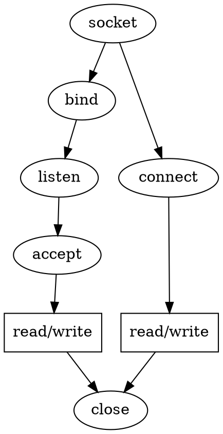

## Introduction

TCP connection involves a client and server side setup for the two ends to communicate.

- The client has to make two systemcalls, socket() and connect(), to connect to the server.
- The server has to make arrangements to create a listening socket so that the client can generate request to connect to this socket.
  To make such an arrangement, the server has to make four systemcalls: socket(), bind(), listen(), and accept().

We will study the implementation of each systemcall in the kernel.

We saw what happens when we make a socket systemcall.
We pass protocol family and type to socket(), and this does all the initial setup that involves initializing BSD and protocol socket operations. This involves initializing socket and sock structures.

Now we need to do the rest of the work on the socket, which is already initialized by a call to socket() for client and server in different ways.

Now we will study the details of the kernel data structures associated with TCP connection setup on both client and server side.

The details of port allocation by the server when we call bind().
This also details how the conflicts are resolved when the server generates a request for specific port allocation.
We will study the SYN queue design where the open connection request for the listening socket fi rst sits until the connection is completely established (three-way handshake is over).

We will also see how the open connection request is moved from the SYN queue to the accept queue when the TCP connection is established.

Finally, we will see how the established connections are taken off the accept queue by making accept() call.
Similarly, we will see how the client generates a connection request to the server (sends SYN segment to the listening server).

We will not cover the IP and link layer details but will surely cover everything that is associated with the client – server connection setup in the kernel.



see system calls:

1. [socket](/docs/CS/OS/Linux/net/socket.md?id=create)
2. [bind](/docs/CS/OS/Linux/Calls.md?id=bind)
3. [listen](/docs/CS/OS/Linux/Calls.md?id=listen)
4. [connect](/docs/CS/OS/Linux/Calls.md?id=connect)
5. [send](/docs/CS/OS/Linux/TCP.md?id=send)
6. [recv](/docs/CS/OS/Linux/TCP.md?id=recv)

<!-- tabs:start -->

#### **Server**

```c
socket(...,SOCK_STREAM,0);
bind(...,&server_address, ...);
listen(...);
accept(..., &client_address, ...);
recv(..., &clientaddr, ...);
close(...);
```

#### **Client**

```c
socket(...,SOCK_STREAM,0);
connect();
send(...,&server_address,...);
```

<!-- tabs:end -->

## Server Side Setup

- socket() systemcall only creates space for the socket in the kernel
- [bind()](/docs/CS/OS/Linux/Calls.md?id=bind) systemcall creates an identity for the socket and is the next step to create the server application
- Listen
- Accept

## send SYN

### connect

```
SYSCALL_DEFINE3(connect, int, fd, struct sockaddr __user *, uservaddr, int, addrlen)
{
	return __sys_connect(fd, uservaddr, addrlen);
}

int __sys_connect(int fd, struct sockaddr __user *uservaddr, int addrlen)
{
    __sys_connect_file(f.file, &address, addrlen, 0);
}   

int __sys_connect_file(struct file *file, struct sockaddr_storage *address,
		       int addrlen, int file_flags)
{
	err = sock->ops->connect(sock, (struct sockaddr *)address, addrlen, sock->file->f_flags | file_flags);
}   
```

### tcp_v4_connect

1. set state = TCP_SYN_SENT
2. inet_hash_connect
3. Build a SYN and send it off

```c
        
struct proto tcp_prot = {
	.name			= "TCP",
	.owner			= THIS_MODULE,
	.close			= tcp_close,
	.pre_connect		= tcp_v4_pre_connect,
	.connect		= tcp_v4_connect,
}


int tcp_v4_connect(struct sock *sk, struct sockaddr *uaddr, int addr_len)
{
	tcp_set_state(sk, TCP_SYN_SENT);
	err = inet_hash_connect(tcp_death_row, sk);
  ...
  if (likely(!tp->repair)) {
		if (!tp->write_seq)
			WRITE_ONCE(tp->write_seq,
				   secure_tcp_seq(inet->inet_saddr,
						  inet->inet_daddr,
						  inet->inet_sport,
						  usin->sin_port));
		WRITE_ONCE(tp->tsoffset,
			   secure_tcp_ts_off(net, inet->inet_saddr,
					     inet->inet_daddr));
	}
  
	err = tcp_connect(sk);

}
```

#### inet_hash_connect

Bind a port for a connect operation and hash it.

```c
int inet_hash_connect(struct inet_timewait_death_row *death_row,
		      struct sock *sk)
{
	u64 port_offset = 0;

	if (!inet_sk(sk)->inet_num)
		port_offset = inet_sk_port_offset(sk);
	return __inet_hash_connect(death_row, sk, port_offset,
				   __inet_check_established);
}
```

```c
#define	EADDRNOTAVAIL	99	/* Cannot assign requested address */


static int __inet_check_established(struct inet_timewait_death_row *death_row,
				    struct sock *sk, __u16 lport,
				    struct inet_timewait_sock **twp)
{
	struct inet_hashinfo *hinfo = death_row->hashinfo;
	struct inet_sock *inet = inet_sk(sk);
	__be32 daddr = inet->inet_rcv_saddr;
	__be32 saddr = inet->inet_daddr;
	int dif = sk->sk_bound_dev_if;
	struct net *net = sock_net(sk);
	int sdif = l3mdev_master_ifindex_by_index(net, dif);
	INET_ADDR_COOKIE(acookie, saddr, daddr);
	const __portpair ports = INET_COMBINED_PORTS(inet->inet_dport, lport);
	unsigned int hash = inet_ehashfn(net, daddr, lport,
					 saddr, inet->inet_dport);
	struct inet_ehash_bucket *head = inet_ehash_bucket(hinfo, hash);
	spinlock_t *lock = inet_ehash_lockp(hinfo, hash);
	struct sock *sk2;
	const struct hlist_nulls_node *node;
	struct inet_timewait_sock *tw = NULL;

	spin_lock(lock);

	sk_nulls_for_each(sk2, node, &head->chain) {
		if (sk2->sk_hash != hash)
			continue;

		if (likely(inet_match(net, sk2, acookie, ports, dif, sdif))) {
			if (sk2->sk_state == TCP_TIME_WAIT) {
				tw = inet_twsk(sk2);
				if (twsk_unique(sk, sk2, twp))
					break;
			}
			goto not_unique;
		}
	}

	/* Must record num and sport now. Otherwise we will see
	 * in hash table socket with a funny identity.
	 */
	inet->inet_num = lport;
	inet->inet_sport = htons(lport);
	sk->sk_hash = hash;
	WARN_ON(!sk_unhashed(sk));
	__sk_nulls_add_node_rcu(sk, &head->chain);
	if (tw) {
		sk_nulls_del_node_init_rcu((struct sock *)tw);
		__NET_INC_STATS(net, LINUX_MIB_TIMEWAITRECYCLED);
	}
	spin_unlock(lock);
	sock_prot_inuse_add(sock_net(sk), sk->sk_prot, 1);

	if (twp) {
		*twp = tw;
	} else if (tw) {
		/* Silly. Should hash-dance instead... */
		inet_twsk_deschedule_put(tw);
	}
	return 0;

not_unique:
	spin_unlock(lock);
	return -EADDRNOTAVAIL;
}
```

#### tcp_connect

Build a SYN and send it off

```c
int tcp_connect(struct sock *sk)
{
    struct tcp_sock *tp = tcp_sk(sk);
    struct sk_buff *buff;
    
    ...   
    tcp_connect_init(sk);

    buff = tcp_stream_alloc_skb(sk, sk->sk_allocation, true);
    tcp_init_nondata_skb(buff, tp->write_seq++, TCPHDR_SYN);
    tcp_mstamp_refresh(tp);
    tp->retrans_stamp = tcp_time_stamp_ts(tp);
    tcp_connect_queue_skb(sk, buff);
    tcp_ecn_send_syn(sk, buff);
    tcp_rbtree_insert(&sk->tcp_rtx_queue, buff);

    /* Send off SYN; include data in Fast Open. */
    err = tp->fastopen_req ? tcp_send_syn_data(sk, buff) :
    tcp_transmit_skb(sk, buff, 1, sk->sk_allocation);

    /* Timer for repeating the SYN until an answer. */
    inet_csk_reset_xmit_timer(sk, ICSK_TIME_RETRANS,
                              inet_csk(sk)->icsk_rto, TCP_RTO_MAX);
    return 0;
}
```

## rcv SYN

tcp_v4_rcv -> tcp_v4_do_rcv -> tcp_rcv_state_process

```c
int tcp_rcv_state_process(struct sock *sk, struct sk_buff *skb)
{
	case TCP_LISTEN:
		if (th->syn) {
			acceptable = icsk->icsk_af_ops->conn_request(sk, skb) >= 0;
		}
}	

const struct inet_connection_sock_af_ops ipv4_specific = {
	.conn_request	   = tcp_v4_conn_request,
	...
};

int tcp_v4_conn_request(struct sock *sk, struct sk_buff *skb)
{
	return tcp_conn_request(&tcp_request_sock_ops,
				&tcp_request_sock_ipv4_ops, sk, skb);
}
```

### tcp_conn_request

```c
int tcp_conn_request(struct request_sock_ops *rsk_ops,
		     const struct tcp_request_sock_ops *af_ops,
		     struct sock *sk, struct sk_buff *skb)
{
	syncookies = READ_ONCE(net->ipv4.sysctl_tcp_syncookies);

	/* TW buckets are converted to open requests without
	 * limitations, they conserve resources and peer is
	 * evidently real one.
	 */
	 // 半连接队列满
	if ((syncookies == 2 || inet_csk_reqsk_queue_is_full(sk)) && !isn) {
		want_cookie = tcp_syn_flood_action(sk, rsk_ops->slab_name);
		if (!want_cookie)
			goto drop;
	}
    // 全连接队列满
	if (sk_acceptq_is_full(sk)) {
		NET_INC_STATS(sock_net(sk), LINUX_MIB_LISTENOVERFLOWS);
		goto drop;
	}

	req = inet_reqsk_alloc(rsk_ops, sk, !want_cookie);

	if (!want_cookie && !isn) {
		int max_syn_backlog = READ_ONCE(net->ipv4.sysctl_max_syn_backlog);

		/* Kill the following clause, if you dislike this way. */
		if (!syncookies &&
		    (max_syn_backlog - inet_csk_reqsk_queue_len(sk) <
		     (max_syn_backlog >> 2)) &&
		    !tcp_peer_is_proven(req, dst)) {
			/* Without syncookies last quarter of
			 * backlog is filled with destinations,
			 * proven to be alive.
			 * It means that we continue to communicate
			 * to destinations, already remembered
			 * to the moment of synflood.
			 */
			pr_drop_req(req, ntohs(tcp_hdr(skb)->source),
				    rsk_ops->family);
			goto drop_and_release;
		}

		isn = af_ops->init_seq(skb);
	}

	tcp_ecn_create_request(req, skb, sk, dst);

	if (want_cookie) {
		isn = cookie_init_sequence(af_ops, sk, skb, &req->mss);
		if (!tmp_opt.tstamp_ok)
			inet_rsk(req)->ecn_ok = 0;
	}

	tcp_rsk(req)->snt_isn = isn;
	tcp_rsk(req)->txhash = net_tx_rndhash();
	tcp_rsk(req)->syn_tos = TCP_SKB_CB(skb)->ip_dsfield;
	tcp_openreq_init_rwin(req, sk, dst);
	sk_rx_queue_set(req_to_sk(req), skb);
	if (!want_cookie) {
		tcp_reqsk_record_syn(sk, req, skb);
		fastopen_sk = tcp_try_fastopen(sk, skb, req, &foc, dst);
	}
	if (fastopen_sk) {
		af_ops->send_synack(fastopen_sk, dst, &fl, req,
				    &foc, TCP_SYNACK_FASTOPEN, skb);
		/* Add the child socket directly into the accept queue */
		if (!inet_csk_reqsk_queue_add(sk, req, fastopen_sk)) {
			reqsk_fastopen_remove(fastopen_sk, req, false);
			bh_unlock_sock(fastopen_sk);
			sock_put(fastopen_sk);
			goto drop_and_free;
		}
		sk->sk_data_ready(sk);
		bh_unlock_sock(fastopen_sk);
		sock_put(fastopen_sk);
	} else {
		tcp_rsk(req)->tfo_listener = false;
		if (!want_cookie) {
			req->timeout = tcp_timeout_init((struct sock *)req);
			inet_csk_reqsk_queue_hash_add(sk, req, req->timeout); /** add timer, incr qlen and young **/
		}
		af_ops->send_synack(sk, dst, &fl, req, &foc,
				    !want_cookie ? TCP_SYNACK_NORMAL :
						   TCP_SYNACK_COOKIE,
				    skb);
		if (want_cookie) {
			reqsk_free(req);
			return 0;
		}
	}

}
```

SYN queue full

```c
// qlen >= sk_max_ack_backlog
static inline int inet_csk_reqsk_queue_is_full(const struct sock *sk)
{
	return inet_csk_reqsk_queue_len(sk) >= sk->sk_max_ack_backlog;
}
```

#### tcp_rtx_synack

inet_csk_reqsk_queue_hash_add -> reqsk_queue_hash_req -> reqsk_timer_handler -> inet_rtx_syn_ack

```c
int inet_rtx_syn_ack(const struct sock *parent, struct request_sock *req)
{
	int err = req->rsk_ops->rtx_syn_ack(parent, req);
}

struct request_sock_ops tcp_request_sock_ops __read_mostly = {
	.family		=	PF_INET,
	.obj_size	=	sizeof(struct tcp_request_sock),
	.rtx_syn_ack	=	tcp_rtx_synack,
	.send_ack	=	tcp_v4_reqsk_send_ack,
	.destructor	=	tcp_v4_reqsk_destructor,
	.send_reset	=	tcp_v4_send_reset,
	.syn_ack_timeout =	tcp_syn_ack_timeout,
};
```

```c

int tcp_rtx_synack(const struct sock *sk, struct request_sock *req)
{
	const struct tcp_request_sock_ops *af_ops = tcp_rsk(req)->af_specific;
	struct flowi fl;
	int res;

	tcp_rsk(req)->txhash = net_tx_rndhash();
	res = af_ops->send_synack(sk, NULL, &fl, req, NULL, TCP_SYNACK_NORMAL,
				  NULL);
	if (!res) {
		__TCP_INC_STATS(sock_net(sk), TCP_MIB_RETRANSSEGS);
		__NET_INC_STATS(sock_net(sk), LINUX_MIB_TCPSYNRETRANS);
		if (unlikely(tcp_passive_fastopen(sk)))
			tcp_sk(sk)->total_retrans++;
		trace_tcp_retransmit_synack(sk, req);
	}
	return res;
}
```

### tcp_v4_send_synack

Send a SYN-ACK after having received a SYN.

This still operates on a request_sock only, not on a big socket.

1. make synack
2. dd an ip header to a skbuff and send it out.(invoke [ip_local_out](/docs/CS/OS/Linux/net/network.md?id=ip_local_out))

```c
const struct tcp_request_sock_ops tcp_request_sock_ipv4_ops = {
    ...
	.send_synack	=	tcp_v4_send_synack,
};

static int tcp_v4_send_synack(const struct sock *sk, struct dst_entry *dst, ...)
{
	skb = tcp_make_synack(sk, dst, req, foc, synack_type, syn_skb);
    err = ip_build_and_send_pkt(skb, sk, ireq->ir_loc_addr, ...);
}
```

#### tcp_make_synack

Allocate one skb and build a SYNACK packet.

```c
struct sk_buff *tcp_make_synack(const struct sock *sk, struct dst_entry *dst,
				struct request_sock *req,
				struct tcp_fastopen_cookie *foc,
				enum tcp_synack_type synack_type,
				struct sk_buff *syn_skb)
{
	struct inet_request_sock *ireq = inet_rsk(req);
	const struct tcp_sock *tp = tcp_sk(sk);
	struct tcp_md5sig_key *md5 = NULL;
	struct tcp_out_options opts;
	struct sk_buff *skb;
	int tcp_header_size;
	struct tcphdr *th;
	int mss;
	u64 now;

	skb = alloc_skb(MAX_TCP_HEADER, GFP_ATOMIC);
	if (unlikely(!skb)) {
		dst_release(dst);
		return NULL;
	}
	/* Reserve space for headers. */
	skb_reserve(skb, MAX_TCP_HEADER);

	switch (synack_type) {
	case TCP_SYNACK_NORMAL:
		skb_set_owner_w(skb, req_to_sk(req));
		break;
	case TCP_SYNACK_COOKIE:
		/* Under synflood, we do not attach skb to a socket,
		 * to avoid false sharing.
		 */
		break;
	case TCP_SYNACK_FASTOPEN:
		/* sk is a const pointer, because we want to express multiple
		 * cpu might call us concurrently.
		 * sk->sk_wmem_alloc in an atomic, we can promote to rw.
		 */
		skb_set_owner_w(skb, (struct sock *)sk);
		break;
	}
	skb_dst_set(skb, dst);

	mss = tcp_mss_clamp(tp, dst_metric_advmss(dst));

	memset(&opts, 0, sizeof(opts));
	now = tcp_clock_ns();

	{
		skb->skb_mstamp_ns = now;
		if (!tcp_rsk(req)->snt_synack) /* Timestamp first SYNACK */
			tcp_rsk(req)->snt_synack = tcp_skb_timestamp_us(skb);
	}


	skb_set_hash(skb, tcp_rsk(req)->txhash, PKT_HASH_TYPE_L4);
	/* bpf program will be interested in the tcp_flags */
	TCP_SKB_CB(skb)->tcp_flags = TCPHDR_SYN | TCPHDR_ACK;
	tcp_header_size = tcp_synack_options(sk, req, mss, skb, &opts, md5,
					     foc, synack_type,
					     syn_skb) + sizeof(*th);

	skb_push(skb, tcp_header_size);
	skb_reset_transport_header(skb);

	th = (struct tcphdr *)skb->data;
	memset(th, 0, sizeof(struct tcphdr));
	th->syn = 1;
	th->ack = 1;
	tcp_ecn_make_synack(req, th);
	th->source = htons(ireq->ir_num);
	th->dest = ireq->ir_rmt_port;
	skb->mark = ireq->ir_mark;
	skb->ip_summed = CHECKSUM_PARTIAL;
	th->seq = htonl(tcp_rsk(req)->snt_isn);
	/* XXX data is queued and acked as is. No buffer/window check */
	th->ack_seq = htonl(tcp_rsk(req)->rcv_nxt);

	/* RFC1323: The window in SYN & SYN/ACK segments is never scaled. */
	th->window = htons(min(req->rsk_rcv_wnd, 65535U));
	tcp_options_write((__be32 *)(th + 1), NULL, &opts);
	th->doff = (tcp_header_size >> 2);
	__TCP_INC_STATS(sock_net(sk), TCP_MIB_OUTSEGS);


	bpf_skops_write_hdr_opt((struct sock *)sk, skb, req, syn_skb,
				synack_type, &opts);

	skb->skb_mstamp_ns = now;
	tcp_add_tx_delay(skb, tp);

	return skb;
}
```

## Rcv SYNACK

```c
int tcp_rcv_state_process(struct sock *sk, struct sk_buff *skb)
{
	switch (sk->sk_state) {
        case TCP_SYN_SENT:
		queued = tcp_rcv_synsent_state_process(sk, skb, th);
		if (queued >= 0)
			return queued;

		tcp_data_snd_check(sk);
	}
}
```

```c

static int tcp_rcv_synsent_state_process(struct sock *sk, struct sk_buff *skb,
					 const struct tcphdr *th)
{
	if (th->ack) {
		tcp_ack(sk, skb, FLAG_SLOWPATH);

		tcp_finish_connect(sk, skb);

		if (sk->sk_write_pending ||
		    icsk->icsk_accept_queue.rskq_defer_accept ||
		    inet_csk_in_pingpong_mode(sk)) {
			/* Save one ACK. Data will be ready after several ticks, if write_pending is set. */
			...
		}
		tcp_send_ack(sk);
	}
}
```

### tcp_finish_connect

```c

void tcp_finish_connect(struct sock *sk, struct sk_buff *skb)
{
	tcp_set_state(sk, TCP_ESTABLISHED);
	icsk->icsk_ack.lrcvtime = tcp_jiffies32;

	if (sock_flag(sk, SOCK_KEEPOPEN))
		inet_csk_reset_keepalive_timer(sk, keepalive_time_when(tp));
}
```

### tcp_send_ack

```c
void __tcp_send_ack(struct sock *sk, u32 rcv_nxt)
{
	struct sk_buff *buff;

	/* We are not putting this on the write queue, so
	 * tcp_transmit_skb() will set the ownership to this
	 * sock.
	 */
	buff = alloc_skb(MAX_TCP_HEADER,
			 sk_gfp_mask(sk, GFP_ATOMIC | __GFP_NOWARN));

	/* Send it off, this clears delayed acks for us. */
	__tcp_transmit_skb(sk, buff, 0, (__force gfp_t)0, rcv_nxt);
}
```

## Rcv ACK

```c
int tcp_v4_rcv(struct sk_buff *skb)
{
  if (sk->sk_state == TCP_NEW_SYN_RECV) {
		struct request_sock *req = inet_reqsk(sk);
		bool req_stolen = false;
		struct sock *nsk;

		sk = req->rsk_listener;
		if (unlikely(tcp_v4_inbound_md5_hash(sk, skb, dif, sdif))) {
			sk_drops_add(sk, skb);
			reqsk_put(req);
			goto discard_it;
		}
		if (tcp_checksum_complete(skb)) {
			reqsk_put(req);
			goto csum_error;
		}
		if (unlikely(sk->sk_state != TCP_LISTEN)) {
			inet_csk_reqsk_queue_drop_and_put(sk, req);
			goto lookup;
		}
		/* We own a reference on the listener, increase it again
		 * as we might lose it too soon.
		 */
		sock_hold(sk);
		refcounted = true;
		nsk = NULL;
		if (!tcp_filter(sk, skb)) {
			th = (const struct tcphdr *)skb->data;
			iph = ip_hdr(skb);
			tcp_v4_fill_cb(skb, iph, th);
			nsk = tcp_check_req(sk, skb, req, false, &req_stolen);
		}
		if (!nsk) {
			reqsk_put(req);
			if (req_stolen) {
				/* Another cpu got exclusive access to req
				 * and created a full blown socket.
				 * Try to feed this packet to this socket
				 * instead of discarding it.
				 */
				tcp_v4_restore_cb(skb);
				sock_put(sk);
				goto lookup;
			}
			goto discard_and_relse;
		}
		if (nsk == sk) {
			reqsk_put(req);
			tcp_v4_restore_cb(skb);
		} else if (tcp_child_process(sk, nsk, skb)) {
			tcp_v4_send_reset(nsk, skb);
			goto discard_and_relse;
		} else {
			sock_put(sk);
			return 0;
		}
	}
}
```

### tcp_check_req

Process an incoming packet for SYN_RECV sockets represented as a request_sock.
Normally sk is the listener socket but for TFO it points to the child socket.

XXX (TFO) - The current impl contains a special check for ack validation and inside tcp_v4_reqsk_send_ack().
Can we do better?
We don't need to initialize tmp_opt.sack_ok as we don't use the results

```c
struct sock *tcp_check_req(struct sock *sk, struct sk_buff *skb,
			   struct request_sock *req,
			   bool fastopen, bool *req_stolen)
{
	struct tcp_options_received tmp_opt;
	struct sock *child;
	const struct tcphdr *th = tcp_hdr(skb);
	__be32 flg = tcp_flag_word(th) & (TCP_FLAG_RST|TCP_FLAG_SYN|TCP_FLAG_ACK);
	bool paws_reject = false;
	bool own_req;

	tmp_opt.saw_tstamp = 0;
	if (th->doff > (sizeof(struct tcphdr)>>2)) {
		tcp_parse_options(sock_net(sk), skb, &tmp_opt, 0, NULL);

		if (tmp_opt.saw_tstamp) {
			tmp_opt.ts_recent = READ_ONCE(req->ts_recent);
			if (tmp_opt.rcv_tsecr)
				tmp_opt.rcv_tsecr -= tcp_rsk(req)->ts_off;
			/* We do not store true stamp, but it is not required,
			 * it can be estimated (approximately)
			 * from another data.
			 */
			tmp_opt.ts_recent_stamp = ktime_get_seconds() - reqsk_timeout(req, TCP_RTO_MAX) / HZ;
			paws_reject = tcp_paws_reject(&tmp_opt, th->rst);
		}
	}

	/* Check for pure retransmitted SYN. */
	if (TCP_SKB_CB(skb)->seq == tcp_rsk(req)->rcv_isn &&
	    flg == TCP_FLAG_SYN &&
	    !paws_reject) {
		/*
		 * RFC793 draws (Incorrectly! It was fixed in RFC1122)
		 * this case on figure 6 and figure 8, but formal
		 * protocol description says NOTHING.
		 * To be more exact, it says that we should send ACK,
		 * because this segment (at least, if it has no data)
		 * is out of window.
		 *
		 *  CONCLUSION: RFC793 (even with RFC1122) DOES NOT
		 *  describe SYN-RECV state. All the description
		 *  is wrong, we cannot believe to it and should
		 *  rely only on common sense and implementation
		 *  experience.
		 *
		 * Enforce "SYN-ACK" according to figure 8, figure 6
		 * of RFC793, fixed by RFC1122.
		 *
		 * Note that even if there is new data in the SYN packet
		 * they will be thrown away too.
		 *
		 * Reset timer after retransmitting SYNACK, similar to
		 * the idea of fast retransmit in recovery.
		 */
		if (!tcp_oow_rate_limited(sock_net(sk), skb,
					  LINUX_MIB_TCPACKSKIPPEDSYNRECV,
					  &tcp_rsk(req)->last_oow_ack_time) &&

		    !inet_rtx_syn_ack(sk, req)) {
			unsigned long expires = jiffies;

			expires += reqsk_timeout(req, TCP_RTO_MAX);
			if (!fastopen)
				mod_timer_pending(&req->rsk_timer, expires);
			else
				req->rsk_timer.expires = expires;
		}
		return NULL;
	}

	/* Further reproduces section "SEGMENT ARRIVES"
	   for state SYN-RECEIVED of RFC793.
	   It is broken, however, it does not work only
	   when SYNs are crossed.

	   You would think that SYN crossing is impossible here, since
	   we should have a SYN_SENT socket (from connect()) on our end,
	   but this is not true if the crossed SYNs were sent to both
	   ends by a malicious third party.  We must defend against this,
	   and to do that we first verify the ACK (as per RFC793, page
	   36) and reset if it is invalid.  Is this a true full defense?
	   To convince ourselves, let us consider a way in which the ACK
	   test can still pass in this 'malicious crossed SYNs' case.
	   Malicious sender sends identical SYNs (and thus identical sequence
	   numbers) to both A and B:

		A: gets SYN, seq=7
		B: gets SYN, seq=7

	   By our good fortune, both A and B select the same initial
	   send sequence number of seven :-)

		A: sends SYN|ACK, seq=7, ack_seq=8
		B: sends SYN|ACK, seq=7, ack_seq=8

	   So we are now A eating this SYN|ACK, ACK test passes.  So
	   does sequence test, SYN is truncated, and thus we consider
	   it a bare ACK.

	   If icsk->icsk_accept_queue.rskq_defer_accept, we silently drop this
	   bare ACK.  Otherwise, we create an established connection.  Both
	   ends (listening sockets) accept the new incoming connection and try
	   to talk to each other. 8-)

	   Note: This case is both harmless, and rare.  Possibility is about the
	   same as us discovering intelligent life on another plant tomorrow.

	   But generally, we should (RFC lies!) to accept ACK
	   from SYNACK both here and in tcp_rcv_state_process().
	   tcp_rcv_state_process() does not, hence, we do not too.

	   Note that the case is absolutely generic:
	   we cannot optimize anything here without
	   violating protocol. All the checks must be made
	   before attempt to create socket.
	 */

	/* RFC793 page 36: "If the connection is in any non-synchronized state ...
	 *                  and the incoming segment acknowledges something not yet
	 *                  sent (the segment carries an unacceptable ACK) ...
	 *                  a reset is sent."
	 *
	 * Invalid ACK: reset will be sent by listening socket.
	 * Note that the ACK validity check for a Fast Open socket is done
	 * elsewhere and is checked directly against the child socket rather
	 * than req because user data may have been sent out.
	 */
	if ((flg & TCP_FLAG_ACK) && !fastopen &&
	    (TCP_SKB_CB(skb)->ack_seq !=
	     tcp_rsk(req)->snt_isn + 1))
		return sk;

	/* Also, it would be not so bad idea to check rcv_tsecr, which
	 * is essentially ACK extension and too early or too late values
	 * should cause reset in unsynchronized states.
	 */

	/* RFC793: "first check sequence number". */

	if (paws_reject || !tcp_in_window(TCP_SKB_CB(skb)->seq,
					  TCP_SKB_CB(skb)->end_seq,
					  tcp_rsk(req)->rcv_nxt,
					  tcp_rsk(req)->rcv_nxt +
					  tcp_synack_window(req))) {
		/* Out of window: send ACK and drop. */
		if (!(flg & TCP_FLAG_RST) &&
		    !tcp_oow_rate_limited(sock_net(sk), skb,
					  LINUX_MIB_TCPACKSKIPPEDSYNRECV,
					  &tcp_rsk(req)->last_oow_ack_time))
			req->rsk_ops->send_ack(sk, skb, req);
		if (paws_reject)
			NET_INC_STATS(sock_net(sk), LINUX_MIB_PAWSESTABREJECTED);
		return NULL;
	}

	/* In sequence, PAWS is OK. */

	/* TODO: We probably should defer ts_recent change once
	 * we take ownership of @req.
	 */
	if (tmp_opt.saw_tstamp && !after(TCP_SKB_CB(skb)->seq, tcp_rsk(req)->rcv_nxt))
		WRITE_ONCE(req->ts_recent, tmp_opt.rcv_tsval);

	if (TCP_SKB_CB(skb)->seq == tcp_rsk(req)->rcv_isn) {
		/* Truncate SYN, it is out of window starting
		   at tcp_rsk(req)->rcv_isn + 1. */
		flg &= ~TCP_FLAG_SYN;
	}

	/* RFC793: "second check the RST bit" and
	 *	   "fourth, check the SYN bit"
	 */
	if (flg & (TCP_FLAG_RST|TCP_FLAG_SYN)) {
		TCP_INC_STATS(sock_net(sk), TCP_MIB_ATTEMPTFAILS);
		goto embryonic_reset;
	}

	/* ACK sequence verified above, just make sure ACK is
	 * set.  If ACK not set, just silently drop the packet.
	 *
	 * XXX (TFO) - if we ever allow "data after SYN", the
	 * following check needs to be removed.
	 */
	if (!(flg & TCP_FLAG_ACK))
		return NULL;

	/* For Fast Open no more processing is needed (sk is the
	 * child socket).
	 */
	if (fastopen)
		return sk;

	/* While TCP_DEFER_ACCEPT is active, drop bare ACK. */
	if (req->num_timeout < READ_ONCE(inet_csk(sk)->icsk_accept_queue.rskq_defer_accept) &&
	    TCP_SKB_CB(skb)->end_seq == tcp_rsk(req)->rcv_isn + 1) {
		inet_rsk(req)->acked = 1;
		__NET_INC_STATS(sock_net(sk), LINUX_MIB_TCPDEFERACCEPTDROP);
		return NULL;
	}

	/* OK, ACK is valid, create big socket and
	 * feed this segment to it. It will repeat all
	 * the tests. THIS SEGMENT MUST MOVE SOCKET TO
	 * ESTABLISHED STATE. If it will be dropped after
	 * socket is created, wait for troubles.
	 */
	child = inet_csk(sk)->icsk_af_ops->syn_recv_sock(sk, skb, req, NULL,
							 req, &own_req);
	if (!child)
		goto listen_overflow;

	if (own_req && rsk_drop_req(req)) {
		reqsk_queue_removed(&inet_csk(req->rsk_listener)->icsk_accept_queue, req);
		inet_csk_reqsk_queue_drop_and_put(req->rsk_listener, req);
		return child;
	}

	sock_rps_save_rxhash(child, skb);
	tcp_synack_rtt_meas(child, req);
	*req_stolen = !own_req;
	return inet_csk_complete_hashdance(sk, child, req, own_req);

listen_overflow:
	if (sk != req->rsk_listener)
		__NET_INC_STATS(sock_net(sk), LINUX_MIB_TCPMIGRATEREQFAILURE);

	if (!READ_ONCE(sock_net(sk)->ipv4.sysctl_tcp_abort_on_overflow)) {
		inet_rsk(req)->acked = 1;
		return NULL;
	}

embryonic_reset:
	if (!(flg & TCP_FLAG_RST)) {
		/* Received a bad SYN pkt - for TFO We try not to reset
		 * the local connection unless it's really necessary to
		 * avoid becoming vulnerable to outside attack aiming at
		 * resetting legit local connections.
		 */
		req->rsk_ops->send_reset(sk, skb, SK_RST_REASON_INVALID_SYN);
	} else if (fastopen) { /* received a valid RST pkt */
		reqsk_fastopen_remove(sk, req, true);
		tcp_reset(sk, skb);
	}
	if (!fastopen) {
		bool unlinked = inet_csk_reqsk_queue_drop(sk, req);

		if (unlinked)
			__NET_INC_STATS(sock_net(sk), LINUX_MIB_EMBRYONICRSTS);
		*req_stolen = !unlinked;
	}
	return NULL;
}
EXPORT_SYMBOL(tcp_check_req);
```
可以看到，这里会检查 accept 队列的长度。如果队列已满，跳到 exit_overflow 标签执行一些清理工作、更新 /proc/net/netstat 中的统计项 ListenOverflows 和 ListenDrops ，最后返回 NULL 。这会触发 tcp_check_req 函数跳到 listen_overflow 标签执行代码。
```c
listen_overflow:
	if (sk != req->rsk_listener)
		__NET_INC_STATS(sock_net(sk), LINUX_MIB_TCPMIGRATEREQFAILURE);

	if (!READ_ONCE(sock_net(sk)->ipv4.sysctl_tcp_abort_on_overflow)) {
		inet_rsk(req)->acked = 1;
		return NULL;
	}
```
除非 /proc/sys/net/ipv4/tcp_abort_on_overflow 被设置为 1 (这种情况下发送一个 RST 包)，实现什么都没做。

Linux 内核协议栈在收到3次握手最后一个 ACK 包，确认一个新连接已完成。
在 accept 队列已满的情况下，会忽略这个包。一开始您可能会对此感到奇怪——别忘了 SYN RECEIVED 状态下有一个计时器实现：如果 ACK 包没有收到(或者是我们讨论的忽略)，协议栈会重发 SYN/ACK 包(重试次数由 /proc/sys/net/ipv4/tcp_synack_retries 决定)

于客户端的 TCP 实现在收到多个 SYN/ACK 包时，认为 ACK 包已经丢失了并且重传它。如果在 SYN/ACK 重试次数达到限制前，服务端应用从 accept 队列接收连接，使得 backlog 减少，那么协议栈会处理这些重传的 ACK 包，将连接状态从 SYN RECEIVED 变更到 ESTABLISHED 并且将其加入 accept 队列。否则，正如以上包跟踪所示，客户端会收到一个 RST 包宣告连接失败

在 accept 队列已满的情况下，内核会强制限制 SYN 包的接收速率。如果有大量 SYN 包待处理，它们其中的一些会被丢弃。这样看来，就完全依靠客户端重传 SYN 包了，这种行为跟 BSD 实现一样

#### tcp_v4_send_ack

The code following below sending ACKs in SYN-RECV and TIME-WAIT states outside socket context.

```c

static void tcp_v4_send_ack(const struct sock *sk,
			    struct sk_buff *skb, u32 seq, u32 ack,
			    u32 win, u32 tsval, u32 tsecr, int oif,
			    struct tcp_md5sig_key *key,
			    int reply_flags, u8 tos)
{
	const struct tcphdr *th = tcp_hdr(skb);
	struct {
		struct tcphdr th;
		__be32 opt[(TCPOLEN_TSTAMP_ALIGNED >> 2)
#ifdef CONFIG_TCP_MD5SIG
			   + (TCPOLEN_MD5SIG_ALIGNED >> 2)
#endif
			];
	} rep;
	struct net *net = sock_net(sk);
	struct ip_reply_arg arg;
	struct sock *ctl_sk;
	u64 transmit_time;

	memset(&rep.th, 0, sizeof(struct tcphdr));
	memset(&arg, 0, sizeof(arg));

	arg.iov[0].iov_base = (unsigned char *)&rep;
	arg.iov[0].iov_len  = sizeof(rep.th);
	if (tsecr) {
		rep.opt[0] = htonl((TCPOPT_NOP << 24) | (TCPOPT_NOP << 16) |
				   (TCPOPT_TIMESTAMP << 8) |
				   TCPOLEN_TIMESTAMP);
		rep.opt[1] = htonl(tsval);
		rep.opt[2] = htonl(tsecr);
		arg.iov[0].iov_len += TCPOLEN_TSTAMP_ALIGNED;
	}

	/* Swap the send and the receive. */
	rep.th.dest    = th->source;
	rep.th.source  = th->dest;
	rep.th.doff    = arg.iov[0].iov_len / 4;
	rep.th.seq     = htonl(seq);
	rep.th.ack_seq = htonl(ack);
	rep.th.ack     = 1;
	rep.th.window  = htons(win);

	arg.flags = reply_flags;
	arg.csum = csum_tcpudp_nofold(ip_hdr(skb)->daddr,
				      ip_hdr(skb)->saddr, /* XXX */
				      arg.iov[0].iov_len, IPPROTO_TCP, 0);
	arg.csumoffset = offsetof(struct tcphdr, check) / 2;
	if (oif)
		arg.bound_dev_if = oif;
	arg.tos = tos;
	arg.uid = sock_net_uid(net, sk_fullsock(sk) ? sk : NULL);
	local_bh_disable();
	ctl_sk = this_cpu_read(*net->ipv4.tcp_sk);
	ctl_sk->sk_mark = (sk->sk_state == TCP_TIME_WAIT) ?
			   inet_twsk(sk)->tw_mark : sk->sk_mark;
	ctl_sk->sk_priority = (sk->sk_state == TCP_TIME_WAIT) ?
			   inet_twsk(sk)->tw_priority : sk->sk_priority;
	transmit_time = tcp_transmit_time(sk);
```

call ip_send_unicast_reply -> ip_push_pending_frames

```c
	ip_send_unicast_reply(ctl_sk,
			      skb, &TCP_SKB_CB(skb)->header.h4.opt,
			      ip_hdr(skb)->saddr, ip_hdr(skb)->daddr,
			      &arg, arg.iov[0].iov_len,
			      transmit_time);

	ctl_sk->sk_mark = 0;
	__TCP_INC_STATS(net, TCP_MIB_OUTSEGS);
	local_bh_enable();
}
```

#### inet_csk_complete_hashdance

call `inet_csk_reqsk_queue_add` add into accept queue

```c

struct sock *inet_csk_complete_hashdance(struct sock *sk, struct sock *child,
					 struct request_sock *req, bool own_req)
{
	if (own_req) {
		inet_csk_reqsk_queue_drop(sk, req);
		reqsk_queue_removed(&inet_csk(sk)->icsk_accept_queue, req);
		if (inet_csk_reqsk_queue_add(sk, req, child))
			return child;
	}
	/* Too bad, another child took ownership of the request, undo. */
	bh_unlock_sock(child);
	sock_put(child);
	return NULL;
}
```

```c

static void tcp_v4_reqsk_send_ack(const struct sock *sk, struct sk_buff *skb,
				  struct request_sock *req)
{
	/* sk->sk_state == TCP_LISTEN -> for regular TCP_SYN_RECV
	 * sk->sk_state == TCP_SYN_RECV -> for Fast Open.
	 */
	u32 seq = (sk->sk_state == TCP_LISTEN) ? tcp_rsk(req)->snt_isn + 1 :
					     tcp_sk(sk)->snd_nxt;


	tcp_v4_send_ack(sk, skb, seq, ...);
}
```

## Links

- [docs/CS/OS/Linux/TCP](/docs/CS/OS/Linux/TCP.md)
