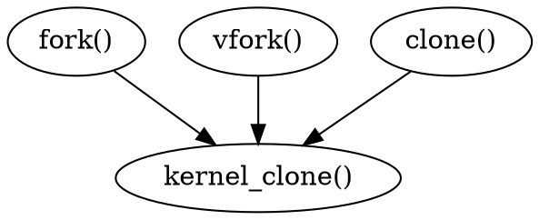

## Introduction

Linux employs a hierarchical scheme in which each process depends on a parent process.
The kernel starts the init program as the first process that is responsible for further system initialization actions and display of the login prompt or (in more widespread use today) display of a graphical login interface.
init is therefore the root from which all processes originate, more or less directly, as shown graphically by the pstree program.
init is the top of a tree structure whose branches spread further and further down.

kthread

```shell
ps -fax
```


How this tree structure spreads is closely connected with how new processes are generated.
For this purpose, Unix uses two mechanisms called fork and exec.

1. [fork](/docs/CS/OS/Linux/proc/process.md?id=fork) — Generates an exact copy of the current process that differs from the parent process only in its PID (process identification).
   After the system call has been executed, there are two processes in the system, both performing the same actions.
   The memory contents of the initial process are duplicated -- at least in the view of the program.
   Linux uses a well-known technique known as copy on write that allows it to make the operation much more efficient by deferring the copy operations until either parent or child writes to a page -— read-only accessed can be satisfied from the same page for both.
2. [exec](/docs/CS/OS/Linux/proc/process.md?id=exec) — Loads a new program into an existing content and then executes it. The memory pages reserved by the old program are flushed, and their contents are replaced with new data. The new program then starts executing.


## task struct

The Linux kernel internally represents processes as tasks, via the structure `task struct`.
Unlike other OS approaches (which make a distinction between a process, lightweight process, and thread), Linux uses the task structure to represent any execution context. 
Therefore, a single-threaded process will be represented with one task structure and a multithreaded process will have one task structure for each of the user-level threads. 
Finally, the kernel itself is multithreaded, and has kernel-level threads which are not associated with any user process and are executing kernel code.

task_struct 中封装了很多资源

> 实时的空间进程布局可以在`/proc/PID/maps`文件中查看到


```c
struct task_struct {
    // Linux 通过 pid 来区分进程 相同进程下的线程的 tgid 是相同的 	
    pid_t                       pid;
    pid_t                       tgid;
    
       // 进程树关系 
    /* Real parent process: */
    struct task_struct __rcu	*real_parent;
    
    /* Recipient of SIGCHLD, wait4() reports: */
    struct task_struct __rcu	*parent;
    
    /*
     * Children/sibling form the list of natural children:
     */
    struct list_head		children;
    struct list_head		sibling;
    struct task_struct		*group_leader;

    /* -1 unrunnable, 0 runnable, >0 stopped: */
    volatile long                state;
    
    int                         prio;
    int                         static_prio;
    int                         normal_prio;
    
    struct sched_info             sched_info;
    
    struct list_head              tasks;
    
    struct mm_struct              *mm;
    struct mm_struct              *active_mm;
    
    /* Per-thread vma caching: */
    struct vmacache                      vmacache;
    
    /* Filesystem information: */
    struct fs_struct              *fs;
    
    /* Open file information: */
    struct files_struct           *files;
    
    #ifdef CONFIG_IO_URING
       struct io_uring_task          *io_uring;
    #endif

   /* Namespaces: */
   struct nsproxy               *nsproxy;

};
```


`get_current()` implement by different arch


#### state

Task state bitmask. NOTE! These bits are also encoded in fs/proc/array.c: get_task_state().

We have two separate sets of flags: task->state is about runnability, while task->exit_state are about the task exiting. 
Confusing, but this way modifying one set can't modify the other one by mistake.

> 进程的运行状态和其它信息可以在`/proc/PID/status`文件中查看

进程刚创建是 TASK_RUNNING 状态 ,等待调度

```c
// sched.h
/* Used in tsk->state: */
#define TASK_RUNNING			0x0000
#define TASK_INTERRUPTIBLE		0x0001
#define TASK_UNINTERRUPTIBLE		0x0002
#define __TASK_STOPPED			0x0004
#define __TASK_TRACED			0x0008
/* Used in tsk->exit_state: */
#define EXIT_DEAD			0x0010
#define EXIT_ZOMBIE			0x0020
#define EXIT_TRACE			(EXIT_ZOMBIE | EXIT_DEAD)
/* Used in tsk->state again: */
#define TASK_PARKED			0x0040
#define TASK_DEAD			0x0080
#define TASK_WAKEKILL			0x0100
#define TASK_WAKING			0x0200
#define TASK_NOLOAD			0x0400
#define TASK_NEW			0x0800
#define TASK_STATE_MAX			0x1000

/* Convenience macros for the sake of set_current_state: */
#define TASK_KILLABLE			(TASK_WAKEKILL | TASK_UNINTERRUPTIBLE)
#define TASK_STOPPED			(TASK_WAKEKILL | __TASK_STOPPED)
#define TASK_TRACED			(TASK_WAKEKILL | __TASK_TRACED)

#define TASK_IDLE			(TASK_UNINTERRUPTIBLE | TASK_NOLOAD)

/* Convenience macros for the sake of wake_up(): */
#define TASK_NORMAL			(TASK_INTERRUPTIBLE | TASK_UNINTERRUPTIBLE)

/* get_task_state(): */
#define TASK_REPORT			(TASK_RUNNING | TASK_INTERRUPTIBLE | \
					 TASK_UNINTERRUPTIBLE | __TASK_STOPPED | \
					 __TASK_TRACED | EXIT_DEAD | EXIT_ZOMBIE | \
					 TASK_PARKED)

```

### mm

对于用户进程来说 整个进程虚拟内存空间部分都是由 [mm_struct](/docs/CS/OS/Linux/mm/vm.md) 来表示的
进程运行时 在用户态需要的内存数据 如代码 全局变量和 mmap 内存映射都是通过其进行内存查找和寻址的

内核线程只固定工作在地址空间较高的部分 不涉及虚拟内存的使用 所以 mm_struct 为 null

```c

       struct mm_struct              *mm;
       struct mm_struct              *active_mm;
```


### fs

进程的文件位置等信息是由 [fs_struct](/docs/CS/OS/Linux/fs/fs.md) 来描述的

进程使用files_struct 记录文件描述符的使用情况

### namespace

A structure to contain pointers to all per-process namespaces - fs (mount), uts, network, sysvipc, etc.

The pid namespace is an exception -- it's accessed using task_active_pid_ns.  The pid namespace here is the namespace that children will use.

'count' is the number of tasks holding a reference.
The count for each namespace, then, will be the number of nsproxies pointing to it, not the number of tasks.

The nsproxy is shared by tasks which share all namespaces.
As soon as a single namespace is cloned or unshared, the nsproxy is copied.

```c
// nsproxy.h
struct nsproxy {
	atomic_t count;
	struct uts_namespace *uts_ns;
	struct ipc_namespace *ipc_ns;
	struct mnt_namespace *mnt_ns;
	struct pid_namespace *pid_ns_for_children;
	struct net 	     *net_ns;
	struct cgroup_namespace *cgroup_ns;
};
```


## init task

Set up the first task table, touch at your own risk!. Base=0,
**limit=0x1fffff (=2MB)**

```c
// init/init_task.c
struct task_struct init_task
#ifdef CONFIG_ARCH_TASK_STRUCT_ON_STACK
	__init_task_data
#endif
	__aligned(L1_CACHE_BYTES)
= {
#ifdef CONFIG_THREAD_INFO_IN_TASK
	.thread_info	= INIT_THREAD_INFO(init_task),
	.stack_refcount	= REFCOUNT_INIT(1),
#endif
	.__state	= 0,
```
fix up initial thread stack pointer vs thread_info confusion  
The task ->stack pointer only incidentally ends up having the same value as the thread_info, and in fact that will change.  
So fix the initial task struct initializer to point to 'init_stack' instead of 'init_thread_info', and make sure the ia64 definition for that exists.  
This actually makes the ia64 tsk->stack pointer be sensible for the initial task, but not for any other task.

```c
	.stack		= init_stack,
	.usage		= REFCOUNT_INIT(2),
	.flags		= PF_KTHREAD,
	.prio		= MAX_PRIO - 20,
	.static_prio	= MAX_PRIO - 20,
	.normal_prio	= MAX_PRIO - 20,
	.policy		= SCHED_NORMAL,
	.cpus_ptr	= &init_task.cpus_mask,
	.user_cpus_ptr	= NULL,
	.cpus_mask	= CPU_MASK_ALL,
	.nr_cpus_allowed= NR_CPUS,
	.mm		= NULL,
	.active_mm	= &init_mm,
	.restart_block	= {
		.fn = do_no_restart_syscall,
	},
	.se		= {
		.group_node 	= LIST_HEAD_INIT(init_task.se.group_node),
	},
	.rt		= {
		.run_list	= LIST_HEAD_INIT(init_task.rt.run_list),
		.time_slice	= RR_TIMESLICE,
	},
	.tasks		= LIST_HEAD_INIT(init_task.tasks),
#ifdef CONFIG_SMP
	.pushable_tasks	= PLIST_NODE_INIT(init_task.pushable_tasks, MAX_PRIO),
#endif
#ifdef CONFIG_CGROUP_SCHED
	.sched_task_group = &root_task_group,
#endif
	.ptraced	= LIST_HEAD_INIT(init_task.ptraced),
	.ptrace_entry	= LIST_HEAD_INIT(init_task.ptrace_entry),
	.real_parent	= &init_task,
	.parent		= &init_task,
	.children	= LIST_HEAD_INIT(init_task.children),
	.sibling	= LIST_HEAD_INIT(init_task.sibling),
	.group_leader	= &init_task,
	RCU_POINTER_INITIALIZER(real_cred, &init_cred),
	RCU_POINTER_INITIALIZER(cred, &init_cred),
	.comm		= INIT_TASK_COMM,
	.thread		= INIT_THREAD,
	.fs		= &init_fs,
	.files		= &init_files,
#ifdef CONFIG_IO_URING
	.io_uring	= NULL,
#endif
	.signal		= &init_signals,
	.sighand	= &init_sighand,
	.nsproxy	= &init_nsproxy,
	.pending	= {
		.list = LIST_HEAD_INIT(init_task.pending.list),
		.signal = {{0}}
	},
	.blocked	= {{0}},
	.alloc_lock	= __SPIN_LOCK_UNLOCKED(init_task.alloc_lock),
	.journal_info	= NULL,
	INIT_CPU_TIMERS(init_task)
	.pi_lock	= __RAW_SPIN_LOCK_UNLOCKED(init_task.pi_lock),
	.timer_slack_ns = 50000, /* 50 usec default slack */
	.thread_pid	= &init_struct_pid,
	.thread_group	= LIST_HEAD_INIT(init_task.thread_group),
	.thread_node	= LIST_HEAD_INIT(init_signals.thread_head),
#ifdef CONFIG_AUDIT
	.loginuid	= INVALID_UID,
	.sessionid	= AUDIT_SID_UNSET,
#endif
#ifdef CONFIG_PERF_EVENTS
	.perf_event_mutex = __MUTEX_INITIALIZER(init_task.perf_event_mutex),
	.perf_event_list = LIST_HEAD_INIT(init_task.perf_event_list),
#endif
#ifdef CONFIG_PREEMPT_RCU
	.rcu_read_lock_nesting = 0,
	.rcu_read_unlock_special.s = 0,
	.rcu_node_entry = LIST_HEAD_INIT(init_task.rcu_node_entry),
	.rcu_blocked_node = NULL,
#endif
#ifdef CONFIG_TASKS_RCU
	.rcu_tasks_holdout = false,
	.rcu_tasks_holdout_list = LIST_HEAD_INIT(init_task.rcu_tasks_holdout_list),
	.rcu_tasks_idle_cpu = -1,
#endif
#ifdef CONFIG_TASKS_TRACE_RCU
	.trc_reader_nesting = 0,
	.trc_reader_special.s = 0,
	.trc_holdout_list = LIST_HEAD_INIT(init_task.trc_holdout_list),
#endif
#ifdef CONFIG_CPUSETS
	.mems_allowed_seq = SEQCNT_SPINLOCK_ZERO(init_task.mems_allowed_seq,
						 &init_task.alloc_lock),
#endif
#ifdef CONFIG_RT_MUTEXES
	.pi_waiters	= RB_ROOT_CACHED,
	.pi_top_task	= NULL,
#endif
	INIT_PREV_CPUTIME(init_task)
#ifdef CONFIG_VIRT_CPU_ACCOUNTING_GEN
	.vtime.seqcount	= SEQCNT_ZERO(init_task.vtime_seqcount),
	.vtime.starttime = 0,
	.vtime.state	= VTIME_SYS,
#endif
#ifdef CONFIG_NUMA_BALANCING
	.numa_preferred_nid = NUMA_NO_NODE,
	.numa_group	= NULL,
	.numa_faults	= NULL,
#endif
#if defined(CONFIG_KASAN_GENERIC) || defined(CONFIG_KASAN_SW_TAGS)
	.kasan_depth	= 1,
#endif
#ifdef CONFIG_KCSAN
	.kcsan_ctx = {
		.disable_count		= 0,
		.atomic_next		= 0,
		.atomic_nest_count	= 0,
		.in_flat_atomic		= false,
		.access_mask		= 0,
		.scoped_accesses	= {LIST_POISON1, NULL},
	},
#endif
#ifdef CONFIG_TRACE_IRQFLAGS
	.softirqs_enabled = 1,
#endif
#ifdef CONFIG_LOCKDEP
	.lockdep_depth = 0, /* no locks held yet */
	.curr_chain_key = INITIAL_CHAIN_KEY,
	.lockdep_recursion = 0,
#endif
#ifdef CONFIG_FUNCTION_GRAPH_TRACER
	.ret_stack		= NULL,
	.tracing_graph_pause	= ATOMIC_INIT(0),
#endif
#if defined(CONFIG_TRACING) && defined(CONFIG_PREEMPTION)
	.trace_recursion = 0,
#endif
#ifdef CONFIG_LIVEPATCH
	.patch_state	= KLP_UNDEFINED,
#endif
#ifdef CONFIG_SECURITY
	.security	= NULL,
#endif
#ifdef CONFIG_SECCOMP_FILTER
	.seccomp	= { .filter_count = ATOMIC_INIT(0) },
#endif
};
EXPORT_SYMBOL(init_task);
```


#### thread_info


```c
// arch/x86/include/asm/thread_info.h
struct thread_info {
	unsigned long		flags;		/* low level flags */
	unsigned long		syscall_work;	/* SYSCALL_WORK_ flags */
	u32			status;		/* thread synchronous flags */
#ifdef CONFIG_SMP
	u32			cpu;		/* current CPU */
#endif
}
```


#### exit
```c
// kernel/exit.c

void __noreturn do_exit(long code)
{
	struct task_struct *tsk = current;
	int group_dead;

	/*
	 * We can get here from a kernel oops, sometimes with preemption off.
	 * Start by checking for critical errors.
	 * Then fix up important state like USER_DS and preemption.
	 * Then do everything else.
	 */

	WARN_ON(blk_needs_flush_plug(tsk));

	if (unlikely(in_interrupt()))
		panic("Aiee, killing interrupt handler!");
	if (unlikely(!tsk->pid))
		panic("Attempted to kill the idle task!");

	/*
	 * If do_exit is called because this processes oopsed, it's possible
	 * that get_fs() was left as KERNEL_DS, so reset it to USER_DS before
	 * continuing. Amongst other possible reasons, this is to prevent
	 * mm_release()->clear_child_tid() from writing to a user-controlled
	 * kernel address.
	 */
	force_uaccess_begin();

	if (unlikely(in_atomic())) {
		pr_info("note: %s[%d] exited with preempt_count %d\n",
			current->comm, task_pid_nr(current),
			preempt_count());
		preempt_count_set(PREEMPT_ENABLED);
	}

	profile_task_exit(tsk);
	kcov_task_exit(tsk);

	ptrace_event(PTRACE_EVENT_EXIT, code);

	validate_creds_for_do_exit(tsk);

	/*
	 * We're taking recursive faults here in do_exit. Safest is to just
	 * leave this task alone and wait for reboot.
	 */
	if (unlikely(tsk->flags & PF_EXITING)) {
		pr_alert("Fixing recursive fault but reboot is needed!\n");
		futex_exit_recursive(tsk);
		set_current_state(TASK_UNINTERRUPTIBLE);
		schedule();
	}

	io_uring_files_cancel(tsk->files);
	exit_signals(tsk);  /* sets PF_EXITING */

	/* sync mm's RSS info before statistics gathering */
	if (tsk->mm)
		sync_mm_rss(tsk->mm);
	acct_update_integrals(tsk);
	group_dead = atomic_dec_and_test(&tsk->signal->live);
	if (group_dead) {
		/*
		 * If the last thread of global init has exited, panic
		 * immediately to get a useable coredump.
		 */
		if (unlikely(is_global_init(tsk)))
			panic("Attempted to kill init! exitcode=0x%08x\n",
				tsk->signal->group_exit_code ?: (int)code);

#ifdef CONFIG_POSIX_TIMERS
		hrtimer_cancel(&tsk->signal->real_timer);
		exit_itimers(tsk->signal);
#endif
		if (tsk->mm)
			setmax_mm_hiwater_rss(&tsk->signal->maxrss, tsk->mm);
	}
	acct_collect(code, group_dead);
	if (group_dead)
		tty_audit_exit();
	audit_free(tsk);

	tsk->exit_code = code;
	taskstats_exit(tsk, group_dead);

	exit_mm();

	if (group_dead)
		acct_process();
	trace_sched_process_exit(tsk);

	exit_sem(tsk);
	exit_shm(tsk);
	exit_files(tsk);
	exit_fs(tsk);
	if (group_dead)
		disassociate_ctty(1);
	exit_task_namespaces(tsk);
	exit_task_work(tsk);
	exit_thread(tsk);

	/*
	 * Flush inherited counters to the parent - before the parent
	 * gets woken up by child-exit notifications.
	 *
	 * because of cgroup mode, must be called before cgroup_exit()
	 */
	perf_event_exit_task(tsk);

	sched_autogroup_exit_task(tsk);
	cgroup_exit(tsk);

	/*
	 * FIXME: do that only when needed, using sched_exit tracepoint
	 */
	flush_ptrace_hw_breakpoint(tsk);

	exit_tasks_rcu_start();
	exit_notify(tsk, group_dead);
	proc_exit_connector(tsk);
	mpol_put_task_policy(tsk);
#ifdef CONFIG_FUTEX
	if (unlikely(current->pi_state_cache))
		kfree(current->pi_state_cache);
#endif
	/*
	 * Make sure we are holding no locks:
	 */
	debug_check_no_locks_held();

	if (tsk->io_context)
		exit_io_context(tsk);

	if (tsk->splice_pipe)
		free_pipe_info(tsk->splice_pipe);

	if (tsk->task_frag.page)
		put_page(tsk->task_frag.page);

	validate_creds_for_do_exit(tsk);

	check_stack_usage();
	preempt_disable();
	if (tsk->nr_dirtied)
		__this_cpu_add(dirty_throttle_leaks, tsk->nr_dirtied);
	exit_rcu();
	exit_tasks_rcu_finish();

	lockdep_free_task(tsk);
	do_task_dead();
}
```

## termination

A parent process may wait for the termination of a child process by using the wait() system call. 
The wait() system call is passed a parameter that allows the parent to obtain the exit status of the child. 
This system call also returns the process identifier of the terminated child so that the parent can tell which of its children has terminated:
```c
pid t pid;
int status;
pid = wait(&status);
```

When a process terminates, its resources are deallocated by the operating system. 
However, its entry in the process table must remain there until the parent calls wait(), because the process table contains the process’s exit status.
A process that has terminated, but whose parent has not yet called wait(), is known as a **zombie** process. 
All processes transition to this state when they terminate, but generally they exist as zombies only briefly. 
Once the parent calls wait(), the process identifier of the zombie process and its entry in the process table are released.

If a parent did not invoke wait() and instead terminated, thereby leaving its child processes as **orphans**.
Traditional UNIX systems addressed this scenario by assigning the init process as the new parent to orphan processes.
The init process periodically invokes wait(), thereby allowing the exit status of any orphaned process to be collected and releasing the orphan’s process identifier and process-table entry.


## fork


Processes are created in Linux in an especially simple manner. 
The fork system call creates an exact copy of the original process. 
The forking process is called the *parent process*. The new process is called the *child process*. 
The parent and child each have their own, private memory images. 
If the parent subsequently changes any of its variables, the changes are not visible to the child, and vice versa.

The fork system call returns a 0 to the child and a nonzero value, the child’s **PID** (*Process Identifier*), to the parent.
Both processes normally check the return value and act accordingly.
The child doesn’t start running at main() like you might expect; rather, it just comes into life as if it had called fork() itself.

```c
void main(int argc, char *argv[])
{
    pid = fork( ); /* if the fork succeeds, pid > 0 in the parent */
    if (pid < 0) {
        handle error( ); /* fork failed (e.g., memory or some table is full) */
    } else if (pid > 0) {
        /* parent code goes here. /*/
    } else {
        /* child code goes here. /*/
    }
}
```

When the child process is created, there are now two active processes in the system.
The CPU scheduler determines which process runs at a given moment in time; because the scheduler is complex, we cannot usually make strong assumptions about what it will choose to do, and hence which process will run first. 
This nondeterminism, as it turns out, leads to some interesting problems, particularly in multi-threaded programs.


Linux systems give the child its own page tables, but have them point to the parent’s pages, only marked read only.
Whenever either process (the child or the parent) tries to write on a page, it gets a protection fault.
The kernel sees this and then allocates a new copy of the page to the faulting process and marks it read/write.
In this way, only pages that are actually written have to be copied.
This mechanism is called *copy on write*.
It has the additional benefit of not requiring two copies of the program in memory, thus saving RAM.


The `wait()` system call allows a parent to wait for its child to complete execution.

The `exec()` family of system calls allows a child to break free from its similarity to its parent and execute an entirely new program.
The exec merely replaces the current process — its text, data, heap, and stack segments — with a brand-new program from disk.
A successful call to `exec()` never returns.

The separation of fork() and exec() is essential in building a UNIX shell, because it lets the shell run code after the call to fork() but before the call to exec(); 
this code can alter the environment of the about-to-be-run program, and thus enables a variety of interesting features to be readily built.

> [!TIP]
> 
> GETTING IT RIGHT (LAMPSON’S LAW)
> 
> As Lampson states in his well-regarded “Hints for Computer Systems Design”, “Get it right. 
> Neither abstraction nor simplicity is a substitute for getting it right.” Sometimes, you just have to do the right thing, and when you do, it is way better than the alternatives. 
> 
> There are lots of ways to design APIs for process creation; however, the combination of fork() and exec() are simple and immensely powerful.

The shell is just a user program. 
It shows you a prompt and then waits for you to type something into it. You then type a command (i.e., the name of an executable program, plus any arguments) into it; 
in most cases, the shell then figures out where in the file system the executable resides, calls fork() to create a new child process to run the command, 
calls some variant of exec() to run the command, and then waits for the command to complete by calling wait(). 
When the child completes, the shell returns from wait() and prints out a prompt again, ready for your next command.




Create a kernel thread.
```c
pid_t kernel_thread(int (*fn)(void *), void *arg, unsigned long flags)
{
	struct kernel_clone_args args = {
		.flags		= ((lower_32_bits(flags) | CLONE_VM |
				    CLONE_UNTRACED) & ~CSIGNAL),
		.exit_signal	= (lower_32_bits(flags) & CSIGNAL),
		.stack		= (unsigned long)fn,
		.stack_size	= (unsigned long)arg,
	};

	return kernel_clone(&args);
}
```


> [!NOTE]
> 
> Link: [fork: introduce kernel_clone()](https://lore.kernel.org/all/20200819104655.436656-2-christian.brauner@ubuntu.com/)
> 
> The old _do_fork() helper doesn't follow naming conventions of in-kernel helpers for syscalls.
> The process creation cleanup in [1] didn't change the name to something more reasonable mainly because _do_fork() was used in quite a few places.
> So sending this as a separate series seemed the better strategy. 
> 
> This commit does two things:
>   1. renames _do_fork() to kernel_clone() but keeps _do_fork() as a simple static inline wrapper around kernel_clone().
>   2. Changes the return type from long to pid_t. This aligns kernel_thread() and kernel_clone().
>
> Also, the return value from kernel_clone that is surfaced in fork(), vfork(), clone(), and clone3() is taken from pid_vrn() which returns a pid_t too.  
> Follow-up patches will switch each caller of _do_fork() and each place where it is referenced over to kernel_clone().
> After all these changes are done, we can remove _do_fork() completely and will only be left with kernel_clone().


### kernel_clone

Ok, this is the main fork-routine.
It copies the process, and if successful kick-starts
it and waits for it to finish using the VM if required.
args->exit_signal is expected to be checked for sanity by the caller.

1. copy_process
2. trace_sched_process_fork
3. wake_up_new_task 添加到调度队列
4. ptrace_event_pid
5. wait_for_vfork_done if **vfork** -- avoid dirty data and deadlock

```c
// kernel/fork.c
pid_t kernel_clone(struct kernel_clone_args *args)
{
       u64 clone_flags = args->flags;
       struct completion vfork;
       struct pid *pid;
       struct task_struct *p;
       int trace = 0;
       pid_t nr;
```
For legacy clone() calls, CLONE_PIDFD uses the parent_tid argument
to return the pidfd. Hence, CLONE_PIDFD and CLONE_PARENT_SETTID are
mutually exclusive. With clone3() CLONE_PIDFD has grown a separate
field in struct clone_args and it still doesn't make sense to have
them both point at the same memory location. Performing this check
here has the advantage that we don't need to have a separate helper
to check for legacy clone().
```c
       if ((args->flags & CLONE_PIDFD) &&
           (args->flags & CLONE_PARENT_SETTID) &&
           (args->pidfd == args->parent_tid))
              return -EINVAL;
```
Determine whether and which event to report to ptracer.  When
called from kernel_thread or CLONE_UNTRACED is explicitly
requested, no event is reported; otherwise, report if the event
for the type of forking is enabled.
```c
       if (!(clone_flags & CLONE_UNTRACED)) {
              if (clone_flags & CLONE_VFORK)
                     trace = PTRACE_EVENT_VFORK;
              else if (args->exit_signal != SIGCHLD)
                     trace = PTRACE_EVENT_CLONE;
              else
                     trace = PTRACE_EVENT_FORK;

              if (likely(!ptrace_event_enabled(current, trace)))
                     trace = 0;
       }

       p = copy_process(NULL, trace, NUMA_NO_NODE, args);
       add_latent_entropy();

       /*
        * Do this prior waking up the new thread - the thread pointer
        * might get invalid after that point, if the thread exits quickly.
        */
       trace_sched_process_fork(current, p);

       pid = get_task_pid(p, PIDTYPE_PID);
       nr = pid_vnr(pid);

       if (clone_flags & CLONE_PARENT_SETTID)
              put_user(nr, args->parent_tid);

       if (clone_flags & CLONE_VFORK) {
              p->vfork_done = &vfork;
              init_completion(&vfork);
              get_task_struct(p);
       }

       wake_up_new_task(p);

       /* forking complete and child started to run, tell ptracer */
       if (unlikely(trace))
              ptrace_event_pid(trace, pid);

       if (clone_flags & CLONE_VFORK) {
              if (!wait_for_vfork_done(p, &vfork))
                     ptrace_event_pid(PTRACE_EVENT_VFORK_DONE, pid);
       }

       put_pid(pid);
       return nr;
}
```


### copy_process


This creates a new process as a copy of the old one, but does not actually start it yet.

It copies the registers, and all the appropriate parts of the process environment (as per the clone flags). The actual kick-off is left to the caller.

```c
//
static __latent_entropy struct task_struct *copy_process(
                                   struct pid *pid,
                                   int trace,
                                   int node,
                                   struct kernel_clone_args *args)
{
       int pidfd = -1, retval;
       struct task_struct *p;
       struct multiprocess_signals delayed;
       struct file *pidfile = NULL;
       u64 clone_flags = args->flags;
       struct nsproxy *nsp = current->nsproxy;

       // ...
       p = dup_task_struct(current, node);

       // ...
       cgroup_fork(p);

       sched_fork(clone_flags, p);

       copy_files(clone_flags, p);

       copy_fs(clone_flags, p);

       copy_sighand(clone_flags, p);

       copy_signal(clone_flags, p);

       copy_mm(clone_flags, p);

       copy_namespaces(clone_flags, p);

       copy_io(clone_flags, p);

       copy_thread(clone_flags, args->stack, args->stack_size, p, args->tls);
       
       pid = alloc_pid(p->nsproxy->pid_ns_for_children, args->set_tid, args->set_tid_size);

       p->pid = pid_nr(pid);
       if (clone_flags & CLONE_THREAD) {
              p->group_leader = current->group_leader;
              p->tgid = current->tgid;
       } else {
              p->group_leader = p;
              p->tgid = p->pid;
       }

       cgroup_can_fork(p, args);

       klp_copy_process(p);

       copy_seccomp(p);

       init_task_pid_links(p);
       
       return p;
}
```


#### dup_task_struct

```c
// kernel/fork.c
static struct task_struct *dup_task_struct(struct task_struct *orig, int node)
{
	struct task_struct *tsk;
	unsigned long *stack;

	tsk = alloc_task_struct_node(node);

	stack = alloc_thread_stack_node(tsk, node);

	err = arch_dup_task_struct(tsk, orig);

	tsk->stack = stack;
       // ...
}
```


##### alloc_task_struct_node

```c
static inline struct task_struct *alloc_task_struct_node(int node)
{
	return kmem_cache_alloc_node(task_struct_cachep, GFP_KERNEL, node);
}
```

##### arch_dup_task_struct
implements by different arches

```c
// arch/x86/kernel/process.c
/*
 * this gets called so that we can store lazy state into memory and copy the
 * current task into the new thread.
 */
int arch_dup_task_struct(struct task_struct *dst, struct task_struct *src)
{
	memcpy(dst, src, arch_task_struct_size);
#ifdef CONFIG_VM86
	dst->thread.vm86 = NULL;
#endif
	/* Drop the copied pointer to current's fpstate */
	dst->thread.fpu.fpstate = NULL;

	return 0;
}
```


#### copy_files

```c
static int copy_files(unsigned long clone_flags, struct task_struct *tsk,
		      int no_files)
{
	struct files_struct *oldf, *newf;
	oldf = current->files;

	if (clone_flags & CLONE_FILES) {
		atomic_inc(&oldf->count);
		goto out;
	}
       // Allocate a new files structure and copy contents from the passed in files structure.
	newf = dup_fd(oldf, NR_OPEN_MAX, &error);

	tsk->files = newf;
       // ...
}
```


#### copy_fs

```c

static int copy_fs(unsigned long clone_flags, struct task_struct *tsk)
{
	struct fs_struct *fs = current->fs;
	if (clone_flags & CLONE_FS) {
		fs->users++;
		return 0;
	}
	tsk->fs = copy_fs_struct(fs);
       return 0;
}
```
#### copy_mm

if not **vfork**, dup_mm

```c
static int copy_mm(unsigned long clone_flags, struct task_struct *tsk)
{
	struct mm_struct *mm, *oldmm;
	oldmm = current->mm;

	if (clone_flags & CLONE_VM) {
		mmget(oldmm);
		mm = oldmm;
	} else {
		mm = dup_mm(tsk, current->mm);
		if (!mm)
			return -ENOMEM;
	}

	tsk->mm = mm;
	tsk->active_mm = mm;
	return 0;
}
```


```c
static struct mm_struct *dup_mm(struct task_struct *tsk,
				struct mm_struct *oldmm)
{
	struct mm_struct *mm;
	int err;

	mm = allocate_mm();
	memcpy(mm, oldmm, sizeof(*mm));

	err = dup_mmap(mm, oldmm);
       // ...
	return mm;
}
```


#### copy_thread

x86

```c

int copy_thread(unsigned long clone_flags, unsigned long sp, unsigned long arg,
		struct task_struct *p, unsigned long tls)
{
	struct inactive_task_frame *frame;
	struct fork_frame *fork_frame;
	struct pt_regs *childregs;
	int ret = 0;

	childregs = task_pt_regs(p);
	fork_frame = container_of(childregs, struct fork_frame, regs);
	frame = &fork_frame->frame;

	frame->bp = encode_frame_pointer(childregs);
	frame->ret_addr = (unsigned long) ret_from_fork;
	p->thread.sp = (unsigned long) fork_frame;
	p->thread.io_bitmap = NULL;
	memset(p->thread.ptrace_bps, 0, sizeof(p->thread.ptrace_bps));

#ifdef CONFIG_X86_64
	current_save_fsgs();
	p->thread.fsindex = current->thread.fsindex;
	p->thread.fsbase = current->thread.fsbase;
	p->thread.gsindex = current->thread.gsindex;
	p->thread.gsbase = current->thread.gsbase;

	savesegment(es, p->thread.es);
	savesegment(ds, p->thread.ds);
#else
	p->thread.sp0 = (unsigned long) (childregs + 1);
	/*
	 * Clear all status flags including IF and set fixed bit. 64bit
	 * does not have this initialization as the frame does not contain
	 * flags. The flags consistency (especially vs. AC) is there
	 * ensured via objtool, which lacks 32bit support.
	 */
	frame->flags = X86_EFLAGS_FIXED;
#endif

	/* Kernel thread ? */
	if (unlikely(p->flags & PF_KTHREAD)) {
		memset(childregs, 0, sizeof(struct pt_regs));
		kthread_frame_init(frame, sp, arg);
		return 0;
	}

	frame->bx = 0;
	*childregs = *current_pt_regs();
	childregs->ax = 0;
	if (sp)
		childregs->sp = sp;

#ifdef CONFIG_X86_32
	task_user_gs(p) = get_user_gs(current_pt_regs());
#endif

	if (unlikely(p->flags & PF_IO_WORKER)) {
		/*
		 * An IO thread is a user space thread, but it doesn't
		 * return to ret_after_fork().
		 *
		 * In order to indicate that to tools like gdb,
		 * we reset the stack and instruction pointers.
		 *
		 * It does the same kernel frame setup to return to a kernel
		 * function that a kernel thread does.
		 */
		childregs->sp = 0;
		childregs->ip = 0;
		kthread_frame_init(frame, sp, arg);
		return 0;
	}

	/* Set a new TLS for the child thread? */
	if (clone_flags & CLONE_SETTLS)
		ret = set_new_tls(p, tls);

	if (!ret && unlikely(test_tsk_thread_flag(current, TIF_IO_BITMAP)))
		io_bitmap_share(p);

	return ret;
}
```


#### sched_fork
fork()/clone()-time setup:
```c
// kernel/sched/core.c
int sched_fork(unsigned long clone_flags, struct task_struct *p)
{
	__sched_fork(clone_flags, p);
	/*
	 * We mark the process as NEW here. This guarantees that
	 * nobody will actually run it, and a signal or other external
	 * event cannot wake it up and insert it on the runqueue either.
	 */
	p->__state = TASK_NEW;

	/*
	 * Make sure we do not leak PI boosting priority to the child.
	 */
	p->prio = current->normal_prio;

	uclamp_fork(p);

	/*
	 * Revert to default priority/policy on fork if requested.
	 */
	if (unlikely(p->sched_reset_on_fork)) {
		if (task_has_dl_policy(p) || task_has_rt_policy(p)) {
			p->policy = SCHED_NORMAL;
			p->static_prio = NICE_TO_PRIO(0);
			p->rt_priority = 0;
		} else if (PRIO_TO_NICE(p->static_prio) < 0)
			p->static_prio = NICE_TO_PRIO(0);

		p->prio = p->normal_prio = p->static_prio;
		set_load_weight(p, false);

		/*
		 * We don't need the reset flag anymore after the fork. It has
		 * fulfilled its duty:
		 */
		p->sched_reset_on_fork = 0;
	}

	if (dl_prio(p->prio))
		return -EAGAIN;
	else if (rt_prio(p->prio))
		p->sched_class = &rt_sched_class;
	else
		p->sched_class = &fair_sched_class;

	init_entity_runnable_average(&p->se);

#ifdef CONFIG_SCHED_INFO
	if (likely(sched_info_on()))
		memset(&p->sched_info, 0, sizeof(p->sched_info));
#endif
#if defined(CONFIG_SMP)
	p->on_cpu = 0;
#endif
	init_task_preempt_count(p);
#ifdef CONFIG_SMP
	plist_node_init(&p->pushable_tasks, MAX_PRIO);
	RB_CLEAR_NODE(&p->pushable_dl_tasks);
#endif
	return 0;
}
```

#### alloc_pid

[Replace PID bitmap allocation with IDR API](https://lwn.net/Articles/735675/)

since v4.15

> [!NOTE]
>
> Whatever type of failure alloc_pid returns, its error type is written to return -ENOMEM.

> ENOMEM is not the most obvious choice especially for the case where the child subreaper has already exited and the pid namespace denies the creation of any new processes. 
> But ENOMEM is what we have exposed to userspace for a long time and it is
documented behavior for pid namespaces. 
> So we can't easily change it even if there were an error code better suited.

<!-- tabs:start -->

##### **Bitmap**

```c
tatic int alloc_pidmap(struct pid_namespace *pid_ns)
{
	int i, offset, max_scan, pid, last = pid_ns->last_pid;
	struct pidmap *map;

	pid = last + 1;
	if (pid >= pid_max)
		pid = RESERVED_PIDS;
	offset = pid & BITS_PER_PAGE_MASK;
	map = &pid_ns->pidmap[pid/BITS_PER_PAGE];
	/*
	 * If last_pid points into the middle of the map->page we
	 * want to scan this bitmap block twice, the second time
	 * we start with offset == 0 (or RESERVED_PIDS).
	 */
	max_scan = DIV_ROUND_UP(pid_max, BITS_PER_PAGE) - !offset;
	for (i = 0; i <= max_scan; ++i) {
		if (unlikely(!map->page)) {
			void *page = kzalloc(PAGE_SIZE, GFP_KERNEL);
			/*
			 * Free the page if someone raced with us
			 * installing it:
			 */
			spin_lock_irq(&pidmap_lock);
			if (!map->page) {
				map->page = page;
				page = NULL;
			}
			spin_unlock_irq(&pidmap_lock);
			kfree(page);
			if (unlikely(!map->page))
				break;
		}
		if (likely(atomic_read(&map->nr_free))) {
			for ( ; ; ) {
				if (!test_and_set_bit(offset, map->page)) {
					atomic_dec(&map->nr_free);
					set_last_pid(pid_ns, last, pid);
					return pid;
				}
				offset = find_next_offset(map, offset);
				if (offset >= BITS_PER_PAGE)
					break;
				pid = mk_pid(pid_ns, map, offset);
				if (pid >= pid_max)
					break;
			}
		}
		if (map < &pid_ns->pidmap[(pid_max-1)/BITS_PER_PAGE]) {
			++map;
			offset = 0;
		} else {
			map = &pid_ns->pidmap[0];
			offset = RESERVED_PIDS;
			if (unlikely(last == offset))
				break;
		}
		pid = mk_pid(pid_ns, map, offset);
	}
	return -1;
}
```


##### **IDR**

```c
struct pid *alloc_pid(struct pid_namespace *ns)
{
	struct pid *pid;
	enum pid_type type;
	int i, nr;
	struct pid_namespace *tmp;
	struct upid *upid;
	int retval = -ENOMEM;

	pid = kmem_cache_alloc(ns->pid_cachep, GFP_KERNEL);

	tmp = ns;
	pid->level = ns->level;

	for (i = ns->level; i >= 0; i--) {
		int pid_min = 1;

		idr_preload(GFP_KERNEL);
		spin_lock_irq(&pidmap_lock);

		/* 
		 * init really needs pid 1, but after reaching the maximum
		 * wrap back to RESERVED_PIDS
		 */
		if (idr_get_cursor(&tmp->idr) > RESERVED_PIDS)
			pid_min = RESERVED_PIDS;

		/*
		 * Store a null pointer so find_pid_ns does not find
		 * a partially initialized PID (see below).
		 */
		nr = idr_alloc_cyclic(&tmp->idr, NULL, pid_min,
				      pid_max, GFP_ATOMIC);
		spin_unlock_irq(&pidmap_lock);
		idr_preload_end();

		if (nr < 0) {
			retval = (nr == -ENOSPC) ? -EAGAIN : nr;
			goto out_free;
		}

		pid->numbers[i].nr = nr;
		pid->numbers[i].ns = tmp;
		tmp = tmp->parent;
	}
	// ...
}	
```

<!-- tabs:end -->

### thread

常用的glibc库 创建线程调用的是 `pthread_create` 函数

We rely heavily on various flags the CLONE function understands:

CLONE_VM, CLONE_FS, CLONE_FILES

These flags select semantics with shared address space and file descriptors according to what POSIX requires.

     CLONE_SIGHAND, CLONE_THREAD
	This flag selects the POSIX signal semantics and various
	other kinds of sharing (itimers, POSIX timers, etc.).

     CLONE_SETTLS
	The sixth parameter to CLONE determines the TLS area for the
	new thread.

     CLONE_PARENT_SETTID
	The kernels writes the thread ID of the newly created thread
	into the location pointed to by the fifth parameters to CLONE.

	Note that it would be semantically equivalent to use
	CLONE_CHILD_SETTID but it is be more expensive in the kernel.

     CLONE_CHILD_CLEARTID
	The kernels clears the thread ID of a thread that has called
	sys_exit() in the location pointed to by the seventh parameter
	to CLONE.

     The termination signal is chosen to be zero which means no signal
     is sent. 
```c
static int create_thread (struct pthread *pd, const struct pthread_attr *attr,
			  bool *stopped_start, void *stackaddr,
			  size_t stacksize, bool *thread_ran)
{
    // ...
  const int clone_flags = (CLONE_VM | CLONE_FS | CLONE_FILES | CLONE_SYSVSEM
			   | CLONE_SIGHAND | CLONE_THREAD
			   | CLONE_SETTLS | CLONE_PARENT_SETTID
			   | CLONE_CHILD_CLEARTID
			   | 0);

  TLS_DEFINE_INIT_TP (tp, pd);

  struct clone_args args =
    {
      .flags = clone_flags,
      .pidfd = (uintptr_t) &pd->tid,
      .parent_tid = (uintptr_t) &pd->tid,
      .child_tid = (uintptr_t) &pd->tid,
      .stack = (uintptr_t) stackaddr,
      .stack_size = stacksize,
      .tls = (uintptr_t) tp,
    };
  int ret = __clone_internal (&args, &start_thread, pd);
  if (__glibc_unlikely (ret == -1))
    return errno;

  /* It's started now, so if we fail below, we'll have to let it clean itself
     up.  */
  *thread_ran = true;

  /* Now we have the possibility to set scheduling parameters etc.  */
  if (attr != NULL)
    {
      /* Set the affinity mask if necessary.  */
      if (need_setaffinity)
	{
	  assert (*stopped_start);

	  int res = INTERNAL_SYSCALL_CALL (sched_setaffinity, pd->tid,
					   attr->extension->cpusetsize,
					   attr->extension->cpuset);
	  if (__glibc_unlikely (INTERNAL_SYSCALL_ERROR_P (res)))
	    return INTERNAL_SYSCALL_ERRNO (res);
	}

      /* Set the scheduling parameters.  */
      if ((attr->flags & ATTR_FLAG_NOTINHERITSCHED) != 0)
	{
	  assert (*stopped_start);

	  int res = INTERNAL_SYSCALL_CALL (sched_setscheduler, pd->tid,
					   pd->schedpolicy, &pd->schedparam);
	  if (__glibc_unlikely (INTERNAL_SYSCALL_ERROR_P (res)))
	    return INTERNAL_SYSCALL_ERRNO (res);
	}
    }

  return 0;
}
```

创建线程调用的是 `clone` 同样也是走到了 [kernel_clone](/docs/CS/OS/Linux/proc/process.md?id=kernel_clone)


## exec

Now the new address space must be created and filled in. 
If the system supports mapped files, as Linux and virtually all other UNIX-based systems do, the new page tables are set up to indicate that no pages are in memory, 
except perhaps one stack page, but that the address space is backed by the executable file on disk.
When the new process starts running, it will immediately get a page fault, which will cause the first page of code to be paged in from the executable file. 
In this way, nothing has to be loaded in advance, so programs can start quickly and fault in just those pages they need and no more.
Finally, the arguments and environment strings are copied to the new stack, the signals are reset, and the registers are initialized to all zeros. 
At this point, the new command can start running.


```c
static int do_execve(struct filename *filename,
	const char __user *const __user *__argv,
	const char __user *const __user *__envp)
{
	struct user_arg_ptr argv = { .ptr.native = __argv };
	struct user_arg_ptr envp = { .ptr.native = __envp };
	return do_execveat_common(AT_FDCWD, filename, argv, envp, 0);
}

static int do_execveat_common(int fd, struct filename *filename,
			      struct user_arg_ptr argv,
			      struct user_arg_ptr envp,
			      int flags)
{
	struct linux_binprm *bprm;
	int retval;
    // ...

	bprm = alloc_bprm(fd, filename, flags);

	retval = count(argv, MAX_ARG_STRINGS);
	retval = count(envp, MAX_ARG_STRINGS);
    // ...
	retval = bprm_execve(bprm);
}


```
### bprm_execve

```c
static int bprm_execve(struct linux_binprm *bprm)
{
	int retval;

	retval = prepare_bprm_creds(bprm);
	if (retval)
		return retval;

	/*
	 * Check for unsafe execution states before exec_binprm(), which
	 * will call back into begin_new_exec(), into bprm_creds_from_file(),
	 * where setuid-ness is evaluated.
	 */
	check_unsafe_exec(bprm);
	current->in_execve = 1;
	sched_mm_cid_before_execve(current);

	sched_exec();

	/* Set the unchanging part of bprm->cred */
	retval = security_bprm_creds_for_exec(bprm);
	if (retval)
		goto out;

	retval = exec_binprm(bprm);
	if (retval < 0)
		goto out;

	sched_mm_cid_after_execve(current);
	/* execve succeeded */
	current->fs->in_exec = 0;
	current->in_execve = 0;
	rseq_execve(current);
	user_events_execve(current);
	acct_update_integrals(current);
	task_numa_free(current, false);
	return retval;
}
```

#### exec_binprm

```c
/* binfmt handlers will call back into begin_new_exec() on success. */
static int exec_binprm(struct linux_binprm *bprm)
{
	pid_t old_pid, old_vpid;
	int ret, depth;

	/* Need to fetch pid before load_binary changes it */
	old_pid = current->pid;
	rcu_read_lock();
	old_vpid = task_pid_nr_ns(current, task_active_pid_ns(current->parent));
	rcu_read_unlock();

	/* This allows 4 levels of binfmt rewrites before failing hard. */
	for (depth = 0;; depth++) {
		struct file *exec;
		if (depth > 5)
			return -ELOOP;

		ret = search_binary_handler(bprm);
		if (ret < 0)
			return ret;
		if (!bprm->interpreter)
			break;

		exec = bprm->file;
		bprm->file = bprm->interpreter;
		bprm->interpreter = NULL;

		allow_write_access(exec);
		if (unlikely(bprm->have_execfd)) {
			if (bprm->executable) {
				fput(exec);
				return -ENOEXEC;
			}
			bprm->executable = exec;
		} else
			fput(exec);
	}

	audit_bprm(bprm);
	trace_sched_process_exec(current, old_pid, bprm);
	ptrace_event(PTRACE_EVENT_EXEC, old_vpid);
	proc_exec_connector(current);
	return 0;
}
```


#### load_elf_binary


```c

static int load_elf_binary(struct linux_binprm *bprm)
{
	struct file *interpreter = NULL; /* to shut gcc up */
	unsigned long load_bias = 0, phdr_addr = 0;
	int first_pt_load = 1;
	unsigned long error;
	struct elf_phdr *elf_ppnt, *elf_phdata, *interp_elf_phdata = NULL;
	struct elf_phdr *elf_property_phdata = NULL;
	unsigned long elf_brk;
	int retval, i;
	unsigned long elf_entry;
	unsigned long e_entry;
	unsigned long interp_load_addr = 0;
	unsigned long start_code, end_code, start_data, end_data;
	unsigned long reloc_func_desc __maybe_unused = 0;
	int executable_stack = EXSTACK_DEFAULT;
	struct elfhdr *elf_ex = (struct elfhdr *)bprm->buf;
	struct elfhdr *interp_elf_ex = NULL;
	struct arch_elf_state arch_state = INIT_ARCH_ELF_STATE;
	struct mm_struct *mm;
	struct pt_regs *regs;

	retval = -ENOEXEC;
	/* First of all, some simple consistency checks */
	if (memcmp(elf_ex->e_ident, ELFMAG, SELFMAG) != 0)
		goto out;

	if (elf_ex->e_type != ET_EXEC && elf_ex->e_type != ET_DYN)
		goto out;
	if (!elf_check_arch(elf_ex))
		goto out;
	if (elf_check_fdpic(elf_ex))
		goto out;
	if (!bprm->file->f_op->mmap)
		goto out;

	elf_phdata = load_elf_phdrs(elf_ex, bprm->file);
	if (!elf_phdata)
		goto out;

	elf_ppnt = elf_phdata;
	for (i = 0; i < elf_ex->e_phnum; i++, elf_ppnt++) {
		char *elf_interpreter;

		if (elf_ppnt->p_type == PT_GNU_PROPERTY) {
			elf_property_phdata = elf_ppnt;
			continue;
		}

		if (elf_ppnt->p_type != PT_INTERP)
			continue;

		/*
		 * This is the program interpreter used for shared libraries -
		 * for now assume that this is an a.out format binary.
		 */
		retval = -ENOEXEC;
		if (elf_ppnt->p_filesz > PATH_MAX || elf_ppnt->p_filesz < 2)
			goto out_free_ph;

		retval = -ENOMEM;
		elf_interpreter = kmalloc(elf_ppnt->p_filesz, GFP_KERNEL);
		if (!elf_interpreter)
			goto out_free_ph;

		retval = elf_read(bprm->file, elf_interpreter, elf_ppnt->p_filesz,
				  elf_ppnt->p_offset);
		if (retval < 0)
			goto out_free_interp;
		/* make sure path is NULL terminated */
		retval = -ENOEXEC;
		if (elf_interpreter[elf_ppnt->p_filesz - 1] != '\0')
			goto out_free_interp;

		interpreter = open_exec(elf_interpreter);
		kfree(elf_interpreter);
		retval = PTR_ERR(interpreter);
		if (IS_ERR(interpreter))
			goto out_free_ph;

		/*
		 * If the binary is not readable then enforce mm->dumpable = 0
		 * regardless of the interpreter's permissions.
		 */
		would_dump(bprm, interpreter);

		interp_elf_ex = kmalloc(sizeof(*interp_elf_ex), GFP_KERNEL);
		if (!interp_elf_ex) {
			retval = -ENOMEM;
			goto out_free_file;
		}

		/* Get the exec headers */
		retval = elf_read(interpreter, interp_elf_ex,
				  sizeof(*interp_elf_ex), 0);
		if (retval < 0)
			goto out_free_dentry;

		break;

out_free_interp:
		kfree(elf_interpreter);
		goto out_free_ph;
	}

	elf_ppnt = elf_phdata;
	for (i = 0; i < elf_ex->e_phnum; i++, elf_ppnt++)
		switch (elf_ppnt->p_type) {
		case PT_GNU_STACK:
			if (elf_ppnt->p_flags & PF_X)
				executable_stack = EXSTACK_ENABLE_X;
			else
				executable_stack = EXSTACK_DISABLE_X;
			break;

		case PT_LOPROC ... PT_HIPROC:
			retval = arch_elf_pt_proc(elf_ex, elf_ppnt,
						  bprm->file, false,
						  &arch_state);
			if (retval)
				goto out_free_dentry;
			break;
		}

	/* Some simple consistency checks for the interpreter */
	if (interpreter) {
		retval = -ELIBBAD;
		/* Not an ELF interpreter */
		if (memcmp(interp_elf_ex->e_ident, ELFMAG, SELFMAG) != 0)
			goto out_free_dentry;
		/* Verify the interpreter has a valid arch */
		if (!elf_check_arch(interp_elf_ex) ||
		    elf_check_fdpic(interp_elf_ex))
			goto out_free_dentry;

		/* Load the interpreter program headers */
		interp_elf_phdata = load_elf_phdrs(interp_elf_ex,
						   interpreter);
		if (!interp_elf_phdata)
			goto out_free_dentry;

		/* Pass PT_LOPROC..PT_HIPROC headers to arch code */
		elf_property_phdata = NULL;
		elf_ppnt = interp_elf_phdata;
		for (i = 0; i < interp_elf_ex->e_phnum; i++, elf_ppnt++)
			switch (elf_ppnt->p_type) {
			case PT_GNU_PROPERTY:
				elf_property_phdata = elf_ppnt;
				break;

			case PT_LOPROC ... PT_HIPROC:
				retval = arch_elf_pt_proc(interp_elf_ex,
							  elf_ppnt, interpreter,
							  true, &arch_state);
				if (retval)
					goto out_free_dentry;
				break;
			}
	}

	retval = parse_elf_properties(interpreter ?: bprm->file,
				      elf_property_phdata, &arch_state);
	if (retval)
		goto out_free_dentry;

	/*
	 * Allow arch code to reject the ELF at this point, whilst it's
	 * still possible to return an error to the code that invoked
	 * the exec syscall.
	 */
	retval = arch_check_elf(elf_ex,
				!!interpreter, interp_elf_ex,
				&arch_state);
	if (retval)
		goto out_free_dentry;

	/* Flush all traces of the currently running executable */
	retval = begin_new_exec(bprm);
	if (retval)
		goto out_free_dentry;

	/* Do this immediately, since STACK_TOP as used in setup_arg_pages
	   may depend on the personality.  */
	SET_PERSONALITY2(*elf_ex, &arch_state);
	if (elf_read_implies_exec(*elf_ex, executable_stack))
		current->personality |= READ_IMPLIES_EXEC;

	const int snapshot_randomize_va_space = READ_ONCE(randomize_va_space);
	if (!(current->personality & ADDR_NO_RANDOMIZE) && snapshot_randomize_va_space)
		current->flags |= PF_RANDOMIZE;

	setup_new_exec(bprm);

	/* Do this so that we can load the interpreter, if need be.  We will
	   change some of these later */
	retval = setup_arg_pages(bprm, randomize_stack_top(STACK_TOP),
				 executable_stack);
	if (retval < 0)
		goto out_free_dentry;

	elf_brk = 0;

	start_code = ~0UL;
	end_code = 0;
	start_data = 0;
	end_data = 0;

	/* Now we do a little grungy work by mmapping the ELF image into
	   the correct location in memory. */
	for(i = 0, elf_ppnt = elf_phdata;
	    i < elf_ex->e_phnum; i++, elf_ppnt++) {
		int elf_prot, elf_flags;
		unsigned long k, vaddr;
		unsigned long total_size = 0;
		unsigned long alignment;

		if (elf_ppnt->p_type != PT_LOAD)
			continue;

		elf_prot = make_prot(elf_ppnt->p_flags, &arch_state,
				     !!interpreter, false);

		elf_flags = MAP_PRIVATE;

		vaddr = elf_ppnt->p_vaddr;
		/*
		 * The first time through the loop, first_pt_load is true:
		 * layout will be calculated. Once set, use MAP_FIXED since
		 * we know we've already safely mapped the entire region with
		 * MAP_FIXED_NOREPLACE in the once-per-binary logic following.
		 */
		if (!first_pt_load) {
			elf_flags |= MAP_FIXED;
		} else if (elf_ex->e_type == ET_EXEC) {
			/*
			 * This logic is run once for the first LOAD Program
			 * Header for ET_EXEC binaries. No special handling
			 * is needed.
			 */
			elf_flags |= MAP_FIXED_NOREPLACE;
		} else if (elf_ex->e_type == ET_DYN) {
			/*
			 * This logic is run once for the first LOAD Program
			 * Header for ET_DYN binaries to calculate the
			 * randomization (load_bias) for all the LOAD
			 * Program Headers.
			 */

			/*
			 * Calculate the entire size of the ELF mapping
			 * (total_size), used for the initial mapping,
			 * due to load_addr_set which is set to true later
			 * once the initial mapping is performed.
			 *
			 * Note that this is only sensible when the LOAD
			 * segments are contiguous (or overlapping). If
			 * used for LOADs that are far apart, this would
			 * cause the holes between LOADs to be mapped,
			 * running the risk of having the mapping fail,
			 * as it would be larger than the ELF file itself.
			 *
			 * As a result, only ET_DYN does this, since
			 * some ET_EXEC (e.g. ia64) may have large virtual
			 * memory holes between LOADs.
			 *
			 */
			total_size = total_mapping_size(elf_phdata,
							elf_ex->e_phnum);
			if (!total_size) {
				retval = -EINVAL;
				goto out_free_dentry;
			}

			/* Calculate any requested alignment. */
			alignment = maximum_alignment(elf_phdata, elf_ex->e_phnum);

			/*
			 * There are effectively two types of ET_DYN
			 * binaries: programs (i.e. PIE: ET_DYN with PT_INTERP)
			 * and loaders (ET_DYN without PT_INTERP, since they
			 * _are_ the ELF interpreter). The loaders must
			 * be loaded away from programs since the program
			 * may otherwise collide with the loader (especially
			 * for ET_EXEC which does not have a randomized
			 * position). For example to handle invocations of
			 * "./ld.so someprog" to test out a new version of
			 * the loader, the subsequent program that the
			 * loader loads must avoid the loader itself, so
			 * they cannot share the same load range. Sufficient
			 * room for the brk must be allocated with the
			 * loader as well, since brk must be available with
			 * the loader.
			 *
			 * Therefore, programs are loaded offset from
			 * ELF_ET_DYN_BASE and loaders are loaded into the
			 * independently randomized mmap region (0 load_bias
			 * without MAP_FIXED nor MAP_FIXED_NOREPLACE).
			 */
			if (interpreter) {
				/* On ET_DYN with PT_INTERP, we do the ASLR. */
				load_bias = ELF_ET_DYN_BASE;
				if (current->flags & PF_RANDOMIZE)
					load_bias += arch_mmap_rnd();
				/* Adjust alignment as requested. */
				if (alignment)
					load_bias &= ~(alignment - 1);
				elf_flags |= MAP_FIXED_NOREPLACE;
			} else {
				/*
				 * For ET_DYN without PT_INTERP, we rely on
				 * the architectures's (potentially ASLR) mmap
				 * base address (via a load_bias of 0).
				 *
				 * When a large alignment is requested, we
				 * must do the allocation at address "0" right
				 * now to discover where things will load so
				 * that we can adjust the resulting alignment.
				 * In this case (load_bias != 0), we can use
				 * MAP_FIXED_NOREPLACE to make sure the mapping
				 * doesn't collide with anything.
				 */
				if (alignment > ELF_MIN_ALIGN) {
					load_bias = elf_load(bprm->file, 0, elf_ppnt,
							     elf_prot, elf_flags, total_size);
					if (BAD_ADDR(load_bias)) {
						retval = IS_ERR_VALUE(load_bias) ?
							 PTR_ERR((void*)load_bias) : -EINVAL;
						goto out_free_dentry;
					}
					vm_munmap(load_bias, total_size);
					/* Adjust alignment as requested. */
					if (alignment)
						load_bias &= ~(alignment - 1);
					elf_flags |= MAP_FIXED_NOREPLACE;
				} else
					load_bias = 0;
			}

			/*
			 * Since load_bias is used for all subsequent loading
			 * calculations, we must lower it by the first vaddr
			 * so that the remaining calculations based on the
			 * ELF vaddrs will be correctly offset. The result
			 * is then page aligned.
			 */
			load_bias = ELF_PAGESTART(load_bias - vaddr);
		}

		error = elf_load(bprm->file, load_bias + vaddr, elf_ppnt,
				elf_prot, elf_flags, total_size);
		if (BAD_ADDR(error)) {
			retval = IS_ERR_VALUE(error) ?
				PTR_ERR((void*)error) : -EINVAL;
			goto out_free_dentry;
		}

		if (first_pt_load) {
			first_pt_load = 0;
			if (elf_ex->e_type == ET_DYN) {
				load_bias += error -
				             ELF_PAGESTART(load_bias + vaddr);
				reloc_func_desc = load_bias;
			}
		}

		/*
		 * Figure out which segment in the file contains the Program
		 * Header table, and map to the associated memory address.
		 */
		if (elf_ppnt->p_offset <= elf_ex->e_phoff &&
		    elf_ex->e_phoff < elf_ppnt->p_offset + elf_ppnt->p_filesz) {
			phdr_addr = elf_ex->e_phoff - elf_ppnt->p_offset +
				    elf_ppnt->p_vaddr;
		}

		k = elf_ppnt->p_vaddr;
		if ((elf_ppnt->p_flags & PF_X) && k < start_code)
			start_code = k;
		if (start_data < k)
			start_data = k;

		/*
		 * Check to see if the section's size will overflow the
		 * allowed task size. Note that p_filesz must always be
		 * <= p_memsz so it is only necessary to check p_memsz.
		 */
		if (BAD_ADDR(k) || elf_ppnt->p_filesz > elf_ppnt->p_memsz ||
		    elf_ppnt->p_memsz > TASK_SIZE ||
		    TASK_SIZE - elf_ppnt->p_memsz < k) {
			/* set_brk can never work. Avoid overflows. */
			retval = -EINVAL;
			goto out_free_dentry;
		}

		k = elf_ppnt->p_vaddr + elf_ppnt->p_filesz;

		if ((elf_ppnt->p_flags & PF_X) && end_code < k)
			end_code = k;
		if (end_data < k)
			end_data = k;
		k = elf_ppnt->p_vaddr + elf_ppnt->p_memsz;
		if (k > elf_brk)
			elf_brk = k;
	}

	e_entry = elf_ex->e_entry + load_bias;
	phdr_addr += load_bias;
	elf_brk += load_bias;
	start_code += load_bias;
	end_code += load_bias;
	start_data += load_bias;
	end_data += load_bias;

	current->mm->start_brk = current->mm->brk = ELF_PAGEALIGN(elf_brk);

	if (interpreter) {
		elf_entry = load_elf_interp(interp_elf_ex,
					    interpreter,
					    load_bias, interp_elf_phdata,
					    &arch_state);
		if (!IS_ERR_VALUE(elf_entry)) {
			/*
			 * load_elf_interp() returns relocation
			 * adjustment
			 */
			interp_load_addr = elf_entry;
			elf_entry += interp_elf_ex->e_entry;
		}
		if (BAD_ADDR(elf_entry)) {
			retval = IS_ERR_VALUE(elf_entry) ?
					(int)elf_entry : -EINVAL;
			goto out_free_dentry;
		}
		reloc_func_desc = interp_load_addr;

		allow_write_access(interpreter);
		fput(interpreter);

		kfree(interp_elf_ex);
		kfree(interp_elf_phdata);
	} else {
		elf_entry = e_entry;
		if (BAD_ADDR(elf_entry)) {
			retval = -EINVAL;
			goto out_free_dentry;
		}
	}

	kfree(elf_phdata);

	set_binfmt(&elf_format);

#ifdef ARCH_HAS_SETUP_ADDITIONAL_PAGES
	retval = ARCH_SETUP_ADDITIONAL_PAGES(bprm, elf_ex, !!interpreter);
	if (retval < 0)
		goto out;
#endif /* ARCH_HAS_SETUP_ADDITIONAL_PAGES */

	retval = create_elf_tables(bprm, elf_ex, interp_load_addr,
				   e_entry, phdr_addr);
	if (retval < 0)
		goto out;

	mm = current->mm;
	mm->end_code = end_code;
	mm->start_code = start_code;
	mm->start_data = start_data;
	mm->end_data = end_data;
	mm->start_stack = bprm->p;

	if ((current->flags & PF_RANDOMIZE) && (snapshot_randomize_va_space > 1)) {
		/*
		 * For architectures with ELF randomization, when executing
		 * a loader directly (i.e. no interpreter listed in ELF
		 * headers), move the brk area out of the mmap region
		 * (since it grows up, and may collide early with the stack
		 * growing down), and into the unused ELF_ET_DYN_BASE region.
		 */
		if (IS_ENABLED(CONFIG_ARCH_HAS_ELF_RANDOMIZE) &&
		    elf_ex->e_type == ET_DYN && !interpreter) {
			mm->brk = mm->start_brk = ELF_ET_DYN_BASE;
		} else {
			/* Otherwise leave a gap between .bss and brk. */
			mm->brk = mm->start_brk = mm->brk + PAGE_SIZE;
		}

		mm->brk = mm->start_brk = arch_randomize_brk(mm);
#ifdef compat_brk_randomized
		current->brk_randomized = 1;
#endif
	}

	if (current->personality & MMAP_PAGE_ZERO) {
		/* Why this, you ask???  Well SVr4 maps page 0 as read-only,
		   and some applications "depend" upon this behavior.
		   Since we do not have the power to recompile these, we
		   emulate the SVr4 behavior. Sigh. */
		error = vm_mmap(NULL, 0, PAGE_SIZE, PROT_READ | PROT_EXEC,
				MAP_FIXED | MAP_PRIVATE, 0);

		retval = do_mseal(0, PAGE_SIZE, 0);
		if (retval)
			pr_warn_ratelimited("pid=%d, couldn't seal address 0, ret=%d.\n",
					    task_pid_nr(current), retval);
	}

	regs = current_pt_regs();

	finalize_exec(bprm);
	START_THREAD(elf_ex, regs, elf_entry, bprm->p);
	retval = 0;
}
```

## exit

Processes must terminate with the exit system call. This gives the kernel the opportunity to free the resources used by the processes to the system. 
The entry point for this call is the sys_exit function that requires an error code as its parameter in order to exit the process.
Its definition is architecture-independent and is held in kernel/exit.c. 
Its implementation is not particularly interesting because it immediately delegates its work to do_exit.

Suffice it to say that the implementation of this function consists essentially of decrementing reference counters and returning memory areas to memory management once the reference counter has reverted to 0 and the corresponding structure is no longer being used by any process in the system.


```c
void __noreturn do_exit(long code)
{
```

Send signals to all our closest relatives so that they know to properly mourn us..

```c
static void exit_notify(struct task_struct *tsk, int group_dead)
{
	bool autoreap;
	struct task_struct *p, *n;
	LIST_HEAD(dead);

	write_lock_irq(&tasklist_lock);
	forget_original_parent(tsk, &dead);

	if (group_dead)
		kill_orphaned_pgrp(tsk->group_leader, NULL);

	tsk->exit_state = EXIT_ZOMBIE;
	if (unlikely(tsk->ptrace)) {
		int sig = thread_group_leader(tsk) &&
				thread_group_empty(tsk) &&
				!ptrace_reparented(tsk) ?
			tsk->exit_signal : SIGCHLD;
		autoreap = do_notify_parent(tsk, sig);
	} else if (thread_group_leader(tsk)) {
		autoreap = thread_group_empty(tsk) &&
			do_notify_parent(tsk, tsk->exit_signal);
	} else {
		autoreap = true;
	}

	if (autoreap) {
		tsk->exit_state = EXIT_DEAD;
		list_add(&tsk->ptrace_entry, &dead);
	}

	/* mt-exec, de_thread() is waiting for group leader */
	if (unlikely(tsk->signal->notify_count < 0))
		wake_up_process(tsk->signal->group_exit_task);
	write_unlock_irq(&tasklist_lock);

	list_for_each_entry_safe(p, n, &dead, ptrace_entry) {
		list_del_init(&p->ptrace_entry);
		release_task(p);
	}
}
```
#### forget_original_parent

This does two things:

1.  Make init inherit all the child processes 
2.  Check to see if any process groups have become orphaned as a result of our exiting, and if they have any stopped jobs, send them a SIGHUP and then a SIGCONT.  (POSIX 3.2.2.2)

```c

static void forget_original_parent(struct task_struct *father,
					struct list_head *dead)
{
	struct task_struct *p, *t, *reaper;

	if (unlikely(!list_empty(&father->ptraced)))
		exit_ptrace(father, dead);

	/* Can drop and reacquire tasklist_lock */
	reaper = find_child_reaper(father, dead);
	if (list_empty(&father->children))
		return;

	reaper = find_new_reaper(father, reaper);
	list_for_each_entry(p, &father->children, sibling) {
		for_each_thread(p, t) {
			RCU_INIT_POINTER(t->real_parent, reaper);
			BUG_ON((!t->ptrace) != (rcu_access_pointer(t->parent) == father));
			if (likely(!t->ptrace))
				t->parent = t->real_parent;
			if (t->pdeath_signal)
				group_send_sig_info(t->pdeath_signal,
						    SEND_SIG_NOINFO, t,
						    PIDTYPE_TGID);
		}
		/*
		 * If this is a threaded reparent there is no need to
		 * notify anyone anything has happened.
		 */
		if (!same_thread_group(reaper, father))
			reparent_leader(father, p, dead);
	}
	list_splice_tail_init(&father->children, &reaper->children);
}
```
#### find_new_reaper

When we die, we re-parent all our children, and try to:
1. give them to another thread in our thread group, if such a member exists
2. give it to the first ancestor process which prctl'd itself as a child_subreaper for its children (like a service manager)
3. give it to the init process (PID 1) in our pid namespace find_new_reaper

```c
static struct task_struct *find_new_reaper(struct task_struct *father,
					   struct task_struct *child_reaper)
{
	struct task_struct *thread, *reaper;

	thread = find_alive_thread(father);
	if (thread)
		return thread;

	if (father->signal->has_child_subreaper) {
		unsigned int ns_level = task_pid(father)->level;
		/*
		 * Find the first ->is_child_subreaper ancestor in our pid_ns.
		 * We can't check reaper != child_reaper to ensure we do not
		 * cross the namespaces, the exiting parent could be injected
		 * by setns() + fork().
		 * We check pid->level, this is slightly more efficient than
		 * task_active_pid_ns(reaper) != task_active_pid_ns(father).
		 */
		for (reaper = father->real_parent;
		     task_pid(reaper)->level == ns_level;
		     reaper = reaper->real_parent) {
			if (reaper == &init_task)
				break;
			if (!reaper->signal->is_child_subreaper)
				continue;
			thread = find_alive_thread(reaper);
			if (thread)
				return thread;
		}
	}

	return child_reaper;
}
```

## Threads

Linux introduced a powerful new system call, clone, that blurred the distinction between processes and threads and possibly even inverted the primacy of the two concepts.
It is called as follows:
```c
pid = clone(function, stack ptr, sharing flags, arg);
```
The call creates a new thread, either in the current process or in a new process, depending on sharing flags. 
If the new thread is in the current process, it shares the address space with the existing threads, and every subsequent write to any byte in the address space by any thread is immediately visible to all the other threads in the process.

UNIX systems associate a
single PID with a process, independent of whether it is single- or multithreaded. 
In order to be compatible with other UNIX systems, Linux distinguishes between a *process identifier*(**PID**) and a *task identifier*(**TID**). Both fields are stored in the task structure. 
When clone is used to create a new process that shares nothing with its creator, PID is set to a new value; otherwise, the task receives a new TID, but inherits the PID. 
In this manner all threads in a process will receive the same PID as the first thread in the process.


## IPC

Processes in Linux can communicate with each other using a form of message passing. 
It is possible to create a channel between two processes into which one process can write a stream of bytes for the other to read. These channels are called **pipes**. 
Synchronization is possible because when a process tries to read from an empty pipe it is blocked until data are available.

Shell pipelines are implemented with pipes. When the shell sees a line like

```shell
sort <f | head
```

Processes can also communicate in another way besides pipes: software interrupts.

### Message Passing

Pipes and FIFOs

Pipes are the original form of Unix IPC.
FIFOs, sometimes called **named pipes**. 
Both pipes and FIFOs are accessed using the normal read and w r i t e functions.

#### Pipes
Pipes are provided with all flavors of Unix. A pipe is created by the pipe function and provides a one-way (unidirectional)flow of data.
Pipes have no names, and their biggest disadvantage is that they can be used only between processesthat have a parent process in common. 
Two unrelated processes cannot create a pipe between them and use it for IPC (ignoring descriptor passing).

```c
#include <unistd.h>
int pipe (int fd121);
```

Although a pipe is created by one process, it is rarely used within a single process.
Pipes are typically used to communicate between two different processes (a parent and child) in the following way. 
First, a process (which will be the parent)creates a pipe and then forks to create a copy of itself.
Next, the parent process closes the read end of one pipe, and the child process closes the write end of that same pipe. This provides a one-wayflow of data between the two proecesses.

All the pipes shown so far have been half-duplexor unidirectional, providing a oneway flow of data only. When a two-way flow of data is desired, we must create two pipes and use one foreach direction.

##### Full-Duplex Pipes
Some systems provide full-duplex pipes: SVR4's pipe function and the socketpair function provided by many kernels.

#### FIFOs

FIFO stands for first in,first out, and a Unix FIFO is similar to a pipe. It is a one-way(half-duplex)flow of data. 
But unlike pipes, a FIFO has a pathname associated with it, allowing unrelated processes to access a single FIFO. FIFOs are also called named pipes.

```c
#include <sys/types.h>
#include <sys/stat.h>

int mkf if o (const char *pathname, mode-t mode);
```

Posix Message Queues

System V Message Queues

### Synchronization

Mutexes and Condition Variables
Read-Write Locks
Record Locking
Posix Semaphores
System V Semaphores

### Shared Memory

Shared Memory Introduction

#### Posix Shared Memory

mmap

#### System V Shared Memory

shmget


### Remote Procedure Calls


## Scheduling

Linux threads are kernel threads, so scheduling is based on threads, not processes.
Linux distinguishes three classes of threads for scheduling purposes:
1. Real-time FIFO.
2. Real-time round robin.
3. Timesharing

Real-time FIFO threads are the highest priority and are not preemptable except by a newly readied real-time FIFO thread with even higher priority. 
Real-time roundrobin threads are the same as real-time FIFO threads except that they hav e time quanta associated with them, and are preemptable by the clock. 
If multiple realtime round-robin threads are ready, each one is run for its quantum, after which it goes to the end of the list of real-time round-robin threads. 
Neither of these classes is actually real time in any sense. Deadlines cannot be specified and guarantees are not given. 
These classes are simply higher priority than threads in the standard timesharing class. 
The reason Linux calls them real time is that Linux is conformant to the P1003.4 standard (‘‘real-time’’ extensions to UNIX) which uses those names. 
The real-time threads are internally represented with priority levels from 0 to 99, 0 being the highest and 99 the lowest real-time priority level.

The conventional, non-real-time threads form a separate class and are scheduled by a separate algorithm so they do not compete with the real-time threads. 
Internally, these threads are associated with priority levels from 100 to 139, that is, Linux internally distinguishes among 140 priority levels (for real-time and nonreal-time tasks). 
As for the real-time round-robin threads, Linux allocates CPU time to the non-real-time tasks based on their requirements and their priority levels.

In Linux, time is measured as the number of clock ticks. In older Linux versions, the clock ran at 1000Hz and each tick was 1ms, called a jiffy. In newer versions, the tick frequency can be configured to 500, 250 or even 1Hz. In order to
avoid wasting CPU cycles for servicing the timer interrupt, the kernel can even be
configured in ‘‘tickless’’ mode. This is useful when there is only one process running in the system, or when the CPU is idle and needs to go into power-saving
mode. Finally, on newer systems, high-resolution timers allow the kernel to keep
track of time in sub-jiffy granularity.

> ARM阵营提出大小核的概念 
>
> Energy Awareness Scheduler(EAS)


### Scheduler

Besides the basic scheduling alogirithm, the Linux scheduler includes special features particularly useful for multiprocessor or multicore platforms. 
First, the runqueue structure is associated with each CPU in the multiprocessing platform.
- The scheduler tries to maintain benefits from **affinity scheduling**, and to schedule tasks on the CPU on which they were previously executing. 
- Second, a set of system calls is available to further specify or modify the affinity requirements of a select thread. 
- Finally, the scheduler performs periodic load balancing across runqueues of different CPUs to ensure that the system load is well balanced, while still meeting certain performance or affinity requirements.

The scheduler considers only runnable tasks, which are placed on the appropriate runqueue. 
Tasks which are not runnable and are waiting on various I/O operations or other kernel events are placed on another data structure, waitqueue. A waitqueue is associated with each event that tasks may wait on. 
The head of the waitqueue includes a pointer to a linked list of tasks and a spinlock. 
The spinlock is necessary so as to ensure that the waitqueue can be concurrently manipulated through both the main kernel code and interrupt handlers or other asynchronous invocations.


Both O(1) and CFS use multiple queues, whereas BFS uses a single queue, showing that both approaches can be successful. 
Of course, there are many other details which separate these schedulers. 
- For example, the O(1) scheduler is a priority-based scheduler (similar to the MLFQ discussed before), 
  changing a process’s priority over time and then scheduling those with highest priority in order to meet various scheduling objectives; interactivity is a particular focus. 
- CFS, in contrast, is a deterministic proportional-share approach (more like Stride scheduling, as discussed earlier). 
- BFS, the only single-queue approach among the three, is also proportional-share, but based on a more complicated scheme known as Earliest Eligible Virtual Deadline First(EEVDF).

The single-queue approach (SQMS) is rather straightforward to build and balances load well but inherently has difficulty with scaling to many processors and cache affinity. 
The multiple-queue approach (MQMS) scales better and handles cache affinity well, but has trouble with load imbalance and is more complicated.

#### O(1)

Historically, a popular Linux scheduler was the Linux O(1) scheduler. 
It received its name because it was able to perform task-management operations, such as selecting a task or enqueueing a task on the runqueue, in constant time, independent of the total number of tasks in the system. 
In the O(1) scheduler, the runqueue is organized in two arrays, active and expired. 
Each of these is an array of 140 list heads, each corresponding to a different priority. Each list head points to a doubly linked list of processes at a given priority.
The basic operation of the scheduler can be described as follows.

The scheduler selects a task from the highest-priority list in the active array. 
If that task’s timeslice (quantum) expires, it is moved to the expired list (potentially at a different priority level). 
If the task blocks, for instance to wait on an I/O event, before its timeslice expires, once the event occurs and its execution can resume, it is placed back on the original active array, and its timeslice is decremented to reflect the CPU time it already used. 
Once its timeslice is fully exhausted, it, too, will be placed on the expired array. 
When there are no more tasks in the active array, the scheduler simply swaps the pointers, so the expired arrays now become active, and vice versa. 
This method ensures that low-priority tasks will not starve(except when real-time FIFO threads completely hog the CPU, which is unlikely).

Different priority levels are assigned different timeslice values, with higher quanta assigned to higher-priority processes.

The idea behind this scheme is to get processes out of the kernel fast. 
If a process was blocked waiting for keyboard input, it is clearly an interactive process, and as such should be given a high priority as soon as it is ready in order to ensure that interactive processes get good service.


Since Linux (or any other OS) does not know a priori whether a task is I/O- or CPU-bound, it relies on continuously maintaining interactivity heuristics. 
In this manner, Linux distinguishes between static and dynamic priority. 
The threads’ dynamic priority is continuously recalculated, so as to (1) reward interactive threads, and (2) punish CPU-hogging threads. 
In the O(1) scheduler, the maximum priority bonus is −5, since lower-priority values correspond to higher priority received by the scheduler. The maximum priority penalty is +5.
The scheduler maintains a sleep avg variable associated with each task. Whenever a task is awakened, this variable is incremented. 
Whenever a task is preempted or when its quantum expires, this variable is decremented by the corresponding value. 
This value is used to dynamically map the task’s bonus to values from −5 to +5. 
The scheduler recalculates the new priority level as a thread is moved from the active to the expired list.

However, in spite of the desirable property of constant-time operation, the O(1) scheduler had significant shortcomings. 
Most notably, the heuristics used to determine the interactivity of a task, and therefore its priority level, were complex and imperfect, and resulted in poor performance for interactive tasks.


#### CFS

CFS was based on ideas originally developed by Con Kolivas for an earlier scheduler, and was first integrated into the 2.6.23 release of the kernel. It is still the default scheduler for the non-real-time tasks.

The main idea behind CFS is to use a red-black tree as the runqueue data structure. Tasks are ordered in the tree based on the amount of time they spend running on the CPU, called vruntime. 
CFS accounts for the tasks’ running time with nanosecond granularity.
Each internal node in the tree corresponds to a task. 
The children to the left correspond to tasks which had less time on the CPU, and therefore will be scheduled sooner, and the children to the right on the node are those that have consumed more CPU time thus far. 
The leaves in the tree do not play any role in the scheduler.

CFS always schedules the task which has had least amount of time on the CPU, typically the leftmost node in the tree. Periodically, 
CFS increments the task’s vruntime value based on the time it has already run, and compares this to the current leftmost node in the tree. 
If the running task still has smaller vruntime, it will continue to run. 
Otherwise, it will be inserted at the appropriate place in the red-black tree, and the CPU will be given to task corresponding to the new leftmost node.

To account for differences in task priorities and ‘‘niceness,’’ CFS changes the effective rate at which a task’s virtual time passes when it is running on the CPU.
For lower-priority tasks, time passes more quickly, their vruntime value will increase more rapidly, and, depending on other tasks in the system, they will lose the CPU and be reinserted in the tree sooner than if they had a higher priority value. 
In this manner, CFS avoids using separate runqueue structures for different priority levels.

In summary, selecting a node to run can be done in constant time, whereas inserting a task in the runqueue is done in O(log(N)) time, where N is the number of tasks in the system. 
Given the levels of load in current systems, this continues to be acceptable.


In generally, the proportion of processor time that any process receives is determined only by the relative difference in niceness between it and the other runnable processes.
The nice values, instead of yielding additive increases to timeslices, yield geometric differences.The absolute timeslice allotted any nice value is not an absolute number, but a given proportion of the processor. 
CFS is called a fair scheduler because it gives each process a fair share—a proportion—of the processor’s time.
As mentioned, note that CFS isn’t perfectly fair, because it only approximates perfect multitasking, but it can place a lower bound on latency of n for n runnable processes on the unfairness.

#### Scheduling Entities

```c
// sched.h
struct sched_entity {
	/* For load-balancing: */
	struct load_weight		load;
	struct rb_node			run_node;
	struct list_head		group_node;
	unsigned int			on_rq;

	u64				exec_start;
	u64				sum_exec_runtime;
	u64				vruntime;
	u64				prev_sum_exec_runtime;

	u64				nr_migrations;

	struct sched_statistics		statistics;

#ifdef CONFIG_FAIR_GROUP_SCHED
	int				depth;
	struct sched_entity		*parent;
	/* rq on which this entity is (to be) queued: */
	struct cfs_rq			*cfs_rq;
	/* rq "owned" by this entity/group: */
	struct cfs_rq			*my_q;
	/* cached value of my_q->h_nr_running */
	unsigned long			runnable_weight;
#endif

#ifdef CONFIG_SMP
	/*
	 * Per entity load average tracking.
	 *
	 * Put into separate cache line so it does not
	 * collide with read-mostly values above.
	 */
	struct sched_avg		avg;
#endif
};
```
Update the current task's runtime statistics.

```c
// sched/fair.c
static void update_curr(struct cfs_rq *cfs_rq)
{
	struct sched_entity *curr = cfs_rq->curr;
	u64 now = rq_clock_task(rq_of(cfs_rq));
	u64 delta_exec;

	if (unlikely(!curr))
		return;

	delta_exec = now - curr->exec_start;
	if (unlikely((s64)delta_exec <= 0))
		return;

	curr->exec_start = now;

	schedstat_set(curr->statistics.exec_max,
		      max(delta_exec, curr->statistics.exec_max));

	curr->sum_exec_runtime += delta_exec;
	schedstat_add(cfs_rq->exec_clock, delta_exec);

	curr->vruntime += calc_delta_fair(delta_exec, curr);
	update_min_vruntime(cfs_rq);

	if (entity_is_task(curr)) {
		struct task_struct *curtask = task_of(curr);

		trace_sched_stat_runtime(curtask, delta_exec, curr->vruntime);
		cgroup_account_cputime(curtask, delta_exec);
		account_group_exec_runtime(curtask, delta_exec);
	}

	account_cfs_rq_runtime(cfs_rq, delta_exec);
}
```

Pick the next process, keeping these things in mind, in this order:
1. keep things fair between processes/task groups
2. pick the "next" process, since someone really wants that to run
3. pick the "last" process, for cache locality
4. do not run the "skip" process, if something else is available


```c
static void
enqueue_entity(struct cfs_rq *cfs_rq, struct sched_entity *se, int flags)
{
	bool renorm = !(flags & ENQUEUE_WAKEUP) || (flags & ENQUEUE_MIGRATED);
	bool curr = cfs_rq->curr == se;

	/*
	 * If we're the current task, we must renormalise before calling
	 * update_curr().
	 */
	if (renorm && curr)
		se->vruntime += cfs_rq->min_vruntime;

	update_curr(cfs_rq);

	/*
	 * Otherwise, renormalise after, such that we're placed at the current
	 * moment in time, instead of some random moment in the past. Being
	 * placed in the past could significantly boost this task to the
	 * fairness detriment of existing tasks.
	 */
	if (renorm && !curr)
		se->vruntime += cfs_rq->min_vruntime;

	/*
	 * When enqueuing a sched_entity, we must:
	 *   - Update loads to have both entity and cfs_rq synced with now.
	 *   - Add its load to cfs_rq->runnable_avg
	 *   - For group_entity, update its weight to reflect the new share of
	 *     its group cfs_rq
	 *   - Add its new weight to cfs_rq->load.weight
	 */
	update_load_avg(cfs_rq, se, UPDATE_TG | DO_ATTACH);
	se_update_runnable(se);
	update_cfs_group(se);
	account_entity_enqueue(cfs_rq, se);

	if (flags & ENQUEUE_WAKEUP)
		place_entity(cfs_rq, se, 0);

	check_schedstat_required();
	update_stats_enqueue(cfs_rq, se, flags);
	check_spread(cfs_rq, se);
	if (!curr)
		__enqueue_entity(cfs_rq, se);
	se->on_rq = 1;

	/*
	 * When bandwidth control is enabled, cfs might have been removed
	 * because of a parent been throttled but cfs->nr_running > 1. Try to
	 * add it unconditionally.
	 */
	if (cfs_rq->nr_running == 1 || cfs_bandwidth_used())
		list_add_leaf_cfs_rq(cfs_rq);

	if (cfs_rq->nr_running == 1)
		check_enqueue_throttle(cfs_rq);
}


static void __enqueue_entity(struct cfs_rq *cfs_rq, struct sched_entity *se)
{
	rb_add_cached(&se->run_node, &cfs_rq->tasks_timeline, __entity_less);
}

```

rb_add_cached() - insert node into the leftmost cached tree

leftmost if never turn to right.

```c
static __always_inline struct rb_node *
rb_add_cached(struct rb_node *node, struct rb_root_cached *tree,
	      bool (*less)(struct rb_node *, const struct rb_node *))
{
	struct rb_node **link = &tree->rb_root.rb_node;
	struct rb_node *parent = NULL;
	bool leftmost = true;

	while (*link) {
		parent = *link;
		if (less(node, parent)) {
			link = &parent->rb_left;
		} else {
			link = &parent->rb_right;
			leftmost = false;
		}
	}

	rb_link_node(node, parent, link);
	rb_insert_color_cached(node, tree, leftmost);

	return leftmost ? node : NULL;
}
```


## Links

- [Linux](/docs/CS/OS/Linux/Linux.md)
- [OS Process](/docs/CS/OS/process.md)