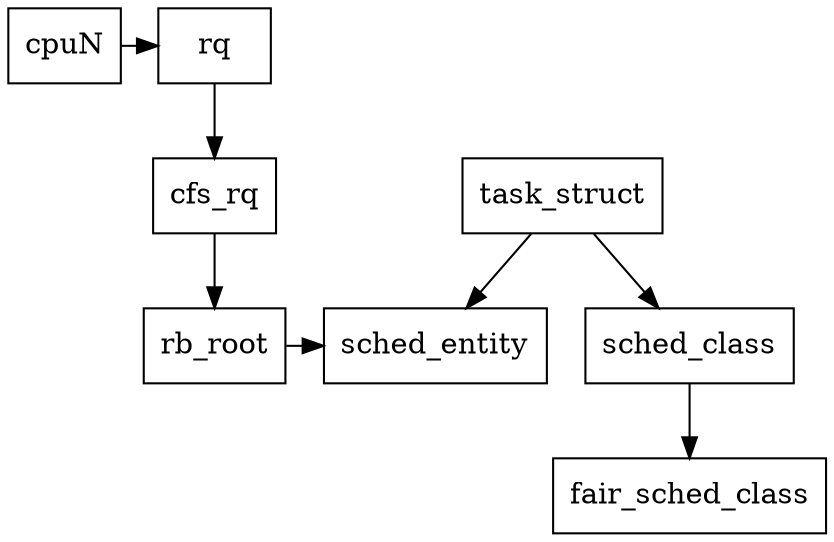
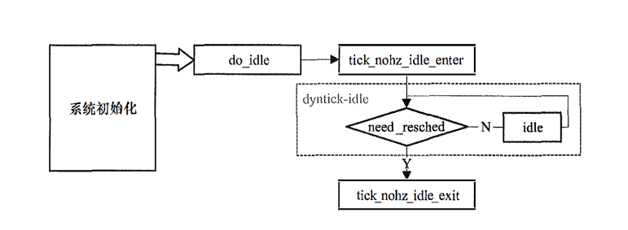

## Introduction


进程执行在CPU上，所以CPU需要记录正在和将要运行在它上的进程的情况， 内核以 rq (runqueue)结构体描述它


rq、CPU和task_struct之间的关系表

| 函数和宏                       | 描述 |
|----------------------------| --- |
| task_cpu (task_struct * p) | 进程所屈的CPU |
| cpu_rq (cpu)               | CPU对应的rq |
 | task_rq (p)                | cpu_rq (task_cpu( p)), 进程所屈的rq |
 | cpu_curr (cpu)             | (cpu_rq (cpu) ->curr), CPU当前执行的进程 |
 


```c
/*
 * Wrappers for p->thread_info->cpu access. No-op on UP.
 */
#ifdef CONFIG_SMP

static inline unsigned int task_cpu(const struct task_struct *p)
{
	return READ_ONCE(task_thread_info(p)->cpu);
}
```


```c
#define cpu_rq(cpu)		(&per_cpu(runqueues, (cpu)))
#define this_rq()		this_cpu_ptr(&runqueues)
#define task_rq(p)		cpu_rq(task_cpu(p))
#define cpu_curr(cpu)		(cpu_rq(cpu)->curr)
```


每个CPU都有一个rq对象， 内核定义了rq类型的每CPU变最 runqueues 与它们对应。clock_task字段表示进程累计运行的时间，有可能不包括中断处理等时间（与系统的配置有关），clock 可能比它大

```c
struct rq {
	/* runqueue lock: */
	raw_spinlock_t		__lock;

	unsigned int		nr_running;
#ifdef CONFIG_NUMA_BALANCING
	unsigned int		nr_numa_running;
	unsigned int		nr_preferred_running;
	unsigned int		numa_migrate_on;
#endif
#ifdef CONFIG_NO_HZ_COMMON
#ifdef CONFIG_SMP
	unsigned long		last_blocked_load_update_tick;
	unsigned int		has_blocked_load;
	call_single_data_t	nohz_csd;
#endif /* CONFIG_SMP */
	unsigned int		nohz_tick_stopped;
	atomic_t		nohz_flags;
#endif /* CONFIG_NO_HZ_COMMON */

#ifdef CONFIG_SMP
	unsigned int		ttwu_pending;
#endif
	u64			nr_switches;

#ifdef CONFIG_UCLAMP_TASK
	/* Utilization clamp values based on CPU's RUNNABLE tasks */
	struct uclamp_rq	uclamp[UCLAMP_CNT] ____cacheline_aligned;
	unsigned int		uclamp_flags;
#define UCLAMP_FLAG_IDLE 0x01
#endif

	struct cfs_rq		cfs;
	struct rt_rq		rt;
	struct dl_rq		dl;
#ifdef CONFIG_SCHED_CLASS_EXT
	struct scx_rq		scx;
#endif

	struct sched_dl_entity	fair_server;

#ifdef CONFIG_FAIR_GROUP_SCHED
	/* list of leaf cfs_rq on this CPU: */
	struct list_head	leaf_cfs_rq_list;
	struct list_head	*tmp_alone_branch;
#endif /* CONFIG_FAIR_GROUP_SCHED */

	/*
	 * This is part of a global counter where only the total sum
	 * over all CPUs matters. A task can increase this counter on
	 * one CPU and if it got migrated afterwards it may decrease
	 * it on another CPU. Always updated under the runqueue lock:
	 */
	unsigned int		nr_uninterruptible;

	union {
		struct task_struct __rcu *donor; /* Scheduler context */
		struct task_struct __rcu *curr;  /* Execution context */
	};
	struct sched_dl_entity	*dl_server;
	struct task_struct	*idle;
	struct task_struct	*stop;
	unsigned long		next_balance;
	struct mm_struct	*prev_mm;

	unsigned int		clock_update_flags;
	u64			clock;
	/* Ensure that all clocks are in the same cache line */
	u64			clock_task ____cacheline_aligned;
	u64			clock_pelt;
	unsigned long		lost_idle_time;
	u64			clock_pelt_idle;
	u64			clock_idle;
#ifndef CONFIG_64BIT
	u64			clock_pelt_idle_copy;
	u64			clock_idle_copy;
#endif

	atomic_t		nr_iowait;

	u64 last_seen_need_resched_ns;
	int ticks_without_resched;

#ifdef CONFIG_MEMBARRIER
	int membarrier_state;
#endif

#ifdef CONFIG_SMP
	struct root_domain		*rd;
	struct sched_domain __rcu	*sd;

	unsigned long		cpu_capacity;

	struct balance_callback *balance_callback;

	unsigned char		nohz_idle_balance;
	unsigned char		idle_balance;

	unsigned long		misfit_task_load;

	/* For active balancing */
	int			active_balance;
	int			push_cpu;
	struct cpu_stop_work	active_balance_work;

	/* CPU of this runqueue: */
	int			cpu;
	int			online;

	struct list_head cfs_tasks;

	struct sched_avg	avg_rt;
	struct sched_avg	avg_dl;
#ifdef CONFIG_HAVE_SCHED_AVG_IRQ
	struct sched_avg	avg_irq;
#endif
#ifdef CONFIG_SCHED_HW_PRESSURE
	struct sched_avg	avg_hw;
#endif
	u64			idle_stamp;
	u64			avg_idle;

	/* This is used to determine avg_idle's max value */
	u64			max_idle_balance_cost;

#ifdef CONFIG_HOTPLUG_CPU
	struct rcuwait		hotplug_wait;
#endif
#endif /* CONFIG_SMP */

#ifdef CONFIG_IRQ_TIME_ACCOUNTING
	u64			prev_irq_time;
	u64			psi_irq_time;
#endif
#ifdef CONFIG_PARAVIRT
	u64			prev_steal_time;
#endif
#ifdef CONFIG_PARAVIRT_TIME_ACCOUNTING
	u64			prev_steal_time_rq;
#endif

	/* calc_load related fields */
	unsigned long		calc_load_update;
	long			calc_load_active;

#ifdef CONFIG_SCHED_HRTICK
#ifdef CONFIG_SMP
	call_single_data_t	hrtick_csd;
#endif
	struct hrtimer		hrtick_timer;
	ktime_t			hrtick_time;
#endif

#ifdef CONFIG_SCHEDSTATS
	/* latency stats */
	struct sched_info	rq_sched_info;
	unsigned long long	rq_cpu_time;

	/* sys_sched_yield() stats */
	unsigned int		yld_count;

	/* schedule() stats */
	unsigned int		sched_count;
	unsigned int		sched_goidle;

	/* try_to_wake_up() stats */
	unsigned int		ttwu_count;
	unsigned int		ttwu_local;
#endif

#ifdef CONFIG_CPU_IDLE
	/* Must be inspected within a RCU lock section */
	struct cpuidle_state	*idle_state;
#endif

#ifdef CONFIG_SMP
	unsigned int		nr_pinned;
#endif
	unsigned int		push_busy;
	struct cpu_stop_work	push_work;

#ifdef CONFIG_SCHED_CORE
	/* per rq */
	struct rq		*core;
	struct task_struct	*core_pick;
	struct sched_dl_entity	*core_dl_server;
	unsigned int		core_enabled;
	unsigned int		core_sched_seq;
	struct rb_root		core_tree;

	/* shared state -- careful with sched_core_cpu_deactivate() */
	unsigned int		core_task_seq;
	unsigned int		core_pick_seq;
	unsigned long		core_cookie;
	unsigned int		core_forceidle_count;
	unsigned int		core_forceidle_seq;
	unsigned int		core_forceidle_occupation;
	u64			core_forceidle_start;
#endif

	/* Scratch cpumask to be temporarily used under rq_lock */
	cpumask_var_t		scratch_mask;

#if defined(CONFIG_CFS_BANDWIDTH) && defined(CONFIG_SMP)
	call_single_data_t	cfsb_csd;
	struct list_head	cfsb_csd_list;
#endif
};
```

rq结构体并没有直接与task_struct关联的字段，所以进程也并不由它直接管理， 实际的管理者是 cfs、1t和dl字段


task_struct数据结构中关于进程调度的一些重要成员

- prio成员：保存着进程的动态优先级，这是调度类考虑的优先级
- static_prio成员：静态优先级，在进程启动时分配。内核不存储 nice值，取而代之的是static_prio
- normal_prio成员：基于static_prio和调度策略计算出来的优先级
- rt_priority成员：实时进程的优先级
- sched_class成员：调度类
- se成员：普通进程调度实体
- rt成员：实时进程调度实体
- dl成员：deadline进程调度实体
- policy成员：用于确定进程的类型，比如是普通进程还是实时进程
- cpus_allowed成员：用于确定进程可以在哪几个CPU上运行


一个进程从被创建开始， 到被凋度执行， 再到被抢占或者主动让出CPU, 整个过程调度器需要完成将进程纳入管理、调度进程执行和记录进程占用CPU的时间等工作
考虑多个进程的情况， 还需要完成选择下一个进程、进程从一个CPU切换到另一个CPU等任务


内核定义了 sched_class 结构体（调度类、调度器类）表示这些任务， 每一个任务对应一个字段（回调函数）

sched_class 字段表

| 字段                 | 任务内容或涸用时机 |
|--------------------| --- |
| enqueue_task       | 将进程插入可执行队列 |
| dequeue_task       | 将进程从可执行队列删除 |
| check_preempt_curr | 检查是否应该抢占rq的当前进程 |
| pick_next_task     | 确定下一个将要被调度执行的进程 |
| put_prev _task     | 处理将要被抢占的进程 |
| select_task_rq     | 为进程选择CPU |
| task_woken         | 进程已被唤醒 |
| task_tick          | 时钟中断发生 |
| task_fork          | 新进程被创建 |
| task_dead          | 进程巳死 |


调度类是调度器的行为指南， 逻辑上是调度器的一部分， 不同的调度器就需要不同的调度类， 一个调度类并不需要实现所有的字段

内核定义了 stop_sched_class、dl_sched_class、 rt_sched_class、fair_sched_class 和idle_sched_class分别对应stop调度、最后期限调度（或者称为最早截止时间优先调度）、实时调度、完全公平调度和叫le调度


任务的睡眠与唤醒是内核调度器重要的组成部分，下面先简单介绍一下唤醒的流程。

现有任务A想要唤醒睡眠中的任务B。任务A正运行在CPU1上，任务B将会运行在CPU2上（这里1和2可以是同一个CPU）。无论用户态中是什么行为，最终在内核态都会走到try_to_wake_up()这个主入口。它主要干两件事情：

1. 寻找合适的CPU2来让任务B运行
2. 执行唤醒操作

调度器设计了一套复杂的数据结构去维护所有任务，其中最主要的数据是每个CPU的运行队列（即runqueue，下文缩写rq）。该队列记录了对应CPU上的就绪任务的情况。因此，常规的第二件事展开来说就是：

1. 获取CPU2的rq锁
2. 将任务B加入CPU2的rq
3. 如果任务B可以立即运行（满足抢占条件），则通知CPU2重新调度

这种方式是在CPU1上去拿CPU2的锁并操作CPU2的数据，要注意第二步并不只是单纯的入队操作，还伴有许多统计数据的维护操作。从性能和缓存的角度来看，似乎有那么点微妙。

既然有常规的方式，那当然还有特殊的方式，这种方式也就是本文的主角wakelist（CPU1和CPU2不相同时）：

1. 将任务B加入CPU2的特殊链表(wakelist)上
2. 通知CPU2
3. 自己收工，剩下的事（指常规方式的那些事）都丢给CPU2做

乍一看，通常情况下，似乎wakelist这种方式更好啊，让CPU2自己拿自己的锁，处理自己的数据，似乎对性能和缓存更友好。这样CPU1还可以提前结束工作，继续去处理后面的事。不过，这里的第二步是无条件通知的，如果是整个机器都比较繁忙的场景，CPU2正在运行其他任务，频繁被打断就不太好了。在引入wakelist唤醒方式之后，很快遇到了性能问题。内核大佬分析认为这是因为第二步的无条件通知产生的IPI太多了，因此用这个补丁将wakelist限制为只有CPU1和CPU2不共享llc时才使用，从而减少IPI的数量，同时保持数据不要在llc级别的缓存之间反复横跳。




进程调度有一个非常重要的数据结构sched_entity，它称为调度实体，它描述进程作为一个调度实体参与调度所需要的所有信息，如load表示该调度实体的权重，run_node表示该调度实体在红黑树中的节点


rq -> cfs_rq cfs -> sched_enrity *curr

rq数据结构是描述CPU的通用就绪队列，rq数据结构中记录了一个就绪队列所需要的全部信息，包括一个CFS就绪队列数据结构cfs_rq、一个实时进程调度器就绪队列数据结构rt_rq和一个实时调度器就绪队列数据结构dl_rq，以及就绪队列的负载权重等信息


cfs_rq是表示CFS就绪队列的数据结构


每个调度类都定义了一个操作方法集


### sched_class

```c

struct sched_class {

#ifdef CONFIG_UCLAMP_TASK
	int uclamp_enabled;
#endif

	void (*enqueue_task) (struct rq *rq, struct task_struct *p, int flags);
	void (*dequeue_task) (struct rq *rq, struct task_struct *p, int flags);
	void (*yield_task)   (struct rq *rq);
	bool (*yield_to_task)(struct rq *rq, struct task_struct *p);

	void (*check_preempt_curr)(struct rq *rq, struct task_struct *p, int flags);

	struct task_struct *(*pick_next_task)(struct rq *rq);

	void (*put_prev_task)(struct rq *rq, struct task_struct *p);
	void (*set_next_task)(struct rq *rq, struct task_struct *p, bool first);

#ifdef CONFIG_SMP
	int (*balance)(struct rq *rq, struct task_struct *prev, struct rq_flags *rf);
	int  (*select_task_rq)(struct task_struct *p, int task_cpu, int flags);

	struct task_struct * (*pick_task)(struct rq *rq);

	void (*migrate_task_rq)(struct task_struct *p, int new_cpu);

	void (*task_woken)(struct rq *this_rq, struct task_struct *task);

	void (*set_cpus_allowed)(struct task_struct *p,
				 const struct cpumask *newmask,
				 u32 flags);

	void (*rq_online)(struct rq *rq);
	void (*rq_offline)(struct rq *rq);

	struct rq *(*find_lock_rq)(struct task_struct *p, struct rq *rq);
#endif

	void (*task_tick)(struct rq *rq, struct task_struct *p, int queued);
	void (*task_fork)(struct task_struct *p);
	void (*task_dead)(struct task_struct *p);

	/*
	 * The switched_from() call is allowed to drop rq->lock, therefore we
	 * cannot assume the switched_from/switched_to pair is serialized by
	 * rq->lock. They are however serialized by p->pi_lock.
	 */
	void (*switched_from)(struct rq *this_rq, struct task_struct *task);
	void (*switched_to)  (struct rq *this_rq, struct task_struct *task);
	void (*prio_changed) (struct rq *this_rq, struct task_struct *task,
			      int oldprio);

	unsigned int (*get_rr_interval)(struct rq *rq,
					struct task_struct *task);

	void (*update_curr)(struct rq *rq);

#define TASK_SET_GROUP		0
#define TASK_MOVE_GROUP		1

#ifdef CONFIG_FAIR_GROUP_SCHED
	void (*task_change_group)(struct task_struct *p, int type);
#endif
};
```

extern const struct sched_class stop_sched_class;
extern const struct sched_class dl_sched_class;
extern const struct sched_class rt_sched_class;
extern const struct sched_class fair_sched_class;
extern const struct sched_class idle_sched_class;

### run queue

This is the main, per-CPU runqueue data structure.

Locking rule: those places that want to lock multiple runqueues
(such as the load balancing or the thread migration code), lock
acquire operations must be ordered by ascending &runqueue.

```c
// 
struct rq {
	/* runqueue lock: */
	raw_spinlock_t		__lock;
```

nr_running and cpu_load should be in the same cacheline because
remote CPUs use both these fields when doing load calculation.

```c
	unsigned int		nr_running;
```

```c
#ifdef CONFIG_NUMA_BALANCING
	unsigned int		nr_numa_running;
	unsigned int		nr_preferred_running;
	unsigned int		numa_migrate_on;
#endif
#ifdef CONFIG_NO_HZ_COMMON
#ifdef CONFIG_SMP
	unsigned long		last_blocked_load_update_tick;
	unsigned int		has_blocked_load;
	call_single_data_t	nohz_csd;
#endif /* CONFIG_SMP */
	unsigned int		nohz_tick_stopped;
	atomic_t		nohz_flags;
#endif /* CONFIG_NO_HZ_COMMON */

#ifdef CONFIG_SMP
	unsigned int		ttwu_pending;
#endif
	u64			nr_switches;

#ifdef CONFIG_UCLAMP_TASK
	/* Utilization clamp values based on CPU's RUNNABLE tasks */
	struct uclamp_rq	uclamp[UCLAMP_CNT] ____cacheline_aligned;
	unsigned int		uclamp_flags;
#define UCLAMP_FLAG_IDLE 0x01
#endif
```

cfs rt and dl

```c
	struct cfs_rq		cfs;
	struct rt_rq		rt;
	struct dl_rq		dl;
```

```c
#ifdef CONFIG_FAIR_GROUP_SCHED
	/* list of leaf cfs_rq on this CPU: */
	struct list_head	leaf_cfs_rq_list;
	struct list_head	*tmp_alone_branch;
#endif /* CONFIG_FAIR_GROUP_SCHED */

	/*
	 * This is part of a global counter where only the total sum
	 * over all CPUs matters. A task can increase this counter on
	 * one CPU and if it got migrated afterwards it may decrease
	 * it on another CPU. Always updated under the runqueue lock:
	 */
	unsigned int		nr_uninterruptible;
```

task structs

```c
	struct task_struct __rcu	*curr;
	struct task_struct	*idle;
	struct task_struct	*stop;
```

```c
	unsigned long		next_balance;
	struct mm_struct	*prev_mm;

	unsigned int		clock_update_flags;
	u64			clock;
	/* Ensure that all clocks are in the same cache line */
	u64			clock_task ____cacheline_aligned;
	u64			clock_pelt;
	unsigned long		lost_idle_time;

	atomic_t		nr_iowait;

#ifdef CONFIG_SCHED_DEBUG
	u64 last_seen_need_resched_ns;
	int ticks_without_resched;
#endif

#ifdef CONFIG_MEMBARRIER
	int membarrier_state;
#endif

#ifdef CONFIG_SMP
	struct root_domain		*rd;
	struct sched_domain __rcu	*sd;

	unsigned long		cpu_capacity;
	unsigned long		cpu_capacity_orig;

	struct callback_head	*balance_callback;

	unsigned char		nohz_idle_balance;
	unsigned char		idle_balance;

	unsigned long		misfit_task_load;

	/* For active balancing */
	int			active_balance;
	int			push_cpu;
	struct cpu_stop_work	active_balance_work;

	/* CPU of this runqueue: */
	int			cpu;
	int			online;

	struct list_head cfs_tasks;

	struct sched_avg	avg_rt;
	struct sched_avg	avg_dl;
#ifdef CONFIG_HAVE_SCHED_AVG_IRQ
	struct sched_avg	avg_irq;
#endif
#ifdef CONFIG_SCHED_THERMAL_PRESSURE
	struct sched_avg	avg_thermal;
#endif
	u64			idle_stamp;
	u64			avg_idle;

	unsigned long		wake_stamp;
	u64			wake_avg_idle;

	/* This is used to determine avg_idle's max value */
	u64			max_idle_balance_cost;

#ifdef CONFIG_HOTPLUG_CPU
	struct rcuwait		hotplug_wait;
#endif
#endif /* CONFIG_SMP */

#ifdef CONFIG_IRQ_TIME_ACCOUNTING
	u64			prev_irq_time;
#endif
#ifdef CONFIG_PARAVIRT
	u64			prev_steal_time;
#endif
#ifdef CONFIG_PARAVIRT_TIME_ACCOUNTING
	u64			prev_steal_time_rq;
#endif

	/* calc_load related fields */
	unsigned long		calc_load_update;
	long			calc_load_active;

#ifdef CONFIG_SCHED_HRTICK
#ifdef CONFIG_SMP
	call_single_data_t	hrtick_csd;
#endif
	struct hrtimer		hrtick_timer;
	ktime_t 		hrtick_time;
#endif

#ifdef CONFIG_SCHEDSTATS
	/* latency stats */
	struct sched_info	rq_sched_info;
	unsigned long long	rq_cpu_time;
	/* could above be rq->cfs_rq.exec_clock + rq->rt_rq.rt_runtime ? */

	/* sys_sched_yield() stats */
	unsigned int		yld_count;

	/* schedule() stats */
	unsigned int		sched_count;
	unsigned int		sched_goidle;

	/* try_to_wake_up() stats */
	unsigned int		ttwu_count;
	unsigned int		ttwu_local;
#endif

#ifdef CONFIG_CPU_IDLE
	/* Must be inspected within a rcu lock section */
	struct cpuidle_state	*idle_state;
#endif

#ifdef CONFIG_SMP
	unsigned int		nr_pinned;
#endif
	unsigned int		push_busy;
	struct cpu_stop_work	push_work;

#ifdef CONFIG_SCHED_CORE
	/* per rq */
	struct rq		*core;
	struct task_struct	*core_pick;
	unsigned int		core_enabled;
	unsigned int		core_sched_seq;
	struct rb_root		core_tree;

	/* shared state -- careful with sched_core_cpu_deactivate() */
	unsigned int		core_task_seq;
	unsigned int		core_pick_seq;
	unsigned long		core_cookie;
	unsigned char		core_forceidle;
	unsigned int		core_forceidle_seq;
#endif
};
```

## policy

Scheduling policies

```c
#define SCHED_NORMAL		0
#define SCHED_FIFO		1
#define SCHED_RR		2
#define SCHED_BATCH		3
/* SCHED_ISO: reserved but not implemented yet */
#define SCHED_IDLE		5
#define SCHED_DEADLINE		6
```

这几个调度类的优先级如下：Deadline > Realtime > Fair。Linux内核在选择下一个任务执行时，会按照该顺序来进行选择，也就是先从dl_rq里选择任务，然后从rt_rq里选择任务，最后从cfs_rq里选择任务。所以实时任务总是会比普通任务先得到执行

如果你的某些任务对延迟容忍度很低，比如说在嵌入式系统中就有很多这类任务，那就可以考虑将你的任务设置为实时任务，比如将它设置为SCHED_FIFO的任务：

```shell
chrt -f -p 1 pid
```

如果你不做任何设置的话，用户线程在默认情况下都是普通线程，也就是属于Fair调度类，由CFS调度器来进行管理。CFS调度器的目的是为了实现线程运行的公平性，举个例子，假设一个CPU上有两个线程需要执行，那么每个线程都将分配50%的CPU时间，以保障公平性。其实，各个线程之间执行时间的比例，也是可以人为干预的，比如在Linux上可以调整进程的nice值来干预，从而让优先级高一些的线程执行更多时间。这就是CFS调度器的大致思想

> [Android](/docs/CS/OS/Android/schedule.md)更多的是实时的任务


## init

进程创建过程中执行了进程调度相关的初始化，它实现在sched_fork()函数中

```c
int sched_fork(unsigned long clone_flags, struct task_struct *p)
{
	__sched_fork(clone_flags, p);
	/*
	 * We mark the process as NEW here. This guarantees that
	 * nobody will actually run it, and a signal or other external
	 * event cannot wake it up and insert it on the runqueue either.
	 */
	p->__state = TASK_NEW;

	/*
	 * Make sure we do not leak PI boosting priority to the child.
	 */
	p->prio = current->normal_prio;

	uclamp_fork(p);

	/*
	 * Revert to default priority/policy on fork if requested.
	 */
	if (unlikely(p->sched_reset_on_fork)) {
		if (task_has_dl_policy(p) || task_has_rt_policy(p)) {
			p->policy = SCHED_NORMAL;
			p->static_prio = NICE_TO_PRIO(0);
			p->rt_priority = 0;
		} else if (PRIO_TO_NICE(p->static_prio) < 0)
			p->static_prio = NICE_TO_PRIO(0);

		p->prio = p->normal_prio = p->static_prio;
		set_load_weight(p, false);
		p->se.custom_slice = 0;
		p->se.slice = sysctl_sched_base_slice;

		/*
		 * We don't need the reset flag anymore after the fork. It has
		 * fulfilled its duty:
		 */
		p->sched_reset_on_fork = 0;
	}

	if (dl_prio(p->prio))
		return -EAGAIN;

	scx_pre_fork(p);

	if (rt_prio(p->prio)) {
		p->sched_class = &rt_sched_class;
#ifdef CONFIG_SCHED_CLASS_EXT
	} else if (task_should_scx(p->policy)) {
		p->sched_class = &ext_sched_class;
#endif
	} else {
		p->sched_class = &fair_sched_class;
	}

	init_entity_runnable_average(&p->se);


#ifdef CONFIG_SCHED_INFO
	if (likely(sched_info_on()))
		memset(&p->sched_info, 0, sizeof(p->sched_info));
#endif
#if defined(CONFIG_SMP)
	p->on_cpu = 0;
#endif
	init_task_preempt_count(p);
#ifdef CONFIG_SMP
	plist_node_init(&p->pushable_tasks, MAX_PRIO);
	RB_CLEAR_NODE(&p->pushable_dl_tasks);
#endif
	return 0;
}
```


## scheduler

O(n)调度器发布于1992年，该调度器算法比较简洁，从就绪队列中比较所有进程的优先级，然后选择一个优先级最高的进程作为下一个调度进程
每个进程有一个固定时间片，当进程时间片使用完之后，调度器会选择下一个调度进程，当所有进程都运行一遍后再重新分配时间片。该调度器选择下一个调度进程前需要遍历整个就绪队列，花费O(n)时间


在Linux 2.6.23内核发布之前有一款名为O(1)的调度器，优化了选择下一个进程的时间
它为每个CPU维护一组进程优先级队列，每个优先级一个队列，这样在选择下一个进程时，只需要查询优先级队列相应的位图即可知道哪个队列中有就绪进程，所以查询时间为常数O(1)。
O(1)调度器在处理某些交互式进程时依然存在问题，特别是在有一些测试场景下导致交互式进程反应缓慢
另外，它对NUMA的支持也不完善，因此大量难以维护和阅读的代码被加入该调度器代码实现中


## schedule


The main entry point into the process schedule is the function schedule() , defined in kernel/sched/core.c

schedule 一般在以下几种情况下执行。
- 第1种，进程主动放弃CPU, 如sleep、等待某事件或条件等。
- 第2种， 内核同步的时候，进程无法获得执行权， 比如信号掀、互斥锁等。
- 第3种，进程处理中断或异常后，如果需要返回用户空间， 将要返回用户空间时，如果它的 TIF _NEED _RESCHED标志被置位，会执行schedule。
- 第4种，进程处理中断或异常后， 如果需要继续在内核空间继续执行， 分为以下两种悄况。
  内核是可抢占的(CONFIG_PREEMPT=y), 检查抢占是否使能， 抢占使能的悄况下， 可能会执行 schedule。 抢占被禁止的情况下，不会执行scheud el 。 如果内核是不可抢占的(CONFlG_PREEMPT= n)， 进程在内核态执行不会被抢占

在Linux内核里schedule()是内部使用的接口函数，有不少其他函数会直接调用该函数。除此之外，schedule()函数还有不少变种的封装。
preempt_schedule()用于可抢占内核的调度。
preempt_schedule_irq()用于可抢占内核的调度，从中断结束返回时调用该函数。
schedule_timeout(signed long timeout)用于使进程睡眠，直到超时为止

```c
static void __sched notrace preempt_schedule_common(void)
{
	do {
		preempt_disable_notrace();
		preempt_latency_start(1);
		__schedule(true);
		preempt_latency_stop(1);
		preempt_enable_no_resched_notrace();

		/*
		 * Check again in case we missed a preemption opportunity
		 * between schedule and now.
		 */
	} while (need_resched());
}

static __always_inline bool need_resched(void)
{
	return unlikely(tif_need_resched());
}
```

```c
// kernel/sched/core.c
asmlinkage __visible void __sched schedule(void)
{
	struct task_struct *tsk = current;

	sched_submit_work(tsk);
	do {
		preempt_disable();
		__schedule(SM_NONE);
		sched_preempt_enable_no_resched();
	} while (need_resched());
	sched_update_worker(tsk);
}
EXPORT_SYMBOL(schedule);
```

__schedule() is the main scheduler function.

The main means of driving the scheduler and thus entering this function are:

1. Explicit blocking: mutex, semaphore, waitqueue, etc.
2. TIF_NEED_RESCHED flag is checked on interrupt and userspace return paths. For example, see arch/x86/entry_64.S.
   To drive preemption between tasks, the scheduler sets the flag in timer interrupt handler scheduler_tick().
3. Wakeups don't really cause entry into schedule(). They add a task to the run-queue and that's it.

Now, if the new task added to the run-queue preempts the current
task, then the wakeup sets TIF_NEED_RESCHED and schedule() gets
called on the nearest possible occasion:

- If the kernel is preemptible (CONFIG_PREEMPTION=y):
  - in syscall or exception context, at the next outmost
    preempt_enable(). (this might be as soon as the wake_up()'s
    spin_unlock()!)
  - in IRQ context, return from interrupt-handler to
    preemptible context
- If the kernel is not preemptible (CONFIG_PREEMPTION is not set)
  then at the next:
  - cond_resched() call
  - explicit schedule() call
  - return from syscall or exception to user-space
  - return from interrupt-handler to user-space

WARNING: must be called with preemption disabled!

```c
// kernel/sched/core.c
static void __sched notrace __schedule(bool preempt)
{
	struct task_struct *prev, *next;
	unsigned long *switch_count;
	unsigned long prev_state;
	struct rq_flags rf;
	struct rq *rq;
	int cpu;

	cpu = smp_processor_id();
	rq = cpu_rq(cpu);
	prev = rq->curr;

	local_irq_disable();
	rcu_note_context_switch(preempt);

	rq_lock(rq, &rf);
	smp_mb__after_spinlock();

	rq->clock_update_flags <<= 1;
	update_rq_clock(rq);

	switch_count = &prev->nivcsw;

	prev_state = prev->state;
	if (!preempt && prev_state) {
		if (signal_pending_state(prev_state, prev)) {
			prev->state = TASK_RUNNING;
		} else {
			prev->sched_contributes_to_load =
				(prev_state & TASK_UNINTERRUPTIBLE) &&
				!(prev_state & TASK_NOLOAD) &&
				!(prev->flags & PF_FROZEN);

			if (prev->sched_contributes_to_load)
				rq->nr_uninterruptible++;

			deactivate_task(rq, prev, DEQUEUE_SLEEP | DEQUEUE_NOCLOCK);

			if (prev->in_iowait) {
				atomic_inc(&rq->nr_iowait);
				delayacct_blkio_start();
			}
		}
		switch_count = &prev->nvcsw;
	}

	next = pick_next_task(rq, prev, &rf);
	clear_tsk_need_resched(prev);
	clear_preempt_need_resched();
#ifdef CONFIG_SCHED_DEBUG
	rq->last_seen_need_resched_ns = 0;
#endif

	if (likely(prev != next)) {
		rq->nr_switches++;

		RCU_INIT_POINTER(rq->curr, next);

		++*switch_count;

		migrate_disable_switch(rq, prev);
		psi_sched_switch(prev, next, !task_on_rq_queued(prev));

		rq = context_switch(rq, prev, next, &rf);
	} else {
		rq->clock_update_flags &= ~(RQCF_ACT_SKIP|RQCF_REQ_SKIP);

		rq_unpin_lock(rq, &rf);
		__balance_callbacks(rq);
		raw_spin_unlock_irq(&rq->lock);
	}
}

```

### pick_next_task

Pick up the highest-prio task:

它首先判断rq的可运行进程的数扯是否与完全公平队列的可运行进程的数最相等，相等则意味着其他几个调度类并没有可运行进程，直接调用 pick_next_task_fair 选择下一个进程即可

```c
// sched/core.c
static inline struct task_struct *
pick_next_task(struct rq *rq, struct task_struct *prev, struct rq_flags *rf)
{
	const struct sched_class *class;
	struct task_struct *p;

	/*
	 * Optimization: we know that if all tasks are in the fair class we can
	 * call that function directly, but only if the @prev task wasn't of a
	 * higher scheduling class, because otherwise those lose the
	 * opportunity to pull in more work from other CPUs.
	 */
	if (likely(prev->sched_class <= &fair_sched_class &&
		   rq->nr_running == rq->cfs.h_nr_running)) {

		p = pick_next_task_fair(rq, prev, rf);
		if (unlikely(p == RETRY_TASK))
			goto restart;

		/* Assumes fair_sched_class->next == idle_sched_class */
		if (!p) {
			put_prev_task(rq, prev);
			p = pick_next_task_idle(rq);
		}

		return p;
	}

restart:
	put_prev_task_balance(rq, prev, rf);

	for_each_class(class) {
		p = class->pick_next_task(rq);
		if (p)
			return p;
	}

	/* The idle class should always have a runnable task: */
	BUG();
}
```

#### pick_next_task_fair

```c
// kernel/sched/fair.c
struct task_struct *
pick_next_task_fair(struct rq *rq, struct task_struct *prev, struct rq_flags *rf)
{
	struct cfs_rq *cfs_rq = &rq->cfs;
	struct sched_entity *se;
	struct task_struct *p;
	int new_tasks;

again:
	if (!sched_fair_runnable(rq))
		goto idle;

#ifdef CONFIG_FAIR_GROUP_SCHED
	if (!prev || prev->sched_class != &fair_sched_class)
		goto simple;

	/*
	 * Because of the set_next_buddy() in dequeue_task_fair() it is rather
	 * likely that a next task is from the same cgroup as the current.
	 *
	 * Therefore attempt to avoid putting and setting the entire cgroup
	 * hierarchy, only change the part that actually changes.
	 */

	do {
		struct sched_entity *curr = cfs_rq->curr;

		/*
		 * Since we got here without doing put_prev_entity() we also
		 * have to consider cfs_rq->curr. If it is still a runnable
		 * entity, update_curr() will update its vruntime, otherwise
		 * forget we've ever seen it.
		 */
		if (curr) {
			if (curr->on_rq)
				update_curr(cfs_rq);
			else
				curr = NULL;

			/*
			 * This call to check_cfs_rq_runtime() will do the
			 * throttle and dequeue its entity in the parent(s).
			 * Therefore the nr_running test will indeed
			 * be correct.
			 */
			if (unlikely(check_cfs_rq_runtime(cfs_rq))) {
				cfs_rq = &rq->cfs;

				if (!cfs_rq->nr_running)
					goto idle;

				goto simple;
			}
		}

		se = pick_next_entity(cfs_rq, curr);
		cfs_rq = group_cfs_rq(se);
	} while (cfs_rq);

	p = task_of(se);

	/*
	 * Since we haven't yet done put_prev_entity and if the selected task
	 * is a different task than we started out with, try and touch the
	 * least amount of cfs_rqs.
	 */
	if (prev != p) {
		struct sched_entity *pse = &prev->se;

		while (!(cfs_rq = is_same_group(se, pse))) {
			int se_depth = se->depth;
			int pse_depth = pse->depth;

			if (se_depth <= pse_depth) {
				put_prev_entity(cfs_rq_of(pse), pse);
				pse = parent_entity(pse);
			}
			if (se_depth >= pse_depth) {
				set_next_entity(cfs_rq_of(se), se);
				se = parent_entity(se);
			}
		}

		put_prev_entity(cfs_rq, pse);
		set_next_entity(cfs_rq, se);
	}

	goto done;
simple:
#endif
	if (prev)
		put_prev_task(rq, prev);

	do {
		se = pick_next_entity(cfs_rq, NULL);
		set_next_entity(cfs_rq, se);
		cfs_rq = group_cfs_rq(se);
	} while (cfs_rq);

	p = task_of(se);

done: __maybe_unused;
#ifdef CONFIG_SMP
	/*
	 * Move the next running task to the front of
	 * the list, so our cfs_tasks list becomes MRU
	 * one.
	 */
	list_move(&p->se.group_node, &rq->cfs_tasks);
#endif

	if (hrtick_enabled_fair(rq))
		hrtick_start_fair(rq, p);

	update_misfit_status(p, rq);

	return p;

idle:
	if (!rf)
		return NULL;

	new_tasks = newidle_balance(rq, rf);

	/*
	 * Because newidle_balance() releases (and re-acquires) rq->lock, it is
	 * possible for any higher priority task to appear. In that case we
	 * must re-start the pick_next_entity() loop.
	 */
	if (new_tasks < 0)
		return RETRY_TASK;

	if (new_tasks > 0)
		goto again;

	/*
	 * rq is about to be idle, check if we need to update the
	 * lost_idle_time of clock_pelt
	 */
	update_idle_rq_clock_pelt(rq);

	return NULL;
}
```

```c
// kernel/sched/idle.c
struct task_struct *pick_next_task_idle(struct rq *rq)
{
	struct task_struct *next = rq->idle;

	set_next_task_idle(rq, next, true);

	return next;
}

static void set_next_task_idle(struct rq *rq, struct task_struct *next, bool first)
{
	update_idle_core(rq);
	schedstat_inc(rq->sched_goidle);
	queue_core_balance(rq);
}
```

### context switch

context_switch - switch to the new MM and the new thread's register state.

内核线程不会独立管理内存， 它们的task_struct的mm字段为NULL
则以pr ev的有效内存( activ e _ mm)作为它的有效内存， 而且不需要
切换内存(pgcl等）， 只需要增加mm_struct的mm_count的引用计数。内核线程不会访间用户空间的内存，而各进程的内核空间的内存是相同的，所以内核线程使用上一个进程的内存是可行的

如果next不是内核线程，则调用switch_mm _irqs_off切换内存。
如果prev是内核线程，它将要被next替代，所以没有必要再为它保留 `active_mm` ,但是在它之前被调度执行时，mm _count的引用计数被增加了，
可能导致 `active_mm` 不能被完全释放，rq-> prev _mm = prev->active~111111将它传递给 rq , 进程切换完成后根据mm _count的值做进一步处理

```c
// kernel/sched/core.c
static __always_inline struct rq *
context_switch(struct rq *rq, struct task_struct *prev,
	       struct task_struct *next, struct rq_flags *rf)
{
	prepare_task_switch(rq, prev, next);

	arch_start_context_switch(prev);

	/*
	 * kernel -> kernel   lazy + transfer active
	 *   user -> kernel   lazy + mmgrab() active
	 *
	 * kernel ->   user   switch + mmdrop() active
	 *   user ->   user   switch
	 */
	if (!next->mm) {                                // to kernel
		enter_lazy_tlb(prev->active_mm, next);

		next->active_mm = prev->active_mm;
		if (prev->mm)                           // from user
			mmgrab(prev->active_mm);
		else
			prev->active_mm = NULL;
	} else {                                        // to user
		membarrier_switch_mm(rq, prev->active_mm, next->mm);
		/*
		 * sys_membarrier() requires an smp_mb() between setting
		 * rq->curr / membarrier_switch_mm() and returning to userspace.
		 *
		 * The below provides this either through switch_mm(), or in
		 * case 'prev->active_mm == next->mm' through
		 * finish_task_switch()'s mmdrop().
		 */
		switch_mm_irqs_off(prev->active_mm, next->mm, next);

		if (!prev->mm) {                        // from kernel
			/* will mmdrop() in finish_task_switch(). */
			rq->prev_mm = prev->active_mm;
			prev->active_mm = NULL;
		}
	}

	rq->clock_update_flags &= ~(RQCF_ACT_SKIP|RQCF_REQ_SKIP);

	prepare_lock_switch(rq, next, rf);

    // Here we just switch the register state and the stack.
	switch_to(prev, next, prev);
	barrier();

	return finish_task_switch(prev);
}
```
switch_to 的实现依赖具体的 arch


arm

```c
extern struct task_struct *__switch_to(struct task_struct *, struct thread_info *, struct thread_info *);

#define switch_to(prev,next,last)					\
do {									\
	__complete_pending_tlbi();					\
	if (IS_ENABLED(CONFIG_CURRENT_POINTER_IN_TPIDRURO) || is_smp())	\
		__this_cpu_write(__entry_task, next);			\
	last = __switch_to(prev,task_thread_info(prev), task_thread_info(next));	\
} while (0)
```

```c
__notrace_funcgraph __sched
struct task_struct *__switch_to(struct task_struct *prev,
				struct task_struct *next)
{
	struct task_struct *last;

	fpsimd_thread_switch(next);
	tls_thread_switch(next);
	hw_breakpoint_thread_switch(next);
	contextidr_thread_switch(next);
	entry_task_switch(next);
	ssbs_thread_switch(next);
	cntkctl_thread_switch(prev, next);
	ptrauth_thread_switch_user(next);
	permission_overlay_switch(next);
	gcs_thread_switch(next);

	/*
	 * Complete any pending TLB or cache maintenance on this CPU in case
	 * the thread migrates to a different CPU.
	 * This full barrier is also required by the membarrier system
	 * call.
	 */
	dsb(ish);

	/*
	 * MTE thread switching must happen after the DSB above to ensure that
	 * any asynchronous tag check faults have been logged in the TFSR*_EL1
	 * registers.
	 */
	mte_thread_switch(next);
	/* avoid expensive SCTLR_EL1 accesses if no change */
	if (prev->thread.sctlr_user != next->thread.sctlr_user)
		update_sctlr_el1(next->thread.sctlr_user);

	/* the actual thread switch */
	last = cpu_switch_to(prev, next);

	return last;
}
```


x86_64

```asm
/*
 * %rdi: prev task
 * %rsi: next task
 */
.pushsection .text, "ax"
SYM_FUNC_START(__switch_to_asm)
	ANNOTATE_NOENDBR
	/*
	 * Save callee-saved registers
	 * This must match the order in inactive_task_frame
	 */
	pushq	%rbp
	pushq	%rbx
	pushq	%r12
	pushq	%r13
	pushq	%r14
	pushq	%r15

	/* switch stack */
	movq	%rsp, TASK_threadsp(%rdi)
	movq	TASK_threadsp(%rsi), %rsp

#ifdef CONFIG_STACKPROTECTOR
	movq	TASK_stack_canary(%rsi), %rbx
	movq	%rbx, PER_CPU_VAR(__stack_chk_guard)
#endif

	/*
	 * When switching from a shallower to a deeper call stack
	 * the RSB may either underflow or use entries populated
	 * with userspace addresses. On CPUs where those concerns
	 * exist, overwrite the RSB with entries which capture
	 * speculative execution to prevent attack.
	 */
	FILL_RETURN_BUFFER %r12, RSB_CLEAR_LOOPS, X86_FEATURE_RSB_CTXSW

	/* restore callee-saved registers */
	popq	%r15
	popq	%r14
	popq	%r13
	popq	%r12
	popq	%rbx
	popq	%rbp

	jmp	__switch_to
SYM_FUNC_END(__switch_to_asm)
.popsection
```

## affinity

### set affinity

```c

long sched_setaffinity(pid_t pid, const struct cpumask *in_mask)
{
	cpumask_var_t cpus_allowed, new_mask;
	struct task_struct *p;
	int retval;

	rcu_read_lock();

	p = find_process_by_pid(pid);
	if (!p) {
		rcu_read_unlock();
		return -ESRCH;
	}

	/* Prevent p going away */
	get_task_struct(p);
	rcu_read_unlock();

	if (p->flags & PF_NO_SETAFFINITY) {
		retval = -EINVAL;
		goto out_put_task;
	}
	if (!alloc_cpumask_var(&cpus_allowed, GFP_KERNEL)) {
		retval = -ENOMEM;
		goto out_put_task;
	}
	if (!alloc_cpumask_var(&new_mask, GFP_KERNEL)) {
		retval = -ENOMEM;
		goto out_free_cpus_allowed;
	}
	retval = -EPERM;
	if (!check_same_owner(p)) {
		rcu_read_lock();
		if (!ns_capable(__task_cred(p)->user_ns, CAP_SYS_NICE)) {
			rcu_read_unlock();
			goto out_free_new_mask;
		}
		rcu_read_unlock();
	}

	retval = security_task_setscheduler(p);
	if (retval)
		goto out_free_new_mask;

```

set cpus_allowed

```c
	cpuset_cpus_allowed(p, cpus_allowed);
	cpumask_and(new_mask, in_mask, cpus_allowed);

	/*
	 * Since bandwidth control happens on root_domain basis,
	 * if admission test is enabled, we only admit -deadline
	 * tasks allowed to run on all the CPUs in the task's
	 * root_domain.
	 */
#ifdef CONFIG_SMP
	if (task_has_dl_policy(p) && dl_bandwidth_enabled()) {
		rcu_read_lock();
		if (!cpumask_subset(task_rq(p)->rd->span, new_mask)) {
			retval = -EBUSY;
			rcu_read_unlock();
			goto out_free_new_mask;
		}
		rcu_read_unlock();
	}
#endif
again:
	retval = __set_cpus_allowed_ptr(p, new_mask, SCA_CHECK);

	if (!retval) {
		cpuset_cpus_allowed(p, cpus_allowed);
		if (!cpumask_subset(new_mask, cpus_allowed)) {
			/*
			 * We must have raced with a concurrent cpuset
			 * update. Just reset the cpus_allowed to the
			 * cpuset's cpus_allowed
			 */
			cpumask_copy(new_mask, cpus_allowed);
			goto again;
		}
	}
out_free_new_mask:
	free_cpumask_var(new_mask);
out_free_cpus_allowed:
	free_cpumask_var(cpus_allowed);
out_put_task:
	put_task_struct(p);
	return retval;
}
```

## rt

RT调度器的所有实现都在文件 `kernel/sched/rt.c` 中

```c
struct rt_prio_array {
	DECLARE_BITMAP(bitmap, MAX_RT_PRIO+1); /* include 1 bit for delimiter */
	struct list_head queue[MAX_RT_PRIO];
};
```

该结构体与 O(1) 调度器中的实现思路是一样的，都是为了降低调度器在查找下一个任务的时间复杂度。

#### pick_next_rt_entity

```c
static struct sched_rt_entity *pick_next_rt_entity(struct rt_rq *rt_rq)
{
	struct rt_prio_array *array = &rt_rq->active;
	struct sched_rt_entity *next = NULL;
	struct list_head *queue;
	int idx;

	idx = sched_find_first_bit(array->bitmap);
	BUG_ON(idx >= MAX_RT_PRIO);

	queue = array->queue + idx;
	if (SCHED_WARN_ON(list_empty(queue)))
		return NULL;
	next = list_entry(queue->next, struct sched_rt_entity, run_list);

	return next;
}

```


## DL

Deadline调度器的核心思想是EDF(Earliest Deadline First)与CBS(Constant Bandwidth Server),

## cfs

cfs_ rq 结构体定义了与完全公平调度(Completely Fair Scheduler, cfs) 相关的字段

cfs_rq字段表

| 字段                          | 类型            | 描述                     |
|-----------------------------|---------------|------------------------|
| m·_mnmng                    | unsigned int  | TASK_IWNNING状态的进程数     |
| lll1. 11 V11J lllll .lle    | u64           | 见下文                    |
| tasks_timel111e.rb_root     | rb_root       | sched_entity对象组成的红黑树的根 |
| tasks_timeline. rb_leftmost | rb_node*      |  红黑树最左边的叶子             |
| CU11 next                   | sched_entity* | 当前／下一个sched_entity |


```c
struct cfs_rq {
	struct load_weight	load;
	unsigned int		nr_queued;
	unsigned int		h_nr_queued;       /* SCHED_{NORMAL,BATCH,IDLE} */
	unsigned int		h_nr_runnable;     /* SCHED_{NORMAL,BATCH,IDLE} */
	unsigned int		h_nr_idle; /* SCHED_IDLE */

	s64			avg_vruntime;
	u64			avg_load;

	u64			min_vruntime;
#ifdef CONFIG_SCHED_CORE
	unsigned int		forceidle_seq;
	u64			min_vruntime_fi;
#endif

	struct rb_root_cached	tasks_timeline;

	/*
	 * 'curr' points to currently running entity on this cfs_rq.
	 * It is set to NULL otherwise (i.e when none are currently running).
	 */
	struct sched_entity	*curr;
	struct sched_entity	*next;

#ifdef CONFIG_SMP
	/*
	 * CFS load tracking
	 */
	struct sched_avg	avg;
#ifndef CONFIG_64BIT
	u64			last_update_time_copy;
#endif
	struct {
		raw_spinlock_t	lock ____cacheline_aligned;
		int		nr;
		unsigned long	load_avg;
		unsigned long	util_avg;
		unsigned long	runnable_avg;
	} removed;

#ifdef CONFIG_FAIR_GROUP_SCHED
	u64			last_update_tg_load_avg;
	unsigned long		tg_load_avg_contrib;
	long			propagate;
	long			prop_runnable_sum;

	/*
	 *   h_load = weight * f(tg)
	 *
	 * Where f(tg) is the recursive weight fraction assigned to
	 * this group.
	 */
	unsigned long		h_load;
	u64			last_h_load_update;
	struct sched_entity	*h_load_next;
#endif /* CONFIG_FAIR_GROUP_SCHED */
#endif /* CONFIG_SMP */

#ifdef CONFIG_FAIR_GROUP_SCHED
	struct rq		*rq;	/* CPU runqueue to which this cfs_rq is attached */

	/*
	 * leaf cfs_rqs are those that hold tasks (lowest schedulable entity in
	 * a hierarchy). Non-leaf lrqs hold other higher schedulable entities
	 * (like users, containers etc.)
	 *
	 * leaf_cfs_rq_list ties together list of leaf cfs_rq's in a CPU.
	 * This list is used during load balance.
	 */
	int			on_list;
	struct list_head	leaf_cfs_rq_list;
	struct task_group	*tg;	/* group that "owns" this runqueue */

	/* Locally cached copy of our task_group's idle value */
	int			idle;

#ifdef CONFIG_CFS_BANDWIDTH
	int			runtime_enabled;
	s64			runtime_remaining;

	u64			throttled_pelt_idle;
#ifndef CONFIG_64BIT
	u64                     throttled_pelt_idle_copy;
#endif
	u64			throttled_clock;
	u64			throttled_clock_pelt;
	u64			throttled_clock_pelt_time;
	u64			throttled_clock_self;
	u64			throttled_clock_self_time;
	int			throttled;
	int			throttle_count;
	struct list_head	throttled_list;
	struct list_head	throttled_csd_list;
#endif /* CONFIG_CFS_BANDWIDTH */
#endif /* CONFIG_FAIR_GROUP_SCHED */
};
```

## Idle


idle_sched_class作为优先级最低的sched_class,它的使命就是没有其他进程需要执行的时候占用CPU,有进程需要执行的时候让出CPU
它不接受dequeue和enqueue操作，只负责idle 进程，由 rq->叫le指定
pick_next_task_idle返回rq->idle,check_preempt_cmr_idle直接调用 `resched_crr(rq)`


idle 进程完成初始化后， 会执行do_idle。默认情况下，它调用tick_nohz_idle_ente1使系统进
入dyntick-idle状态，等待need_resched为真，满足条件后调用tick_nohz_idle_exit 退出dyntick一idle
状态，然后调度其他进程执行。
进入dyntick-idle状态后，do_idle 执行无限循环， 只要没有其他进程需要执行就会循环
下去。
编译内核的时候CONFIG_NO_HZ_COMMON默认为y,该情况下，无事可做时就会进入 dyntick-idle 状态


正常情况下，时钟中断会周期性到来，一个tick接一个tick, 但如果idle 的时候还是处理周期性地时钟中断，势必会造成不必要的耗电
所以为了降低耗电，dyntick-idle状态下会停止周期性的时钟中断，让下一个时钟中断在合理长的延迟后再到来。
该特性的优点显然是省电，但需要注意的是对实时性要求较高的系统并不适用，因为进入和退出dyntick-idle状态都是有代价的


<div style="text-align: center;">



</div>

<p style="text-align: center;">
Fig.1. Idle 进程流程
</p>


## Links

- [processes](/docs/CS/OS/Linux/proc/process.md)
