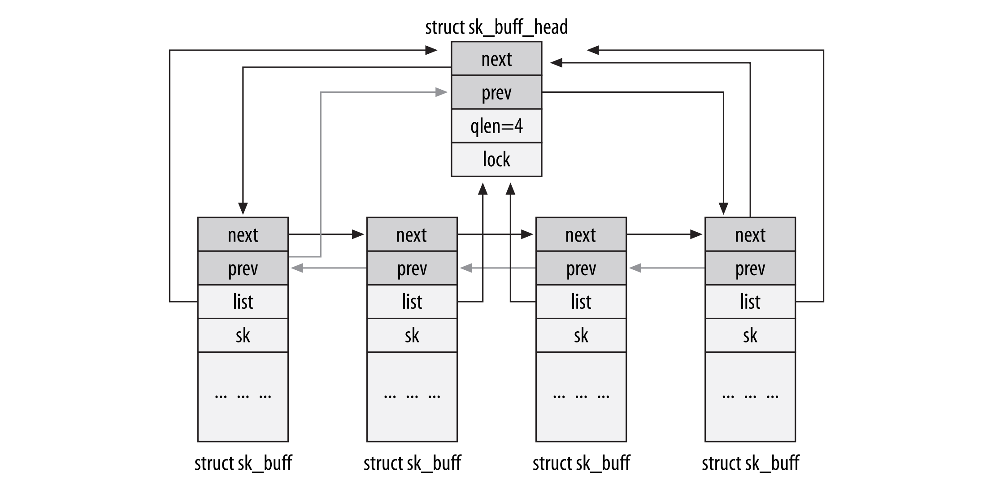
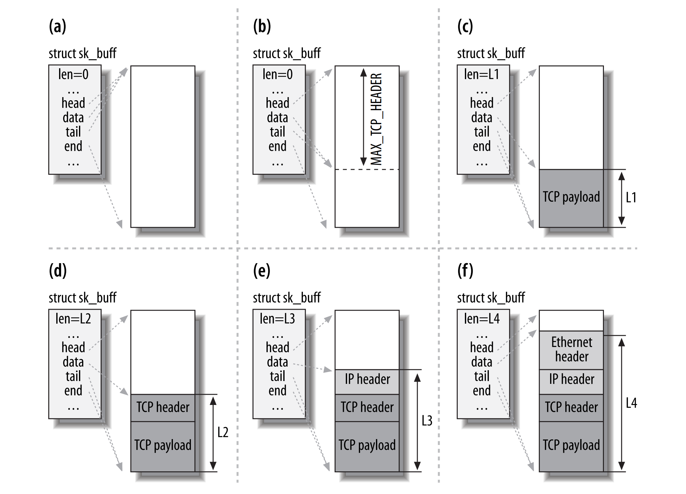

## Introduction

```c
// include/linux/netdevice.h
struct packet_type {
	__be16			type;	/* This is really htons(ether_type). */
	bool			ignore_outgoing;
	struct net_device	*dev;	/* NULL is wildcarded here	     */
	int			(*func) (struct sk_buff *,
					 struct net_device *,
					 struct packet_type *,
					 struct net_device *);
	void			(*list_func) (struct list_head *,
					      struct packet_type *,
					      struct net_device *);
	bool			(*id_match)(struct packet_type *ptype,
					    struct sock *sk);
	void			*af_packet_priv;
	struct list_head	list;
};
```


## Init

### sock_init

[Init](/docs/CS/OS/Linux/init.md)

call register_filesystem

kern_mount
```c
// net/socket.c
core_initcall(sock_init);	/* early initcall */


static int __init sock_init(void)
{
	int err;
  
	/* Initialize the network sysctl infrastructure. */
	err = net_sysctl_init();
```

Initialize skbuff SLAB cache
```c
	skb_init();

	/* Initialize the protocols module. */
	init_inodecache();

	err = register_filesystem(&sock_fs_type);

	sock_mnt = kern_mount(&sock_fs_type);


	/* The real protocol initialization is performed in later initcalls. */

  #ifdef CONFIG_NETFILTER
	err = netfilter_init();
	if (err)
		goto out;
#endif

	ptp_classifier_init();

}
```
#### sockfs


Convert the sockfs filesystem to the new internal mount API as the old one will be obsoleted and removed. This allows greater flexibility in communication of mount parameters between userspace, the VFS and the filesystem.
> From:  .mount =	sockfs_mount
> To:    .init_fs_context = sockfs_init_fs_context
```c

static struct file_system_type sock_fs_type = {
	.name =		"sockfs",
	.init_fs_context = sockfs_init_fs_context,
	.kill_sb =	kill_anon_super,
};
```
call sockfs_init_fs_context when [mount fs](/docs/CS/OS/Linux/fs/fs.md?id=init_fs_context)

```c

static int sockfs_init_fs_context(struct fs_context *fc)
{
	struct pseudo_fs_context *ctx = init_pseudo(fc, SOCKFS_MAGIC);
	if (!ctx)
		return -ENOMEM;
	ctx->ops = &sockfs_ops;
	ctx->dops = &sockfs_dentry_operations;
	ctx->xattr = sockfs_xattr_handlers;
	return 0;
}
```

## sockaddr


### init sock
see init 
```c
// include/linux/socket.h
struct sockaddr {
	sa_family_t	sa_family;	/* address family, AF_xxx	*/
	char		sa_data[14];	/* 14 bytes of protocol address	*/
};
```

address families
```c


/* Supported address families. */
#define AF_UNSPEC	0
#define AF_UNIX		1	/* Unix domain sockets 		*/
#define AF_LOCAL	1	/* POSIX name for AF_UNIX	*/
#define AF_INET		2	/* Internet IP Protocol 	*/
#define AF_INET6	10	/* IP version 6			*/
...

```

Protocol and Address families
```c


/* Protocol families, same as address families. */
#define PF_LOCAL	AF_LOCAL
#define PF_INET		AF_INET
#define PF_INET6	AF_INET6
...
```


### sockaddr_in

Structure describing an Internet (IP) socket address.
```c
// include/uapi/linux/in.h
struct sockaddr_in {
  __kernel_sa_family_t	sin_family;	/* Address family		*/
  __be16		sin_port;	/* Port number			*/
  struct in_addr	sin_addr;	/* Internet address		*/

  /* Pad to size of `struct sockaddr'. */
  unsigned char		__pad[__SOCK_SIZE__ - sizeof(short int) -
			sizeof(unsigned short int) - sizeof(struct in_addr)];
};
```


```c

#if __UAPI_DEF_SOCKADDR_IN6
struct sockaddr_in6 {
	unsigned short int	sin6_family;    /* AF_INET6 */
	__be16			sin6_port;      /* Transport layer port # */
	__be32			sin6_flowinfo;  /* IPv6 flow information */
	struct in6_addr		sin6_addr;      /* IPv6 address */
	__u32			sin6_scope_id;  /* scope id (new in RFC2553) */
};
```

```c

struct sockaddr_un {
	__kernel_sa_family_t sun_family; /* AF_UNIX */
	char sun_path[UNIX_PATH_MAX];	/* pathname */
};
```


## socket


socket中重要的pointer
- fd
- sock
- proto_ops


```c
/* struct socket - general BSD socket */
struct socket {
	socket_state		state;
	short			type;
	unsigned long		flags;

	struct file		*file;
	struct sock		*sk;
	const struct proto_ops	*ops;

	struct socket_wq	wq;
};
```
socket上等待队列
 


### sock_common
struct sock_common - minimal network layer representation of sockets

This is the minimal network layer representation of sockets, the header for struct sock and struct inet_timewait_sock.

```c
// include/net/sock.h
struct sock_common {
       /* skc_daddr and skc_rcv_saddr must be grouped on a 8 bytes aligned
        * address on 64bit arches : cf INET_MATCH()
        */
       union {
              __addrpair     skc_addrpair;
              struct {
                     __be32 skc_daddr;
                     __be32 skc_rcv_saddr;
              };
       };
       union  {
              unsigned int   skc_hash;
              __u16         skc_u16hashes[2];
       };
       /* skc_dport && skc_num must be grouped as well */
       union {
              __portpair     skc_portpair;
              struct {
                     __be16 skc_dport;
                     __u16  skc_num;
              };
       };

       unsigned short        skc_family;
       volatile unsigned char skc_state;
       unsigned char         skc_reuse:4;
       unsigned char         skc_reuseport:1;
       unsigned char         skc_ipv6only:1;
       unsigned char         skc_net_refcnt:1;
       int                  skc_bound_dev_if;
       union {
              struct hlist_node      skc_bind_node;
              struct hlist_node      skc_portaddr_node;
       };
       struct proto          *skc_prot;
       possible_net_t        skc_net;

#if IS_ENABLED(CONFIG_IPV6)
       struct in6_addr               skc_v6_daddr;
       struct in6_addr               skc_v6_rcv_saddr;
#endif

       atomic64_t            skc_cookie;

       /* following fields are padding to force
        * offset(struct sock, sk_refcnt) == 128 on 64bit arches
        * assuming IPV6 is enabled. We use this padding differently
        * for different kind of 'sockets'
        */
       union {
              unsigned long  skc_flags;
              struct sock    *skc_listener; /* request_sock */
              struct inet_timewait_death_row *skc_tw_dr; /* inet_timewait_sock */
       };
       /*
        * fields between dontcopy_begin/dontcopy_end
        * are not copied in sock_copy()
        */
       /* private: */
       int                  skc_dontcopy_begin[0];
       /* public: */
       union {
              struct hlist_node      skc_node;
              struct hlist_nulls_node skc_nulls_node;
       };
       unsigned short        skc_tx_queue_mapping;
#ifdef CONFIG_SOCK_RX_QUEUE_MAPPING
       unsigned short        skc_rx_queue_mapping;
#endif
       union {
              int           skc_incoming_cpu;
              u32           skc_rcv_wnd;
              u32           skc_tw_rcv_nxt; /* struct tcp_timewait_sock  */
       };

       refcount_t            skc_refcnt;
       /* private: */
       int                     skc_dontcopy_end[0];
       union {
              u32           skc_rxhash;
              u32           skc_window_clamp;
              u32           skc_tw_snd_nxt; /* struct tcp_timewait_sock */
       };
       /* public: */
};
```

### sock

struct sock - network layer representation of sockets

```c
// include/net/sock.h
struct sock {
       /*
        * Now struct inet_timewait_sock also uses sock_common, so please just
        * don't add nothing before this first member (__sk_common) --acme
        */
       struct sock_common     __sk_common;
#define sk_node                      __sk_common.skc_node
#define sk_nulls_node         __sk_common.skc_nulls_node
#define sk_refcnt             __sk_common.skc_refcnt
#define sk_tx_queue_mapping    __sk_common.skc_tx_queue_mapping
#ifdef CONFIG_SOCK_RX_QUEUE_MAPPING
#define sk_rx_queue_mapping    __sk_common.skc_rx_queue_mapping
#endif

#define sk_dontcopy_begin      __sk_common.skc_dontcopy_begin
#define sk_dontcopy_end               __sk_common.skc_dontcopy_end
#define sk_hash                      __sk_common.skc_hash
#define sk_portpair           __sk_common.skc_portpair
#define sk_num               __sk_common.skc_num
#define sk_dport              __sk_common.skc_dport
#define sk_addrpair           __sk_common.skc_addrpair
#define sk_daddr              __sk_common.skc_daddr
#define sk_rcv_saddr          __sk_common.skc_rcv_saddr
#define sk_family             __sk_common.skc_family
#define sk_state              __sk_common.skc_state
#define sk_reuse              __sk_common.skc_reuse
#define sk_reuseport          __sk_common.skc_reuseport
#define sk_ipv6only           __sk_common.skc_ipv6only
#define sk_net_refcnt         __sk_common.skc_net_refcnt
#define sk_bound_dev_if               __sk_common.skc_bound_dev_if
#define sk_bind_node          __sk_common.skc_bind_node
#define sk_prot                      __sk_common.skc_prot
#define sk_net               __sk_common.skc_net
#define sk_v6_daddr           __sk_common.skc_v6_daddr
#define sk_v6_rcv_saddr        __sk_common.skc_v6_rcv_saddr
#define sk_cookie             __sk_common.skc_cookie
#define sk_incoming_cpu               __sk_common.skc_incoming_cpu
#define sk_flags              __sk_common.skc_flags
#define sk_rxhash             __sk_common.skc_rxhash

       socket_lock_t         sk_lock;
       atomic_t              sk_drops;
       int                  sk_rcvlowat;
       struct sk_buff_head    sk_error_queue;
       struct sk_buff        *sk_rx_skb_cache;
       struct sk_buff_head    sk_receive_queue;
       /*
        * The backlog queue is special, it is always used with
        * the per-socket spinlock held and requires low latency
        * access. Therefore we special case it's implementation.
        * Note : rmem_alloc is in this structure to fill a hole
        * on 64bit arches, not because its logically part of
        * backlog.
        */
       struct {
              atomic_t       rmem_alloc;
              int           len;
              struct sk_buff *head;
              struct sk_buff *tail;
       } sk_backlog;
#define sk_rmem_alloc sk_backlog.rmem_alloc

       int                  sk_forward_alloc;
#ifdef CONFIG_NET_RX_BUSY_POLL
       unsigned int          sk_ll_usec;
       /* ===== mostly read cache line ===== */
       unsigned int          sk_napi_id;
#endif
       int                  sk_rcvbuf;

       struct sk_filter __rcu *sk_filter;
       union {
              struct socket_wq __rcu *sk_wq;
              /* private: */
              struct socket_wq       *sk_wq_raw;
              /* public: */
       };
#ifdef CONFIG_XFRM
       struct xfrm_policy __rcu *sk_policy[2];
#endif
       struct dst_entry       *sk_rx_dst;
       struct dst_entry __rcu *sk_dst_cache;
       atomic_t              sk_omem_alloc;
       int                  sk_sndbuf;

       /* ===== cache line for TX ===== */
       int                  sk_wmem_queued;
       refcount_t            sk_wmem_alloc;
       unsigned long         sk_tsq_flags;
       union {
              struct sk_buff *sk_send_head;
              struct rb_root tcp_rtx_queue;
       };
       struct sk_buff        *sk_tx_skb_cache;
       struct sk_buff_head    sk_write_queue;
       __s32                sk_peek_off;
       int                  sk_write_pending;
       __u32                sk_dst_pending_confirm;
       u32                  sk_pacing_status; /* see enum sk_pacing */
       long                 sk_sndtimeo;
       struct timer_list      sk_timer;
       __u32                sk_priority;
       __u32                sk_mark;
       unsigned long         sk_pacing_rate; /* bytes per second */
       unsigned long         sk_max_pacing_rate;
       struct page_frag       sk_frag;
       netdev_features_t      sk_route_caps;
       netdev_features_t      sk_route_nocaps;
       netdev_features_t      sk_route_forced_caps;
       int                  sk_gso_type;
       unsigned int          sk_gso_max_size;
       gfp_t                sk_allocation;
       __u32                sk_txhash;

       /*
        * Because of non atomicity rules, all
        * changes are protected by socket lock.
        */
       u8                   sk_padding : 1,
                            sk_kern_sock : 1,
                            sk_no_check_tx : 1,
                            sk_no_check_rx : 1,
                            sk_userlocks : 4;
       u8                   sk_pacing_shift;
       u16                  sk_type;
       u16                  sk_protocol;
       u16                  sk_gso_max_segs;
       unsigned long          sk_lingertime;
       struct proto          *sk_prot_creator;
       rwlock_t              sk_callback_lock;
       int                  sk_err,
                            sk_err_soft;
       u32                  sk_ack_backlog;
       u32                  sk_max_ack_backlog;
       kuid_t               sk_uid;
#ifdef CONFIG_NET_RX_BUSY_POLL
       u8                   sk_prefer_busy_poll;
       u16                  sk_busy_poll_budget;
#endif
       struct pid            *sk_peer_pid;
       const struct cred      *sk_peer_cred;
       long                 sk_rcvtimeo;
       ktime_t                      sk_stamp;
#if BITS_PER_LONG==32
       seqlock_t             sk_stamp_seq;
#endif
       u16                  sk_tsflags;
       u8                   sk_shutdown;
       u32                  sk_tskey;
       atomic_t              sk_zckey;

       u8                   sk_clockid;
       u8                   sk_txtime_deadline_mode : 1,
                            sk_txtime_report_errors : 1,
                            sk_txtime_unused : 6;

       struct socket         *sk_socket;
       void                 *sk_user_data;
#ifdef CONFIG_SECURITY
       void                 *sk_security;
#endif
       struct sock_cgroup_data        sk_cgrp_data;
       struct mem_cgroup      *sk_memcg;
       void                 (*sk_state_change)(struct sock *sk);
       void                 (*sk_data_ready)(struct sock *sk);
       void                 (*sk_write_space)(struct sock *sk);
       void                 (*sk_error_report)(struct sock *sk);
       int                  (*sk_backlog_rcv)(struct sock *sk,
                                            struct sk_buff *skb);
#ifdef CONFIG_SOCK_VALIDATE_XMIT
       struct sk_buff*               (*sk_validate_xmit_skb)(struct sock *sk,
                                                 struct net_device *dev,
                                                 struct sk_buff *skb);
#endif
       void                    (*sk_destruct)(struct sock *sk);
       struct sock_reuseport __rcu    *sk_reuseport_cb;
#ifdef CONFIG_BPF_SYSCALL
       struct bpf_local_storage __rcu *sk_bpf_storage;
#endif
       struct rcu_head               sk_rcu;
};
```


#### request_sock

struct request_sock - mini sock to represent a connection request

```c
// include/net/request_sock.h
struct request_sock {
       struct sock_common            __req_common;
#define rsk_refcnt                   __req_common.skc_refcnt
#define rsk_hash                     __req_common.skc_hash
#define rsk_listener                 __req_common.skc_listener
#define rsk_window_clamp              __req_common.skc_window_clamp
#define rsk_rcv_wnd                  __req_common.skc_rcv_wnd

       struct request_sock           *dl_next;
       u16                         mss;
       u8                          num_retrans; /* number of retransmits */
       u8                          syncookie:1; /* syncookie: encode tcpopts in timestamp */
       u8                          num_timeout:7; /* number of timeouts */
       u32                         ts_recent;
       struct timer_list             rsk_timer;
       const struct request_sock_ops  *rsk_ops;
       struct sock                  *sk;
       struct saved_syn              *saved_syn;
       u32                         secid;
       u32                         peer_secid;
};
```


#### SKB

List of sk_buff elements:




##### sk_buff_head

```c
struct sk_buff_head {
	/* These two members must be first. */
	struct sk_buff	*next;
	struct sk_buff	*prev;

	__u32		qlen;
	spinlock_t	lock;
};
```

##### sk_buff

struct sk_buff - socket buffer

- struct net_device
- struct sock
- head
- tail
- end


```c
// include/linux/skbuff.h
struct sk_buff {
union {
		struct {
			/* These two members must be first. */
			struct sk_buff		*next;
			struct sk_buff		*prev;

			union {
				struct net_device	*dev;
				/* Some protocols might use this space to store information,
				 * while device pointer would be NULL.
				 * UDP receive path is one user.
				 */
				unsigned long		dev_scratch;
			};
		};
		struct rb_node		rbnode; /* used in netem, ip4 defrag, and tcp stack */
		struct list_head	list;
	};

	union {
		struct sock		*sk;
		int			ip_defrag_offset;
	};

	union {
		ktime_t		tstamp;
		u64		skb_mstamp_ns; /* earliest departure time */
	};

    /*
	 * This is the control buffer. It is free to use for every
	 * layer. Please put your private variables there. If you
	 * want to keep them across layers you have to do a skb_clone()
	 * first. This is owned by whoever has the skb queued ATM.
	 */
	char			cb[48] __aligned(8);

    unsigned int		len,
				data_len;
	__u16			mac_len,
				hdr_len;
  
   #ifdef CONFIG_NET_SCHED
	__u16			tc_index;	/* traffic control index */
   #endif
  
  // ...
}
```


Thus, one of the first things done by each protocol, as the buffer passes down through layers, is to call skb_reserve to reserve space for the protocol’s header.
We will see an example of how the kernel makes sure enough space is reserved at the head of the buffer to allow each layer to add its own header while the buffer traverses the layers.

When the buffer passes up through the network layers, each header from the old layer is no longer of interest. 
The L2 header, for instance, is used only by the device drivers that handle the L2 protocol, so it is of no interest to L3. 
Instead of removing the L2 header from the buffer, the pointer to the beginning of the payload is moved ahead to the beginning of the L3 header, which requires fewer CPU cycles.

##### alloc_skb


Allocate a new skbuff. We do this ourselves so we can fill in a few 'private' fields and also do memory statistics to find all the leaks.


__alloc_skb	-	allocate a network buffer
@size: size to allocate
@gfp_mask: allocation mask
@flags: If SKB_ALLOC_FCLONE is set, allocate from fclone cache
	instead of head cache and allocate a cloned (child) skb.
	If SKB_ALLOC_RX is set, __GFP_MEMALLOC will be used for
	allocations in case the data is required for writeback
@node: numa node to allocate memory on

Allocate a new &sk_buff. The returned buffer has no headroom and a tail room of at least size bytes. The object has a reference count of one. The return is the buffer. On a failure the return is %NULL.

Buffers may only be allocated from interrupts using a @gfp_mask of %GFP_ATOMIC.

```c
struct sk_buff *__alloc_skb(unsigned int size, gfp_t gfp_mask,
			    int flags, int node)
{
	struct kmem_cache *cache;
	struct sk_buff *skb;
	u8 *data;
	bool pfmemalloc;

	cache = (flags & SKB_ALLOC_FCLONE)
		? skbuff_fclone_cache : skbuff_head_cache;

	if (sk_memalloc_socks() && (flags & SKB_ALLOC_RX))
		gfp_mask |= __GFP_MEMALLOC;

	/* Get the HEAD */
	if ((flags & (SKB_ALLOC_FCLONE | SKB_ALLOC_NAPI)) == SKB_ALLOC_NAPI &&
	    likely(node == NUMA_NO_NODE || node == numa_mem_id()))
		skb = napi_skb_cache_get();
	else
		skb = kmem_cache_alloc_node(cache, gfp_mask & ~GFP_DMA, node);
	if (unlikely(!skb))
		return NULL;
	prefetchw(skb);

	/* We do our best to align skb_shared_info on a separate cache
	 * line. It usually works because kmalloc(X > SMP_CACHE_BYTES) gives
	 * aligned memory blocks, unless SLUB/SLAB debug is enabled.
	 * Both skb->head and skb_shared_info are cache line aligned.
	 */
	size = SKB_DATA_ALIGN(size);
	size += SKB_DATA_ALIGN(sizeof(struct skb_shared_info));
	data = kmalloc_reserve(size, gfp_mask, node, &pfmemalloc);
	if (unlikely(!data))
		goto nodata;
	/* kmalloc(size) might give us more room than requested.
	 * Put skb_shared_info exactly at the end of allocated zone,
	 * to allow max possible filling before reallocation.
	 */
	size = SKB_WITH_OVERHEAD(ksize(data));
	prefetchw(data + size);

	/*
	 * Only clear those fields we need to clear, not those that we will
	 * actually initialise below. Hence, don't put any more fields after
	 * the tail pointer in struct sk_buff!
	 */
	memset(skb, 0, offsetof(struct sk_buff, tail));
	__build_skb_around(skb, data, 0);
	skb->pfmemalloc = pfmemalloc;

	if (flags & SKB_ALLOC_FCLONE) {
		struct sk_buff_fclones *fclones;

		fclones = container_of(skb, struct sk_buff_fclones, skb1);

		skb->fclone = SKB_FCLONE_ORIG;
		refcount_set(&fclones->fclone_ref, 1);

		fclones->skb2.fclone = SKB_FCLONE_CLONE;
	}

	return skb;

nodata:
	kmem_cache_free(cache, skb);
	return NULL;
}
```


netdev_alloc_skb - allocate an skbuff for rx on a specific device

- dev: network device to receive on
- len: length to allocate
- gfp_mask: get_free_pages mask, passed to alloc_skb

Allocate a new &sk_buff and assign it a usage count of one. The buffer has NET_SKB_PAD headroom built in. 
Users should allocate the headroom they think they need without accounting for the built in space. The built in space is used for optimisations.


```c
struct sk_buff *__netdev_alloc_skb(struct net_device *dev, unsigned int len,
				   gfp_t gfp_mask)
{
	struct page_frag_cache *nc;
	struct sk_buff *skb;
	bool pfmemalloc;
	void *data;

	len += NET_SKB_PAD;

	/* If requested length is either too small or too big,
	 * we use kmalloc() for skb->head allocation.
	 */
	if (len <= SKB_WITH_OVERHEAD(1024) ||
	    len > SKB_WITH_OVERHEAD(PAGE_SIZE) ||
	    (gfp_mask & (__GFP_DIRECT_RECLAIM | GFP_DMA))) {
		skb = __alloc_skb(len, gfp_mask, SKB_ALLOC_RX, NUMA_NO_NODE);
		if (!skb)
			goto skb_fail;
		goto skb_success;
	}

	len += SKB_DATA_ALIGN(sizeof(struct skb_shared_info));
	len = SKB_DATA_ALIGN(len);

	if (sk_memalloc_socks())
		gfp_mask |= __GFP_MEMALLOC;

	if (in_irq() || irqs_disabled()) {
		nc = this_cpu_ptr(&netdev_alloc_cache);
		data = page_frag_alloc(nc, len, gfp_mask);
		pfmemalloc = nc->pfmemalloc;
	} else {
		local_bh_disable();
		nc = this_cpu_ptr(&napi_alloc_cache.page);
		data = page_frag_alloc(nc, len, gfp_mask);
		pfmemalloc = nc->pfmemalloc;
		local_bh_enable();
	}

	if (unlikely(!data))
		return NULL;

	skb = __build_skb(data, len);
	if (unlikely(!skb)) {
		skb_free_frag(data);
		return NULL;
	}

	if (pfmemalloc)
		skb->pfmemalloc = 1;
	skb->head_frag = 1;

skb_success:
	skb_reserve(skb, NET_SKB_PAD);
	skb->dev = dev;

skb_fail:
	return skb;
}
```

#### skb_reserve

skb_reserve - adjust headroom

Increase the headroom of an empty &sk_buff by reducing the tail room. This is only allowed for an empty buffer.


Buffer that is filled in while traversing the stack from the TCP layer down to the link layer:



When TCP is asked to transmit some data, it allocates a buffer following certain criteria (TCP Maximum Segment Size (mss), support for scatter gather I/O, etc.).
TCP reserves (with skb_reserve) enough space at the head of the buffer to hold all the headers of all layers (TCP, IP, link layer). 
The parameter MAX_TCP_HEADER is the sum of all headers of all levels and is calculated taking into account the worst-case scenarios: 
because the TCPlayer does not know what type of interface will be used for the transmission, it reserves the biggest possible header for each layer. 
It even accounts for the possibility of multiple IPheaders (because you can have multiple IPheaders when the kernel is compiled with support for IP over IP).

While the buffer travels down the network stack, each protocol moves skb->data down, copies in its header, and updates skb->len.

Note that the skb_reserve function does not really move anything into or within the data buffer; it simply updates the two pointers.

```c
static inline void skb_reserve(struct sk_buff *skb, int len)
{
	skb->data += len;
	skb->tail += len;
}
```

`skb_push` adds one block of data to the beginning of the buffer, and skb_put adds one to the end. 
Like skb_reserve, these functions don’t really add any data to the buffer; they simply move the pointers to its head or tail. 
The new data is supposed to be copied explicitly by other functions. 
`skb_pull` removes a block of data from the head of the buffer by moving the head pointer forward.

##### Cloning and copying buffers

When the same buffer needs to be processed independently by different consumers, and they may need to change the content of the sk_buff descriptor (the h and nh pointers to the protocol headers), 
the kernel does not need to make a complete copy of both the sk_buff structure and the associated data buffers. 
Instead, to be more efficient, the kernel can clone the original, which consists of making a copy of the sk_buff structure only and playing with the reference counts to avoid releasing the shared data block prematurely. 
Buffer cloning is done with the skb_clone function.

You should not add any new code to this function.  Add it to __copy_skb_header above instead.

```c
static struct sk_buff *__skb_clone(struct sk_buff *n, struct sk_buff *skb)
{
 #define C(x) n->x = skb->x

	n->next = n->prev = NULL;
	n->sk = NULL;
	__copy_skb_header(n, skb);

	C(len);
	C(data_len);
	C(mac_len);
	n->hdr_len = skb->nohdr ? skb_headroom(skb) : skb->hdr_len;
	n->cloned = 1;
	n->nohdr = 0;
	n->peeked = 0;
	C(pfmemalloc);
	n->destructor = NULL;
	C(tail);
	C(end);
	C(head);
	C(head_frag);
	C(data);
	C(truesize);
	refcount_set(&n->users, 1);

	atomic_inc(&(skb_shinfo(skb)->dataref));
	skb->cloned = 1;

	return n;
  #undef C
}
```


#### msghdr

As we do 4.4BSD message passing we use a 4.4BSD message passing system, not 4.3. Thus msg_accrights(len) are now missing. They belong in an obscure libc emulation or the bin.
```c
// include/linux/socket.h
struct msghdr {
	void		*msg_name;	/* ptr to socket address structure */
	int		msg_namelen;	/* size of socket address structure */
	struct iov_iter	msg_iter;	/* data */

	/*
	 * Ancillary data. msg_control_user is the user buffer used for the
	 * recv* side when msg_control_is_user is set, msg_control is the kernel
	 * buffer used for all other cases.
	 */
	union {
		void		*msg_control;
		void __user	*msg_control_user;
	};
	bool		msg_control_is_user : 1;
	__kernel_size_t	msg_controllen;	/* ancillary data buffer length */
	unsigned int	msg_flags;	/* flags on received message */
	struct kiocb	*msg_iocb;	/* ptr to iocb for async requests */
};
```


### inet
#### ip_options

```c
// include/net/inet_sock.h
struct ip_options {
	__be32		faddr;
	__be32		nexthop;
	unsigned char	optlen;
	unsigned char	srr;
	unsigned char	rr;
	unsigned char	ts;
	unsigned char	is_strictroute:1,
			srr_is_hit:1,
			is_changed:1,
			rr_needaddr:1,
			ts_needtime:1,
			ts_needaddr:1;
	unsigned char	router_alert;
	unsigned char	cipso;
	unsigned char	__pad2;
	unsigned char	__data[];
};

struct ip_options_rcu {
	struct rcu_head rcu;
	struct ip_options opt;
};
```


#### inet_stream_ops

```c
const struct proto_ops inet_stream_ops = {
	.family		   = PF_INET,
	.owner		   = THIS_MODULE,
	.release	   = inet_release,
	.bind		   = inet_bind,
	.connect	   = inet_stream_connect,
	.socketpair	   = sock_no_socketpair,
	.accept		   = inet_accept,
	.getname	   = inet_getname,
	.poll		   = tcp_poll,
	.ioctl		   = inet_ioctl,
	.gettstamp	   = sock_gettstamp,
	.listen		   = inet_listen,
	.shutdown	   = inet_shutdown,
	.setsockopt	   = sock_common_setsockopt,
	.getsockopt	   = sock_common_getsockopt,
	.sendmsg	   = inet_sendmsg,
	.recvmsg	   = inet_recvmsg,
#ifdef CONFIG_MMU
	.mmap		   = tcp_mmap,
#endif
	.sendpage	   = inet_sendpage,
	.splice_read	   = tcp_splice_read,
	.read_sock	   = tcp_read_sock,
	.sendmsg_locked    = tcp_sendmsg_locked,
	.sendpage_locked   = tcp_sendpage_locked,
	.peek_len	   = tcp_peek_len,
#ifdef CONFIG_COMPAT
	.compat_ioctl	   = inet_compat_ioctl,
#endif
	.set_rcvlowat	   = tcp_set_rcvlowat,
};
```


### inet_request_sock

Contains [request_sock]()

```c
// include/net/inet_sock.h
struct inet_request_sock {
	struct request_sock	req;
#define ir_loc_addr		req.__req_common.skc_rcv_saddr
#define ir_rmt_addr		req.__req_common.skc_daddr
#define ir_num			req.__req_common.skc_num
#define ir_rmt_port		req.__req_common.skc_dport
#define ir_v6_rmt_addr		req.__req_common.skc_v6_daddr
#define ir_v6_loc_addr		req.__req_common.skc_v6_rcv_saddr
#define ir_iif			req.__req_common.skc_bound_dev_if
#define ir_cookie		req.__req_common.skc_cookie
#define ireq_net		req.__req_common.skc_net
#define ireq_state		req.__req_common.skc_state
#define ireq_family		req.__req_common.skc_family

	u16			snd_wscale : 4,
				rcv_wscale : 4,
				tstamp_ok  : 1,
				sack_ok	   : 1,
				wscale_ok  : 1,
				ecn_ok	   : 1,
				acked	   : 1,
				no_srccheck: 1,
				smc_ok	   : 1;
	u32                     ir_mark;
	union {
		struct ip_options_rcu __rcu	*ireq_opt;
#if IS_ENABLED(CONFIG_IPV6)
		struct {
			struct ipv6_txoptions	*ipv6_opt;
			struct sk_buff		*pktopts;
		};
#endif
	};
};
```

#### inet_connection_sock_af_ops

Pointers to address related TCP functions
(i.e. things that depend on the address family)
```c
// include/net/inet_connection_sock.h
struct inet_connection_sock_af_ops {
	int	    (*queue_xmit)(struct sock *sk, struct sk_buff *skb, struct flowi *fl);
	void	    (*send_check)(struct sock *sk, struct sk_buff *skb);
	int	    (*rebuild_header)(struct sock *sk);
	void	    (*sk_rx_dst_set)(struct sock *sk, const struct sk_buff *skb);
	int	    (*conn_request)(struct sock *sk, struct sk_buff *skb);
	struct sock *(*syn_recv_sock)(const struct sock *sk, struct sk_buff *skb,
				      struct request_sock *req,
				      struct dst_entry *dst,
				      struct request_sock *req_unhash,
				      bool *own_req);
	u16	    net_header_len;
	u16	    net_frag_header_len;
	u16	    sockaddr_len;
	int	    (*setsockopt)(struct sock *sk, int level, int optname,
				  sockptr_t optval, unsigned int optlen);
	int	    (*getsockopt)(struct sock *sk, int level, int optname,
				  char __user *optval, int __user *optlen);
	void	    (*addr2sockaddr)(struct sock *sk, struct sockaddr *);
	void	    (*mtu_reduced)(struct sock *sk);
};
```

#### inet_connection_sock
inet_connection_sock - INET connection oriented sock
```c
// include/net/inet_connection_sock.h
struct inet_connection_sock {
	/* inet_sock has to be the first member! */
	struct inet_sock	  icsk_inet;
	struct request_sock_queue icsk_accept_queue;    /** FIFO of established children    */
	struct inet_bind_bucket	  *icsk_bind_hash;
	unsigned long		  icsk_timeout;
 	struct timer_list	  icsk_retransmit_timer;
 	struct timer_list	  icsk_delack_timer;
	__u32			  icsk_rto;
	__u32                     icsk_rto_min;
	__u32                     icsk_delack_max;
	__u32			  icsk_pmtu_cookie;
	const struct tcp_congestion_ops *icsk_ca_ops;
	const struct inet_connection_sock_af_ops *icsk_af_ops;
	const struct tcp_ulp_ops  *icsk_ulp_ops;
	void __rcu		  *icsk_ulp_data;
	void (*icsk_clean_acked)(struct sock *sk, u32 acked_seq);
	struct hlist_node         icsk_listen_portaddr_node;
	unsigned int		  (*icsk_sync_mss)(struct sock *sk, u32 pmtu);
	__u8			  icsk_ca_state:5,
				  icsk_ca_initialized:1,
				  icsk_ca_setsockopt:1,
				  icsk_ca_dst_locked:1;
	__u8			  icsk_retransmits;
	__u8			  icsk_pending;
	__u8			  icsk_backoff;
	__u8			  icsk_syn_retries;
	__u8			  icsk_probes_out;
	__u16			  icsk_ext_hdr_len;
	struct {
		__u8		  pending;	 /* ACK is pending			   */
		__u8		  quick;	 /* Scheduled number of quick acks	   */
		__u8		  pingpong;	 /* The session is interactive		   */
		__u8		  retry;	 /* Number of attempts			   */
		__u32		  ato;		 /* Predicted tick of soft clock	   */
		unsigned long	  timeout;	 /* Currently scheduled timeout		   */
		__u32		  lrcvtime;	 /* timestamp of last received data packet */
		__u16		  last_seg_size; /* Size of last incoming segment	   */
		__u16		  rcv_mss;	 /* MSS used for delayed ACK decisions	   */
	} icsk_ack;
	struct {
		/* Range of MTUs to search */
		int		  search_high;
		int		  search_low;

		/* Information on the current probe. */
		u32		  probe_size:31,
		/* Is the MTUP feature enabled for this connection? */
				  enabled:1;

		u32		  probe_timestamp;
	} icsk_mtup;
	u32			  icsk_probes_tstamp;
	u32			  icsk_user_timeout;

	u64			  icsk_ca_priv[104 / sizeof(u64)];
#define ICSK_CA_PRIV_SIZE      (13 * sizeof(u64))
};

```


inet_timewait_sock

This is a TIME_WAIT sock. It works around the memory consumption problems of sockets in such a state on heavily loaded servers, but without violating the protocol specification.
```c
// include/net/inet_timewait_sock.h
struct inet_timewait_sock {
	/*
	 * Now struct sock also uses sock_common, so please just
	 * don't add nothing before this first member (__tw_common) --acme
	 */
	struct sock_common	__tw_common;
#define tw_family		__tw_common.skc_family
#define tw_state		__tw_common.skc_state
#define tw_reuse		__tw_common.skc_reuse
#define tw_reuseport		__tw_common.skc_reuseport
#define tw_ipv6only		__tw_common.skc_ipv6only
#define tw_bound_dev_if		__tw_common.skc_bound_dev_if
#define tw_node			__tw_common.skc_nulls_node
#define tw_bind_node		__tw_common.skc_bind_node
#define tw_refcnt		__tw_common.skc_refcnt
#define tw_hash			__tw_common.skc_hash
#define tw_prot			__tw_common.skc_prot
#define tw_net			__tw_common.skc_net
#define tw_daddr        	__tw_common.skc_daddr
#define tw_v6_daddr		__tw_common.skc_v6_daddr
#define tw_rcv_saddr    	__tw_common.skc_rcv_saddr
#define tw_v6_rcv_saddr    	__tw_common.skc_v6_rcv_saddr
#define tw_dport		__tw_common.skc_dport
#define tw_num			__tw_common.skc_num
#define tw_cookie		__tw_common.skc_cookie
#define tw_dr			__tw_common.skc_tw_dr

	__u32			tw_mark;
	volatile unsigned char	tw_substate;
	unsigned char		tw_rcv_wscale;

	/* Socket demultiplex comparisons on incoming packets. */
	/* these three are in inet_sock */
	__be16			tw_sport;
	/* And these are ours. */
	unsigned int		tw_kill		: 1,
				tw_transparent  : 1,
				tw_flowlabel	: 20,
				tw_pad		: 2,	/* 2 bits hole */
				tw_tos		: 8;
	u32			tw_txhash;
	u32			tw_priority;
	struct timer_list	tw_timer;
	struct inet_bind_bucket	*tw_tb;
};
```

### Route

#### dst_entry

```c


struct dst_entry {
	struct net_device       *dev;
	struct  dst_ops	        *ops;
	unsigned long		_metrics;
	unsigned long           expires;
#ifdef CONFIG_XFRM
	struct xfrm_state	*xfrm;
#else
	void			*__pad1;
#endif
	int			(*input)(struct sk_buff *);
	int			(*output)(struct net *net, struct sock *sk, struct sk_buff *skb);

	unsigned short		flags;
#define DST_NOXFRM		0x0002
#define DST_NOPOLICY		0x0004
#define DST_NOCOUNT		0x0008
#define DST_FAKE_RTABLE		0x0010
#define DST_XFRM_TUNNEL		0x0020
#define DST_XFRM_QUEUE		0x0040
#define DST_METADATA		0x0080

	/* A non-zero value of dst->obsolete forces by-hand validation
	 * of the route entry.  Positive values are set by the generic
	 * dst layer to indicate that the entry has been forcefully
	 * destroyed.
	 *
	 * Negative values are used by the implementation layer code to
	 * force invocation of the dst_ops->check() method.
	 */
	short			obsolete;
#define DST_OBSOLETE_NONE	0
#define DST_OBSOLETE_DEAD	2
#define DST_OBSOLETE_FORCE_CHK	-1
#define DST_OBSOLETE_KILL	-2
	unsigned short		header_len;	/* more space at head required */
	unsigned short		trailer_len;	/* space to reserve at tail */

	/*
	 * __refcnt wants to be on a different cache line from
	 * input/output/ops or performance tanks badly
	 */
#ifdef CONFIG_64BIT
	atomic_t		__refcnt;	/* 64-bit offset 64 */
#endif
	int			__use;
	unsigned long		lastuse;
	struct lwtunnel_state   *lwtstate;
	struct rcu_head		rcu_head;
	short			error;
	short			__pad;
	__u32			tclassid;
#ifndef CONFIG_64BIT
	atomic_t		__refcnt;	/* 32-bit offset 64 */
#endif
};
```

#### rtable

has a dst_entry
```c
// include/net/route.h
struct rtable {
	struct dst_entry	dst;

	int			rt_genid;
	unsigned int		rt_flags;
	__u16			rt_type;
	__u8			rt_is_input;
	__u8			rt_uses_gateway;

	int			rt_iif;

	u8			rt_gw_family;
	/* Info on neighbour */
	union {
		__be32		rt_gw4;
		struct in6_addr	rt_gw6;
	};

	/* Miscellaneous cached information */
	u32			rt_mtu_locked:1,
				rt_pmtu:31;

	struct list_head	rt_uncached;
	struct uncached_list	*rt_uncached_list;
};

```

#### flowi

```c

struct flowi {
	union {
		struct flowi_common	__fl_common;
		struct flowi4		ip4;
		struct flowi6		ip6;
		struct flowidn		dn;
	} u;
#define flowi_oif	u.__fl_common.flowic_oif
#define flowi_iif	u.__fl_common.flowic_iif
#define flowi_mark	u.__fl_common.flowic_mark
#define flowi_tos	u.__fl_common.flowic_tos
#define flowi_scope	u.__fl_common.flowic_scope
#define flowi_proto	u.__fl_common.flowic_proto
#define flowi_flags	u.__fl_common.flowic_flags
#define flowi_secid	u.__fl_common.flowic_secid
#define flowi_tun_key	u.__fl_common.flowic_tun_key
#define flowi_uid	u.__fl_common.flowic_uid
} __attribute__((__aligned__(BITS_PER_LONG/8)));
```

### Tcp
#### tcphdr

tcp header
```c
// include/uapi/linux/tcp.h
struct tcphdr {
	__be16	source;
	__be16	dest;
	__be32	seq;
	__be32	ack_seq;
#if defined(__LITTLE_ENDIAN_BITFIELD)
	__u16	res1:4,
		doff:4,
		fin:1,
		syn:1,
		rst:1,
		psh:1,
		ack:1,
		urg:1,
		ece:1,
		cwr:1;
#elif defined(__BIG_ENDIAN_BITFIELD)
	__u16	doff:4,
		res1:4,
		cwr:1,
		ece:1,
		urg:1,
		ack:1,
		psh:1,
		rst:1,
		syn:1,
		fin:1;
#else
#error	"Adjust your <asm/byteorder.h> defines"
#endif
	__be16	window;
	__sum16	check;
	__be16	urg_ptr;
};
```

```c

#define TCPHDR_FIN 0x01
#define TCPHDR_SYN 0x02
#define TCPHDR_RST 0x04
#define TCPHDR_PSH 0x08
#define TCPHDR_ACK 0x10
#define TCPHDR_URG 0x20
#define TCPHDR_ECE 0x40
#define TCPHDR_CWR 0x80

#define TCPHDR_SYN_ECN	(TCPHDR_SYN | TCPHDR_ECE | TCPHDR_CWR)
```

#### tcp_options_received

```c
// include/linux/tcp.h
struct tcp_options_received {
/*	PAWS/RTTM data	*/
	int	ts_recent_stamp;/* Time we stored ts_recent (for aging) */
	u32	ts_recent;	/* Time stamp to echo next		*/
	u32	rcv_tsval;	/* Time stamp value             	*/
	u32	rcv_tsecr;	/* Time stamp echo reply        	*/
	u16 	saw_tstamp : 1,	/* Saw TIMESTAMP on last packet		*/
		tstamp_ok : 1,	/* TIMESTAMP seen on SYN packet		*/
		dsack : 1,	/* D-SACK is scheduled			*/
		wscale_ok : 1,	/* Wscale seen on SYN packet		*/
		sack_ok : 3,	/* SACK seen on SYN packet		*/
		smc_ok : 1,	/* SMC seen on SYN packet		*/
		snd_wscale : 4,	/* Window scaling received from sender	*/
		rcv_wscale : 4;	/* Window scaling to send to receiver	*/
	u8	saw_unknown:1,	/* Received unknown option		*/
		unused:7;
	u8	num_sacks;	/* Number of SACK blocks		*/
	u16	user_mss;	/* mss requested by user in ioctl	*/
	u16	mss_clamp;	/* Maximal mss, negotiated at connection setup */
};
```

tcp_sacktag_state
```c
// net/ipv4/tcp_input.c
struct tcp_sacktag_state {
	/* Timestamps for earliest and latest never-retransmitted segment
	 * that was SACKed. RTO needs the earliest RTT to stay conservative,
	 * but congestion control should still get an accurate delay signal.
	 */
	u64	first_sackt;
	u64	last_sackt;
	u32	reord;
	u32	sack_delivered;
	int	flag;
	unsigned int mss_now;
	struct rate_sample *rate;
};
```

#### tcp_sock

```c


struct tcp_sock {
	/* inet_connection_sock has to be the first member of tcp_sock */
	struct inet_connection_sock	inet_conn;
	u16	tcp_header_len;	/* Bytes of tcp header to send		*/
	u16	gso_segs;	/* Max number of segs per GSO packet	*/

/*
 *	Header prediction flags
 *	0x5?10 << 16 + snd_wnd in net byte order
 */
	__be32	pred_flags;

/*
 *	RFC793 variables by their proper names. This means you can
 *	read the code and the spec side by side (and laugh ...)
 *	See RFC793 and RFC1122. The RFC writes these in capitals.
 */
	u64	bytes_received;	/* RFC4898 tcpEStatsAppHCThruOctetsReceived
				 * sum(delta(rcv_nxt)), or how many bytes
				 * were acked.
				 */
	u32	segs_in;	/* RFC4898 tcpEStatsPerfSegsIn
				 * total number of segments in.
				 */
	u32	data_segs_in;	/* RFC4898 tcpEStatsPerfDataSegsIn
				 * total number of data segments in.
				 */


    // ...				 
}
```

#### tcp_fastopen_cookie

TCP Fast Open Cookie as stored in memory
```c

struct tcp_fastopen_cookie {
	__le64	val[DIV_ROUND_UP(TCP_FASTOPEN_COOKIE_MAX, sizeof(u64))];
	s8	len;
	bool	exp;	/* In RFC6994 experimental option format */
};
```

#### tcp_fastopen_request

```c
struct tcp_fastopen_request {
	/* Fast Open cookie. Size 0 means a cookie request */
	struct tcp_fastopen_cookie	cookie;
	struct msghdr			*data;  /* data in MSG_FASTOPEN */
	size_t				size;
	int				copied;	/* queued in tcp_connect() */
	struct ubuf_info		*uarg;
};
```

### tcp_request_sock

Contains [inet_request_sock]()
```c

struct tcp_request_sock {
	struct inet_request_sock 	req;
	const struct tcp_request_sock_ops *af_specific;
	u64				snt_synack; /* first SYNACK sent time */
	bool				tfo_listener;
	bool				is_mptcp;
#if IS_ENABLED(CONFIG_MPTCP)
	bool				drop_req;
#endif
	u32				txhash;
	u32				rcv_isn;
	u32				snt_isn;
	u32				ts_off;
	u32				last_oow_ack_time; /* last SYNACK */
	u32				rcv_nxt; /* the ack # by SYNACK. For
						  * FastOpen it's the seq#
						  * after data-in-SYN.
						  */
	u8				syn_tos;
};
```

tcp_skb_cb

This is what the send packet queuing engine uses to pass TCP per-packet control information to the transmission code.

We also store the host-order sequence numbers in here too.

This is 44 bytes if IPV6 is enabled.

If this grows please adjust skbuff.h:skbuff->cb[xxx] size appropriately.
```c

#define TCP_SKB_CB(__skb)	((struct tcp_skb_cb *)&((__skb)->cb[0]))

struct tcp_skb_cb {
	__u32		seq;		/* Starting sequence number	*/
	__u32		end_seq;	/* SEQ + FIN + SYN + datalen	*/
	union {
		/* Note : tcp_tw_isn is used in input path only
		 *	  (isn chosen by tcp_timewait_state_process())
		 *
		 * 	  tcp_gso_segs/size are used in write queue only,
		 *	  cf tcp_skb_pcount()/tcp_skb_mss()
		 */
		__u32		tcp_tw_isn;
		struct {
			u16	tcp_gso_segs;
			u16	tcp_gso_size;
		};
	};
	__u8		tcp_flags;	/* TCP header flags. (tcp[13])	*/

	__u8		sacked;		/* State flags for SACK.	*/
#define TCPCB_SACKED_ACKED	0x01	/* SKB ACK'd by a SACK block	*/
#define TCPCB_SACKED_RETRANS	0x02	/* SKB retransmitted		*/
#define TCPCB_LOST		0x04	/* SKB is lost			*/
#define TCPCB_TAGBITS		0x07	/* All tag bits			*/
#define TCPCB_REPAIRED		0x10	/* SKB repaired (no skb_mstamp_ns)	*/
#define TCPCB_EVER_RETRANS	0x80	/* Ever retransmitted frame	*/
#define TCPCB_RETRANS		(TCPCB_SACKED_RETRANS|TCPCB_EVER_RETRANS| \
				TCPCB_REPAIRED)

	__u8		ip_dsfield;	/* IPv4 tos or IPv6 dsfield	*/
	__u8		txstamp_ack:1,	/* Record TX timestamp for ack? */
			eor:1,		/* Is skb MSG_EOR marked? */
			has_rxtstamp:1,	/* SKB has a RX timestamp	*/
			unused:5;
	__u32		ack_seq;	/* Sequence number ACK'd	*/
	union {
		struct {
			/* There is space for up to 24 bytes */
			__u32 in_flight:30,/* Bytes in flight at transmit */
			      is_app_limited:1, /* cwnd not fully used? */
			      unused:1;
			/* pkts S/ACKed so far upon tx of skb, incl retrans: */
			__u32 delivered;
			/* start of send pipeline phase */
			u64 first_tx_mstamp;
			/* when we reached the "delivered" count */
			u64 delivered_mstamp;
		} tx;   /* only used for outgoing skbs */
		union {
			struct inet_skb_parm	h4;
#if IS_ENABLED(CONFIG_IPV6)
			struct inet6_skb_parm	h6;
#endif
		} header;	/* For incoming skbs */
	};
};
```


#### tcp_out_options

```c

#define OPTION_SACK_ADVERTISE	(1 << 0)
#define OPTION_TS		(1 << 1)
#define OPTION_MD5		(1 << 2)
#define OPTION_WSCALE		(1 << 3)
#define OPTION_FAST_OPEN_COOKIE	(1 << 8)
#define OPTION_SMC		(1 << 9)
#define OPTION_MPTCP		(1 << 10)

struct tcp_out_options {
	u16 options;		/* bit field of OPTION_* */
	u16 mss;		/* 0 to disable */
	u8 ws;			/* window scale, 0 to disable */
	u8 num_sack_blocks;	/* number of SACK blocks to include */
	u8 hash_size;		/* bytes in hash_location */
	u8 bpf_opt_len;		/* length of BPF hdr option */
	__u8 *hash_location;	/* temporary pointer, overloaded */
	__u32 tsval, tsecr;	/* need to include OPTION_TS */
	struct tcp_fastopen_cookie *fastopen_cookie;	/* Fast open cookie */
	struct mptcp_out_options mptcp;
};
```


## Create

socket() creates an endpoint for communication and returns a file descriptor that refers to that endpoint.  
The file descriptor returned by a successful call will be the lowest-numbered file descriptor not currently open for the process.
```
sys_socket -> sock_create -> sock_alloc 
                          -> inet_create -> sk_alloc
                                         -> sock_init_data
```

### sys_socket
```c
// net/socket.c
SYSCALL_DEFINE3(socket, int, family, int, type, int, protocol)
{
	return __sys_socket(family, type, protocol);
}

int __sys_socket(int family, int type, int protocol)
{
	int retval;
	struct socket *sock;
	int flags;

	if (SOCK_NONBLOCK != O_NONBLOCK && (flags & SOCK_NONBLOCK))
		flags = (flags & ~SOCK_NONBLOCK) | O_NONBLOCK;

	retval = sock_create(family, type, protocol, &sock);
	
	return sock_map_fd(sock, flags & (O_CLOEXEC | O_NONBLOCK));
}
```

### sock_create


Creates a new socket and assigns it to res, passing through LSM.
Returns 0 or an error. On failure @res is set to %NULL. @kern must
be set to true if the socket resides in kernel space.
- net: net namespace
- family: protocol family (AF_INET, ...)
- type: communication type (SOCK_STREAM, ...)
- protocol: protocol (0, ...)
- res: new socket
- kern: boolean for kernel space sockets

1. sock_alloc
2. inet_create
    1. sk_alloc
    2. sock_init_data
```c
// net/socket.c
int __sock_create(struct net *net, int family, int type, int protocol,
			 struct socket **res, int kern)
{
	int err;
	struct socket *sock;
	const struct net_proto_family *pf;
```
Compatibility.
This uglymoron is moved from INET layer to here to avoid deadlock in module load.
```c
	if (family == PF_INET && type == SOCK_PACKET) {
		family = PF_PACKET;
	}

	err = security_socket_create(family, type, protocol, kern); /** do nothing **/
```
Allocate the socket and allow the family to set things up. if
the protocol is 0, the family is instructed to select an appropriate
default.
```c
	sock = sock_alloc();
```
get pf by RCU and call inet_create
```c

	pf = rcu_dereference(net_families[family]);
	
	err = pf->create(net, sock, protocol, kern);
}
```


call [inet_create](/docs/CS/OS/Linux/socket.md?id=inet_create)
```c
// net/ipv4/af_inet.c
static const struct net_proto_family inet_family_ops = {
	.family = PF_INET,
	.create = inet_create,
	.owner	= THIS_MODULE,
};
```


#### sock_alloc

Allocate a new inode and socket object. The two are bound together and initialised.
The socket is then returned. If we are out of inodes NULL is returned. This functions uses GFP_KERNEL internally.

```c
// net/socket.c
struct socket *sock_alloc(void)
{
	struct inode *inode;
	struct socket *sock;

	inode = new_inode_pseudo(sock_mnt->mnt_sb);
	if (!inode)
		return NULL;

	sock = SOCKET_I(inode);

	inode->i_ino = get_next_ino();
	inode->i_mode = S_IFSOCK | S_IRWXUGO;
	inode->i_uid = current_fsuid();
	inode->i_gid = current_fsgid();
	inode->i_op = &sockfs_inode_ops;

	return sock;
}
```


#### inet_create
Create an inet socket.
1. sk_alloc
2. sock_init_data

```c
// 
static int inet_create(struct net *net, struct socket *sock, int protocol,
		       int kern)
{

	/* Look for the requested type/protocol pair. */
lookup_protocol:
  		...
			/* Check for the two wild cases. */
			if (IPPROTO_IP == protocol) {
				protocol = answer->protocol;
      }
	
	sk = sk_alloc(net, PF_INET, GFP_KERNEL, answer_prot, kern);

	sock_init_data(sock, sk);
	...

}
```

##### sk_alloc

All socket objects are allocated here
- net: the applicable net namespace
- family: protocol family
- priority: for allocation (%GFP_KERNEL, %GFP_ATOMIC, etc)
- prot: struct proto associated with this new sock instance
- kern: is this to be a kernel socket?
```c
// net/core/sock.c
struct sock *sk_alloc(struct net *net, int family, gfp_t priority,
		      struct proto *prot, int kern)
{
	struct sock *sk;

	sk = sk_prot_alloc(prot, priority | __GFP_ZERO, family);
	if (sk) {
		sk->sk_family = family;
		/*
		 * See comment in struct sock definition to understand
		 * why we need sk_prot_creator -acme
		 */
		sk->sk_prot = sk->sk_prot_creator = prot;
		sk->sk_kern_sock = kern;
		sock_lock_init(sk);
		sk->sk_net_refcnt = kern ? 0 : 1;
		if (likely(sk->sk_net_refcnt)) {
			get_net(net);
			sock_inuse_add(net, 1);
		}

		sock_net_set(sk, net);
		refcount_set(&sk->sk_wmem_alloc, 1);

		mem_cgroup_sk_alloc(sk);
		cgroup_sk_alloc(&sk->sk_cgrp_data);
		sock_update_classid(&sk->sk_cgrp_data);
		sock_update_netprioidx(&sk->sk_cgrp_data);
		sk_tx_queue_clear(sk);
	}

	return sk;
}
EXPORT_SYMBOL(sk_alloc);
```


##### sock_init_data
set sk_data_ready = sock_def_readable
```c

void sock_init_data(struct socket *sock, struct sock *sk)
{
	sk_init_common(sk);
	...
    
	sk->sk_state_change	=	sock_def_wakeup;
	sk->sk_data_ready	=	sock_def_readable;
	sk->sk_write_space	=	sock_def_write_space;
	sk->sk_error_report	=	sock_def_error_report;
	sk->sk_destruct		=	sock_def_destruct;
	...
}
```

Take into consideration the size of the struct sk_buff overhead in the determination of these values, since that is non-constant across platforms.  
This makes socket queueing behavior and performance not depend upon such differences.

buffer maxsize 64K
```c
// include/net/sock.h
#define _SK_MEM_PACKETS		256
#define _SK_MEM_OVERHEAD	SKB_TRUESIZE(256)
#define SK_WMEM_MAX		(_SK_MEM_OVERHEAD * _SK_MEM_PACKETS)
#define SK_RMEM_MAX		(_SK_MEM_OVERHEAD * _SK_MEM_PACKETS)
```


## Links

- [Linux TCP](/docs/CS/OS/Linux/TCP.md)