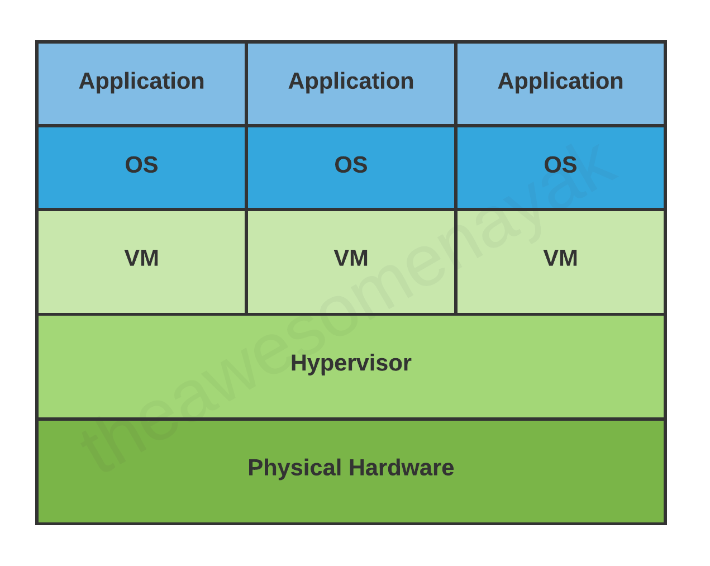

## Introduction

A virtual machine is a virtual representation of a physical computer.
We can call the virtual machine the guest machine, and the physical computer it runs on is the host machine.

Fig.1. VM.

A single physical machine can run multiple virtual machines, each with their own operating system and applications.
These virtual machines are isolated from each other.
