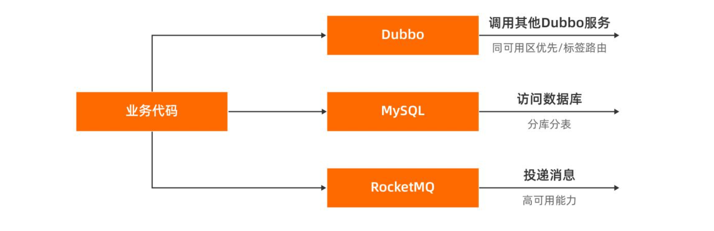
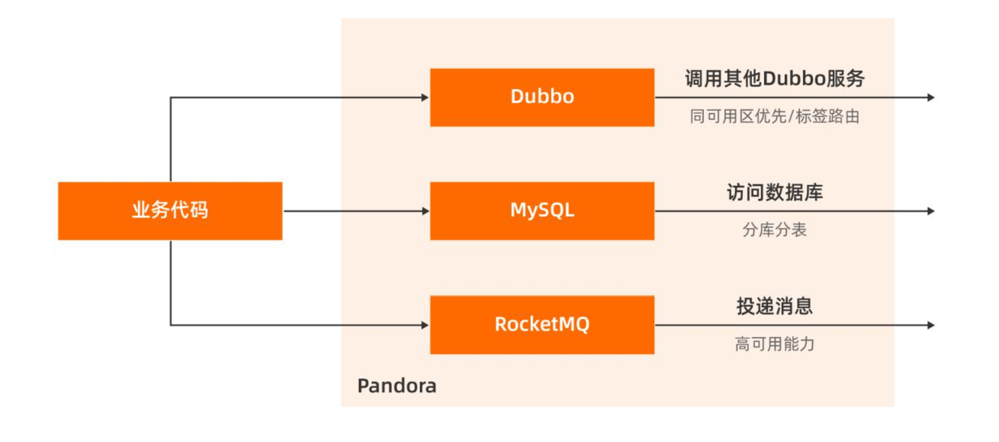

## Pandora

Pandora是一个轻量级的隔离容器，也就是taobao-hsf.sar。
它用来隔离应用和中间件的依赖，也用来隔离中间件之间的依赖。
Pandora 会在运⾏时通过类隔离的⽅式，将各个中间件之间的三⽅依赖隔离开来，有效地避免了三⽅依赖互相冲突的情况。
同时，Pandora 还会在运⾏时导出中间件的类，来替换 SDK 中所引⼊的中间件类，这样就可以
实现运⾏时的中间件版本和开发时的中间件版本分离。
应⽤升级 SDK 只需升级 Pandora 容器即可，只有在⼤版本升级时才需要修改 BOM 和重新打包

EDAS的Pandora中集成了服务发现、配置推送和调用链跟踪等各种中间件功能产品插件。您可以利用该插件对EDAS应用进行服务监控、治理、跟踪、分析等全方位运维管理。

另外，通过 Fat-SDK 的⽅式，将所有中间
件⼀次性打包交付给业务⽅升级。这⼀点和 Maven 引⼊的 bom 的思路类似，但是相⽐
bom 来说每个 Pandora 的插件都可以享有独⽴的依赖。通过这种⽅式，业务不再需要单独升
级某个中间件，⽽是⼀次性把所有的中间件完成升级，从⽽⼤幅提升了中间件升级的效率

## Pandora Boot 

Pandora Boot基于 Pandora 和 Fat Jar 技术，可以直接在 IDE 里启动 Pandora 环境，大大提高您的开发调试等效率。 Pandora Boot 与 Spring Boot AutoConfigure 深度集成

## Links

