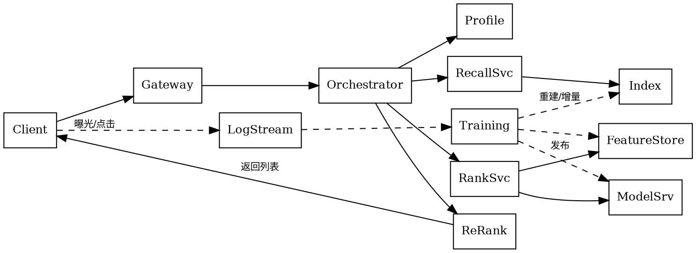

## Introduction

推荐系统的在线架构解决的是另一类问题：**如何把离线训练出来的判断，在几十毫秒内、以可承受的机器成本、稳定地送到用户面前，并且让线上产生的行为回流成下一次训练的样本**。

模型只是链路上的一小段代码。效果的三个前提全部由工程兑现：数据够新（用户刚点过的那一下要能影响下一次返回）、候选够多（召回截断规模每砍一半，下游省了钱但上限也降了）、迭代够快（一天上不了三次实验，就等于效果在原地）。反过来，性能与效果互相制约：模型越复杂，超时率越高，超时后走兜底，效果反而更差。所以这一层的设计目标从来不是"跑通"，而是**在预算内把效果上限顶满**。

实线是在线请求路径，虚线是离线的回流与发布路径。两条路必须**共用同一套口径**，这条图最重要的信息就这一句。

## Layered Responsibilities

| 层 | 职责 | 失败时的直接表现 |
| ------ | ------ | ------ |
| 接入与协议层 | 鉴权、限流、参数与上下文补齐、超时控制 | 整页无结果 |
| 编排层 | 按 DAG 调度各引擎调用、并发扇出、结果拼装、降级分支 | 局部模块空、RT 抖动 |
| 画像与特征层 | 点查用户/物品特征，多级缓存 | 特征缺失率上升，预估退化 |
| 召回与索引层 | 多路召回、ANN/倒排检索、增量更新 | 候选结构改变、长尾消失 |
| 预估层 | 批量打分、模型加载与版本切换 | 超时→兜底分数 |
| 策略与混排层 | 频控、打散、保量、业务规则 | 体验问题、业务指标异常 |
| 数据回流层 | 埋点、日志、样本拼接、监控 | 训练数据断供或口径漂移 |

厂商中立的分层与阿里侧的具体产品形态（TPP 与其编排的 BE/iGraph/EAS 引擎族）是同一件事的两种画法，实现细节见 [TPP](/docs/CS/RecommenderSystem/TPP.md)。

## Arithmetic of Latency Budget

链路总 RT 不是各环节之和——并发的部分是取最大值，串行的部分才相加：

$$
T \approx T_{\text{ctx}} + \max_i\left( T_{\text{recall},i} \right) + T_{\text{feature}} + T_{\text{rank}} + T_{\text{mix}}
$$

其中上下文与画像拉取 $T_{\text{ctx}}$、多路召回并行后的最慢一路 $\max_i T_{\text{recall},i}$、特征获取 $T_{\text{feature}}$、模型打分 $T_{\text{rank}}$、混排 $T_{\text{mix}}$。

由此得到几条硬约束：

- **瓶颈常在数据搬运，不在计算**：千级候选意味着成千上万次特征点查。批量接口 + 并发扇出 + 本地缓存的收益，通常大于把模型换小
- **超时必须层层收窄**：内层调用的超时要显著小于外层剩余预算，否则外层先超时、内层还在重试，一次用户请求会被放大成几十倍下游流量（重试风暴）。熔断与限流的机制本身见 [CircuitBreaker](/docs/CS/SE/CircuitBreaker.md)、[RateLimiter](/docs/CS/SE/RateLimiter.md)
- **P99 才是预算依据**：均值达标而 P99 超时的链路，会表现为"部分用户看到的永远是兜底结果"，这类偏差在指标上极难发现，必须单独统计兜底触发率
- **加一级模型要先回答预算从哪来**：粗排的合理性与否，本质是精排候选量与 RT 的取舍，而不是"多一层更先进"

## Consistency: The Biggest Pitfall of Online Architecture

效果对不上时，八成不是模型退化，而是一致性破了。三处必须对齐：

- **特征同源**：同一份特征定义要能同时产出离线训练值与在线打分值。做法是把特征逻辑收敛到一处（DSL 或统一算子库），而不是离线写一遍 SQL、在线写一遍 Java——两份实现的差异就是离在线不一致的全部来源
- **快照口径**：训练特征取"曝光那一刻"的值，不能用当前值重算（否则学到未来）。与标签窗口、延迟转化一起构成样本正确性的基础，见 [Pipeline](/docs/CS/RecommenderSystem/Pipeline.md)
- **版本对齐**：模型版本、embedding 词表版本、向量索引版本三者必须一起发布。换了 embedding 模型却查旧索引，等价于随机召回，而各项指标不会报错，这是最典型的静默故障

## Indexing and Online Storage Selection

| 需求 | 常用存储 | 取舍 |
| ------ | ------ | ------ |
| 用户画像/特征点查（微秒级、QPS 高） | KV（[Redis](/docs/CS/DB/Redis/Redis.md) 一类） | 内存成本高，容量要按热数据裁剪 |
| 超宽特征表、批量扫描 | 宽表 LSM 系（[HBase](/docs/CS/DB/HBase.md) 一类） | 点查延迟高于 KV，扩容便宜 |
| 标签与约束过滤 | 倒排/搜索引擎（[ES](/docs/CS/Framework/ES/ES.md)） | 更新有可见延迟，深分页代价高 |
| 向量近邻 | 专用向量库（[Milvus](/docs/CS/DB/Milvus/Milvus.md)）或 pgvector（见 [PostgreSQL](/docs/CS/DB/PostgreSQL/PostgreSQL.md)） | 召回率—延迟—内存三角折中，见 [Recall](/docs/CS/RecommenderSystem/Recall.md) |
| 关系类召回（共同购买、社交邻居） | 图库（见 [Neo4j](/docs/CS/DB/graph/Neo4j.md)） | 多跳查询延迟不可预测，通常预计算 |
| 曝光去重/频控 | 布隆过滤器 + 计数器（见 [BloomFilter](/docs/CS/DB/LevelDB/BloomFilter.md)） | 有假阳性：误判"已曝光"会让物品永久丢失，需容量与删除策略 |

**更新时效是选型里最常被低估的一项**：全量重建便宜但新物品要等小时级；增量段能让分钟级甚至秒级可见，但会带来段合并、内存膨胀与一致性窗口。行为链路侧通常靠消息队列削峰 + 流式计算更新（见 [Kafka](/docs/CS/MQ/Kafka/Kafka.md)、[Flink](/docs/CS/Framework/Flink/Flink.md)）。

## Release, Canary and Rollback

一次模型上线要同时回答"效果对不对"和"会不会出事"，因此标准流水线是：

1. 离线评估（时间切分，见 [Evaluation](/docs/CS/RecommenderSystem/Evaluation.md)）
2. **影子流量/双跑**：新模型只打分不影响曝光，比对分数分布与特征缺失率——这一步能拦住绝大多数线上事故
3. 小流量灰度：按用户分桶，先看性能与护栏指标，再看效果指标
4. 逐步放量并留观察窗：短期指标含新奇效应，需要跨过完整周期
5. 一键回滚：模型、索引、特征三者要能原子回退——不能原子回退的发布方案不该上生产

配置与开关（业务规则、降级阈值、流量分配）走配置中心动态下发，而不是等下一次发版；这与灰度发布、熔断降级共同构成"柔性化"的一部分（另见 [SystemDesign](/docs/CS/SE/SystemDesign.md)）。

## Degradation Matrix

写清楚"每一层失败时退到哪里"，比事后临时补补丁更可靠：

| 故障 | 降级动作 | 效果损失 | 是否对用户可见 |
| ------ | ------ | ------ | ------ |
| 画像服务超时 | 用请求内上下文 + 默认人群 | 个性化大幅退化 | 否 |
| 某一路召回失败 | 其余路补配额，热门兜底 | 覆盖率下降 | 否 |
| 精排模型超时 | 用召回分或统计 CTR 排序 | 排序质量下降 | 否 |
| 全部预估不可用 | 静态兜底列表（本地缓存） | 无个性化 | 可能重复曝光 |
| 流量过载 | 限流 + 候选截断 + 粗排替代精排 | 精度换可用性 | 否 |

兜底列表本身要**预生成并缓存**（见 [Cache](/docs/CS/SE/Cache.md)），而不是故障时现算——故障时的下游依赖往往同时是坏的。

## Cost and Capacity

推荐系统的成本结构与候选量强相关：

- **打分成本** ≈ 候选条数 × 单条（特征条数 × 模型 FLOPs）。这也是"召回截断规模"与"粗排存在"的根本原因
- **Embedding 内存** ≈ 词表规模 × 维度 × 每元素字节数，量级常超预期：$10^8$ 个 ID、64 维、FP32（4 字节）仅参数就要约 $10^8 \times 64 \times 4$ 字节，即 24 GiB 上下。所以哈希分桶、维度压缩、量化与冷热分层是必做项，而不是优化项
- **索引内存**由 ANN 方案决定：图索引要把边存进内存，量化索引则以召回率换内存
- **单位成本指标**：每千次请求成本、每次曝光成本、每 UV 成本。没有这个口径，"效果提升 0.5%"和"成本上升 30%"就没法放在一起决策

容量评估靠压测与流量回放：用生产请求样本回放来验证新链路的 P99 与降级路径是否真能触发（见 [Stress_testing](/docs/CS/SE/Stress_testing.md)）。只按 QPS 线性外推的容量估算，通常会在降级路径上翻车——因为兜底逻辑本身也是一条没被测过的链路。

## Observability and Fault Localization

- **请求级链路追踪**：一次请求经过哪些引擎、各段耗时、命中了哪条降级分支。链路不染色就永远说不清"这一次为什么兜底了"（见 [Tracing](/docs/CS/Distributed/Tracing/Tracing.md)、[APM](/docs/CS/SE/APM.md)）
- **必备看板**：QPS、P50/P99 RT、超时率、兜底与降级触发率、特征缺失率、各召回路配额与实际曝光来源占比、pCTR 与真实 CTR 的比值（PCoC）、索引与模型版本号
- **日志即样本**：线上日志结构决定了能不能构造正确样本与做反事实评估，因此"可观测性"与"可训练性"在这套架构里是同一件事的两面（见 [Evaluation](/docs/CS/RecommenderSystem/Evaluation.md)）
- **告警阈值要盯比率而非绝对值**：候选结构、缺失率、来源占比的突变是事故前兆，而 CTR 这类指标波动大，用它当第一报警点往往已经太晚

## Links

- [推荐系统](/docs/CS/RecommenderSystem/RecommenderSystem.md)
- [Pipeline](/docs/CS/RecommenderSystem/Pipeline.md)
- [Recall](/docs/CS/RecommenderSystem/Recall.md)
- [Ranking](/docs/CS/RecommenderSystem/Ranking.md)
- [Evaluation](/docs/CS/RecommenderSystem/Evaluation.md)
- [UserProfile](/docs/CS/RecommenderSystem/UserProfile.md)
- [TPP](/docs/CS/RecommenderSystem/TPP.md)
- [DataEngineering](/docs/CS/RecommenderSystem/DataEngineering.md)
- [Debiasing](/docs/CS/RecommenderSystem/Debiasing.md)
- [SystemDesign](/docs/CS/SE/SystemDesign.md)
- [CircuitBreaker](/docs/CS/SE/CircuitBreaker.md)
- [RateLimiter](/docs/CS/SE/RateLimiter.md)
- [Cache](/docs/CS/SE/Cache.md)
- [Milvus](/docs/CS/DB/Milvus/Milvus.md)

## References

1. [Deep Learning Recommendation Model for Personalization and Recommendation Systems-arXiv](https://arxiv.org/abs/1906.00091)
2. [从零开始了解推荐系统全貌-微信公众号](https://mp.weixin.qq.com/s/n1PB5LGppaxlfRWx8WxhLg)
3. [打造算法在线服务领域极致开发体验与性能-阿里云开发者社区](https://developer.aliyun.com/article/933235)
