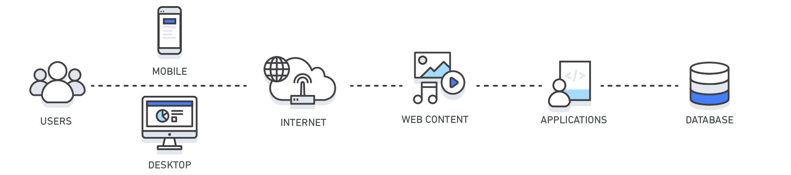

## Introduction

在计算中，缓存是一种高速数据存储层，通常存储瞬态数据子集，以便将来对该数据的请求能够比访问主存储位置更快地得到响应。
缓存允许你高效地复用先前检索或计算的数据。

缓存中的数据通常存储在 RAM 等快速访问硬件中，也可能与软件组件配合使用。
缓存的主要目的是通过减少访问底层较慢存储层的需要来提高数据检索性能。
以容量换取速度，缓存通常临时存储数据子集，这与数据通常完整且持久的数据库形成对比。

缓存可以在各种技术层面应用和利用，包括操作系统、网络层（包括 CDN 和 DNS）、Web 应用程序和数据库。
对于许多读密集型应用工作负载（如问答门户、游戏、媒体共享和社交网络），可以使用缓存来显著减少延迟并提高 IOPS。
缓存信息可以包括数据库查询结果、计算密集型计算、API 请求/响应以及 HTML、JavaScript 和图像文件等 Web 资源。
处理数据集的计算密集型工作负载（如推荐引擎和高性能计算模拟）也受益于作为缓存的内存数据层。
在这些应用中，非常大的数据集必须跨数百个节点的机器集群实时访问。
由于底层硬件的速度，在基于磁盘的存储中操作这些数据是这些应用的显著瓶颈。

在实现缓存层时，了解被缓存数据的有效性很重要。
成功的缓存会产生高命中率，这意味着数据在获取时存在。
缓存未命中发生在获取的数据不在缓存中时。
可以应用 TTL 等控制来相应地使数据过期。
另一个考虑因素是缓存环境是否需要高可用性，这可以通过 Redis 等内存引擎来满足。
在某些情况下，内存层可以用作独立的数据存储层，而不是缓存来自主位置的数据。
在这种情况下，为内存引擎中的常驻数据定义适当的 RTO 和 RPO 以确定是否合适很重要。
不同内存引擎的设计策略和特性可以应用于满足大多数 RTO 和 RPO 要求。

| 层级         | 客户端侧                                                              | DNS                                                                                 | Web                                                                              | 应用                                                | 数据库                                                   |
| ------------ | --------------------------------------------------------------------- | ----------------------------------------------------------------------------------- | -------------------------------------------------------------------------------- | --------------------------------------------------- | -------------------------------------------------------- |
| 用例         | 加速从网站（浏览器或设备）检索 Web 内容                                  | 域名解析加速从 Web/应用服务器检索 Web 内容                                             | 管理 Web 会话（服务端）                                                            | 加速应用性能和数据访问                               | 减少数据库查询请求相关的延迟                               |
| 技术         | HTTP 缓存头、浏览器                                                    | DNS 服务器                                                                          | HTTP 缓存头、CDN、反向代理、Web 加速器、键值存储                                   | 键值数据存储、本地缓存                               | 数据库缓冲区、键值数据存储                                 |

### Benefits of Caching

- **提高应用性能**
  因为内存比磁盘快几个数量级，从内存缓存读取数据极快（亚毫秒级）。
  这种显著更快的数据访问提高了应用程序的整体性能。
- **降低数据库成本**
  单个缓存实例可以提供数十万 IOPS，可能取代多个数据库实例，从而降低总成本。
  如果主数据库按吞吐量收费，这尤其重要。在这些情况下，价格节省可能达到几十个百分点。
- **减少后端负载**
  通过将读负载的很大部分从后端数据库重定向到内存层，缓存可以减少数据库负载，防止其在负载下性能下降，甚至在流量高峰时崩溃。
- **可预测的性能**
  现代应用中的一个常见挑战是处理应用使用高峰。例如超级碗或选举日的社交应用、黑色星期五的电商网站等。
  数据库负载增加导致获取数据的延迟更高，使整体应用性能不可预测。通过利用高吞吐量的内存缓存，可以缓解此问题。
- **消除数据库热点**
  在许多应用中，一小部分数据（如名人资料或热门产品）可能比其他数据更频繁地被访问。
  这可能导致数据库中的热点，可能需要根据最常用数据的吞吐量要求过度配置数据库资源。
  将常用 key 存储在内存缓存中，可以减轻过度配置的需要，同时为最常访问的数据提供快速且可预测的性能。
- **提高读吞吐量（IOPS）**
  除了更低的延迟，内存系统还提供比相应基于磁盘的数据库高得多的请求速率。
  用作分布式 side-cache 的单个实例可以每秒处理数十万个请求。

缓存带来一系列好处的同时，也注定需要付出一定的代价。
- 首先，服务系统中引入缓存，会增加系统的复杂度。
- 其次，由于缓存相比原始 DB 存储的成本更高，所以系统部署及运行的费用也会更高。
- 最后，由于一份数据同时存在缓存和 DB 中，甚至缓存内部也会有多个数据副本，多份数据就会存在一致性问题，同时缓存体系本身也会存在可用性问题和分区的问题。这就需要我们加强对缓存原理、缓存组件以及优秀缓存体系实践的理解，从系统架构之初就对缓存进行良好设计，降低缓存引入的副作用，让缓存体系成为服务系统高效稳定运行的强力基石。

### 缓存特征

命中率

最大空间

驱逐策略

## Where is Caching Implemented?

缓存的应用遍及整个技术领域--在各个层面和许多不同的技术栈中。

在硬件层面，缓存是 CPU 架构的一部分，例如，以 1-3 级（L1/L2/L3）缓存的形式出现。

在操作系统内核层面，有一种磁盘缓存形式被称为页面缓存。当然，还有其他形式。

对于基于网络的系统，当然有浏览器缓存和 CDN（内容分发网络）。它们分别在客户端或 CDN 端缓存常用的静态资源（图片、样式表等）。这样做的目的是减少带宽，并快速、高效、低成本的向用户提供这些资源。

不同类型的应用程序和中间件也有自己的缓存。例如，数据库使用缓存来保存经常使用的查询和经常返回的结果集。

当然，还有许多强大的软件缓存产品，如 Redis、EHCache、Memcached、Hazelcast、Infinispan 等，可以在分布式应用中实现可扩展的分布式缓存。

"分布式"高速缓存的概念也可以与"本地"或"本地化"高速缓存相比较。分布式缓存是一种分布在网络上多个设备上的缓存形式，本地缓存只存在于一台设备上。
如果有多个实例访问缓存，可能需要解决同步问题、竞争条件、数据损坏以及分布式应用带来的其他挑战。另一方面，共享缓存是一个强大的概念，可以帮助应用程序处理本地缓存（尽管更简单）无法处理的用例

分布式缓存和本地缓存都面临着一些共同的挑战。

主要挑战在于如何在保持数据新鲜度、在优化缓存失效和驱逐之间保持平衡，以及如何使缓存管理方式与特定用例相匹配。

## Caching Strategies

从数据库缓存数据时，可以实施 Redis 和 Memcached 的缓存模式，包括主动和被动方法。
选择实施的模式应直接与缓存和应用目标相关。

两种常见的方法是 cache-aside（延迟加载）和 write-through（直写）。
cache-aside 缓存在数据被请求后更新。write-through 缓存在主数据库更新时立即更新。
两种方法中，应用程序本质上都在管理缓存的数据及其缓存时间。

一个合适的缓存策略包括有效使用 write-through 和数据的延迟加载，并设置适当的过期时间以保持数据的相关性和精简。

<!-- tabs:start -->

### **Cache-Aside (Lazy Loading)**

Cache-aside 是可用的最常见的缓存策略。
基本的数据检索逻辑可以总结如下：

1. 当应用程序需要从数据库读取数据时，首先检查缓存以确定数据是否可用。
2. 如果数据可用（缓存命中），返回缓存数据，并向调用方发出响应。
3. 如果数据不可用（缓存未命中），则查询数据库获取数据。
   然后缓存填充从数据库检索的数据，并将数据返回给调用方。

这种方法有几个优点：

- 缓存只包含应用程序实际请求的数据，有助于保持缓存大小的成本效益。
- 实施这种方法简单直接，能立即带来性能提升，无论使用的是封装了延迟缓存的应用程序框架还是自定义应用逻辑。

将 cache-aside 作为唯一缓存模式的一个缺点是，因为数据仅在缓存未命中后加载到缓存中，初始响应时间会增加一些开销，因为需要额外的缓存和数据库往返。

### **Write-Through**

Write-through 缓存颠倒了缓存填充的顺序。不是在缓存未命中后延迟加载数据到缓存，而是在主数据库更新后立即主动更新缓存。基本的数据检索逻辑可以总结如下：

1. 应用程序、批处理或后端进程更新主数据库。
2. 紧接着，缓存中的数据也随之更新。

Write-through 模式几乎总是与延迟加载一起实现。如果应用程序因数据不存在或已过期而遇到缓存未命中，则执行延迟加载模式来更新缓存。

Write-through 方法有几个优点：

- 因为缓存与主数据库保持一致，数据在缓存中被找到的可能性更大。
  这反过来带来更好的整体应用性能和用户体验。
- 数据库性能最优，因为执行了更少的数据库读取。

Write-through 方法的一个缺点是，不常请求的数据也会写入缓存，导致缓存更大、成本更高。

### **Write-Around**

这种策略会填充底层存储，但不会填充缓存本身。换句话说，写操作绕过缓存，只写入底层存储。这种技术与Cache-Aside有一些重叠。

不同之处在于，使用 Cache-Aside 时，重点是读取和懒加载--只有在首次从数据存储中读取数据时才将其填充到缓存中。而使用 Write-Around 缓存时，重点则是写入性能。当数据被频繁写入但不被频繁读取时，这种技术通常用于避免缓存污染。

优点

减少缓存污染，因为每次写入都不会填充缓存
缺点

如果某些记录经常被读取，性能就会受到影响，因此，如果能主动加载到缓存中，就能避免在首次读取时访问数据库。
何时使用

当写入量较大但读取量明显较小时，通常会使用这种方法。

### **Write-Back (Write-Behind)**

写操作首先填充缓存，然后写入数据存储。这里的关键是，写入数据存储是异步进行的，因此不需要两阶段的事务提交。

Write-Behind 缓存策略通常由缓存产品处理。如果缓存产品有这种机制，应用将向缓存写入内容，然后缓存产品将负责向数据库发送更改内容。如果缓存产品不支持这种机制，应用程序本身将触发对数据库的异步更新。

优点

写入速度更快，因为系统只需在初始事务中写入缓存。数据库将在稍后时间更新。
如果流量由缓存产品处理，那么应用逻辑的复杂性就会降低。

缺点

在数据库接收到新更改之前，数据库和高速缓存可能会不同步，因此可能会出现不一致。
当缓存最终尝试更新数据库时，可能会出现错误。如果出现这种情况，就需要有更复杂的机制来确保数据库接收到最新的数据。

何时使用

当写入性能非常重要，而且数据库中的数据与缓存中的数据暂时稍有不同步是可以接受的时候，就可以使用回写缓存。适用于写入量大但一致性要求不那么严格的应用。例如，CDN（内容分发网络）可用于快速更新缓存内容，然后将其同步到记录系统。

### **Read-Through**

直读缓存在某种意义上类似于旁路缓存模式，因为在这两种模式中，缓存都是我们首先查找记录的地方。如果缓存未命中，就会在数据库中查找。不过，在旁路缓存模式中，查询缓存和数据库的责任都落在了应用程序身上，而在直读缓存中，这一责任则落在了缓存产品身上（如果它有这种机制的话）。

优点

简单--所有逻辑都封装在缓存应用程序中
缺点

缓存缺失时从数据库读取数据的潜在延迟。需要复杂的数据更新失效机制。
何时使用

当你想简化访问数据的代码时，就会使用直读缓存。此外，当你想确保缓存始终包含来自数据存储的最新数据时，也可以使用直读缓存。这对于读取数据比写入数据更频繁的应用程序非常有用。但这里的关键点是，缓存产品应该能够通过配置或本地方式从底层记录系统中执行读取操作。

<!-- tabs:end -->

### Summary of Caching Strategies

| 缓存策略          | 策略概述             | 负责DB操作    | 应用场景                    |
|---------------|------------------|-----------|-------------------------|
| Cache-Aside   | 只在需要读缓存时从DB获取来更新 | 应用程序      | 按需缓存产品详细信息场景            |
| Write-Through | 写操作同时DB和缓存       | 缓存产品或应用程序 | 较强一致性要求 如银行系统           |
| Write-Around  | 直接写DB 绕过缓存       |      应用程序     | 日志操作 无需缓存               |
| Write-Back    | 先写缓存 异步写入到存储     | 缓存产品或应用程序 | CDN 先更新缓存中的内容，然后同步到存储系统 |
| Read-Through  | 主要读缓存 缺失则从存储系统加载 |    缓存产品或应用程序       |    用户配置文件服务在缓存缺失时获取和缓存用户数据  |

对于 Cache Aside 模式，业务应用需要同时维护 cache 和 DB 两个数据存储方

Read/Write Through 模式。在这种模式下，业务应用只关注一个存储服务即可，业务方的读写 cache 和 DB 的操作，都由存储服务代理。存储服务收到业务应用的写请求时，会首先查 cache，如果数据在 cache 中不存在，则只更新 DB，如果数据在 cache 中存在，则先更新 cache，然后更新 DB。而存储服务收到读请求时，如果命中 cache 直接返回，否则先从 DB 加载，回种到 cache 后返回响应。
这种模式的特点是，存储服务封装了所有的数据处理细节，业务应用端代码只用关注业务逻辑本身，系统的隔离性更佳。另外，进行写操作时，如果 cache 中没有数据则不更新，有缓存数据才更新，内存效率更高。
微博 Feed 的 Outbox Vector（即用户最新微博列表）就采用这种模式。一些粉丝较少且不活跃的用户发表微博后，Vector 服务会首先查询 Vector Cache，如果 cache 中没有该用户的 Outbox 记录，则不写该用户的 cache 数据，直接更新 DB 后就返回，只有 cache 中存在才会通过 CAS 指令进行更新

Write Behind Caching 模式与 Read/Write Through 模式类似，也由数据存储服务来管理 cache 和 DB 的读写。不同点是，数据更新时，Read/write Through 是同步更新 cache 和 DB，而 Write Behind Caching 则是只更新缓存，不直接更新 DB，而是改为异步批量的方式来更新 DB。该模式的特点是，数据存储的写性能最高，非常适合一些变更特别频繁的业务，特别是可以合并写请求的业务，比如对一些计数业务，一条 Feed 被点赞 1万 次，如果更新 1万 次 DB 代价很大，而合并成一次请求直接加 1万，则是一个非常轻量的操作。但这种模型有个显著的缺点，即数据的一致性变差，甚至在一些极端场景下可能会丢失数据。比如系统 Crash、机器宕机时，如果有数据还没保存到 DB，则会存在丢失的风险。所以这种读写模式适合变更频率特别高，但对一致性要求不太高的业务，这样写操作可以异步批量写入 DB，减小 DB 压力

## 缓存失效

缓存策略与如何从缓存中加载和检索数据有关，而缓存失效则更多的与记录系统和缓存之间的数据一致性和新鲜度有关。

因此，这两个概念之间存在一些重叠，对于某些缓存策略来说，失效比其他策略更简单。例如，使用"通过缓存写入"方法时，缓存会在每次写入时更新，因此无需额外实现。但是，删除可能不会被反映，因此可能需要应用逻辑来显式处理。

可以通过对缓存 key 应用 TTL（生存时间）或过期时间来控制缓存数据的新鲜度。
经过设定的时间后，key 从缓存中删除，需要访问原始数据存储以获取更新后的数据。

两个原则可以帮助确定适当的 TTL 和要实施的缓存模式类型。
首先，需要了解底层数据的变化频率。
其次，需要评估将过时数据而非更新后数据返回给应用程序的风险。

例如，将静态或参考数据（即很少更新的数据）保持更长时间的有效期是有意义的，在底层数据更新时对缓存进行 write-through。
对于经常变化的动态数据，可能希望应用较低的 TTL，使数据的过期频率与主数据库匹配。
这降低了返回过时数据的风险，同时仍然提供缓冲来减轻数据库请求压力。

即使只缓存几分钟或几秒的数据，适当地对缓存 key 应用 TTL 也可以带来巨大的性能提升和更好的用户体验。

在缓存 key 上应用 TTL 时的另一个最佳实践是向 TTL 添加一些时间抖动。
这减少了缓存数据过期时出现数据库重负载的可能性。
例如，缓存产品信息的场景。
如果所有产品数据同时过期，并且应用处于高负载下，则后端数据库必须满足所有产品请求。
根据负载情况，这可能会给数据库带来过大压力，导致性能不佳。
通过在 TTL 中添加轻微抖动（随机生成的时间值），可以减轻后端数据库的压力，并减少缓存引擎因删除过期 key 而产生的 CPU 使用。

## 缓存驱逐

缓存驱逐与缓存失效类似，都是删除旧的缓存记录。但两者区别在于，当缓存已满，无法再容纳任何记录时，就需要进行缓存驱逐。

Evictions occur when cache memory is overfilled or is greater than the maxmemory setting for the cache, causing the engine selecting keys to evict in order to manage its memory. The keys that are chosen are based on the eviction policy you select.

从系统设计的角度来说，过期之类的机制可以考虑使用四种思路来实现。

- 定时删除：是指针对每一个需要被删除的对象启动一个计时器，到期之后直接删除
- 延迟队列：也就是把对象放到一个延迟队列里面。当从队列里取出这个对象的时候，就说明它已经过期了，这时候就可以删除。
- 懒惰删除：是指每次要使用对象的时候，检查一下这个对象是不是已经过期了。如果已经过期了，那么直接删除。
- 定期删除：是指每隔一段时间就遍历对象，找到已经过期的对象删除掉。针对这四种思路的优缺点，你可以参考下面的表格。

### Eviction policy

下表总结了驱逐策略：

| Eviction Policy | Description | 适用场景                                       |
|----------|------------|--------------------------------------------|
| LRU             | 最近最少使用   | 非常适合通用缓存                                   |
| FIFO            | 先进先出      | 适用于缓存可预测使用时间的数据                            |
| LFU             | 最不经常使用    | 适用于具有稳定访问模式 长期频繁访问数据的应用程序  访问模式会显著变化场景不适用  |
| TTL             | 生存时间      | 不适用于有效性不会随时间自然失效的数据，以及基于其他因素需要无限期保留在缓存中的数据 |
| Random          | 随机         | 当访问模式不可预测 其它模式都不适用时                       |

选择合适的驱逐策略的好方法是考虑集群中存储的数据以及 key 被驱逐的后果。
通常，基于 LRU 的策略对于基本缓存用例更常见。
然而，根据目标，可能希望使用更适合需求的 TTL 或随机驱逐策略。

此外，如果集群出现驱逐，通常表明应该 scale up（使用更大内存的节点）或 scale out（添加更多节点）以适应更多数据。
此规则的例外是故意依赖缓存引擎通过驱逐来管理 key（也称为 LRU 缓存）。

## CPU Caching

[CPU 缓存](/docs/CS/CO/Cache.md)

## Memory Caching

内存缓存（通常简称为缓存）是一种技术，其中计算机应用程序临时将数据存储在计算机主内存（即 RAM）中，以便快速检索数据。
用于临时存储的 RAM 称为缓存。
由于访问 RAM 比访问硬盘驱动器或网络等其他介质快得多，缓存通过更快的数据访问帮助应用程序运行更快。
当应用程序表现出重复访问之前访问过的数据的常见模式时，缓存尤其有效。
缓存对于存储耗时计算的数据也很有用。通过将计算结果存储在缓存中，系统避免重复计算从而节省时间。

## CDN

当 Web 流量在地理上分散时，在全球复制整个基础设施并不总是可行的，当然也不经济。
CDN 使你能够利用其全球边缘位置网络，向客户提供 Web 内容（如视频、网页、图像等）的缓存副本。
为了减少响应时间，CDN 利用离客户或原始请求位置最近的边缘位置来减少响应时间。
由于 Web 资产从缓存提供，吞吐量显著提高。对于动态数据，许多 CDN 可以配置为从源服务器检索数据。

## DNS Caching

互联网上的每个域名请求基本上都会查询 DNS 缓存服务器，以解析域名关联的 IP 地址。
DNS 缓存在多个层级发生，包括 OS、ISP 和 DNS 服务器。

## Client Caching

在向观众提供 Web 内容时，通过缓存图像、HTML 文档、视频等 Web 资源并消除磁盘读取和服务器负载，可以大大减少获取这些资源所涉及的延迟。
可以在服务器端和客户端使用各种 Web 缓存技术。
服务端 Web 缓存通常涉及利用 Web 代理，该代理保留来自其前方 Web 服务器的 Web 响应，有效降低其负载和延迟。
客户端 Web 缓存可以包括基于浏览器的缓存，该缓存保留先前访问过的 Web 内容的缓存版本。

页面缓存

- 某些元素缓存
- 静态页面缓存

Browser缓存 基于HTTP header控制

## App Cache

Android

- ASimpleCache
- 自定义缓存设置

ios:

- SDWebImage NsCache

## Application Cache

[JCache](/docs/CS/Java/JCache.md)

Guava Cache

Caffeine

本地缓存更适合存储一些变化频率极低，数据量较小的场景，诸如基础数据、配置了类型的数据缓存等

架构部署主要考虑如何对缓存进行分池、分层、分 IDC，以及是否需要进行异构处理。
1. 核心的、高并发访问的不同数据，需要分别分拆到独立的缓存池中，进行分别访问，避免相互影响；访问量较小、非核心的业务数据，则可以混存。
2. 对海量数据、访问超过 10～100万 级的业务数据，要考虑分层访问，并且要分摊访问量，避免缓存过载。
3. 如果业务系统需要多 IDC 部署甚至异地多活，则需要对缓存体系也进行多 IDC 部署，要考虑如何跨 IDC 对缓存数据进行更新，可以采用直接跨 IDC 读写，也可以采用 DataBus 配合队列机进行不同 IDC 的消息同步，然后由消息处理机进行缓存更新，还可以由各个 IDC 的 DB Trigger 进行缓存更新。
4. 某些极端场景下，还需要把多种缓存组件进行组合使用，通过缓存异构达到最佳读写性能。
5. 站在系统层面，要想更好得管理缓存，还要考虑缓存的服务化，考虑缓存体系如何更好得进行集群管理、监控运维等。

读写方式
首先是 value 的读写方式。是全部整体读写，还是只部分读写及变更？是否需要内部计算？比如，用户粉丝数，很多普通用户的粉丝有几千到几万，而大 V 的粉丝更是高达几千万甚至过亿，因此，获取粉丝列表肯定不能采用整体读写的方式，只能部分获取。另外在判断某用户是否关注了另外一个用户时，也不需要拉取该用户的全部关注列表，直接在关注列表上进行检查判断，然后返回 True/False 或 0/1 的方式更为高效。
KV size
然后是不同业务数据缓存 KV 的 size。如果单个业务的 KV size 过大，需要分拆成多个 KV 来缓存。但是，不同缓存数据的 KV size 如果差异过大，也不能缓存在一起，避免缓存效率的低下和相互影响。
key 的数量
key 的数量也是一个重要考虑因素。如果 key 数量不大，可以在缓存中存下全量数据，把缓存当 DB 存储来用，如果缓存读取 miss，则表明数据不存在，根本不需要再去 DB 查询。如果数据量巨大，则在缓存中尽可能只保留频繁访问的热数据，对于冷数据直接访问 DB。
读写峰值
另外，对缓存数据的读写峰值，如果小于 10万 级别，简单分拆到独立 Cache 池即可。而一旦数据的读写峰值超过 10万 甚至到达 100万 级的QPS，则需要对 Cache 进行分层处理，可以同时使用 Local-Cache 配合远程 cache，甚至远程缓存内部继续分层叠加分池进行处理。微博业务中，大多数核心业务的 Memcached 访问都采用的这种处理方式。
命中率
缓存的命中率对整个服务体系的性能影响甚大。对于核心高并发访问的业务，需要预留足够的容量，确保核心业务缓存维持较高的命中率。比如微博中的 Feed Vector Cache，常年的命中率高达 99.5% 以上。为了持续保持缓存的命中率，缓存体系需要持续监控，及时进行故障处理或故障转移。同时在部分缓存节点异常、命中率下降时，故障转移方案，需要考虑是采用一致性 Hash 分布的访问漂移策略，还是采用数据多层备份策略

过期策略
- 可以设置较短的过期时间，让冷 key 自动过期；
- 也可以让 key 带上时间戳，同时设置较长的过期时间，比如很多业务系统内部有这样一些 key：key_20190801。

平均缓存穿透加载时间
平均缓存穿透加载时间在某些业务场景下也很重要，对于一些缓存穿透后，加载时间特别长或者需要复杂计算的数据，而且访问量还比较大的业务数据，要配置更多容量，维持更高的命中率，从而减少穿透到 DB 的概率，来确保整个系统的访问性能。
缓存可运维性
对于缓存的可运维性考虑，则需要考虑缓存体系的集群管理，如何进行一键扩缩容，如何进行缓存组件的升级和变更，如何快速发现并定位问题，如何持续监控报警，最好有一个完善的运维平台，将各种运维工具进行集成。
缓存安全性
对于缓存的安全性考虑，一方面可以限制来源 IP，只允许内网访问，同时对于一些关键性指令，需要增加访问权限，避免被攻击或误操作时，导致重大后果。

失效

很多业务场景，稍不注意，就出现大量的缓存失效，进而导致系统 DB 压力大、请求变慢的情况。比如同一批火车票、飞机票，当可以售卖时，系统会一次性加载到缓存，如果缓存写入时，过期时间按照预先设置的过期值，那过期时间到期后，系统就会因缓存失效出现变慢的问题。类似的业务场景还有很多，比如微博业务，会有后台离线系统，持续计算热门微博，每当计算结束，会将这批热门微博批量写入对应的缓存。还比如，很多业务，在部署新 IDC 或新业务上线时，会进行缓存预热，也会一次性加载大批热数据

缓存穿透存在的原因，就是因为我们在系统设计时，更多考虑的是正常访问路径，对特殊访问路径、异常访问路径考虑相对欠缺。
缓存穿透的业务场景很多，比如通过不存在的 UID 访问用户，通过不存在的车次 ID 查看购票信息。用户输入错误，偶尔几个这种请求问题不大，但如果是大量这种请求，就会对系统影响非常大

不过这两种方案在设计时仍然有一些要注意的坑。
- 对于方案一，如果特殊访客持续访问大量的不存在的 key，这些 key 即便只存一个简单的默认值，也会占用大量的缓存空间，导致正常 key 的命中率下降。所以进一步的改进措施是，对这些不存在的 key 只存较短的时间，让它们尽快过期；或者将这些不存在的 key 存在一个独立的公共缓存，从缓存查找时，先查正常的缓存组件，如果 miss，则查一下公共的非法 key 的缓存，如果后者命中，直接返回，否则穿透 DB，如果查出来是空，则回种到非法 key 缓存，否则回种到正常缓存。
- 对于方案二，BloomFilter 要缓存全量的 key，这就要求全量的 key 数量不大，10亿 条数据以内最佳，因为 10亿 条数据大概要占用 1.2GB 的内存。也可以用 BloomFilter 缓存非法 key，每次发现一个 key 是不存在的非法 key，就记录到 BloomFilter 中，这种记录方案，会导致 BloomFilter 存储的 key 持续高速增长，为了避免记录 key 太多而导致误判率增大，需要定期清零处理

第三个经典问题是缓存雪崩。系统运行过程中，缓存雪崩是一个非常严重的问题。缓存雪崩是指部分缓存节点不可用，导致整个缓存体系甚至甚至服务系统不可用的情况。缓存雪崩按照缓存是否 rehash（即是否漂移）分两种情况：
- 缓存不支持 rehash 导致的系统雪崩不可用
- 缓存支持 rehash 导致的缓存雪崩不可用

原因分析
在上述两种情况中，缓存不进行 rehash 时产生的雪崩，一般是由于较多缓存节点不可用，请求穿透导致 DB 也过载不可用，最终整个系统雪崩不可用的。而缓存支持 rehash 时产生的雪崩，则大多跟流量洪峰有关，流量洪峰到达，引发部分缓存节点过载 Crash，然后因 rehash 扩散到其他缓存节点，最终整个缓存体系异常。
第一种情况比较容易理解，缓存节点不支持 rehash，较多缓存节点不可用时，大量 Cache 访问会失败，根据缓存读写模型，这些请求会进一步访问 DB，而且 DB 可承载的访问量要远比缓存小的多，请求量过大，就很容易造成 DB 过载，大量慢查询，最终阻塞甚至 Crash，从而导致服务异常。
第二种情况是怎么回事呢？这是因为缓存分布设计时，很多同学会选择一致性 Hash 分布方式，同时在部分节点异常时，采用 rehash 策略，即把异常节点请求平均分散到其他缓存节点。在一般情况下，一致性 Hash 分布+rehash 策略可以很好得运行，但在较大的流量洪峰到临之时，如果大流量 key 比较集中，正好在某 1～2 个缓存节点，很容易将这些缓存节点的内存、网卡过载，缓存节点异常 Crash，然后这些异常节点下线，这些大流量 key 请求又被 rehash 到其他缓存节点，进而导致其他缓存节点也被过载 Crash，缓存异常持续扩散，最终导致整个缓存体系异常，无法对外提供服务。

缓存雪崩的业务场景并不少见，微博、Twitter 等系统在运行的最初若干年都遇到过很多次。比如，微博最初很多业务缓存采用一致性 Hash+rehash 策略，在突发洪水流量来临时，部分缓存节点过载 Crash 甚至宕机，然后这些异常节点的请求转到其他缓存节点，又导致其他缓存节点过载异常，最终整个缓存池过载。另外，机架断电，导致业务缓存多个节点宕机，大量请求直接打到 DB，也导致 DB 过载而阻塞，整个系统异常。最后缓存机器复电后，DB 重启，数据逐步加热后，系统才逐步恢复正常。

预防缓存雪崩，这里给出 3 个解决方案。
- 方案一，对业务 DB 的访问增加读写开关，当发现 DB 请求变慢、阻塞，慢请求超过阀值时，就会关闭读开关，部分或所有读 DB 的请求进行 failfast 立即返回，待 DB 恢复后再打开读开关
- 方案二，对缓存增加多个副本，缓存异常或请求 miss 后，再读取其他缓存副本，而且多个缓存副本尽量部署在不同机架，从而确保在任何情况下，缓存系统都会正常对外提供服务。
- 方案三，对缓存体系进行实时监控，当请求访问的慢速比超过阀值时，及时报警，通过机器替换、服务替换进行及时恢复；也可以通过各种自动故障转移策略，自动关闭异常接口、停止边缘服务、停止部分非核心功能措施，确保在极端场景下，核心功能的正常运行。

数据不一致。
同一份数据，可能会同时存在 DB 和缓存之中。那就有可能发生，DB 和缓存的数据不一致。如果缓存有多个副本，多个缓存副本里的数据也可能会发生不一致现象。
不一致的问题大多跟缓存更新异常有关。比如更新 DB 后，写缓存失败，从而导致缓存中存的是老数据。另外，如果系统采用一致性 Hash 分布，同时采用 rehash 自动漂移策略，在节点多次上下线之后，也会产生脏数据。缓存有多个副本时，更新某个副本失败，也会导致这个副本的数据是老数据。
业务场景
导致数据不一致的场景也不少。如下图所示，在缓存机器的带宽被打满，或者机房网络出现波动时，缓存更新失败，新数据没有写入缓存，就会导致缓存和 DB 的数据不一致。缓存 rehash 时，某个缓存机器反复异常，多次上下线，更新请求多次 rehash。这样，一份数据存在多个节点，且每次 rehash 只更新某个节点，导致一些缓存节点产生脏数据

引发 Hot key 的业务场景很多，比如明星结婚、离婚、出轨这种特殊突发事件，比如奥运、春节这些重大活动或节日，还比如秒杀、双12、618 等线上促销活动，都很容易出现 Hot key 的情况

要解决这种极热 key 的问题，首先要找出这些 Hot key 来。对于重要节假日、线上促销活动、集中推送这些提前已知的事情，可以提前评估出可能的热 key 来。而对于突发事件，无法提前评估，可以通过 Spark，对应流任务进行实时分析，及时发现新发布的热点 key。而对于之前已发出的事情，逐步发酵成为热 key 的，则可以通过 Hadoop 对批处理任务离线计算，找出最近历史数据中的高频热 key

找到热 key 后，就有很多解决办法了。首先可以将这些热 key 进行分散处理，比如一个热 key 名字叫 hotkey，可以被分散为 hotkey#1、hotkey#2、hotkey#3，……hotkey#n，这 n 个 key 分散存在多个缓存节点，然后 client 端请求时，随机访问其中某个后缀的 hotkey，这样就可以把热 key 的请求打散，避免一个缓存节点过载

其次，也可以 key 的名字不变，对缓存提前进行多副本+多级结合的缓存架构设计。
再次，如果热 key 较多，还可以通过监控体系对缓存的 SLA 实时监控，通过快速扩容来减少热 key 的冲击。
最后，业务端还可以使用本地缓存，将这些热 key 记录在本地缓存，来减少对远程缓存的冲击

大 key 的业务场景也比较常见。比如互联网系统中需要保存用户最新 1万 个粉丝的业务，比如一个用户个人信息缓存，包括基本资料、关系图谱计数、发 feed 统计等。微博的 feed 内容缓存也很容易出现，一般用户微博在 140 字以内，但很多用户也会发表 1千 字甚至更长的微博内容，这些长微博也就成了大 key

对于大 key，给出 3 种解决方案。
- 第一种方案，如果数据存在 Mc 中，可以设计一个缓存阀值，当 value 的长度超过阀值，则对内容启用压缩，让 KV 尽量保持小的 size，其次评估大 key 所占的比例，在 Mc 启动之初，就立即预写足够数据的大 key，让 Mc 预先分配足够多的 trunk size 较大的 slab。确保后面系统运行时，大 key 有足够的空间来进行缓存
- 第二种方案，如果数据存在 Redis 中，比如业务数据存 set 格式，大 key 对应的 set 结构有几千几万个元素，这种写入 Redis 时会消耗很长的时间，导致 Redis 卡顿。此时，可以扩展新的数据结构，同时让 client 在这些大 key 写缓存之前，进行序列化构建，然后通过 restore 一次性写入
- 第三种方案时，如下图所示，将大 key 分拆为多个 key，尽量减少大 key 的存在。同时由于大 key 一旦穿透到 DB，加载耗时很大，所以可以对这些大 key 进行特殊照顾，比如设置较长的过期时间，比如缓存内部在淘汰 key 时，同等条件下，尽量不淘汰这些大 key

缓存过期
被动执行 或 被动 + 主动执行。
被动执行即把这个过程融合在对该缓存的每一次读写操作中，如果很长一段时间对该缓存未进行任何读写操作，过期的缓存条目是无法在到期时及时被删除的。在大多数「缓存」的使用场景下，这个策略是完全ok的，虽然删除得不及时，但可以保证永远不会读出一条已经过期的缓存条目。
被动 + 主动执行即在被动执行的基础上，构建缓存对象时还会额外启动一个后台定时任务，每隔一段时间判断所有缓存条目是否需要过期删除，这样即使很长时间未能触发被动执行，依然能实现缓存的过期和删除。
另外完全主动肯定是不行的，否则可能会读到已经过期的缓存。
- guava cache采用的就是纯被动执行，源码比较复杂就不贴了，总结一下就是在每次写入操作之前（preWrite），或在X次读取操作之后（postRead），或在主动调用cleanUp方法时，都会触发缓存过期的判断和删除，其开销分摊在每一次用户读写请求中。
- caffeine采用的就是被动 + 主动执行，源码更复杂。被动部分整体逻辑和guava差不多，主动就是还有一个额外的定时任务。那具体哪个线程来执行这个定时任务呢？第一反应可能是caffeine内部自己维护了一个线程或者线程池，但其实不然，看代码可知，caffeine会使用用户在构建缓存对象时传入的Executor，若用户未传入，则使用ForkJoinPool.commonPool()

回顾当前的场景需求.
缓存的条目非常多，大部分都是即来即走，只有很少一部分依赖过期自动清理。只有在过期时需要落一条日志。
2.
单个缓存条目的value比较大。
guava cache稳定运行的原因：
removalListener在读写线程中同步执行。虽然每个缓存条目移除时都会执行，但大部分情况下会发现cause != EXPIRED而立刻返回，几乎没有额外开销。同步执行完后，该缓存对象不再被guava或其他Executor所引用，业务线程处理完业务逻辑后，即可被GC。
caffeine FGC的原因：
1.
removalListener提交到异步Executor中执行，每个缓存条目移除时都会提交，提交时会把缓存的key、value引用带到异步Executor中，在完成异步执行前，即使业务线程已不再引用该变量，也会被异步Executor持有，无法被GC。
2.
虽然大部分情况下进入removalListener方法后依然会因为cause != EXPIRED而立刻完成执行，但这依赖于异步Executor的任务调度，如果调度慢了，缓存的key、value就会被迫被异步Executor持续引用，无法GC。
3.
在高并发场景下，可能就会因为缓存条目数量过多、单个缓存条目value较大、线程调度不及时、ForkJoinPool被其他耗时操作占用等原因，综合导致了FGC的出现和愈演愈烈，直到最后频繁OOM、程序完全hang住。所以问题并非是必现的，线上的现象也是部分机器出现了FGC。也因此预发、灰度没能提前发现，因为都没有生产这么高的并发。

## Database Cache

数据库缓存通过消除主数据库上的不必要压力（通常以频繁访问的读数据的形式）来补充主数据库。
缓存本身可以存在于多个区域，包括数据库中、应用程序中或作为独立层。
以下是三种最常见的数据库缓存类型：

- **数据库集成缓存**
  某些数据库（如 Amazon Aurora）提供集成缓存，在数据库引擎内管理，并具有内置的 write-through 能力。
  当底层数据变化时，数据库自动更新缓存。应用程序层不需要做任何事来使用此缓存。
  集成缓存的缺点在于其大小和能力。集成缓存通常限于数据库实例分配给缓存的可用内存，不能用于其他目的（如与其他实例共享数据）。
- **本地缓存**
  本地缓存在应用程序内存储常用数据。
  这使数据检索比其他缓存架构更快，因为它消除了与检索数据相关的网络流量。
  一个主要缺点是，在应用程序中，每个节点都有自己的常驻缓存，以断开连接的方式工作。
  存储在单个缓存节点中的信息（无论是缓存的数据库行、Web 内容还是会话数据）无法与其他本地缓存共享。
  这在分布式环境中带来挑战，因为信息共享对于支持可扩展的动态环境至关重要。
  由于大多数应用使用多个应用服务器，如果每个服务器都有自己的缓存，跨服务器协调值成为主要挑战。
  此外，发生故障时，本地缓存中的数据丢失，必须重新填充，这实际上抵消了缓存的效果。
  远程缓存缓解了这些大部分缺点。
- **远程缓存**
  远程缓存是专用于在内存中存储缓存数据的独立实例。
  远程缓存在专用服务器上存储，通常基于键值 NoSQL 存储构建，如 [Redis](/docs/CS/DB/Redis/Redis.md) 和 [Memcached](/docs/CS/DB/Memcached.md)。
  每个缓存节点每秒可提供数十万个（甚至高达百万个）请求。
  远程缓存请求的平均延迟在亚毫秒级，比请求基于磁盘的数据库快一个数量级。
  在这种速度下，本地缓存很少需要。
  远程缓存是分布式环境的理想选择，因为它们作为连接的集群工作，所有不同的系统都可以利用。
  然而，当网络延迟是一个问题时，可以应用使用本地和远程缓存的双层缓存策略。
  由于增加的复杂性，通常只在需要时才使用。
  对于远程缓存，数据缓存和数据有效性管理的编排由使用它的应用程序和/或进程管理。
  缓存本身不直接连接到数据库，而是与其相邻使用。

MySQL query cache

### 关系数据库缓存技术

#### Cache ResultSet

从关系数据库查询数据的基本模式包括执行 SQL 语句并遍历返回的 ResultSet 对象游标以检索数据库行。
当想要缓存返回的数据时，可以应用多种技术。
然而，最好选择一种简化数据访问模式和/或优化架构目标的方法。

遍历 ResultSet 游标可以从数据库行中检索字段和值。从那时起，应用程序可以选择在何处以及如何使用该数据。

缓存包含获取的数据库行的序列化 ResultSet 对象。

- 优点：当数据检索逻辑被抽象时（例如在 DAO 层中），消费代码只期望 ResultSet 对象，不需要知道其来源。
  ResultSet 对象可以被遍历，无论它来自数据库还是从缓存反序列化，这大大减少了集成逻辑。
  此模式可应用于任何关系数据库。
- 缺点：数据检索仍然需要从 ResultSet 对象游标提取值，不能进一步简化数据访问；它只减少了数据检索延迟。

注意：缓存行时，它必须是可序列化的。以下示例使用 CachedRowSet 实现实现此目的。使用 Redis 时，它以字节数组值存储。

以下代码将 CachedRowSet 对象转换为字节数组，然后将该字节数组存储为 Redis 字节数组值。实际的 SQL 语句作为 key 存储并转换为字节。

将 SQL 语句存储为 key 的一个优点是它实现了透明的缓存抽象层，隐藏了实现细节。
另一个好处是无需在自定义 key ID 和执行的 SQL 语句之间创建任何额外的映射。
在 Redis 中设置数据时，会应用以毫秒指定的过期时间。
对于延迟缓存/cache aside，首先查询缓存，然后才对数据库执行查询。为了隐藏实现细节，使用 DAO 模式并暴露一个通用方法供应用程序检索数据。

假设应用程序框架不能用于抽象缓存实现，如何最好地缓存返回的数据库数据？

对于将回顾的所有其他缓存技术，应该为 Redis key 建立命名约定。
一个好的命名约定是应用程序和开发人员容易预测的。冒号分隔的层次结构是常见 key 命名约定，如 object:type:id。

#### Select Fields

将获取的数据库行子集缓存到应用程序可以消费的自定义结构中。

- 优点：此方法易于实现。
  将特定的检索字段和值存储到 JSON 或 XML 等结构中，然后将该结构 SET 到 Redis 字符串中。
  选择的格式应符合应用程序的数据访问模式。
- 缺点：应用程序在查询特定数据时使用不同类型的对象（例如 Redis 字符串和数据库结果）。
  此外，需要解析整个结构以检索与之关联的各个属性。

##### Aggregate Structures

将获取的数据库行缓存到特定的数据结构中，以简化应用程序的数据访问。

- 优点：将 ResultSet 对象转换为简化访问的格式（如 Redis Hash）时，应用程序可以更有效地使用该数据。
  此技术通过减少遍历 ResultSet 对象或解析存储在字符串中的 JSON 等结构的需求，简化了数据访问模式。
  此外，使用聚合数据结构（如 Redis Lists、Sets 和 Hashes）提供了各种与设置和获取数据相关的属性级命令，并消除了在利用数据之前处理数据的开销。
- 缺点：应用程序在查询特定数据时使用不同类型的对象（例如 Redis Hash 和数据库结果）。

与 JSON 不同，将数据存储为 Redis hash 的额外好处是可以查询其中的单个属性。
假设对于给定请求，只想响应与客户 Hash 关联的特定属性，如客户姓名和地址。
Redis 支持这种灵活性，以及各种其他功能，如在 map 中添加和删除单个属性。

#### Cache Serialized Application Object Entities

将获取的数据库行子集缓存到应用程序可以消费的自定义结构中。

- 优点：使用简单的序列化和反序列化技术在应用程序原生状态下使用应用程序对象。这可以通过最小化数据转换逻辑来快速加速应用程序性能。
- 缺点：高级应用程序开发用例。

## Distributed Cache

|           | 基于内存 | 数据结构        | 持久化       | 线程模型               |
| --------- |------|-------------|-----------|--------------------|
| Redis     | 是    | List Set等多种 | 有         | Redis6.0以后网络I/O多线程 |
| Memcached | 是    | 只有K/V       | 无 不支持灾难恢复 | 多线程                |

## 缓存一致性

大多数情况下都是最终一致性 要实现强一致性需要有分布式锁的设计 或者队列处理 降低性能

Cache-Aside下:

通常先更新DB 再删除缓存 如果删除缓存失败 可以将事件发送给MQ 进行异步重试删除
- 极端场景下此时缓存过期 其它请求会从DB获取旧数据 在删除缓存之后更新缓存 存在数据不一致事件窗口 stale 最大要等到缓存过期  概率非常低
- 删除缓存动作可能会失败
需要订阅MQ重试再在缓存过期时间内删除一次缓存 减少不一致窗口

还有应用只更新DB 由canal订阅DB binlog 搭配MQ 由单独的服务进行更新缓存

另外还有:

先删除缓存 再更新DB的 因为DB操作事件较缓存操作时间更长 存在其它请求读取DB过期数据  时间窗口较大 需要再删除一次缓存

多级缓存一致性

本地缓存 订阅MQ广播缓存更新的消息

## Cache Issues

缓存穿透、缓存击穿、缓存雪崩

### Cache Penetration

缓存穿透是指查询某个不存在的数据，由于缓存是在命中时才写入的，在容错考虑下，如果从存储层找不到数据，则不会写入缓存，这将导致每次请求该不存在的数据都要到存储层查询，失去了缓存的意义。

流量高时，DB 可能会挂掉。如果有人频繁使用不存在的 key 攻击我们的应用，这就是一个漏洞。

对请求进行前置校验，过载保护。

解决方案

- 通过 Bloom 过滤器拦截。
- 空结果也缓存，但过期时间很短，不超过 5 分钟。

### Cache Avalanche

缓存雪崩是指设置缓存时使用相同的过期时间，导致缓存在某个时间同时失效，所有请求都转发到 DB。
DB 瞬时压力过大。

解决方案

- 使用同步或排队确保缓存以单线程写入，避免故障发生时大量并发请求落到底层存储系统。
- 为缓存的过期时间添加随机值，如 1-5 分钟。

### Cache Breakdown

对于某些设置了过期时间的 key，如果这些 key 可能在某个时间点被并发访问，就是非常"热"的数据。

当缓存在某个时间点过期时，恰好有大量并发请求访问这个 key。
这些请求发现缓存过期后，通常从后端加载数据并设置回缓存。
此时，大量并发请求可能瞬间压垮后端 DB。

解决方案

- 避免过多请求同时访问数据库。

收集缓存监控信息 流处理如Flink判断是否是hot key 再通过监控系统通知到应用做处理 缓存集群需要查看是否均匀

Redis里可以使用zset取最近访问的一定数量的请求ip zrang排序发现热点

### Issue Summary

尽量使用预防式方案

[Circular Breaker](/docs/CS/SE/CircuitBreaker.md) 服务降级 请求限流这些都是属于 “有损” 方案 影响用户体验

## Tuning

优化过期时间有两个方向。第一个是调大过期时间，提高缓存命中率，并提高性能。

最简单的做法就是使用定时器，但是定时器本身开销太大，还得考虑在更新过期时间的时候重置定时器。另外一种思路就是使用延迟队列，但是延迟队列本身开销也很大，修改过期时间也要调整延迟队列，还要引入大量的并发控制。 综合来看，并不值得。而定期删除和懒惰删除的策略虽然看上去可能浪费内存，但是这个浪费很少，并且对响应时间也没那么大的影响。

Redis 会在每一个循环中遍历 DB。如果当次定期删除循环没有遍历完全部 DB，那么下一个循环就会从当次最后遍历的 DB 的下一个继续遍历下去。

针对每一个 DB，都会有这样一个步骤。
如果 DB 里存放的 key 都没有设置过期时间，那么遍历下一个 DB。从设置了过期时间的 key 中抽一批，默认一批是 25 个。逐个检查这些 key。如果这个 key 已经过期了，那么执行删除操作。每遍历 16 个 key，就检测执行时间。如果执行时间已经超过了阈值，那么就中断这一次定期删除循环。如果这一批过期的 key 比例超过一个阈值，那么就抽取下一批 key 来检查，这个阈值也是可以通过参数来控制的。

从库上的懒惰删除特性和主库不一样。主库上的懒惰删除是在发现 key 已经过期之后，就直接删除了。但是在从库上，即便 key 已经过期了，它也不会删除，只是会给你返回一个 NULL 值。

RDB 简单来说就是快照文件，也就是当 Redis 执行 SAVE 或者 BGSAVE 命令的时候，就会把内存里的所有数据都写入 RDB 文件里。后续主库可以载入这个文件来恢复数据，从库也可以利用这个文件来完成数据同步。对于 RDB 来说，一句话总结就是主库不读不写，从库原封不动。也就是说，在生成 RDB 的时候，主库会忽略已经过期的 key。在主库加载 RDB 的时候，也会忽略 RDB 中已经过期的 key。而从库则是整个 RDB 都加载进来，因为从库在加载完 RDB 之后，很快就能从主库里面收到删除的指令，从而删除这个过期的 key。AOF 是之前我们就提到过的 Append Only File。Redis 用这个文件来逐条记录执行的修改数据的命令。不管 Redis 是定期删除，还是懒惰删除过期 key，Redis 都会记录一条 DEL 命令。

我们这节课还重点解决了 Redis 中和过期时间有关的问题，分别是：Redis 具体是怎么处理过期 key 的？懒惰删除加定期删除。Redis 为什么不立刻删除？实现立刻删除的代价太高。Redis 是怎么控制定期删除的开销的？总的来说是控制执行时间。怎么控制 Redis 的定期删除频率？通过 hz 参数和 dynamic-hz 参数控制。从库是怎么处理过期 key 的？查询返回 NULL，删除等主库命令。Redis 持久化怎么处理过期 key？对于 RDB 来说，主库不读不写，从库原封不动。对于 AOF 来说，正常追加 DEL 命令，重写则是不管。

## Links

## References

1. [Wiki - Cache (computing)](https://en.wikipedia.org/wiki/Cache_(computing))
2. [A Guide To Caching in Spring](https://www.baeldung.com/spring-cache-tutorial)
3. [缓存那些事 - 美团技术团队](https://tech.meituan.com/2017/03/17/cache-about.html)
4. [Thundering Herds & Promises](https://instagram-engineering.com/thundering-herds-promises-82191c8af57d)
5. [Mastering Caching in Distributed Applications](https://readmedium.com/mastering-caching-in-distributed-applications-e7449f4db399)
6. [The LRU-K Page Replacement Algorithm For Database Disk Buffering](http://www.cs.cmu.edu/~christos/courses/721-resources/p297-o_neil.pdf)
7. [X3: A Low Overhead High Performance Buffer Management Replacement Algorithm](https://www.vldb.org/conf/1994/P439.PDF)
8. [Scaling Memcache at Facebook](https://css.csail.mit.edu/6.824/2014/papers/memcache-fb.pdf)
9. [缓存数据一致性探究](https://mp.weixin.qq.com/s/OWuP66WxpciBAgm2mptUxw)
10. [技术派中的缓存一致性解决方案](https://mp.weixin.qq.com/s/UHANeIKe7YADZzuBKcqdgA)
