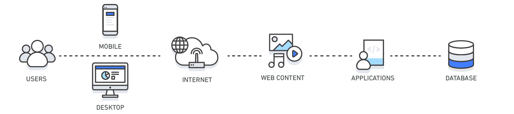

## Introduction

In computing, a cache is a high-speed data storage layer which stores a subset of data, typically transient in nature, so that future requests for that data are served up faster than is possible by accessing the data’s primary storage location.
Caching allows you to efficiently reuse previously retrieved or computed data.

The data in a cache is generally stored in fast access hardware such as RAM (Random-access memory) and may also be used in correlation with a software component.
A cache's primary purpose is to increase data retrieval performance by reducing the need to access the underlying slower storage layer.
Trading off capacity for speed, a cache typically stores a subset of data transiently, in contrast to databases whose data is usually complete and durable.

Caches can be applied and leveraged throughout various layers of technology including Operating Systems, Networking layers including Content Delivery Networks (CDN) and DNS, web applications, and Databases.
You can use caching to significantly reduce latency and improve IOPS for many read-heavy application workloads, such as Q&A portals, gaming, media sharing, and social networking.
Cached information can include the results of database queries, computationally intensive calculations, API requests/responses and web artifacts such as HTML, JavaScript, and image files.
Compute-intensive workloads that manipulate data sets, such as recommendation engines and high-performance computing simulations also benefit from an In-Memory data layer acting as a cache.
In these applications, very large data sets must be accessed in real-time across clusters of machines that can span hundreds of nodes.
Due to the speed of the underlying hardware, manipulating this data in a disk-based store is a significant bottleneck for these applications.

When implementing a cache layer, it’s important to understand the validity of the data being cached.
A successful cache results in a high hit rate which means the data was present when fetched.
A cache miss occurs when the data fetched was not present in the cache.
Controls such as TTLs (Time to live) can be applied to expire the data accordingly.
Another consideration may be whether or not the cache environment needs to be Highly Available, which can be satisfied by In-Memory engines such as Redis.
In some cases, an In-Memory layer can be used as a standalone data storage layer in contrast to caching data from a primary location.
In this scenario, it’s important to define an appropriate RTO (Recovery Time Objective--the time it takes to recover from an outage) and
RPO (Recovery Point Objective--the last point or transaction captured in the recovery) on the data resident in the In-Memory engine to determine whether or not this is suitable.
Design strategies and characteristics of different In-Memory engines can be applied to meet most RTO and RPO requirements.

| Layer        | Client-Side                                                           | DNS                                                                              | Web                                                                           | App                                                | Database                                               |
| ------------ | --------------------------------------------------------------------- | -------------------------------------------------------------------------------- | ----------------------------------------------------------------------------- | -------------------------------------------------- | ------------------------------------------------------ |
| Use Case     | Accelerate retrieval of web content from websites (browser or device) | Domain to IP ResolutionAccelerate retrieval of web content from web/app servers. | Manage Web Sessions (server side)                                             | Accelerate application performance and data access | Reduce latency associated with database query requests |
| Technologies | HTTP Cache Headers, Browsers                                          | DNS Servers                                                                      | HTTP Cache Headers, CDNs, Reverse Proxies, Web Accelerators, Key/Value Stores | Key/Value data stores, Local caches                | Database buffers, Key/Value data stores                |

### Benefits of Caching

- Improve Application Performance
  Because memory is orders of magnitude faster than disk (magnetic or SSD), reading data from in-memory cache is extremely fast (sub-millisecond).
  This significantly faster data access improves the overall performance of the application.
- Reduce Database Cost
  A single cache instance can provide hundreds of thousands of IOPS (Input/output operations per second), potentially replacing a number of database instances, thus driving the total cost down.
  This is especially significant if the primary database charges per throughput. In those cases the price savings could be dozens of percentage points.
- Reduce the Load on the Backend
  By redirecting significant parts of the read load from the backend database to the in-memory layer, caching can reduce the load on your database, and protect it from slower performance under load, or even from crashing at times of spikes.
- Predictable Performance
  A common challenge in modern applications is dealing with times of spikes in application usage. Examples include social apps during the Super Bowl or election day, eCommerce websites during Black Friday, etc.
  Increased load on the database results in higher latencies to get data, making the overall application performance unpredictable. By utilizing a high throughput in-memory cache this issue can be mitigated.
- Eliminate Database Hotspots
  In many applications, it is likely that a small subset of data, such as a celebrity profile or popular product, will be accessed more frequently than the rest.
  This can result in hot spots in your database and may require overprovisioning of database resources based on the throughput requirements for the most frequently used data.
  Storing common keys in an in-memory cache mitigates the need to overprovision while providing fast and predictable performance for the most commonly accessed data.
- Increase Read Throughput (IOPS)
  In addition to lower latency, in-memory systems also offer much higher request rates (IOPS) relative to a comparable disk-based database.
  A single instance used as a distributed side-cache can serve hundreds of thousands of requests per second.

### 缓存特征

命中率

最大空间

驱逐策略

## Where is Caching Implemented?

缓存的应用遍及整个技术领域--在各个层面和许多不同的技术栈中。

在硬件层面，缓存是 CPU 架构的一部分，例如，以 1-3 级（L1/L2/L3）缓存的形式出现。

在操作系统内核层面，有一种磁盘缓存形式被称为页面缓存。当然，还有其他形式。

对于基于网络的系统，当然有浏览器缓存和 CDN（内容分发网络）。它们分别在客户端或 CDN 端缓存常用的静态资源（图片、样式表等）。这样做的目的是减少带宽，并快速、高效、低成本的向用户提供这些资源。

不同类型的应用程序和中间件也有自己的缓存。例如，数据库使用缓存来保存经常使用的查询和经常返回的结果集。

当然，还有许多强大的软件缓存产品，如 Redis、EHCache、Memcached、Hazelcast、Infinispan 等，可以在分布式应用中实现可扩展的分布式缓存。

"分布式"高速缓存的概念也可以与"本地"或"本地化"高速缓存相比较。分布式缓存是一种分布在网络上多个设备上的缓存形式，本地缓存只存在于一台设备上。
如果有多个实例访问缓存，可能需要解决同步问题、竞争条件、数据损坏以及分布式应用带来的其他挑战。另一方面，共享缓存是一个强大的概念，可以帮助应用程序处理本地缓存（尽管更简单）无法处理的用例

分布式缓存和本地缓存都面临着一些共同的挑战。

主要挑战在于如何在保持数据新鲜度、在优化缓存失效和驱逐之间保持平衡，以及如何使缓存管理方式与特定用例相匹配。

## Caching Strategies

When you are caching data from your database, there are caching patterns for Redis and Memcached that you can implement, including proactive and reactive approaches.
The patterns you choose to implement should be directly related to your caching and application objectives.

Two common approaches are cache-aside or lazy loading (a reactive approach) and write-through (a proactive approach).
A cache-aside cache is updated after the data is requested. A write-through cache is updated immediately when the primary database is updated.
With both approaches, the application is essentially managing what data is being cached and for how long.

A proper caching strategy includes effective use of both write-through and lazy loading of your data and setting an appropriate expiration for the data to keep it relevant and lean.

<!-- tabs:start -->

### **Cache-Aside (Lazy Loading)**

A cache-aside cache is the most common caching strategy available. The fundamental data retrieval logic can be summarized as follows:

1. When your application needs to read data from the database, it checks the cache first to determine whether the data is available.
2. If the data is available (a cache hit), the cached data is returned, and the response is issued to the caller.
3. If the data isn’t available (a cache miss), the database is queried for the data.
   The cache is then populated with the data that is retrieved from the database, and the data is returned to the caller.

This approach has a couple of advantages:

- The cache contains only data that the application actually requests,whichhelpskeepthecache size cost-effective.
- Implementing this approach is straightforward and produces immediate performance gains, whether you use an application framework that encapsulates lazy caching or your own custom application logic.

A disadvantage when using cache-aside as the only caching pattern is that because the data is loaded into the cache only after a cache miss, some overhead is added to the initial response time because additional roundtrips to the cache and database are needed.

### **Write-Through**

A write-through cache reverses the order of how the cache is populated. Instead of lazy-loading the data in the cache after a cache miss, the cache is proactively updated immediately following the primary database update. The fundamental data retrieval logic can be summarized as follows:

1. The application, batch, or backend process updates the primary database.
2. Immediately afterward, the data is also updated in the cache.

The write-through pattern is almost always implemented along with lazy loading. If the application gets a cache miss because the data is not present or has expired, the lazy loading pattern is performed to update the cache.

The write-through approach has a couple of advantages:

- Because the cache is up-to-date with the primary database,there is a much greater likelihood that the data will be found in the cache.
  This, in turn, results in better overall application performance and user experience.
- The performance of your database is optimal because fewer database reads are performed.

A disadvantage of the write-through approach is that infrequently-requested data is also written to the cache, resulting in a larger and more expensive cache.

### **Write-Around**

这种策略会填充底层存储，但不会填充缓存本身。换句话说，写操作绕过缓存，只写入底层存储。这种技术与Cache-Aside有一些重叠。

不同之处在于，使用 Cache-Aside 时，重点是读取和懒加载--只有在首次从数据存储中读取数据时才将其填充到缓存中。而使用 Write-Around 缓存时，重点则是写入性能。当数据被频繁写入但不被频繁读取时，这种技术通常用于避免缓存污染。

优点

减少缓存污染，因为每次写入都不会填充缓存
缺点

如果某些记录经常被读取，性能就会受到影响，因此，如果能主动加载到缓存中，就能避免在首次读取时访问数据库。
何时使用

当写入量较大但读取量明显较小时，通常会使用这种方法。

### **Write-Back (Write-Behind)**

写操作首先填充缓存，然后写入数据存储。这里的关键是，写入数据存储是异步进行的，因此不需要两阶段的事务提交。

Write-Behind 缓存策略通常由缓存产品处理。如果缓存产品有这种机制，应用将向缓存写入内容，然后缓存产品将负责向数据库发送更改内容。如果缓存产品不支持这种机制，应用程序本身将触发对数据库的异步更新。

优点

写入速度更快，因为系统只需在初始事务中写入缓存。数据库将在稍后时间更新。
如果流量由缓存产品处理，那么应用逻辑的复杂性就会降低。

缺点

在数据库接收到新更改之前，数据库和高速缓存可能会不同步，因此可能会出现不一致。
当缓存最终尝试更新数据库时，可能会出现错误。如果出现这种情况，就需要有更复杂的机制来确保数据库接收到最新的数据。

何时使用

当写入性能非常重要，而且数据库中的数据与缓存中的数据暂时稍有不同步是可以接受的时候，就可以使用回写缓存。适用于写入量大但一致性要求不那么严格的应用。例如，CDN（内容分发网络）可用于快速更新缓存内容，然后将其同步到记录系统。

### **Read-Through**

直读缓存在某种意义上类似于旁路缓存模式，因为在这两种模式中，缓存都是我们首先查找记录的地方。如果缓存未命中，就会在数据库中查找。不过，在旁路缓存模式中，查询缓存和数据库的责任都落在了应用程序身上，而在直读缓存中，这一责任则落在了缓存产品身上（如果它有这种机制的话）。

优点

简单--所有逻辑都封装在缓存应用程序中
缺点

缓存缺失时从数据库读取数据的潜在延迟。需要复杂的数据更新失效机制。
何时使用

当你想简化访问数据的代码时，就会使用直读缓存。此外，当你想确保缓存始终包含来自数据存储的最新数据时，也可以使用直读缓存。这对于读取数据比写入数据更频繁的应用程序非常有用。但这里的关键点是，缓存产品应该能够通过配置或本地方式从底层记录系统中执行读取操作。

<!-- tabs:end -->

### Summary of Caching Strategies

| 缓存策略          | 策略概述             | 负责DB操作    | 应用场景                    |
|---------------|------------------|-----------|-------------------------|
| Cache-Aside   | 只在需要读缓存时从DB获取来更新 | 应用程序      | 按需缓存产品详细信息场景            |
| Write-Through | 写操作同时DB和缓存       | 缓存产品或应用程序 | 较强一致性要求 如银行系统           |
| Write-Around  | 直接写DB 绕过缓存       |      应用程序     | 日志操作 无需缓存               |
| Write-Back    | 先写缓存 异步写入到存储     | 缓存产品或应用程序 | CDN 先更新缓存中的内容，然后同步到存储系统 |
| Read-Through  | 主要读缓存 缺失则从存储系统加载 |    缓存产品或应用程序       |    用户配置文件服务在缓存缺失时获取和缓存用户数据  |

## 缓存失效

缓存策略与如何从缓存中加载和检索数据有关，而缓存失效则更多的与记录系统和缓存之间的数据一致性和新鲜度有关。

因此，这两个概念之间存在一些重叠，对于某些缓存策略来说，失效比其他策略更简单。例如，使用"通过缓存写入"方法时，缓存会在每次写入时更新，因此无需额外实现。但是，删除可能不会被反映，因此可能需要应用逻辑来显式处理。

You can control the freshness of your cached data by applying a time to live (TTL) or expiration to your cached keys.
After the set time has passed, the key is deleted from the cache, and access to the origin data store is required along with reaching the updated data.

Two principles can help you determine the appropriate TTLs to apply and the types of caching patterns to implement.
First, it’s important that you understand the rate of change of the underlying data.
Second, it’s important that you evaluate the risk of outdated data being returned back to your application instead of its updated counterpart.

For example, it might make sense to keep static or reference data (that is, data that is seldom updated) valid for longer periods of time with write-throughs to the cache when the underlying data gets updated.
With dynamic data that changes often, you might want to apply lower TTLs that expire the data at a rate of change that matches that of the primary database.
This lowers the risk of returning outdated data while still providing a buffer to offload database requests.

It’s also important to recognize that, even if you are only caching data for minutes or seconds versus longer durations, appropriately applying TTLs to your cached keys can result in a huge performance boost and an overall better user experience with your application.

Another best practice when applying TTLs to your cache keys is to add some time jitter to your TTLs.
This reduces the possibility of heavy database load occurring when your cached data expires.
Take, for example, the scenario of caching product information.
If all your product data expires at the same time and your application is under heavy load, then your backend database has to fulfill all the product requests.
Depending on the load, that could generate too much pressure on your database, resulting in poor performance.
By adding slight jitter to your TTLs, a randomly-generated time value (for example, TTL = your initial TTL value in seconds + jitter) would reduce the pressure on your backend database and also reduce the CPU use on your cache engine as a result of deleting expired keys.

## 缓存驱逐

缓存驱逐与缓存失效类似，都是删除旧的缓存记录。但两者区别在于，当缓存已满，无法再容纳任何记录时，就需要进行缓存驱逐。

Evictions occur when cache memory is overfilled or is greater than the maxmemory setting for the cache, causing the engine selecting keys to evict in order to manage its memory. The keys that are chosen are based on the eviction policy you select.

从系统设计的角度来说，过期之类的机制可以考虑使用四种思路来实现。

- 定时删除：是指针对每一个需要被删除的对象启动一个计时器，到期之后直接删除
- 延迟队列：也就是把对象放到一个延迟队列里面。当从队列里取出这个对象的时候，就说明它已经过期了，这时候就可以删除。
- 懒惰删除：是指每次要使用对象的时候，检查一下这个对象是不是已经过期了。如果已经过期了，那么直接删除。
- 定期删除：是指每隔一段时间就遍历对象，找到已经过期的对象删除掉。针对这四种思路的优缺点，你可以参考下面的表格。

### Eviction policy

The following table summarizes eviction policies:

| Eviction Policy | Description | 适用场景                                       |
|----------|------------|--------------------------------------------|
| LRU             |            | 非常适合通用缓存                                   |
| FIFO            |            | 适用于缓存可预测使用时间的数据                            |
| LFU             |            | 适用于具有稳定访问模式 长期频繁访问数据的应用程序  访问模式会显著变化场景不适用  |
| TTL             |            | 不适用于有效性不会随时间自然失效的数据，以及基于其他因素需要无限期保留在缓存中的数据 |
| Random          |            | 当访问模式不可预测 其它模式都不适用时                        |

A good strategy in selecting an appropriate eviction policy is to consider the data stored in your cluster and the outcome of keys being evicted.
Generally, least recently used (LRU)-based policies are more common for basic caching use cases.
However, depending on your objectives, you might want to use a TTL or random-based eviction policy that better suits your requirements.

Also, if you are experiencing evictions with your cluster, it is usually a sign that you should scale up (that is, use a node with a larger memory footprint) or scale out (that is, add more nodes to your cluster) to accommodate the additional data.
An exception to this rule is if you are purposefully relying on the cache engine to manage your keys by means of eviction, also referred to an LRU cache.

## CPU Caching

[CPU Caching](/docs/CS/CO/Cache.md)

## Memory Caching

Memory caching (often simply referred to as caching) is a technique in which computer applications temporarily store data in a computer’s main memory (i.e., random access memory, or RAM) to enable fast retrievals of that data.
The RAM that is used for the temporary storage is known as the cache.
Since accessing RAM is significantly faster than accessing other media like hard disk drives or networks, caching helps applications run faster due to faster access to data.
Caching is especially efficient when the application exhibits a common pattern in which it repeatedly accesses data that was previously accessed.
Caching is also useful to store data calculations that are otherwise time-consuming to compute. By storing the calculations in a cache, the system saves time by avoiding the repetition of the calculation.

## CDN

When your web traffic is geo-dispersed, it’s not always feasible and certainly not cost effective to replicate your entire infrastructure across the globe.
A CDN provides you the ability to utilize its global network of edge locations to deliver a cached copy of web content such as videos, webpages, images and so on to your customers.
To reduce response time, the CDN utilizes the nearest edge location to the customer or originating request location in order to reduce the response time.
Throughput is dramatically increased given that the web assets are delivered from cache. For dynamic data, many CDNs can be configured to retrieve data from the origin servers.

## Domain Name System (DNS) Caching

Every domain request made on the internet essentially queries DNS cache servers in order to resolve the IP address associated with the domain name.
DNS caching can occur on many levels including on the OS, via ISPs and DNS servers.

## Client Caching

When delivering web content to your viewers, much of the latency involved with retrieving web assets such as images, html documents, video, etc. can be greatly reduced by caching those artifacts and eliminating disk reads and server load.
Various web caching techniques can be employed both on the server and on the client side.
Server side web caching typically involves utilizing a web proxy which retains web responses from the web servers it sits in front of, effectively reducing their load and latency.
Client side web caching can include browser based caching which retains a cached version of the previously visited web content.

页面缓存

- 某些元素缓存
- 静态页面缓存

Browser缓存 基于HTTP header控制

## App Cache

Android

- ASimpleCache
- 自定义缓存设置

ios:

- SDWebImage NsCache

## Application Cache

[JCache](/docs/CS/Java/JCache.md)

Guava Cache

Caffeine

本地缓存更适合存储一些变化频率极低，数据量较小的场景，诸如基础数据、配置了类型的数据缓存等

## Database Cache

A database cache supplements your primary database by removing unnecessary pressure on it, typically in the form of frequently-accessed read data.
The cache itself can live in several areas, including in your database, in the application, or as a standalone layer.
The following are the three most common types of database caches:

- Database-integrated caches
  Some databases, such as Amazon Aurora, offer an integrated cache that is managed within the database engine and has built-in write-through capabilities.
  The database updates its cache automatically when the underlying data changes. Nothing in the application tier is required to use this cache.
  The downside of integrated caches is their size and capabilities. Integrated caches are typically limited to the available memory that is allocated to the cache by the database instance and can’t be used for other purposes, such as sharing data with other instances.
- Local caches
  A local cache stores your frequently-used data within your application.
  This makes data retrieval faster than with other caching architectures because it removes network traffic that is associated with retrieving data.
  A major disadvantage is that among your applications, each node has its own resident cache working in a disconnected manner.
  The information that is stored in an individual cache node (whether it’s cached database rows, web content, or session data) can’t be shared with other local caches.
  This creates challenges in a distributed environment where information sharing is critical to support scalable dynamic environments.
  Because most applications use multiple application servers, coordinating the values across them becomes a major challenge if each server has its own cache.
  In addition, when outages occur, the data in the local cache is lost and must be rehydrated, which effectively negates the cache.
  The majority of these disadvantages are mitigated with remote caches.
- Remote caches
  A remote cache (or side cache) is a separate instance (or separate instances) dedicated for storing the cached data in-memory.
  Remote caches are stored on dedicated servers and are typically built on key/ value NoSQL stores, such as [Redis](/docs/CS/DB/Redis/Redis.md) and [Memcached](/docs/CS/DB/Memcached.md).
  They provide hundreds of thousands of requests (and up to a million) per second per cache node.
  The average latency of a request to a remote cache is on the sub-millisecond timescale, which, in the order of magnitude, is faster than a request to a disk-based database.
  At these speeds, local caches are seldom necessary.
  Remote caches are ideal for distributed environments because they work as a connected cluster that all your disparate systems can utilize.
  However, when network latency is a concern, you can apply a two-tier caching strategy that uses a local and remote cache together.
  It’s typically used only when needed because of the complexity it adds.
  With remote caches, the orchestration between caching the data and managing the validity of the data is managed by your applications and/or processes that use it.
  The cache itself is not directly connected to the database but is used adjacently to it.

MySQL query cache

### Relational Database Caching Techniques

#### Cache ResultSet

The basic paradigm when you query data from a relational database includes executing SQL statements and iterating over the returned ResultSet object cursor to retrieve the database rows.
There are several techniques you can apply when you want to cache the returned data.
However, it’s best to choose a method that simplifies your data access pattern and/or optimizes the architectural goals that you have for your application.

Iterating over the ResultSet cursor lets you retrieve the fields and values from the database rows. From that point, the application can choose where and how to use that data.

Cache a serialized ResultSet object that contains the fetched database row.

- Advantage:Whendataretrievallogicisabstracted(forexample,asinaDataAccessObjectorDAO layer), the consuming code expects only a ResultSet object and does not need to be made aware of its origination.
  A ResultSet object can be iterated over, regardless of whether it originated from the database or was deserialized from the cache, which greatly reduces integration logic.
  This pattern can be applied to any relational database.
- Disadvantage:DataretrievalstillrequiresextractingvaluesfromtheResultSetobjectcursoranddoes not further simplify data access; it only reduces data retrieval latency.

Note: When you cache the row, it’s important that it’s serializable. The following example uses a CachedRowSet implementation for this purpose. When you are using Redis, this is stored as a byte array value.

The following code converts the CachedRowSet object into a byte array and then stores that byte array as a Redis byte array value. The actual SQL statement is stored as the key and converted into bytes.

One advantage of storing the SQL statement as the key is that it enables a transparent caching abstraction layer that hides the implementation details.
The other added benefit is that you don’t need to create any additional mappings between a custom key ID and the executed SQL statement.
At the time of setting data in the Redis, you are applying the expiry time, which is specified in milliseconds.
For lazy caching/cache aside, you would initially query the cache before executing the query against the database. To hide the implementation details, use the DAO pattern and expose a generic method for your application to retrieve the data.

Assuming that your application framework can’t be used to abstract your caching implementation, how do you best cache the returned database data?

For all other caching techniques that we’ll review, you should establish a naming convention for your Redis keys.
A good naming convention is one that is easily predictable to applications and developers. A hierarchical structure separated by colons is a common naming convention for keys, such as object:type:id.

#### Select Fields

Cache a subset of a fetched database row into a custom structure that can be consumed by your applications.

- Advantage: This approach is easy to implement.
  You essentially store specific retrieved fields and values into a structure such as JSON or XML and then SET that structure into a Redis string.
  The format you choose should be something that conforms to your application’s data access pattern.
- Disadvantage: Your application is using different types of objects when querying for particular data (for example, Redis string and database results).
  In addition, you are required to parse through the entire structure to retrieve the individual attributes associated with it.

##### Aggregate Structures

Cache the fetched database row into a specific data structure that can simplify the application’s data access.

- Advantage: When converting the ResultSet object into a format that simplifies access, such as a Redis Hash, your application is able to use that data more effectively.
  This technique simplifies your data access pattern by reducing the need to iterate over a ResultSet object or by parsing a structure like a JSON object stored in a string.
  In addition, working with aggregate data structures, such as Redis Lists, Sets, and Hashes provides various attribute level commands associated with setting and getting data, and eliminating the overhead associated with processing the data before being able to leverage it.
- Disadvantage: Your application is using different types of objects when querying for particular data (for example, Redis Hash and database results).

Unlike JSON, the added benefit of storing your data as a hash in Redis is that you can query for individual attributes within it.
Say that for a given request you only want to respond with specific attributes associated with the customer Hash, such as the customer name and address.
This flexibility is supported in Redis, along with various other features, such as adding and deleting individual attributes in a map.

#### Cache Serialized Application Object Entities

Cache a subset of a fetched database row into a custom structure that can be consumed by your applications.

- Pro: Use application objects in their native application state with simple serializing and deserializing techniques. This can rapidly accelerate application performance by minimizing data transformation logic.
- Con: Advanced application development use case.

## Distributed Cache

|           | 基于内存 | 数据结构        | 持久化       | 线程模型               |
| --------- |------|-------------|-----------|--------------------|
| Redis     | 是    | List Set等多种 | 有         | Redis6.0以后网络I/O多线程 |
| Memcached | 是    | 只有K/V       | 无 不支持灾难恢复 | 多线程                |

## 缓存一致性

大多数情况下都是最终一致性 要实现强一致性需要有分布式锁的设计 或者队列处理 降低性能

Cache-Aside下:

通常先更新DB 再删除缓存 如果删除缓存失败 可以将事件发送给MQ 进行异步重试删除
- 极端场景下此时缓存过期 其它请求会从DB获取旧数据 在删除缓存之后更新缓存 存在数据不一致事件窗口 stale 最大要等到缓存过期  概率非常低
- 删除缓存动作可能会失败
需要订阅MQ重试再在缓存过期时间内删除一次缓存 减少不一致窗口

还有应用只更新DB 由canal订阅DB binlog 搭配MQ 由单独的服务进行更新缓存

另外还有:

先删除缓存 再更新DB的 因为DB操作事件较缓存操作时间更长 存在其它请求读取DB过期数据  时间窗口较大 需要再删除一次缓存

多级缓存一致性

本地缓存 订阅MQ广播缓存更新的消息

## Cache Issues

Cache Penetration, Cache Breakdown, Cache Avalanche

### Cache Penetration

Cache penetration refers to querying a certain non-existent data, because the cache is written when it hits, and in fault-tolerant consideration, if the data can not be found from the storage layer,
it will not write to the cache, which will lead to the non-existent data every request to the storage layer to query, losing the meaning of the cache.

When traffic is high, DB may hang up. If someone attacks our application frequently by using nonexistent keys, this is a vulnerability.

对请求进行前置校验 过载保护

Solution

- Intercept through a Bloom filter.
- Empty results are cached, but the expiration time is very short, not more than 5 minutes.

### Cache Avalanche

Cache avalanche refers to an avalanche in which the same expiration time is used to set the cache, which causes the cache to fail at the same time at a certain time, and all requests are forwarded to DB.
DB is under excessive instantaneous pressure.

Solution

- Synchronization or queuing is used to ensure that the cache is written in a single thread, thus avoiding the large number of concurrent requests falling on the underlying storage system when failures occur.
- Add a random value to the cache’s expiration time, such as 1-5 minutes.

### Cache Breakdown

For some keys with expiration time, if these keys may be accessed concurrently at some point in time, it is a very “hot” data.

When the cache expires at a certain point, there are a lot of concurrent requests for this key just at this point.
These requests find that cache expiration usually loads data from the back end and sets it back to the cache.
At this time, large concurrent requests may overwhelm the back-end DB instantaneously.

Solution

- [Circular Breaker](/docs/CS/SE/CircuitBreaker.md)

Avoid too many requests accessing DataBases.

收集缓存监控信息 流处理如Flink判断是否是hot key 再通过监控系统通知到应用做处理 缓存集群需要查看是否均匀

Redis里可以使用zset取最近访问的一定数量的请求ip zrang排序发现热点

## Tuning

优化过期时间有两个方向。第一个是调大过期时间，提高缓存命中率，并提高性能。

最简单的做法就是使用定时器，但是定时器本身开销太大，还得考虑在更新过期时间的时候重置定时器。另外一种思路就是使用延迟队列，但是延迟队列本身开销也很大，修改过期时间也要调整延迟队列，还要引入大量的并发控制。 综合来看，并不值得。而定期删除和懒惰删除的策略虽然看上去可能浪费内存，但是这个浪费很少，并且对响应时间也没那么大的影响。

Redis 会在每一个循环中遍历 DB。如果当次定期删除循环没有遍历完全部 DB，那么下一个循环就会从当次最后遍历的 DB 的下一个继续遍历下去。

针对每一个 DB，都会有这样一个步骤。
如果 DB 里存放的 key 都没有设置过期时间，那么遍历下一个 DB。从设置了过期时间的 key 中抽一批，默认一批是 25 个。逐个检查这些 key。如果这个 key 已经过期了，那么执行删除操作。每遍历 16 个 key，就检测执行时间。如果执行时间已经超过了阈值，那么就中断这一次定期删除循环。如果这一批过期的 key 比例超过一个阈值，那么就抽取下一批 key 来检查，这个阈值也是可以通过参数来控制的。

从库上的懒惰删除特性和主库不一样。主库上的懒惰删除是在发现 key 已经过期之后，就直接删除了。但是在从库上，即便 key 已经过期了，它也不会删除，只是会给你返回一个 NULL 值。

RDB 简单来说就是快照文件，也就是当 Redis 执行 SAVE 或者 BGSAVE 命令的时候，就会把内存里的所有数据都写入 RDB 文件里。后续主库可以载入这个文件来恢复数据，从库也可以利用这个文件来完成数据同步。对于 RDB 来说，一句话总结就是主库不读不写，从库原封不动。也就是说，在生成 RDB 的时候，主库会忽略已经过期的 key。在主库加载 RDB 的时候，也会忽略 RDB 中已经过期的 key。而从库则是整个 RDB 都加载进来，因为从库在加载完 RDB 之后，很快就能从主库里面收到删除的指令，从而删除这个过期的 key。AOF 是之前我们就提到过的 Append Only File。Redis 用这个文件来逐条记录执行的修改数据的命令。不管 Redis 是定期删除，还是懒惰删除过期 key，Redis 都会记录一条 DEL 命令。

我们这节课还重点解决了 Redis 中和过期时间有关的问题，分别是：Redis 具体是怎么处理过期 key 的？懒惰删除加定期删除。Redis 为什么不立刻删除？实现立刻删除的代价太高。Redis 是怎么控制定期删除的开销的？总的来说是控制执行时间。怎么控制 Redis 的定期删除频率？通过 hz 参数和 dynamic-hz 参数控制。从库是怎么处理过期 key 的？查询返回 NULL，删除等主库命令。Redis 持久化怎么处理过期 key？对于 RDB 来说，主库不读不写，从库原封不动。对于 AOF 来说，正常追加 DEL 命令，重写则是不管。

## Links

## References

1. [Wiki - Cache (computing)](https://en.wikipedia.org/wiki/Cache_(computing))
2. [A Guide To Caching in Spring](https://www.baeldung.com/spring-cache-tutorial)
3. [缓存那些事 - 美团技术团队](https://tech.meituan.com/2017/03/17/cache-about.html)
4. [Thundering Herds & Promises](https://instagram-engineering.com/thundering-herds-promises-82191c8af57d)
5. [Mastering Caching in Distributed Applications](https://readmedium.com/mastering-caching-in-distributed-applications-e7449f4db399)
6. [The LRU-K Page Replacement Algorithm For Database Disk Buffering](http://www.cs.cmu.edu/~christos/courses/721-resources/p297-o_neil.pdf)
7. [X3: A Low Overhead High Performance Buffer Management Replacement Algorithm](https://www.vldb.org/conf/1994/P439.PDF)
8. [Scaling Memcache at Facebook](https://css.csail.mit.edu/6.824/2014/papers/memcache-fb.pdf)
9. [缓存数据一致性探究](https://mp.weixin.qq.com/s/OWuP66WxpciBAgm2mptUxw)
10. [技术派中的缓存一致性解决方案](https://mp.weixin.qq.com/s/UHANeIKe7YADZzuBKcqdgA)
