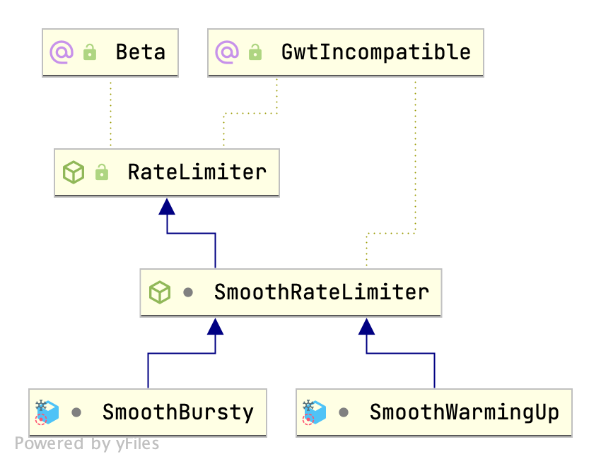

## Introduction

限流是软件系统中用于控制传入请求速率的重要技术。
它通过限制在给定时间范围内可以发出的请求数量来帮助防止服务器过载。

限流有助于防止 DoS 攻击导致的资源枯竭。
限流可以通过防止资源过度使用来帮助限制成本超支。

大多数限流实现共享三个核心概念。
它们是 limit、window 和 identifier。

## Algorithms

限流使用多种算法，包括：

- Token bucket（令牌桶）
- Leaky bucket（漏桶）
- Fixed window counter（固定窗口计数器）
- Sliding window log（滑动窗口日志）
- Sliding window counter（滑动窗口计数器）

### Counter

最大连接数


#### Semaphore

```java
Semaphore semaphore = new Semaphore(10);
for (int i = 0; i < 100; i++) {
    executor.submit(new Runnable() {
        @Override
        public void run() {
            semaphore.acquireUninterruptibly(1);
            try {
                doSomething();
            } finally {
                semaphore.release();
            }
        }
    });
}
```

### Fixed Window Counter

### Sliding Window Logs

限流的另一种方法是使用滑动窗口日志。
这种数据结构涉及一个**固定大小**的"窗口"，沿着事件时间线滑动，存储任意给定时刻落在窗口内的事件信息。

这种限流方式在带时间戳的日志中跟踪每个客户端的请求。
这些日志通常存储在按时间排序的哈希集或表中。

滑动窗口日志算法可以通过以下步骤实现：

- 为每个发出请求的客户端维护最近窗口时间范围内时间戳的时间排序队列或哈希表。
- 当队列达到一定长度或经过一定时间后，每当有新请求到来时，检查是否有任何早于当前窗口时间的时间戳。
- 用传入请求的新时间戳更新队列，如果队列中的元素数不超过授权计数，则继续处理，否则触发异常。


时间精度越高 花费越高

### Sliding Window Counters

滑动窗口计数器算法是对滑动窗口日志的优化。如前一种方法所示，内存使用量很高。例如，要管理大量用户或长窗口时间范围，必须为窗口时间保留所有请求时间戳，最终占用大量内存。此外，删除大量早于特定时间范围的时间戳也意味着较高的时间复杂度。

为了减少流量突发，此算法根据时间范围计算前一个窗口’s request based on timeframe. If we have a one-minute rate limit, we can record the counter for each second and calculate the sum of all counters in the previous minute whenever we get a new request to determine the throttling limit.

The sliding window counters can be separated into the following concepts:

- Remove all counters which are more than 1 minute old.
- If a request comes which falls in the current bucket, the counter is increased.
- If a request comes when the current bucket has reached it’s throat limit, the request is blocked.

### Leaky Bucket

它基于这样的思想：如果倒水的平均速率超过桶泄漏的速率，桶将溢出。

**漏桶以固定速率排空。
每个传入请求增加桶的深度，如果桶溢出，则拒绝请求。**

实现此方法的一种方式是使用队列，该队列对应于包含传入请求的桶。
每当有新请求时，将其添加到队列末尾。如果队列在任何时候已满，则丢弃额外的请求。

漏桶算法可以分解为以下概念：

- 用固定深度和泄漏速率初始化漏桶。
- 对于每个请求，增加桶的深度。
- 如果桶的深度超过其容量，拒绝请求。
- 以固定速率泄漏桶。

### Token Bucket

令牌桶算法以固定速率向"桶"中分配令牌。
每个请求从桶中消耗一个令牌，只有当有足够的令牌可用时才允许请求。
未使用的令牌存储在桶中，最多达到最大容量。
该算法提供了一种简单灵活的方法来控制请求速率并平滑流量突发。

令牌桶算法的概念理解如下：

每 $1/r$ 秒向桶中添加一个令牌。
桶最多可以容纳 b 个令牌。如果令牌到达时桶已满，则丢弃该令牌。
当 n 字节的数据包到达时，
如果桶中至少有 n 个令牌，则从桶中移除 n 个令牌，并将数据包发送到网络。
如果可用令牌少于 n 个，则不从桶中移除令牌，该数据包被视为不符合要求。


guava `RateLimiter` has two child class `SmoothBursty` and `SmoothWarmingUp` in `SmoothRateLimiter`.

- 令牌会累积 获取频率较低时可无需等待
- 累积令牌可应对突发流量
- 令牌不足时 前一个请求等待时间由后一个承受 第一次请求无须等待


#### Guava RateLimiter


```java
import com.google.common.util.concurrent.RateLimiter;

public class RateLimiterDemo {
    public static void main(String[] args) {
        // 创建一个每秒放入5个令牌的RateLimiter
        RateLimiter limiter = RateLimiter.create(5.0);

        for (int i = 0; i < 10; i++) {
            // 请求一个令牌
            limiter.acquire();
            System.out.println("处理请求: " + i);
        }
    }
}
```


```java
// RateLimiter
/**
 * The underlying timer; used both to measure elapsed time and sleep as necessary. A separate
 * object to facilitate testing.
 */
private final SleepingStopwatch stopwatch;

// Can't be initialized in the constructor because mocks don't call the constructor.
private volatile @Nullable Object mutexDoNotUseDirectly;

// init mutexDoNotUseDirectly
private Object mutex() {
  Object mutex = mutexDoNotUseDirectly;
  if (mutex == null) {
    synchronized (this) {
      mutex = mutexDoNotUseDirectly;
      if (mutex == null) {
        mutexDoNotUseDirectly = mutex = new Object();
      }
    }
  }
  return mutex;
}
```

<div style="text-align: center;">



</div>

<p style="text-align: center;">Fig.1. Guava RateLimiter</p>

RateLimiter提供了两种模式：SmoothBursty和SmoothWarmingUp

- SmoothBursty：这种模式适合于突发请求较多的场景。它允许在短时间内处理大量请求，然后速率会逐渐下降到稳定状态
- SmoothWarmingUp：这个模式适用于需要预热的场景。它会在启动时逐渐增加发放令牌的速率，直到达到稳定状态。这对于那些刚开始时资源较少但随后需要稳定运行的系统很有用


```java
// SmoothRateLimiter

/** The currently stored permits. */
double storedPermits;

/** The maximum number of stored permits. */
double maxPermits;

/**
 * The interval between two unit requests, at our stable rate. E.g., a stable rate of 5 permits
 * per second has a stable interval of 200ms.
 */
double stableIntervalMicros;

/**
 * The time when the next request (no matter its size) will be granted. After granting a request,
 * this is pushed further in the future. Large requests push this further than small requests.
 */
private long nextFreeTicketMicros = 0L; // could be either in the past or future
```


##### SmoothBursty

Default cache permits of 1 second

```java
// SmoothRateLimiter
static RateLimiter create(double permitsPerSecond, SleepingStopwatch stopwatch) {
  //only save up permits of 1 second if unsed 
  RateLimiter rateLimiter = new SmoothBursty(stopwatch, 1.0);
  rateLimiter.setRate(permitsPerSecond);
  return rateLimiter;
}

// RateLimiter
public final void setRate(double permitsPerSecond) {
  // check rate permitsPerSecond be positive
  synchronized (mutex()) {
    doSetRate(permitsPerSecond, stopwatch.readMicros());
  }
}

// SmoothRateLimiter
final void doSetRate(double permitsPerSecond, long nowMicros) {
  resync(nowMicros);
  double stableIntervalMicros = SECONDS.toMicros(1L) / permitsPerSecond;
  this.stableIntervalMicros = stableIntervalMicros;
  doSetRate(permitsPerSecond, stableIntervalMicros);
}

// SmoothRateLimiter
/** Updates storedPermits and nextFreeTicketMicros based on the current time. */
void resync(long nowMicros) {
  // if nextFreeTicket is in the past, resync to now
  if (nowMicros > nextFreeTicketMicros) {
    double newPermits = (nowMicros - nextFreeTicketMicros) / coolDownIntervalMicros();
    storedPermits = min(maxPermits, storedPermits + newPermits);
    nextFreeTicketMicros = nowMicros;
  }
}

// SmoothBursty
void doSetRate(double permitsPerSecond, double stableIntervalMicros) {
  double oldMaxPermits = this.maxPermits;
  maxPermits = maxBurstSeconds * permitsPerSecond;
  if (oldMaxPermits == Double.POSITIVE_INFINITY) {
    // if we don't special-case this, we would get storedPermits == NaN, below
    storedPermits = maxPermits;
  } else {
    storedPermits =
        (oldMaxPermits == 0.0)
            ? 0.0 // initial state
            : storedPermits * maxPermits / oldMaxPermits;
  }
}
```


```java
// SmoothBursty
@Override
long storedPermitsToWaitTime(double storedPermits, double permitsToTake) {
  return 0L;
}
```

##### acquire

```java
@CanIgnoreReturnValue
public double acquire(int permits) {
  long microsToWait = reserve(permits);
  stopwatch.sleepMicrosUninterruptibly(microsToWait);
  return 1.0 * microsToWait / SECONDS.toMicros(1L);
}

final long reserve(int permits) {
    synchronized (mutex()) {
      return reserveAndGetWaitLength(permits, stopwatch.readMicros());
    }
}

final long reserveAndGetWaitLength(int permits, long nowMicros) {
    long momentAvailable = reserveEarliestAvailable(permits, nowMicros);
    return max(momentAvailable - nowMicros, 0);
}

final long reserveEarliestAvailable(int requiredPermits, long nowMicros) {
  resync(nowMicros);//Updates storedPermits and nextFreeTicketMicros based on the current time
  long returnValue = nextFreeTicketMicros;
  double storedPermitsToSpend = min(requiredPermits, this.storedPermits);
  double freshPermits = requiredPermits - storedPermitsToSpend;
  //waitMicors = (requiredPermits - storedPermitsToSpend) * stableIntervalMicros
  long waitMicros =	
      storedPermitsToWaitTime(this.storedPermits, storedPermitsToSpend)
          + (long) (freshPermits * stableIntervalMicros);

  this.nextFreeTicketMicros = LongMath.saturatedAdd(nextFreeTicketMicros, waitMicros);
  this.storedPermits -= storedPermitsToSpend;
  return returnValue;
}
```


```java
public boolean tryAcquire(int permits, long timeout, TimeUnit unit) {
    long timeoutMicros = Math.max(unit.toMicros(timeout), 0L);
    checkPermits(permits);
    long microsToWait;
    synchronized(this.mutex()) {
        long nowMicros = this.stopwatch.readMicros();
        if (!this.canAcquire(nowMicros, timeoutMicros)) {
            return false;
        }
        microsToWait = this.reserveAndGetWaitLength(permits, nowMicros);
    }

    this.stopwatch.sleepMicrosUninterruptibly(microsToWait);
    return true;
}
```


##### SmoothWarmingUp


coldFactor always = 3

```java
public static RateLimiter create(double permitsPerSecond, long warmupPeriod, TimeUnit unit) {
  checkArgument(warmupPeriod >= 0, "warmupPeriod must not be negative: %s", warmupPeriod);
  return create(
      permitsPerSecond, warmupPeriod, unit, 3.0, SleepingStopwatch.createFromSystemTimer());
}

@VisibleForTesting
static RateLimiter create(
    double permitsPerSecond,
    long warmupPeriod,
    TimeUnit unit,
    double coldFactor,
    SleepingStopwatch stopwatch) {
  RateLimiter rateLimiter = new SmoothWarmingUp(stopwatch, warmupPeriod, unit, coldFactor);
  rateLimiter.setRate(permitsPerSecond);
  return rateLimiter;
}
```


```java
@Override
void doSetRate(double permitsPerSecond, double stableIntervalMicros) {
  double oldMaxPermits = maxPermits;
  double coldIntervalMicros = stableIntervalMicros * coldFactor;
  thresholdPermits = 0.5 * warmupPeriodMicros / stableIntervalMicros;
  maxPermits =
      thresholdPermits + 2.0 * warmupPeriodMicros / (stableIntervalMicros + coldIntervalMicros);
  slope = (coldIntervalMicros - stableIntervalMicros) / (maxPermits - thresholdPermits);
  if (oldMaxPermits == Double.POSITIVE_INFINITY) {
    // if we don't special-case this, we would get storedPermits == NaN, below
    storedPermits = 0.0;
  } else {
    storedPermits =
        (oldMaxPermits == 0.0)
            ? maxPermits // initial state is cold
            : storedPermits * maxPermits / oldMaxPermits;
  }
}
```


```java
@Override
long storedPermitsToWaitTime(double storedPermits, double permitsToTake) {
  double availablePermitsAboveThreshold = storedPermits - thresholdPermits;
  long micros = 0;
  // measuring the integral on the right part of the function (the climbing line)
  if (availablePermitsAboveThreshold > 0.0) {
    double permitsAboveThresholdToTake = min(availablePermitsAboveThreshold, permitsToTake);
    // TODO(cpovirk): Figure out a good name for this variable.
    double length =
        permitsToTime(availablePermitsAboveThreshold)
            + permitsToTime(availablePermitsAboveThreshold - permitsAboveThresholdToTake);
    micros = (long) (permitsAboveThresholdToTake * length / 2.0);
    permitsToTake -= permitsAboveThresholdToTake;
  }
  // measuring the integral on the left part of the function (the horizontal line)
  micros += (long) (stableIntervalMicros * permitsToTake);
  return micros;
}
```


分布式

Redis+Lua

Nginx+Lua

Sentinel


## Distributed

分布式限流涉及将限流分布到系统的多个节点或实例上，以处理高流量负载并提高可扩展性。一致性哈希、令牌传递或分布式缓存等技术用于协调节点间的限流。


Sentinel


Hystrix


### Redis


## Links

## References

1. [Rate Limiting Fundamentals](https://blog.bytebytego.com/p/rate-limiting-fundamentals)