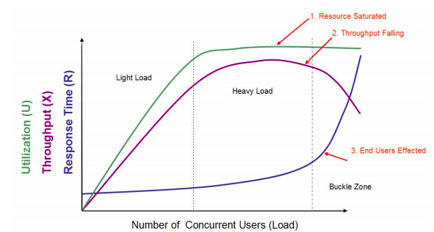

## Introduction

Stress testing is a software testing activity that determines the robustness of software by testing beyond the limits of normal operation. 
Stress testing is particularly important for "mission critical" software, but is used for all types of software. 
Stress tests commonly put a greater emphasis on robustness, availability, and error handling under a heavy load,
than on what would be considered correct behavior under normal circumstances.

指标
- RT
- Throughput TPS QPS
- 资源利用率 CPU 内存 磁盘 负载 网络IO
- 并发用户数
- 错误率

Fig.1. 

在这个图中，定义了三条曲线、三个区域、两个点以及三个状态描述。

- 三条曲线：吞吐量的曲线（紫色）、利用率（绿色）、响应时间曲线（深蓝色）。
- 三个区域：轻负载区（Light Load）、重负载区（Heavy Load）、塌陷区（Buckle Zone）。
- 两个点：最优并发用户数（The Optimum Number of Concurrent Users）、最大并发用户数（The Maximum Number of Concurrent Users）。
- 三个状态描述：资源饱和（Resource Saturated）、吞吐下降（Throughput Falling）、用户受影响（End Users Effected）

首先，很多时候，重负载区的资源饱和，和 TPS 达到最大值之间都不是在同样的并发用户数之下的。比如说，当 CPU 资源使用率达到 100% 之后，随着压力的增加，队列慢慢变长，响应时间增加，但是由于用户数增加的幅度大于响应时间增加的幅度之前，TPS 仍然会增加，也就是说资源使用率达到饱和之后还有一段时间 TPS 才会达到上限。
大部分情况下，响应时间的曲线都不会像图中画得这样陡峭，并且也不一定是在塌陷区突然上升，更可能的是在重负载区突然上升。
另外，吞吐量曲线不一定会出现下降的情况，在有些控制较好的系统中会维持水平。

压测工具

JMeter

分布式压测

## Links
