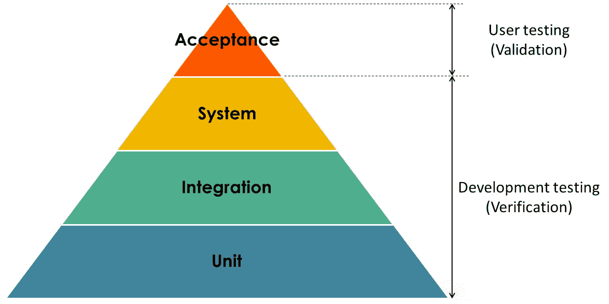

## Introduction

测试是用可重复、可自动判断的方式验证软件行为是否符合预期的活动。它的目标不是"证明没有 bug"（不可达），而是**让变更可承受**：有测试网兜底，重构和升级才敢做。测试设计的核心问题是在成本、速度与保真度之间分配资源——这就是测试金字塔要回答的问题。

Fig.1. Test.

## 测试金字塔

- **单元测试（底层，最多）**：针对单个类/函数，依赖全部 mock，毫秒级，无 IO。验证逻辑分支，是重构的主要安全网。
- **集成测试（中层，适量）**：多个真实组件协作——DAO 连数据库（Testcontainers）、Service 连真实 MQ/Redis，验证装配与边界行为。
- **端到端测试（顶层，少量）**：通过 UI/API 走完整链路，保真度最高但最慢、最脆、定位最难（一个环境抖动就红）。

反模式：冰激凌蛋筒——端到端测试占绝大多数，套件跑一小时、失败后不知道哪层坏了。实践中常补一层**契约测试**（Pact / Spring Cloud Contract）保证服务间接口演进不破坏调用方。

## 测试替身（Test Doubles）

| 类型 | 行为 | 用途 |
|------|------|------|
| Stub | 返回预置答案 | 隔离被测逻辑，控制间接输入 |
| Mock | 预置期望并验证交互（调用次数/参数） | 验证"是否正确地调用了协作者" |
| Spy | 真实对象 + 记录调用 | 事后断言部分交互 |
| Fake | 可工作的简化实现 | 内存版 Repository、内存邮件服务器 |
| Dummy | 仅填充参数，不参与逻辑 | 编译需要 |

原则：**断言行为而非实现**。滥用 Mock 验证内部调用顺序会导致重构即改测试——测试反而成了枷锁。一个信号：如果方法调用没出错但测试因 mock 期望而红，说明测的是实现细节。

## 好测试的特征（FIRST）

Fast（快）、Independent（互不依赖、不依赖执行顺序）、Repeatable（任何环境结果一致）、Self-Validating（自动断言，不靠人眼看日志）、Timely（与生产代码同时甚至更早写）。其他实践：

- **AAA 结构**：Arrange（准备）→ Act（执行一次）→ Assert（断言），一个测试只验一个行为；
- 数据构造用 builder/fixture/factory，避免每个测试复制大段样板；
- 参数化测试覆盖边界值与等价类；
- 断言要有信息量（actual vs expected 可读），避免无断言的"跑过就算"。

## Unit Test

- [JUnit](/docs/CS/Java/JUnit.md)：Java 生态主流，JUnit 5 = Platform（启动）+ Jupiter（注解 API）+ Vintage（旧用例兼容）；断言库 AssertJ 表达力更强；Mock 用 Mockito（`@Mock`/`@InjectMocks`/`verify`）。
- 其他生态：pytest（Python，fixture + 参数化）、Go 内置 `testing`（表驱动测试是惯例）、Jest/Vitest（前端）。

## 进阶实践

- **TDD（测试驱动开发）**：红（先写失败测试表达需求）→ 绿（最小实现）→ 重构；价值主要在"先想清楚接口与可测性"，而非测试本身。
- **覆盖率**：分支覆盖率比行覆盖率有意义；覆盖率只告诉你哪些没被测，不代表测得好——100% 覆盖仍可能漏掉边界。把它当**漏网检查**而非质量目标。
- **flaky test（不稳定测试）**：同一代码忽红忽绿，多源于时间/随机/共享状态/异步等待；必须隔离或修复，放任不管会让整个 CI 失去公信力。
- **性能/压测**：功能正确之外的验证见 [Stress_testing](/docs/CS/SE/Stress_testing.md) 与 [Performance](/docs/CS/SE/Performance.md)。
- CI 中测试应在合并前强制执行，并与静态检查、契约测试组成合并门禁。

## Links

- [JUnit](/docs/CS/Java/JUnit.md)
- [Engineering](/docs/CS/SE/Engineering.md)
- [Refactoring](/docs/CS/SE/Refactoring.md)
- [Debug](/docs/CS/SE/Debug.md)
- [Stress_testing](/docs/CS/SE/Stress_testing.md)
- [Bug](/docs/CS/SE/Bug.md)

## References

1. [Google Testing Blog: Test Sizes](https://testing.googleblog.com/2010/12/test-sizes.html)
2. [Martin Fowler - TestPyramid](https://martinfowler.com/bliki/TestPyramid.html)
3. [Pact Contract Testing](https://pact.io/)
