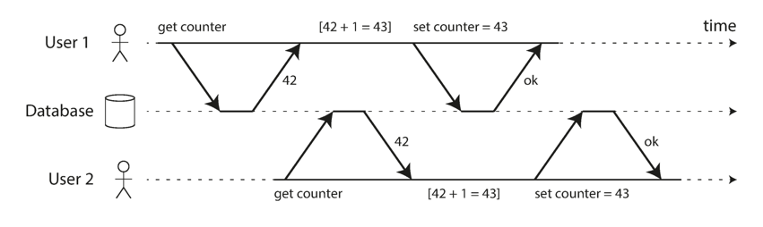
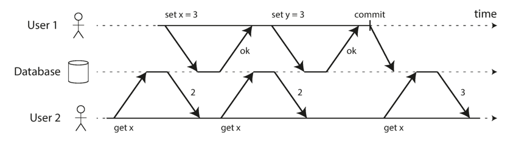
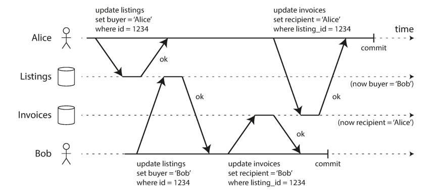
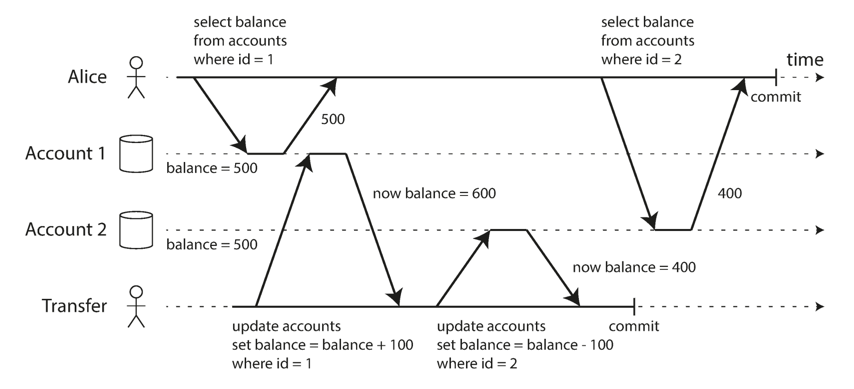
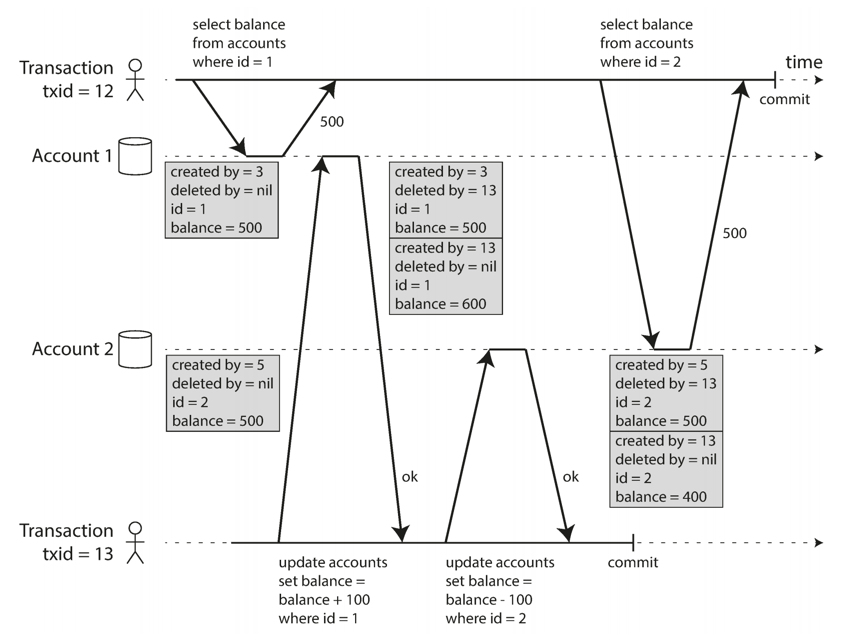
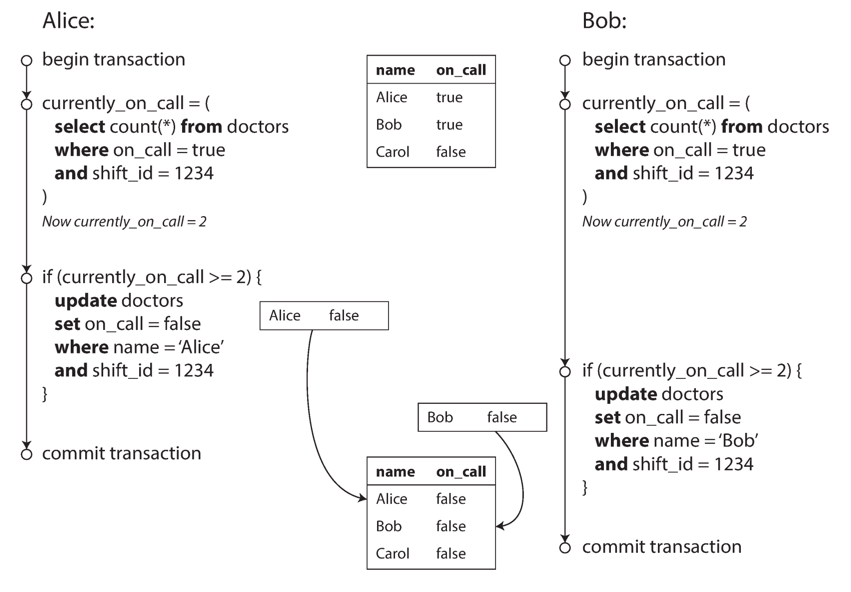

## Introduction

在数据系统的严酷现实中，很多事情可能会出错：

- 数据库软件或硬件可能随时发生故障（包括在写操作过程中）。
- 应用程序可能随时崩溃（包括在一系列操作进行到一半时）。
- 网络中断可能意外地切断应用程序与数据库的连接，或切断数据库节点之间的连接。
- 多个客户端可能同时向数据库写入，相互覆盖彼此的更改。
- 客户端可能读取到无意义的数据，因为这些数据只被部分更新。
- 客户端之间的 race conditions（竞态条件）可能导致令人惊讶的 bug。

Transaction（事务）一直是简化这些问题的首选机制。
事务是应用程序将多次读取和写入组合成一个逻辑单元的方式。
从概念上讲，事务中的所有读取和写入都作为一个操作执行：要么整个事务成功（commit），要么失败（abort、rollback）。
如果失败，应用程序可以安全地重试。
有了事务，应用程序的错误处理变得简单得多，因为它不必担心 partial failure（部分失败）——即某些操作成功而某些失败的情况（无论出于何种原因）。

创建事务的目的是为访问数据库的应用程序**简化编程模型**。
通过使用事务，应用程序可以自由地忽略某些潜在的错误场景和并发问题，因为数据库会代为处理这些问题（我们称之为 safety guarantees）。

并非每个应用程序都需要事务，有时弱化事务保证或完全放弃事务反而有优势（例如为了获得更高的性能或更高的可用性）。
某些安全属性可以在没有事务的情况下实现。

## ACID

事务提供的安全保证通常用著名的缩写 **ACID** 来描述，它代表 Atomicity（原子性）、Consistency（一致性）、Isolation（隔离性）和 Durability（持久性）。
在实践中，一个数据库的 ACID 实现并不等同于另一个数据库的实现。
例如，关于 isolation 的含义存在很多歧义。
如今，当一个系统声称"符合 ACID"时，你实际上能期待什么保证并不清楚。
ACID 不幸地主要变成了一个营销术语。
（不满足 ACID 标准的系统有时被称为 **BASE**，代表 Basically Available（基本可用）、Soft state（软状态）和 Eventual consistency（最终一致性）。
这比 ACID 的定义更加模糊。
似乎 BASE 唯一合理的定义就是"非 ACID"；也就是说，它可以意味着任何你想要的东西。）

### The Meaning of ACID

#### Atomicity

在 ACID 的语境中，原子性与并发无关。
它不描述如果多个进程尝试同时访问相同数据会发生什么，因为这属于字母 I 的范畴，即 isolation（隔离性）。

相反，ACID 原子性描述的是：如果客户端想要进行多次写入，但在部分写入已被处理后发生故障——例如进程崩溃、网络连接中断、磁盘已满或违反某些完整性约束——会发生什么。
如果这些写入被组合成一个原子事务，并且由于故障而无法完成（committed）事务，则事务会被 aborted，数据库必须丢弃或撤销它在该事务中至今所做的任何写入。

如果没有原子性，如果在进行多次更改的过程中途发生错误，很难知道哪些更改已生效，哪些没有。
应用程序可以尝试重试，但这有使相同更改执行两次的风险，导致重复或不正确的数据。
原子性简化了这个问题：如果事务被 aborted，应用程序可以确信它没有更改任何内容，因此可以安全地重试。
**在出错时中止事务并丢弃该事务的所有写入，是 ACID 原子性的定义特征。**

#### Consistency

> [!TIP]
>
> The letter C doesn't really belong in ACID

一致性的想法取决于应用程序对 invariants（不变量）的概念，并且是应用程序的责任来正确定义其事务，以便它们保持一致性。
**这不是数据库能够保证的：如果你写入了违反不变量的坏数据，数据库无法阻止你。**
（某些特定类型的 invariants 可以由数据库检查，例如使用外键约束或唯一性约束。
然而，一般来说，应用程序定义什么是有效或无效的数据——数据库只负责存储。）

原子性、隔离性和持久性是数据库的属性，而一致性（在 ACID 意义下）是应用程序的属性。
**应用程序可以依赖数据库的原子性和隔离性属性来实现一致性，但这不仅仅取决于数据库本身。**
因此，字母 C 实际上并不属于 ACID。

#### Isolation

大多数数据库同时被多个客户端访问。
如果它们读写数据库的不同部分，这没有问题；但如果它们访问相同的数据库记录，你可能会遇到并发问题（race conditions）。

Figure 1 是此类问题的一个简单示例。
假设你有两个客户端同时将存储在数据库中的计数器加 1。
每个客户端都需要读取当前值，加 1，然后写回新值（假设数据库没有内置的 increment 操作）。
在 Figure 1 中，计数器应该从 42 增加到 44，因为发生了两次增量，但由于 race condition，它实际上只增加到 43。

ACID 意义上的 *isolation* 意味着并发执行的事务彼此隔离：它们不会相互干扰。
经典数据库教科书将 isolation 形式化为 serializability（可串行化），这意味着每个事务都可以假装它是整个数据库上运行的唯一事务。
数据库确保当事务提交时，结果与它们串行运行（一个接一个）的结果相同，即使实际上它们可能是并发运行的。

<div style="text-align: center;">



</div>

<p style="text-align: center;">
Fig.1. A race condition between two clients concurrently incrementing a counter.
</p>

然而，在实践中，serializable isolation 很少使用，因为它会带来性能损失。
一些流行的数据库（如 Oracle 11g）甚至没有实现它。
在 Oracle 中有一个名为"serializable"的 isolation level，但它实际上实现的是 snapshot isolation，这是一个比 serializability 更弱的保证。

#### Durability

数据库系统的目的是提供一个安全的地方来存储数据，而无需担心丢失数据。
持久性是这样的承诺：一旦事务成功提交，它写入的任何数据都不会被遗忘，即使发生硬件故障或数据库崩溃。

在单节点数据库中，durability 通常意味着数据已被写入非易失性存储（如硬盘或 SSD）。
它通常还涉及 write-ahead log 或类似机制，这允许在磁盘上的数据结构损坏时进行恢复。
在复制数据库中，durability 可能意味着数据已成功复制到一定数量的节点。
为了提供 durability 保证，数据库必须等待这些写入或复制完成，然后才能报告事务已成功提交。

完美持久性并不存在：如果你的所有硬盘和所有备份同时被销毁，显然数据库无法做任何事情来拯救你。

### Multi-Object Operations

在 ACID 中，原子性和隔离性描述了当客户端在同一事务中进行多次写入时，数据库应该做什么。
这些假设你想要修改多个对象（行、文档、记录）。
如果需要保持多段数据同步，这种 multi-object transactions 通常是必需的。

Multi-object transactions 需要某种方式来确定哪些读取和写入操作属于同一事务。
在关系数据库中，这通常基于客户端与数据库服务器的 TCP 连接来完成：在任何特定连接上，BEGIN TRANSACTION 和 COMMIT 语句之间的所有内容都被视为同一事务的一部分。

另一方面，许多非关系数据库没有这样的方式将操作组合在一起。
即使存在 multi-object API（例如，键值存储可能具有 multi-put 操作，可以一次更新多个键），这也不一定意味着它具有事务语义：该命令可能对某些键成功，对其他键失败，使数据库处于部分更新状态。

许多分布式数据存储已放弃 multi-object transactions，因为它们难以跨分区实现，并且在某些需要非常高可用性或性能的场景中可能会造成阻碍。
然而，没有什么从根本上阻止分布式数据库中的事务。

有些用例中，单对象插入、更新和删除就足够了。
然而，在许多其他情况下，需要协调对不同对象的写入：

- 在关系数据模型中，一个表中的一行通常具有指向另一表中一行的外键引用。（类似地，在图状数据模型中，顶点具有指向其他顶点的边。）Multi-object transactions 允许你确保这些引用保持有效：当插入多个相互引用的记录时，外键必须正确且最新，否则数据将变得毫无意义。
- 在文档数据模型中，需要一起更新的字段通常位于同一文档内，该文档被视为单个对象——更新单个文档时不需要 multi-object transactions。然而，缺乏 join 功能的文档数据库也鼓励 denormalization（反规范化）。当需要更新 denormalized 信息时，你需要一次性更新多个文档。在这种情况下，事务非常有用，可以防止 denormalized 数据不同步。
- 在具有 secondary indexes（二级索引）的数据库中（几乎除了纯键值存储之外的所有东西），每次更改值时也需要更新索引。这些索引从事务的角度来看与数据是不同的数据库对象：例如，如果没有事务隔离，一个记录可能出现在一个索引中但不出现在另一个索引中，因为对第二个索引的更新尚未发生。

没有事务，这些应用程序仍然可以实现。
**然而，没有原子性，错误处理会变得更加复杂，缺乏隔离性会导致并发问题。**

### Handling errors and aborts

事务的一个关键特性是，如果发生错误，它可以被 aborted 并安全重试。
ACID 数据库基于这种理念：如果数据库有违反其原子性、隔离性或持久性保证的危险，它宁愿完全放弃事务，也不允许它保持半途而废的状态。

然而，并非所有系统都遵循这种理念。
特别是，使用 leaderless replication 的数据存储更多地基于"尽力而为"的方式，可以总结为"数据库将尽最大努力，如果遇到错误，它不会撤销已经做的事情"——因此应用程序有责任从错误中恢复。

虽然重试被 aborted 的事务是一种简单有效的错误处理机制，但它并不完美：

- 如果事务实际上成功了，但服务器尝试向客户端确认成功提交时网络发生故障（因此客户端认为它失败了），则重试事务会导致它执行两次——除非你有额外的应用程序级去重机制。
- 如果错误是由于过载引起的，重试事务会使问题变得更糟，而不是更好。为了避免这种反馈循环，你可以限制重试次数，使用指数退避，并以不同于其他错误的方式处理与过载相关的错误（如果可能）。
- 只有在 transient errors（例如由于 deadlock、isolation violation、临时网络中断和故障转移）后才值得重试；在 permanent errors（例如 constraint violation）后重试将毫无意义。
- 如果事务还在数据库之外有副作用，即使事务被 aborted，这些副作用也可能发生。例如，如果你正在发送电子邮件，你不希望每次重试事务时都再次发送电子邮件。如果你想确保多个不同的系统要么一起提交要么一起中止，two-phase commit 可能会有所帮助。
- 如果客户端进程在重试期间失败，它试图写入数据库的任何数据都会丢失。

## Isolation Levels

如果两个事务不触及相同的数据，它们可以安全地并行运行，因为它们互不依赖。
并发问题（race conditions）只在一个事务读取被另一个事务并发修改的数据时，或者两个事务尝试同时修改相同数据时才会出现。
Concurrency bugs 很难通过测试找到，因为此类 bug 只有在你时机不利时才会触发。
此类时机问题可能很少发生，并且通常很难重现。
并发也非常难以推理，尤其是在大型应用程序中，你不一定知道哪些其他代码段正在访问数据库。
如果只有一个用户，应用程序开发已经足够困难；拥有许多并发用户会使它变得更加困难，因为任何数据都可能在任何时候意外更改。
因此，数据库长期以来一直试图通过提供事务隔离来向应用程序开发人员隐藏并发问题。
理论上，隔离应该让你假装没有并发发生变得更容易：serializable isolation 意味着数据库保证事务的效果与它们串行运行（即一次一个，没有任何并发）的效果相同。
实际上，隔离并不那么简单。
Serializable isolation 有性能成本，许多数据库不想支付这个代价。
因此，系统通常使用较弱的 isolation levels，这些级别可以防止某些并发问题，但不是全部。
这些 isolation levels 要难理解得多，并且可能导致微妙的 bug，但它们在实践中仍被使用。

由弱事务隔离引起的并发 bug 不仅仅是一个理论问题。
它们已导致 substantial 的资金损失，引发财务审计师的调查，并导致客户数据损坏。
对此类问题披露的一个流行评论是"如果你处理财务数据，请使用 ACID 数据库！"——但这没有抓住重点。
即使是许多流行的关系数据库系统（通常被认为是"ACID"）也使用弱隔离，因此它们不一定能防止这些 bug 的发生。


| Isolation level  | Dirty Read         | Non-Repeatable Read | Phantom Read       |
| ---------------- | ------------------ | ------------------- | ------------------ |
| READ-UNCOMMITTED | :white_check_mark: | :white_check_mark:  | :white_check_mark: |
| READ-COMMITTED   | :x:                | :white_check_mark:  | :white_check_mark: |
| REPEATABLE-READ  | :x:                | :x:                 | :white_check_mark: |
| SERIALIZABLE     | :x:                | :x:                 | :x:                |

### Read Committed

最基本的 transaction isolation level 是 read committed。
它做出两个保证：

1. 从数据库读取时，你只会看到已提交的数据（不会发生 dirty reads）。
2. 向数据库写入时，你只会覆盖已提交的数据（不会发生 dirty writes）。

> Some databases support an even weaker isolation level called *read uncommitted*. It prevents dirty writes, but does not prevent dirty reads.

#### No dirty reads

想象一个事务已向数据库写入了一些数据，但该事务尚未提交或中止。
另一个事务能看到这些未提交的数据吗？<br>
如果可以，这被称为 dirty read。
运行在 read committed isolation level 的事务必须防止 dirty reads。
这意味着事务的任何写入只有在该事务提交时才对其他人可见（然后它的所有写入会同时变得可见）。
这在 Figure 2 中得到了说明，其中用户 1 已设置 x = 3，但在用户 1 尚未提交时，用户 2 的 get x 仍然返回旧值 2。

<div style="text-align: center;">



</div>

<p style="text-align: center;">
Fig.2. No dirty reads: user 2 sees the new value for x only after user 1's transaction has committed.
</p>

防止 dirty reads 有几个有用的原因：

- 如果事务需要更新多个对象，dirty read 意味着另一个事务可能会看到部分更新，而不是全部。看到数据库处于部分更新状态会让用户感到困惑，并可能导致其他事务做出不正确的决定。
- 如果事务 aborts，它所做的任何写入都需要回滚。如果数据库允许 dirty reads，这意味着一个事务可能会看到后来被回滚的数据——即永远不会实际提交到数据库的数据。推理其后果很快变得令人费解。

#### No dirty writes

如果两个事务并发尝试更新数据库中的同一对象会发生什么？我们不知道写入会以什么顺序发生，但我们通常假设后来的写入会覆盖较早的写入。
然而，如果较早的写入是尚未提交的事务的一部分，后来的写入覆盖了未提交的值，会发生什么？<br>
这被称为 dirty write。
运行在 read committed isolation level 的事务必须防止 dirty writes，通常通过延迟第二次写入，直到第一次写入的事务提交或中止。

通过防止 dirty writes，这个 isolation level 避免了某些类型的并发问题。

- 如果事务更新多个对象，dirty writes 可能导致不良后果。例如，考虑 Figure 3，它说明了一个二手车销售网站，Alice 和 Bob 两个人同时尝试购买同一辆车。购买一辆车需要两次数据库写入：网站上的 listing 需要更新以反映买家，销售发票需要发送给买家。在 Figure 3 的情况下，销售被授予 Bob（因为他执行了对 listings 表的胜出更新），但发票发送给了 Alice（因为她执行了对 invoices 表的胜出更新）。Read committed 防止此类事故。
- 然而，read committed 不能防止 Figure 1 中两个计数器增量之间的 race condition。在这种情况下，第二次写入发生在第一次事务提交之后，所以它不是 dirty write。它仍然是不正确的，但原因不同——在"Lost Updates"中。

<div style="text-align: center;">



</div>

<p style="text-align: center;">
Fig.3. With dirty writes, conflicting writes from different transactions can be mixed up.
</p>

#### Implementing read committed

Read committed 是一个非常流行的 isolation level。
它是 Oracle 11g、PostgreSQL、SQL Server 2012、MemSQL 和许多其他数据库的默认设置。

最常见的是，数据库使用 row-level locks 来防止 dirty writes：当事务想要修改特定对象（行或文档）时，它必须首先获取该对象的锁。
然后它必须持有该锁，直到事务提交或中止。
对于任何给定对象，一次只能有一个事务持有该对象的锁；如果另一个事务想要写入同一对象，它必须等待第一个事务提交或中止后才能获取锁并继续。
这种 locking 由数据库在 read committed 模式（或更强的 isolation levels）下自动完成。

我们如何防止 dirty reads？<br>
一个选项是使用相同的锁，并要求任何想要读取对象的事务短暂获取该锁，然后在读取后立即释放它。
这将确保读取不会在对象具有脏的、未提交的值时发生（因为在此期间锁将由进行写入的事务持有）。
<br>
然而，要求读锁的方法在实践中效果不佳，因为一个长时间运行的写入事务可能迫使许多只读事务等待，直到长时间运行的事务完成。
这会损害只读事务的响应时间，并对可操作性产生不良影响：由于等待锁，应用程序一个部分的减速可能会对完全不同的部分产生连锁反应。

### Snapshot Isolation and Repeatable Read

然而，使用 read committed isolation 时，仍然有很多方式可能出现并发 bug。
例如，Figure 4 说明了 read committed 可能出现的问题。

<div style="text-align: center;">



</div>

<p style="text-align: center;">
Fig.4. Read skew: Alice observes the database in an inconsistent state.
</p>

假设 Alice 在银行有 1,000 美元的储蓄，分布在两个账户中，每个账户 500 美元。
现在一个事务将 100 美元从她的一个账户转移到另一个账户。
如果她恰好在该事务正在处理的那一刻查看她的账户余额列表，她可能会看到一个账户余额在 incoming payment 到达之前（余额为 500 美元），另一个账户在 outgoing transfer 之后（新余额为 400 美元）。
对 Alice 来说，现在她似乎在她的账户中总共有 900 美元——似乎有 100 美元凭空消失了。

这种异常被称为 nonrepeatable read 或 read skew：如果 Alice 在事务结束时再次读取账户 1 的余额，她会看到与她之前查询不同的值（600 美元）。
Read skew 在 read committed isolation 下被认为是可以接受的：Alice 看到的账户余额在她读取时确实已提交。

在 Alice 的情况下，这不是一个持久的问题，因为如果她几秒钟后重新加载在线银行网站，她很可能会看到一致的账户余额。
<br>
然而，某些情况不能容忍这种临时不一致：

- Backups<br>
进行备份需要复制整个数据库，这在大型数据库上可能需要数小时。
在备份过程运行期间，写入将继续对数据库进行。
因此，你最终可能会得到备份的某些部分包含较旧版本的数据，而其他部分包含较新版本的数据。
如果你需要从这样的备份中恢复，不一致性（例如消失的金钱）将变成永久性的。
- Analytic queries and integrity checks<br>
有时，你可能想要运行一个扫描数据库大部分内容的查询。
此类查询在分析中很常见，或者可能是定期检查一切正常（监控数据损坏）的一部分。
如果这些查询在不同的时间点观察数据库的部分内容，它们很可能会返回无意义的结果。

*Snapshot isolation* 是解决此问题的最常见解决方案。
其思想是每个事务从数据库的*consistent snapshot*读取——也就是说，事务看到事务开始时数据库中已提交的所有数据。
即使数据随后被另一个事务更改，每个事务也只能看到该特定时间点的旧数据。
Snapshot isolation 对于长时间运行的只读查询（如备份和分析）非常有利。
如果查询操作的数据在查询执行时同时更改，很难理解查询的含义。
当事务可以看到在特定时间点冻结的数据库的一致快照时，它更容易理解。

Snapshot isolation 是一种有用的 isolation level，特别是对于只读事务。
然而，许多实现它的数据库使用不同的名称。
在 Oracle 中它被称为 serializable，在 PostgreSQL 和 MySQL 中它被称为 repeatable read。

#### Implementing snapshot isolation

与 read committed isolation 一样，snapshot isolation 的实现通常使用写入锁来防止 dirty writes，这意味着进行写入的事务可以阻止写入同一对象的另一个事务的进度。
然而，读取不需要任何锁。
从性能的角度来看，snapshot isolation 的一个关键原则是*readers never block writers, and writers never block readers*。
这允许数据库在处理写入的同时，在 consistent snapshot 上处理长时间运行的读取查询，而两者之间没有任何锁争用。

为了实现 snapshot isolation，数据库使用我们为在 Figure 2 中防止 dirty reads 所看到的机制的泛化。
数据库可能必须保持一个对象的多个不同提交版本，因为各种进行中的事务可能需要在不同时间点看到数据库的状态。
因为它并排维护一个对象的多个版本，这种技术被称为 multiversion concurrency control（MVCC）。

如果数据库只需要提供 read committed isolation，而不需要 snapshot isolation，保持一个对象的两个版本就足够了：提交版本和已覆盖但尚未提交的版本。
然而，支持 snapshot isolation 的存储引擎通常也为它们的 read committed isolation level 使用 MVCC。
典型的方法是 read committed 为每个查询使用单独的 snapshot，而 snapshot isolation 为整个事务使用相同的 snapshot。

Figure 5 说明了 PostgreSQL 中如何实现基于 MVCC 的 snapshot isolation（其他实现类似）。
当事务启动时，它会被赋予一个唯一的、始终递增的 transaction ID（txid）。
当事务向数据库写入任何内容时，它写入的数据会标记有写入者的 transaction ID。

<div style="text-align: center;">



</div>

<p style="text-align: center;">
Fig.5. Implementing snapshot isolation using multi-version objects.
</p>

表中的每一行都有一个 created_by 字段，包含插入该行到表中的事务的 ID。
此外，每一行都有一个 deleted_by 字段，最初为空。
如果事务删除一行，该行实际上不会从数据库中删除，而是通过设置 deleted_by 字段为请求删除的事务的 ID 来标记为删除。
在稍后的某个时间，当确定没有事务可以再访问已删除的数据时，数据库中的 garbage collection 过程会删除标记为删除的任何行并释放它们的空间。

更新在内部被转换为删除和创建。
例如，在 Figure 5 中，事务 13 从账户 2 扣除 100 美元，将余额从 500 美元更改为 400 美元。
accounts 表现在实际上包含账户 2 的两行：一行余额为 500 美元，被事务 13 标记为已删除，另一行余额为 400 美元，由事务 13 创建。

当事务从数据库读取时，使用 transaction IDs 来决定它可以看见哪些对象，哪些不可见。
通过仔细定义 visibility rules，数据库可以向应用程序呈现数据库的一致快照。
<br>
其工作原理如下：

1. 在每个事务开始时，数据库会列出当时正在进行的所有其他事务（尚未提交或中止）。
这些事务所做的任何写入都会被忽略，即使这些事务随后提交。
2. 被 aborted 事务所做的任何写入都会被忽略。
3. 由具有较晚 transaction ID 的事务（即在当前事务启动之后启动的事务）所做的任何写入都会被忽略，无论这些事务是否已提交。
4. 所有其他写入对应用程序的查询可见。

这些规则适用于对象的创建和删除。
在 Figure 5 中，当事务 12 从账户 2 读取时，它看到余额为 500 美元，因为 500 美元余额的删除是由事务 13 进行的（根据规则 3，事务 12 不能看见事务 13 进行的删除），而 400 美元余额的创建尚不可见（根据相同的规则）。
换句话说，如果满足以下两个条件，对象就是可见的：

- 当读取者的事务启动时，创建对象的事务已经提交。
- 对象未被标记为删除，或者如果被标记为删除，请求删除的事务在读取者的事务启动时尚未提交。

长时间运行的事务可能会继续使用 snapshot 很长时间，继续读取从其他事务的角度来看已被覆盖或删除很久的值。
通过从不就地更新值，而是在每次更改值时创建新版本，数据库可以在仅产生少量开销的情况下提供一致快照。

#### Indexes and snapshot isolation

索引在多版本数据库中如何工作？一个选项是让索引简单地指向一个对象的所有版本，并要求索引查询过滤掉当前事务不可见的任何对象版本。
当 garbage collection 删除不再对任何事务可见的旧对象版本时，相应的索引条目也可以被删除。

在实践中，许多实现细节决定了 multiversion concurrency control 的性能。
例如，PostgreSQL 有优化，如果同一对象的不同版本可以放在同一页上，则避免索引更新。

CouchDB、Datomic 和 LMDB 中使用了另一种方法。
虽然它们也使用 B 树，但它们使用 append-only/copy-on-write 变体，该变体在更新时不覆盖树的页，而是创建每个修改页的新副本。
父页（直到树的根）被复制并更新以指向其子页的新版本。
任何不受写入影响的页都不需要复制，并保持 immutable。

使用 append-only B 树，每个写入事务（或一批事务）创建一个新的 B 树根，特定的根是创建时数据库在特定时间点的一致快照。
无需根据 transaction IDs 过滤对象，因为后续写入无法修改现有的 B 树；它们只能创建新的树根。
然而，这种方法也需要后台进程进行 compaction 和 garbage collection。

### Lost Updates

还有几种其他有趣的并发写入事务之间可能发生的冲突类型。
其中最著名的是 lost update problem，如 Figure 1 中两个并发计数器增量的示例所示。
当应用程序从数据库读取某个值，修改它，然后写回修改后的值（read-modify-write cycle）时，可能会出现 lost update problem。
如果两个事务并发执行此操作，其中一个修改可能会丢失，因为第二次写入不包括第一次修改。
（我们有时说后来的写入 clobber 了较早的写入。）
这种模式出现在各种不同的场景中：

- 递增计数器或更新账户余额（需要读取当前值，计算新值，然后写回更新的值）
- 对复杂值进行本地更改，例如在 JSON 文档中的列表中添加元素（需要解析文档，进行更改，然后写回修改后的文档）
- 两个用户同时编辑同一个 wiki 页面，每个用户通过向服务器发送整个页面内容来保存更改，覆盖数据库中当前的任何内容

#### Atomic write operations

许多数据库提供 atomic update operations，这消除了在应用程序代码中实现 read-modify-write cycles 的需要。
如果你的代码可以用这些操作来表达，它们通常是最好的解决方案。
例如，以下指令在大多数关系数据库中是并发安全的：

```sql
UPDATE counters SET value = value + 1 WHERE key = 'foo';
```

类似地，文档数据库（如 MongoDB）提供 atomic operations 来对 JSON 文档的一部分进行本地修改，Redis 提供 atomic operations 来修改数据结构（如优先级队列）。
并非所有写入都能轻易用 atomic operations 来表达——例如，对 wiki 页面的更新涉及任意文本编辑——但在可以使用 atomic operations 的情况下，它们通常是最佳选择。

Atomic operations 通常通过在读取对象时获取 exclusive lock 来实现，这样在更新应用之前，没有其他事务可以读取它。
这种技术有时被称为 cursor stability。
另一个选项是简单地强制所有 atomic operations 在单个线程上执行。

不幸的是，object-relational mapping (ORM) 框架很容易让你意外地编写执行不安全的 read-modify-write cycles 的代码，而不是使用数据库提供的 atomic operations。
如果你知道你在做什么，这不是问题，但它可能是难以通过测试找到的微妙 bug 的潜在来源。

#### Explicit locking

如果数据库的内置 atomic operations 不提供所需的功能，防止 lost updates 的另一个选项是应用程序显式锁定将要更新的对象。
然后应用程序可以执行 read-modify-write cycle，如果任何其他事务尝试并发读取同一对象，它将被迫等待，直到第一个 read-modify-write cycle 完成。
例如，考虑一个多人游戏，其中多个玩家可以同时移动同一个棋子。
在这种情况下，atomic operation 可能不够，因为应用程序还需要确保玩家的移动符合游戏规则，这涉及一些你无法合理作为数据库查询实现的逻辑。
相反，你可以使用锁来防止两个玩家并发移动同一个棋子，如 Example 1 所示。

```sql
BEGIN TRANSACTION;
SELECT * FROM figures
    WHERE name = 'robot' AND game_id = 222
FOR UPDATE;

-- Check whether move is valid, then update the position
-- of the piece that was returned by the previous SELECT.
UPDATE figures SET position = 'c4' WHERE id = 1234;
COMMIT;
```

这可行，但要正确实现，你需要仔细思考你的应用程序逻辑。
很容易忘记在代码的某个地方添加必要的锁，从而引入 race condition。

#### Automatically detecting lost updates

Atomic operations 和 locks 是通过强制 read-modify-write cycles 顺序执行来防止 lost updates 的方法。
另一种方法是允许它们并行执行，如果 transaction manager 检测到 lost update，则 abort 事务并强制它重试其 read-modify-write cycle。
这种方法的一个优势是数据库可以结合 snapshot isolation 高效地执行此检查。
事实上，PostgreSQL 的 repeatable read、Oracle 的 serializable 和 SQL Server 的 snapshot isolation levels 会自动检测何时发生 lost update 并 abort 违规事务。
然而，MySQL/InnoDB 的 repeatable read 不检测 lost updates。
一些作者认为数据库必须防止 lost updates 才有资格提供 snapshot isolation，因此根据这个定义，MySQL 不提供 snapshot isolation。
Lost update detection 是一个很棒的功能，因为它不需要应用程序代码使用任何特殊的数据库功能——你可能会忘记使用锁或 atomic operation 从而引入 bug，但 lost update detection 会自动发生，因此更不容易出错。

#### Compare-and-set

在不提供事务的数据库中，你有时会找到原子 compare-and-set operation。
此操作的目的是通过仅在值自你上次读取后未更改时才允许更新来避免 lost updates。
如果当前值与你之前读取的值不匹配，则更新无效，必须重试 read-modify-write cycle。

例如，为了防止两个用户并发更新同一个 wiki 页面，你可能会尝试类似这样的操作，期望仅在页面内容自用户开始编辑后未更改时才发生更新：

```sql
-- This may or may not be safe, depending on the database implementation
UPDATE wiki_pages SET content = 'new content'
WHERE id = 1234 AND content = 'old content';
```

如果内容已更改且不再匹配 'old content'，此更新将无效，因此你需要检查更新是否生效，并在必要时重试。
然而，如果数据库允许 WHERE 子句从旧 snapshot 读取，此语句可能无法防止 lost updates，因为条件可能为 true，即使另一个并发写入正在发生。
在依赖之前，检查你的数据库的 compare-and-set operation 是否安全。

#### Conflict resolution and replication

在复制数据库中，防止 lost updates 会承担另一个维度：由于它们在多个节点上拥有数据的副本，并且数据可能会在不同节点上并发修改，因此需要采取额外步骤来防止 lost updates。

Locks 和 compare-and-set operations 假设有数据的单个最新副本。
然而，具有 multi-leader 或 leaderless replication 的数据库通常允许并发写入并异步复制它们，因此它们无法保证有数据的单个最新副本。
因此，基于 locks 或 compare-and-set 的技术在此上下文中不适用。
相反，此类复制数据库中的常见方法是允许并发写入创建多个冲突版本的值（也称为 siblings），并使用应用程序代码或特殊数据结构在事后解决和合并这些版本。

Atomic operations 可以在复制上下文中很好地工作，特别是如果它们是可交换的（即，你可以在不同副本上以不同顺序应用它们，仍然得到相同的结果）。
例如，递增计数器或向集合添加元素是可交换操作。
这就是 Riak 2.0 datatypes 的想法，它防止跨副本的 lost updates。
当值被不同用户并发更新时，Riak 会自动合并更新，使得没有更新丢失。

另一方面，last write wins (LWW) conflict resolution method 容易发生 lost updates。
不幸的是，LWW 是许多复制数据库的默认设置。

### Write Skew and Phantoms

在前面的部分中，我们看到了 dirty writes 和 lost updates，这是不同事务并发尝试写入相同对象时可能发生的两种 race conditions。
为了避免数据损坏，这些 race conditions 需要被防止——要么由数据库自动防止，要么通过手动安全措施（如使用 locks 或 atomic write operations）。
然而，这还不是并发写入之间可能发生的潜在 race conditions 列表的结束。
在本节中，我们将看到一些更微妙的冲突示例。

首先，想象这个示例：你正在为医生编写一个应用程序来管理他们在医院的 on-call shifts。
医院通常试图在任何时候都有多名医生值班，但它绝对必须至少有一名医生值班。
医生可以放弃他们的轮班（例如，如果他们自己生病了），前提是在该轮班中至少有一名同事仍然值班。
现在想象 Alice 和 Bob 是特定轮班的两名值班医生。
两人都感觉不舒服，所以他们两人都决定请假。
不幸的是，他们大约在同时点击了下班按钮。
接下来发生的事情如 Figure 6 所示。

<div style="text-align: center;">



</div>

<p style="text-align: center;">
Fig.6. Example of write skew causing an application bug.
</p>

在每个事务中，你的应用程序首先检查当前是否有两名或更多医生值班；如果是，它假设一名医生下班是安全的。
由于数据库使用 snapshot isolation，两个检查都返回 2，所以两个事务都进入下一个阶段。
Alice 更新她自己的记录以使自己下班，Bob 同样更新他自己的记录。
两个事务都提交，现在没有医生值班。
你至少有一名医生值班的要求已被违反。

这种异常被称为 write skew。
它既不是 dirty write 也不是 lost update，因为两个事务正在更新两个不同的对象（Alice 和 Bob 的 on-call records）。
这里发生的冲突不太明显，但它绝对是 race condition：如果两个事务一个接一个地运行，第二个医生将被阻止下班。
异常行为只有在事务并发运行时才可能发生。
你可以将 write skew 视为 lost update problem 的泛化。
当两个事务读取相同的对象，然后更新其中一些对象（不同的事务可能更新不同的对象）时，可能会发生 write skew。
在不同事务更新相同对象的特殊情况下，你会得到 dirty write 或 lost update anomaly（取决于时机）。

我们看到有各种不同的方法可以防止 lost updates。
对于 write skew，我们的选择更加受限：

- Atomic single-object operations 无济于事，因为涉及多个对象。
- 你在某些 snapshot isolation 实现中发现的 lost updates 自动检测也无济于事：write skew 不会在 PostgreSQL 的 repeatable read、MySQL/InnoDB 的 repeatable read、Oracle 的 serializable 或 SQL Server 的 snapshot isolation level 中自动检测。自动防止 write skew 需要真正的 serializable isolation。
- 一些数据库允许你配置 constraints，然后由数据库强制执行（例如唯一性、外键约束或对特定值的限制）。然而，为了指定至少必须有一名医生值班，你需要一个涉及多个对象的 constraint。大多数数据库没有对此类 constraints 的内置支持，但你可以根据数据库使用 triggers 或 materialized views 来实现它们。
- 如果你不能使用 serializable isolation level，在这种情况下第二好的选项可能是显式锁定事务依赖的行。在医生示例中，你可以编写类似以下内容：

```sql
BEGIN TRANSACTION;

SELECT * FROM doctors
    WHERE on_call = true
    AND shift_id = 1234 FOR UPDATE;
  
UPDATE doctors
    SET on_call = false
    WHERE name = 'Alice'
    AND shift_id = 1234;
  
COMMIT;
```

以下是更多示例：

- Meeting room booking system<br>
假设你要确保同一会议室在同一时间不能有两次预订。
当有人想要进行预订时，你首先检查是否有任何冲突的预订（即，同一会议室具有重叠时间范围的预订），如果没有，则创建会议。
- Multiplayer game<br>
  在 Example 1 中，我们使用锁来防止 lost updates（即，确保两个玩家不能同时移动同一个棋子）。
  然而，锁不能防止玩家将两个不同的棋子移动到棋盘上的相同位置或可能做出违反游戏规则的其他移动。
  根据你正在强制执行的规则类型，你可以使用 unique constraint，否则你容易受到 write skew 的影响。
- Claiming a username<br>
在网站上，每个用户都有唯一的用户名，两个用户可能会尝试同时使用相同的用户名创建账户。
你可以使用事务来检查名称是否已被占用，如果没有，则使用该名称创建账户。
然而，与前面的示例一样，这在 snapshot isolation 下是不安全的。
幸运的是，这里有一个简单的解决方案：unique constraint（尝试注册用户名的第二个事务将因违反 constraint 而被 aborted）。
- Preventing double-spending<br>
允许用户花费金钱或积分的服务需要检查用户花费的不超过他们拥有的金额。
你可以通过在用户的账户中插入临时的支出项、列出账户中的所有项并检查总和是否为正来实现此目的。
通过 write skew，可能会发生两个支出项并发插入，导致余额变为负数，但两个事务都没有注意到另一个。

#### Phantoms causing write skew

所有这些示例都遵循类似的模式：

1. SELECT 查询通过搜索匹配某些搜索条件的行来检查是否满足某些要求（至少有两个医生值班）。
2. 根据第一个查询的结果，应用程序代码决定如何继续（可能继续操作，或者向用户报告错误并 abort）。
3. 如果应用程序决定继续，它会向数据库进行写入（INSERT、UPDATE 或 DELETE）并提交事务。
此写入的效果会改变步骤 2 决策的前提条件。
换句话说，如果你在提交写入后从步骤 1 重复 SELECT 查询，你会得到不同的结果，因为写入改变了匹配搜索条件的行集合（现在少了一个医生值班）。

步骤可能以不同的顺序发生。
例如，你可以先进行写入，然后进行 SELECT 查询，最后根据查询结果决定是否 abort 或 commit。

在医生值班示例的情况下，步骤 3 中修改的行是步骤 1 中返回的行之一，所以我们可以通过在步骤 1 中锁定行（`SELECT FOR UPDATE`）来使事务安全并避免 write skew。
然而，其他四个示例不同：它们检查的是匹配某些搜索条件的行是否存在，而写入添加了匹配相同条件的行。
如果步骤 1 中的查询不返回任何行，SELECT FOR UPDATE 无法附加锁到任何内容。

这种效应，即一个事务中的写入改变了另一个事务中搜索查询的结果，被称为 phantom。
Snapshot isolation 在只读查询中避免 phantoms，但在像我们讨论的这样的读写事务中，phantoms 可能导致特别棘手的 write skew 情况。

##### Materializing conflicts

如果 phantoms 的问题是没有对象可以附加锁，也许我们可以人为地向数据库引入锁对象？例如，在会议室预订的情况下，你可以想象创建一个时间槽和会议室的表。
此表中的每一行对应于特定时间段的特定会议室（比如 15 分钟）。
你提前为所有可能的房间和时间段组合创建行，例如未来六个月。
现在想要进行预订的事务可以锁定（`SELECT FOR UPDATE`）表中对应于所需房间和时间段的行。
在获取锁之后，它可以检查重叠的预订并插入新的预订，如前所述。
请注意，额外的表不用于存储有关预订的信息——它纯粹是锁的集合，用于防止同一房间和时间范围内的预订被并发修改。
这种方法被称为 materializing conflicts，因为它将 phantom 转化为数据库中存在的具体行集合上的锁冲突。

不幸的是，找出如何 materialize conflicts 可能很困难且容易出错，并且让并发控制机制泄漏到应用程序数据模型中是不美观的。
出于这些原因，materializing conflicts 应该被视为没有其他选择时的最后手段。
在大多数情况下，serializable isolation level 更可取。

### Serializability

Serializable isolation 通常被认为是最强的 isolation level。
它保证即使事务可能并行执行，最终结果也与它们一次一个、串行执行的结果相同，没有任何并发。
因此，数据库保证如果事务在单独运行时行为正确，它们在并发运行时将继续正确——换句话说，数据库防止所有可能的 race conditions。

如今提供 serializability 的大多数数据库使用三种技术之一：

- 真正以串行顺序执行事务
- Two-phase locking，这在几十年里是唯一可行的选择
- 乐观并发控制技术，如 serializable snapshot isolation

#### Actual Serial Execution

避免并发问题的最简单方法是完全删除并发：一次只执行一个事务，以串行顺序在单个线程上执行。
通过这样做，我们完全绕过了检测和防止事务之间冲突的问题：由此产生的隔离根据定义是 serializable。
