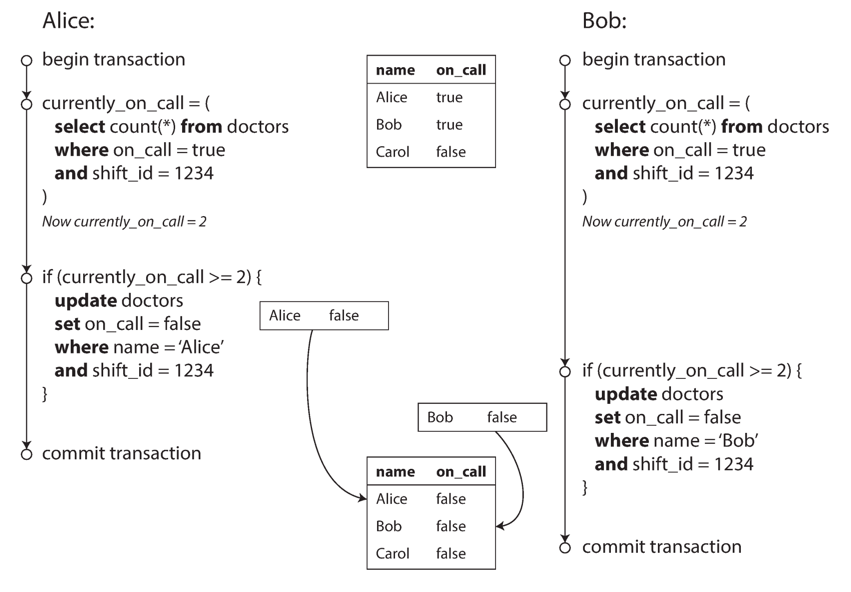

## Introduction

In the harsh reality of data systems, many things can go wrong:

- The database software or hardware may fail at any time (including in the middle of a write operation).
- The application may crash at any time (including halfway through a series of operations).
- Interruptions in the network can unexpectedly cut off the application from the database, or one database node from another.
- Several clients may write to the database at the same time, overwriting each other’s changes.
- A client may read data that doesn’t make sense because it has only partially been updated.
- Race conditions between clients can cause surprising bugs.

*Transactions* have been the mechanism of choice for simplifying these issues.
A transaction is a way for an application to group several reads and writes together into a logical unit.
Conceptually, all the reads and writes in a transaction are executed as one operation: either the entire transaction succeeds (*commit*) or it fails (*abort*, *rollback*).
If it fails, the application can safely retry.
With transactions, error handling becomes much simpler for an application, because it doesn’t need to worry about partial failure—i.e., the case where some operations succeed and some fail (for whatever reason).

Transactions are created to **simplify the programming model** for applications that access the database.
By using transactions, the application is free to ignore certain potential error scenarios and concurrency issues, because the database takes care of them instead (we call these *safety guarantees*).

Not every application needs transactions, and sometimes there are advantages to weakening transactional guarantees or abandoning them entirely (for example, to achieve higher performance or higher availability). Some safety properties can be achieved without transactions.

## ACID

The safety guarantees provided by transactions are often described by the wellknown acronym **ACID**, which stands for *Atomicity*, *Consistency*, *Isolation*, and *Durability*.
In practice, one database’s implementation of ACID does not equal another’s implementation.
For example, there is a lot of ambiguity around the meaning of isolation.
Today, when a system claims to be “ACID compliant,” it’s unclear what guarantees you can actually expect.
ACID has unfortunately become mostly a marketing term.
(Systems that do not meet the ACID criteria are sometimes called **BASE**, which stands for *Basically Available*, *Soft state*, and *Eventual consistency*.
This is even more vague than the definition of ACID.
It seems that the only sensible definition of BASE is “not ACID”; i.e., it can mean almost anything you want.)

### The Meaning of ACID

#### Atomicity

In the context of ACID, atomicity is not about concurrency.
It does not describe what happens if several processes try to access the same data at the same time, because that is covered under the letter I, for isolation.

Rather, ACID atomicity describes what happens if a client wants to make several writes, but a fault occurs after some of the writes have been processed—for example, a process crashes, a network connection is interrupted, a disk becomes full, or some integrity constraint is violated.
If the writes are grouped together into an atomic transaction, and the transaction cannot be completed (committed) due to a fault, then the transaction is aborted and the database must discard or undo any writes it has made so far in that transaction.

Without atomicity, if an error occurs partway through making multiple changes, it’s difficult to know which changes have taken effect and which haven’t.
The application could try again, but that risks making the same change twice, leading to duplicate or incorrect data.
Atomicity simplifies this problem: if a transaction was aborted, the application can be sure that it didn’t change anything, so it can safely be retried.
**The ability to abort a transaction on error and have all writes from that transaction discarded is the defining feature of ACID atomicity.**

#### Consistency

this idea of consistency depends on the application’s notion of invariants, and it’s the application’s responsibility to define its transactions correctly so that they preserve consistency.
**This is not something that the database can guarantee: if you write bad data that violates your invariants, the database can’t stop you.**
(Some specific kinds of invariants can be checked by the database, for example using foreign key constraints or uniqueness constraints.
However, in general, the application defines what data is valid or invalid—the database only stores it.)

Atomicity, isolation, and durability are properties of the database, whereas consistency (in the ACID sense) is a property of the application.
**The application may rely on the database’s atomicity and isolation properties in order to achieve consistency, but it’s not up to the database alone.**
Thus, the letter C doesn’t really belong in ACID.

#### Isolation

Most databases are accessed by several clients at the same time.
That is no problem if they are reading and writing different parts of the database, but if they are accessing the same database records, you can run into concurrency problems (race conditions).

Figure 1 is a simple example of this kind of problem. Say you have two clients simultaneously incrementing a counter that is stored in a database.
Each client needs to read the current value, add 1, and write the new value back (assuming there is no increment operation built into the database).
In Figure 1 the counter should have increased from 42 to 44, because two increments happened, but it actually only went to 43 because of the race condition.

*Isolation* in the sense of ACID means that concurrently executing transactions are isolated from each other: they cannot step on each other’s toes.
The classic database textbooks formalize isolation as serializability, which means that each transaction can pretend that it is the only transaction running on the entire database.
The database ensures that when the transactions have committed, the result is the same as if they had run serially (one after another), even though in reality they may have run concurrently.

<div style="text-align: center;">


</div>

<p style="text-align: center;">
Fig.1. A race condition between two clients concurrently incrementing a counter.
</p>

However, in practice, serializable isolation is rarely used, because it carries a performance penalty.
Some popular databases, such as Oracle 11g, don’t even implement it.
In Oracle there is an isolation level called “serializable,” but it actually implements something called *snapshot isolation*, which is a weaker guarantee than serializability.

#### Durability

The purpose of a database system is to provide a safe place where data can be stored without fear of losing it.
Durability is the promise that once a transaction has committed successfully, any data it has written will not be forgotten, even if there is a hardware fault or the database crashes.

In a single-node database, durability typically means that the data has been written to nonvolatile storage such as a hard drive or SSD.
It usually also involves a write-ahead log or similar, which allows recovery in the event that the data structures on disk are corrupted.
In a replicated database, durability may mean that the data has been successfully copied to some number of nodes.
In order to provide a durability guarantee, a database must wait until these writes or replications are complete before reporting a transaction as successfully committed.

Perfect durability does not exist: if all your hard disks and all your backups are destroyed at the same time, there’s obviously nothing your database can do to save you.

### Multi-Object Operations

In ACID, atomicity and isolation describe what the database should do if a client makes several writes within the same transaction.
Those assume that you want to modify several objects (rows, documents, records) at once. Such *multi-object transactions* are often needed if several pieces of data need to be kept in sync.

Multi-object transactions require some way of determining which read and write operations belong to the same transaction.
In relational databases, that is typically done based on the client’s TCP connection to the database server: on any particular connection, everything between a BEGIN TRANSACTION and a COMMIT statement is considered to be part of the same transaction.

On the other hand, many nonrelational databases don’t have such a way of grouping operations together.
Even if there is a multi-object API (for example, a key-value store may have a multi-put operation that updates several keys in one operation),
that doesn’t necessarily mean it has transaction semantics: the command may succeed for some keys and fail for others, leaving the database in a partially updated state.

Many distributed datastores have abandoned multi-object transactions because they are difficult to implement across partitions, and they can get in the way in some scenarios where very high availability or performance is required.
However, there is nothing that fundamentally prevents transactions in a distributed database.

There are some use cases in which single-object inserts, updates, and deletes are sufficient.
However, in many other cases writes to several different objects need to be coordinated:

- In a relational data model, a row in one table often has a foreign key reference to a row in another table. (Similarly, in a graph-like data model, a vertex has edges to other vertices.)
  Multi-object transactions allow you to ensure that these references remain valid: when inserting several records that refer to one another, the foreign keys have to be correct and up to date, or the data becomes nonsensical.
- In a document data model, the fields that need to be updated together are often within the same document, which is treated as a single object—no multi-object transactions are needed when updating a single document.
  However, document databases lacking join functionality also encourage denormalization.
  When denormalized information needs to be updated, you need to update several documents in one go.
  Transactions are very useful in this situation to prevent denormalized data from going out of sync.
- In databases with secondary indexes (almost everything except pure key-value stores), the indexes also need to be updated every time you change a value.
  These indexes are different database objects from a transaction point of view: for example, without transaction isolation, it’s possible for a record to appear in one index but not another, because the update to the second index hasn’t happened yet.

Such applications can still be implemented without transactions.
**However, error handling becomes much more complicated without atomicity, and the lack of isolation can cause concurrency problems.**

### Handling errors and aborts

A key feature of a transaction is that it can be aborted and safely retried if an error
occurred. ACID databases are based on this philosophy: if the database is in danger of violating its guarantee of atomicity, isolation, or durability, it would rather aban‐
don the transaction entirely than allow it to remain half-finished.

Not all systems follow that philosophy, though.
In particular, datastores with leaderless replication work much more on a “best effort” basis, which could be summarized as “the database will do as much as it can, and if it runs into an error,
it won’t undo something it has already done”—so it’s the application’s responsibility to recover from errors.

Although retrying an aborted transaction is a simple and effective error handling mechanism, it isn’t perfect:

- If the transaction actually succeeded, but the network failed while the server tried to acknowledge the successful commit to the client (so the client thinks it failed),
  then retrying the transaction causes it to be performed twice—unless you have an additional application-level deduplication mechanism in place.
- If the error is due to overload, retrying the transaction will make the problem worse, not better.
  To avoid such feedback cycles, you can limit the number of retries, use exponential backoff, and handle overload-related errors differently from other errors (if possible).
- It is only worth retrying after transient errors (for example due to deadlock, isolation violation, temporary network interruptions, and failover); after a permanent error (e.g., constraint violation) a retry would be pointless.
- If the transaction also has side effects outside of the database, those side effects may happen even if the transaction is aborted.
  For example, if you’re sending an email, you wouldn’t want to send the email again every time you retry the transaction.
  If you want to make sure that several different systems either commit or abort together, two-phase commit can help.
- If the client process fails while retrying, any data it was trying to write to the
  database is lost.

## Isolation Levels

If two transactions don’t touch the same data, they can safely be run in parallel, because neither depends on the other.
Concurrency issues (race conditions) only come into play when one transaction reads data that is concurrently modified by another transaction, or when two transactions try to simultaneously modify the same data.
Concurrency bugs are hard to find by testing, because such bugs are only triggered when you get unlucky with the timing.
Such timing issues might occur very rarely, and are usually difficult to reproduce.
Concurrency is also very difficult to reason about, especially in a large application where you don’t necessarily know which other pieces of code are accessing the database.
Application development is difficult enough if you just have one user at a time; having many concurrent users makes it much harder still, because any piece of data could unexpectedly change at any time.
For that reason, databases have long tried to hide concurrency issues from application developers by providing transaction isolation.
In theory, isolation should make your life easier by letting you pretend that no concurrency is happening: serializable isolation means that the database guarantees that transactions have the same effect as if they ran serially (i.e., one at a time, without any concurrency).
In practice, isolation is unfortunately not that simple. Serializable isolation has a performance cost, and many databases don’t want to pay that price.
It’s therefore common for systems to use weaker levels of isolation, which protect against some concurrency issues, but not all.
Those levels of isolation are much harder to understand, and they can lead to subtle bugs, but they are nevertheless used in practice.

Concurrency bugs caused by weak transaction isolation are not just a theoretical problem.
They have caused substantial loss of money, led to investigation by financial auditors, and caused customer data to be corrupted.
A popular comment on revelations of such problems is “Use an ACID database if you’re handling financial data!”—but that misses the point.
Even many popular relational database systems (which are usually considered “ACID”) use weak isolation, so they wouldn’t necessarily have prevented these bugs from occurring.


| Isolation level  | Dirty Read         | Non-Repeatable Read | Phantom Read       |
| ------------------ | -------------------- | --------------------- | -------------------- |
| READ-UNCOMMITTED | :white_check_mark: | :white_check_mark:  | :white_check_mark: |
| READ-COMMITTED   | :x:                | :white_check_mark:  | :white_check_mark: |
| REPEATABLE-READ  | :x:                | :x:                 | :white_check_mark: |
| SERIALIZABLE     | :x:                | :x:                 | :x:                |

### Read Committed

The most basic level of transaction isolation is read committed.v It makes two guarantees:

1. When reading from the database, you will only see data that has been committed (no *dirty reads*).
2. When writing to the database, you will only overwrite data that has been committed (no *dirty writes*).

> Some databases support an even weaker isolation level called *read uncommitted*. It prevents dirty writes, but does not prevent dirty reads.

#### No dirty reads

Imagine a transaction has written some data to the database, but the transaction has not yet committed or aborted. Can another transaction see that uncommitted data?
<br>
If yes, that is called a *dirty read*
Transactions running at the read committed isolation level must prevent dirty reads.
This means that any writes by a transaction only become visible to others when that transaction commits (and then all of its writes become visible at once).
This is illustrated in Figure 2, where user 1 has set x = 3, but user 2’s get x still returns the old value, 2, while user 1 has not yet committed.

<div style="text-align: center;">


</div>

<p style="text-align: center;">
Fig.2. No dirty reads: user 2 sees the new value for x only after user 1’s transaction has committed.
</p>

There are a few reasons why it’s useful to prevent dirty reads:

- If a transaction needs to update several objects, a dirty read means that another transaction may see some of the updates but not others.
  Seeing the database in a partially updated state is confusing to users and may cause other transactions to take incorrect decisions.
- If a transaction aborts, any writes it has made need to be rolled back.
  If the database allows dirty reads, that means a transaction may see data that is later rolled back—i.e., which is never actually committed to the database.
  Reasoning about the consequences quickly becomes mind-bending.

#### No dirty writes

What happens if two transactions concurrently try to update the same object in a database?
We don’t know in which order the writes will happen, but we normally assume that the later write overwrites the earlier write.
However, what happens if the earlier write is part of a transaction that has not yet committed, so the later write overwrites an uncommitted value?
<br>
This is called a *dirty write*.
Transactions running at the read committed isolation level must prevent dirty writes, usually by delaying the second write until the first write’s transaction has committed or aborted.

By preventing dirty writes, this isolation level avoids some kinds of concurrency problems:

- If transactions update multiple objects, dirty writes can lead to a bad outcome.
  For example, consider Figure 3, which illustrates a used car sales website on which two people, Alice and Bob, are simultaneously trying to buy the same car.
  Buying a car requires two database writes: the listing on the website needs to be updated to reflect the buyer, and the sales invoice needs to be sent to the buyer.
  In the case of Figure 3, the sale is awarded to Bob (because he performs the winning update to the listings table), but the invoice is sent to Alice (because she performs the winning update to the invoices table).
  Read committed prevents such mishaps.
- However, read committed does not prevent the race condition between two counter increments in Figure 1.
  In this case, the second write happens after the first transaction has committed, so it’s not a dirty write.
  It’s still incorrect, but for a different reason—in “*Lost Updates*”.

<div style="text-align: center;">


</div>

<p style="text-align: center;">
Fig.3. With dirty writes, conflicting writes from different transactions can be mixed up.
</p>

#### Implementing read committed

Read committed is a very popular isolation level. It is the default setting in Oracle 11g, PostgreSQL, SQL Server 2012, MemSQL, and many other databases.

Most commonly, databases prevent dirty writes by using row-level locks: when a transaction wants to modify a particular object (row or document), it must first acquire a lock on that object.
It must then hold that lock until the transaction is committed or aborted.
Only one transaction can hold the lock for any given object; if another transaction wants to write to the same object, it must wait until the first transaction is committed or aborted before it can acquire the lock and continue.
This locking is done automatically by databases in read committed mode (or stronger isolation levels).

How do we prevent dirty reads?
<br>
One option would be to use the same lock, and to require any transaction that wants to read an object to briefly acquire the lock and then release it again immediately after reading.
This would ensure that a read couldn’t happen while an object has a dirty, uncommitted value (because during that time the lock would be held by the transaction that has made the write).
<br>
However, the approach of requiring read locks does not work well in practice, because one long-running write transaction can force many read-only transactions to wait until the long-running transaction has completed.
This harms the response time of read-only transactions and is bad for operability: a slowdown in one part of an application can have a knock-on effect in a completely different part of the application, due to waiting for locks.

### Snapshot Isolation and Repeatable Read

However, there are still plenty of ways in which you can have concurrency bugs when using read committed isolation.
For example, Figure 4 illustrates a problem that can occur with read committed.

<div style="text-align: center;">


</div>

<p style="text-align: center;">
Fig.4. Read skew: Alice observes the database in an inconsistent state.
</p>

Say Alice has $1,000 of savings at a bank, split across two accounts with $500 each.
Now a transaction transfers $100 from one of her accounts to the other.
If she is unlucky enough to look at her list of account balances in the same moment as that transaction is being processed,
she may see one account balance at a time before the incoming payment has arrived (with a balance of $500), and the other account after the outgoing transfer has been made (the new balance being $400).
To Alice it now appears as though she only has a total of $900 in her accounts—it seems that $100 has vanished into thin air.

This anomaly is called a *nonrepeatable read* or *read skew*: if Alice were to read the balance of account 1 again at the end of the transaction, she would see a different value ($600) than she saw in her previous query.
Read skew is considered acceptable under read committed isolation: the account balances that Alice saw were indeed committed at the time when she read them.

In Alice’s case, this is not a lasting problem, because she will most likely see consistent account balances if she reloads the online banking website a few seconds later.
<br>
However, some situations cannot tolerate such temporary inconsistency:

- Backups <br>
  Taking a backup requires making a copy of the entire database, which may take hours on a large database.
  During the time that the backup process is running, writes will continue to be made to the database.
  Thus, you could end up with some parts of the backup containing an older version of the data, and other parts containing a newer version.
  If you need to restore from such a backup, the inconsistencies (such as disappearing money) become permanent.
- Analytic queries and integrity checks <br>
  Sometimes, you may want to run a query that scans over large parts of the database.
  Such queries are common in analytics, or may be part of a periodic integrity check that everything is in order (monitoring for data corruption).
  These queries are likely to return nonsensical results if they observe parts of the database at different points in time.

*Snapshot isolation* is the most common solution to this problem.
The idea is that each transaction reads from a *consistent snapshot* of the database—that is, the transaction sees all the data that was committed in the database at the start of the transaction.
Even if the data is subsequently changed by another transaction, each transaction sees only the old data from that particular point in time.
Snapshot isolation is a boon for long-running, read-only queries such as backups and analytics.
It is very hard to reason about the meaning of a query if the data on which it operates is changing at the same time as the query is executing.
When a transaction can see a consistent snapshot of the database, frozen at a particular point in time, it is much easier to understand.

Snapshot isolation is a useful isolation level, especially for read-only transactions.
However, many databases that implement it call it by different names.
In Oracle it is called *serializable*, and in PostgreSQL and MySQL it is called *repeatable read*.

#### Implementing snapshot isolation

Like read committed isolation, implementations of snapshot isolation typically use write locks to prevent dirty writes, which means that a transaction that makes a write can block the progress of another transaction that writes to the same object. However, reads do not require any locks.
From a performance point of view, a key principle of snapshot isolation is *readers never block writers, and writers never block readers*.
This allows a database to handle long-running read queries on a consistent snapshot at the same time as processing writes normally, without any lock contention between the two.

To implement snapshot isolation, databases use a generalization of the mechanism we saw for preventing dirty reads in Figure 2.
The database must potentially keep several different committed versions of an object, because various in-progress transactions may need to see the state of the database at different points in time.
Because it maintains several versions of an object side by side, this technique is known as *multiversion concurrency control* (MVCC).

If a database only needed to provide read committed isolation, but not snapshot isolation, it would be sufficient to keep two versions of an object: the committed version and the overwritten-but-not-yet-committed version.
However, storage engines that support snapshot isolation typically use MVCC for their read committed isolation level as well.
A typical approach is that read committed uses a separate snapshot for each query, while snapshot isolation uses the same snapshot for an entire transaction.

Figure 5 illustrates how MVCC-based snapshot isolation is implemented in PostgreSQL (other implementations are similar).
When a transaction is started, it is given a unique, always-increasingvii transaction ID (txid).
Whenever a transaction writes anything to the database, the data it writes is tagged with the transaction ID of the writer.

<div style="text-align: center;">


</div>

<p style="text-align: center;">
Fig.5. Implementing snapshot isolation using multi-version objects.
</p>

Each row in a table has a created_by field, containing the ID of the transaction that inserted this row into the table.
Moreover, each row has a deleted_by field, which is initially empty.
If a transaction deletes a row, the row isn’t actually deleted from the database, but it is marked for deletion by setting the deleted_by field to the ID of the transaction that requested the deletion.
At some later time, when it is certain that no transaction can any longer access the deleted data, a garbage collection process in the database removes any rows marked for deletion and frees their space.

An update is internally translated into a delete and a create.
For example, in Figure 5, transaction 13 deducts $100 from account 2, changing the balance from $500 to $400. The accounts table now actually contains two rows for account 2: a row with a balance of $500 which was marked as deleted by transaction 13, and a row with a balance of $400 which was created by transaction 13.

When a transaction reads from the database, transaction IDs are used to decide which objects it can see and which are invisible.
By carefully defining visibility rules, the database can present a consistent snapshot of the database to the application.
<br>
This works as follows:

1. At the start of each transaction, the database makes a list of all the other transactions that are in progress (not yet committed or aborted) at that time.
   Any writes that those transactions have made are ignored, even if the transactions subsequently commit.
2. Any writes made by aborted transactions are ignored.
3. Any writes made by transactions with a later transaction ID (i.e., which started after the current transaction started) are ignored, regardless of whether those transactions have committed.
4. All other writes are visible to the application’s queries.

These rules apply to both creation and deletion of objects.
In Figure 5, when transaction 12 reads from account 2, it sees a balance of $500 because the deletion of the $500 balance was made by transaction 13
(according to rule 3, transaction 12 cannot see a deletion made by transaction 13), and the creation of the $400 balance is not yet visible (by the same rule).
Put another way, an object is visible if both of the following conditions are true:

- At the time when the reader’s transaction started, the transaction that created the object had already committed.
- The object is not marked for deletion, or if it is, the transaction that requested deletion had not yet committed at the time when the reader’s transaction started.

A long-running transaction may continue using a snapshot for a long time, continuing to read values that (from other transactions’ point of view) have long been overwritten or deleted.
By never updating values in place but instead creating a new version every time a value is changed, the database can provide a consistent snapshot while incurring only a small overhead.

#### Indexes and snapshot isolation

How do indexes work in a multi-version database? One option is to have the index simply point to all versions of an object and require an index query to filter out any object versions that are not visible to the current transaction.
When garbage collection removes old object versions that are no longer visible to any transaction, the corresponding index entries can also be removed.

In practice, many implementation details determine the performance of multiversion concurrency control.
For example, PostgreSQL has optimizations for avoiding index updates if different versions of the same object can fit on the same page.

Another approach is used in CouchDB, Datomic, and LMDB.
Although they also use B-trees, they use an append-only/copy-on-write variant that does not overwrite pages of the tree when they are updated, but instead creates a new copy of each modified page.
Parent pages, up to the root of the tree, are copied and updated to point to the new versions of their child pages.
Any pages that are not affected by a write do not need to be copied, and remain immutable.

With append-only B-trees, every write transaction (or batch of transactions) creates a new B-tree root, and a particular root is a consistent snapshot of the database at the point in time when it was created.
There is no need to filter out objects based on transaction IDs because subsequent writes cannot modify an existing B-tree; they can only create new tree roots.
However, this approach also requires a background process for compaction and garbage collection.

### Lost Updates

There are several other interesting kinds of conflicts that can occur between concurrently writing transactions.
The best known of these is the lost update problem, illustrated in Figure 1 with the example of two concurrent counter increments.
The lost update problem can occur if an application reads some value from the database, modifies it, and writes back the modified value (a read-modify-write cycle).
If two transactions do this concurrently, one of the modifications can be lost, because the second write does not include the first modification. (We sometimes say that the later write clobbers the earlier write.)
This pattern occurs in various different scenarios:

- Incrementing a counter or updating an account balance (requires reading the current value, calculating the new value, and writing back the updated value)
- Making a local change to a complex value, e.g., adding an element to a list within a JSON document (requires parsing the document, making the change, and writing back the modified document)
- Two users editing a wiki page at the same time, where each user saves their changes by sending the entire page contents to the server, overwriting whatever is currently in the database

#### Atomic write operations

Many databases provide atomic update operations, which remove the need to implement read-modify-write cycles in application code.
They are usually the best solution if your code can be expressed in terms of those operations.
For example, the following instruction is concurrency-safe in most relational databases:

```sql
UPDATE counters SET value = value + 1 WHERE key = 'foo';
```

Similarly, document databases such as MongoDB provide atomic operations for making local modifications to a part of a JSON document, and Redis provides atomic operations for modifying data structures such as priority queues.
Not all writes can easily be expressed in terms of atomic operations—for example, updates to a wiki page involve arbitrary text editingviii—but in situations where atomic operations can be used, they are usually the best choice.

Atomic operations are usually implemented by taking an exclusive lock on the object when it is read so that no other transaction can read it until the update has been applied.
This technique is sometimes known as cursor stability.
Another option is to simply force all atomic operations to be executed on a single thread.

Unfortunately, object-relational mapping frameworks make it easy to accidentally write code that performs unsafe read-modify-write cycles instead of using atomic operations provided by the database.
That’s not a problem if you know what you are doing, but it is potentially a source of subtle bugs that are difficult to find by testing.

#### Explicit locking

Another option for preventing lost updates, if the database’s built-in atomic operations don’t provide the necessary functionality, is for the application to explicitly lock objects that are going to be updated.
Then the application can perform a readmodify-write cycle, and if any other transaction tries to concurrently read the same object, it is forced to wait until the first read-modify-write cycle has completed.
For example, consider a multiplayer game in which several players can move the same figure concurrently.
In this case, an atomic operation may not be sufficient, because the application also needs to ensure that a player’s move abides by the rules of the game, which involves some logic that you cannot sensibly implement as a database query.
Instead, you may use a lock to prevent two players from concurrently moving the same piece, as illustrated in Example 1.

```sql
BEGIN TRANSACTION;
SELECT * FROM figures
    WHERE name = 'robot' AND game_id = 222
FOR UPDATE;

-- Check whether move is valid, then update the position
-- of the piece that was returned by the previous SELECT.
UPDATE figures SET position = 'c4' WHERE id = 1234;
COMMIT;
```

This works, but to get it right, you need to carefully think about your application logic.
It’s easy to forget to add a necessary lock somewhere in the code, and thus introduce a race condition.

#### Automatically detecting lost updates

Atomic operations and locks are ways of preventing lost updates by forcing the readmodify-write cycles to happen sequentially.
An alternative is to allow them to execute in parallel and, if the transaction manager detects a lost update, abort the transaction and force it to retry its read-modify-write cycle.
An advantage of this approach is that databases can perform this check efficiently in conjunction with snapshot isolation.
Indeed, PostgreSQL’s repeatable read, Oracle’s serializable, and SQL Server’s snapshot isolation levels automatically detect when a lost update has occurred and abort the offending transaction.
However, MySQL/InnoDB’s repeatable read does not detect lost updates.
Some authors argue that a database must prevent lost updates in order to qualify as providing snapshot isolation, so MySQL does not provide snapshot isolation under this definition.
Lost update detection is a great feature, because it doesn’t require application code to use any special database features—you may forget to use a lock or an atomic operation and thus introduce a bug, but lost update detection happens automatically and is thus less error-prone.

#### Compare-and-set

In databases that don’t provide transactions, you sometimes find an atomic compareand-set operation.
The purpose of this operation is to avoid lost updates by allowing an update to happen only if the value has not changed since you last read it.
If the current value does not match what you previously read, the update has no effect, and the read-modify-write cycle must be retried.

For example, to prevent two users concurrently updating the same wiki page, you might try something like this, expecting the update to occur only if the content of the page hasn’t changed since the user started editing it:

```sql
-- This may or may not be safe, depending on the database implementation
UPDATE wiki_pages SET content = 'new content'
WHERE id = 1234 AND content = 'old content';
```

If the content has changed and no longer matches 'old content', this update will have no effect, so you need to check whether the update took effect and retry if necessary.
However, if the database allows the WHERE clause to read from an old snapshot, this statement may not prevent lost updates, because the condition may be true even though another concurrent write is occurring.
Check whether your database’s compare-and-set operation is safe before relying on it.

#### Conflict resolution and replication

In replicated databases, preventing lost updates takes on another dimension: since they have copies of the data on multiple nodes, and the data can potentially be modified concurrently on different nodes, some additional steps need to be taken to prevent lost updates.

Locks and compare-and-set operations assume that there is a single up-to-date copy of the data.
However, databases with multi-leader or leaderless replication usually allow several writes to happen concurrently and replicate them asynchronously, so they cannot guarantee that there is a single up-to-date copy of the data.
Thus, techniques based on locks or compare-and-set do not apply in this context.
Instead, a common approach in such replicated databases is to allow concurrent writes to create several conflicting versions of a value (also known as siblings), and to use application code or special data structures to resolve and merge these versions after the fact.

Atomic operations can work well in a replicated context, especially if they are commutative (i.e., you can apply them in a different order on different replicas, and still get the same result).
For example, incrementing a counter or adding an element to a set are commutative operations.
That is the idea behind Riak 2.0 datatypes, which prevent lost updates across replicas.
When a value is concurrently updated by different clients, Riak automatically merges together the updates in such a way that no updates are lost.

On the other hand, the last write wins (LWW) conflict resolution method is prone to lost updates.
Unfortunately, LWW is the default in many replicated databases.

### Write Skew and Phantoms

In the previous sections we saw dirty writes and lost updates, two kinds of race conditions that can occur when different transactions concurrently try to write to the same objects.
In order to avoid data corruption, those race conditions need to be prevented—either automatically by the database, or by manual safeguards such as using locks or atomic write operations.
However, that is not the end of the list of potential race conditions that can occur between concurrent writes. In this section we will see some subtler examples of conflicts.

To begin, imagine this example: you are writing an application for doctors to manage their on-call shifts at a hospital.
The hospital usually tries to have several doctors on call at any one time, but it absolutely must have at least one doctor on call.
Doctors can give up their shifts (e.g., if they are sick themselves), provided that at least one colleague remains on call in that shift.
Now imagine that Alice and Bob are the two on-call doctors for a particular shift.
Both are feeling unwell, so they both decide to request leave.
Unfortunately, they happen to click the button to go off call at approximately the same time.
What happens next is illustrated in Figure 6.

<div style="text-align: center;">



</div>

<p style="text-align: center;">
Fig.6. Example of write skew causing an application bug.
</p>

In each transaction, your application first checks that two or more doctors are currently on call; if yes, it assumes it’s safe for one doctor to go off call.
Since the database is using snapshot isolation, both checks return 2, so both transactions proceed to the next stage.
Alice updates her own record to take herself off call, and Bob updates his own record likewise. Both transactions commit, and now no doctor is on call.
Your requirement of having at least one doctor on call has been violated.

This anomaly is called *write skew*.
It is neither a dirty write nor a lost update, because the two transactions are updating two different objects (Alice’s and Bob’s oncall records, respectively).
It is less obvious that a conflict occurred here, but it’s definitely a race condition: if the two transactions had run one after another, the second doctor would have been prevented from going off call.
The anomalous behavior was only possible because the transactions ran concurrently.
You can think of write skew as a generalization of the lost update problem.
Write skew can occur if two transactions read the same objects, and then update some of those objects (different transactions may update different objects).
In the special case where different transactions update the same object, you get a dirty write or lost update anomaly (depending on the timing).

We saw that there are various different ways of preventing lost updates.
With write skew, our options are more restricted:

- Atomic single-object operations don’t help, as multiple objects are involved.
- The automatic detection of lost updates that you find in some implementations of snapshot isolation unfortunately doesn’t help either: write skew is not automatically detected in PostgreSQL’s repeatable read, MySQL/InnoDB’s repeatable read, Oracle’s serializable, or SQL Server’s snapshot isolation level.
  Automatically preventing write skew requires true serializable isolation.
- Some databases allow you to configure constraints, which are then enforced by the database (e.g., uniqueness, foreign key constraints, or restrictions on a particular value).
  However, in order to specify that at least one doctor must be on call, you would need a constraint that involves multiple objects.
  Most databases do not have built-in support for such constraints, but you may be able to implement them with triggers or materialized views, depending on the database.
- If you can’t use a serializable isolation level, the second-best option in this case is probably to explicitly lock the rows that the transaction depends on.
  In the doctors example, you could write something like the following:

```sql
BEGIN TRANSACTION;

SELECT * FROM doctors
    WHERE on_call = true
    AND shift_id = 1234 FOR UPDATE;
  
UPDATE doctors
    SET on_call = false
    WHERE name = 'Alice'
    AND shift_id = 1234;
  
COMMIT;
```

Here are some more examples:

- Meeting room booking system
  Say you want to enforce that there cannot be two bookings for the same meeting room at the same time.
  When someone wants to make a booking, you first check for any conflicting bookings (i.e., bookings for the same room with an overlapping time range), and if none are found, you create the meeting.
- Multiplayer game
  In Example 1, we used a lock to prevent lost updates (that is, making sure that two players can’t move the same figure at the same time).
  However, the lock doesn’t prevent players from moving two different figures to the same position on the board or potentially making some other move that violates the rules of the game.
  Depending on the kind of rule you are enforcing, you might be able to use a unique constraint, but otherwise you’re vulnerable to write skew.
- Claiming a username
  On a website where each user has a unique username, two users may try to create accounts with the same username at the same time.
  You may use a transaction to check whether a name is taken and, if not, create an account with that name.
  However, like in the previous examples, that is not safe under snapshot isolation.
  Fortunately, a unique constraint is a simple solution here (the second transaction that tries to register the username will be aborted due to violating the constraint).
- Preventing double-spending
  A service that allows users to spend money or points needs to check that a user doesn’t spend more than they have.
  You might implement this by inserting a tentative spending item into a user’s account, listing all the items in the account, and checking that the sum is positive.
  With write skew, it could happen that two spending items are inserted concurrently that together cause the balance to go negative, but that neither transaction notices the other.

#### Phantoms causing write skew

All of these examples follow a similar pattern:

1. A SELECT query checks whether some requirement is satisfied by searching for rows that match some search condition (there are at least two doctors on call).
2. Depending on the result of the first query, the application code decides how to continue (perhaps to go ahead with the operation, or perhaps to report an error to the user and abort).
3. If the application decides to go ahead, it makes a write (INSERT, UPDATE, or DELETE) to the database and commits the transaction.
   The effect of this write changes the precondition of the decision of step 2.
   In other words, if you were to repeat the SELECT query from step 1 after commiting the write, you would get a different result, because the write changed the set of rows matching the search condition (there is now one fewer doctor on call).

The steps may occur in a different order.
For example, you could first make the write, then the SELECT query, and finally decide whether to abort or commit based on the result of the query.

In the case of the doctor on call example, the row being modified in step 3 was one of the rows returned in step 1, so we could make the transaction safe and avoid write skew by locking the rows in step 1 (`SELECT FOR UPDATE`).
However, the other four examples are different: they check for the absence of rows matching some search condition, and the write adds a row matching the same condition.
If the query in step 1 doesn’t return any rows, SELECT FOR UPDATE can’t attach locks to anything.

This effect, where a write in one transaction changes the result of a search query in another transaction, is called a *phantom*.
Snapshot isolation avoids phantoms in read-only queries, but in read-write transactions like the examples we discussed, phantoms can lead to particularly tricky cases of write skew.

##### Materializing conflicts

If the problem of phantoms is that there is no object to which we can attach the locks, perhaps we can artificially introduce a lock object into the database?
For example, in the meeting room booking case you could imagine creating a table of time slots and rooms.
Each row in this table corresponds to a particular room for a particular time period (say, 15 minutes).
You create rows for all possible combinations of rooms and time periods ahead of time, e.g. for the next six months.
Now a transaction that wants to create a booking can lock (`SELECT FOR UPDATE`) the rows in the table that correspond to the desired room and time period.
After it has acquired the locks, it can check for overlapping bookings and insert a new booking as before.
Note that the additional table isn’t used to store information about the booking—it’s purely a collection of locks which is used to prevent bookings on the same room and time range from being modified concurrently.
This approach is called materializing conflicts, because it takes a phantom and turns it into a lock conflict on a concrete set of rows that exist in the database.

Unfortunately, it can be hard and error-prone to figure out how to materialize conflicts, and it’s ugly to let a concurrency control mechanism leak into the application data model.
For those reasons, materializing conflicts should be considered a last resort if no alternative is possible.
A serializable isolation level is much preferable in most cases.

### Serializability

Serializable isolation is usually regarded as the strongest isolation level.
It guarantees that even though transactions may execute in parallel, the end result is the same as if they had executed one at a time, serially, without any concurrency.
Thus, the database guarantees that if the transactions behave correctly when run individually, they continue to be correct when run concurrently—in other words, the database prevents all possible race conditions.

Most databases that provide serializability today use one of three techniques:

- Literally executing transactions in a serial order
- Two-phase locking, which for several decades was the only viable option
- Optimistic concurrency control techniques such as serializable snapshot isolation

#### Actual Serial Execution

The simplest way of avoiding concurrency problems is to remove the concurrency entirely: to execute only one transaction at a time, in serial order, on a single thread.
By doing so, we completely sidestep the problem of detecting and preventing conflicts between transactions: the resulting isolation is by definition serializable.

The approach of executing transactions serially is implemented in VoltDB/H-Store, [Redis](/docs/CS/DB/Redis/Redis.md), and Datomic.
A system designed for single-threaded execution can sometimes perform better than a system that supports concurrency, because it can avoid the coordination overhead of locking.
However, its throughput is limited to that of a single CPU core. In order to make the most of that single thread, transactions need to be structured differently from their traditional form.

In this interactive style of transaction, a lot of time is spent in network communication between the application and the database.
If you were to disallow concurrency in the database and only process one transaction at a time, the throughput would be dreadful because the database would spend most of its time waiting for the application to issue the next query for the current transaction.
In this kind of database, it’s necessary to process multiple transactions concurrently in order to get reasonable performance.
<br>
For this reason, systems with single-threaded serial transaction processing don’t allow interactive multi-statement transactions.
Instead, the application must submit the entire transaction code to the database ahead of time, as a stored procedure.
Provided that all data required by a transaction is in memory, the stored procedure can execute very fast, without waiting for any network or disk I/O.

Stored procedures have existed for some time in relational databases, and they have been part of the SQL standard (SQL/PSM) since 1999.
They have gained a somewhat bad reputation, for various reasons:

- Each database vendor has its own language for stored procedures (Oracle has PL/SQL, SQL Server has T-SQL, PostgreSQL has PL/pgSQL, etc.).
  These languages haven’t kept up with developments in general-purpose programming languages, so they look quite ugly and archaic from today’s point of view, and they lack the ecosystem of libraries that you find with most programming languages.
- Code running in a database is difficult to manage: compared to an application server, it’s harder to debug, more awkward to keep in version control and deploy, trickier to test, and difficult to integrate with a metrics collection system for monitoring.
- A database is often much more performance-sensitive than an application server, because a single database instance is often shared by many application servers.
  A badly written stored procedure (e.g., using a lot of memory or CPU time) in a database can cause much more trouble than equivalent badly written code in an application server.
  However, those issues can be overcome.
  Modern implementations of stored procedures have abandoned PL/SQL and use existing general-purpose programming languages instead: VoltDB uses Java or Groovy, Datomic uses Java or Clojure, and Redis uses Lua.

With stored procedures and in-memory data, executing all transactions on a single thread becomes feasible.
As they don’t need to wait for I/O and they avoid the overhead of other concurrency control mechanisms, they can achieve quite good throughput on a single thread.

Executing all transactions serially makes concurrency control much simpler, but limits the transaction throughput of the database to the speed of a single CPU core on a single machine.
Read-only transactions may execute elsewhere, using snapshot isolation, but for applications with high write throughput, the single-threaded transaction processor can become a serious bottleneck.

In order to scale to multiple CPU cores, and multiple nodes, you can potentially [partition your data](/docs/CS/Distributed/Partition.md).
If you can find a way of partitioning your dataset so that each transaction only needs to read and write data within a single partition, then each partition can have its own transaction processing thread running independently from the others.
In this case, you can give each CPU core its own partition, which allows your transaction throughput to scale linearly with the number of CPU cores.

However, for any transaction that needs to access multiple partitions, the database must coordinate the transaction across all the partitions that it touches.
The stored procedure needs to be performed in lock-step across all partitions to ensure serializability across the whole system.
Since cross-partition transactions have additional coordination overhead, they are vastly slower than single-partition transactions.

Whether transactions can be single-partition depends very much on the structure of the data used by the application.
Simple key-value data can often be partitioned very easily, but data with multiple secondary indexes is likely to require a lot of crosspartition coordination (see [Partitioning and Secondary Indexes](/docs/CS/Distributed/Partition.md?id=Partitioning-and-Secondary-Indexes)).

Serial execution of transactions has become a viable way of achieving serializable isolation within certain constraints:

- Every transaction must be small and fast, because it takes only one slow transaction to stall all transaction processing.
- It is limited to use cases where the active dataset can fit in memory.
  Rarely accessed data could potentially be moved to disk, but if it needed to be accessed in a single-threaded transaction, the system would get very slow.x
- Write throughput must be low enough to be handled on a single CPU core, or else transactions need to be partitioned without requiring cross-partition coordination.
- Cross-partition transactions are possible, but there is a hard limit to the extent to which they can be used.

> If a transaction needs to access data that’s not in memory, the best solution may be to abort the transaction, asynchronously fetch the data into memory while continuing to process other transactions,
> and then restart the transaction when the data has been loaded. This approach is known as *anti-caching*.

#### Two-Phase Locking (2PL)

For around 30 years, there was only one widely used algorithm for serializability in databases: *two-phase locking* (2PL).

> Note that while two-phase locking (2PL) sounds very similar to *two-phase commit* (2PC), they are completely different things.

Two-phase locking makes the lock requirements much stronger.
Several transactions are allowed to concurrently read the same object as long as nobody is writing to it.
But as soon as anyone wants to write (modify or delete) an object, exclusive access is required:

- If transaction A has read an object and transaction B wants to write to that object, B must wait until A commits or aborts before it can continue.
  (This ensures that B can’t change the object unexpectedly behind A’s back.)
- If transaction A has written an object and transaction B wants to read that object, B must wait until A commits or aborts before it can continue.
  (Reading an old version of the object, like in Figure 1, is not acceptable under 2PL.)

In 2PL, writers don’t just block other writers; they also block readers and vice versa.
Snapshot isolation has the mantra readers never block writers, and writers never block readers, which captures this key difference between snapshot isolation and two-phase locking.
On the other hand, because 2PL provides serializability, it protects against all the race conditions discussed earlier, including lost updates and write skew.

2PL is used by the serializable isolation level in MySQL (InnoDB) and SQL Server, and the repeatable read isolation level in DB2.

The blocking of readers and writers is implemented by a having a lock on each object
in the database. The lock can either be in shared mode or in exclusive mode. The lock
is used as follows:

- If a transaction wants to read an object, it must first acquire the lock in shared mode.
  Several transactions are allowed to hold the lock in shared mode simultaneously, but if another transaction already has an exclusive lock on the object, these transactions must wait.
- If a transaction wants to write to an object, it must first acquire the lock in exclusive mode.
  No other transaction may hold the lock at the same time (either in shared or in exclusive mode), so if there is any existing lock on the object, the transaction must wait.
- If a transaction first reads and then writes an object, it may upgrade its shared lock to an exclusive lock. The upgrade works the same as getting an exclusive lock directly.
- After a transaction has acquired the lock, it must continue to hold the lock until the end of the transaction (commit or abort).
  This is where the name “twophase” comes from: the first phase (while the transaction is executing) is when the locks are acquired, and the second phase (at the end of the transaction) is when all the locks are released.

Since so many locks are in use, it can happen quite easily that transaction A is stuck waiting for transaction B to release its lock, and vice versa.
This situation is called *deadlock*.
The database automatically detects deadlocks between transactions and aborts one of them so that the others can make progress.
The aborted transaction needs to be retried by the application.

The big downside of two-phase locking, and the reason why it hasn’t been used by everybody since the 1970s, is performance: transaction throughput and response times of queries are significantly worse under two-phase locking than under weak isolation.
This is partly due to the overhead of acquiring and releasing all those locks, but more importantly due to reduced concurrency.
By design, if two concurrent transactions try to do anything that may in any way result in a race condition, one has to wait for the other to complete.

Traditional relational databases don’t limit the duration of a transaction, because they are designed for interactive applications that wait for human input.
Consequently, when one transaction has to wait on another, there is no limit on how long it may have to wait.
Even if you make sure that you keep all your transactions short, a queue may form if several transactions want to access the same object, so a transaction may have to wait for several others to complete before it can do anything.
For this reason, databases running 2PL can have quite unstable latencies, and they can be very slow at high percentiles if there is contention in the workload.
It may take just one slow transaction, or one transaction that accesses a lot of data and acquires many locks, to cause the rest of the system to grind to a halt.
This instability is problematic when robust operation is required.

Although deadlocks can happen with the lock-based read committed isolation level, they occur much more frequently under 2PL serializable isolation (depending on the access patterns of your transaction).
This can be an additional performance problem:when a transaction is aborted due to deadlock and is retried, it needs to do its work all over again. If deadlocks are frequent, this can mean significant wasted effort.

##### Predicate locks

A database with serializable isolation must prevent phantoms.

In the meeting room booking example this means that if one transaction has searched for existing bookings for a room within a certain time window (see Example 2), another transaction is not allowed to concurrently insert or update another booking for the same room and time range.
(It’s okay to concurrently insert bookings for other rooms, or for the same room at a different time that doesn’t affect the proposed booking.)
How do we implement this? Conceptually, we need a predicate lock.
It works similarly to the shared/exclusive lock described earlier, but rather than belonging to a particular object (e.g., one row in a table), it belongs to all objects that match some search condition, such as:

```sql
SELECT * FROM bookings
WHERE room_id = 123 AND
    end_time > '2018-01-01 12:00' AND
    start_time < '2018-01-01 13:00';
```

A predicate lock restricts access as follows:

- If transaction A wants to read objects matching some condition, like in that SELECT query, it must acquire a shared-mode predicate lock on the conditions of the query.
  If another transaction B currently has an exclusive lock on any object matching those conditions, A must wait until B releases its lock before it is allowed to make its query.
- If transaction A wants to insert, update, or delete any object, it must first check whether either the old or the new value matches any existing predicate lock.
  If there is a matching predicate lock held by transaction B, then A must wait until B has committed or aborted before it can continue.

The key idea here is that a predicate lock applies even to objects that do not yet exist in the database, but which might be added in the future (phantoms).
If two-phase locking includes predicate locks, the database prevents all forms of write skew and other race conditions, and so its isolation becomes serializable.

##### Index-range locks

Unfortunately, predicate locks do not perform well: if there are many locks by active transactions, checking for matching locks becomes time-consuming.
For that reason, most databases with 2PL actually implement index-range locking (also known as nextkey locking), which is a simplified approximation of predicate locking.

It’s safe to simplify a predicate by making it match a greater set of objects.
For example, if you have a predicate lock for bookings of room 123 between noon and 1 p.m., you can approximate it by locking bookings for room 123 at any time, or you can approximate it by locking all rooms (not just room 123) between noon and 1 p.m.
This is safe, because any write that matches the original predicate will definitely also match the approximations.

In the room bookings database you would probably have an index on the room_id column, and/or indexes on start_time and end_time (otherwise the preceding query would be very slow on a large database):

- Say your index is on room_id, and the database uses this index to find existing bookings for room 123.
  Now the database can simply attach a shared lock to this index entry, indicating that a transaction has searched for bookings of room 123.
- Alternatively, if the database uses a time-based index to find existing bookings, it can attach a shared lock to a series of values in the index indicating that the transaction has searched for bookings that overlap the noon-1pm time period.

Either way, an approximation of the search condition is attached to one of the indexes.
Now, if another transaction wants to insert, update, or delete a booking for the same room and/or an overlapping time period, it will have to update the same part of the index.
In the process of doing so, it will encounter the shared lock, and it will be forced to wait until the lock is released.
This provides effective protection against phantoms and write skew.
Index-range locks are not as precise as predicate locks would be (they may lock a bigger range of objects than is strictly necessary to maintain serializability), but since they have much lower overheads, they are a good compromise.
If there is no suitable index where a range lock can be attached, the database can fall back to a shared lock on the entire table.
This will not be good for performance, since it will stop all other transactions writing to the table, but it’s a safe fallback position.

### Serializable Snapshot Isolation (SSI)

An algorithm called *serializable snapshot isolation* (SSI) is very promising.
It provides full serializability, but has only a small performance penalty compared to snapshot isolation.

Two-phase locking is a so-called pessimistic concurrency control mechanism: it is based on the principle that if anything might possibly go wrong (as indicated by a lock held by another transaction), it’s better to wait until the situation is safe again before doing anything.
It is like mutual exclusion, which is used to protect data structures in multi-threaded programming.
Serial execution is, in a sense, pessimistic to the extreme: it is essentially equivalent to each transaction having an exclusive lock on the entire database (or one partition of the database) for the duration of the transaction.
We compensate for the pessimism by making each transaction very fast to execute, so it only needs to hold the “lock” for a short time.

By contrast, serializable snapshot isolation is an optimistic concurrency control technique.
Optimistic in this context means that instead of blocking if something potentially dangerous happens, transactions continue anyway, in the hope that everything will turn out all right.
When a transaction wants to commit, the database checks whether anything bad happened (i.e., whether isolation was violated); if so, the transaction is aborted and has to be retried.
Only transactions that executed serializably are allowed to commit.

#### Optimistic concurrency control

Optimistic concurrency control is an old idea, and its advantages and disadvantages have been debated for a long time.
It performs badly if there is high contention (many transactions trying to access the same objects), as this leads to a high proportion of transactions needing to abort.
If the system is already close to its maximum throughput, the additional transaction load from retried transactions can make performance worse.

However, if there is enough spare capacity, and if contention between transactions is not too high, optimistic concurrency control techniques tend to perform better than pessimistic ones.
Contention can be reduced with commutative atomic operations: for example, if several transactions concurrently want to increment a counter,
it doesn’t matter in which order the increments are applied (as long as the counter isn’t read in the same transaction), so the concurrent increments can all be applied without conflicting.

As the name suggests, SSI is based on snapshot isolation—that is, all reads within a transaction are made from a consistent snapshot of the database.
This is the main difference compared to earlier optimistic concurrency control techniques.
On top of snapshot isolation, SSI adds an algorithm for detecting serialization conflicts among writes and determining which transactions to abort.

#### Detecting outdated premise

A transaction reads some data from the database, examines the result of the query, and decides to take some action (write to the database) based on the result that it saw.
However, under snapshot isolation, the result from the original query may no longer be up-to-date by the time the transaction commits, because the data may have been modified in the meantime.
Put another way, the transaction is taking an action based on a premise (a fact that was true at the beginning of the transaction, e.g., “There are currently two doctors on call”).
Later, when the transaction wants to commit, the original data may have changed—the premise may no longer be true.

When the application makes a query (e.g., “How many doctors are currently on call?”), the database doesn’t know how the application logic uses the result of that query.
To be safe, the database needs to assume that any change in the query result (the premise) means that writes in that transaction may be invalid. In other words, there may be a causal dependency between the queries and the writes in the transaction.
In order to provide serializable isolation, the database must detect situations in which a transaction may have acted on an outdated premise and abort the transaction in that case.
<br>
How does the database know if a query result might have changed? There are two cases to consider:

- Detecting reads of a stale MVCC object version (uncommitted write occurred before the read)
- Detecting writes that affect prior reads (the write occurs after the read)

Compared to two-phase locking, the big advantage of serializable snapshot isolation is that one transaction doesn’t need to block waiting for locks held by another transaction.
Like under snapshot isolation, writers don’t block readers, and vice versa.
This design principle makes query latency much more predictable and less variable.
In particular, read-only queries can run on a consistent snapshot without requiring any locks, which is very appealing for read-heavy workloads.

Compared to serial execution, serializable snapshot isolation is not limited to the throughput of a single CPU core: FoundationDB distributes the detection of serialization conflicts across multiple machines, allowing it to scale to very high throughput.
Even though data may be partitioned across multiple machines, transactions can read and write data in multiple partitions while ensuring serializable isolation.

The rate of aborts significantly affects the overall performance of SSI.
For example, a transaction that reads and writes data over a long period of time is likely to run into conflicts and abort, so SSI requires that read-write transactions be fairly short (longrunning read-only transactions may be okay).
However, SSI is probably less sensitive to slow transactions than two-phase locking or serial execution.

## BASE

(Basically Available, Soft-State, Eventually Consistent)

- Basic Availability: fulfill request, even in partial consistency.
- Soft State: abandon the consistency requirements of the ACID model pretty much completely
- Eventual Consistency: at some point in the future, data will converge to a consistent state; delayed consistency, as opposed to immediate consistency of the ACID properties.
- purely a liveness guarantee (reads eventually return the requested value); but
- does not make safety guarantees, i.e.,
- an eventually consistent system can return any value before it converges

### ACID vs. BASE trade-off

- No general answer to whether your application needs an ACID versus BASE consistency model.
- Given BASE’s loose consistency, developers need to be more knowledgeable and rigorous about consistent data if they choose a BASE store for their application.
- Planning around BASE limitations can sometimes be a major disadvantage when compared to the simplicity of ACID transactions.
- A fully ACID database is the perfect fit for use cases where data reliability and consistency are essential.

## Atomic Commit

To make multiple operations appear atomic, especially if some of them are remote, we need to use a class of algorithms called atomic commitment.
Atomic commitment doesn’t allow disagreements between the participants: a transaction will not commit if even one of the participants votes against it. 
At the same time, this means that failed processes have to reach the same conclusion as the rest of the cohort. 
Another important implication of this fact is that atomic commitment algorithms do not work in the presence of Byzantine failures: 
when the process lies about its state or decides on an arbitrary value, since it contradicts unanimity.

The problem that atomic commitment is trying to solve is reaching an agreement on whether or not to execute the proposed transaction.
Cohorts cannot choose, influence, or change the proposed transaction or propose any alternative: they can only give their vote on whether or not they are willing to execute it.

Atomic commitment algorithms do not set strict requirements for the semantics of transaction prepare, commit, or rollback operations. 
Database implementers have to decide on:

- When the data is considered ready to commit, and they’re just a pointer swap away from making the changes public.
- How to perform the commit itself to make transaction results visible in the shortest timeframe possible.
- How to roll back the changes made by the transaction if the algorithm decides not to commit.


In databases, distributed transactions are executed by the component commonly known as a transaction manager. 
The transaction manager is a subsystem responsible for scheduling, coordinating, executing, and tracking transactions. 
In a distributed environment, the transaction manager is responsible for ensuring that node-local visibility guarantees are consistent with the visibility prescribed by distributed atomic operations.
In other words, transactions commit in all partitions, and for all replicas.


We will discuss two atomic commitment algorithms: two- and three-phase commits. 
The big advantage of these algorithms is that they’re easy to understand and implement, but have several shortcomings. 
In 2PC, a coordinator (or at least its substitute) has to be alive for the length of the commitment process, which significantly reduces availability. 
3PC lifts this requirement for some cases, but is prone to split brain in case of network partition.

Distributed transactions in modern database systems are often implemented using consensus algorithms.
Consensus algorithms are more involved than atomic commit ones, but have much better fault-tolerance properties,
and decouple decisions from their initiators and allow participants to decide on a value rather than on whether or not to accept the value.

### Two-Phase Commit

A two-phase commit protocol is an algorithm that lets all clients in a distributed system agree either to commit a transaction or abort.

TiDB

Let’s start with the most straightforward protocol for a distributed commit that allows multipartition atomic updates.
Two-phase commit (2PC) is usually discussed in the context of database transactions. 2PC executes in two phases. 
During the first phase, the decided value is distributed, and votes are collected. During the second phase, nodes just flip the switch, making the results of the first phase visible.

2PC assumes the presence of a leader (or coordinator) that holds the state, collects votes, and is a primary point of reference for the agreement round. 
The rest of the nodes are called cohorts. Cohorts, in this case, are usually partitions that operate over disjoint datasets, against which transactions are performed. 
The coordinator and every cohort keep local operation logs for each executed step. Participants vote to accept or reject some value, proposed by the coordinator. 
Most often, this value is an identifier of the distributed transaction that has to be executed, but 2PC can be used in other contexts as well.

The coordinator can be a node that received a request to execute the transaction, or it can be picked at random, using a leader-election algorithm, 
assigned manually, or even fixed throughout the lifetime of the system. 
The protocol does not place restrictions on the coordinator role, and the role can be transferred to another participant for reliability or performance.

As the name suggests, a two-phase commit is executed in two steps:

- Prepare<br>
  The coordinator notifies cohorts about the new transaction by sending a Propose message. 
  Cohorts make a decision on whether or not they can commit the part of the transaction that applies to them. 
  If a cohort decides that it can commit, it notifies the coordinator about the positive vote. Otherwise, it responds to the coordinator, asking it to abort the transaction.
  All decisions taken by cohorts are persisted in the coordinator log, and each cohort keeps a copy of its decision locally.
- Commit/abort<br>
  Operations within a transaction can change state across different partitions (each represented by a cohort). 
  If even one of the cohorts votes to abort the transaction, the coordinator sends the Abort message to all of them.
  Only if all cohorts have voted positively does the coordinator send them a final Commit message.


This process is shown in Figure 13-1.


<div style="text-align: center;">


</div>

<p style="text-align: center;">
Fig5. Two-phase commit protocol. <br>During the first phase, cohorts are notified about the new transaction. During the second phase, the transaction is committed or aborted.
</p>

During the prepare phase, the coordinator distributes the proposed value and collects votes from the participants on whether or not this proposed value should be committed.
Cohorts may choose to reject the coordinator’s proposal if, for example, another conflicting transaction has already committed a different value.


After the coordinator has collected the votes, it can make a decision on whether to commit the transaction or abort it. 
If all cohorts have voted positively, it decides to commit and notifies them by sending a Commit message.
Otherwise, the coordinator sends an Abort message to all cohorts and the transaction gets rolled back. 
In other words, if one node rejects the proposal, the whole round is aborted.

During each step the coordinator and cohorts have to write the results of each operation to durable storage to be able to reconstruct the state and recover in case of local failures, 
and be able to forward and replay results for other participants.

In the context of database systems, each 2PC round is usually responsible for a single transaction.
During the prepare phase, transaction contents (operations, identifiers, and other metadata) are transferred from the coordinator to the cohorts.
The transaction is executed by the cohorts locally and is left in a partially committed state (sometimes called precommitted),
making it ready for the coordinator to finalize execution during the next phase by either committing or aborting it. 
By the time the transaction commits, its contents are already stored durably on all other nodes.


#### Cohort Failures in 2PC

“Let’s consider several failure scenarios. For example, as Figure 13-2 shows, if one of the cohorts fails during the propose phase, the coordinator cannot proceed with a commit, since it requires all votes to be positive. If one of the cohorts is unavailable, the coordinator will abort the transaction. This requirement has a negative impact on availability: failure of a single node can prevent transactions from happening. Some systems, for example, Spanner (see “Distributed Transactions with Spanner”), perform 2PC over Paxos groups rather than individual nodes to improve protocol availability.”

“The main idea behind 2PC is a promise by a cohort that, once it has positively responded to the proposal, it will not go back on its decision, so only the coordinator can abort the transaction.

If one of the cohorts has failed after accepting the proposal, it has to learn about the actual outcome of the vote before it can serve values correctly, since the coordinator might have aborted the commit due to the other cohorts’ decisions. When a cohort node recovers, it has to get up to speed with a final coordinator decision. Usually, this is done by persisting the decision log on the coordinator side and replicating decision values to the failed participants. Until then, the cohort cannot serve requests because it is in an inconsistent state.

Since the protocol has multiple spots where processes are waiting for the other participants (when the coordinator collects votes, or when the cohort is waiting for the commit/abort phase), link failures might lead to message loss, and this wait will continue indefinitely. If the coordinator does not receive a response from the replica during the propose phase, it can trigger a timeout and abort the transaction.”


### Coordinator Failures in 2PC

If one of the cohorts does not receive a commit or abort command from the coordinator during the second phase, as shown in Figure 13-3,
it should attempt to find out which decision was made by the coordinator.
The coordinator might have decided upon the value but wasn’t able to communicate it to the particular replica. 
In such cases, information about the decision can be replicated from the peers’ transaction logs or from the backup coordinator.
Replicating commit decisions is safe since it’s always unanimous: the whole point of 2PC is to either commit or abort on all sites, and commit on one cohort implies that all other cohorts have to commit.

During the first phase, the coordinator collects votes and, subsequently, promises from cohorts, that they will wait for its explicit commit or abort command.
If the coordinator fails after collecting the votes, but before broadcasting vote results, the cohorts end up in a state of uncertainty. 
This is shown in Figure 13-4. Cohorts do not know what precisely the coordinator has decided, and whether or not any of the participants (potentially also unreachable) might have been notified about the transaction results.


Inability of the coordinator to proceed with a commit or abort leaves the cluster in an undecided state. 
This means that cohorts will not be able to learn about the final decision in case of a permanent coordinator failure.
Because of this property, we say that 2PC is a blocking atomic commitment algorithm. 
If the coordinator never recovers, its replacement has to collect votes for a given transaction again, and proceed with a final decision.

Many databases use 2PC: MySQL, PostgreSQL, MongoDB,2 and others. 
Two-phase commit is often used to implement distributed transactions because of its simplicity (it is easy to reason about, implement, and debug) and low overhead (message complexity and the number of round-trips of the protocol are low). 
It is important to implement proper recovery mechanisms and have backup coordinator nodes to reduce the chance of the failures just described.


<div style="text-align: center;">


</div>

<p style="text-align: center;">
Fig5. Three-phase commit
</p>


During the propose step, similar to 2PC, the coordinator distributes the proposed value and collects votes from cohorts, as shown in Figure 13-5.
If the coordinator crashes during this phase and the operation times out, or if one of the cohorts votes negatively, the transaction will be aborted.

After collecting the votes, the coordinator makes a decision.
If the coordinator decides to proceed with a transaction, it issues a Prepare command.
It may happen that the coordinator cannot distribute prepare messages to all cohorts or it fails to receive their acknowledgments.
In this case, cohorts may abort the transaction after timeout, since the algorithm hasn’t moved all the way to the prepared state.

As soon as all the cohorts successfully move into the prepared state and the coordinator has received their prepare acknowledgments, 
the transaction will be committed if either side fails. This can be done since all participants at this stage have the same view of the state.


#### Coordinator Failures in 3PC

All state transitions are coordinated, and cohorts can’t move on to the next phase until everyone is done with the previous one: the coordinator has to wait for the replicas to continue. 
Cohorts can eventually abort the transaction if they do not hear from the coordinator before the timeout, if they didn’t move past the prepare phase.

As we discussed previously, 2PC cannot recover from coordinator failures, and cohorts may get stuck in a nondeterministic state until the coordinator comes back.
3PC avoids blocking the processes in this case and allows cohorts to proceed with a deterministic decision.

The worst-case scenario for the 3PC is a network partition, shown in Figure 13-6. Some nodes successfully move to the prepared state, and now can proceed with commit after the timeout. 
Some can’t communicate with the coordinator, and will abort after the timeout. 
This results in a split brain: some nodes proceed with a commit and some abort, all according to the protocol, leaving participants in an inconsistent and contradictory state.

While in theory 3PC does, to a degree, solve the problem with 2PC blocking, it has a larger message overhead, introduces potential contradictions, and does not work well in the presence of network partitions.
This might be the primary reason 3PC is not widely used in practice.


### Three-Phase Commit

To make an atomic commitment protocol robust against coordinator failures and avoid undecided states, the three-phase commit (3PC) protocol adds an extra step, 
and timeouts on both sides that can allow cohorts to proceed with either commit or abort in the event of coordinator failure, depending on the system state. 
3PC assumes a synchronous model and that communication failures are not possible.

3PC adds a prepare phase before the commit/abort step, which communicates cohort states collected by the coordinator during the propose phase, 
allowing the protocol to carry on even if the coordinator fails.
All other properties of 3PC and a requirement to have a coordinator for the round are similar to its two-phase sibling.
Another useful addition to 3PC is timeouts on the cohort side. Depending on which step the process is currently executing, either a commit or abort decision is forced on timeout.

As Figure 13-5 shows, the three-phase commit round consists of three steps:

- Propose<br>
  The coordinator sends out a proposed value and collects the votes.
- Prepare<br>
  The coordinator notifies cohorts about the vote results. 
  If the vote has passed and all cohorts have decided to commit, the coordinator sends a Prepare message, instructing them to prepare to commit. Otherwise, an Abort message is sent and the round completes.
- Commit<br>
  Cohorts are notified by the coordinator to commit the transaction.


### TCC

not used normally

### Saga

proxy

MySQL

## MVCC

- Multi-Version Two-Phase Locking
- Multi-Version Optimistic Concurrency Control
- Multi-Version Timestamp Ordering

## Summary

We discussed several widely used isolation levels, in particular read committed, snapshot isolation (sometimes called repeatable read), and serializable.
We characterized those isolation levels by discussing various examples of race conditions:

- **Dirty reads** <br>
  One client reads another client’s writes before they have been committed.
  The read committed isolation level and stronger levels prevent dirty reads.
- **Dirty writes** <br>
  One client overwrites data that another client has written, but not yet committed.
  Almost all transaction implementations prevent dirty writes.
- **Read skew (nonrepeatable reads)** <br>
  A client sees different parts of the database at different points in time. This issue is most commonly prevented with snapshot isolation, which allows a transaction to read from a consistent snapshot at one point in time.
  It is usually implemented with multi-version concurrency control (MVCC).
- **Lost updates** <br>
  Two clients concurrently perform a read-modify-write cycle. One overwrites the other’s write without incorporating its changes, so data is lost.
  Some implementations of snapshot isolation prevent this anomaly automatically, while others require a manual lock (`SELECT FOR UPDATE`).
- **Write skew** <br>
  A transaction reads something, makes a decision based on the value it saw, and writes the decision to the database.
  However, by the time the write is made, the premise of the decision is no longer true. Only serializable isolation prevents this anomaly.
- **Phantom reads** <br>
  A transaction reads objects that match some search condition. Another client makes a write that affects the results of that search.
  Snapshot isolation prevents straightforward phantom reads, but phantoms in the context of write skew require special treatment, such as index-range locks.

## Links

- [MySQL Transaction](/docs/CS/DB/MySQL/Transaction.md)

## References

1. [ACID vs. BASE and SQL vs. NoSQL](https://marcobrambillapolimi.files.wordpress.com/2019/01/01-nosql-overview.pdf)
2. [A Critique of ANSI SQL Isolation Levels](https://www.microsoft.com/en-us/research/wp-content/uploads/2016/02/tr-95-51.pdf)
3. [Serializable Isolation for Snapshot Databases](https://courses.cs.washington.edu/courses/cse444/08au/544M/READING-LIST/fekete-sigmod2008.pdf)
4. [A Critique of ANSI SQL Isolation Levels](https://www.microsoft.com/en-us/research/wp-content/uploads/2016/02/tr-95-51.pdf)
5. [An Empirical Evaluation of In-Memory Multi-Version Concurrency Control](https://db.cs.cmu.edu/papers/2017/p781-wu.pdf)
6. [Serializable Snapshot Isolation in PostgreSQL](https://www.drkp.net/papers/ssi-vldb12.pdf)
7. [Serializable, Lockless, Distributed: Isolation in CockroachDB](https://www.cockroachlabs.com/blog/serializable-lockless-distributed-isolation-cockroachdb/)
8. [Large-scale Incremental Processing Using Distributed Transactions and Notifications](https://www.usenix.org/legacy/event/osdi10/tech/full_papers/Peng.pdf)
