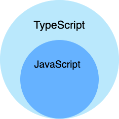

## Introduction

TypeScript 是 JavaScript 的一个超集，支持 ECMAScript 6 标准（ES6 教程）
TypeScript 由微软开发的自由和开源的编程语言，在 JavaScript 的基础上增加了静态类型检查的超集
TypeScript 设计目标是开发大型应用，它可以编译成纯 JavaScript，编译出来的 JavaScript 可以运行在任何浏览器上


TypeScript 是 JavaScript 的超集，扩展了 JavaScript 的语法，因此现有的 JavaScript 代码可与 TypeScript 一起工作无需任何修改，TypeScript 通过类型注解提供编译时的静态类型检查。
TypeScript 可处理已有的 JavaScript 代码，并只对其中的 TypeScript 代码进行编译


<div style="text-align: center;">



</div>

<p style="text-align: center;">
Fig.1. TypeScript 和 JavaScript
</p>


```typescript
const hello : string = "Hello World!"
console.log(hello)
```


## Links

