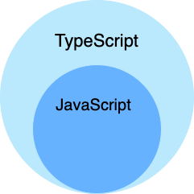

## Introduction

TypeScript 是 JavaScript 的**静态类型超集**，由微软在 2012 年发布（Anders Hejlsberg 主导）。它在 JS 之上叠加了一层可选的类型系统，编译产物是读得懂、调得动的纯 JavaScript，因此能跑在任何浏览器、任何 Node 版本上。设计目标是**大型应用的开发与维护**：让重构、跳转、重命名、跨模块契约检查在编译期完成，而不是等到运行时炸掉。

<div style="text-align: center;">



</div>

<p style="text-align: center;">
Fig.1. TypeScript 和 JavaScript
</p>

一句话概括它与 JS 的关系：**TypeScript 不发明运行时语义，只描述运行时行为**。所有语法糖最终都会降级成 JS，所有类型信息最终都会被擦除。

```typescript
const hello: string = "Hello World!"
console.log(hello)
```

## Three Design Constraints That Shaped It

TypeScript 的很多"不完美"其实不是设计失误，而是三条硬约束推出来的必然结果：

| 约束 | 内容 | 直接后果 |
|------|------|----------|
| 兼容 JS 生态 | 现有 JS 代码可直接使用，无需改写 | 必须容忍没类型的地方，`any`、`@ts-ignore` 成为基础设施 |
| 产出可读 JS | 编译产物要能调试、能被人读 | 不能做真正的运行时插入（除少数例外），只能**类型擦除** |
| 渐进采用 | 一个几千行的项目可以一个文件一个文件地迁移 | 类型系统必须是**可选（gradual）**的，且大面积生产 intentional soundness holes |

第三条是最关键的。一旦允许"部分有类型、部分没类型"，类型系统就必然**不健全（unsound）**——编译器说这段代码类型正确，运行时仍然可能踩空。TS 团队对此的态度非常明确：**优先保证开发体验和生态兼容，而不是数学上的完备性**。

这与 Java、Go、Rust 形成了鲜明对照：

| 语言 | 类型检查时机 | 类型是否健全 | 运行时是否保留类型 |
|------|-------------|-------------|------------------|
| TypeScript | 编译期（可选） | 否，存在 deliberate holes | 否，完全擦除 |
| Java | 编译期（强制） | 基本是（有数组协变、raw type 的历史包袱） | 部分（泛型擦除，基础类型保留） |
| Go | 编译期（强制） | 是 | 运行时有 reftype 元数据 |
| Rust | 编译期（强制） | 是 | 编译期消除 |

这个取舍对上层使用者有一个很实际的推论：**`interface` 和 `type` 在运行时完全不存在**。`typeof`、`instanceof`、`Array.isArray` 有运行时语义，`SomeInterface` 没有。想对外部输入做校验，必须在运行时再写一份 schema（zod、valibot、io-ts 这类库的存在意义就在于此），或者反过来让 schema 成为唯一真相源、用 `z.infer` 导出类型。

## The Precise Meaning of Type Erasure

```typescript
// 输入
interface User { id: number; name: string }
function greet(u: User): string {
  return `hi ${u.name}`
}

// tsc 输出（target: es2020）
function greet(u) {
  return `hi ${u.name}`
}
```

擦除发生的原因是类型不构成运行时语义的一部分：擦掉不影响程序做什么。少数例外值得记牢，因为它们是"TS 有、JS 没有"的运行残留：

| 语法 | 是否产生运行时代码 | 备注 |
|------|------------------|------|
| `interface` / `type` | 否 | 纯编译期 |
| 类型注解、泛型参数、访问修饰符 `private` | 否 | 擦除 |
| `enum`（非 const） | **是** | 会生成一个真实对象 |
| `namespace` | **是** | 生成嵌套对象与 IIFE |
| 参数属性 `constructor(private x: number)` | **是** | 会生成赋值语句 |
| 装饰器 | **是** | 生成额外调用逻辑 |

正因为这四项"擦不掉"，它们无法被**只做删类型的工具**（Node 的 `--experimental-strip-types`、esbuild 的 transform）正确处理。TS 5.8 为此引入了 `--erasableSyntaxOnly`，把这些"不可擦除语法"直接标为错误——一旦打开，你的代码就能被任何 type-stripping 工具链直接吃下。

### How Types Bypass tsc and Run Directly

TS 的类型擦除粒度足够简单，于是各类运行时选择跳过 `tsc` 直接strip：

| 运行时 / 工具 | 做法 | 代价 |
|------|------|------|
| Node.js 22.6+ | `--experimental-strip-types`，后续版本逐步默认开启 | 不检查类型，只删类型；不支持 enum / namespace |
| Deno | 原生支持 TS | 同上，需要先单独 `deno check` |
| Bun | 内置转译器 | 同上 |
| esbuild / swc | 极速 transform | 同上，且不支持 emitDecoratorMetadata 等复杂场景 |

这张表引出一个工程上常见的分工：`tsc --noEmit`（或 TS 7 的 check）负责**正确性**，esbuild / swc / Vite 负责**产出**，两者解耦。

## Version Evolution: From Self-Hosted to Go-Native

TypeScript 编译器前 14 年一直是**自托管（self-hosted）**的——用 TypeScript 写自己，编译成 JS 跑在 Node / V8 上。2025 年 3 月，微软宣布把整套编译器与语言服务移植到 Go，项目代号 **Corsa**（原 Strada 指代旧的 JS 实现）。这次移植在 2026 年落地：

| 时间 | 事件 |
|------|------|
| 2012-10 | TypeScript 首次发布 |
| 2020-08 | TypeScript 4.0，开始每年一个大版本稳定节奏 |
| 2025-03 | 宣布 Go 原生移植（Project Corsa） |
| 2025-05 | `@typescript/native-preview` 预览包发布，二进制名 `tsgo` |
| 2026-03 | TypeScript 6.0，基于旧 JS 代码库的**最后一个版本**，任务是清理、弃用、铺平迁移路径 |
| 2026-06-18 | TypeScript 7.0 RC，进入 npm 标准包 |
| 2026-07-08 | **TypeScript 7.0 GA**，编译器换成 Go 原生二进制 |
| 2026-08-20 | typescript-go 仓库合并回 microsoft/TypeScript 主线 |
| 2026-11（计划） | 7.1，补齐稳定的**编程式 API** |

TS 7 的核心事实，见 [TypeScript 编译器](/docs/CS/TypeScript/Compiler.md)：

- 全量构建相比 6.0 提速 **8~12 倍**，来源有二：原生二进制取代 VM 约 3~4 倍，真正的共享内存并行再带来 2~3 倍；
- 类型检查逻辑与 6.0 **结构完全相同**，语义刻意保持一致——这是一次移植，不是重新设计；
- 新增 `--checkers`（检查worker 数，默认 4）、`--builders`、`--singleThreaded` 控制并行；
- 6.0 的弃用项在 7.0 变成硬错误：ES5 target、AMD / UMD / SystemJS 模块、`moduleResolution: node10` 全部移除，**`strict` 与 `esnext` 成为默认值**；
- **没有稳定的编程式 API**，`typescript` 主入口不再导出 `createProgram` 等经典 API。这是当前最大的迁移阻塞点。

最后这条决定了大量项目的升级节奏，请先核对自己是否踩在这些位置上：

| 受影响的工具 | 状态 |
|------|------|
| typescript-eslint | 7.0 发布当日尚未支持，支持上限暂止于 6.x |
| ts-jest、ts-morph | 等待 7.1 |
| Vue / Volar、Svelte、Astro、MDX、Angular 模板类型检查 | 等待 7.1 |
| webpack loader（依赖 compiler API） | 等待 7.1 |

微软提供的过渡方案是 `@typescript/typescript6` 兼容包，它导出名为 `tsc6` 的可执行文件与 6.0 API，可与 TS 7 并行安装、逐项对比。只用 `tsc` 检查自己的代码的项目，基本可以当天升完；依赖上述工具链的，建议保留 6.x 作为 emit 真相源，等 7.1。

> [!WARNING]
> 从 6.0 平滑到 7.0 的前置条件是：在 6.0 下开启 `stableTypeOrdering`、不使用 `ignoreDeprecations`、且没有弃用告警。官方的做法是**先升 6.0 并清干净告警**，再跳 7.0。

## The Skeleton of the Type System

深入部分见 [TypeScript 类型系统](/docs/CS/TypeScript/TypeSystem.md)，这里只列决定日常写法的四条：

1. **结构化子类型（structural typing）**：两个类型只要结构兼容就互相赋值，不需要显式声明 `implements`。这与 Java / C# 的名义子类型相反，代价是某些本该报错的错误会漏过去，收益是对 JS 生态里的鸭子类型天然友好。
2. **控制流分析（CFA）**：类型不是静态挂在变量上的，而是随分支变化的。`if (typeof x === "string")` 之后 `x` 就是 `string`，这就是 narrowing。
3. **泛型 + `infer`**：TS 的类型层是一门函数式语言——有递归、有条件分支、有模式匹配，可以在编译期"计算"类型。类型体操由此而来，也由此容易失控。
4. **`any` 与 `unknown`**：`any` 关闭检查并具有传染性，`unknown` 是类型安全的顶层类型，必须先收窄才能用。**消灭 `any` 是 TS 工程收益的第一杠杆**。

## What It Solves, What It Doesn't

| 常见期待 | 实际情况 |
|----------|----------|
| 消除所有运行时崩溃 | 不能。null/undefined 由 `strictNullChecks` 管住，但外部输入、第三方数据、`as` 断言照样能炸 |
| 提升运行时性能 | 不会。类型被擦除，产出 JS 与手写 JS 等价，某些降级选项甚至更慢 |
| 替代单元测试 | 不能。类型证明的是"形状正确"，不是"逻辑正确" |
| 替代运行时参数校验 | 不能。边界上的脏数据要 schema 校验，或与 schema 双向绑定 |
| 让重构变安全 | **可以**，这是最大的真实收益 |
| 让跨模块契约显式化 | **可以**，尤其在 monorepo 与多人协作里 |

## Entry Point for Project Configuration

`tsconfig.json` 不是一个配置文件那么简单，它定义了**一个编译单元的边界**：哪些文件属于这个 program、这些文件的模块世界长什么样。TS 7 之后 `strict` 成为默认，理解 strict 家族每一项在管什么就更重要了。细节见 [tsconfig 工程配置](/docs/CS/TypeScript/Tsconfig.md)。

## Diagram of the Runtime Environment

```
   TypeScript (类型层，编译期)
        │  tsc / esbuild / swc 擦除类型
        ▼
   JavaScript
        │
        ├──► V8/SpiderMonkey/JSC  ──► 浏览器（DOM / Node 之外的宿主能力）
        ├──► Node.js ─────────────► 服务端（fs / net / process）
        ├──► Deno / Bun ──────────► 原生 TS 支持 + 内置工具链
        └──► Electron ────────────► Chromium + Node 桌面应用
```

TS 本身不定义任何运行时能力，它的运行时契约完全由宿主决定。这也是为什么 Node 侧的 TS 与浏览器侧的 TS 会有不同的 `lib`、不同的 `@types`。

## Links

- [TypeScript 类型系统](/docs/CS/TypeScript/TypeSystem.md)
- [TypeScript 编译器](/docs/CS/TypeScript/Compiler.md)
- [tsconfig 工程配置](/docs/CS/TypeScript/Tsconfig.md)
- [Nodejs](/docs/CS/front-end/Nodejs.md)
- [编程语言横向对比](/docs/CS/Languages.md)
- [Webpack](/docs/CS/front-end/Webpack.md)

## References

- [TypeScript 官方文档](https://www.typescriptlang.org/docs/)
- [TypeScript Handbook](https://www.typescriptlang.org/docs/handbook/intro.html)
- [Announcing TypeScript 7.0](https://devblogs.microsoft.com/typescript/announcing-typescript-7-0/)
- [microsoft/typescript-go](https://github.com/microsoft/typescript-go)
- [TypeScript 7.0 Release Notes](https://typescriptdocs.com/release-notes/TypeScript%207.0)
- [TypeScript Roadmap](https://github.com/microsoft/TypeScript/wiki/Roadmap)
