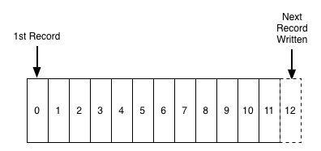
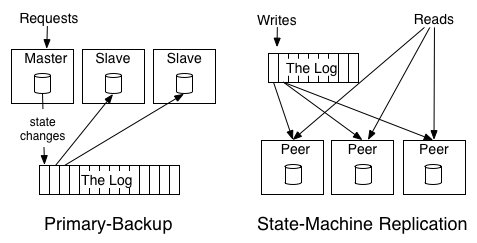

## Introduction

A log is perhaps the simplest possible storage abstraction. It is an append-only, totally-ordered sequence of records ordered by time.

Fig.1. Records are appended to the end of the log, and reads proceed left-to-right. Each entry is assigned a unique sequential log entry number.

The ordering of records defines a notion of "time" since entries to the left are defined to be older then entries to the right.
The log entry number can be thought of as the "timestamp" of the entry.
Describing this ordering as a notion of time seems a bit odd at first, but it has the convenient property that it is decoupled from any particular physical clock.
This property will turn out to be essential as we get to distributed systems.

> [Time](/docs/CS/Distributed/Time.md)

The contents and format of the records aren't important for the purposes of this discussion.
Also, we can't just keep adding records to the log as we'll eventually run out of space.
I'll come back to this in a bit.
 
So, a log is not all that different from a file or a table.
A file is an array of bytes, a table is an array of records, and a log is really just a kind of table or file where the records are sorted by time.

Every programmer is familiar with another definition of logging—the unstructured error messages or trace info an application might write out to a local file using syslog or log4j.
For clarity I will call this "application logging". The application log is a degenerative form of the log concept I am describing.
The biggest difference is that text logs are meant to be primarily for humans to read and the "journal" or "data logs" I'm describing are built for programmatic access.

### Logs in databases

The usage in databases has to do with keeping in sync the variety of data structures and indexes in the presence of crashes.
To make this atomic and durable, a database uses a log to write out information about the records they will be modifying, before applying the changes to all the various data structures it maintains.
The log is the record of what happened, and each table or index is a projection of this history into some useful data structure or index.
Since the log is immediately persisted it is used as the authoritative source in restoring all other persistent structures in the event of a crash.

Over-time the usage of the log grew from an implementation detail of ACID to a method for replicating data between databases.
It turns out that the sequence of changes that happened on the database is exactly what is needed to keep a remote replica database in sync.
Oracle, MySQL, and PostgreSQL include log shipping protocols to transmit portions of log to replica databases which act as slaves.
Oracle has productized the log as a general data subscription mechanism for non-oracle data subscribers with their XStreams and GoldenGate and similar facilities in MySQL and PostgreSQL are key components of many data architectures.

Because of this origin, the concept of a machine readable log has largely been confined to database internals.
The use of logs as a mechanism for data subscription seems to have arisen almost by chance.
But this very abstraction is ideal for supporting all kinds of messaging, data flow, and real-time data processing.

### Logs in distributed systems

The two problems a log solves—ordering changes and distributing data—are even more important in distributed data systems.
Agreeing upon an ordering for updates (or agreeing to disagree and coping with the side-effects) are among the core design problems for these systems.

The log-centric approach to distributed systems arises from a simple observation that I will call the [State Machine Replication Principle](/docs/CS/Distributed/Consensus.md?id=Replicated-State-Machines).

> If two identical, deterministic processes begin in the same state and get the same inputs in the same order, they will produce the same output and end in the same state.

The bit about getting the same input in the same order should ring a bell—that is where the log comes in.
This is a very intuitive notion: if you feed two deterministic pieces of code the same input log, they will produce the same output.

The application to distributed computing is pretty obvious.
You can reduce the problem of making multiple machines all do the same thing to the problem of implementing a distributed consistent log to feed these processes input.
The purpose of the log here is to squeeze all the non-determinism out of the input stream to ensure that each replica processing this input stays in sync.

One of the beautiful things about this approach is that the time stamps that index the log now act as the clock for the state of the replicas—you can describe each replica by a single number, the timestamp for the maximum log entry it has processed.
This timestamp combined with the log uniquely captures the entire state of the replica.

There are a multitude of ways of applying this principle in systems depending on what is put in the log.
For example, we can log the incoming requests to a service, or the state changes the service undergoes in response to request, or the transformation commands it executes.
Theoretically, we could even log a series of machine instructions for each replica to execute or the method name and arguments to invoke on each replica.
As long as two processes process these inputs in the same way, the processes will remaining consistent across replicas.

Different groups of people seem to describe the uses of logs differently. Database people generally differentiate between physical and logical logging.
Physical logging means logging the contents of each row that is changed.
Logical logging means logging not the changed rows but the SQL commands that lead to the row changes (the insert, update, and delete statements).

The distributed systems literature commonly distinguishes two broad approaches to processing and replication.
The "state machine model" usually refers to an active-active model where we keep a log of the incoming requests and each replica processes each request.
A slight modification of this, called the "primary-backup model", is to elect one replica as the leader and allow this leader to process requests in the order they arrive and log out the changes to its state from processing the requests.
The other replicas apply in order the state changes the leader makes so that they will be in sync and ready to take over as leader should the leader fail.

To understand the difference between these two approaches, let's look at a toy problem.
Consider a replicated "arithmetic service" which maintains a single number as its state (initialized to zero) and applies additions and multiplications to this value.
The active-active approach might log out the transformations to apply, say "+1", "*2", etc. Each replica would apply these transformations and hence go through the same set of values.
The "active-passive" approach would have a single master execute the transformations and log out the result, say "1", "3", "6", etc.
This example also makes it clear why ordering is key for ensuring consistency between replicas: reordering an addition and multiplication will yield a different result.

The distributed log can be seen as the data structure which models the problem of consensus.
A log, after all, represents a series of decisions on the "next" value to append.
You have to squint a little to see a log in the Paxos family of algorithms, though log-building is their most common practical application.
With Paxos, this is usually done using an extension of the protocol called "multi-paxos", which models the log as a series of consensus problems, one for each slot in the log.
The log is much more prominent in other protocols such as ZAB, RAFT, and Viewstamped Replication, which directly model the problem of maintaining a distributed, consistent log.

In the remainder of this article I will try to give a flavor of what a log is good for that goes beyond the internals of distributed computing or abstract distributed computing models. This includes:

- Data Integration—Making all of an organization's data easily available in all its storage and processing systems.
- Real-time data processing—Computing derived data streams.
- Distributed system design—How practical systems can by simplified with a log-centric design.

These uses all resolve around the idea of a log as a stand-alone service.

In each case, the usefulness of the log comes from simple function that the log provides: producing a persistent, re-playable record of history. Surprisingly, at the core of these problems is the ability to have many machines playback history at their own rate in a deterministic manner.

## Data Integration

Data integration is making all the data an organization has available in all its services and systems.

Two trends make data integration harder.

- The first trend is the rise of event data.
- The second trend comes from the explosion of specialized data systems that have become popular and the combination of more data of more varieties and a desire to get this data into more systems leads to a huge data integration problem.

The log is the natural data structure for handling data flow between systems.
The recipe is very simple: Take all the organization's data and put it into a central log for real-time subscription.

Each logical data source can be modeled as its own log. A data source could be an application that logs out events (say clicks or page views), or a database table that accepts modifications.
Each subscribing system reads from this log as quickly as it can, applies each new record to its own store, and advances its position in the log.
Subscribers could be any kind of data system—a cache, Hadoop, another database in another site, a search system, etc.

The log also acts as a buffer that makes data production asynchronous from data consumption.
This is important for a lot of reasons, but particularly when there are multiple subscribers that may consume at different rates.
This means a subscribing system can crash or go down for maintenance and catch up when it comes back: the subscriber consumes at a pace it controls.
A batch system such as Hadoop or a data warehouse may consume only hourly or daily, whereas a real-time query system may need to be up-to-the-second.
Neither the originating data source nor the log has knowledge of the various data destination systems, so consumer systems can be added and removed with no change in the pipeline.

Of particular importance: the destination system only knows about the log and not any details of the system of origin.
The consumer system need not concern itself with whether the data came from an RDBMS, a new-fangled key-value store, or was generated without a real-time query system of any kind.
This seems like a minor point, but is in fact critical.

I use the term "log" here instead of "messaging system" or "pub sub" because it is a lot more specific about semantics and a much closer description of what you need in a practical implementation to support data replication.
I have found that "publish subscribe" doesn't imply much more than indirect addressing of messages—if you compare any two messaging systems promising publish-subscribe, you find that they guarantee very different things, and most models are not useful in this domain.
You can think of the log as acting as a kind of messaging system with durability guarantees and strong ordering semantics.
In distributed systems, this model of communication sometimes goes by the (somewhat terrible) name of [atomic broadcast]().

## Real-time Stream Processing

But shlepping bytes between storage systems is not the end of the story. It turns out that "log" is another word for "stream" and logs are at the heart of stream processing.

What exactly is stream processing?

## Log Compaction

## References

1. [The Log: What every software engineer should know about real-time data's unifying abstraction](https://engineering.linkedin.com/distributed-systems/log-what-every-software-engineer-should-know-about-real-time-datas-unifying)
