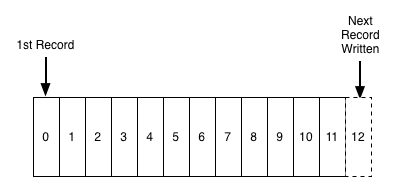
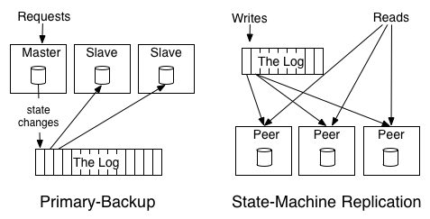

## Introduction

日志可能是最简单的存储抽象。它是一个仅追加的、完全按时间排序的记录序列。

Fig.1. Records are appended to the end of the log, and reads proceed left-to-right. Each entry is assigned a unique sequential log entry number.

记录的排序定义了一种"时间"概念，因为左侧的条目被定义为比右侧的条目更旧。
日志条目编号可以被视为条目的"时间戳"。
将这种排序描述为时间概念起初看起来有点奇怪，但它有一个方便的特性：它与任何特定的物理时钟解耦。
当我们进入分布式系统时，这个特性将被证明是至关重要的。

> [Time](/docs/CS/Distributed/Time.md)

记录的内容和格式对于当前讨论的目的并不重要。
此外，我们不能一直向日志添加记录，因为最终会耗尽空间。
我稍后会回到这个问题上。
 
所以，日志与文件或表并没有太大区别。
文件是一个字节数组，表是一个记录数组，而日志实际上只是一种按时间排序的表或文件。

每个程序员都熟悉日志记录的另一种定义——应用程序可能使用 syslog 或 log4j 写入本地文件的无结构错误消息或跟踪信息。
为了清晰起见，我将其称为"应用程序日志"。应用程序日志是我所描述的日志概念的一种退化形式。
最大的区别在于文本日志主要是供人类阅读的，而我描述的"日志"或"数据日志"是为程序化访问而构建的。

### Logs in databases

在数据库中，日志的用途与在崩溃情况下保持各种数据结构和索引的同步有关。
为了使其原子性和持久性，数据库使用日志来写出将要修改的记录信息，然后再将更改应用到它维护的各种数据结构中。
日志是发生的事情的记录，每个表或索引都是此历史记录到某些有用数据结构或索引的投影。
由于日志是立即持久化的，因此在崩溃时它被用作恢复所有其他持久结构的权威来源。

随着时间的推移，日志的用途从 ACID 的实现细节发展到数据库之间复制数据的方法。
事实证明，数据库中发生的更改序列正是保持远程副本数据库同步所需的。
Oracle、MySQL 和 PostgreSQL 包含日志传输协议，用于将日志部分传输到充当从库的副本数据库。
Oracle 已将其日志产品化为通用数据订阅机制，用于非 Oracle 数据订阅者，其 XStreams 和 GoldenGate，以及 MySQL 和 PostgreSQL 中的类似设施是许多数据架构的关键组件。

由于这个起源，机器可读日志的概念很大程度上局限于数据库内部。
将日志用作数据订阅机制似乎是偶然出现的。
但这种抽象非常适合支持各种消息传递、数据流和实时数据处理。

### Logs in distributed systems

日志解决的两个问题——排序更改和分发数据——在分布式数据系统中更为重要。
就更新顺序达成一致（或同意分歧并应对副作用）是这些系统的核心设计问题之一。

以日志为中心的分布式系统方法源于一个简单的观察，我称之为状态机复制原则。

> If two identical, deterministic processes begin in the same state and get the same inputs in the same order, they will produce the same output and end in the same state.

关于以相同顺序获得相同输入的部分应该引起注意——这就是日志发挥作用的地方。
这是一个非常直观的概念：如果你用相同的输入日志提供两个确定性的代码片段，它们将产生相同的输出。

应用于分布式计算是相当明显的。
你可以将让多台机器做同一件事的问题简化为实现一个分布式一致日志来为这些进程提供输入的问题。
日志在这里的目的是压缩输入流中的所有非确定性，以确保处理此输入的每个副本保持同步。

这种方法的一个美妙之处在于，索引日志的时间戳现在充当了副本状态的时钟——你可以用一个单一的数字来描述每个副本，即它已处理的最大日志条目的时间戳。
这个时间戳与日志结合起来唯一地捕获了副本的完整状态。

根据日志中放置的内容，有许多方法可以在系统中应用这一原则。
例如，我们可以记录服务的传入请求，或服务响应请求而经历的状态变化，或它执行的转换命令。
理论上，我们甚至可以记录一系列机器指令供每个副本执行，或在每个副本上调用的方法名称和参数。
只要两个进程以相同的方式处理这些输入，进程就会在副本之间保持一致。

不同的人群似乎对日志的用途有不同的描述。数据库人员通常区分物理日志和逻辑日志。
物理日志意味着记录每个被更改行的内容。
逻辑日志意味着不记录更改的行，而是记录导致行更改的 SQL 命令（insert、update 和 delete 语句）。

分布式系统文献通常区分两种广泛的处理和复制方法。
"状态机模型"通常指一种主动-主动模型，其中我们保留传入请求的日志，每个副本处理每个请求。
这种模型的一个轻微变体称为"主-备模型"，其中选举一个副本作为 leader，允许该 leader 按请求到达的顺序处理请求，并记录处理请求后其状态的变化。
其他副本按顺序应用 leader 所做的状态更改，以便它们保持同步并准备好在 leader 失败时接管成为 leader。

为了理解这两种方法之间的区别，让我们看一个玩具问题。
考虑一个复制的"算术服务"，它维护一个单一数字作为其状态（初始化为零），并对该值应用加法和乘法。
主动-主动方法可能会记录要应用的转换，例如"+1"、"*2"等。每个副本将应用这些转换，从而经历相同的值集。
"主动-被动"方法将有一个单一的 master 执行转换并记录结果，例如"1"、"3"、"6"等。
这个例子也清楚地说明了为什么排序对于确保副本之间的一致性至关重要：重新排序加法和乘法将产生不同的结果。

分布式日志可以被看作是对共识问题进行建模的数据结构。
毕竟，日志代表了一系列关于"下一个"要追加的值的决策。
你需要稍微眯起眼睛才能在 Paxos 系列算法中看到日志，尽管构建日志是它们最常见的实际应用。
使用 Paxos，这通常是通过称为"multi-paxos"的协议扩展来完成的，它将日志建模为一系列共识问题，每个日志槽一个。
在其他协议如 ZAB、RAFT 和 Viewstamped Replication 中，日志更为突出，这些协议直接建模维护分布式一致日志的问题。

在本文的其余部分，我将尝试说明日志的用途，这些用途超出了分布式计算内部或抽象分布式计算模型的范围。这包括：

- 数据集成——使组织的所有数据在其所有存储和处理系统中易于可用。
- 实时数据处理——计算派生数据流。
- 分布式系统设计——如何通过以日志为中心的设计来简化实际系统。

这些用途都围绕着将日志作为独立服务的概念。

在每种情况下，日志的实用性都来自于日志提供的简单功能：生成持久的、可重放的历史记录。
令人惊讶的是，这些问题的核心在于让许多机器能够以确定性的方式以自己的速度重放历史记录的能力。

## Data Integration

数据集成是使组织拥有的所有数据在其所有服务和系统中可用。

有两个趋势使数据集成变得更加困难。

- 第一个趋势是事件数据的兴起。
- 第二个趋势来自于专业数据系统的激增，以及更多种类的更多数据以及将这些数据导入更多系统的愿望，导致了巨大的数据集成问题。

日志是处理系统间数据流的自然数据结构。
方法非常简单：将组织的所有数据放入一个中央日志以供实时订阅。

每个逻辑数据源都可以建模为自己的日志。数据源可以是记录事件的应用程序（例如点击或页面浏览），也可以是接受修改的数据库表。
每个订阅系统尽可能快地从此日志读取，将每个新记录应用到自己的存储，并在日志中推进其位置。
订阅者可以是任何类型的数据系统——缓存、Hadoop、另一个站点中的另一个数据库、搜索系统等。

日志还充当缓冲区，使数据生产与数据消费异步。
这有很多原因很重要，特别是当有多个可能以不同速率消费的订阅者时。
这意味着订阅系统可以崩溃或停机进行维护，并在恢复时赶上：订阅者以它控制的速度消费。
批处理系统如 Hadoop 或数据仓库可能每小时或每天消费一次，而实时查询系统可能需要保持最新。
无论是原始数据源还是日志都了解各种数据目标系统，因此可以添加和删除消费者系统而无需更改管道。

特别重要的是：目标系统只了解日志，而不了解源系统的任何细节。
消费者系统无需关心数据是来自 RDBMS、新型键值存储，还是在没有任何实时查询系统的情况下生成的。
这似乎是一个小点，但实际上至关重要。

我在这里使用"日志"而不是"消息系统"或"发布订阅"，因为它在语义上更具体，并且更接近于你在实际实现中支持数据复制所需的内容。
我发现"发布订阅"并不比间接消息寻址暗示更多——如果你比较任何两个承诺发布订阅的消息系统，你会发现它们保证的东西非常不同，而且大多数模型在此领域并不有用。
你可以将日志视为一种具有持久性保证和强排序语义的消息系统。
在分布式系统中，这种通信模型有时被称为原子广播。

## Real-time Stream Processing

但是在存储系统之间搬运字节并不是故事的终点。事实证明，"日志"是"流"的另一个词，而日志是流处理的核心。

究竟什么是流处理？

## Log Compaction

## References

1. [The Log: What every software engineer should know about real-time data's unifying abstraction](https://engineering.linkedin.com/distributed-systems/log-what-every-software-engineer-should-know-about-real-time-datas-unifying)
