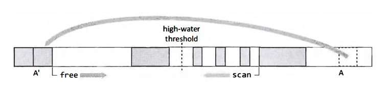

## Introduction

Almost all modern programming languages make use of dynamic memory allocation.
This allows objects to be allocated and deallocated even if their total size was not known at the time that the program was compiled,
and if their lifetime may exceed that of the subroutine activation1 that allocated them.
A dynamically allocated object is stored in a heap, rather than on the `stack` (in the `activation record` or `stack frame` of the procedure that allocated it)
or `statically` (whereby the name of an object is bound to a storage location known at compile or link time).

Heap allocation is particularly important because it allows the programmer:

- to choose dynamically the size of new objects (thus avoiding program failure through exceeding hard-coded limits on arrays);
- to define and use recursive data structures such as lists, trees and maps;
- to return newly created objects to the parent procedure (allowing, for example, factory methods);
- to return a function as the result of another function (for example, closures or suspensions in functional languages).

Heap allocated objects are accessed through `references`.
Typically, a reference is a pointer to the object (that is, the address in memory of the object).
However, a reference may alternatively refer to an object only indirectly, for instance through a handle which in turn points to the object.
Handles offer the advantage of allowing an object to be relocated (updating its handle) without having to change every reference to that object/handle throughout the program.

**Memory used by heap objects can be reclaimed using *explicit deallocation* (for example, with C's `free` or C++'s `delete` operator) or automatically by the run-time system, using reference counting or a tracing garbage collector.**

### Explicit deallocation

Manual reclamation risks programming errors; these may arise in two ways.

- Memory may be freed prematurely, while there are still references to it. Such a reference is called a `dangling pointer`.
- The second kind of error is that the programmer may fail to free an object no longer required by the program, leading to a `memory leak`.

Programming errors of this kind are particularly prevalent in the presence of sharing, when two or more subroutines may hold references to an object.
This is even more problematic for concurrent programming when two or more threads may reference an object.
With the increasing ubiquity of multicore processors, considerable effort has gone into the construction of libraries of data structures that are thread-safe.
Algorithms that access these structures need to guard against a number of problems, including deadlock, livelock and ABA3 errors.
Automatic memory management eases the construction of concurrent algorithms significantly (for example, by eliminating certain ABA problems).
Without this, programming solutions are much more complicated.

The issue is more fundamental than simply being a matter of programmers needing to take more care.
Difficulties of correct memory management are often inherent to the programming problem in question.
More generally, safe deallocation of an object is complex because, as Wilson points out, "**liveness is a global property**", whereas the decision to call `free` on a variable is a local one.

So how do programmers cope in languages not supported by automatic dynamic memory management?
The key advice has been to be consistent in the way that they manage the `ownership` of objects.
Belotsky and others offer several possible strategies for C++.

- First, programmers should avoid heap allocation altogether, wherever possible. For example, objects can be allocated on the stack instead.
  When the objects' creating method returns, the popping of the stack will free these objects automatically.
- Secondly, programmers should pass and return objects by value, by copying the full contents of a parameterIresult rather than by passing references.
  Clearly both of these approaches remove all allocation/deallocation errors but they do so at the cost of both increased memory pressure and the loss of sharing.
- In some circumstances it may be appropriate to use custom allocators, for example, that manage a pool of objects.
  At the end of a program phase, the entire pool can be freed as a whole.

C++ has seen several attempts to use special pointer classes and templates to improve memory management.
These overload normal pointer operations in order to provide safe storage reclamation.
However, such smart pointers have several limitations.
The aut o_pt r class template cannot be used with the Standard Template Library and will be deprecated in the expected next edition of the C++ standard.
It will be replaced by an improved `unique_ptr` that provides strict ownership semantics that allow the target object to be deleted when the unique pointer is.
The standard will also include a reference counted `shared_ptr`, but these also have limitations.
Reference counted pointers are unable to manage self-referential (cyclic) data structures.
Most smart pointers are provided as libraries, which restricts their applicability if efficiency is a concern.
Possibly, they are most appropriately used to manage very large blocks, references to which are rarely assigned or passed, in which case they might be significantly cheaper than tracing collection.
On the other hand, without the cooperation of the compiler and run-time system, reference counted pointers are not an efficient, general purpose solution to the management of small objects, especially if pointer manipulation is to be thread-safe.

The plethora of strategies for safe manual memory management throws up yet another problem.
If it is essential for the programmer to manage object ownership consistently, which approach should she adopt? This is particularly problematic when using library code.
Which approach does the library take? Do all the libraries used by the program use the same approach?

### Automatic dynamic memory management

The advantages that garbage collected languages offer to software development are legion.
It eliminates whole classes of bugs, such as attempting to follow dangling pointers that still refer to memory that has been reclaimed or worse, reused in another context.
It is no longer possible to free memory that has already been freed.
It reduces the chances of programs leaking memory, although it cannot cure all errors of this kind.
It greatly simplifies the construction and use of concurrent data structures.
Above all, the abstraction offered by garbage collection provides for better software engineering practice.
It simplifies user interfaces and leads to code that is easier to understand and to maintain, and hence more reliable.
By removing memory management worries from interfaces, it leads to code that is easier to reuse.

Automatic dynamic memory management resolves many of these issues.
`Garbage collection`(GC) prevents dangling pointers being created: an object is reclaimed only when there is no pointer to it from a reachable object.
Conversely, in principle all garbage is guaranteed to be freed - any object that is unreachable will eventually be reclaimed by the collector - with two caveats.

- The first is that `tracing collection` uses a definition of 'garbage' that is decidable and may not include all objects that will never be accessed again.
- The second is that in practice, garbage collector implementations may choose for efficiency reasons not to reclaim some objects.
  Only the collector releases objects so the `double-freeing` problem cannot arise.
  All reclamation decisions are deferred to the collector, which has global knowledge of the structure of objects in the heap and the threads that can access them.
  The problems of explicit deallocation were largely due to the difficulty of making a global decision in a local context.
  Automatic dynamic memory management simply finesses this problem

Above all, memory management is a software engineering issue.
Well-designed programs are built from components (in the loosest sense of the term) that are highly cohesive and loosely coupled.
Increasing the cohesion of modules makes programs easier to maintain.
Ideally, a programmer should be able to understand the behaviour of a module from the code of that module alone, or at worst a few closely related modules.
Reducing the coupling between modules means that the behaviour of one module is not dependent on the implementation of another module.
As far as correct memory management is concerned, this means that modules should not have to know the rules of the memory management game played by other modules.
In contrast, *explicit memory management* goes against sound software engineering principles of minimal communication between components;
it clutters interfaces, either explicitly through additional parameters to communicate ownership rights, or implicitly by requiring programmers to conform to particular idioms.
Requiring code to understand the rules of engagement limits the reusability of components.

The key argument in favour of garbage collection is not just that it **simplifies coding** - which it does -
but that it uncouples the problem of memory management from interfaces, rather than scattering it throughout the code. **It improves reusability.**

We do not claim that garbage collection is a *silver bullet* that will eradicate all memoryrelated programming errors or that it is applicable in all situations.
Although garbage collection tends to reduce the chance of memory leaks, it does not guarantee to eliminate them.
It has no answer to the problem of a data structure that is still reachable,
but grows without limit (for example, if a programmer repeatedly adds data to a cache but never removes objects from that cache),
or that is reachable and simply never accessed again.

Automatic dynamic memory management is designed to do just what it says.
Nevertheless, the problem of *general resource management* in a garbage collected language is a substantial one.
With explicitly-managed systems there is a straightforward and natural coupling between memory reclamation and the disposal of other resources.
Automatic memory management introduces the problem of how to structure resource management in the absence of a natural coupling.
However, it is interesting to observe that many resource release scenarios require something akin to a collector in order to detect whether the resource is still in use(reachable) from the rest of the program.

### Comparing garbage collection algorithms

Unfortunately, it is never possible to identify a 'best' collector for all configurations.
Comparisons are difficult in both principle and practice.
Details of implementation, locality and the practical significance of the constants in algorithmic complexity formulae make them less than perfect guides to practice.
Moreover, the metrics are not independent variables.
Not only does the performance of an algorithm depend on the topology and volume of objects in the heap, but also on the access patterns of the application.
Worse, the tuning options in production virtual machines are inter-connected.

**Safety**

The prime consideration is that garbage collection should be safe: the collector must never reclaim the storage of live objects.
However, safety comes with a cost, particularly for concurrent collectors. The safety of conservative collection, which receives no assistance from the compiler or run-time system, may in principle be vulnerable to certain compiler optimisations that disguise pointers.

**Throughput**

A common goal for end users is that their programs should run faster. However, there
are several aspects to this. One is that the overall time spent in garbage collection should
be as low as possible. This is commonly referred to in the literature as the mark/cons ratio,
comparing the early Lisp activities of the collector ('marking' live objects) and the mutator
(creating or 'consing' new list cells). However, the user is most likely to want the application as a whole (mutator plus collector) to execute in as little time as possible. In most well
designed configurations, much more CPU time is spent in the mutator than the collector.
Therefore it may be worthwhile trading some collector performance for increased mutator
throughput. For example, systems managed by mark-sweep collection occasionally perform more expensive compacting phases in order to reduce fragmentation so as to improve
mutator allocation performance (and possibly mutator performance more generally).

**Completeness and promptness**

Ideally, garbage collection should be complete: eventually, all garbage in the heap should be
reclaimed. However, this is not always possible nor even desirable. Pure reference counting collectors, for example, are unable to reclaim cyclic garbage (self-referential structures).
For performance reasons, it may be desirable not to collect the whole heap at every collection cycle. For example, generational collectors segregate objects by their age into two or
more regions called generations (we discuss generational garbage collection in Chapter 9).
By concentrating effort on the youngest generation, generational collectors can both improve total collection time and reduce the average pause time for individual collections.

Concurrent collectors interleave the execution of mutators and collectors; the goal of
such collectors is to avoid, or at least bound, interruptions to the user program. One consequence is that objects that become garbage after a collection cycle has started may not be
reclaimed until the end of the next cycle; such objects are calledfloating garbage.
Hence, in a concurrent setting it may be more appropriate to define completeness as eventual reclamation of all garbage, as opposed to reclamation within one cycle.
Different collection algorithms may vary in their promptness of reclamation, again leading to time/space trade-offs.

**Pause time**

On the other hand, an important requirement may be to minimise the collector's intrusion on program execution. Many collectors introduce pauses into a program's execution
because they stop all mutator threads while collecting garbage. It is clearly desirable to
make these pauses as short as possible. This might be particularly important for interactive applications or servers handling transactions (when failure to meet a deadline might
lead to the transaction being retried, thus building up a backlog of work). However, mechanisms for limiting pause times may have side-effects, as we shall see in more detail in
later chapters. For example, generational collectors address this goal by frequently and
quickly collecting a small nursery region, and only occasionally collecting larger, older
generations. Clearly, when tuning a generational collector, there is a balance to be struck
between the sizes of the generations, and hence not only the pause times required to collect
different generations but also the frequency of collections. However, because the sources
of some inter-generational pointers must be recorded, generational collection imposes a
small tax on pointer write operations by the mutator.
Parallel collectors stop the world to collect but reduce pause times by employing multiple threads. Concurrent and incremental collectors aim to reduce pause times still further
by occasionally performing a small quantum of collection work interleaved or in parallel
with mutator actions. This too requires taxation of the mutator in order to ensure correct
synchronisation between mutators and collectors. As we shall see in Chapter 15, there are
different ways to handle this synchronisation. The choice of mechanism affects both space
and time costs. It also affects termination of a garbage collection cycle. The cost of the
taxation on mutator time depends on how and which manipulations of the heap by the
mutator (loads or stores) are recorded. The costs on space, and also collector termination,
depends on how much floating garbage (see below) a system tolerates. Multiple mutator and collector threads add to the complexity. In any case, decreasing pause time will
increase overall processing time (decrease processing rate).
Maximum or average pause times on their own are not adequate measures. It is also
important that the mutator makes progress. The distribution of pause times is therefore
also of interest. There are a number of ways that pause time distributions may be reported.
The simplest might be a measure ofvariation such as standard deviation or a graphical representation of the distribution. More interesting measures include minimum mutator utilisation (MMU) and bounded mutator utilisation (BMU). Both the MMU [Cheng and Blelloch,
2001) and BMU [Sachindran et al, 2004] measures seek to display concisely the (minimum)
fraction of time spent in the mutator, for any given time window. The x-axis of Figure 1.2
represents time, from 0 to total execution time, and its y-axis the fraction of CPU time spent
in the mutator (utilisation). Thus, not only do MMU and BMU curves show total garbage
collection time as a fraction of overall execution time (the y-intercept, at the top right of the
curves is the mutators' overall share of processor time), but they also show the maximum
pause time (the longest window for which the mutator's CPU utilisation is zero) as the
x-intercept. In general, curves that are higher and more to the left are preferable since they
tend towards a higher mutator utilisation for a smaller maximum pause. Note that the
MMU is the minimum mutator utilisation (y) in any time window (x). As a consequence
it is possible for a larger window to have a lower MMU than a smaller window, leading
to dips in the curve. In contrast, BMU curves give the MMU in that time window or any
larger one. Monotonically increasing BMU curves are perhaps more intuitive than MMU.

Figure 1.2: Minimum mutator utilisation and bounded mutator utilisation
curves display concisely the (minimum) fraction of time spent in the mutator,
for any given time window. MMU is the minimum mutator utilisation (y)
in any time window (x) whereas BMU is minimum mutator utilisation in
that time window or any larger one. In both cases, the x-intercept gives the
maximum pause time and the y-intercept is the overall fraction of processor
time used by the mutator.

**Space overhead**

The goal of memory management is safe and efficient use of space. Different memory
managers, both explicit and automatic, impose different space overheads. Some garbage
collectors may impose per-object space costs (for example, to store reference counts); others may be able to smuggle these overheads into objects' existing layouts (for example, a
mark bit can often be hidden in a header word, or a forwarding pointer may be written
over user data). Collectors may have a per-heap space overhead. For example, copying
collectors divide the heap into two semispaces. Only one semispace is available to the mutator at any time; the other is held as a copy reserve into which the collector will evacuate
live objects at collection time. Collectors may require auxiliary data structures. Tracing
collectors need mark stacks to guide the traversal of the pointer graph in the heap; they
may also store mark bits in separate bitmap tables rather than in the objects themselves.
Concurrent collectors, or collectors that divide the heap into independently collected regions, require remembered sets that record where the mutator has changed the value of
pointers, or the locations of pointers that span regions, respectively

**Optimisations for specific languages**

Garbage collection algorithms can also be characterised by their applicability to different
language paradigms. Functional languages in particular have offered a rich vein for optimisations related to memory management. Some languages, such as ML, distinguish
mutable from immutable data. Pure functional languages, such as Haskell, go further and
do not allow the user to modify any values (programs are referentially transparent). Internally, however, they typically update data structures at most once (from a 'thunk' to weak head normal form); this gives multi-generation collectors opportunities to promote fully
evaluated data structures eagerly (see Chapter 9). Authors have also suggested complete
mechanisms for handling cyclic data structures with reference counting. Declarative languages may also allow other mechanisms for efficient management of heap spaces. Any
data created in a logic language after a 'choice point' becomes unreachable after the program backtracks to that point. With a memory manager that keeps objects laid out in the
heap in their order of allocation, memory allocated after the choice point can be reclaimed
in constant time. Conversely, different language definitions may make specific requirements of the collector. The most notable are the ability to deal with a variety of pointer
strengths and the need for the collector to cause dead objects to be finalised.

**Scalability and portability**

The final metrics we identify here are scalability and portability. With the increasing prevalence of multicore hardware on the desktop and even laptop (rather than just in large
servers), it is becoming increasingly important that garbage collection can take advantage
of the parallel hardware on offer. Furthermore, we expect parallel hardware to increase
in scale (number of cores and sockets) and for heterogeneous processors to become more
common. The demands on servers are also increasing, as heap sizes move into the tens
or hundreds of gigabytes scale and as transaction loads increase. A number of collection
algorithms depend on support from the operating system or hardware (for instance, by
protecting pages or by double mapping virtual memory space, or on the availability of
certain atomic operations on the processor). Such techniques are not necessarily portable.

### performance disadvantage

Nevertheless, a long running criticism of garbage collection has been that it is slow compared to explicit memory management and imposes unacceptable overheads,
both in terms of overall throughput and in pauses for garbage collection.
While it is true that automatic memory management does impose a performance penalty on the program, it is not as much as is commonly assumed.

Although, as expected, results varied between both collectors and explicit allocators, Hertz *et al* found garbage collectors could match the
execution time performance of explicit allocation provided they were given a sufficiently large heap (five times the minimum required).
For more typical heap sizes, the garbage collection overhead increased to 17% on average.

### Terminology and notation

##### The heap

The heap is either a contiguous array of memory words or organised into a set of discontiguous blocks of contiguous words. A granule is the smallest unit of allocation, typically a word or double-word, depending on alignment requirements. A chunk is a large contiguous group of granules. A cell is a generally smaller contiguous group of granules and may
be allocated or free, or even wasted or unusable for some reason.

A block is an aligned chunk of a particular size, usually a power of two. For completeness we mention also that a frame (when not referring to a stack frame) means a large
2k sized portion of address space, and a space is a possibly discontiguous collection of
chunks, or even objects, that receive similar treatment by the system. A page is as defined
by the hardware and operating system's virtual memory mechanism, and a cache line (or
cache block) is as defined by its cache. A card is a 2k aligned chunk, smaller than a page,
related to some schemes for remembering cross-space pointers (Section 11 .8).
The heap is often characterised as an object graph, which is a directed graph whose nodes
are heap objects and whose directed edges are the references to heap objects stored in their
fields. An edge is a reference from a source node or a root (see below) to a destination node.

##### The mutator and the collector

Following Dijkstra et al, a garbage-collected program is divided into two semiindependent parts.

- The mutator executes application code, which allocates new objects and mutates the
  object graph by changing reference fields so that they refer to different destination
  objects. These reference fields may be contained in heap objects as well as other
  places known as roots, such as static variables, thread stacks, and so on. As a result
  of such reference updates, any object can end up disconnected from the roots, that is,
  unreachable by following any sequence of edges from the roots.
- The collector executes garbage collection code, which discovers unreachable objects and reclaims their storage.

A program may have more than one mutator thread, but the threads together can usually be thought of as a single actor over the heap. Equally, there may be one or more collector threads.

##### Liveness, correctness and reachability

An object is said to be live if it will be accessed at some time in the future execution of the
mutator. A garbage collector is correct only if it never reclaims live objects. Unfortunately,
liveness is an undecidable property of programs: there is no way to decide for an arbitrary
program whether it will ever access a particular heap object or not.8 Just because a program continues to hold a pointer to an object does not mean it will access it. Fortunately,
we can approximate liveness by a property that is decidable: pointer reachability. An object
N is reachable from an object M if N can be reached by following a chain of pointers, starting from some field f of M. By extension, an object is only usable by a mutator if there is a
chain of pointers from one of the mutator's roots to the object.
More formally (in the mathematical sense that allows reasoning about reachability), we
can define the immediate 'points-to' relation --+1 as follows. For any two heap nodes M, N
in Node s, M -+t N if and only if there is some field location J= & M[i] in P o i nt e r s (M) such that *J=N. Similarly, Root s --+1 N if and only if there is some field f in Root s such
that * f=N. We say that N is directly reachable from M, written M --+ N, if there is some
field f in P o i n t e r s (M) such that M --+1 N (that is, some field f of M points to N). Then,
the set of reachable objects in the heap is the transitive referential closure from the set of
Root s under the --+ relation, that is, the least set
reachable = {N E N o d e s I (:lr E Root s : r --+ N) V (3M E reachable : M --+ N) } (1.1)
An object that is unreachable in the heap, and not pointed to by any mutator root, can
never be accessed by a type-safe mutator. Conversely, any object reachable from the roots
may be accessed by the mutator. Thus, liveness is more profitably defined for garbage collectors by reachability. Unreachable objects are certainly dead and can safely be reclaimed.
But any reachable object may still be live and must be retained. Although we realise that
doing so is not strictly accurate, we will tend to use live and dead interchangeably with
reachable and unreachable, and garbage as synonymous with unreachable.

##### Mutator read and write operations

As they execute, mutator threads perform several operations of interest to the collector: New, Read and Write.
We adopt the convention of naming mutator operations with a leading upper-case letter, as opposed to lower-case for collector operations.
Generally, these operations have the expected behaviour: allocating a new object, reading an object field or writing an object field.
Specific memory managers may augment these basic operations with additional functionality that turns the operation into a barrier: an action that results in synchronous or asynchronous communication with the collector.
We distinguish read barriers and write barriers.

`New()`. <br>
The New operation obtains a new heap object from the heap allocator which returns the address of the first word of the newly-allocated object.
The mechanism for actual allocation may vary from one heap implementation to another, but collectors usually need to be informed that a given object has been allocated in order to initialise metadata for that object, and before it can be manipulated by the mutator.
The trivial default definition of New simply allocates.

```
New():
  return allocate()
```

`Read(src,i)`. <br>
The Read operation accesses an object field in memory (which may hold a scalar or a pointer) and returns the value stored at that location.
Read generalises memory loads and takes two arguments: (a pointer to) the object and the (index of its) field being accessed.
We allow s rc=Root s if the field s rc [i] is a root (that is, & s rc [i] E Root s).
The default, trivial definition of Re ad simply returns the contents of the field.

```
Read(src, i):
  return src[i]
```

`Write(src,i,val)`. <br>
The Write operation modifies a particular location in memory.
It generalises memory stores and takes three arguments: (a pointer to) the source object and the (index of its) field to be modified, plus the (scalar or pointer) value to be stored.
Again, if s r c=Root s then the field src[i] is a root(that is, &src[i] ERoots).
The default, trivial definition of Write simply updates the field.

```
Write(src, i, val):
  src[i] <- val
```

In the face of concurrency between mutator threads, collector threads, and between the
mutator and collector, all collector algorithms require that certain code sequences appear
to execute atomically. For example, stopping mutator threads makes the task of garbage
collection appear to occur atomically: the mutator threads will never access the heap in the
middle of garbage collection. Moreover, when running the collector concurrently with the
mutator, the New, Read, and Write operations may need to appear to execute atomically
with respect to the collector and/or other mutator threads. To simplify the exposition
of collector algorithms we will usually leave implicit the precise mechanism by which
atomicity of operations is achieved, simply marking them with the keyword atomic. The
meaning is clear: all the steps of an atomic operation must appear to execute indivisibly
and instantaneously with respect to other operations. That is, other operations will appear
to execute either before or after the atomic operation, but never interleaved between any
of the steps that constitute the atomic operation.

##### The mutator roots

Separately from the heap memory, we assume some finite set of mutator roots, representing pointers held in storage that is directly accessible to the mutator without going through other objects.
By extension, objects in the heap referred to directly by the roots are called root objects.
The mutator visits objects in the graph by loading pointers from the current set of root objects (adding new roots as it goes).
The mutator can also discard a root by overwriting the root pointer's storage with some other reference (that is, nul.J. or a pointer to another object). We denote the set of (addresses of) the roots by Roots.

In practice, the roots usually comprise static/global storage and thread-local storage (such as thread stacks) containing pointers through which mutator threads can directly manipulate heap objects.
As mutator threads execute over time, their state (and so their roots) will change.

In a type-safe programming language, once an object becomes unreachable in the heap, and the mutator has discarded all root pointers to that object, then there is no way for the mutator to reacquire a pointer to the object.
The mutator cannot 'rediscover' the object arbitrarily (without interaction with the run-time system) - there is no pointer the mutator can traverse to it and arithmetic construction of new pointers is prohibited.
A variety of languages supportfinalisation of at least some objects.
These appear to the mutator to be 'resurrected' by the run-time system.
Our point is that the mutator cannot gain access to any arbitrary unreachable object by its efforts alone.

## Algorithms

All garbage collection schemes are based on one of four fundamental approaches: *mark-sweep collection*, *copying collection*, *mark-compact collection* or *reference counting*.
Different collectors may combine these approaches in different ways, for example, by collecting one region of the heap with one method and another part of the heap with a second method.

For now we shall assume that the mutator is running one or more threads, but that there is a single collector thread.
All mutator threads are stopped while the collector thread runs.
This stop-the-world approach simplifies the construction of collectors considerably.
From the perspective of the mutator threads, collection appears to execute atomically: no mutator thread will see any intermediate state of the collector, and the collector will not see interference with its task by the mutator threads.
We can assume that each mutator thread is stopped at a point where it is safe to examine its roots: we look at the details of the run-time interface.
Stopping the world provides a snapshot of the heap, so we do not have to worry about mutators rearranging the topology of objects in the heap while the collector is trying to determine which objects are live.
This also means that there is no need to synchronise the collector thread as it returns free space with other collector threads or with the allocator as it tries to acquire space.

The goal of an ideal garbage collector is to reclaim the space used by every object that will no longer be used by the program.
Any automatic memory management system has three tasks:

1. to allocate space for new objects;
2. to identify live objects; and
3. to reclaim the space occupied by dead objects.

**These tasks are not independent.**
In particular, the way space is reclaimed affects how fresh space is allocated.

### The tricolour abstraction

It is very convenient to have a concise way to describe the state of objects during a collection (have they been marked, are they in the work list, and so on).
The tricolour abstraction is a useful characterisation of tracing collectors that permits reasoning about collector correctness in terms of invariants that the collector must preserve.
Under the tricolour abstraction, tracing collection partitions the object graph into black(presumed live) and white (possibly dead) objects.
Initially, every node is white; when a node is first encountered during tracing it is coloured grey;
when it has been scanned and its children identified, it is shaded black.
Conceptually, an object is black if the collector has finished processing it, and grey if the collector knows about it but has not yet finished processing it (or needs to process it again).
By analogy with object colour, fields can also be given a colour: grey when the collector first encounters them, and black once traced by the collector.
This analogy also allows reasoning about the mutator roots as if the mutator were an object.
A grey mutator has roots that have not yet been scanned by the collector.
A black mutator has roots that have already been scanned by the collector(and do not need to be scanned again).
Tracing makes progress through the heap by moving the collector wavefront (the grey objects) separating black objects from white objects until all reachable objects have been traced black.

### Comparing garbage collectors

It is common to ask: which is the best garbage collector to use? However, the temptation to provide a simple answer needs to be resisted. First, what does 'best' mean? Do we
want the collector that provides the application with the best throughput, or do we want
the shortest pause times? Is space utilisation important?
Or is a compromise that combines these desirable properties required? Second, it is clear that, even if a single metric is chosen, the ranking of different collectors will vary between different applications.
For example, in a study of twenty Java benchmarks and six different collectors, Fitzgerald and Tarditi found that for each collector there was at least one benchmark that would have been at least 15% faster with a more appropriate collector.
And furthermore, not only do programs tend to run faster given larger heaps, but also the relative performance of collectors varies according the amount of heap space available.
To complicate matters yet further, excessively large heaps may disperse temporally related objects, leading to worsened locality that may slow down applications.

**Throughput**

The first item on many users' wish lists is likely to be overall application throughput. This
might be the primary goal for a 'batch' application or for a web server where pauses might
be tolerable or obscured by aspects of the system such as network delays. Although it is
important that garbage collector actions be performed as quickly as possible, employing
a faster collector does not necessarily mean that a computation will necessarily execute
faster. In a well configured system, garbage collection should account for only a small
fraction of overall execution time. If the price to be paid for faster collection is a larger
tax on mutator operations, then it is quite possible for the application's execution time to
become longer rather than shorter. The cost to the mutator may be explicit or implicit. Explicit actions include read and write barrier actions, such as those that reference counting
requires. However, the performance of the mutator may also be affected implicitly, for example because a copying collector has rearranged objects in such a way as to affect cache behaviour adversely, or because a reference count decrement has touched a cold object. It
is also important to avoid wherever possible any need to synchronise operations. Unfortunately, reference count modifications must be synchronised in order not to miss updates.
Deferred and coalesced reference counting can eliminate much of these synchronisation
costs.

One can consider the algorithmic complexity of different algorithms. For mark-sweep
collection, we would need to include the cost of the tracing (mark) and the sweep phases,
whereas the cost of copying collection depends only on tracing. Tracing requires visiting
every live object whereas sweeping requires visiting every object (live and dead). It is
tempting to assume that the cost of mark-sweep collection must therefore necessarily be
greater than copying collection. However, the number of instructions executed to visit an
object for mark-sweep tracing are fewer than those for copying tracing. Locality plays a
significant part here as well. We saw in Section 2.6 how prefetching techniques could be
used to hide cache misses. However, it is an open question as to whether such techniques
can be applied to copying collection without losing the benefits to the mutator of depthfirst copying. In either of these tracing collectors, the cost of chasing pointers is likely to
dominate. Furthermore, if marking is combined with lazy sweeping, we obtain greatest
benefit in the same circumstances that copying performs best: when the proportion of live
data in the heap is small.

**Pause time**

The next item for many users is the extent to which garbage collection interrupts program
execution. Low pause times are important not only for interactive applications but also
for others such as transaction processors for which delays may cause backlogs of work to
build up. The tracing collectors considered so far have all been stop-the-world: all mutator
threads must be brought to a halt before the collector runs to completion. Garbage collection pause times in early systems were legendary but, even on modem hardware, stopthe-world collectors may pause very large applications for over a second. The immediate
attraction of reference counting is that it should avoid such pauses, instead distributing
the costs of memory management throughout the program. However, as we have seen,
this benefit is not realised in high performance reference counting systems. First, the removal of the last reference to a large pointer structure leads to recursive reference count
modifications and freeing of components. Fortunately, reference count modifications on
garbage objects are not contended, though they may cause contention on the cache lines
containing the objects. More importantly, we saw that deferred and coalesced reference
counting, the most effective ways to improve reference counting performance, both reintroduce a stop-the-world pause to reconcile reference counts and reclaim garbage objects
in the zero count table. As we shall see in Section 6.6, high performance reference counting
and tracing schemes are not so different as they might first appear.

**Space**

Memory footprint is important if there are tight physical constraints on memory, if applications are very large, or in order to allow applications to scale well. All garbage collection
algorithms incur space overheads. Several factors contribute to this overhead. Algorithms
may pay a per-object penalty, for example for reference count fields. Semispace copying
collectors need additional heap space for a copy reserve; to be safe, this needs to be as large
as the volume of data currently allocated, unless a fall-back mechanism is used (for example, mark-compact collection). Non-moving collectors face the problem of fragmentation, reducing the amount of heap usable to the application. It is important not to ignore the
costs of non-heap, metadata space. Tracing collectors may require marking stacks, mark
bitmaps or other auxiliary data structures. Any non-compacting memory manager, including explicit managers, will use space for their own data structures, such as segregated
free-lists and so on. Finally, if a tracing or a deferred reference counting collector is not
to thrash by collecting too frequently, it requires sufficient room for garbage in the heap.
Systems are typically configured to use a heap anything from 30% to 200% or 300% larger
than the minimum required by the program. Many systems also allow the heap to expand
when necessary, for example in order to avoid thrashing the collector. Hertz and Berger
[2005] suggest that a garbage collected heap three to six times larger than that required by
explicitly managed heaps is needed to achieve comparable application performance.
In contrast, simple reference counting frees objects as soon as they become unlinked
from the graph of live objects. Apart from the obvious advantage of preventing the accumulation of garbage in the heap, this may offer other potential benefits. Space is likely
to be reused shortly after it is freed, which may improve cache performance. It may also
be possible in some circumstances for the compiler to detect when an object becomes free,
and to reuse it immediately, without recycling it through the memory manager.
It is desirable for collectors to be not only complete (to reclaim all dead objects eventually) but also to be prompt, that is, to reclaim all dead objects at each collection cycle. The
basic tracing collectors presented in earlier chapters achieve this, but at the cost of tracing
all live objects at every collection. However, modern high-performance collectors typically
trade immediacy for performance, allowing some garbage to float in the heap from one
collection to a subsequent one. Reference counting faces the additional problem of being
incomplete; specifically, it is unable to reclaim cyclic garbage structures without recourse
to tracing.

### Implementation

Garbage collection algorithms are difficult to implement correctly, and concurrent algorithms notoriously so. The interface between the collector and the compiler is critical.
Errors made by the collector often manifest themselves long afterwards (maybe many collections afterwards), and then typically as a mutator attempts to follow a reference that
is no longer valid. It is important, therefore, that garbage collectors be constructed to be
robust as well as fast. Blackburn et al [2004a] have shown that this performance-critical
system component can be designed with respect for good software engineering practices
of modularity and composability, leading to maintainable code.
One advantage of simple tracing collectors is that the interface between the collector
and the mutator is simple: when the allocator exhausts memory, the collector is called.
The chief source of complexity in this interface is determining the roots of collection, including global variables, and references held in registers and stack slots. We discuss this
in more detail in Chapter 11. However, we note here that the task facing copying and
compacting collectors is more complex than that facing non-moving collectors. A moving
collector must identify every root and update the reference accordingly, whereas a nonmoving collector need only identify at least one reference to each live object, and never
needs to change the value of a pointer. So-called conservative collectors [Boehm and Weiser,
1988] can reclaim memory without accurate knowledge of mutator stack or indeed object
layouts. Instead they make intelligent (but safe, conservative) guesses about whether a
value really is a reference. Because non-moving collectors do not update references, the
risk of misidentifying a value as a heap pointer is confined to introducing a space leak: the
value itself will not be corrupted. A full discussion of conservative garbage collection can
be found in Jones [1996, Chapters 9 and 10]

Reference counting has both the advantages and disadvantages of being tightly coupled to the mutator. The advantages are that reference counting can be implemented in a
library, making it possible for the programmer to decide selectively which objects should
be managed by reference counting and which should be managed explicitly. The disadvantages are that this coupling introduces the processing overheads discussed above and
that it is essential that all reference count manipulations are correct.
The performance of any modem language that makes heavy use of dynamically allocated data is heavily dependent on the memory manager. The critical actions typically
include allocation, mutator updates including barriers, and the garbage collector's inner
loops. Wherever possible, the code sequences for these critical actions needs to be inlined
but this has to be done carefully to avoid exploding the size of the generated code. If
the processor's instruction cache is sufficiently large and the code expansion is sufficiently
small (in older systems with much smaller caches, Steenkiste [1989] suggested less than
30%), this blowup may have negligible effect on performance. Otherwise, it will be necessary to distinguish in these actions the common case which needs to be small enough
to be inlined (the 'fast path'), whilst calling out to a procedure for the less common 'slow
path' [Blackburn and McKinley, 2002]. There are two lessons to be learnt here. The output
from the compiler matters and it is essential to examine the assembler code produced. The
effect on the caches also has a major impact on performance.

Commercial systems often offer the user a choice of garbage collectors, each of which
comes with a large number of tuning options. To complicate matters further, the tuning levers provided with these collectors tend not to be independent of one another. A
number of researchers have suggested having systems adapt to the environment at hand.
The Java run-time developed by Soman et al [2004] adapts dynamically by switching collectors at run time, according to heap size available. Their system either requires off-line
profiling runs to annotate programs with the best collector/heap-size combination, or it
can switch based on comparing the current space usage of the program with the maximum heap available. Singer et al [2007a], in contrast, apply machine learning techniques
to predict the best collector from static properties of the program (and thus require only
a single training run). Sun's Ergonomic tuning1 attempts to tune their HotSpot collector's
performance against user-supplied throughput and maximum pause time goals, adjusting
the size of spaces within the heap accordingly.
The best, and possibly the only, advice that we can offer to developers is, know your
application. Measure its behaviour, and the size and lifetime distributions of the objects it
uses. Then experiment with the different collector configurations on offer. Unfortunately
this needs to be done with real data sets. Synthetic and toy benchmarks are likely to mislead.

### A unified theory of garbage collection

In the preceding chapters, we considered two styles ofcollection: direct, reference counting
and indirect, tracing collection. Bacon et al [2004] show that these collectors share remarkable similarities. Their abstract framework allows us to express a wide variety of different
collectors in a way that highlights precisely where they are similar and where they differ.

Abstract garbage collection
In place of concrete data structures, the following abstract framework makes use of simple abstract data structures whose implementations can vary. We start by observing that
garbage collection can be expressed as a fixed-point computation that assigns reference
counts p(n ) to nodes n E Node s . Reference counts include contributions from the root
set and incoming edges from nodes with non-zero reference counts:

$$
VrefE Node s :
p(re f) l { fld E Root s : * f l d = ref } I (6.1)
+ l { fld E P o i nt e r s (n) : n E Node s /\ p(n) > 0 1\ * f l d = re f} I

$$

Having assigned reference counts, nodes with a non-zero count are retained and the rest
should be reclaimed. Reference counts need not be precise, but may simply be a safe approximation of the true value. Abstract garbage collection algorithms compute such fixedpoints using a work list W of objects to be processed. When W is empty these algorithms
terminate. In the following, W is a multiset, since every entry in W represents a distinct
source for each reference.

#### Tracing garbage collection

The abstraction casts tracing collection as a form of reference counting. Abstract tracing
collection is illustrated by Algorithm 6.1, which starts with the reference counts of all nodes
being zero. At the end of each collection cycle sweepT r a c i ng resets the count of all nodes
to zero, and New initialises new nodes with a zero reference count. The col lect T r a c ing
procedure accumulates all non-null root pointers using root s T r a c i ng and passes them
to s canTracing as the work list W.
Collection proceeds as we would expect by tracing the object graph to discover all
the nodes reachable from the roots. The procedure s canT r a c i n g accomplishes this by
tracing elements from the work list, reconstructing the reference count of each node, by
incrementing its reference count each time it is encountered (recall how we suggested in
Section 5.6 that a tracing collector could be used to correct sticky reference counts). When
a reachable node s rc is discovered for the first time (when p( s r c ) is set to 1, line 10), the
collector recurses through all the out-edges of s r c by scanning its fields and adding the
(pointers to) child nodes found in those fields to the work list W.

Termination of the while loop yields all the live nodes, each of which has a non-zero
reference count equal to the number of its in-edges. The sweepT r a c i ng procedure then
frees unused nodes, and resets the reference counts for the next round of collection. Note
that a practical implementation of tracing can use a single-bit value for each node's reference count, in other words a mark-bit rather than a full-sized reference count, to record
whether the node has already been visited. The mark-bit is thus a coarse approximation of
the true reference count.
The tracing collector computes the least fixed-point solution to Equation 6.1: the reference counts on the nodes are the lowest counts that satisfy it.
We can interpret garbage collection algorithms in terms of the tricolour abstraction
discussed in Section 2.2. In Algorithm 6.1, nodes with reference count 0 are white, while
nodes with non-zero reference count are black. The transition of a node from white via
grey to black occurs as that node is first traced and then scanned. Thus, we can re-cast the
abstract tracing algorithm as partitioning the nodes into two sets, black being reachable
and white being garbage.

#### Reference counting garbage collection

The abstract reference counting collection Algorithm 6.2 shows reference count operations
being buffered by the mutator's i n c and de c procedures rather than performed immediately, in order to highlight the similarity with tracing. This buffering technique turns out to
be very practical for multithreaded applications; we consider it further in Chapter 18. This
logging of actions also shares similarities with coalesced reference counting, discussed in
Section 5.4. The garbage collector, c o l lectCount ing, performs the deferred increments
I with apply I n c rement s and the deferred decrements D with s c anCount i ng.

## Mark-sweep garbage collection

The first algorithm that we look at is mark-sweep collection.
It is a straightforward embodiment of the recursive definition of pointer reachability.
Collection operates in two phases.

- First, the collector traverses the graph of objects, starting from the roots (registers, thread stacks, global variables) through
  which the program might immediately access objects and then following pointers and marking each object that it finds.
  Such a traversal is called `tracing`.
- In the second, sweeping phase, the collector examines every object in the heap: any unmarked object is deemed to be garbage and its space reclaimed.

Mark-sweep is an *indirect collection algorithm*. It does not detect garbage per se, but rather identifies all the live objects and then concludes that anything else must be garbage.
Note that it needs to recalculate its estimate of the set of live objects at each invocation.
Not all garbage collection algorithms behave like this. We will examine a *direct collection* method, reference counting.
Unlike indirect methods, direct algorithms determine the liveness of an object from the object alone, without recourse to tracing.

Note that the mark-sweep collector imposes constraints upon the heap layout.

- First, this collector does not move objects.
  The memory manager must therefore be careful to try to reduce the chance that the heap becomes so fragmented that the allocator finds it difficult to meet new requests,
  which would lead to the collector being called too frequently, or in the worst case, preventing the allocation of new memory at all.
- Second, the sweeper must be able to find each node in the heap.
  In practice, given a node, sweep must be able to find the next node even in the presence of padding introduced between objects in order to observe alignment requirements.

From the viewpoint of the garbage collector, mutator threads perform just three operations
of interest, New, Read and Write, which each collection algorithm must redefine appropriately (the default definitions were given in "[Mutator read and write operations](/docs/CS/memory/GC.md?id=Mutator-read-and-write-operations)").

### Bitmap marking

Space for a mark-bit can usually be found in an object header word.
Alternatively, markbits can be stored in a separate bitmap table to the side of the heap, with a bit associated with every address at which an object might be allocated.
Instead of a bitmap, byte-maps are commonly used (at the cost of an 8-fold increase in space), thereby making marking races benign.
Alternatively, a bitmap must use a synchronised operation to set a bit.

Mark bitmaps have a number of potential advantages.

A bitmap stores marks much more densely than if they are stored in object headers.
With a bitmap, marking will not modify any object, but will only read pointer fields of live objects.
Bitmap marking is likely to modify fewer words, and to dirty fewer cache lines so less data needs to be written back to memory.

Bitmap marking was originally adopted for a *conservative collector* designed to provide automatic memory management for uncooperative languages like C and C++.

Bitmap marking was also motivated by the concern to minimise the amount of paging caused by the collector.
It allows the mark-bits of clusters of objects to be tested and cleared in groups as the common case will be that either every bit/byte is set or every bit/byte is clear in a map word.
A corollary is that it is simple from the bitmap to determine whether a complete block of objects is garbage, thus allowing the whole block to be returned to the allocator.

Many memory managers use a block structured heap (for example, Boehm and Weiser).
A straightforward implementation might reserve a prefix of each block for its bitmap.
As previously discussed this leads to unnecessary cache conflicts and page accesses, so collectors tend to store bitmaps separately from user data blocks.

### Lazy sweeping

The complexity of the mark phase is O(L), where L is the size of the live data in the heap;
the complexity of the sweep phase is O(H) where H is the size of the heap. Since H > L, at
first sight it might seem that the mark-sweep algorithm is dominated by the cost of sweeping.
However, in practice, this is not the case. Chasing pointers in the mark phase leads
to unpredictable memory access patterns, whereas sweep behaviour is more predictable.
Further, the cost of sweeping an object tends to be much less than the cost of tracing it.

One way to improve the cache behaviour of the sweep phase is to prefetch objects.
In order to avoid fragmentation, allocators supporting mark-sweep collectors typically lay out objects of the same size consecutively leading to a fixed stride as a block of same-sized objects is swept.
Not only does this pattern allow software prefetching, but it is also ideal for the hardware prefetching mechanisms found in modem processors.

Lazy sweeping offers a number of benefits. It has good locality: object slots tend to be used soon after they are swept.
It reduces the algorithmic complexity of mark-sweep to be proportional to the size of the live data in the heap, the same as semispace copying collection.
In particular, Boehm suggests that mark and lazy sweep will perform best in the same circumstance that copying performs best:
when most of the heap is empty, as the lazy sweep's search for unmarked objects will terminate quickly.
In practice, the mutator's cost of initialising objects is likely to dominate the cost of sweeping and allocation.

Mark-sweep has significantly better space usage than approaches based on semispace copying.
It also potentially has better space usage than reference counting algorithms.

However, mark-sweep is a **tracing algorithm**. Like other tracing algorithms, it must identify all live objects in a space before it can reclaim the memory used by any dead objects.
This is an expensive operation and so should be done infrequently. This means that tracing collectors must be given some headroom in which to operate in the heap.
If the live objects occupy too large a proportion of the heap, and the allocators allocate too fast, then a `mark-sweep collector` will be called too often: it will thrash.
For moderate to large heaps, the headroom necessary may be between 20% and 50% of the heap though Hertz and Berger show that, in order to provide the same throughput,
Java programs managed by mark-sweep collection may need a heap several times larger than if it were to be managed by explicit deallocation.

### Mark-sweep garbage collection considerations

**Mutator overhead**

Mark-sweep in its simplest form imposes no overhead on mutator read and write operations.
In contrast, reference counting imposes a significant overhead on the mutator.
However, note that mark-sweep is also commonly used as a base algorithm for more sophisticated collectors which do require some synchronisation between mutator and collector.
Both generational collectors, and concurrent and incremental collectors, require the mutator to inform the collector when they modify pointers.
However, the overhead of doing so is typically small, a few percent of overall execution time.

**Throughput**

Combined with lazy sweeping, mark-sweep offers good throughput. The mark phase is
comparatively cheap, and dominated by the cost of pointer chasing. It simply needs to
set a bit or byte for each live object discovered, in contrast to algorithms like semispace
copying collection (Chapter 4) or mark-compact (Chapter 3) which must copy or move
objects. On the other hand, like all the tracing collectors in these initial chapters, marksweep requires that all mutators be stopped while the collector runs. The pause-time for
collection depends on the program being run and its input, but can easily extend to several
seconds or worse for large systems.

**Space usage**

Mark-sweep has significantly better space usage than approaches based on semispace
copying. It also potentially has better space usage than reference counting algorithms.
Mark-bits can often be stored at no cost in spare bits in object headers. Alternatively, if a
side bitmap table is used, the space overhead depend on object alignment requirements;
it will be no worse 1 /alignment of the heap (-k or -l4 of the heap, depending on architecture), and possibly better depending on alignment restrictions. Reference counting, on the
other hand, requires a full slot in each object header to store counts (although this can be
reduced if a limit is placed on the maximum reference count stored). Copying collectors
make even worse use of available memory, dividing the available heap into two equally
sized semispaces, only one of which is used by the mutator at any time. On the debit
side, non-compacting collectors, like mark-sweep and reference counting, require more complex allocators, such as segregated fits free-lists. The structures needed to support
such collectors impose a further, non-negligible overhead. Furthermore, non-compacting
collectors can suffer from fragmentation, thus increasing their effective space usage.
However, mark-sweep is a tracing algorithm. Like other tracing algorithms, it must
identify all live objects in a space before it can reclaim the memory used by any dead
objects. This is an expensive operation and so should be done infrequently. This means
that tracing collectors must be given some headroom in which to operate in the heap. If
the live objects occupy too large a proportion of the heap, and the allocators allocate too
fast, then a mark-sweep collector will be called too often: it will thrash. For moderate to
large heaps, the headroom necessary may be between 20% and 50% of the heap Uones,
1996] though Hertz and Berger [2005] show that, in order to provide the same throughput,
Java programs managed by mark-sweep collection may need a heap several times larger
than if it were to be managed by explicit deallocation.

**To move or not to move?**

Not moving objects has both advantages and disadvantages.
Its benefit is that it makes mark-sweep a suitable candidate for use in uncooperative environments where there is no communication between language compiler and garbage collector.
Without type-accurate information about the mutators' roots and the fields of objects, they cannot be updated with the new locations of moved objects - the putative 'root' might not be a pointer but other user data.
In some cases, hybrid mostly-copying collection is possible.

Here, a program's roots must be treated conservatively (if
it looks like a pointer, assume it is a pointer), so the collector cannot move their referents.
However, type-accurate information about the layout of objects is available to the collector
so it can move others that are not otherwise pinned to their location.
Safety in uncooperative systems managed by a conservative collector precludes the collector's modifying user data, including object headers. It also encourages placing collector
metadata separate from user or other run-time system data, to reduce the risk of modification by the mutator. For both reasons, it is desirable to store mark-bits in bitmaps rather
than object headers.

The problem with not moving objects is that, in long running applications, the heap tends to become fragmented.
Non-moving memory allocators require space $O(log{}{max/min})$ larger than the minimum possible, where min and max are the smallest and largest possible object sizes.
Thus a non-compacting collector may have to be called more frequently than one that compacts.
Note that all tracing collectors need sufficient headroom (say, 20-50%) in the heap in order to avoid thrashing the collector.

**To avoid having performance suffer due to excessive fragmentation, many production collectors that use mark-sweep to manage a region of the heap also periodically use another algorithm such as mark-compact to defragment it.**
This is particularly true if the application does not maintain fairly constant ratios of object sizes or allocates many very large objects.
If the application allocates more large objects than it previously did, the result may be many small holes in the heap no longer being reused for new allocations of objects of the same size.
Conversely, if the application begins to allocate smaller objects than before, these smaller objects might be allocated in gaps previously occupied by larger objects, with the remaining space in each gap being wasted.
However, careful heap management can reduce the tendency to fragment by taking advantage of objects' tendency to live and die in clumps.
Allocation with segregated-fits can also reduce the need to compact.

## Mark-compact garbage collection

The major benefit of a compacted heap is that it allows very fast, sequential allocation,
simply by testing against a heap limit and 'bumping' a free pointer by the size of the allocation request.
The strategy we consider is in-place compaction of objects into one end of the same region.

Mark-compact algorithms operate in a number of phases.
The first phase is always a marking phase, which we discussed in the previous chapter.
Then, further compacting phases compact the live data by relocating objects and updating the pointer values of all live references to objects that have moved.

The number of passes over the heap, the order in which these are executed and the way in which objects are relocated varies from algorithm to algorithm.
The compaction order has locality implications. Any moving collector may rearrange objects in the heap in one of three ways.

- **Arbitrary**: objects are relocated without regard for their original order or whether they point to one another.
- **Linearising**: objects are relocated so that they are adjacent to related objects, such as ones to which they refer, which refer to them, which are siblings in a data structure, and so on, as far as this is possible.
- **Sliding**: objects are slid to one end of the heap, squeezing out garbage, thereby maintaining their original allocation order in the heap

Most compacting collectors of which we are aware use arbitrary or sliding orders.
All modern mark-compact collectors implement sliding compaction, which does not interfere with mutator locality by changing the relative order of object placement.

Compaction algorithms may impose further constraints.
Arbitrary order algorithms handle objects of only a single size or compact objects of different sizes separately.
Compaction may require two or three passes through the heap.
It may be necessary to provide an extra slot in object headers to hold relocation information: such an overhead is likely to be significant for a general purpose memory manager.
Compaction algorithms may impose restrictions on pointers.

All compaction algorithms are invoked as follows:

```
atomic collect():
    markFromRoots()
    compact()
```

Mark-compact collectors eliminate fragmentation and support very fast, 'bump a pointer' allocation but require multiple passes over live objects, and significantly increase collection times.

### Two-finger compaction

Edwards's Two-Finger algorithm is a two-pass, arbitrary order algorithm, best suited to compacted regions containing objects of a fixed size.
The idea is simple: given the volume of live data in the region to be compacted, we know where the highwater mark of the region will be after compaction.
Live objects above this threshold are moved into gaps below the threshold.
Algorithm 3.1 starts with two pointers or 'fingers', free which points to the start of the region and s c a n which starts at the end of the region.
The first pass repeatedly advances the free pointer until it finds a gap (an unmarked object) in the heap, and retreats the s c a n pointer until it finds a live object.
If the free and s c a n fingers pass each other, the phase is complete.
Otherwise, the object at scan is moved into the gap at f r ee, overwriting a field of the old copy (at `scan`) with a forwarding address, and the process continues.
This is illustrated in Figure 3.1, where object A has been moved to its new location A' and some slot of A (say, the first slot) has been overwritten with the address A'.
Note that the quality of compaction depends on the size of the gap at f re e closely matching the size of the live object at s can.
Unless this algorithm is used on fixed-size objects, the degree of defragmentation might be very poor indeed.

<div style="text-align: center;">



</div>

<p style="text-align: center;">
Fig.1. Edwards's Two-Finger algorithm.
Live objects at the top of the heap are moved into free gaps at the bottom of the heap. 
<br>
Here, the object at A has been moved to A'. 
The algorithm terminates when the free and scan pointers meet.
</p>

<p style="text-align: center;">
The Two-Finger compaction algorithm
</p>

```
compact ( ) :
  re l ocate (Heap start, HeapEnd)
  updateRe ferenc e s (Heap start, free)
  
relocate(start, end) :
  free +-- start
  scan +-- end

  while free < s can
    while i sMarked( free)
    unsetMarked( free )
    free +- free + s i z e ( free)
  
    while not i sMarked( s can) && scan> free
    /* find next hole 4
    s can +- s can - s i z e ( s can) l* find previous live object */
  
    if scan > free
      unsetMa rked(s can)
      move ( s can, free)
      * S can +- free
      free +-- free +
      scan+-- scan-
      /* leaveforwarding address (destructively) 4
      s i ze (free)
      s i ze ( scan)
  
updateRe ferences ( st art, end) :
  for each fld in Root s /* update roots that pointed to moved objects *I
re f +-- * fld
ifref 2: end
* fld +- * ref /* use theforwarding address left infirst pass 4

  scan +-- start
  while s can < end
    for each fld in P o i nters (scan)
      ref +- * fld
      if re f 2: end /* updatefields in live region */
    if1d +-- * re f /* use theforwarding address left infirst pass 4
        s can +-- s can + s i ze ( s can) /* next object 4
```

At the end of this phase, free points at the high-water mark. The second pass updates
the old values of pointers that referred to locations beyond the high-water mark with the
forwarding addresses found in those locations, that is, with the objects' new locations.
The benefits of this algorithm are that it is simple and fast, doing minimal work at each
iteration. It has no memory overhead, since forwarding addresses are written into slots
above the high-water mark only after the live object at that location has been relocated: no
information is destroyed. The algorithm supports interior pointers. Its memory access patterns are predictable, and hence provide opportunities for prefetching (by either hardware
or software) which should lead to good cache behaviour in the collector. However, the
movement of the s can pointer in r e l ocate does require that the heap (or at least the live
objects) can be parsed 'backwards'; this could be done by storing mark-bits in a separate
bitmap, or recording the start of each object in a bitmap when it is allocated. Unfortunately,
the order of objects in the heap that results from this style of compaction is arbitrary, and
this tends to harm the mutator 's locality. Nevertheless, it is easy to imagine how mutator
locality might be improved somewhat. Since related objects tend to live and die together
in clumps, rather than moving individual objects, we could move groups of consecutive
live objects into large gaps.

### One-pass algorithms

If we are to reduce the number of passes a sliding collector makes over the heap to two
(one to mark and one to slide objects), and avoid the expense of threading, then we must
store forwarding addresses in a side table that is preserved throughout compaction.
Abuaiadh et al [2004], and Kermany and Petrank [2006] both designed high performance markcompact algorithms for multiprocessors that do precisely this.
The former is a parallel,
stop-the-world algorithm (it employs multiple compaction threads); the latter can be can
also be configured to be concurrent (allowing mutator threads to run alongside collector
threads), and incremental (periodically suspending a mutator thread briefly to perform a
small quantum of compaction work). We discuss the parallel, concurrent and incremental aspects of these algorithms in later chapters. Here, we focus on the core compaction
algorithms in a stop-the-world setting.

Both algorithms use a number of side tables or vectors. Common to many collectors,
marking uses a bitmap with one bit for each granule (say, a word). Marking sets the bits
corresponding to the first and last granules of each live object. For example, bits 16 and
19 are set for the object marked old in Figure 3.3. By scrutinising the mark bitmap in the
compaction phase, the collector can calculate the size of any live object.

Second, a table is used to store forwarding addresses. It would be prohibitively expensive to do this for every object (especially if we assume that objects are word-aligned) so
both these algorithms divide the heap into small, equal-sized blocks (256 or 512 bytes, respectively). The `offset` table stores the forwarding address of the first live object in each
block. The new locations of the other live objects in a block can be computed on-the-fly
from the offset and mark-bit vectors. Similarly, given a reference to any object, we can
compute its block number and thus derive its forwarding address from the entry in the
offset table and the mark-bits for that block. This allows the algorithms to replace multiple passes over the full heap to relocate objects and to update pointers with a single pass
over the mark-bit vector to construct the offset vector and a single pass over the heap (after
marking) to move objects and update references by consulting these summary vectors. Reducing the number of heap passes has consequent advantages for locality. Let us consider
the details as they appear in Algorithm 3.4.

After marking is complete, the `computeLocations` routine passes over the mark-bit vector to produce the `offset` vector.
Essentially, it performs the same calculation as in Lisp 2 (Algorithm 3.2) but does not need to touch any object in the heap.
For example, consider the first marked object in block 2, shown with a bold border in Figure 3.3.
Bits 2 and 3, and 6 and 7 are set in the first block, and bits 3 and 5 in the second (in this example, each block comprises eight slots).
This represents 7 granules (words) that are marked in the bitmap before this object.
Thus the first live object in block 2 will be relocated to the seventh slot in the heap.
This address is recorded in the `offset` vector for the block (see the dashed arrow marked `offset[block]` in the figure).

Once the o f f s e t vector has been calculated, the roots and live fields are updated to
reflect the new locations. The Lisp 2 algorithm had to separate the updating of references
and moving of objects because relocation information was held in the heap and object
movement destroyed this information as relocated objects are slid over old objects. In contrast, Compressor-type algorithms relocate objects and update references in a single pass,
upda t eRe fe r e nc e s Re l o cat e in Algorithm 3.4. This is possible because new addresses
can be calculated reasonably quickly from the mark bitmap and the o f f s e t vector onthe-fly: Compressor does not have to store forwarding addresses in the heap. Given the
address of any object in the heap, newAddre s s obtains its block number (through shift and mask operations), and uses this as an index into the o f f s et vector. The o f f s et vector gives the forwarding address of thefirst object in that block. Compressor must then
consult the bitmap for that block to discover how much live data precedes this object in its
block, and therefore how much to add to the offset. This can be done in constant time by
a table lookup. For example, the o l d object in the figure has an offset of 3 marked slots in
its block so it is moved to slot 10: o f fset [b l o c k] = 7 plus `offsetInBlock(old) = 3` .

### Mark-compact garbage collection considerations

**Throughput costs of compaction**

Sequential allocation in a compacted heap is fast. If the heap is large compared to the
amount of memory available, mark-compact is an appropriate moving collection strategy.
It has half the memory requirements of copying collectors. Algorithms like Compressor
are also easier to use with multiple collector threads than many copying algorithms (as we
shall see in Chapter 14). There is, of course, a price to be paid. Mark-compact collection
is likely to be slower than either mark-sweep or copying collection. Furthermore, many
compaction algorithms incur additional overheads or place restrictions on the mutator.
Mark-compact algorithms offer worse throughput than mark-sweep or copying collection largely because they tend to make more passes over objects in the heap; Compressor
is an exception. Each pass tends to be expensive, not least because many require access to
type information and object pointer fields, and these are the costs that tend to dominate
after 'pointer chasing', as we saw in Chapter 2. A common solution is to run with marksweep collection for as long as possible, switching to mark-compact collection only when
fragmentation metrics suggest that this be profitable.

**Long-lived data**

It is not uncommon for long-lived or even immortal data to accumulate near the beginning of the heap in moving collectors.
Copying collectors handle such objects poorly, repeatedly copying them from one semispace to another.
On the other hand, generational collectors deal with these well, by moving them to a different space which is collected only infrequently. However, a generational solution might not be acceptable if heap space is tight.
It is also obviously not a solution if the space being collected is the oldest generation of a generational collector! Mark-compact, however, can simply elect not to compact objects in this 'sediment'.

Hanson was the first to observe that these objects tended to accumulate at the bottom of the 'transient object area' in his SITBOL system.
His solution was to track the height of this 'sediment' dynamically, and simply avoid collecting it unless absolutely necessary, at the expense of a small amount of fragmentation.
Sun Microsystems' HotSpot Java virtual machine uses mark-compact as the default collector for its old generation.
It too avoids compacting objects in the user-configurable'dense prefix' of the heap.
If bitmap marking is used, the extent of a live prefix of desired density can be determined simply by examining the bitmap.

**Locality**

Mark-compact collectors may preserve the allocation order of objects in the heap or they may rearrange them arbitrarily.
Although arbitrary order collectors may be faster than other mark-compact collectors and impose no space overheads, the mutator's locality is likely to suffer from an arbitrary scrambling of object order.
Sliding compaction has a further benefit for some systems: the space occupied by all objects allocated after a certain point can be reclaimed in constant time, just by retreating the free space pointer.

**Limitations of mark-compact algorithms**

A wide variety of mark-compact collection algorithms has been proposed.
Many of these have properties that may be undesirable or unacceptable.
The issues to consider include what space overheads may be incurred to store forwarding pointers (although this cost will be lower than that of a copying collector).
Some compaction algorithms place restrictions on the mutator.
Simple compactors like the Two-Finger algorithm can only manage fixed-size objects.
It is certainly possible to segregate objects by size class, but in this case, to what extent is compaction necessary?
Threaded compaction requires that it be possible to distinguish pointers from non-pointer values temporarily stored in pointer fields.
Threading is also incompatible with concurrent collection because it (temporarily) destroys information in pointer fields.
Morris's threaded algorithm also restricts the direction in which references may point.
Finally, most compaction algorithms preclude the use of interior pointers: the Two-Finger algorithm is an exception

## Copying garbage collection

Copying compacts the heap, thus allowing fast allocation, yet requires only a single pass over the live objects in the heap.
Its chief disadvantage is that it reduces the size of the available heap by half.

Basic copying collectors divide the heap into two, equally sized *semispaces*, called *fromspace* and *tospace*.
For simplicity, Algorithm 4.1 assumes that the heap is one contiguous region
of memory, but this is not essential. New objects are allocated in tospace by incrementing
the value of a free pointer if there is sufficient room.1 Otherwise, the role of the two
semispaces isflipped (line 2 in Algorithm 4.2) before the collector copies all live objects from
what is now the fromspace to the tospace. This collector simply picks out - evacuating or
scavenging - live objects from the old semispace. At the end of the collection, all live
objects will have been placed in a dense prefix of tospace. The collector simply abandons
fromspace (and the objects it contains) until the next collection. In practice, however, many
collectors will zero that space for safety during the initialisation of the next collection cycle
(see Chapter 11 where we discuss the interface with the run-time system).

After initialisation, semispace copying collectors populate their work list by copying
the root objects into tospace (line 4). Copied but not yet scanned objects are grey. Each
pointer field of a grey object will hold either null or a reference to a fromspace object. The
copying scan traces each grey field, updating it to point to the tospace replica of its target. When the trace visits a fromspace object, copy checks whether it has been evacuated
(forwarded) yet. If not, the object is copied now to the location in tospace to which free
points, and the f re e pointer is incremented by the size o f the object (as for allocation) . It i s essential that collectors preserve the topology of live objects in the tospace copy o f the
heap. This is achieved by storing the address of each tospace object as aforwarding address
in its old, fromspace replica when the object is copied (line 34). The f o r w a rd routine,
tracing from a tospace field, uses this forwarding address to update the field, regardless of
whether the copy was made in this tracing step or a previous one (line 22). Collection is
complete when all tospace objects have been scanned.

```
createSemispaces():
  tospace <- HeapStart
  extent <- (HeapEnd - HeapStart) / 2                              /* size ofa semispace */
  top <- fromspace <- HeapStart + extent
  free <- tospace

atomic allocate(size):
  result <- free
  newfree <- result + size
  if newfree > top
    return null                                                    /* signal 'Memory exhausted' */
  free <- newfree
  return result
```

Unlike most mark-compact collectors, semispace copying does not require any extra space in object headers.
Any slot in a fromspace object can be used for the forwarding address (at least, in stop-the-world implementations), since that copy of the object is not used after the collection.
This makes copying collection suitable even for header-less objects.

<p style="text-align: center;">
Semispace copying garbage collection
</p>

```
atomic collect():
  flip()
  initialise(worklist)                                              /* empty */
  for each fld in Roots                                             /* copy the roots */
  process(fld)
  while not isEmpty(worklist)                                       /* copy transitive closure */
  ref <- remove(worklist)
  scan(ref)

flip():                                                             /* switch semispaces */
  fromspace, tospace <- tospace, fromspace
  top <- tospace + extent
  free <- tospace

scan(ref) :
  for each fld in Pointers(ref)
    process(fld)

process(fld):                                                       /* updatefield with reference to tospace replica 4
  fromRef <- *fld
  if fromRef != null
    *fld <- forward(fromRef)                                        /* update with tospace reference */


forward(fromRef):
  toRef <- forwardingAddress(fromRef)
  if toRef = null                                                   /* not copied (not marked) */
    toRef <- copy(fromRef)
  return toRef

copy(fromRef):                                                      /* copy object and return forwarding address */
  toRef <- free
  free <- free + size(fromRef)
  move(fromRef, toRef)
  forwardingAddress(fromRef) <- toRef                               /* mark */
  add(worklist, toRef)
  return toRef
```

### Copying garbage collection considerations

Copying collection offers two immediately attractive advantages over non-moving collectors like mark-sweep: fast allocation and the elimination of fragmentation (other than to satisfy alignment requirements).
Simple copying collectors are also easier to implement than mark-sweep or mark-compact collectors.
The trade-off is that copying collection uses twice as much virtual memory as other collectors in order to match their frequency of collections.

**Allocation**

Allocation in a compacted heap is fast because it is simple.
In the common case, it simply requires a test against a heap or block limit and that a free pointer be implemented.
If a block-structured rather than a contiguous heap is used, occasionally the test will fail and a new block must be acquired.
The slow path frequency will depend on the ratio of the average size of objects allocated and the block size.
Sequential allocation also works well with multithreaded applications since each mutator can be given its own local allocation buffer
in which to allocate without needing to synchronise with other threads.
This arrangement is simpler and requires little metadata, in contrast with local allocation schemes for non-moving collectors where each thread might need its own size-class data structures for segregated-fits allocation.

The code sequence for such a bump-a-pointer allocation is short but, even better, it is well behaved with respect to the cache as allocation advances linearly through the heap.
Although the combination of sequential allocation, typically short object lifetimes and semispaces means that the next location to be allocated is likely to be the one least recently used,
the prefetching abilities of modern processors are likely to hide the latency that might otherwise result.
If this behaviour conflicts with the operating system's least recently used (LRU) page eviction policy to the extent that paging becomes a problem, it is time to reconsider the configuration of the system.
Either it requires more physical memory to run the application satisfactorily, or another collection policy - maybe one of the generational collectors - should be used.

Blackburn et al found that although sequential allocation had an 11% advantage over free-list allocation in a micro-benchmark limit study, allocation itself accounted for less than 10% of overall running time in real applications.
Thus, the difference in cost between bump-a-pointer allocation and free-list allocation may not be significant.
However, allocation is only part of the picture for the mutator since the cost of creating a new object is likely to be dominated by its initialisation, certainly in systems that distinguish these actions.
Furthermore, objects share similar life-cycles in many applications.
The mutator creates some semantically related objects at around the same time, uses them, and finally tends to abandon them all at once.
Here, compacted heaps offer good spatial locality, with related objects typically allocated on the same page and maybe in the same cache line if they are small.
Such a layout is likely to lead to fewer cache misses than if related objects are allocated from different free-lists.

**Space and locality**

The immediate disadvantage of semispace copying is the need to maintain a second semispace, sometimes called a copy reserve.
For a given memory budget and ignoring the data structures needed by the collector itself, semispace copying provides only half the heap space of that offered by other whole heap collectors.
The consequence is that copying collectors will perform more garbage collection cycles than other collectors.
Whether or not this translates into better or worse performance depends on trade-offs between the mutator and the collector, the characteristics of the application program and the volume of heap space available.

**Moving objects**

The choice of a copying collector will depend in part on whether it is possible to move objects and the cost of doing so.
In some environments objects cannot be moved.
One reason is that lack of type accuracy means that it would not be safe to modify the slot holding a reference to a putative object.
Another is that a reference to the object has been passed to unmanaged code (perhaps, as an argument in a system call) that does not expect the reference to change.
Furthermore, the problem of pointer finding can often be simpler in a mark-sweep context than that of a moving collector.
It suffices to find at least one reference to a live object with a non-moving collector.
On the other hand, a moving collector must find and update all references to an evacuated object.
This also makes the problem of concurrent moving collection much harder than concurrent non-moving collection since all the references to an object must appear to be updated atomically.

It is expensive to copy some objects.
Although copying even a small object is likely to be more expensive than marking it, the cost and latency of doing so is often absorbed by the costs of chasing pointers and discovering type information.
On the other hand, repeatedly copying large, pointer-free objects will lead to poor performance.
One solution is simply not to copy them but instead devolve the management of large objects to a nonmoving collector.
Another is to copy them virtually but not physically.
This can be done either by holding such objects on a linked list maintained by the collector, or by allocating large objects on their own virtual memory pages which can be remapped.

## References counting

Rather than tracing reachable objects and then inferring that all unvisited objects must be garbage, reference counting operates directly on objects as references are created or destroyed.

Reference counting maintains a simple invariant: an object is presumed to be live if and only if the number of references to that object is greater than zero.
Reference counting therefore associates a reference coun t with each object managed; typically this count is stored as an additional slot in the object's header.
In its most nai"ve implementation, shown in Algorithm 5.1, reference counts are incremented or decremented as references to objects are created or destroyed.
Procedure write increments the reference count of the new target and then decrements the count of the old target.
Note that it is called even for updates of local variables.
We also assume it is called to write null into local variables before each procedure returns.
The operations addRe fe rence and de leteRe f e r e n c e increment and decrement respectively the reference counts of their object argument.
Note that it is essential that the reference counts are adjusted in this order (lines 9-10) to prevent premature reclamation of the target in the case when the old and the new targets of the pointer are the same, that is, s r c [i] = re f.
Once a reference count is zero (line 20), the object can be freed and the reference counts of all its children decremented, which may in turn lead to their reclamation and so on recursively.

The write method in Algorithm 5.1 is an example of a write barrier. For these, the
compiler emits a short code sequence around the actual pointer write. As we shall see
later in this book, mutators are required to execute barriers in many systems. More precisely, they are required whenever collectors do not consider the liveness of the entire object
graph, atomically with respect to the mutator. Such collectors may execute concurrently, either in lock-step with the mutator as for reference counting or asynchronously in another
thread. Alternatively, the collector may process different regions of the heap at different
frequencies, as do generational collectors. In all these cases, mutator barriers must be executed in order to preserve the invariants of the collector algorithm.

```
New() :
  ref t-- a l locate ( )
  i f r e f = null
  e r r o r " Out o f memo ry "
  rc ( re f ) t-- 0
  return r e f

atomic write ( s rc, i, r e f ) :
  addRe f e r e n ce( re f )
  de l e t e Re f e rence ( s r c [i] )
  s r c [i] t-- r e f

addRe f e r e n c e ( ref) :
  if re f "I null
    r c ( r e f ) t-- r c ( r e f ) + 1

de leteRe f e rence(r e f ) :
  if r e f "I null
    r c ( re f ) t-- r c ( r e f ) - 1
    if r c ( ref) = 0
      for each f l d in P o i nt e r s ( r e f)
        de leteRe f e rence ( • f l d)
      free(ref)
```

*Reference listing algorithms*, commonly used by distributed systems such as Java's RMI libraries,
modify this invariant so that an object is deemed to be live if and only if the set of clients believed to be holding a reference to the object is non-empty.
This offers certain fault tolerance benefits, for example, set insertion or deletion is idempotent, unlike counter arithmetic.

Potentially, reference counting can recycle memory as soon as an object becomes garbage (but we shall see below why this may not always be desirable).
Consequently, it may continue to operate satisfactorily in a nearly full heap, unlike tracing collectors which need some headroom.
Since reference counting operates directly on the sources and targets of pointers, the locality of a reference counting algorithm may be no worse than that of its client program.
Client programs can use destructive updates rather than copying objects if they can prove that an object is not shared.
Reference counting can be implemented without assistance from or knowledge of the run-time system.
In particular, it is not necessary to know the roots of the program. Reference counting can reclaim some memory even if parts of the system are unavailable: this is particularly useful in distributed systems.

### Advantages and disadvantages of reference counting

There are a number of reasons why reference counting might be an attractive option.

Memory management costs are distributed throughout the computation.
Potentially, reference counting can recycle memory as soon as an object becomes garbage (but we shall see below why this may not always be desirable).
Consequently, it may continue to operate satisfactorily in a nearly full heap, unlike tracing collectors which need some headroom.
Since reference counting operates directly on the sources and targets of pointers, the locality of a reference counting algorithm may be no worse than that of its client program.
Client programs can use destructive updates rather than copying objects if they can prove that an object is not shared.
Reference counting can be implemented without assistance from or knowledge of the run-time system. In particular, it is not necessary to know the roots of the program.
Reference counting can reclaim some memory even if parts of the system are unavailable: this is particularly useful in distributed systems.

For these reasons, reference counting has been adopted for many systems including programming language implementations (early versions of Smalltalk and Lisp; also awk, peri and python);
applications such as Photoshop, Real Networks' Rhapsody Music Service, Oce printers, scanners and document management systems; as well as operating systems' file managers.
Libraries to support safe reclamation of objects are widely available for languages like C++ that do not yet require automatic memory management.
Such libraries often use smart pointers to access objects.
Smart pointers typically overload constructors and operators such as assignment, either to enforce unique ownership of objects or to provide reference counting. Unique pointers ensure that an object has a single 'owner'.

When this owner is destroyed, the object also can be destroyed.
For example, the next C++ standard is expected to include a uni que_pt r template. Many C++ programmers use smart pointers to provide reference counting to manage memory automatically.
The best known smart pointer library for C++ is the Boost library/ which provides reference counting through shared pointer objects.
One drawback of smart pointers is that they have semantics different from those of the raw pointers that they imitate.

Unfortunately, there are also a number of disadvantages to reference counting.

First, reference counting imposes a time overhead on the mutator.
In contrast to the tracing algorithms we considered in earlier chapters, algorithm redefined all pointer Read and Write operations in order to manipulate reference counts.
Even non-destructive operations such as iteration require the reference counts of each element in the list to be incremented and then decremented as a pointer moves across a data structure such as a list.
From a performance point of view, it is particularly undesirable to add overhead to operations that manipulate registers or thread stack slots.
For this reason alone, this naive algorithm is impractical for use as a general purpose, high volume, high performance memory manager.
Fortunately, as we shall see, the cost of reference counted pointer manipulations can be reduced substantially.

Second, both the reference count manipulations and the pointer load or store must be a single atomic action
in order to prevent races between mutator threads which would risk premature reclamation of objects.

Third, naive reference counting turns read-only operations into ones requiring stores to memory (to update reference counts).
Similarly, it requires reading and writing the old referent of a pointer field when changing that field to refer to a different object.
These writes 'pollute' the cache and induce extra memory traffic

Fourth, reference counting cannot reclaim cyclic data structures (that is, data structures that contain references to themselves).

Fifth, in the worst case, the number of references to an object could be equal to the number of objects in the heap.
This means that the reference count field must be pointer sized, that is, a whole slot.

Finally, reference counting may still induce pauses.

We can resolve two of the major problems facing reference counting: the cost of reference count manipulations and collecting cyclic garbage.
It turns out that common solutions to both of these problems involve a stop-the-world pause.

### Improving reference counting

There are two ways in which the efficiency of reference counting can be improved.
Either the number of barrier operations must be reduced or expensive synchronised operations must be replaced by cheaper, unsynchronised ones.
Blackburn and McKinley define a useful taxonomy of solutions.

- **Deferral** Deferred reference counting trades fine grained incrementality (the immediate recovery of all garbage) for efficiency.
  The identification of some garbage objects is deferred to a reclamation phase at the end of some period. These schemes eliminate some barrier operations.
- **Coalescing** Many reference count adjustments are temporary and hence 'unnecessary'; programmers often remove them by hand. In some special cases, this can also be done by the compiler.
  However, it is also possible to do this more generally at run time by tracking only the state of an object at the beginning and end of some period.
  This coalesced reference counting ignores all but the first modification to a field of an object in each period.
- **Buffering** Buffered reference counting also defers identification of garbage. However, unlike deferred or coalesced reference counting, it buffers all reference count increments and decrements for later processing.
  Only the collector thread is allowed to apply reference count modifications. Buffering considers when to apply reference count modifications not whether to.

Manipulating reference counts is expensive compared with the cost to the mutator of simple tracing algorithms.
Reference counting is attractive for the promptness with which it reclaims garbage objects and its good locality properties.

- Simple reference counting can reclaim the space occupied by an object as soon as the last pointer to that object is removed.
  Its operation involves only the targets of old and new pointers read or written, unlike tracing collection which visits every live object in the heap.
  However, these strengths are also the weaknesses of simple reference counting.
  Because it cannot reclaim an object until the last pointer to that object has been removed, it cannot reclaim cycles of garbage.
- Reference counting taxes every pointer read and write operation and thus imposes a much larger tax on throughput than tracing does.
- Furthermore, multithreaded applications require the manipulation of reference counts and updating of pointers to be expensively synchronised.
  This tight coupling of mutator actions and memory manager risks some fragility, especially if 'unnecessary' reference count updates are optimised away by hand.
- Finally, reference counts increase the sizes of objects.

### References counting considerations

Reference counting is attractive for the promptness with which it reclaims garbage objects and its good locality properties.
Simple reference counting can reclaim the space occupied by an object as soon as the last pointer to that object is removed.
Its operation involves only the targets of old and new pointers read or written, unlike tracing collection which visits every live object in the heap.
However, these strengths are also the weaknesses of simple reference counting.
Because it cannot reclaim an object until the last pointer to that object has been removed, it cannot reclaim cycles of garbage.
Reference counting taxes every pointer read and write operation and thus imposes a much larger tax on throughput than tracing does.
Furthermore, multithreaded applications require the manipulation of reference counts and updating of pointers to be expensively synchronised.
This tight coupling of mutator actions and memory manager risks some fragility, especially if 'unnecessary' reference count updates are optimised away by hand.
Finally, reference counts increase the sizes of objects.

**The environment**

Despite these concerns, it would be wrong to dismiss reference counting without further thought.
Certainly, its drawbacks make simple reference counting uncompetitive as a general purpose memory management component of a virtual machine, especially if the majority of objects managed are small, cycles are common and the rate of pointer mutation is high.
However, there are environments which are favourable to reference counting.
Reference counting can play well in a mixed ecology where the lifetimes of most objects are sufficiently simple to be managed explicitly.
It can be restricted to managing a smaller number of resources with more complex owner relationships.
Often such resources will be large, in which case the overhead for an additional reference count field in the header will be negligible.
Data such as bitmaps for images and so on will not contain any pointers, so the problem of reclaiming cyclic structures does not arise.
Furthermore, reference counting can be implemented as part of a library rather than being baked into the language's run-time system.
It can therefore give the programmer complete control over its use, allowing her to make the decision between performance overhead and guarantees of safety.
Nevertheless, it is essential that reference counting be used carefully.
In particular, the programmer must ensure that races between pointer modifications and reference count updates are avoided.
If reference counting is implemented through smart pointers, he must also be aware that the semantics of pointers and smart pointers differ.
As Edelson wrote, 'They are smart, but they are not pointers'.

**Advanced solutions**

Sophisticated reference counting algorithms can offer solutions to many of the problems faced by na'ive reference counting but, paradoxically, these algorithms often introduce behaviours similar to those of stop-the-world tracing collectors.
We examine this duality further in the next chapter.
Garbage cycles can be reclaimed by a backup, tracing collector or by using the trial deletion algorithms we discussed in Section 5.5.
In both cases, this requires mutator threads to be suspended while we reclaim cyclic data (although we show how these stop-the-world pauses can be removed in later chapters).

Although the worst case requires reference count fields to be almost as large as pointer fields, most applications hold only a few references to most objects. Often, it is possible for the reference count to hijack a few bits from an existing header word (for example, one used for object hashing or for locks).
However, it is common for a very few objects to be heavily referenced.
If limited-field reference counting is used, these objects will either leak - which may not be a serious problem if they are few in number or have very long lifetimes - or must be reclaimed by a backup tracing collector.
Note, however, that in comparing the space overhead of reference counting and, say, mark-sweep collection it is not sufficient simply to measure the cost of the reference count fields.
In order not to thrash, tracing collectors require some headroom in the heap.
If the application is given a heap of, say, 20% larger than its maximum volume of live data, then at least 10% of the heap will be 'wasted' on average.
This fraction may be similar to the overhead of reference counting (depending on the average size of objects it manages).

The throughput overhead of reference counting can be addressed by omitting to count some pointer manipulations and by reducing the cost of others.
Deferred reference counting ignores mutator operations on local variables.
This allows the counts of objects reachable from roots to be lower than their true value, and hence prevents their prompt reclamation (since a reference count of zero no longer necessarily means that the object is garbage).
Coalesced reference counting accounts for the state of an object only at the beginning and end of an epoch: it ignores pointer manipulations in between.
In one sense, this automates the behaviour of programmers who often optimise away temporary adjustments to reference counts (for example, to an iterator as it traverses a list) .
However, once again, one consequence of deferred and coalesced reference counting is to reintroduce stop-the-world pauses during which reference counts are corrected.

As well as removing some reference counting operations, both deferred and coalesced reference counting reduce the synchronisation cost of other operations.
Deferred reference counting does so simply by omitting to manipulate reference counts on local variables.
Coalesced reference counting does not need synchronisation because races are benign: at worst, the same values might be written to the logs of two different threads.
However, both solutions add space overhead to the cost of reference counting, either to store the zero count table or to store update logs.

A further attraction of these advanced reference counting techniques is that they scale well with large heaps.
Their cost is proportional only to the number of pointer writes made, and not to the volume of live data.
As we shall see that hybrid collectors are possible, combining tracing collection for short-lived, heavily mutated data with reference counting for longer-lived, more stable data.

## Partitioning the heap

So far we have assumed a monolithic approach to garbage collection: all objects are managed by the same collection algorithm and all are collected at the same time.
However there is no reason why this should be so and substantial performance benefits accrue from a more discriminating treatment of objects.
The best known example is [generational collection](/docs/CS/memory/GC.md?id=Generational-garbage-collection), which segregates objects by age and preferentially collects younger objects.
There are many reasons why it might be beneficial to treat different categories of object in different ways.
Some but not all of these reasons are related to the collector technology that might be used to manage them.
Objects can be managed either by a direct algorithm (such as reference counting) or by an indirect, tracing algorithm.
Tracing algorithms may move objects (mark-compact or copying) or not (mark-sweep).
We might therefore consider whether or not we wish to have the collector move different categories of object and, if so, how we might wish to move them.
We might wish to distinguish, quickly by their address, which collection or allocation algorithm to apply to different objects.
Most commonly, we might wish to distinguish when we collect different categories of object

It is often effective to split the heap into partitions, each managed under a different policy or with a different mechanism.
These ideas were first explored in Bishop's influential thesis.
These reasons include object mobility, size, lower space overheads, easier identification of object properties, improved garbage collection yield, reduced pause time, better locality, and so on.

## Generational garbage collection

The goal of a collector is to find dead objects and reclaim the space they occupy.
Tracing collectors (and copying collectors in particular) are most efficient if the space they manage contains few live objects.
On the other hand, long-lived objects are handled poorly if the collector processes them repeatedly, either marking and sweeping or copying them again and again from one semispace to another.
Long-lived objects tend to accumulate in the bottom of a heap managed by a mark-compact collector, and that some collectors avoid compacting this dense prefix.
While this eliminates the cost of relocating these objects, they must still be traced and all references they contain must be updated.

Generational collectors extend this idea by not considering the oldest objects whenever possible.
**By concentrating reclamation effort on the youngest objects in order to exploit the weak generational hypothesis that most objects die young, they hope to maximise yield(recovered space) while minimising effort.**
Generational collectors segregate objects by age into generations, typically physically distinct areas of the heap.
Younger generations are collected in preference to older ones, and objects that survive long enough are promoted(or tenured) from the generation being collected to an older one.

Most generational collectors manage younger generations by copying.
If, as expected, few objects are live in the generation being collected, then the mark/cons ratio between the volume of data processed by the collector and the volume allocated for that collection will be low.
The time taken to collect the youngest generation (or nursery) will in general depend on its size.
By tuning its size, we can control the expected pause times for collection of a generation.
Young generation pause times for a well configured collector (running an application that conforms to the weak generational hypothesis) are typically of the order of ten milliseconds on current hardware.
Provided the interval between collections is sufficient, such a collector will be unobtrusive to many applications.

Occasionally a generational collector must collect the whole heap, for example when the allocator runs out of space and the collector estimates that insufficient space would be recovered by collecting only the younger generations.
Generational collection therefore improves only expected pause times, not the worst case.
On its own, it is not sufficient for real-time systems.

Generational collection can also improve throughput by avoiding repeatedly processing long-lived objects.
However, there are costs to pay. Any garbage in an old generation cannot be reclaimed by collection of younger generations: collection of long-lived objects that become garbage is not prompt.
In order to be able to collect one generation without collecting others, generational collectors impose a bookkeeping overhead on mutators in order to track references that span generations, an overhead hoped to be small compared to the benefits of generational collection.
Tuning generational collectors to meet throughput and pause-time goals simultaneously is a subtle art.

A generational collector will promote objects it discovers from the young generation to the old one, provided they are old enough.
This decision requires that a generational collector has a way of *measuring time* and a *mechanism for recording ages*.
Since the old generation is not to be traced here, a generational system must record *inter-generational pointers*.

Such inter-generational pointers can arise in two ways.
First, the mutator creates a pointer that requires tracking whenever it writes a pointer to an object in a generation G1 into a field of an object in a generation G2 that will be collected later than G1 .
Second, the collector itself may create inter-generational pointers when it promotes an object.
In the example, the collector will create such a pointer if it promotes P but not Q.
In both cases, the inter-generational pointer can be detected with a write barrier.
The mutator requires a barrier on pointer writes that records whether a pointer between generations has been written.
A generational collector needs a similar copy write barrier to detect any intergenerational references created by promotion.
In the example, the remembered set (remset) records the location of any objects (or fields) that may contain an inter-generational pointer of interest to the garbage collector, in this case S and U .

Unfortunately, treating the source o f inter-generational pointers a s roots for a minor collection exacerbates the problem of floating garbage.
Minor collections are frequent but do not reclaim garbage in the old generation, such as U .
Worse, U holds an inter-generational pointer so must be considered a root for the young generation.
This nepotism will lead to the young garbage child V of the old garbage object being promoted rather than reclaimed, thus further reducing the space available for live objects in the older generation.

Before objects can be segregated by their age, we need to decide how time is to be measured. There are two choices: bytes allocated or seconds elapsed.
Wall-dock time is useful for understanding a system's external behaviour. How long does it run?
What are the pause times for garbage collection and how are they distributed?
Answers to these questions determine whether a system is fit for purpose: will it complete its task in sufficient time and will it be sufficiently responsive? One requirement might be that it does not disturb an interactive human user.
Another requirement might be to meet a hard realtime guarantee (say, in an embedded system) or a soft one (where occasionally missing a deadline is not disastrous but missing many is).
On the other hand, internally, object lifetimes are better measured by the number of bytes of heap space allocated between their birth and their death.
Space allocated is a largely machine-independent measure, although clearly a system with 64-bit addresses or integers will use more space than a 32-bit one.
Bytes-allocated also directly measures the pressure placed upon the memory manager; it is closely related to the frequency with which the collector must be called.

Unfortunately measuring time in terms of bytes allocated is tricky in multithreaded systems (where there are multiple application or system threads).
A simple global measure of the volume of allocation may inflate the lifetime of an object, since the counter will include allocation by threads unrelated to the object in question.

In practice generational collectors often measure time in terms of how many collections an object has survived, because this is more convenient to record and requires fewer bits,
but the collections survived is appropriately considered to be an approximate proxy for actual age in terms of bytes allocated.

### Generational hypotheses

The weak generational hypothesis, that most objects die young, appears to be widely valid, regardless of programming paradigm or implementation language.
It also holds for many programs written in object-oriented languages.

On the other hand, there is much less evidence for the `strong generational hypothesis` that, even for objects that are not newly-created, younger objects will have a lower survival rate than older ones.
Simple models like the weak generational hypothesis account adequately in many programs for the behaviour of objects overall.
However, once the shortest lived objects are discounted, objects' demographics over a longer timescale are more complex. Object lifetimes are not random.
They commonly live in clumps and die all at the same time, because programs operate in phases.
A significant number of objects may never die.
The lifetime of objects may be correlated with their size, although opinion has differed on this.
However, as we saw above, there are other reasons why we might want to treat large objects specially.

### Generations and heap layout

A wide variety of strategies have been used to organise generations.
Collectors may use two or more generations, which may be segregated physically or logically.
Each generation may be bounded in size or the size of one space may be traded against that of another.
The structure within a generation may be flat or it may comprise a number of age-based subspaces, called steps or buckets.
Generations may also hold their own large object subspaces.
Each generation may be managed by a different algorithm.

The primary goals of generational garbage collection are reduced pause times and improved throughput.
Assuming that the youngest generation is processed by copying collection, expected pause times depend largely on the volume of data that survives a minor collection of that generation, which in turn depends on the size of the generation.
However, if the size of the nursery is too small, collection will be fast but little memory will be reclaimed as the objects in the nursery will have had insufficient time to die.
This will have many undesirable consequences.

- First, young generation collections will be too frequent; as well as its copying cost proportional to the volume of surviving objects -
  which will be higher since object have had less time to die - each collection must also bear the cost of stopping threads and scanning their stacks.
- Second, the older generation will fill too fast and then it too will have to be collected.
  High promotion rates will cause time-consuming older generation or full heap collections to take place too frequently.
  In addition, premature promotion will increase the incidence of nepotism, as 'tenured' garbage objects in the old generation preserve their offspring in the young generation,
  artificially inflating the survivor rate as those dead children will also be promoted.
- Third, there is considerable evidence that newly created objects are modified more frequently than older ones.
  If these young objects are promoted prematurely, their high mutation rate will put further pressure on the mutator's write barrier; this is particularly undesirable if the cost of the write barrier is high.
  Any transfer of overheads between mutator and collector needs careful evaluation with realistic workloads.
  Typically, the collector will account for a much smaller proportion of execution time than the mutator in any well configured system.
  For example, suppose a write barrier comprises just a few instructions in its fast path yet accounts for 5% of overall execution time; suppose further that the collector accounts for 10% of overall run time.
  It would be quite easy for an alternative write barrier implementation to double the cost of the barrier, thus adding 5% to overall execution time.
  To recover this, garbage collection time must be reduced by 50%, which would be hard to do.
- Finally, by promoting objects the program's working set may be diluted.
  Generational organisation is a balancing act between keeping minor collections as short as possible, minimising the number of minor and the much more expensive full,
  major collections, and avoiding passing too much of the cost of memory management to the mutator.
  We now look at how this can be achieved.

### Multiple generations

Adding further generations is one solution to the dilemma of how to preserve short pause times for nursery collections without incurring excessively frequent full heap collections, because the oldest generation has filled too soon.
The role of the intermediate generations is to filter out objects that have survived collection of the youngest generation but do not live much longer.
If a collector promotes all live objects en masse from the youngest generation, the survivors will include the most recently allocated objects despite the expectation that most of these will die very soon.
By using multiple generations, the size of the youngest generation can be kept small enough to meet expected pause time requirements without increasing the volume of objects dying in the oldest generation shortly after their promotion.

Using multiple generations has a number of drawbacks.
Most systems will collect all younger generations when any older generation is collected.
This offers the benefit that pointers need to be tracked in one direction only: old to young, which occur less frequently than young to old.
Although the time taken to collect an intermediate generation will be less than that required to collect the full heap, pause times will be longer than those for nursery collections.
Multiple generation collectors are also more complex to implement and may introduce additional overheads to the collector's tracing loop,
as this performance critical code must now distinguish between multiple generations rather than just two (which can often be accomplished with a single check against an address, maybe a compile-time constant).
Increasing the number of generations will tend to increase the number of inter-generational pointers created, which in turn may increase the pressure on the mutator's write barrier, depending on implementation.
It will also increase the size of the root set for younger generations since objects have been promoted that would not have been if some of the space used for the intermediate generations had been used to increase the size of the young generation.

Although many early generational collectors for Smalltalk and Lisp offered multiple generations, most modem generational collectors for object-oriented systems provide just two.
Even where collectors provide more than two generations, such as those for functional languages where allocation and death rates are prodigiously high, often only two generations are used by default.
Instead, mechanisms within generations, especially the youngest generation, can be used to control promotion rates.

### Age recording

## Other partitioned schemes

We looked at generational and other age-based collection schemes.
Those algorithms partitioned objects by their age and chose a partition to collect based on some age-related property.
For example, generational collectors preferentially collect the youngest partition (or generation).
Although this strategy in particular is highly effective for a wide range of applications, it does not address all the problems facing the collector.
In this chapter we examine schemes outside the age-based collection framework but still based on partitioning the heap.

We start by considering one of the commonest forms of segregation, allocating large objects in a separate space.
We then examine collectors that partition the heap based on the topology of the object graph, before looking at possibilities for allocation on thread stacks or into scoped regions.
We conclude by discussing hybrid algorithms that partition the heap and collect different spaces at different times or using different algorithms, or both.

### Large object spaces

Large object spaces are one of the most common ways to partition the heap.
The definition of 'large' can be chosen on the basis of either the absolute size of an object (say, greater than 1024 bytes or its size relative to that of the blocks used by the allocator), or relative to the heap.

### Topological collectors

### Hybrid mark-sweep, copying collectors

#### Garbage-First

Garbage-First [Detlefs et al, 2004) is a sophisticated and complex incrementally compacting algorithm, designed to meet a soft real-time performance goal that collection should
consume no more than x milliseconds of any y millisecond time slice. It was introduced
in Sun Microsystems' HotSpot VM in JDK 7 as a longer term replacement to a concurrent
mark-sweep collector in order provide compaction with more predictable response times.
Here we focus on how it treats partitions.

## Allocation

There are three aspects to a memory management system:

- allocation of memory in the first place,
- identification of live data and
- reclamation for future use of memory previously allocated but currently occupied by dead objects.
  Garbage collectors address these issues differently than do explicit memory managers, and different automatic memory managers use different algorithms to manage these actions.
  However, in all cases allocation and reclamation of memory are tightly linked: how memory is reclaimed places constraints on how it is allocated.

There are two fundamental strategies, `sequential allocation` and `free-list allocation`.
We then take up the more complex case of allocation from `multiplefree-lists`.

### Sequential allocation

Sequential allocation uses a large free chunk of memory. Given a request for n bytes, it allocates that much from one end of the free chunk.
The data structure for sequential allocation is quite simple, consisting of a free pointer and a limit pointer.
Algorithm 7.1 shows pseudocode for allocation that proceeds from lower addresses to higher ones, and Figure 7.1 illustrates the technique.
Sequential allocation is colloquially called bump pointer allocation because of the way it 'bumps' the free pointer.
It is also sometimes called linear allocation because the sequence of allocation addresses is linear for a given chunk.
See Section 7.6 and Algorithm 7.8 for details concerning any necessary alignment and padding when allocating. The properties of sequential allocation include the following.

- It is simple.
- It is efficient, although Blackburn *et al* have shown that the fundamental performance difference between sequential allocation and segregated-fits free-list allocation for a Java system is on the order of 1% of total execution time.
- It appears to result in better cache locality than does free-list allocation, especially for initial allocation of objects in moving collectors.
- It may be less suitable than free-list allocation for non-moving collectors, if uncollected objects break up larger chunks of space into smaller ones,
  resulting in many small sequential allocation chunks as opposed to one or a small number of large ones.

<p style="text-align: center;">
Sequential allocation
</p>

```
sequentialAllocate():
    result <- free
    newFree <- result + n
    if newFree > limit
        return null             /* signal 'Memory exh a u s t ed ' */
    free <- newFree
    return result
```


### Free-list allocation

The alternative to sequential allocation is free-list allocation.
In free-list allocation, a data structure records the location and size of free cells of memory.
Strictly speaking, the data structure describes a set of free cells, and some organisations are in fact not list-like, but w e will use the traditional term 'free-list' for them anyway.
One can think of sequential allocation as a degenerate case of free-list allocation, but its special properties and simple implementation distinguish it in practice.

### Fragmentation

At the beginning an allocation system generally has one, or a small number, of large cells of contiguous free memory.
As a program runs, allocating and freeing cells, it typically produces a larger number of free cells, which can individually be small.
This dispersal of free memory across a possibly large number of small free cells is called fragmentation.
Fragmentation has at least two negative effects in an allocation system:

- It can prevent allocation from succeeding. There can be enough free memory, in total, to satisfy a request, but not enough in any particular free cell.
  In non-garbage collected systems this generally forces a program to terminate.
  In a garbage collected system, it may trigger collection sooner than would otherwise be necessary.
- Even if there is enough memory to satisfy a request, fragmentation may cause a program to use more address space, more resident pages and more cache lines than it would otherwise.
  It is impractical to avoid fragmentation altogether.

For one thing, the allocator usually cannot know what the future request sequence will be.
For another, even given a known request sequence, optimal allocation - that is, using the smallest amount of space necessary for an entire sequence of allocate and free requests to succeed - is NP-hard.
However, some approaches tend to be better than others; while we cannot eliminate fragmentation, we have some hope of managing it.
Generally speaking, we should expect a rough trade-off between allocation speed and fragmentation, while also expecting that fragmentation is quite difficult to predict in any given case

For example, best-fit intuitively seems good with respect to fragmentation, but it can lead to a number of quite small fragments scattered through the heap.
First-fit can also lead to a large number of small fragments, which tend to cluster near the beginning of the free-list.
Next-fit will tend to distribute small fragments more evenly across the heap, but that is not necessarily better.
**The only total solution to fragmentation is compaction or copying collection.**

In the simpler free-list allocators we discussed previously, there was only one kind of fragmentation: free cells that were too small to satisfy a request.
This is known as external fragmentation, because it is unusable space outside any allocated cell.
When we introduce size classes, if the sizes are at all spread out then there is also internalfragmentation, where space is wasted inside an individual cell because the requested size was rounded up.
The need for specific alignment may introduce fragmentation in a similar way, although strictly speaking it is external fragmentation (between allocated cells).
Segregated-fits introduces a trade-off between internal fragmentation and the number of size classes.

### Additional considerations

Actual allocators often must take into account some additional considerations.
We now discuss these: alignment, size constraints, boundary tags, heap parsability, locality, wilderness preservation and crossing maps.

## Run-time interface

The heart of an automatic memory management system is the collector and allocator, their
algorithms and data structures, but these are of little use without suitable means to access
them from a program or if they themselves cannot appropriately access the underlying
platform. Furthermore, some algorithms impose requirements on the programming language implementation, for example to provide certain information or to enforce particular
invariants. The interfaces between the collector (and allocator) and the rest of the system,
both the language and compiler above and the operating system and libraries beneath, are
the focus of this chapter.

We consider in turn allocating new objects; finding and adjusting pointers in objects, global areas and stacks; actions when accessing or updating pointers or objects (barriers);
synchronisation between mutators and the collector; managing address space; and using virtual memory.

### Interface to allocation

From the point of view of a programming language, a request for a new object returns an object that is not only allocated, but also initialised to whatever extent the language and its implementation require.
Different languages span a large range of requirements.
At one end of the spectrum is C, which requires only a freshly allocated cell of storage of the requested size - the values in that cell are arbitrary and initialising the cell is entirely the programmer's responsibility.
At the other end of the spectrum lie pure functional languages such as Haskell, where at the language level one must provide values for all the fields of a new object, and it is not possible to perceive an uninitialised object.
Languages more concerned with type safety require proper initialisation of all fields, either by requiring the programmer to provide (or assign) values, or by using safe defaults for each type or through some combination of these techniques.
For our purposes we break allocation and initialisation down into three steps, not all of which apply in every language or case.

1. Allocate a cell of the proper size and alignment. This is the job of the allocation subsystem of the memory manager.
2. System initialisation. By this we mean the initialisation of fields that must be properly set before the object is usable in any way.
   For example, in object-oriented languages this might include setting the method dispatch vector in the new object.
   It generally also includes setting up any header fields required by either the language, the memory manager or both.
   For Java objects this might include space for a hash code or synchronisation information, and for Java arrays we clearly need to record their length somewhere.
3. Secondary initialisation. By this we mean to set (or update) fields of the new object after the new object reference has 'escaped' from the allocation subsystem and has become potentially visible to the rest of the program, other threads and so on.

Consider the three example languages again.

- C: All the work happens in Step 1; the language neither requires nor offers any system or secondary initialisation - the programmer does all the work (or fails to).
  Notice, though, that allocation may include setting up or modifying a header, outside of the cell returned, used to assist in freeing the object later.
- Java: Steps 1 and 2 together provide an object whose method dispatch vector, hash code and synchronisation information are initialised, and all fields set to a default value (typically all zeroes).
  For arrays, the length field is also filled in. At this point the object is type safe but 'blank'. This is what the new bytecode returns.
  Step 3 in Java happens in code provided inside a constructor or static initialiser, or even afterwards, to set fields to non-zero values.
  Even initialisation of f i n a l fields happens in Step 3, so it can be tricky to ensure that other threads do not see those fields change if the object is made public too soon.
- Haskell: The programmer provides the constructor with values for all fields of the requested object, and the compiler and memory manager together guarantee complete initialisation before the new object becomes available to the program.
  That is, everything happens in Steps 1 and 2, and Step 3 is disallowed.
  ML works the same way for object creation, even though it offers mutable objects as a special case, and Lisp is likewise biased towards functional creation of objects even though it also supports mutation.

Note that functional initialisation has two strong advantages: it helps ensure complete initialisation of objects and, provided that the initialisation code is effectively atomic with respect to possible garbage collection, it allows the initialising stores to avoid some write barriers.
In particular one can omit generational write barriers in the functional initialisation case because the object being initialised must be younger than any objects to which it refers.
In contrast, this is not generally true in Java constructors.
A language-level request for a new object will eventually translate into a call to an allocation routine, which may sometimes be inlined by a compiler, to accomplish Step 1 and possibly some or all of Step 2.
The key property that allocation needs to satisfy is that Steps 1 and 2 are effectively atomic with respect to other threads and to collection.
This guarantees that no other component of the system will perceive an object that lacks its system initialisation.
However, if we consider the interface to the allocator (Step 1), there remains a range of possibilities depending on the division of labour between Steps 1, 2 and 3.
Arguments to an allocation request may include:

- The size requested, generally in bytes, but possibly in words or some other granule size.
  When requesting an array, the interface may present the element size and the number of elements separately.
- An alignment constraint. Typically there is a default alignment and a way to request an alignment that is more strict.
  These constraints may consist of only a power of two indication (word, double-word, quad-word alignment, and so on) or a power of two and an offset within that modulus (such as aligned on word two of a quad-word).
- The kind of obj ect to allocate. For example, managed run-time languages such as Java typically distinguish between array and non-array objects.
  Some systems distinguish between objects that contain no pointers and ones that may contain pointers; objects containing executable code may also be special.
  In short, any distinction that requires attention by the allocator needs to appear at the interface.
- The specific type of object to allocate, in the sense of programming language types. This is different from 'kind' in that it may not of itself be interesting to the allocator.
  Rather, the allocator may use it in initialising the object, and so forth.
  Passing this value in may simplify making Step 2 atomic (by moving the burden to Step 1) and may also reduce code size by avoiding one or more extra instructions at each allocation site

### Speeding allocation

Since many systems and applications tend to allocate at a high rate relative to the rest of their computation, it is important to tune allocation to be fast.
A key technique is to inline the common case code (the 'fast path') and call out to 'slow path' code that handles the rarer, more complex cases.
Making good choices here requires careful comparative measurements under suitable workloads.

An apparent virtue of sequential allocation is its simplicity, which leads to a short code sequence for the common case.
This is especially true if the target processor provides enough registers to dedicate one to hold the bump pointer, and possibly one more to hold the heap limit.
In that case the typical code sequence might be: move the bump pointer to the result register; add-immediate the needed size to the bump pointer; compare the bump pointer against the limit; conditionally branch to a slow path call.

Notice that putting the bump pointer into a register assumes per-thread sequential allocation areas.
Some ML and Haskell implementations further combine multiple allocations in a straight line (basic block) of code into one larger allocation, resulting in just one limit test and branch.
The same technique can work for code sequences that are single-entry but multiple-exit by allocating the maximum required along any of the paths, or at least using that as the basis for one limit test on entry to the code sequence.

It might seem that sequential allocation is necessarily faster than free-list techniques, but segregated fits can also be quite efficient if partially inlined and optimised.
If we know the desired size class statically, and we keep the base pointer to the array of free-list pointers in a dedicated register, the sequence is: load the desired list pointer;
compare it with zero; branch if zero to a slow path call; load the next pointer; store the next pointer back to the list head.
In a multithreaded system the last step may need to be atomic, say a C ompa reAndSwap with branch back to retry on failure, or we can provide each thread with a separate collection of free-list heads.

### Zeroing

Some system designs require that free space contain a distinguished value, often zero, for safety, or perhaps some other value (generally for debugging).
Systems offering a weak allocation guarantee, such as C, may not do this, or may do it only as an option for debugging.
Systems with a strong guarantee, such as functional languages with complete initialisation, do not need zeroing - though optionally setting free space to a special value may aid in system debugging.
Java is the typical example of a language that requires zeroing.
How and when might a system zero memory? We could zero each object as we allocate it, but experience suggests that bulk zeroing is more efficient.
Also, zeroing with explicit memory writes at that time may cause a number of cache misses, and on some architectures, reads may block until the zeroing writes drain from a hardware write bufferIstore queue.
Some ML implementations, and also Sun's HotSpot Java virtual machine, prefetch ahead of the (optimised) bump pointer precisely to try to hide the latency of fetching newly allocated words into the cache.
Modern processors may also detect this pattern and perform the prefetching in hardware.
Diwan et al found that write-allocate caches that can allocate on a per-word basis offered the best performance, but these do not seem to be common in practice.
From the standpoint of writing an allocator, it is often best to zero whole chunks using a call to a library routine such as b zero.
These routines are typically well optimised for the target system, and may even use special instructions that zero directly in the cache without fetching from memory, such as dcbz (Data Cache Block Zero) on the PowerPC.
Notice that direct use of such instructions may be tricky since the cache line size is a modelspecific parameter.
In any case, a system is likely to obtain best performance if it zeroes large chunks that are power-of-two aligned.

Another technique is to use demand-zero pages in virtual memory.
While these are fine for start up, the overhead of the calls to remap freed pages that we are going to reuse, and of the traps to obtain freshly zeroed real memory from the operating system, may be higher than zeroing pages ourselves.
In any case, we should probably remap pages in bulk if we are going to use this technique, to amortise some of the cost of the call.
Another question is when to zero. We might zero immediately after collection.
This has the obvious disadvantage of lengthening the collection pause, and the less obvious disadvantage of dirtying memory long before it will be used.
Such freshly zeroed words will likely be flushed from the cache, causing write-backs, and then will need to be reloaded during allocation.
Anecdotal experience suggests the best time to zero from the standpoint of performance is somewhat ahead of the allocator,
so that the processor has time to fetch the words into the cache before the allocator reads or writes them, but not so far ahead of the allocator that the zeroed words are likely to be flushed.
Given modern cache miss times, it is not clear that the prefetching technique that Appel described will work; at least it may need tuning to determine the proper distance ahead of the allocator that we should prefetch.
For purposes of debugging, zeroing or writing a special value into memory should be done as soon as we free cells, to maximise the range of time during which we will catch errors.

### Finding pointers

### GC-safe points and mutator suspension

System is simpler in one way if it can allow garbage collection at any IP - there is no concern about whether a thread is suspended at a point safe for garbage collection, a GC-safe point or GC-point for short.
However, such a system is more complex in that it must support stack maps for every IP, or else employ techniques that do not require them, as for uncooperative C and C++ compilers.
If a system allows garbage collection at most IPs, then if it needs to collect and a thread is suspended at an unsafe point,
it can either interpret instructions ahead for the suspended thread until it is at a safe point, or it can wake the thread up for a short time to get it to advance (probabilistically) to a safe point.
Interpretation risks rarely exercised bugs, while nudging a thread gives only a probabilistic guarantee. Such systems may also pay the cost of larger maps.

### Garbage collecting code

### Read and write barriers

## Language-specific concerns

While we have termed finalisation and weak pointers 'language-specific' concerns, they are now largely part of the accepted landscape of automatic memory management.
Automatic management is a software engineering boon, enabling easier construction of more complex systems that work correctly,
but various specific problems motivate finalisation and weak pointers as extensions to language semantics - extensions that have been introduced precisely because of the assumption that memory will be managed automatically.

If the collector and run-time system implementer receive the language being implemented as a given, then many of the design considerations mentioned here have already been decided: the language is what it is.
The design questions mentioned earlier, particularly with respect to choices in the design of support for finalisation, are more relevant in the context of designing a new programming language.
Likewise, the varieties of weak pointer mechanisms, such as which 'weak' data structures to offer, how many strengths of references to support, and so on, are also more the province of language design.

Where a collector and run-time system implementer has more scope is in the choice and design of allocation and collection techniques.
Here are some of the considerations of how those choices relate to the mechanisms discussed in this chapter.

- Weak pointers and finalisation tend to require additional tracing 'passes'. These typically complete quickly - their performance is typically not of unusual concern.
  However, they complicate otherwise basic algorithms, and require considerable care in their design.
  It is best to design in the necessary support from the beginning rather than to attempt to add it on later.
  Needless to say, it is very important to gain a solid understanding of the semantics of the features and of how proposed implementation strategies enact those semantics.
- Some mechanisms, notably some of the 'strengths' of Java's weak references, require that a whole group of related weak references be cleared at the same time.
  This is relatively easy to accomplish in a stop-the-world collector, but in a more concurrent setting it requires additional mechanism and care.
  As mentioned in earlier discussion, traversing the weak references needs to include a check of a shared flag and possibly
  some additional synchronisation, to ensure that collector and mutator threads make
  the same determination as to which weakly-referenced objects are live - they need to resolve the race between any mutator thread trying to obtain a strong reference and the collector trying to clear a group of weak references atomically.
  This race is by no means peculiar to Java's weak reference mechanisms, and is a potentiality in
  supporting weak pointers in any concurrent setting.
- Given the concerns about atomic clearing of sets of weak references and the general complexity of weak pointer and finalisation support,
  it may be reasonable to handle those features in a stop-the-world phase of an otherwise concurrent collector, or at least to use locks rather than lock-free or wait-free techniques.
- Java soft references require a collector mechanism to decide whether it is appropriate to clear them during a given collection cycle.

### Finalisation

Automatic storage reclamation with a garbage collector provides the appropriate semantics for most objects.
However, if a managed object refers to some other resource that lies outside the scope or knowledge of the collector, automatic garbage collection does not help, and in fact can lead to resource leaks that are hard to fix.
A typical case is open files.
The interface to the operating system usually represents each open file with a small integer called a file descriptor, and the interface limits the number of files that a given process may have open at one time.
A language implementation will generally have, for each open file, an object that the programmer uses to manage that file stream.
Most of the time it is clear when a program has finished with a given file stream, and the program can ask the run-time system to close the stream,
which can close the corresponding file descriptor at the operating system interface, allowing the descriptor number to be reused.

But if the file stream is shared across a number of components in a program, it can be difficult to know when they have all finished with the stream.
If each component that uses a given stream sets its reference to the stream to null when the component is finished with the stream, then when there are no more references the collector can (eventually) detect that fact.
We show such a situation in Figure 12.1.
Perhaps we can arrange for the collector somehow to cause the file descriptor to be closed.

To do so, we need the ability to cause some programmer-specified action to happen when a given object becomes no longer reachable - more specifically, when it is no longer reachable by any mutator. This is called finalisation.
A typical finalisation scheme allows the programmer to indicate a piece of code, called a finaliser, that is to be run when the collector determines that a particular object is no longer mutator reachable.
The typical implementation of this has the run-time system maintain a special table of objects for which the programmer has indicated a finaliser.
The mutators cannot access this table, but the collector can.
We call an object finaliser-reachable if it is reachable from this table but not from mutator roots.
In Figure 12.2 we show the previous situation but with a finaliser added.
The finaliser's call to close the descriptor is conditional, since the application may have already closed the file.

In a reference counting system, before freeing an object the collector checks the finalisation table to see if the object requires finalisation.
If it does, then the collector causes the finaliser function to run, and removes the object's entry in the finalisation table.
Similarly, in a tracing system, after the tracing phase the collector checks the finalisation table to see if any untraced object has a finaliser, and if so, the collector causes the finaliser to run, and so on.
There are a range of subtly different ways in which finalisation can work.
We now consider some of the possibilities and issues.

**When do finalisers run?**

At what time do finalisers run? In particular, finalisation might occur during collection, as soon as the collector determines the need for it.
However, the situation during collection might not support execution of general user code.
For example, it may not be possible for user code to allocate new objects at this time.
Therefore most finalisation approaches run finalisers after collection.
The collector simply queues the finalisers.
To avoid the need to allocate space for the queue during collection, the collector can partition the finalisation table into two portions, one for objects queued for finalisation and one for objects that have a finaliser but are not yet queued.
When the collector enqueues an object for finalisation, it moves that queue entry to the enqueued-objects partition.
A simple, but possibly inefficient, approach is to associate an enqueued flag with each entry and have the finalisation activity scan the finalisation table.
To avoid scanning, we can group the enqueued objects together in the table, perhaps permuting entries when the collector needs to enqueue another object.

In general, finalisers affect shared state; there is little reason to operate only on finalisable objects since they are about to disappear.
For example, finalisers may need to access some global data to release a shared resource, and so often need to acquire locks.
This is another reason not to run finalisers during collection: it could result in a deadlock.
Worse, if the run-time system provides re-entrant locks - locks where the same thread can acquire a lock that it already holds - we can have the absence of deadlock and silent corruption of the state of the application.

> Java avoids this by indicating that a finalisation thread will invoke a finaliser with no locks held. Thus the
> finalisation thread must be one that does not hold a lock on the object being finalised. In practice this pretty much
> requires finalisation threads to be distinct threads used only for that purpose.

Even assuming that finalisers run after collection, there remain several options as to exactly when they run. One possibility is immediately after collection, before mutator thread(s) resume.
This improves promptness of finalisation but perhaps to the detriment of mutator pause time.
Also, if finalisers communicate with other threads, which remain blocked at this time, or if finalisers compete for locks on global data structures, this policy could lead to communication problems or deadlock.
A last consideration is that it is not desirable for a language's specification of finalisation to constrain the possible collection techniques.
In particular, collection on the fly, concurrent with mutation, most naturally leads to running finalisers at arbitrary times, concurrent with mutator execution.

Which thread runs a finaliser?

In a language that permits multiple threads, the most natural approach is to have a background finalisation thread run the enqueued finalisers asynchronously with the mutator threads.
In this case finalisers may run concurrently with mutators and must therefore be safe for concurrent execution.
Of particular concern is the possibility that a finaliser for an object of type T might run at the same time as the allocation and initialisation code for a new instance of T.
Any shared data structures must therefore be synchronised to handle that case.

> Java has a special rule to help prevent this: if an object's finaliser can cause synchronisation on the object, then
> the object is considered mutator reachable whenever its lock is held. This can inhibit removal of synchronisation.

In a single-threaded language, which thread runs a finaliser is not a question - though it does reraise the question of when finalisers run.
Given the difficulties previously mentioned, it appears that the only feasible and safe way, in general, to run finalisers in a single-threaded system is to queue them and have the program run them under explicit control.
In a multithreaded system, as previously noted it is best that distinct finalisation threads invoke finalisers, to avoid issues around locks.

Can finalisers run concurrently with each other?

If a large concurrent application uses finalisers, it may need more than one finalisation thread in order to be scalable.
Thus, from the standpoint of language design it appears better to allow finalisers to run concurrently with each other, as well as concurrently with mutators.
Since, in general, programmers must code finalisers carefully so that they operate correctly in the face of concurrency - because finalisers are essentially asynchronous with respect to mutator operations - there should be no additional problem with running finalisers concurrently with each other.

Can finalisers access the obj ect that became unreachable?

In many cases it is convenient for a finaliser to access the state of the object being reclaimed.
In the file stream example, the operating system file descriptor number, a small integer, might most conveniently be stored as a field in the file stream object, as we showed in Figure 12.2.
The simplest finaliser can read that field and call on the operating system to close the file (possibly after flushing a buffer of any pending output data).
Notice that if the finaliser does not have access to the object, and is provided no additional data but is just a piece of code to run, then finalisation will not be very useful - the finaliser needs some context for its work.
In a functional language, this context may be a closure; in an objectoriented language it may be an object.
Thus the queuing mechanism needs to provide for the passing of arguments to the finaliser.

On balance it seems more convenient if finalisers can access the object being finalised.
Assuming finalisers run after collection, this implies that objects enqueued for finalisation survive the collection cycle in which they are enqueued.
So that finalisers have access to everything they might need, the collector must also retain all objects reachable from objects enqueued for finalisation.
This implies that tracing collectors need to operate in two passes.
The first pass discovers the objects to be finalised, and the second pass traces and preserves objects reachable from the finaliser queue.
In a reference counting collector the system can increment the object's reference count as it enqueues it for finalisation, that is, the finalisation queue's reference to the object 'counts'.
Once the object is dequeued and its finaliser runs, the reference count will become zero and the object can be reclaimed.
Until then, objects reachable from it will not even be considered for reclamation.

When are finalised obj ects reclaimed?

The fact that finalisers usually hold a reference to the object being finalised means that they might store that reference in a global data structure. This has been called *resurrection*.

In a mechanical sense resurrection is not a problem, though it may be surprising to the programmer.
Since it is probably difficult to detect stores that resurrect objects, and since setting up an object for future finalisation tends to happen as part of allocation and initialisation, resurrected objects will generally not be re-finalised.
Java, for example, guarantees that an object will not be finalised more than once.
A language design in which setting up finalisation works more dynamically might allow the programmer to request finalisation for a resurrected object - because it allows such requests for any object.
If a finalised object is not resurrected, then the next collection cycle can reclaim it.
In a system with partitioned spaces, such as a generational collector, the finalised object might reside in a space that will not be collected again for a long time, so making it available to the finaliser can substantially extend the object's physical lifetime.

What happens if there is an error in a finaliser?

If finalisation is run synchronously at times known to the application, then programmers can easily wrap finalisation actions with recovery handlers for when a finaliser returns an error or throws an exception.
If finalisers run asynchronously then it may be best to catch and log exceptions for later handling by the application at an appropriate time.
This is more a concern of software engineering than of garbage collection algorithm or mechanism.

Is there any guaranteed order to finalisation?

Finalisation order can matter to an application.
For example, consider a Bu f fe redSt ream object connected to a FileStream that holds an open operating system file descriptor, as shown in Figure 12.3.
Both objects may need finalisers, but it is important to flush (write) the buffer of the Bu f fe redSt ream before closing the file descriptor.
Clearly, in a layered design like this, the sensible semantics will finalise from higher layers to lower.
In this case, because the lower level object is reachable from the higher level one, it is possible for finalisation to occur in the sensible order automatically.
Notice that if we impose order on finalisations, ultimate finalisation may be slow, since we finalise only one 'level' in the order at each collection.
That is, in a given collection we finalise only those unreached objects that are not themselves reachable from other unreached objects.
This proposal has a significant flaw: it does not handle cycles of unreachable objects where more than one needs finalisation.
Given that such cases appear to be rare, it seems simpler and more helpful to guarantee finalisation in order of reachability; that is, if B is reachable from A, the system should invoke the finaliser for A first.
In the rare case of cycles, the programmer will need to get more involved.
Mechanisms such as weak references may help, though using them correctly may be tricky.
A general technique is to separate out fields needed for finalisation in such a way as to break the cycle of objects needing finalisation, as suggested by Boehm.
That is, if A and B have finalisers and cross reference each other as shown in Figure 12.4a, we can split B into B and B', where B does not have a finaliser but B' does (see Figure 12.4b).
A and B still cross reference each other, but (importantly) B' does not refer to A.
In this scenario, finalisation in reachability order will finalise A first and then B'.

The finalisation race problem

Lest we think that finalisation can be used straightforwardly without risk of subtle bugs, even in the case of objects not requiring special finalisation order there is a subtle kind of race condition that can arise.
Consider the FileStream example shown in Figure 12.2.
Suppose that the mutator is making its last call to write data to the file.
The writeData method of FileStream may fetch the descriptor, and then as its last action call write on the descriptor, passing the data.
Significantly, at this point the method's reference to the FileStream object is dead, and the compiler may optimise it away.
If collection happens during the call to write, the finaliser on FileStream may run and close the file, before write actually invokes the operating system to write the data.
This is a difficult problem and Boehm's experience is that the bug is pervasive, but rarely incurred because the window of vulnerability is short.
One fix for this is the Java rule that we mentioned previously that an object must be considered live whenever its lock is held and a finaliser could run that requires synchronisation on the object.
A more general way to avoid the race is to force the compiler to retain the reference to the FileStream longer.
The trick to doing this is to pass the FileStream reference in a later call (to a routine that does nothing) that the compiler cannot optimise away.
The .NET framework and C# (for example) provide a function for this called GC . KeepA l ive.
At present Java does not provide a similar call.

Finalisers and locks

I* whatever condition is appropriate 4 As noted, for example by Boehm, the purpose of a finaliser is usually to update some global data structure in order to release a resource connected with the object that becomes unreachable.
Since such data structures are global, they generally require synchronised access.
In cases such as closing open file handles, some other software component (in this case, the operating system) handles the synchronisation implicitly, but for data structures within the program, it must be explicit.
The concern is that, from the standpoint of most code in the program, finalisers are asynchronous.
There are two general approaches a programmer can take to the situation.
One is to apply synchronisation to all operations on the global data structure - even in the single threaded case (because a finaliser could run in the middle of a data structure operation otherwise).
This counts on the underlying implementation not to elide synchronisation on an apparently private object if that object has a finalisation method.
The other approach is to arrange for the collector only to queue the object for finalisation, but not to begin the actual finalisation work.
Some language implementations offer such queueing mechanisms as built-in features; if a particular implementation does not, then the programmer can code the finalisation method so that all it does is place the object in a programmerdefined queue.
In the queueing approach, the programmer will add code to the program, at desirable (that is, safe) points. The code will process any enqueued objects needing finalisation.
Since running finalisers can cause other objects to be enqueued for finalisation, such queue-processing code should generally continue processing until the queue is empty, and may want to force collections if it is important to reclaim resources promptly.
Suitable pseudocode appears in Algorithm 12.1.
As previously noted, the thread that runs this algorithm should not be holding a lock on any object to be finalised, which constrains the places where this processing can proceed safely.
The pain involved in this approach is the need to identify appropriate places in the code at which to empty the finalisation queue.
In addition to sprinkling enough invocations throughout the code, the programmer must also take care that invocations do not happen in the middle of other operations on the shared data structures.
Locks alone cannot prevent this, since the invoking thread may already hold the lock, and thus can be allowed to proceed.
This is the source of the statement in the Java Language Specification that the system will invoke fina l i z e methods only while holding no user-visible locks.

Finalisation in particular languages

Java.
The `Object` class at the top of the Java class hierarchy provides a method named finalize, which does nothing.
Any subclass can override the method to request finalisation.
Java does not guarantee finalisation order, and with respect to concurrency says only that finalisation runs in a context starting with no (user-visible) synchronisation locks held.
This pretty much means that finalisation runs in one or more separate threads, even though the specification is not quite worded that way.
If finalize throws an exception, the Java system ignores it and moves on.
If the finalised object is not resurrected, a future collection will reclaim it.
Java also provides support for programmer-controlled finalisation through appropriate use of the j ava . l ang . ref API.

C++.
The C++ language offers destructors to handle disposal of objects, as a converse to constructors which initialise new objects.
The primary role of most destructors is to cause explicit freeing of memory and its return to the allocator for reuse.
However, since programmers can offer any code they want, C++ destructors can handle the case of closing a file, and so forth.
Destructors also provide a hook through which a programmer can support reference counting to reclaim (acyclic) shared data structures.
In fact, C++ templates allow a general smart pointer mechanism to drive the reference counting.
But this shows again that destructors are mostly about reclaiming memory - a job that a garbage collector already handles. Thus, true finalisation remains relatively rare, even for C++.
The memory reclamation aspect of destructors is relatively safe and straightforward, not least because it does not involve user-visible locks.
However, as soon as the programmer veers into the realm of 'true' finalisation, all the issues we mention here arise and are dropped into the programmer 's lap. This includes dealing with locking, order of invocation of finalisers, and so on.
Placing the responsibility for all this on the programmer's shoulders makes it difficult to ensure that it is done correctly.

### Weak references

Garbage collection determines which memory to retain and which to reclaim using reachability through chains of pointers.
For automatic reclamation this is a sound approach.
Still, there are a number of situations in which it is problematic.
For example, in a compiler it can be useful to ensure that every reference to a given variable name, say xy z, uses exactly the same string instance.
Then, to compare two variable names for equality it suffices to compare their pointers. To set this up, the compiler builds a table of all the variable names it has seen so far.
The strings in the table are the canonical instances of the variable names, and such tables are therefore sometimes called canonicalisation tables.
But consider what happens if some names fall into disuse as the compiler runs.
There are no references to the names from other data structures, but the canonical copy remains.
It would be possible to reclaim a string whose only reference is from the table, but the situation is difficult for the program to detect reliably.
Weak references (also called weak pointers) address this difficulty.
A weak reference continues to refer to its target so long as the target is reachable from the roots via a chain consisting of ordinary strong references. Such objects are called strongly reachable.
However, if every path from roots to an object includes at least one weak reference, then the collector may reclaim the object and set any weak reference to the object to null.
Such objects are called weakly-reachable.
As we will see, the collector may also take additional action, such as notifying the mutator that a given weak reference has been set to null.

In the case of the canonicalisation table for variable names, if the reference from the table to the name is a weak reference, then once there are no ordinary references to the string, the collector can reclaim the string and set the table's weak reference to null.
Notice that the table design must take this possibility into account, and it may be necessary or helpful for the program to clean up the table from time to time.
For example, if the table is organised by hashing with each hash bucket being a linked list, defunct weak references result in linked list entries whose referent is null.
We should clean those out of the table from time to time. This also shows why a notification facility might be helpful: we can use it to trigger the cleaning up.

Below we offer a more general definition of weak references, which allows several different strengths of references, and we indicate how a collector can support them, but first we consider how to implement just two strengths: strong and weak.
First, we take the case of tracing collectors.
To support weak references, the collector does not trace the target of a weak reference in the first tracing pass.
Rather, it records where the weak pointer is, for processing in a second pass.
Thus, in the first tracing pass the collector finds all the objects reachable via chains of strong references only, that is, all strongly reachable objects.
In a second pass, the collector examines the weak references that it found and noted in the first pass.
If a weak reference's target was reached in the first pass, then the collector retains the weak reference, and in copying collectors it updates the weak reference to refer to the new copy.
If a weak reference's target was not reached, the collector sets the weak reference to null, thus making the referent no longer reachable.
At the end of the second pass, the collector can reclaim all unreached objects.

The collector must be able to identify a weak reference.
It may be possible to use a bit in the reference to indicate that it is weak.
For example, if objects are word-aligned in a byte-addressed machine, then pointers normally have their low two bits set to zero.
One of those bits could indicate a weak reference if the bit is set to one.
This approach has the disadvantage that it requires the low bits to be cleared before trying to use a reference that may be weak.
That may be acceptable if weak references arise only in certain restricted places in a given language design.
Some languages and their implementations may use tagged values anyway, and this simply requires one more possible tag value.
Another disadvantage of this approach is that the collector needs to find and null all weak references to objects being reclaimed, requiring another pass over the collector roots and heap, or that the collector remember from its earlier phases of work where all the weak pointers are.
An alternative to using low bits is to use high order bits and double-map the heap.
In this case every heap page appears twice in the virtual address space, once in its natural place and again at a high memory (different) address.
The addresses differ only in the value of a chosen bit near the high-order end of the address.
This technique avoids the need to mask pointers before using them, and its test for weakness is simple and efficient.
However, it uses half the address space, which may make it undesirable except in large address spaces.

Perhaps the most common implementation approach is to use indirection, so that specially marked weak objects hold the weak references.
The disadvantage of the weak object approach is that it is less transparent to use - it requires an explicit dereferencing operation on the weak object - and it imposes a level of indirection.
It also requires allocating a weak object in addition to the object whose reclamation we are trying to control.
However, an advantage is that weak objects are special only to the allocator and collector - to all other code they are like ordinary objects.
A system can distinguish weak objects from ordinary ones by setting a particular bit in the object header reserved for that purpose.
Alternatively, if objects have custom-generated tracing methods, weak objects will just have a special one.

How does a programmer obtain a weak reference (weak object) in the first place?
In the case of true weak references, the system must supply a primitive that, when given a strong reference to object 0, returns a weak reference to 0.
In the case of weak objects, the weak object types likewise supply a constructor that, given a strong reference to 0, returns a new weak object whose target is 0.
It is also possible for a system to allow programs to change the referent field in a weak object.

#### Additional motivations

Canonicalisation tables are but one example of situations where weak references of some kind help solve a programming problem, or solve it more easily or efficiently.
Another example is managing a cache whose contents can be retrieved or rebuilt as necessary.
Such caches embody a space-time trade-off, but it can be difficult to determine how to control the size of a cache.
If space is plentiful, then a larger size makes sense, but how can a program know? And what if the space constraints change dynamically?
In such situations it might be useful to let the collector decide, based on its knowledge of available space.
The result is a kind of weak reference that the collector may set to null if the referent is not strongly reachable, if it so desires.
It can make the judgement based on the space consumed by the weakly reachable objects in question.

It is sometimes useful is to let a program know when an object is weakly reachable but not strongly reachable, and to allow it to take some action before the collector reclaims the object.
This is a generalisation of finalisation, a topic we took up in Section 12. 1 .
Among other things, suitable arrangements of these sorts of weak references can allow better control of the order in which the program finalises objects.

#### Supporting multiple pointer strengths

Weak references can be generalised to provide multiple levels of weak pointers in addition to strong references. These levels can be used to address the issues described above.
A totally ordered collection of strengths allows each strength level to be associated with a positive integer.
For a given integer IX > 0, an object is IX*-reachable if it can be reached by a path of references where each reference has strength at least IX. An object is �X-reachable(without the superscript * ) if it is IX*-reachable but not (�X + I ) -reachable.
An object is IXreachable if every path to it from a root includes at least one reference of strength a, and at least one path includes no references of strength less than IX.
Below we will use the names of strengths in place of numeric values; the values are somewhat arbitrary anyway, since what we rely on is the relative order of the strengths.
Also, for gracefulness of expression, we will say Weakly-reachable instead of Weak-reachable, and so on.
Each level of strength will generally have some collector action associated with it.
The best-known language that supports multiple flavours of weak reference is Java; it provides the following strengths, from stronger to weaker.4

- Strong: Ordinary references have the highest strength. The collector never clears these.
- Soft: The collector can clear a Soft reference at its discretion, based on current space usage.
  If a Java collector clears a Soft reference to object 0 (that is, sets the reference to null), it must at the same time atomically5 clear all other Soft references from which 0 is Strongly-reachable.
  This rule ensures that after the collector clears the reference, 0 will no longer be Softly-reachable.
- Weak: The collector must clear a (Soft*-reachable) Weak reference as soon as the collector
  determines its referent is Weak-reachable (and thus not Soft*-reachable). As with
- Soft references, if the collector clears a Weak reference to 0, it must at the same time
  clear all other Soft*-reachable Weak references from which 0 is Soft*-reachable.
- Finaliser: We term a reference from the table of objects with finalisers to an object that has a finaliser afinaliser reference.
  We described Java finalisation before, but list it here to clarify the relative strength of this kind of weak reference, even though it is internal to the run-time system as opposed to a weak object exposed to the programmer.
- Phantom: These are the weakest kind of weak reference in Java. The program must explicitly clear a Phantom for the collector to reclaim the referent.
  It makes sense to use this only in conjunction with notification, since the Phantom Reference object does not allow the program to obtain a reference to the Phantom's referent - it only permits clearing of the referent.

The point of the different strengths in Java is not so much the levels of strength, but the special semantics associated with each kind of weak reference that the language specification defines.
Soft references allow the system to shrink adjustable caches. Weak references help with canonicalisation tables and other constructs. Phantom references allow the programmer to control the order and time of reclamation.

Implementing multiple strengths requires multiple additional passes in the collector cycle, but they typically complete quickly.
We use Java's four strengths as an example, and describe the actions for a copying collector - a mark-sweep collector would be similar, though simpler. We consider reference counting collectors afterwards.
The passes the collector must make are as follows.

1. Working from the roots, trace and copy all Strongly-reachable objects, noting (but not tracing through) any Soft, Weak, or Phantom objects found.
2. Optionally, clear all Soft references atomically.6 If we chose not to clear Soft references, then trace and copy from them, finding all Soft* -reachable objects, continuing to note any Weak or Phantom objects found by tracing through Soft objects.
3. If the target of any Weak object noted previously has been copied, update the Weak object's pointer to refer to the new copy. If the target has not been copied, clear the Weak object's pointer.
4. If any object requiring finalisation has not yet been copied, enqueue it for finalisation.
   Go back to Step 1, treating the objects newly enqueued for finalisation as new roots.
   Notice that in this second round through the algorithm there can be no additional objects requiring finalisation?
5. If the referent of any Phantom object noted previously has not yet been copied, then enqueue the Phantom on its Re fe renceQueue.
   In any case, trace and copy all Phantom*-reachable objects, starting from the Phantom's target. Notice that the collector cannot clear any Phantom object's pointer - the programmer must do that explicitly.

While we worded the steps as for a copying collector, they work just as well for mark sweep collection.
However, it is more difficult to construct a reference counting version of the Java semantics.
One way to do this is not to count the references from Soft, Weak and Phantom objects in the ordinary reference count, but rather to have a separate bit to indicate if an object is a referent of any of these Re fe rence objects.
It is also convenient if an object has a separate bit indicating that it has a finaliser.
We assume that there is a global table that, for each object 0 that is the referent of at least one Re ference object, indicates those Re fe r e n ce objects that refer to 0. We call this the Reverse Reference Table.

Since reference counting does not involve separate invocations of a collector, some other heuristic must be used to determine when to clear all Soft references, which must be done atomically.
Given that approach, it seems easiest to count Soft references as ordinary references which, when they are cleared using the heuristic, may trigger reclamation, or processing of weaker strengths of pointers.

When an object's ordinary (strong) reference count drops to zero, the object can be reclaimed (and the reference counts of its referents decrements) unless it is the referent of a Re ference object and requires finalisation.
If the object's bits indicate that it is the referent of at least one Re fe rence, we check the Reverse Reference Table.
Here are the cases for handling the Re fe rence objects that refer to the object whose ordinary reference count went to zero; we assume they are processed from strongest to weakest.

- Weak: Clear the referent field of the WeakRe ference and enqueue it if requested.
- Finaliser: Enqueue the object for finalisation. Let the entry in the finalisation queue count as an ordinary reference. Thus, the reference count will go back up to one. Clear the object's 'I have a finaliser' bit.
- Phantom: If the referent has a finaliser, then do nothing. Otherwise, enqueue the Phantom. In order to trigger reconsideration of the referent for reclamation, increment its ordinary reference count and mark the Phantom as enqueued.
  When the Phantom's reference is cleared, if the Phantom has been enqueued, decrement the referent's ordinary reference count.
  Do the same processing when reclaiming a Phantom reference.

There are some more special cases to note. When we reclaim a Re fe rence object, we need to remove it from the Reverse Reference Table.
We also need to do that when a Reference object is cleared.
A tricky case is when a detector of garbage cycles finds such a cycle.
It appears that, before doing anything else, we need to see if any of the objects is the referent of a Soft object, and in that case retain them all, but keep checking periodically somehow.
If none are Soft referents but some are Weak referents, then we need to clear all those Weak objects atomically, and enqueue any objects requiring finalisation.
Finally, if none of the previous cases apply but there are some Phantom referents to the cycle, we need to retain the whole cycle and enqueue the Phantoms.
If no object in the cycle is the referent of a Reference object or requires finalisation, we can reclaim the whole cycle.

Using Phantom obj ects to control finalisation order
Suppose we have two objects, A and B, that we wish to finalise in that order.
One way to do this is to create a Phantom object A', a Phantom reference to A.
In addition, this Phantom reference should extend the Java PhantomRe f e rence class so that it holds an ordinary (strong) reference to B in order to prevent early reclamation of B.8 We illustrate this situation in Figure 12.5.

When the collector enqueues A', the Phantom for A, we know not only that A is unreachable from the application, but also that the finaliser for A has run.
This is because reachability from the table of objects requiring finalisation is stronger than Phantom reachability.
Then, we clear the Phantom reference to A and null the reference to B. At the next collection the finaliser for B will be triggered.
We further delete the Phantom object itself from the global table, so that it too can be reclaimed.
It is easy to extend this approach to ordered finalisation of three or more objects by using a Phantom between each pair of objects with a finalisation order constraint.

We need Phantoms - Weak objects are not enough. Suppose we used an arrangement similar to that of Figure 12.5.
When A is no longer reachable, the weak reference in A' will be cleared and A' will be enqueued.
We can then clear the reference from A' to B.
Unfortunately, the clearing of the weak reference to A happens before the finaliser for A runs, and we cannot easily tell when that finaliser has finished.
Therefore we might cause the finaliser for B to run first.
Phantoms are intentionally designed to be weaker than finalisation reachability, and thus will not be enqueued until after their referent's finaliser has run.

Race in weak pointer clearing

We note that, just as certain compiler optimisations can lead to a race that can cause premature finalisation, the same situations can lead to premature clearing of weak pointers.
We described the finalisation case in Section 12.1.

Notification of weak pointer clearing

Given a weak reference mechanism, the program may find it useful to know when certain weak references are cleared (or, in the case of Phantoms, could be cleared), and then to take some appropriate action.
To this end, weak reference mechanisms often also include support for notification. Generally this works by inserting the weak object into a queue.
For example, Java has a built-in class Re ferenceQueue for this purpose, and a program can poll a queue or use a blocking operation to wait (with or without a timeout).
Likewise a program can check whether a given weak object is enqueued Gava allows a weak object to be enqueued on at most one queue).
It is straightforward to add the necessary enqueuing actions to the collector's multi-pass processing of weak pointers described above.
A number of other languages add similar notification support.

Weak pointers in other languages

We discussed Java separately because of its multiple strengths of weak references.
Other languages offer alternative or additional weak reference features.

## Performance

If a system is exhibiting high levels of system CPU usage, then it is definitely not spending a significant amount of its time in GC,
as GC activity burns user space CPU cycles and does not impact kernel space utilization.

On the other hand, if a JVM process is using 100% (or close to that) of CPU in user space, then garbage collection is often the culprit.
When analyzing a performance problem, if simple tools (such as vmstat) show consistent 100% CPU usage, but with almost all cycles being consumed by user space,
then we should ask, “Is it the JVM or user code that is responsible for this utilization?”
In almost all cases, high user space utilization by the JVM is caused by the GC subsystem, so a useful rule of thumb is to check the GC log and see how often new entries are being added to it.

### Performance Testing

- Latency test
  What is the end-to-end transaction time?
- Throughput test
  How many concurrent transactions can the current system capacity deal with?
- Load test
  Can the system handle a specific load?
- Stress test
  What is the breaking point of the system?
- Endurance test
  What performance anomalies are discovered when the system is run for an extended period?
- Capacity planning test
  Does the system scale as expected when additional resources are added?
- Degradation
  What happens when the system is partially failed? `Chaos Monkey`

### Tuning

It is generally best to stick to the defaults as much as possible to avoid surprises, and only specify non-default behavior when there is a clear benefit.
This also reduces dependencies on a specific JVM offering or version, making ongoing maintenance simpler and less risky.

[The Power of Two Choices in Randomized Load Balancing](http://www.eecs.harvard.edu/~michaelm/postscripts/tpds2001.pdf)

[Characterizing and Optimizing Hotspot Parallel Garbage Collection on Multicore Systems](https://ranger.uta.edu/~jrao/papers/EuroSys18.pdf)

## Links

- [Memory](/docs/CS/memory/memory.md)
- [JVM GC](/docs/CS/Java/JDK/JVM/GC.md)

## References

1. [The Garbage Collection Handbook: The Art of Automatic Memory Management](http://gchandbook.org/)
