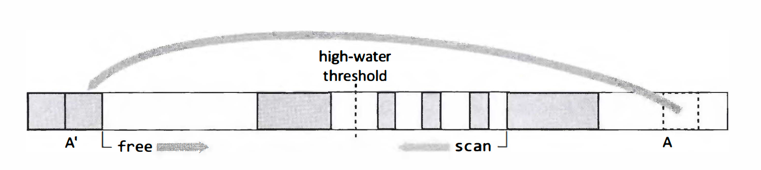

## Introduction

几乎所有现代编程语言都使用动态内存分配。
这使得对象可以在程序编译时未知其总大小的情况下进行分配和释放，
并且它们的生命周期可能超过分配它们的子程序激活期。
动态分配的对象存储在堆中，而不是`栈`（分配它的过程的`激活记录`或`栈帧`）或`静态`（对象名称绑定到编译或链接时已知的存储位置）中。

堆分配特别重要，因为它允许程序员：

- 动态选择新对象的大小（从而避免因超出数组硬编码限制而导致的程序失败）；
- 定义和使用递归数据结构，如列表、树和映射；
- 将新创建的对象返回给父过程（例如，允许工厂方法）；
- 返回函数作为另一个函数的结果（例如，函数式语言中的闭包或暂停）。

堆分配的对象通过`引用`访问。
通常，引用是指向对象的指针（即对象在内存中的地址）。
然而，引用也可能间接地引用对象，例如通过句柄，句柄再指向对象。
句柄的优点在于允许对象被重定位（更新其句柄），而不必更改程序中对该对象/句柄的每个引用。

堆对象使用的内存可以通过*显式释放*（例如，C 的 `free` 或 C++ 的 `delete` 操作符）或由运行时系统使用引用计数或追踪式垃圾收集器自动回收。

### Explicit deallocation

手动回收存在编程错误的风险；这些错误可能以两种方式出现。

- 内存可能被过早释放，而仍有引用指向它。这种引用称为`悬垂指针`。
- 第二种错误是程序员可能未能释放程序不再需要的对象，导致`内存泄漏`。

这类编程错误在存在共享时尤其普遍，当两个或多个子程序可能持有对同一对象的引用时。
对于并发编程，当两个或多个线程可能引用一个对象时，这更加成问题。
随着多核处理器的日益普及，大量工作已经投入到构建线程安全的数据结构库中。
访问这些结构的算法需要防范许多问题，包括死锁、活锁和 ABA 错误。
自动内存管理显著简化了并发算法的构建（例如，通过消除某些 ABA 问题）。
没有它，编程解决方案要复杂得多。

这个问题不仅仅关乎程序员需要更小心。
正确内存管理的困难通常与所讨论的编程问题本身密切相关。
更一般地说，对象的安全释放很复杂，因为正如 Wilson 指出的，"**存活性是一个全局属性**"，而在变量上调用 `free` 的决定是局部性的。

那么，在没有自动动态内存管理支持的语言中，程序员如何应对呢？
关键建议是在管理对象的`所有权`方式上保持一致。
Belotsky 和其他人为 C++ 提供了几种可能的策略。

- 首先，程序员应尽可能避免堆分配。例如，对象可以在栈上分配。
  当创建对象的方法返回时，栈的弹出将自动释放这些对象。
- 其次，程序员应该通过值传递和返回对象，即复制参数/结果的完整内容，而不是传递引用。
  显然，这两种方法都能消除所有分配/释放错误，但代价是增加内存压力并失去共享。
- 在某些情况下，使用自定义分配器可能是合适的，例如管理对象池的分配器。
  在程序阶段结束时，整个池可以一次性释放。

C++ 已有多次尝试使用特殊的指针类和模板来改进内存管理。
这些类重载了正常的指针操作以提供安全的存储回收。
然而，这种智能指针有几个限制。
`auto_ptr` 类模板不能与标准模板库一起使用，并将在预期的下一版 C++ 标准中弃用。
它将被改进的 `unique_ptr` 取代，后者提供严格的所有权语义，允许在 unique 指针被销毁时删除目标对象。
该标准还将包括一个引用计数的 `shared_ptr`，但这些也有局限性。
引用计数指针无法管理自引用（循环）数据结构。
大多数智能指针作为库提供，如果效率是关注点，这限制了它们的适用性。
可能，它们最适合用于管理非常大的块，对这些块的引用很少被分配或传递，在这种情况下，它们可能比追踪式收集便宜得多。
另一方面，没有编译器和运行时系统的协作，引用计数指针不是管理小对象的通用高效解决方案，特别是如果指针操作需要是线程安全的。

各种安全手动内存管理策略又带来了另一个问题。
如果程序员必须一致地管理对象所有权，她应该采用哪种方法？在使用库代码时尤其成问题。
库采用哪种方法？程序使用的所有库是否使用相同的方法？

### Automatic dynamic memory management

垃圾回收语言为软件开发带来的优势是巨大的。
它消除了整类错误，例如尝试跟随仍然指向已回收或在其他上下文中重用的内存的悬垂指针。
不再可能释放已经释放的内存。
它减少了程序泄漏内存的可能性，尽管它不能治愈所有此类错误。
它极大地简化了并发数据结构的构建和使用。
最重要的是，垃圾回收提供的抽象促进了更好的软件工程实践。
它简化了用户接口，使代码更易于理解和维护，因此也更可靠。
通过从接口中消除内存管理问题，它使代码更易于重用。

自动动态内存管理解决了许多这些问题。
`垃圾回收`（GC）防止了悬垂指针的创建：只有当从可达对象没有指针指向它时，对象才被回收。
相反，原则上所有垃圾都保证被释放——任何不可达的对象最终都会被收集器回收——但有两个注意事项。

- 第一个是`追踪式收集`使用的"垃圾"定义是可判定的，可能不包括所有永远不会再被访问的对象。
- 第二个是实际上，垃圾收集器实现可能出于效率原因选择不回收某些对象。
  只有收集器释放对象，因此不会出现`双重释放`问题。
  所有回收决定都推迟到收集器，收集器拥有堆中对象结构和可访问它们的线程的全局知识。
  显式释放的问题很大程度上源于在局部上下文中做出全局决定的困难。
  自动动态内存管理巧妙地解决了这个问题。

最重要的是，内存管理是一个软件工程问题。
设计良好的程序由高度内聚和松散耦合的组件（最广义的术语）构建而成。
增加模块的内聚性使程序更易于维护。
理想情况下，程序员应该能够仅从模块本身的代码理解其行为，或者最多从少数几个密切相关的模块理解。
减少模块间的耦合意味着一个模块的行为不依赖于另一个模块的实现。
就正确的内存管理而言，这意味着模块不必知道其他模块所遵循的内存管理规则。
相比之下，*显式内存管理*违背了组件间最小通信的良好软件工程原则；
它使接口变得混乱，要么通过额外的参数显式地传达所有权权利，要么隐含地要求程序员遵循特定的习惯用法。
要求代码理解交战规则限制了组件的可重用性。

支持垃圾回收的关键论点不仅仅是它**简化了编码**——这确实如此——
而是它将内存管理问题从接口中解耦出来，而不是将其分散在代码各处。
**它提高了可重用性。**

我们并不声称垃圾回收是能根除所有内存相关编程错误的*银弹*，或者它适用于所有情况。
尽管垃圾回收倾向于减少内存泄漏的机会，但它并不能保证消除它们。
它对仍然可达但无限增长的数据结构（例如，如果程序员反复向缓存添加数据但从不从缓存中删除对象），
或者可达但只是不再被访问的数据结构，没有解决办法。

自动动态内存管理正是为完成其所说的工作而设计的。
然而，在垃圾回收语言中，*通用资源管理*的问题是一个重大的问题。
对于显式管理的系统，内存回收和其他资源的处置之间存在直接而自然的耦合。
自动内存管理引入了如何在缺乏自然耦合的情况下构建资源管理的问题。
然而，有趣的是，许多资源释放场景需要类似于收集器的机制来检测该资源是否仍在程序的其余部分中使用（可达）。

### Comparing garbage collection algorithms

不幸的是，不可能为所有配置确定"最佳"收集器。
比较在原理和实践上都很困难。
实现细节、局部性以及算法复杂度公式中常数的实际意义使其成为不完美的实践指南。
此外，这些度量指标不是独立的变量。
算法的性能不仅取决于堆中对象的拓扑和数量，还取决于应用程序的访问模式。
更糟糕的是，生产虚拟机中的调优选项是相互关联的。

**Safety（安全性）**

首要考虑是垃圾回收应该是安全的：收集器绝不能回收存活对象的存储。
然而，安全性是有代价的，特别是对于并发收集器。保守式收集的安全性，
它不从编译器或运行时系统获得帮助，原则上可能容易受到某些伪装指针的编译器优化的影响。

**Throughput（吞吐量）**

最终用户的常见目标是他们的程序应该运行得更快。然而，
这有几个方面。一方面是花费在垃圾回收上的总时间应尽可能低。
这在文献中通常被称为 mark/cons 比率，
比较收集器（"标记"存活对象）和 mutator（创建或"cons"新的列表单元）的早期 Lisp 活动。然而，用户最可能希望整个应用程序（mutator 加收集器）在尽可能短的时间内执行。
在大多数设计良好的配置中，CPU 时间花费在 mutator 上远多于收集器。
因此，用一些收集器性能换取更高的 mutator 吞吐量可能是值得的。
例如，由标记-清除收集器管理的系统偶尔执行更昂贵的压缩阶段，以减少碎片，
从而改善 mutator 分配性能（可能还有更一般的 mutator 性能）。

**Completeness and promptness（完整性和及时性）**

理想情况下，垃圾回收应该是完整的：堆中的所有垃圾最终都应该被回收。
然而，这并不总是可能甚至可取的。例如，纯引用计数收集器无法回收循环垃圾（自引用结构）。
出于性能原因，可能不希望在每个收集周期都收集整个堆。
例如，分代收集器按对象年龄将其分为两个或多个称为分代（generations）的区域。
通过将精力集中在最年轻的分代上，分代收集器既可以改善总收集时间，又可以减少单个收集的平均暂停时间。

并发收集器交错执行 mutator 和收集器；这种收集器的目标是避免或至少限制对用户程序的中断。
一个后果是，在收集周期开始后变成垃圾的对象可能直到下一个周期结束时才被回收；这种对象称为浮动垃圾。
因此，在并发环境中，将完整性定义为所有垃圾的最终回收可能比在一个周期内回收更合适。
不同的收集算法在回收的及时性上可能有所不同，再次导致时间/空间的权衡。

**Pause time（暂停时间）**

另一方面，一个重要需求可能是最小化收集器对程序执行的侵入。
许多收集器在程序执行中引入暂停，因为它们在收集垃圾时停止所有 mutator 线程。
显然，使这些暂停尽可能短是可取的。
这对于交互式应用程序或处理事务的服务器可能特别重要（当未能满足截止时间可能导致事务重试，从而积压工作）。
然而，限制暂停时间的机制可能有副作用，我们将在后续章节中更详细地看到。
例如，分代收集器通过频繁快速地收集一个小的新生区域，并且只偶尔收集更大的老年代来解决这个目标。
显然，在调优分代收集器时，需要在分代大小之间取得平衡，因此不仅要考虑收集不同分代所需的暂停时间，还要考虑收集的频率。
然而，由于必须记录一些跨代指针的来源，分代收集对 mutator 的指针写操作征收了少量开销。
并行收集器停止整个世界进行收集，但通过使用多个线程减少暂停时间。
并发和增量收集器旨在通过偶尔执行少量与 mutator 操作交错或并行的收集工作来进一步减少暂停时间。
这同样需要对 mutator 征税，以确保 mutator 和收集器之间的正确同步。
正如我们将在第 15 章中看到的，有不同方式处理这种同步。机制的选择影响空间
和时间成本。它还影响垃圾收集周期的终止。对 mutator 时间的征税成本取决于如何以及记录 mutator 对堆的哪些操作（加载或存储）。空间成本以及收集器的终止，
取决于系统容忍多少浮动垃圾（见下文）。多个 mutator 和收集器线程增加了复杂性。无论如何，减少暂停时间将
增加总处理时间（降低处理速率）。
最大或平均暂停时间本身并不是足够的度量。mutator 的进度也很重要。
因此暂停时间的分布也很有意义。有多种方式可以报告暂停时间分布。
最简单的可能是变异度量，如标准差或分布的图形表示。更有趣的度量包括最小 mutator 利用率（MMU）和有界 mutator 利用率（BMU）。MMU 和 BMU 度量旨在简洁地显示在任意给定时间窗口内花费在 mutator 中的（最小）
时间比例。图 1.2 的 x 轴表示从 0 到总执行时间的时间，y 轴表示花费在 mutator 中的 CPU 时间比例（利用率）。因此，MMU 和 BMU 曲线不仅显示了垃圾收集总时间占总执行时间的比例（y 截距，曲线右上角是 mutator 的处理器时间总份额），而且还显示了最大暂停时间（mutator 的 CPU 利用率为零的最长窗口）作为 x 截距。一般来说，更高且更靠左的曲线更可取，因为它们倾向于在更小的最大暂停下实现更高的 mutator 利用率。注意，
MMU 是在任何时间窗口（x）中的最小 mutator 利用率（y）。因此，
较大的窗口可能具有比较小窗口更低的 MMU，导致曲线下降。
相比之下，BMU 曲线给出在该时间窗口或任何更大窗口中的 MMU。单调递增的 BMU 曲线可能比 MMU 更直观。

**Space overhead（空间开销）**

内存管理的目标是安全有效地使用空间。不同的内存管理器，无论是显式的还是自动的，都会施加不同的空间开销。一些垃圾收集器可能会施加按对象的空间成本（例如，存储引用计数）；其他收集器可能能够将这些开销隐藏在对象的现有布局中（例如，标记位通常可以隐藏在头部字中，或者转发指针可以写入用户数据之上）。收集器可能具有按堆的空间开销。例如，复制
收集器将堆分为两个半空间。在任何时候只有一个半空间对 mutator 可用；另一个作为复制保留，收集器将在收集时将存活对象疏散到其中。收集器可能需要辅助数据结构。追踪式
收集器需要标记栈来引导堆中指针图的遍历；它们还可以将标记位存储在单独的位图表中，而不是对象本身中。
并发收集器，或将堆划分为独立收集区域的收集器，需要记录集合，记录 mutator 更改指针值的位置，或分别记录跨越区域的指针位置。

**Optimisations for specific languages（特定语言的优化）**

垃圾回收算法也可以通过它们对不同语言范式的适用性来表征。函数式语言尤其为与内存管理相关的优化提供了丰富的源泉。一些语言，如 ML，区分可变和不可变数据。纯函数式语言，如 Haskell，更进一步，不允许用户修改任何值（程序是引用透明的）。然而，在内部，它们通常最多更新数据结构一次（从"thunk"到弱头范式）；这为多代收集器提供了机会，可以急切地提升完全求值的数据结构。作者还提出了处理引用计数的循环数据结构的完整机制。声明式语言也可能允许其他机制来高效管理堆空间。在逻辑语言中，在"选择点"之后创建的任何数据在程序回溯到该点后变得不可达。通过将对象按分配顺序在堆中布局的内存管理器，在选择点之后分配的内存可以在常数时间内回收。相反，不同的语言定义可能对收集器提出特定要求。最值得注意的是处理各种指针强度的能力，以及收集器需要使死亡对象被终结化的需求。

**Scalability and portability（可扩展性和可移植性）**

我们在此确定的最后度量是可扩展性和可移植性。随着多核硬件在桌面甚至笔记本电脑上的日益普及（而不仅仅是在大型服务器中），垃圾回收能够利用所提供的并行硬件变得越来越重要。此外，我们预期并行硬件在规模（核心数和插槽数）上会增加，并且异构处理器将变得更加普遍。对服务器的需求也在增加，因为堆大小进入数十或数百 GB 规模，事务负载也在增加。许多收集算法依赖于操作系统或硬件的支持（例如，通过保护页面或双重映射虚拟内存空间，或处理器上某些原子操作的可用性）。这些技术不一定可移植。

### performance disadvantage（性能劣势）

然而，长期以来对垃圾回收的批评是它与显式内存管理相比较慢，并施加了不可接受的开销，
无论是在总吞吐量方面还是在垃圾回收暂停方面。
虽然自动内存管理确实会给程序带来性能损失，但并不像通常假设的那么大。

正如预期的那样，不同收集器和显式分配器之间的结果各不相同，Hertz 等人发现垃圾收集器可以与显式分配的执行时间性能相匹配，前提是给它们足够大的堆（所需最小堆的五倍）。
对于更典型的堆大小，垃圾回收开销平均增加到 17%。

### Terminology and notation

##### The heap

堆要么是连续的内存字数组，要么组织成一组不连续的连续字块。Granule 是最小的分配单元，通常是一个字或双字，取决于对齐要求。Chunk 是连续颗粒的大组。Cell 是连续颗粒的通常较小的组，可能是已分配的、空闲的，甚至因某种原因被浪费或不可用的。

Block 是特定大小的对齐块，通常是 2 的幂。为完整性起见，我们还提到 frame（当不指栈帧时）意味着地址空间的大 2k 大小部分，而 space 是可能不连续的块甚至对象的集合，由系统进行类似处理。Page 由硬件和操作系统的虚拟内存机制定义，cache line 由其缓存定义。Card 是 2k 对齐的块，小于页面，与某些跨空间指针记忆方案相关。

堆通常被描述为对象图，这是一个有向图，其节点是堆对象，其有向边是存储在它们字段中对堆对象的引用。边是从源节点或根到目标节点的引用。

##### The mutator and the collector

按照 Dijkstra 等人的说法，垃圾回收程序分为两个半独立的部分。

- Mutator 执行应用程序代码，分配新对象并通过更改引用字段以指向不同的目标对象来改变对象图。这些引用字段可能包含在堆对象中，以及其他称为根的位置，如静态变量、线程栈等。由于这种引用更新，任何对象都可能最终与根断开连接，即无法通过从根出发的边序列到达。
- Collector 执行垃圾回收代码，发现不可达对象并回收它们的存储。

程序可能有多个 mutator 线程，但这些线程通常可以被视为堆上的单一作用者。同样，可能有一个或多个收集器线程。

##### Liveness, correctness and reachability

如果对象将在 mutator 的未来执行中的某个时间被访问，则称该对象是存活的。垃圾回收器只有在从不回收存活对象时才是正确的。不幸的是，存活性是程序的不可判定属性：无法决定任意程序是否会访问特定的堆对象。仅仅因为程序继续持有指向对象的指针并不意味着它会访问它。幸运的是，我们可以通过可判定的属性来近似存活性：指针可达性。如果可以从 M 的某个字段 f 开始，通过跟随指针链到达 N，则对象 N 是从对象 M 可达的。扩展而言，只有当存在从 mutator 的某个根到对象的指针链时，对象才对 mutator 可用。

更形式化地，我们可以如下定义直接的"指向"关系。对于 Node s 中的任意两个堆节点 M、N，当且仅当 P o i nt e r s (M) 中存在某个字段位置 J= & M[i] 使得 *J=N 时，M 直接指向 N。类似地，当且仅当 Root s 中存在某个字段 f 使得 * f=N 时，Root s 直接指向 N。我们说如果存在某个字段 f in P o i n t e r s (M) 使得 M 直接指向 N，则 N 是从 M 直接可达的。然后，堆中可达对象的集合是在关系下的 Root s 集合的传递引用闭包。

堆中不可达且不被任何 mutator 根指向的对象，永远无法被类型安全的 mutator 访问。相反，从根可达的任何对象都可能被 mutator 访问。因此，对于垃圾收集器，存活性更有利地定义为可达性。不可达的对象肯定是死亡的，可以安全地回收。但任何可达的对象可能仍然是存活的，必须保留。尽管我们知道这样做并不严格准确，但我们倾向于将存活和死亡与可达和不可达互换使用，将垃圾与不可达同义使用。

##### Mutator read and write operations

在执行时，mutator 线程执行几个收集器感兴趣的操作：New、Read 和 Write。
我们采用命名约定：mutator 操作以大写字母开头，而收集器操作以小写字母开头。
通常，这些操作具有预期的行为：分配新对象、读取对象字段或写入对象字段。
特定内存管理器可能会用额外的功能增强这些基本操作，将操作变成屏障：导致与收集器同步或异步通信的动作。
我们区分读屏障和写屏障。

`New()`。
New 操作从堆分配器中获取新的堆对象，该分配器返回新分配对象的第一个字的地址。
实际分配的机制可能因堆实现而异，但收集器通常需要被告知已分配了给定对象，以便初始化该对象的元数据，并且在其被 mutator 操作之前。

`Read(src,i)`。
Read 操作访问内存中的对象字段（可能持有标量或指针）并返回存储在该位置的值。
Read 概括了内存加载，接受两个参数：（指向）对象的指针和正在访问的字段的（索引）。
如果字段 src[i] 是根，则允许 src=Root s。
Read 的默认平凡定义简单地返回字段的内容。

`Write(src,i,val)`。
Write 操作修改内存中的特定位置。
它概括了内存存储，接受三个参数：（指向）源对象的指针和要修改的字段的（索引），以及要存储的（标量或指针）值。
同样，如果 src=Root s，则字段 src[i] 是根。
Write 的默认平凡定义简单地更新字段。

在 mutator 线程之间、收集器线程之间以及 mutator 和收集器之间的并发情况下，所有收集器算法都要求某些代码序列看起来是原子执行的。例如，停止 mutator 线程使垃圾回收看起来是原子发生的：mutator 线程永远不会在垃圾回收中间访问堆。此外，当收集器与 mutator 并发运行时，New、Read 和 Write 操作可能需要相对于收集器和/或其他 mutator 线程原子执行。为了简化收集器算法的说明，我们通常隐含实现操作原子性的精确机制，只是用关键字 atomic 标记它们。含义很清楚：原子操作的所有步骤必须看起来相对于其他操作不可分割且瞬时地执行。也就是说，其他操作看起来要么在原子操作之前执行，要么在之后执行，但绝不会在构成原子操作的任何步骤之间交错。

##### The mutator roots

与堆内存分开，我们假设有限的 mutator 根集，表示存储在 mutator 可以直接访问（无需通过其他对象）的存储中的指针。
扩展而言，由根直接引用的堆中的对象称为根对象。
Mutator 通过从当前根对象集加载指针（并在进行时添加新根）来访问图中的对象。
Mutator 也可以通过用其他引用（即 nul.J. 或指向另一个对象的指针）覆盖根指针的存储来丢弃根。我们将根的（地址）集表示为 Roots。

在实践中，根通常包括包含指针的静态/全局存储和线程本地存储（如线程栈），mutator 线程通过这些指针可以直接操作堆对象。
随着 mutator 线程随时间执行，它们的状态（以及它们的根）将会改变。

在类型安全的编程语言中，一旦对象在堆中变得不可达，并且 mutator 已丢弃所有指向该对象的根指针，那么 mutator 就无法重新获取指向该对象的指针。
Mutator 不能任意"重新发现"对象（不与运行时系统交互）——没有 mutator 可以遍历到达它的指针，并且禁止算术构造新指针。
各种语言支持至少某些对象的终结化。
这些对 mutator 来说，像是被运行时系统"复活"了。
我们的观点是，mutator 不能仅凭自身努力访问任何任意的不可达对象。

## Algorithms

所有垃圾回收方案都基于四种基本方法之一：*标记-清除*、*复制*、*标记-压缩*或*引用计数*。
不同的收集器可能以不同方式组合这些方法，例如，用一种方法收集堆的一个区域，用另一种方法收集堆的另一个区域。

现在我们假设 mutator 运行一个或多个线程，但只有一个收集器线程。
所有 mutator 线程在收集器线程运行时都停止。
这种 stop-the-world 方法大大简化了收集器的构建。
从 mutator 线程的角度来看，收集看起来是原子执行的：没有 mutator 线程会看到收集器的任何中间状态，收集器也不会看到 mutator 线程对其任务的干扰。
我们可以假设每个 mutator 线程停止在可以安全检查其根的点上：我们将在运行时接口中查看细节。
停止世界提供了堆的快照，因此我们不必担心在收集器试图确定哪些对象存活时，mutator 重新排列堆中对象的拓扑结构。
这也意味着收集器线程在返回空闲空间时，不需要与其他收集器线程或在尝试获取空间时与分配器同步。

理想垃圾回收器的目标是回收程序中不再使用的每个对象所占用的空间。
任何自动内存管理系统都有三个任务：

1. 为新对象分配空间；
2. 识别存活对象；
3. 回收死亡对象占用的空间。

**这些任务不是独立的。**
特别是，空间回收的方式影响新空间的分配方式。

### The tricolour abstraction

有一种简洁的方式来描述收集过程中对象的状态（它们是否已被标记，是否在工作列表中，等等）非常方便。
三色抽象是追踪式收集器的有用特征描述，允许基于收集器必须保持的不变量来推理收集器的正确性。
在三色抽象下，追踪式收集将对象图分为黑色（假定存活）和白色（可能死亡）对象。
最初，每个节点是白色的；当在追踪过程中首次遇到节点时，它被着色为灰色；
当它被扫描并且其子节点被识别时，它被着色为黑色。
概念上，如果收集器已完成处理对象，则该对象是黑色的；如果收集器知道该对象但尚未完成处理（或需要再次处理），则为灰色。
通过类比对象颜色，字段也可以被着色：当收集器首次遇到它们时为灰色，一旦被收集器追踪则为黑色。
这种类比也允许推理 mutator 根，就好像 mutator 是一个对象。
灰色 mutator 具有尚未被收集器扫描的根。
黑色 mutator 具有已经被收集器扫描的根（不需要再次扫描）。
追踪通过移动收集器波前（灰色对象）穿过堆，将黑色对象与白色对象分离，直到所有可达对象都被追踪为黑色。

### Comparing garbage collectors

常见的问题是：应该使用哪个最好的垃圾回收器？然而，需要抵制提供简单答案的诱惑。首先，"最好"是什么意思？

我们想要的是为应用程序提供最佳吞吐量的收集器，还是最短的暂停时间？空间利用率重要吗？
还是需要结合这些理想属性的折衷方案？其次，即使选择单一度量，不同收集器的排序在不同应用程序之间也会有所不同。
例如，在一项涉及二十个 Java 基准测试和六种不同收集器的研究中，Fitzgerald 和 Tarditi 发现，对于每种收集器，至少有一个基准测试如果使用更合适的收集器，速度可以快至少 15%。
而且，不仅在给定更大堆时程序往往运行得更快，而且不同收集器的相对性能也根据可用的堆空间量而变化。
使事情更复杂的是，过大的堆可能会分散时间相关的对象，导致局部性恶化，可能减慢应用程序。

**Throughput（吞吐量）**

许多用户愿望清单上的第一项可能是整体应用程序吞吐量。这可能是"批处理"应用程序或 Web 服务器的主要目标，对于 Web 服务器，暂停可能是可以容忍的或被系统方面的因素（如网络延迟）所掩盖。尽管尽可能快地执行垃圾回收器操作很重要，但使用更快的收集器并不一定意味着计算会执行得更快。在配置良好的系统中，垃圾回收应该只占总执行时间的一小部分。如果为更快收集所付出的代价是对 mutator 操作征收更大的税，那么应用程序的执行时间很可能会变长而不是变短。对 mutator 的成本可能是显式的或隐式的。显式操作包括读和写屏障操作，例如引用计数所需的那些。然而，mutator 的性能也可能受到隐式影响，例如因为复制收集器以某种方式重新排列对象，从而对缓存行为产生不利影响，或者因为引用计数递减触及了一个冷对象。同样重要的是尽可能避免任何需要同步操作的情况。不幸的是，引用计数修改必须同步以避免丢失更新。延迟和合并引用计数可以消除许多此类同步成本。

可以不同算法的算法复杂度。对于标记-清除收集，我们需要包括追踪（标记）和清除阶段的成本，而复制收集的成本仅取决于追踪。追踪需要访问每个存活对象，而清除需要访问每个对象（存活和死亡）。人们很容易假设标记-清除收集的成本因此必然大于复制收集。然而，为标记-清除追踪访问对象所执行的指令数少于为复制追踪的指令数。局部性在这里也起着重要作用。我们在第 2.6 节中看到如何可以使用预取技术来隐藏缓存未命中。然而，这种技术是否可以在不失去深度优先复制对 mutator 的益处的情况下应用于复制收集，仍是一个未解决的问题。在这两种追踪式收集器中，追逐指针的成本很可能占据主导地位。此外，如果标记与惰性清除相结合，我们在复制表现最佳的情况下获得最大收益：当堆中存活数据的比例较小时。

**Pause time（暂停时间）**

许多用户的下一个问题是垃圾回收中断程序执行的程度。低暂停时间不仅对交互式应用程序很重要，而且对其他应用程序也很重要，例如事务处理器，延迟可能导致工作积压。迄今为止考虑的追踪式收集器都是 stop-the-world 的：在收集器运行完成之前，所有 mutator 线程都必须停止。早期系统中的垃圾回收暂停时间是传奇性的，但即使在现代硬件上，stop-the-world 收集器也可能使非常大的应用程序暂停超过一秒。引用计数的直接吸引力在于它应该避免这种暂停，而是将内存管理的成本分散到整个程序中。然而，正如我们已经看到的，这种好处在高性能引用计数系统中并未实现。首先，对大型指针结构的最后一个引用的移除导致递归的引用计数修改和组件释放。幸运的是，对垃圾对象的引用计数修改没有争用，尽管它们可能在包含对象的缓存行上引起争用。更重要的是，我们看到延迟和合并引用计数（改善引用计数性能的最有效方法）都重新引入了 stop-the-world 暂停，以协调引用计数并回收零计数表中的垃圾对象。正如我们将在第 6.6 节中看到的，高性能引用计数和追踪方案并不像它们最初看起来那么不同。

**Space（空间）**

如果对内存有严格的物理限制、应用程序非常大，或者为了使应用程序能够良好扩展，内存占用很重要。所有垃圾回收算法都会产生空间开销。有几个因素导致这种开销。算法可能支付每个对象的代价，例如引用计数字段。半空间复制收集器需要额外的堆空间作为复制保留；为了安全起见，这需要与当前分配的数据量一样大，除非使用回退机制（例如，标记-压缩收集）。非移动收集器面临碎片问题，减少了应用程序可用的堆量。重要的是不要忽略非堆元数据空间的成本。追踪式收集器可能需要标记栈、标记位图或其他辅助数据结构。任何非压缩内存管理器，包括显式管理器，都会为自己的数据结构使用空间，如分离空闲列表等。最后，如果追踪式收集器或延迟引用计数收集器不要因为收集过于频繁而颠簸，它需要堆中有足够的垃圾空间。系统通常配置为使用比程序所需最小堆大 30% 到 200% 或 300% 的堆。许多系统还允许堆在必要时扩展，例如为了避免收集器颠簸。Hertz 和 Berger 建议，需要比显式管理堆大 3 到 6 倍的垃圾回收堆才能实现相当的应用程序性能。

相比之下，简单的引用计数在对象从存活对象图中解除链接时立即释放它们。除了防止垃圾在堆中累积的明显优势外，这可能还提供其他潜在好处。空间可能在释放后不久就被重用，这可以改善缓存性能。在某些情况下，编译器可能能够检测到对象何时变为空闲，并立即重用，而不通过内存管理器回收。

收集器不仅期望是完整的（最终回收所有死亡对象），而且期望是及时的，即在每个收集周期回收所有死亡对象。前面章节中介绍的基本追踪式收集器实现了这一点，但代价是在每次收集中追踪所有存活对象。然而，现代高性能收集器通常将及时性换为性能，允许一些垃圾从一个收集浮动到后续的收集中。引用计数面临额外的不完整问题；具体来说，它无法回收循环垃圾结构，除非求助于追踪。

### Implementation

垃圾回收算法难以正确实现，并发算法尤其如此。收集器和编译器之间的接口至关重要。
收集器所犯的错误通常会在很久以后才显现出来（可能是许多次收集之后），然后通常是 mutator 尝试跟随不再有效的引用时。因此，构建垃圾收集器不仅要快，而且要健壮，这是很重要的。Blackburn 等人已经证明，这个性能关键的系统组件可以在尊重模块化和可组合性的良好软件工程实践下设计，从而产生可维护的代码。
简单追踪式收集器的一个优点是收集器和 mutator 之间的接口很简单：当分配器耗尽内存时，调用收集器。
这个接口复杂性的主要来源是确定收集的根，包括全局变量以及寄存器和栈槽中持有的引用。我们将在第 11 章中更详细地讨论这一点。然而，我们在此指出，复制和压缩收集器面临的任务比非移动收集器更复杂。移动收集器必须识别每个根并相应地更新引用，而非移动收集器只需要识别每个存活对象的至少一个引用，并且永远不需要更改指针的值。所谓的保守式收集器可以在不准确了解 mutator 栈或对象布局的情况下回收内存。相反，它们对值是否真的是引用做出智能（但安全、保守）的猜测。因为非移动收集器不更新引用，将值误识别为堆指针的风险仅限于引入空间泄漏：值本身不会被破坏。关于保守式垃圾回收的完整讨论可以在 Jones 的著作中找到。

引用计数既有紧密耦合到 mutator 的优点也有缺点。优点是引用计数可以在库中实现，使程序员能够选择性地决定哪些对象应由引用计数管理，哪些应显式管理。缺点是这种耦合引入了上述处理开销，并且必须确保所有引用计数操作都是正确的。
任何大量使用动态分配数据的现代语言的性能都严重依赖于内存管理器。关键操作通常包括分配、mutator 更新（包括屏障）以及垃圾收集器的内部循环。在可能的情况下，这些关键操作的代码序列需要内联，但这必须小心进行以避免膨胀生成的代码大小。如果处理器的指令缓存足够大且代码膨胀足够小（在具有更小缓存的旧系统中，Steenkiste 建议小于 30%），这种膨胀可能对性能产生可忽略的影响。否则，有必要在这些操作中区分常见情况，需要足够小以能够内联（'fast path'），而对不太常见的'slow path'则调用过程。这里有两个教训。编译器的输出很重要，检查生成的汇编代码至关重要。对缓存的影响也对性能有重大影响。

商业系统通常为用户提供垃圾回收器的选择，每种都有大量调优选项。更复杂的是，这些收集器提供的调优杠杆往往不是相互独立的。许多研究者建议让系统适应于当前环境。Soman 等人开发的 Java 运行时通过根据可用堆大小在运行时切换收集器来动态适应。他们的系统要么需要离线分析运行以用最佳收集器/堆大小组合注释程序，要么可以根据程序当前空间使用与最大可用堆的比较进行切换。相比之下，Singer 等人应用机器学习技术从程序的静态属性预测最佳收集器（因此只需要一次训练运行）。Sun 的人体工程学调优试图根据用户提供的吞吐量和最大暂停时间目标来调优其 HotSpot 收集器的性能，相应地调整堆内各空间的大小。
我们可能提供给开发者的最好（也许也是唯一）的建议是：了解你的应用程序。测量其行为，以及它使用的对象的大小和生命周期分布。然后尝试可用的不同收集器配置。不幸的是，这需要使用真实数据集进行。合成和小型基准测试可能会产生误导。

### A unified theory of garbage collection

在前面的章节中，我们考虑了两种收集风格：直接的引用计数和间接的追踪式收集。Bacon 等人表明这些收集器具有显著的相似性。他们的抽象框架允许我们以突出显示它们相似和不同之处的方式来表达各种不同的收集器。

抽象垃圾回收
代替具体的数据结构，以下抽象框架使用简单的抽象数据结构，其实现可以变化。我们首先注意到，垃圾回收可以表示为固定点计算，为节点 n 分配引用计数 p(n)。引用计数包括来自根集的贡献和来自具有非零引用计数的节点的入边。

分配引用计数后，保留具有非零计数的节点，其余节点应被回收。引用计数不一定需要精确，但可以是真实值的安全近似。抽象垃圾回收算法使用要处理的对象的工作列表 W 来计算这样的固定点。当 W 为空时，这些算法终止。在下文中，W 是一个多重集，因为 W 中的每个条目代表每个引用的不同来源。

#### Tracing garbage collection

抽象将追踪式收集视为一种引用计数形式。抽象追踪式收集由算法 6.1 说明，该算法从所有节点的引用计数为零开始。
在每个收集周期结束时，sweep Tracing 将所有节点的计数重置为零，New 将新节点初始化为零引用计数。
col lect Tracing 过程使用 root s Tracing 累积所有非空根指针，并将它们作为工作列表 W 传递给 s canTracing。

收集按预期进行，通过追踪对象图以发现所有从根可达的节点。
s canTracing 过程通过从工作列表中追踪元素来实现，重建每个节点的引用计数，
每次遇到节点时递增其引用计数（回想我们在第 5.6 节中建议追踪式收集器可用于纠正粘性引用计数）。
当首次发现可达节点 src 时（当 p(src) 设置为 1 时，第 10 行），收集器通过扫描其所有出边并将在这些字段中找到的（指向）子节点添加到工作列表 W 中来递归遍历 src 的所有出边。

while 循环的终止产生了所有存活节点，每个节点具有等于其入边数量的非零引用计数。
然后 sweep Tracing 过程释放未使用的节点，并为下一轮收集重置引用计数。
注意，追踪的实际实现可以对每个节点的引用计数使用单比特值，换句话说，使用标记位而不是完整大小的引用计数来记录节点是否已被访问。
标记位因此是真实引用计数的粗略近似。

追踪式收集器计算方程 6.1 的最小固定点解：节点上的引用计数是满足它的最低计数。
我们可以根据第 2.2 节讨论的三色抽象来解释垃圾回收算法。
在算法 6.1 中，引用计数为 0 的节点是白色的，而引用计数非零的节点是黑色的。
节点从白色经由灰色到黑色的转换发生在该节点首先被追踪然后被扫描时。
因此，我们可以将抽象追踪算法重新描述为将节点划分为两个集合，黑色为可达，白色为垃圾。

#### Reference counting garbage collection

抽象引用计数收集算法 6.2 显示引用计数操作由 mutator 的 i n c 和 de c 过程缓冲，而不是立即执行，以突出与追踪的相似性。这种缓冲技术被证明对多线程应用程序非常实用；我们将在第 18 章进一步考虑。这种操作日志记录也与合并引用计数共享相似性，在第 5.4 节讨论。垃圾回收器 col lectCount ing 使用 apply I n c rement s 执行延迟的增量 I，使用 s c anCount i ng 执行延迟的减量 D。

## Mark-sweep garbage collection

我们看的第一个算法是标记-清除收集。
它是指针可达性递归定义的直接体现。
收集分两个阶段运行。

- 首先，收集器遍历对象图，从根（寄存器、线程栈、全局变量）开始，程序可能通过这些根立即访问对象，然后跟随指针并标记它找到的每个对象。
  这种遍历称为`tracing`。
- 在第二个清除阶段，收集器检查堆中的每个对象：任何未标记的对象被视为垃圾，其空间被回收。

标记-清除是一种*间接收集算法*。它本身不检测垃圾，而是识别所有存活对象，然后得出其他所有内容都是垃圾的结论。
注意，它需要在每次调用时重新计算其对存活对象集的估计。
并非所有垃圾回收算法都这样行为。我们将检查一种*直接收集*方法，引用计数。
与间接方法不同，直接算法从对象本身确定对象的存活性，无需借助追踪。

注意，标记-清除收集器对堆布局施加了约束。

- 首先，此收集器不移动对象。
  因此，内存管理器必须小心减少堆碎片化的可能性，以免分配器发现难以满足新请求，
  这会导致收集器被太频繁地调用，或者在最坏情况下，完全阻止新内存的分配。
- 其次，清除器必须能够找到堆中的每个节点。
  实际上，给定一个节点，清除必须能够找到下一个节点，即使对象之间存在为了满足对齐要求而引入的填充。

从垃圾回收器的角度来看，mutator 线程只执行三个感兴趣的操作，New、Read 和 Write，每个收集算法必须相应地重新定义这些操作。

### Bitmap marking

用于标记位的空间通常可以在对象头部字中找到。
或者，标记位可以存储在堆旁边的单独的位图表中，每个可能分配对象的地址都有一个关联的位。
除了位图，字节映射也常用（以空间增加 8 倍为代价），从而使标记竞争变得无害。
或者，位图必须使用同步操作来设置位。

标记位图有几个潜在优势。

位图比存储在对象头中更密集地存储标记。
使用位图，标记不会修改任何对象，而只会读取存活对象的指针字段。
位图标记可能修改更少的字，并弄脏更少的缓存行，因此需要写回内存的数据更少。

位图标记最初是为*保守式收集器*采用的，旨在为像 C 和 C++ 这样不配合的语言提供自动内存管理。

位图标记的另一个动机是关注最小化由收集器引起的页面交换量。
它允许对象簇的标记位以组形式测试和清除，因为常见情况是映射字中的每一位/字节要么都设置，要么都清除。
一个推论是，从位图很容易确定一个完整的对象块是否是垃圾，从而允许将整个块返回给分配器。

许多内存管理器使用块结构堆（例如，Boehm 和 Weiser）。
直接实现可能为每个块保留一个前缀用于其位图。
如前所述，这会导致不必要的缓存冲突和页面访问，因此收集器倾向于将位图与用户数据块分开存储。

### Lazy sweeping

标记阶段的复杂度为 O(L)，其中 L 是堆中存活数据的大小；
清除阶段的复杂度为 O(H)，其中 H 是堆的大小。由于 H > L，乍看起来标记-清除算法似乎由清除成本主导。
然而，实际上并非如此。在标记阶段追逐指针会导致不可预测的内存访问模式，而清除行为更可预测。
此外，清除对象的成本往往远低于追踪它的成本。

改善清除阶段缓存行为的一种方法是预取对象。
为了避免碎片化，支持标记-清除收集器的分配器通常将相同大小的对象连续布局，导致在清除相同大小对象块时具有固定步长。
这种模式不仅允许软件预取，而且非常适合现代处理器中的硬件预取机制。

惰性清除提供了许多好处。它具有良好的局部性：对象槽在清除后往往很快被使用。
它将标记-清除的算法复杂度降低到与堆中存活数据大小成比例，与半空间复制收集相同。
特别是，Boehm 建议标记和惰性清除在复制表现最佳的相同情况下表现最佳：
当堆的大部分为空时，因为惰性清除搜索未标记对象将很快终止。
实际上，mutator 初始化对象的成本可能主导清除和分配的成本。

标记-清除比基于半空间复制的方法具有显著更好的空间使用率。
它也可能比引用计数算法具有更好的空间使用率。

然而，标记-清除是一种**追踪算法**。像其他追踪算法一样，它必须识别空间中的所有存活对象，然后才能回收任何死亡对象使用的内存。
这是一个昂贵的操作，因此应该不经常进行。这意味着追踪式收集器必须在堆中留出一些操作空间。
如果存活对象占据堆的过大比例，并且分配器分配过快，那么`标记-清除收集器`将被过于频繁地调用：它将颠簸。
对于中等到大型堆，所需的空间可能在堆的 20% 到 50% 之间，尽管 Hertz 和 Berger 表明，为了提供相同的吞吐量，
由标记-清除收集管理的 Java 程序可能需要比由显式释放管理的堆大几倍的堆。

### Mark-sweep garbage collection considerations

**Mutator overhead（Mutator 开销）**

最简单的形式的标记-清除对 mutator 的读和写操作不施加任何开销。
相比之下，引用计数对 mutator 施加了显著的开销。
然而，注意，标记-清除也常用作更复杂收集器的基础算法，这些收集器确实需要 mutator 和收集器之间的某些同步。
分代收集器以及并发和增量收集器，都要求 mutator 在修改指针时通知收集器。
然而，这样做的开销通常很小，只占总执行时间的几个百分点。

**Throughput（吞吐量）**

结合惰性清除，标记-清除提供了良好的吞吐量。标记阶段
相对便宜，主要由追逐指针的成本主导。它只需要为发现的每个存活对象设置一个位或字节，与像半空间复制收集或标记-压缩这样的算法相比，后者必须复制或移动对象。另一方面，像这些初始章节中的所有追踪式收集器一样，标记-清除要求在收集器运行时停止所有 mutator。收集的暂停时间取决于正在运行的程序及其输入，但对于大型系统，很容易延长到几秒甚至更糟。

**Space usage（空间使用量）**

标记-清除比基于半空间复制的方法具有显著更好的空间使用率。它也可能比引用计数算法具有更好的空间使用率。
标记位通常可以免费存储在对象头部的空闲位中。或者，如果使用侧面位图表，空间开销取决于对象对齐要求；
它不会比堆的占用更差，并且可能更好，具体取决于对齐限制。而引用计数
则需要在每个对象头中有一个完整的槽来存储计数（尽管如果对存储的最大引用计数设置限制，可以减少这种需求）。复制收集器
对可用内存的使用更差，将可用堆分为两个同等大小的半空间，mutator 在任何时刻只使用其中一个。从不利的方面看，非压缩收集器，如标记-清除和引用计数，需要更复杂的分配器，如分离适应空闲列表。支持这种收集器所需的结构施加了额外的、不可忽视的开销。此外，非压缩收集器可能会遭受碎片化，从而增加其有效空间使用率。

然而，标记-清除是一种追踪算法。像其他追踪算法一样，它必须在回收任何死亡对象使用的内存之前识别空间中的所有存活对象。这是一个昂贵的操作，因此应该不经常执行。这意味着追踪式收集器必须在堆中留出一些操作空间。如果存活对象占据堆的过大比例，并且分配器分配过快，那么标记-清除收集器将被过于频繁地调用：它将颠簸。对于中等到大型堆，所需的空间可能在堆的 20% 到 50% 之间，尽管 Hertz 和 Berger 表明，为了提供相同的吞吐量，由标记-清除收集管理的 Java 程序可能需要比由显式释放管理的堆大几倍的堆。

**To move or not to move?（移动还是不移动？）**

不移动对象既有优点也有缺点。
其好处在于，它使标记-清除适用于不配合的环境，其中语言编译器和垃圾回收器之间没有通信。
如果没有关于 mutator 根和对象字段的类型精确信息，就无法用对象移动后的新位置更新它们——假定的'根'可能不是指针，而是其他用户数据。
在某些情况下，混合的主要复制收集是可能的。

这里，程序的根必须保守处理（如果它看起来像指针，就假定它是指针），因此收集器不能移动它们的引用对象。
然而，关于对象布局的类型精确信息对收集器可用，因此它可以移动其他未固定在其位置的对象。
在由保守收集器管理的不配合系统中的安全性阻止了收集器修改用户数据，包括对象头部。这也鼓励将收集器元数据与用户或其他运行时系统数据分开存放，以减少被 mutator 修改的风险。出于这两个原因，希望将标记位存储在位图中而不是对象头部。

不移动对象的问题是，在长时间运行的应用程序中，堆往往会变得碎片化。
非移动内存分配器需要比最小可能空间大 $O(log{}{max/min})$ 的空间，其中 min 和 max 是可能的最小和最大对象大小。
因此，非压缩收集器可能必须比压缩收集器更频繁地被调用。
注意，所有追踪式收集器都需要足够的操作空间（比如，20-50%），以避免收集器颠簸。

**为避免因过度碎片化而导致性能下降，许多使用标记-清除管理堆区域的生产收集器也会定期使用另一种算法（如标记-压缩）来整理碎片。**
如果应用程序不保持相当恒定的对象大小比率或分配许多非常大的对象，尤其如此。
如果应用程序比以前分配更多的大对象，结果可能是堆中出现许多不再被新分配的相同大小对象重用的小孔。
相反，如果应用程序开始分配比以前更小的对象，这些较小的对象可能会被分配在以前由较大对象占用的间隙中，每个间隙中的剩余空间被浪费。
然而，仔细的堆管理可以利用对象趋向于成簇存活和死亡的趋势来减少碎片化的趋势。
使用分离适应的分配也可以减少压缩的需求。

## Mark-compact garbage collection

压缩堆的主要好处是它允许非常快速的顺序分配，
只需测试堆限制并将空闲指针递增分配请求的大小。
我们考虑的策略是对对象进行原地压缩到同一区域的一端。

标记-压缩算法在多个阶段中运行。
第一阶段始终是标记阶段，我们在前一章中讨论过。
然后，进一步的压缩阶段通过重定位存活对象并更新所有已移动存活引用的指针值来压缩存活数据。

对堆的遍历次数、这些遍历的执行顺序以及对象重定位的方式因算法而异。
压缩顺序对局部性有影响。任何移动收集器都可以以三种方式之一重新排列堆中的对象。

- **Arbitrary（任意）**：对象被重定位，而不考虑其原始顺序或它们是否相互指向。
- **Linearising（线性化）**：对象被重定位，使其与相关对象相邻，例如它们引用的对象、引用它们的对象、数据结构中的兄弟对象等，尽可能实现。
- **Sliding（滑动）**：对象被滑动到堆的一端，挤出垃圾，从而保持它们在堆中的原始分配顺序。

我们所知道的大多数压缩收集器使用任意或滑动顺序。
所有现代标记-压缩收集器实现滑动压缩，它通过不改变对象放置的相对顺序来干扰 mutator 局部性。

压缩算法可能施加进一步的限制。
任意顺序算法只处理单一大小的对象，或分别压缩不同大小的对象。
压缩可能需要两到三次遍历堆。
可能需要在对象头中提供额外的槽来保存重定位信息：这种开销对于通用内存管理器来说可能是显著的。
压缩算法可能对指针施加限制。

所有压缩算法都如下调用：

```
atomic collect():
    markFromRoots()
    compact()
```

标记-压缩收集器消除了碎片化，并支持非常快速的"递增指针"分配，但需要对存活对象进行多次遍历，并显著增加收集时间。

### Two-finger compaction

Edwards 的两指算法是一种双遍、任意顺序的算法，最适合包含固定大小对象的压缩区域。
思想很简单：给定要压缩区域中存活数据的体积，我们知道压缩后区域的高水位线将在哪里。
高于此阈值的存活对象被移动到低于阈值的间隙中。
算法 3.1 以两个指针或'手指'开始，free 指向区域的开头，s c a n 指向区域的末尾。
第一遍重复地前进 free 指针，直到在堆中找到间隙（未标记的对象），并后退 s c a n 指针，直到找到存活对象。
如果 free 和 s c a n 手指相互越过，则阶段完成。
否则，scan 处的对象被移动到 fr ee 处的间隙中，用转发地址覆盖旧副本（`scan` 处）的某个字段，然后过程继续。
如图 3.1 所示，对象 A 已被移动到其新位置 A'，并且 A 的某个槽（比如说第一个槽）已被地址 A' 覆盖。
注意，压缩的质量取决于 fr e e 处间隙的大小与 s c a n 处存活对象的大小紧密匹配。
除非此算法用于固定大小对象，否则整理碎片的效果可能确实很差。

<div style="text-align: center;">



</div>

<p style="text-align: center;">
Fig.1. Edwards's Two-Finger algorithm.
堆顶部的存活对象被移入堆底部的空闲间隙。
<br>
这里，A 处的对象已被移动到 A'。
算法在 free 和 scan 指针相遇时终止。
</p>

在此阶段结束时，free 指向高水位标记。第二遍使用在这些位置发现的转发地址更新指向高水位标记以外位置的旧指针值，即对象的新位置。
该算法的好处是简单快速，每次迭代做最少的工作。它没有内存开销，因为转发地址仅在存活对象已被重定位后才写入该位置的高水位标记以上的槽中：没有信息被破坏。该算法支持内部指针。其内存访问模式是可预测的，因此提供了预取的机会（通过硬件或软件），这应该在收集器中产生良好的缓存行为。然而，在 r e l ocate 中 s c a n 指针的移动确实要求堆（或至少存活对象）可以"向后"解析；这可以通过将标记位存储在单独的位图中，或在分配时在位图中记录每个对象的起始位置来实现。不幸的是，这种压缩方式导致的堆中对象顺序是任意的，这往往损害 mutator 的局部性。然而，不难想象如何在一定程度上改善 mutator 的局部性。由于相关对象倾向于成簇地存活和死亡，与其移动单个对象，不如将连续的存活对象组移入大的间隙中。

### One-pass algorithms

如果要将滑动收集器对堆的遍历次数减少到两次（一次标记，一次滑动对象），并避免线程化的开销，那么我们必须将转发地址存储在贯穿整个压缩过程的侧面表中。
Abuaiadh 等人和 Kermany 和 Petrank 都为多处理器设计了高性能的标记-压缩算法，正是这样做的。
前者是并行、stop-the-world 算法（它使用多个压缩线程）；后者也可以配置为并发（允许 mutator 线程与收集器线程并行运行）和增量（定期短暂挂起 mutator 线程以执行少量的压缩工作）。我们在后面的章节中讨论这些算法的并行、并发和增量方面。在这里，我们专注于 stop-the-world 环境中的核心压缩算法。

两种算法都使用许多侧面表或向量。与许多收集器一样，标记使用一个位图，每个 granule（比如一个字）对应一个位。标记设置每个存活对象的第一个和最后一个 granule 对应的位。例如，在图 3.3 中，为标记为 old 的对象设置了位 16 和 19。通过在压缩阶段检查标记位图，收集器可以计算任何存活对象的大小。

其次，使用一个表来存储转发地址。为每个对象都这样做代价高昂（特别是假设对象是字对齐的），因此这两种算法都将堆划分为小的、相等大小的块（分别为 256 或 512 字节）。`offset` 表存储每个块中第一个存活对象的转发地址。块中其他存活对象的新位置可以根据偏移量和标记位向量即时计算。同样，给定对任何对象的引用，我们可以计算其块号，从而从偏移表中的条目和该块的标记位中推导出其转发地址。这允许算法将对完整堆进行多次遍历以重定位对象和更新指针，替换为对标记位向量进行一次遍历以构建偏移向量，以及对堆进行一次遍历（在标记之后）以通过查阅这些摘要向量来移动对象和更新引用。减少堆遍历次数对局部性有相应好处。让我们考虑算法 3.4 中的细节。

标记完成后，`computeLocations` 例程遍历标记位向量以生成 `offset` 向量。
本质上，它执行与 Lisp 2 中相同的计算，但不需要接触堆中的任何对象。
例如，考虑块 2 中的第一个标记对象，在图 3.3 中以粗边框显示。
在第一个块中设置了位 2 和 3 以及 6 和 7，在第二个块中设置了位 3 和 5（在此示例中，每个块包含八个槽）。
这表示在此对象之前在位图中标记了 7 个 granule（字）。
因此，块 2 中的第一个存活对象将被重定位到堆中的第七个槽。
该地址记录在块的 `offset` 向量中。

一旦计算出 o f f s e t 向量，根和存活字段就被更新以反映新位置。Lisp 2 算法不得不将引用更新和对象移动分开，因为重定位信息保存在堆中，并且对象移动会破坏这些信息，因为重定位的对象滑过旧对象。相比之下，Compressor 类型的算法在单个遍历 upda t eRe fe r e nc e s Re l o cat e（算法 3.4）中重定位对象和更新引用。这是可能的，因为新地址可以根据标记位图和 o f f s e t 向量合理地快速计算：Compressor 不必在堆中存储转发地址。给定堆中任何对象的地址，newAddre s s 获取其块号（通过移位和掩码操作），并将其用作 o f f s et 向量的索引。o f f s et 向量给出该块中第一个对象的转发地址。然后 Compressor 必须查阅该块的位图，以发现该对象在其块中之前有多少存活数据，从而知道要添加到偏移量中的数量。这可以通过表查找在常数时间内完成。

### Mark-compact garbage collection considerations

**Throughput costs of compaction（压缩的吞吐量成本）**

压缩堆中的顺序分配速度很快。如果堆相对于可用内存量很大，标记-压缩是一种合适的移动收集策略。
它的内存需求只有复制收集器的一半。像 Compressor 这样的算法也比许多复制算法更容易与多个收集器线程一起使用。当然，需要付出代价。标记-压缩收集可能比标记-清除或复制收集慢。此外，许多压缩算法会产生额外开销或对 mutator 施加限制。
标记-压缩算法提供的吞吐量比标记-清除或复制收集差，主要是因为它们倾向于对堆中的对象进行更多遍历；Compressor 是个例外。每次遍历往往代价高昂，尤其是因为许多遍历需要访问类型信息和对象指针字段，而这些是继'指针追逐'之后主导的成本，正如我们在第 2 章中看到的。常见的解决方案是尽可能长时间地使用标记-清除收集，仅在碎片指标表明有利可图时才切换到标记-压缩收集。

**Long-lived data（长生命周期数据）**

在移动收集器中，长期存活甚至不朽的数据倾向于在堆的开头附近累积，这并不罕见。
复制收集器处理这种对象的效率很差，反复将它们从一个半空间复制到另一个半空间。
另一方面，分代收集器很好地处理了这些对象，通过将它们移动到仅偶尔收集的不同空间。然而，如果堆空间紧张，分代解决方案可能不可接受。如果正在收集的空间是分代收集器的最老代，它显然也不是解决方案！而标记-压缩可以简单地选择不压缩这个"沉积物"中的对象。

Hanson 首先注意到这些对象倾向于在他的 SITBOL 系统中的"临时对象区域"底部累积。
他的解决方案是动态跟踪这个"沉积物"的高度，并简单地避免收集它，除非绝对必要，以少量的碎片化为代价。
Sun Microsystems 的 HotSpot Java 虚拟机使用标记-压缩作为其老年代的默认收集器。
它也避免压缩堆的用户可配置'dense prefix'中的对象。
如果使用位图标记，可以通过简单地检查位图来确定所需密度的存活前缀的范围。

**Locality（局部性）**

标记-压缩收集器可以保持堆中对象的分配顺序，也可以任意重新排列它们。
尽管任意顺序收集器可能比其他标记-压缩收集器更快，并且不施加空间开销，但 mutator 的局部性可能会因对象顺序的任意混乱而受到影响。
滑动压缩对一些系统还有一个额外的好处：所有在某个点之后分配的对象所占用的空间可以在常数时间内回收，只需回退空闲空间指针。

**Limitations of mark-compact algorithms（标记-压缩算法的局限性）**

已经提出了多种多样的标记-压缩收集算法。
其中许多具有可能不期望或不可接受的属性。
需要考虑的问题包括可能产生的存储转发指针的空间开销（尽管此成本将低于复制收集器）。
一些压缩算法对 mutator 施加限制。
像两指算法这样的简单压缩器只能管理固定大小的对象。
当然可以按大小类分离对象，但在这种情况下，在多大程度上需要压缩？
线程化压缩要求能够区分指针和临时存储在指针字段中的非指针值。
线程化也与并发收集不兼容，因为它（临时）破坏指针字段中的信息。
Morris 的线程化算法还限制了引用可能指向的方向。
最后，大多数压缩算法排除了内部指针的使用：两指算法是个例外。

## Copying garbage collection

复制收集压缩堆，从而允许快速分配，但只需要一次遍历堆中的存活对象。
它的主要缺点是将可用堆的大小减少一半。

基本的复制收集器将堆分为两个大小相等的*半空间*，称为*fromspace*和*tospace*。
为简单起见，算法 4.1 假设堆是一个连续的内存区域，但这不是必需的。新对象在 tospace 中通过在有足够空间时将空闲指针的值递增来分配。否则，两个半空间的角色被交换：tospace 变为 fromspace，反之亦然。然后存活对象从 fromspace 复制到新的 tospace，之后应用程序恢复。

复制收集器的中心是 Cheney 算法。它通过维护两个指针实现广度优先遍历：`scan` 指向尚未扫描的对象的开头，`free` 指向下一个空闲位置。最初，`scan` 和 `free` 都设置为 tospace 的起始位置，在根被复制到 tospace 之后（它们构成最初被扫描的灰色对象集）。当 `scan` 赶上 `free` 时，算法终止；所有可达对象都已被复制。

Cheney 算法的遍历是广度优先的。它自然地使用了连续的内存区域，因此具有良好的空间局部性（对原始分配顺序也是连续的，复制不会改变）。然而，广度优先遍历倾向于将对象放置得离它们的引用者很远。这往往对 mutator 的局部性不利。对象重排对 mutator 的引用局部性的影响可能比分配顺序更显著。因此，一些作者重新考虑了深度优先遍历。尽管 Moon 的算法是为 Lisp 设计的，但后来被推广。它使用两个指针 scan 和 free，并额外使用一个指针列表来引导遍历。Moon 算法的目标是以树的顺序遍历复制对象。从根开始，Moon 算法复制根引用的对象，并将它们排列在列表中。然后它从这个列表中逐一处理对象；它通过复制对象引用的对象来工作，递归地，并将它们插入到列表的末尾，然后继续列表中的下一个对象。因此，遍历是深度优先的。这里，处理列表中的对象导致复制操作以它们被引用的顺序进行。

## Reference counting

引用计数是一种直接的内存管理算法，它从对象本身单独决定对象的存活性。
每个对象都有一个关联的引用计数，记录指向该对象的指针数量。当计数变为零时，对象被回收。
分配新对象时，其引用计数设置为 1。每次将对象的引用分配给新的指针变量时，该对象的引用计数递增。当指针变量不再指向该对象时，计数递减。如果计数变为零，对象被回收，并且其引用计数字段指向的对象也被递减；这可能导致级联释放。但是，循环数据结构不会被回收：由于它们的引用计数是相互维护的，因此永远不会变为零。

引用计数具有有趣的性质：开销分布在整个程序执行过程中，而不是像简单标记-清除收集器那样集中在收集周期中。引用计数固有的每对象空间开销可能很大（一个字），这取决于引用计数字段在对象头中的位置。它也可以与 GC 所需的其他数据（例如转发指针）共存。

### 经典引用计数的性能

简单引用计数的开销很大。对每个存储指令，更新一个（可能两个）引用计数并测试它们是否为零。这些成本通常通过使用编译优化来减轻。尽管如此，代价仍然很高。

**Mutator overhead**

引用计数对 mutator 的主要开销来自每次写操作，其中指针被赋值。执行这些写屏障的成本可以分解为三个部分：递减左侧对象（先前被引用的对象）的引用计数的成本，递增右侧对象（新被引用的对象）的引用计数的成本，以及可能释放左侧对象的成本。对于每次指针赋值，写屏障必须检查左右指针值是否都指向堆中的对象；如果变量不是指针类型，则可以避免屏障。如果计数值在程序执行过程中变得非常高，递增和递减都必须考虑溢出。

**Throughput**

几十年来，引用计数的性能已经显著提高。尽管它可能仍然不如追踪式收集器在所有基准测试和配置中都能达到的吞吐量，但差距已经缩小。

**Pause time**

引用计数传统上被视为具有分布式的暂停：对每个变异器写操作征收小额税，而不是为收集停止世界长时间暂停。延迟和合并引用计数仍然不可避免地产生长时间的暂停；然而，这些暂停取决于零计数表的大小，并且可以通过适当的增量处理来限制。

**Space**

引用计数具有每个对象的空间成本，用于存储引用计数字段。引用计数的直接吸引力在于它立即回收垃圾——当对象变得不可达时立即回收。因此，它只需要适量的额外工作空间。然而，由于它使对象保持在原位，它可能会使堆碎片化。像标记-清除一样，它可能需要压缩阶段来整理碎片。循环垃圾可能仍然存在。

**Completeness and promptness**

所有引用计数实现都无法回收循环数据结构，除非使用某种机制来处理它们。已经开发了三种回收循环垃圾的方法。

## Comparing collectors

**Throughput**

尽管近几十年来引用计数的性能显著提高，但简单的复制和标记-清除收集器通常提供比引用计数更好的吞吐量，只要它们有足够的堆空间。当堆紧张时，复制收集器（需要两倍空间）的性能会下降。此外，引用计数中 mutator 的开销直接影响程序执行速度：它是程序运行时间的一部分。对于追踪式收集器，开销不是直接对 mutator 征收的，因此很难概括。使用足够大的堆，标记-清除可以接近甚至超过引用计数的性能。

**Pause time**

增量、分代和并发技术可用于各种收集器，以缩短暂停时间。引用计数自然分布其工作。这通常通过延迟和合并引用计数来实现，但代价是暂停（但可能比任何追踪式收集器小得多）。重复引用计数修改的问题可以通过使用缓冲处理来缓解，这也可以减少跟踪和获取引用计数开销的需要。

**Space**

最显著的空间区别在于复制收集器需要两倍于堆大小的空间，以及引用计数（以及标记-清除，标记-压缩）适用于更少的空间。然而，引用计数具有每个对象的计数字段，这在其他收集器中是不需要的。（尽管标记-清除收集的标记位可以隐藏在对象头中。）

**Promptness**

引用计数立即回收垃圾，而其他方法通常等待直到收集器下次被调用（无论是自动还是由分配失败触发）。

**Completeness**

没有特殊处理的引用计数是不完整的：它无法回收循环垃圾结构。其他方法通常是完整的。

