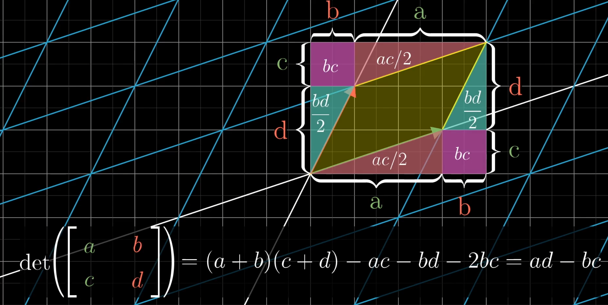

## Introduction

### Exponents

$$
\begin{aligned}

X^AX^B  &= X^{A+B} \\
\frac{X^A}{X^B} &=X^{A-B} \\
(X^A)^B&=X^{AB} \\
X^N+X^N&=X{2N} \\
2^N+2^N&=2^{N+1}

\end{aligned}

$$

### Logarithms

In computer science, all logarithms are to base 2 unless specified otherwise.

DEFINITION: x^a = b if and only if $ \log_x{b} = a $

$$
\begin{aligned}

\log_A({B}) &=\frac{\log_C{A}}{\log_B{A}}; \space C>0 \\
\log{AB} &=\log{A}+\log{B}

\end{aligned}

$$

### Series

$$
\sum_{i=0}^{N}2^i=2^{N+1}-1

$$

### Modular Arithmetic

The P Word

## 韦达定理

代数基本定理：几次方程有几个根

求一元二次方程

$$
ax^2+bx+c=0 (a\neq 0)

$$

两根

$$
x_1+x_2=-{b\over a}

$$

And

$$
x_1x_2={c\over a}

$$

so

$$
x_{1,2}={-b \pm \sqrt{b^2-4ac} \over 2a }

$$

高次方程下：

## 行列式

线性变换面积/体积缩放比例

当行列式为0时，为向量处于同一平面、直线、点

空间定向改变时，行列式为负数

ad-bc

## Newton's method

$$
X_{k+1} = X_k - \frac{f(X_k)}{f'(X_k)}, k=1,2,...

$$

## Pure Mathematics

