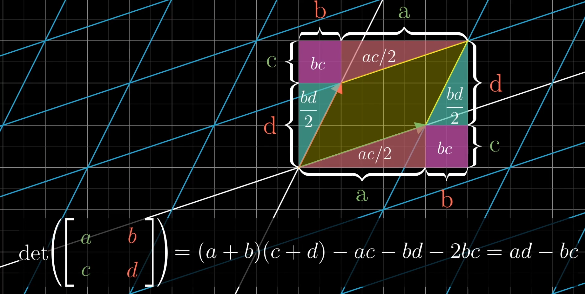

## Introduction

## Primary Math

初等数学是数学的一个类别，涵盖通常在早期教育中学习的主题。
初等数学中学习的主题（包括工具、概念等）为学习数学提供了基础。
它们包括数字、计数、算术、测量、基本数据可视化和分析等主题。

以下是一些初等数学的关键主题。

### 指数

```tex
\begin{aligned}

X^AX^B  &= X^{A+B} \\
\frac{X^A}{X^B} &=X^{A-B} \\
(X^A)^B&=X^{AB} \\
X^N+X^N&=X{2N} \\
2^N+2^N&=2^{N+1}

\end{aligned}
```

### 对数

在计算机科学中，除非另有说明，所有对数都以 2 为底。

定义：x^a = b 当且仅当 $ \log_x{b} = a $

```tex
\begin{aligned}

\log_A({B}) &=\frac{\log_C{A}}{\log_B{A}}; \space C>0 \\

\log{AB} &=\log{A}+\log{B}

\end{aligned}
```

### 级数

```tex
\sum_{i=0}^{N}2^i=2^{N+1}-1
```

### 模算术

P Word

## 韦达定理

代数基本定理：几次方程有几个根

求一元二次方程

$$
ax^2+bx+c=0 (a\neq 0)
$$

两根

$$
x_1+x_2=-{b\over a}
$$

且

$$
x_1x_2={c\over a}
$$

因此

$$
x_{1,2}={-b \pm \sqrt{b^2-4ac} \over 2a }
$$

高次方程下：

## 行列式

线性变换面积/体积缩放比例

当行列式为0时，为向量处于同一平面、直线、点

空间定向改变时，行列式为负数



ad-bc

## 牛顿法

```tex
X_{k+1} = X_k - \frac{f(X_k)}{f'(X_k)}, k=1,2,...
```

## Pure Mathematics

## 代数

代数是数学的一个分支，其中算术被扩展到使用字母和其他符号来处理未知数或关系。
它是一个广泛的领域，几乎所有其他数学领域都在一定程度上使用它。
因此，对于任何希望深入学习数学的人来说，掌握代数非常重要。

代数中使用的字母或符号称为变量。

初等代数包括变量和代数符号、简化表达式、方程、等式和不等式的性质、代入、解代数方程等概念。
这些构成了基础，最终使我们能够处理更困难的代数和数学主题。

## 几何

几何是数学的一个分支，包括对形状、大小和其他图形性质的研究。
它是最古老的数学分支之一，可能在史前时代就已使用。

### 平面几何

点表示空间中的位置。它没有维度，用点表示。点通常用大写字母标记。

线有一个维度（长度），用带箭头的线表示，指示它向两个方向无限延伸。
两个不重合的点确定一条唯一的线，我们可以用这两点或线上任何其他两点来命名该线。

平面有两个维度（长和宽），形成一个平坦的表面（如一张笔记本纸），向两个方向无限延伸。
平面可以由三个不共线的点或一个字母命名。

### 立体几何

立体几何是几何学的一个分支。
立体是多面体或非多面体。

多面体是其表面为多边形的立体。

非多面体是所有或部分表面为曲面的立体。

几何学有许多分支，根据研究方法、研究对象类型等各种标准进行分类。

**解析几何**

解析几何是研究平面和立体几何的学科，它使用代数并结合二维或三维坐标平面。
因此，它有时被称为坐标几何。

由于解析几何使用代数和坐标平面来处理几何图形，
它本质上更倾向于数值化，因此已被证明是工程师和物理学家使用的重要数学分支。

**欧氏几何**

欧氏几何是使用公理、公设和演绎推理来证明几何概念定理的平面和立体几何研究。

**非欧几何**

非欧几何通常使用欧氏几何的大部分思想，但使用不同版本的欧几里得平行公设。
在欧氏几何中，两条平行线永不相交。
在非欧几何中，根据选择的几何类型，平行线可以相交。
有两种基本类型：球面非欧几何和双曲非欧几何。

想象将欧氏几何中的平面折叠到球面或双曲面上。
在球面几何中，线是弯曲的、圆形或椭圆形的；在双曲几何中，线是抛物线或双曲线形的。

## 微积分

[微积分](/docs/Mathematics/Mathematics.md)是研究变化的数学分支。
我们使用微积分来帮助解释周围的物理世界。
物理学、统计学、经济学和医学等学科，
不仅使用微积分来解释它们面临的问题，
还用于构建可用于预测未来事件或描述过去事件的模型。

## Links
