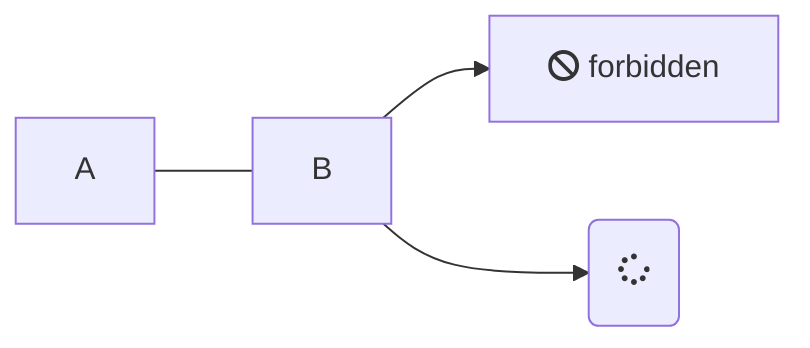
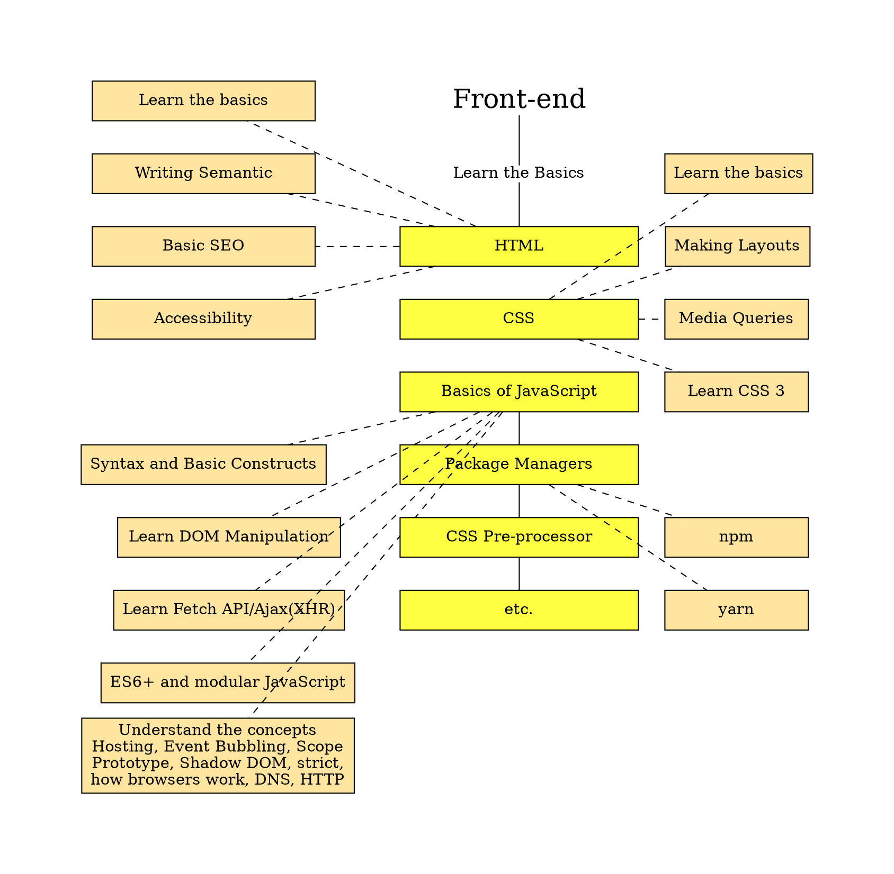
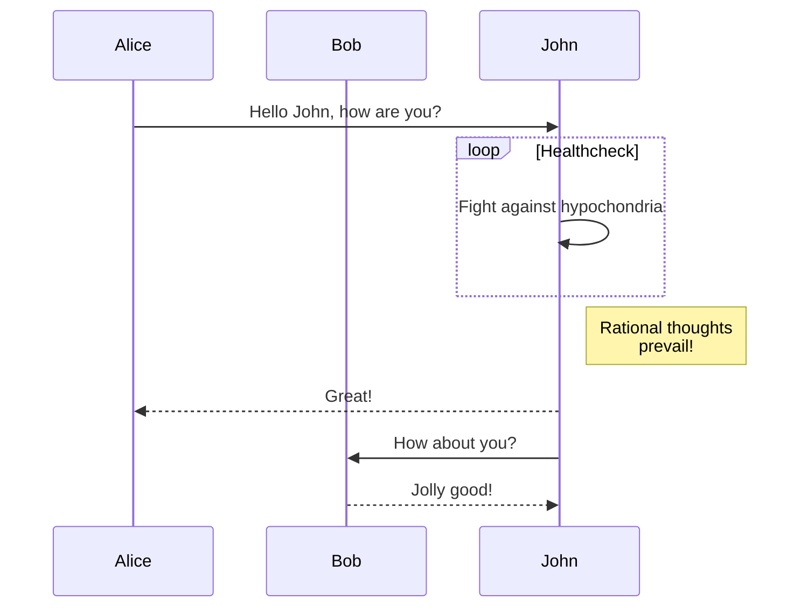
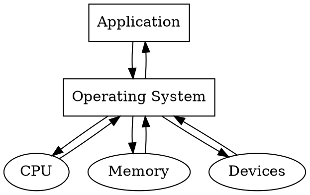

 parse -> execute;
main -> init;
main -> cleanup;
execute -> make_string;
execute -> printf
init -> make_string;
main -> printf;
execute -> compare;
}
'/>





<!-- tabs:start -->
#### **mermaid**



#### **graphviz**


<!-- tabs:end -->


 parse -> execute;
main -> init;
main -> cleanup;
execute -> make_string;
execute -> printf
init -> make_string;
main -> printf;
execute -> compare;
}
'/>


```sequence
participant User
User -->> User: send messages
participant WorkEventLoopGroup as we
participant Selector as se
we ->> se: selector.select()
se ->> we: OP_READ
participant NioByteUnsafe as ue
we ->> ue: NioUnsafe.read()
participant NioSocketChannel as so
ue ->> so: NioUnsafe.read()
so ->> ue: -1(EOF)
ue -->> ue: closeOnRead()
participant ChannelPipeline as pipe

```


```sequence
participant User
User -->> User: send messages
participant WorkEventLoopGroup as we
participant Selector as se
we ->> se: selector.select()
se ->> we: OP_READ
participant NioByteUnsafe as ue
we ->> ue: NioUnsafe.read()
participant NioSocketChannel as so
participant ChannelPipeline as pipe
ue ->> so: NioUnsafe.read()
so ->> ue: -1(EOF)
ue ->> pipe:pipeline.fire ChannelRead()
ue -->> ue: closeOnRead()

```


```flow
st=>start: User login
op=>operation: Operation
cond=>condition: Successful Yes or No?
e=>end: Into admin
st->op->cond
cond(yes)->e
cond(no)->op
```




```tex
E=mc^2
```
